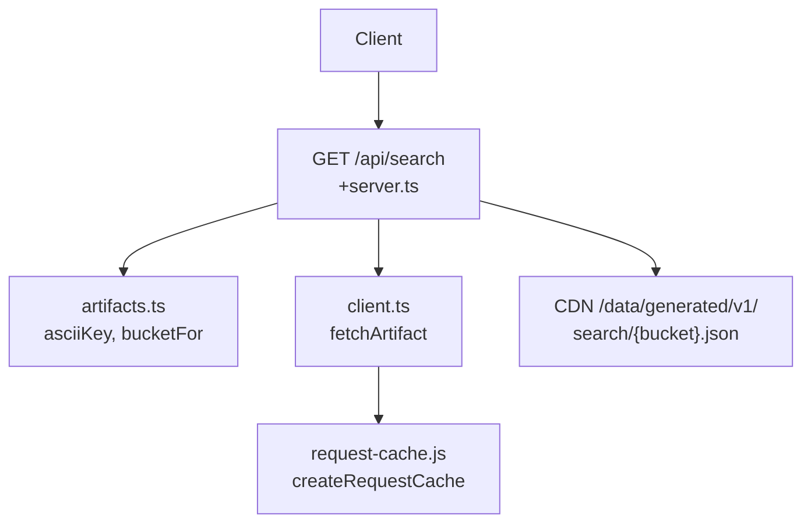
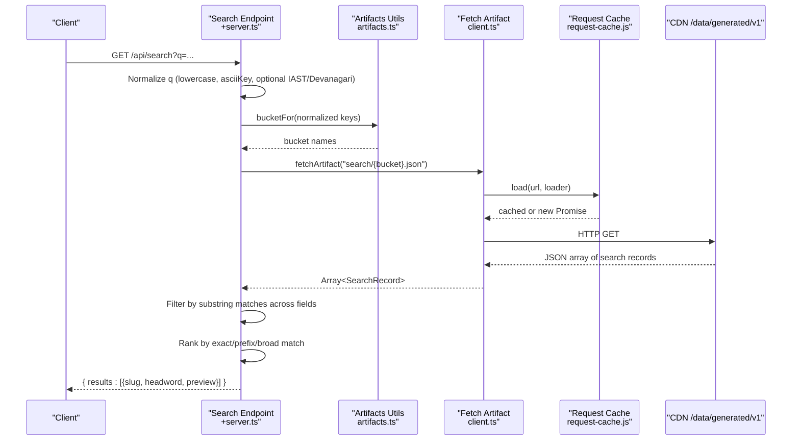
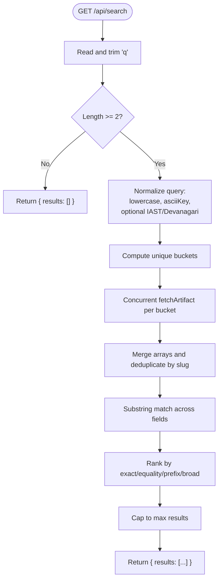
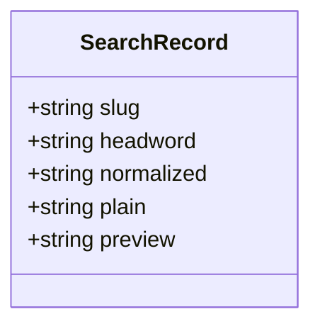
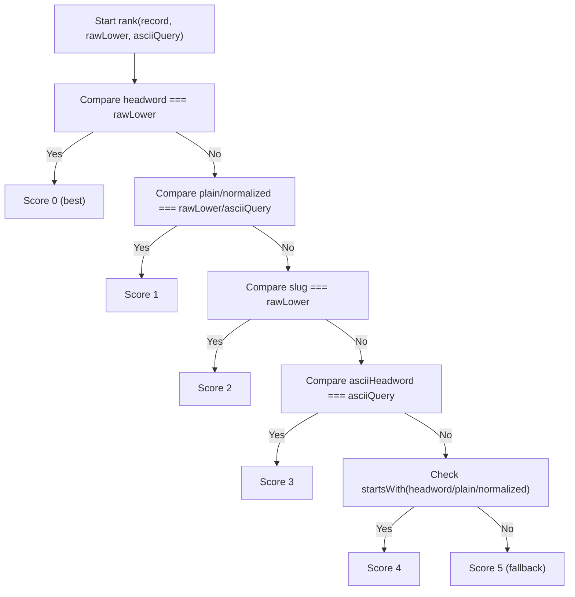
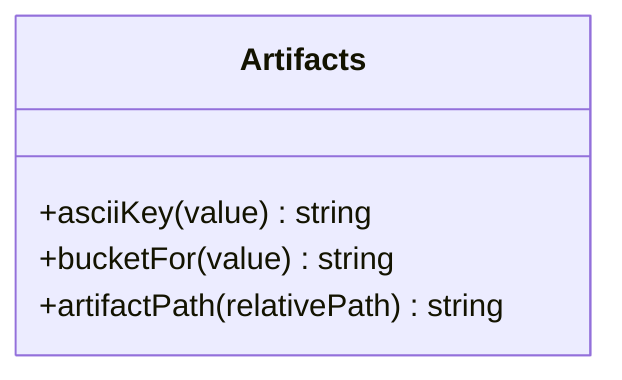
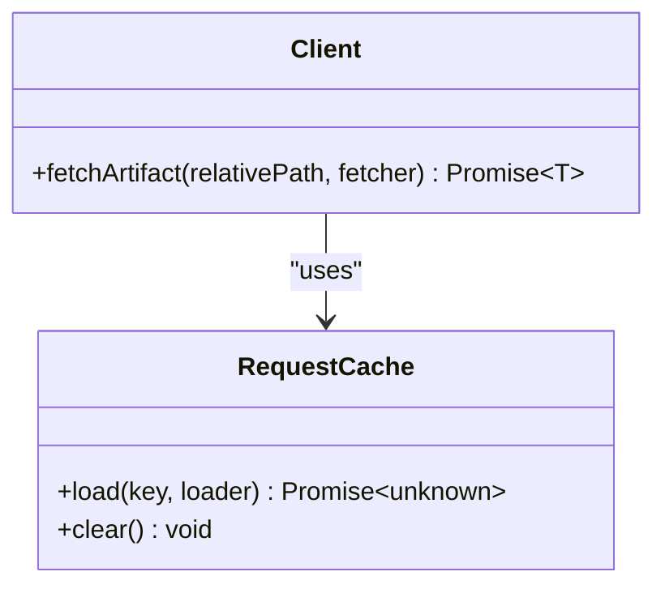
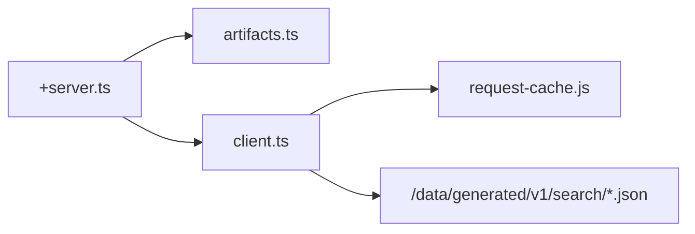

# Search API

<cite>
**Referenced Files in This Document**
- [src/routes/api/search/+server.ts](file://src/routes/api/search/+server.ts)
- [src/lib/data/artifacts.ts](file://src/lib/data/artifacts.ts)
- [src/lib/data/client.ts](file://src/lib/data/client.ts)
- [src/lib/data/request-cache.js](file://src/lib/data/request-cache.js)
- [src/lib/data/types.ts](file://src/lib/data/types.ts)
- [docs/DEVELOPERS.md](file://docs/DEVELOPERS.md)
</cite>

## Table of Contents
1. [Introduction](#introduction)
2. [Project Structure](#project-structure)
3. [Core Components](#core-components)
4. [Architecture Overview](#architecture-overview)
5. [Detailed Component Analysis](#detailed-component-analysis)
6. [Dependency Analysis](#dependency-analysis)
7. [Performance Considerations](#performance-considerations)
8. [Troubleshooting Guide](#troubleshooting-guide)
9. [Conclusion](#conclusion)
10. [Appendices](#appendices)

## Introduction
This document provides comprehensive API documentation for the Search endpoint, GET /api/search. It explains how the endpoint performs fuzzy matching across texts, roots, and concepts using precomputed search artifacts, outlines supported parameters, details the response format (including match scores, highlighted snippets, result types, and relevance rankings), and offers guidance on complex queries, faceted search patterns, autocomplete behavior, performance optimization, indexing strategies, and caching mechanisms.

## Project Structure
The Search endpoint is implemented as a SvelteKit server route that reads versioned, query-shaped JSON artifacts generated at build time. The artifacts are stored under a versioned base path and accessed via a shared client with an in-process request cache.

**Diagram sources**
- [src/routes/api/search/+server.ts:15-63](file://src/routes/api/search/+server.ts#L15-L63)
- [src/lib/data/artifacts.ts:4-18](file://src/lib/data/artifacts.ts#L4-L18)
- [src/lib/data/client.ts:6-16](file://src/lib/data/client.ts#L6-L16)
- [src/lib/data/request-cache.js:6-44](file://src/lib/data/request-cache.js#L6-L44)

**Section sources**
- [docs/DEVELOPERS.md:85-126](file://docs/DEVELOPERS.md#L85-L126)
- [docs/DEVELOPERS.md:190-202](file://docs/DEVELOPERS.md#L190-L202)

## Core Components
- Search endpoint handler: normalizes input, derives buckets, fetches artifact files, filters by substring matches, ranks results, and returns a compact payload.
- Artifact utilities: provide ASCII normalization and bucketing logic used to locate search index files.
- Data client: resolves artifact paths and wraps fetch calls with deduplication and completion caching.
- Request cache: ensures concurrent requests for the same URL are deduplicated and completed values are retained in memory during the process lifetime.

Key behaviors:
- Input normalization includes Devanagari/IAST transliteration when applicable.
- Bucket resolution targets only relevant search index shards.
- Matching uses case-insensitive substring checks across headword, slug, normalized, and plain fields.
- Ranking prioritizes exact matches, then prefix matches, then broader matches.
- Results are limited to a maximum number of entries.

**Section sources**
- [src/routes/api/search/+server.ts:15-63](file://src/routes/api/search/+server.ts#L15-L63)
- [src/lib/data/artifacts.ts:4-18](file://src/lib/data/artifacts.ts#L4-L18)
- [src/lib/data/client.ts:6-16](file://src/lib/data/client.ts#L6-L16)
- [src/lib/data/request-cache.js:6-44](file://src/lib/data/request-cache.js#L6-L44)

## Architecture Overview
The Search endpoint follows a thin-server pattern: it orchestrates artifact retrieval and lightweight filtering/ranking without performing heavy joins or full-text searches at runtime.

**Diagram sources**
- [src/routes/api/search/+server.ts:15-63](file://src/routes/api/search/+server.ts#L15-L63)
- [src/lib/data/artifacts.ts:4-18](file://src/lib/data/artifacts.ts#L4-L18)
- [src/lib/data/client.ts:6-16](file://src/lib/data/client.ts#L6-L16)
- [src/lib/data/request-cache.js:6-44](file://src/lib/data/request-cache.js#L6-L44)

## Detailed Component Analysis

### GET /api/search Endpoint
- Purpose: Perform fuzzy substring search over precomputed search artifacts for lemmas, roots, and related entities.
- Query parameter:
  - q: Required string; minimum length enforced; trimmed before processing.
- Behavior:
  - Normalizes the query into multiple forms (lowercase, ASCII key, optional IAST/Devanagari).
  - Derives one or more bucket names from the normalized keys.
  - Fetches corresponding search bucket files concurrently.
  - Filters records where any of headword, slug, normalized, or plain contains the query substring.
  - Ranks results by match quality (exact, equality, prefix, broad).
  - Returns up to a fixed maximum number of results.
- Response shape:
  - results: array of objects with slug, headword, preview.
- Notes:
  - No explicit limit parameter is exposed; the implementation caps results internally.
  - No scope filter or sorting options are exposed; ranking is deterministic based on field comparisons.

**Diagram sources**
- [src/routes/api/search/+server.ts:15-63](file://src/routes/api/search/+server.ts#L15-L63)

**Section sources**
- [src/routes/api/search/+server.ts:15-63](file://src/routes/api/search/+server.ts#L15-L63)
- [docs/DEVELOPERS.md:190-202](file://docs/DEVELOPERS.md#L190-L202)

### Search Record Model
- Fields:
  - slug: stable identifier used for navigation and linking.
  - headword: display form of the term.
  - normalized: canonicalized form used for matching.
  - plain: plain text representation used for matching.
  - preview: short snippet included in responses.
- Usage:
  - Used as the unit of search results and ranking.
  - Preview serves as the highlighted snippet in UIs.

**Diagram sources**
- [src/routes/api/search/+server.ts:7-13](file://src/routes/api/search/+server.ts#L7-L13)

**Section sources**
- [src/routes/api/search/+server.ts:7-13](file://src/routes/api/search/+server.ts#L7-L13)

### Ranking Algorithm
- Exact headword match receives highest priority.
- Equality between plain/normalized and query variants receives next priority.
- Slug equality and ASCII headword equality follow.
- Prefix matches receive lower priority.
- Broad substring matches receive lowest priority.

**Diagram sources**
- [src/routes/api/search/+server.ts:65-78](file://src/routes/api/search/+server.ts#L65-L78)

**Section sources**
- [src/routes/api/search/+server.ts:65-78](file://src/routes/api/search/+server.ts#L65-L78)

### Artifact Utilities and Path Resolution
- asciiKey: Normalizes Unicode strings to ASCII-friendly keys for consistent bucketing and matching.
- bucketFor: Computes shard names based on the first two characters of the normalized key.
- artifactPath: Resolves relative artifact paths to the versioned base URL.

**Diagram sources**
- [src/lib/data/artifacts.ts:4-18](file://src/lib/data/artifacts.ts#L4-L18)
- [src/lib/data/artifacts.ts:24-26](file://src/lib/data/artifacts.ts#L24-L26)

**Section sources**
- [src/lib/data/artifacts.ts:4-18](file://src/lib/data/artifacts.ts#L4-L18)
- [src/lib/data/artifacts.ts:24-26](file://src/lib/data/artifacts.ts#L24-L26)

### Data Client and Request Cache
- fetchArtifact: Builds the full artifact URL, performs fetch, validates response, parses JSON, and caches the result.
- createRequestCache: Deduplicates concurrent requests and retains completed values in memory for the process lifetime.

**Diagram sources**
- [src/lib/data/client.ts:6-16](file://src/lib/data/client.ts#L6-L16)
- [src/lib/data/request-cache.js:6-44](file://src/lib/data/request-cache.js#L6-L44)

**Section sources**
- [src/lib/data/client.ts:6-16](file://src/lib/data/client.ts#L6-L16)
- [src/lib/data/request-cache.js:6-44](file://src/lib/data/request-cache.js#L6-L44)

## Dependency Analysis
The Search endpoint depends on artifact utilities for normalization and bucketing, and on the data client for fetching and caching. The request cache ensures efficient concurrent access and avoids redundant network calls.

**Diagram sources**
- [src/routes/api/search/+server.ts:15-63](file://src/routes/api/search/+server.ts#L15-L63)
- [src/lib/data/artifacts.ts:4-18](file://src/lib/data/artifacts.ts#L4-L18)
- [src/lib/data/client.ts:6-16](file://src/lib/data/client.ts#L6-L16)
- [src/lib/data/request-cache.js:6-44](file://src/lib/data/request-cache.js#L6-L44)

**Section sources**
- [docs/DEVELOPERS.md:130-148](file://docs/DEVELOPERS.md#L130-L148)

## Performance Considerations
- Precomputed artifacts: Search indexes are built offline and served as small JSON shards, minimizing runtime computation.
- Bounded requests: Only relevant buckets are fetched, avoiding full-corpus scans.
- In-memory caching: Completed values and in-flight promise deduplication reduce repeated work within the process.
- Substring matching: Lightweight string operations keep CPU usage low; avoid overly long queries to minimize scanning.
- Result cap: Internal limit prevents large payloads and downstream rendering costs.
- CDN caching: Static deployment assets benefit from browser and CDN caching policies.

[No sources needed since this section provides general guidance]

## Troubleshooting Guide
- Empty results:
  - Ensure the query meets the minimum length requirement.
  - Verify that the search artifacts exist for the expected buckets.
- Unexpected ordering:
  - Ranking is deterministic based on exactness and prefix matches; adjust expectations accordingly.
- Network errors:
  - Check artifact availability and HTTP status codes; failed requests are retried due to cache behavior.
- Stale results:
  - Clear the process-level cache if necessary; ensure artifact versions are updated consistently.

**Section sources**
- [src/routes/api/search/+server.ts:15-20](file://src/routes/api/search/+server.ts#L15-L20)
- [src/lib/data/client.ts:10-16](file://src/lib/data/client.ts#L10-L16)
- [src/lib/data/request-cache.js:18-36](file://src/lib/data/request-cache.js#L18-L36)

## Conclusion
The Search endpoint delivers fast, fuzzy substring search over precomputed artifacts with deterministic ranking and minimal runtime overhead. It is optimized for autocomplete and exploratory search scenarios. For advanced features like faceted search or custom sorting, consider extending the endpoint or building client-side aggregations over the returned results.

[No sources needed since this section summarizes without analyzing specific files]

## Appendices

### API Definition: GET /api/search
- Method: GET
- Path: /api/search
- Query parameters:
  - q: string (required, minimum length enforced)
- Response body:
  - results: array of objects
    - slug: string
    - headword: string
    - preview: string
- Behavior highlights:
  - Fuzzy substring matching across headword, slug, normalized, and plain fields.
  - Deterministic ranking by exactness and prefix matches.
  - Internal result cap applied.

**Section sources**
- [src/routes/api/search/+server.ts:15-63](file://src/routes/api/search/+server.ts#L15-L63)
- [docs/DEVELOPERS.md:190-202](file://docs/DEVELOPERS.md#L190-L202)

### Examples of Complex Queries
- Multi-script queries:
  - Provide Devanagari or IAST terms; the endpoint normalizes and attempts transliteration when applicable.
- Prefix-heavy queries:
  - Short prefixes leverage higher-ranking prefix matches.
- Mixed ASCII and Unicode:
  - asciiKey normalization ensures consistent matching across scripts.

[No sources needed since this section provides general guidance]

### Faceted Search Implementation
- Use the returned results to compute facets client-side (e.g., grouping by type inferred from slugs or previews).
- Combine with additional endpoints (e.g., graph or excerpts) to enrich facets.

[No sources needed since this section provides general guidance]

### Autocomplete Suggestions
- Debounce user input and issue GET /api/search with short prefixes.
- Display headword and preview; navigate via slug.

[No sources needed since this section provides general guidance]

### Indexing Strategies
- Build-time generation of search buckets ensures bounded file sizes and predictable routing.
- Bucket naming uses normalized keys for even distribution.

**Section sources**
- [docs/DEVELOPERS.md:85-126](file://docs/DEVELOPERS.md#L85-L126)

### Result Caching Mechanisms
- Process-level cache deduplicates concurrent requests and retains completed values.
- Browser and CDN cache static artifacts.

**Section sources**
- [src/lib/data/request-cache.js:6-44](file://src/lib/data/request-cache.js#L6-L44)
- [docs/DEVELOPERS.md:130-148](file://docs/DEVELOPERS.md#L130-L148)