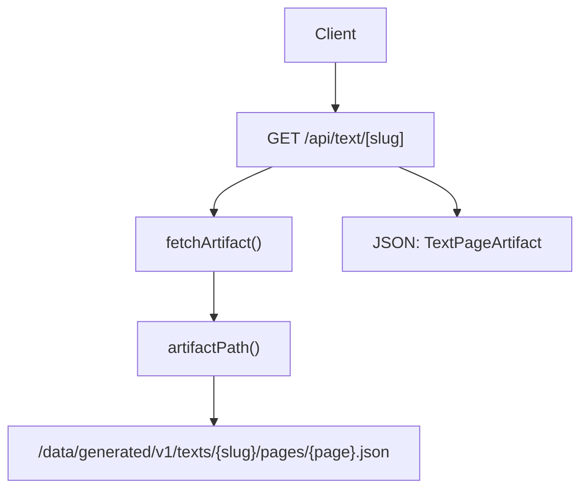
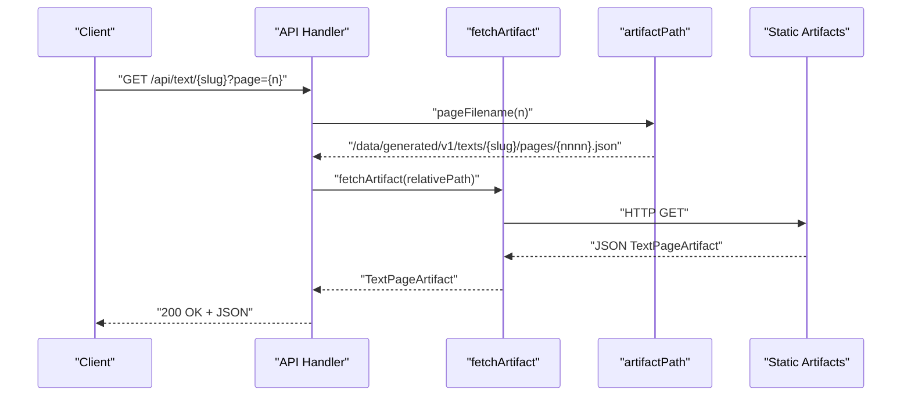
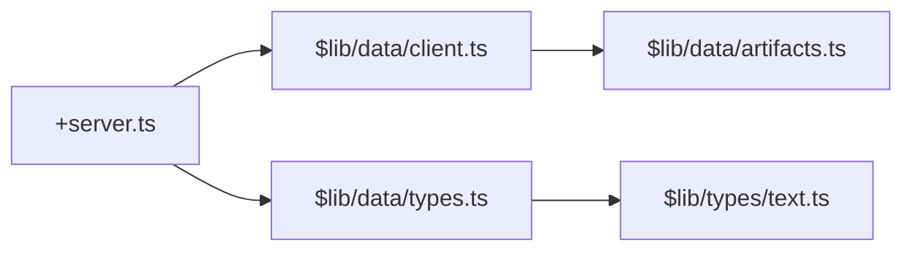

# Text API

<cite>
**Referenced Files in This Document**
- [src/routes/api/text/[slug]/+server.ts](file://src/routes/api/text/[slug]/+server.ts)
- [src/lib/data/client.ts](file://src/lib/data/client.ts)
- [src/lib/data/artifacts.ts](file://src/lib/data/artifacts.ts)
- [src/lib/data/types.ts](file://src/lib/data/types.ts)
- [src/lib/types/text.ts](file://src/lib/types/text.ts)
- [src/routes/text/[slug]/+page.ts](file://src/routes/text/[slug]/+page.ts)
- [src/routes/text/[slug]/+page.svelte](file://src/routes/text/[slug]/+page.svelte)
- [src/lib/components/text-reader.svelte](file://src/lib/components/text-reader.svelte)
- [src/routes/+error.svelte](file://src/routes/+error.svelte)
</cite>

## Table of Contents
1. [Introduction](#introduction)
2. [Project Structure](#project-structure)
3. [Core Components](#core-components)
4. [Architecture Overview](#architecture-overview)
5. [Detailed Component Analysis](#detailed-component-analysis)
6. [Dependency Analysis](#dependency-analysis)
7. [Performance Considerations](#performance-considerations)
8. [Troubleshooting Guide](#troubleshooting-guide)
9. [Conclusion](#conclusion)

## Introduction
This document provides detailed API documentation for the Text endpoint that returns structured text data for a given text slug and page. It focuses on the GET /api/text/[slug] endpoint, explaining URL parameters, query parameters, response structure, error handling, and integration patterns with the text reader components. The endpoint is designed to serve paginated verse content from prebuilt artifacts, enabling efficient rendering of large text corpora.

## Project Structure
The Text API endpoint is implemented as a SvelteKit server route under src/routes/api/text/[slug]/+server.ts. It reads prebuilt artifacts via a shared client utility and returns JSON responses. The same artifact format is used by the server-side page loader and the client-side text reader component.

**Diagram sources**
- [src/routes/api/text/[slug]/+server.ts:7-18](file://src/routes/api/text/[slug]/+server.ts#L7-L18)
- [src/lib/data/client.ts:6-16](file://src/lib/data/client.ts#L6-L16)
- [src/lib/data/artifacts.ts:20-26](file://src/lib/data/artifacts.ts#L20-L26)

**Section sources**
- [src/routes/api/text/[slug]/+server.ts:1-19](file://src/routes/api/text/[slug]/+server.ts#L1-L19)
- [src/lib/data/client.ts:1-17](file://src/lib/data/client.ts#L1-L17)
- [src/lib/data/artifacts.ts:1-27](file://src/lib/data/artifacts.ts#L1-L27)

## Core Components
- API Endpoint: GET /api/text/[slug] returns a single page of verses for the specified text slug.
- Artifact Client: fetchArtifact retrieves JSON artifacts from the generated data directory with caching.
- Artifact Pathing: pageFilename and artifactPath generate stable URLs for versioned artifacts.
- Data Types: TextPageArtifact defines the shape of the response, including pagination and verses.
- Verse Model: Verse and Token define the structure of each verse and its word-level annotations.

Key responsibilities:
- Parse and validate query parameters (page).
- Resolve artifact path for the requested page.
- Fetch and return the artifact JSON or a 404 error if not found.

**Section sources**
- [src/routes/api/text/[slug]/+server.ts:7-18](file://src/routes/api/text/[slug]/+server.ts#L7-L18)
- [src/lib/data/client.ts:6-16](file://src/lib/data/client.ts#L6-L16)
- [src/lib/data/artifacts.ts:20-26](file://src/lib/data/artifacts.ts#L20-L26)
- [src/lib/data/types.ts:23-32](file://src/lib/data/types.ts#L23-L32)
- [src/lib/types/text.ts:6-24](file://src/lib/types/text.ts#L6-L24)

## Architecture Overview
The Text API endpoint composes a minimal request handler with a shared artifact retrieval layer. It does not perform complex transformations; it delegates artifact fetching to fetchArtifact and returns the resulting JSON. The same artifact schema is consumed by the server-side page loader and the client-side reader component.

**Diagram sources**
- [src/routes/api/text/[slug]/+server.ts:7-18](file://src/routes/api/text/[slug]/+server.ts#L7-L18)
- [src/lib/data/client.ts:6-16](file://src/lib/data/client.ts#L6-L16)
- [src/lib/data/artifacts.ts:20-26](file://src/lib/data/artifacts.ts#L20-L26)

## Detailed Component Analysis

### GET /api/text/[slug] Endpoint
- URL parameter:
  - slug: Identifies the text. Must correspond to a prebuilt artifact directory texts/{slug}/pages/.
- Query parameters:
  - page: Integer >= 1. Defaults to 1 if missing or invalid. Controls which source page file is returned.
- Behavior:
  - Computes pageFilename(page) and fetches texts/{slug}/pages/{pageFilename}.
  - Returns the JSON body directly.
  - On failure, returns 404 with an error message indicating missing text or page.

Response:
- 200 OK: JSON object matching TextPageArtifact.
- 404 Not Found: JSON object with an error field describing the issue.

Example requests:
- GET /api/text/yogasutra?page=1
- GET /api/text/mahabharata-part-1?page=3

Integration notes:
- Consumers should handle 404 gracefully and present user-friendly messages.
- For navigation, clients can compute totalPages from the response and derive next/prev links using page increments.

**Section sources**
- [src/routes/api/text/[slug]/+server.ts:7-18](file://src/routes/api/text/[slug]/+server.ts#L7-L18)

### Artifact Retrieval Layer
- fetchArtifact:
  - Normalizes relative paths via artifactPath.
  - Performs HTTP GET and parses JSON.
  - Throws on non-OK responses.
  - Uses a request cache to avoid duplicate network calls within the process lifetime.
- artifactPath and pageFilename:
  - artifactPath prefixes with /data/generated/v1 to ensure versioned access.
  - pageFilename pads page numbers to four digits for consistent ordering.

Error propagation:
- Non-OK responses result in thrown errors, which are caught by the API handler and converted into a 404 JSON response.

**Section sources**
- [src/lib/data/client.ts:6-16](file://src/lib/data/client.ts#L6-L16)
- [src/lib/data/artifacts.ts:20-26](file://src/lib/data/artifacts.ts#L20-L26)

### Data Models and Response Structure
TextPageArtifact fields:
- title: string
- slug: string
- page: number
- limit: number
- total: number
- totalPages: number
- hasMore: boolean
- verses: array of Verse

Verse fields:
- index: number
- reference: string
- devanagari: string
- iast: string
- translation?: string
- tokens: array of Token

Token fields:
- id?: number
- form: string
- lemma: string
- lemma_id: number
- upos: string
- feats?: string
- slug?: string
- compoundEnd?: number

These types are shared between the API, server-side loader, and client components, ensuring consistency across the stack.

**Section sources**
- [src/lib/data/types.ts:23-32](file://src/lib/data/types.ts#L23-L32)
- [src/lib/types/text.ts:6-24](file://src/lib/types/text.ts#L6-L24)

### Server-Side Page Loader (for comparison)
The server-side page loader demonstrates how meta, references, and multiple source pages are combined to produce a display page with configurable limit. While the API endpoint returns a single source page artifact directly, the loader shows how larger display pages are assembled from source pages.

Key behaviors:
- Validates page and limit parameters.
- Computes totalPages based on meta.verseCount and limit.
- Loads meta.json, references.json, and one or more source page files.
- Assembles a unified TextPageArtifact for the requested display page.

**Section sources**
- [src/routes/text/[slug]/+page.ts:8-50](file://src/routes/text/[slug]/+page.ts#L8-L50)

### Client-Side Reader Integration
The text reader component consumes a slice of verses and supports three script modes: Devanāgarī, IAST, and Both. It renders word-level annotations and highlights active words via a global navigation store. Pagination state is owned by the parent page, while the reader remains pure and focused on presentation.

Script selection:
- devanagari: Shows only Devanāgarī text.
- iast: Shows only IAST transliteration.
- both: Shows both columns side-by-side.

Word interactions:
- Clicking a word sets the active word in the navigation store and opens the context lens.
- Compound tokens are handled with component lists for richer tooltips.

**Section sources**
- [src/lib/components/text-reader.svelte:15-23](file://src/lib/components/text-reader.svelte#L15-L23)
- [src/lib/components/text-reader.svelte:65-74](file://src/lib/components/text-reader.svelte#L65-L74)
- [src/routes/text/[slug]/+page.svelte:103-107](file://src/routes/text/[slug]/+page.svelte#L103-L107)

## Dependency Analysis
The API endpoint depends on:
- @sveltejs/kit for request handling and JSON serialization.
- $lib/data/client for artifact fetching and caching.
- $lib/data/artifacts for path generation and versioning.
- $lib/data/types for TypeScript definitions.

**Diagram sources**
- [src/routes/api/text/[slug]/+server.ts:1-6](file://src/routes/api/text/[slug]/+server.ts#L1-L6)
- [src/lib/data/client.ts:1-17](file://src/lib/data/client.ts#L1-L17)
- [src/lib/data/artifacts.ts:1-27](file://src/lib/data/artifacts.ts#L1-L27)
- [src/lib/data/types.ts:1-32](file://src/lib/data/types.ts#L1-L32)
- [src/lib/types/text.ts:1-24](file://src/lib/types/text.ts#L1-L24)

**Section sources**
- [src/routes/api/text/[slug]/+server.ts:1-6](file://src/routes/api/text/[slug]/+server.ts#L1-L6)
- [src/lib/data/client.ts:1-17](file://src/lib/data/client.ts#L1-L17)
- [src/lib/data/artifacts.ts:1-27](file://src/lib/data/artifacts.ts#L1-L27)
- [src/lib/data/types.ts:1-32](file://src/lib/data/types.ts#L1-L32)
- [src/lib/types/text.ts:1-24](file://src/lib/types/text.ts#L1-L24)

## Performance Considerations
- Prebuilt artifacts: All text data is served from static JSON files under /data/generated/v1, avoiding runtime database queries.
- Request caching: fetchArtifact uses an in-process cache to deduplicate concurrent requests during a single run.
- Source page granularity: Each source page contains a fixed number of verses (pageSize), minimizing payload size per request.
- Limit validation: The server-side loader enforces allowed limits (20, 50, 100) to prevent oversized payloads. The API endpoint returns a single source page, inherently bounded.
- Versioned base path: ARTIFACT_VERSION ensures cache-busting and safe evolution of artifact formats.

Recommendations:
- Use appropriate page sizes for your UI needs.
- Cache responses at the CDN or browser level when possible.
- Avoid frequent re-fetching of the same page; rely on the built-in request cache during server execution.

[No sources needed since this section provides general guidance]

## Troubleshooting Guide
Common issues and resolutions:
- 404 Not Found:
  - Cause: Missing text slug or invalid page number.
  - Resolution: Verify slug exists in the artifact directory and page is within valid range.
- Invalid page parameter:
  - Behavior: Defaults to page 1 if missing or non-positive.
  - Resolution: Ensure clients pass integer values >= 1.
- Network errors:
  - Cause: Artifact files unavailable or malformed JSON.
  - Resolution: Check artifact generation pipeline and verify file integrity.

Global error page:
- The application’s error page displays status codes and friendly messages for 404 and 500 cases.

**Section sources**
- [src/routes/api/text/[slug]/+server.ts:15-17](file://src/routes/api/text/[slug]/+server.ts#L15-L17)
- [src/routes/+error.svelte:1-18](file://src/routes/+error.svelte#L1-L18)

## Conclusion
The Text API endpoint offers a simple, efficient way to retrieve structured text data for a specific text slug and page. By leveraging prebuilt artifacts and a shared artifact client, it ensures consistent performance and predictable responses. Clients can integrate seamlessly with the text reader component, supporting flexible script display options and rich word-level annotations. Proper error handling and caching strategies make it suitable for large text corpora and high-traffic scenarios.