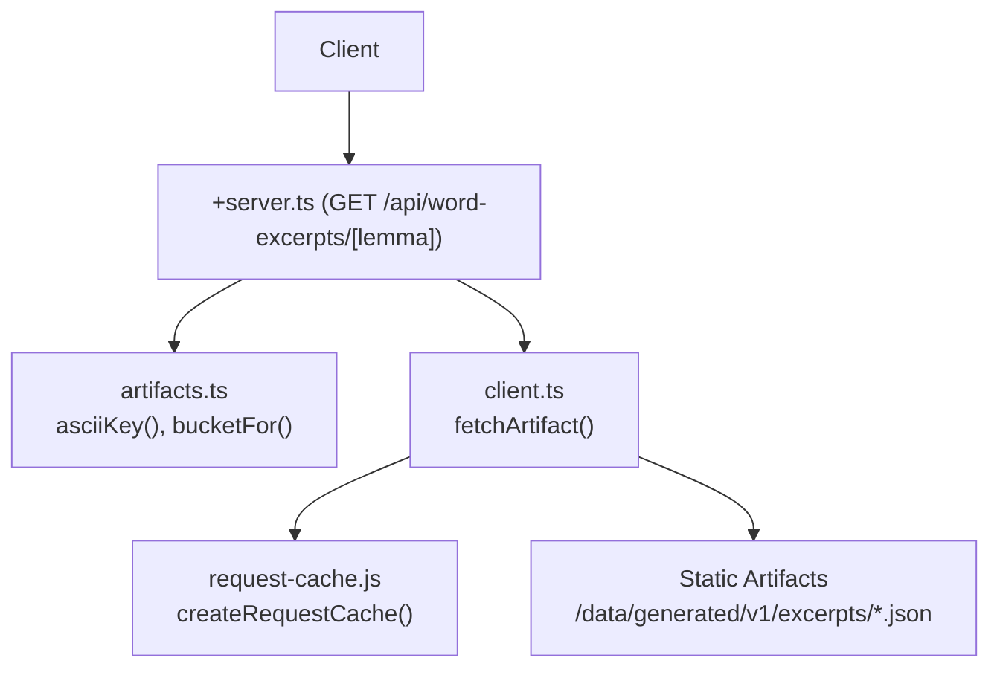
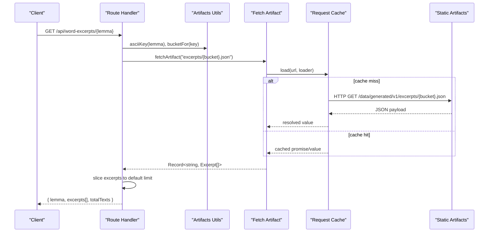
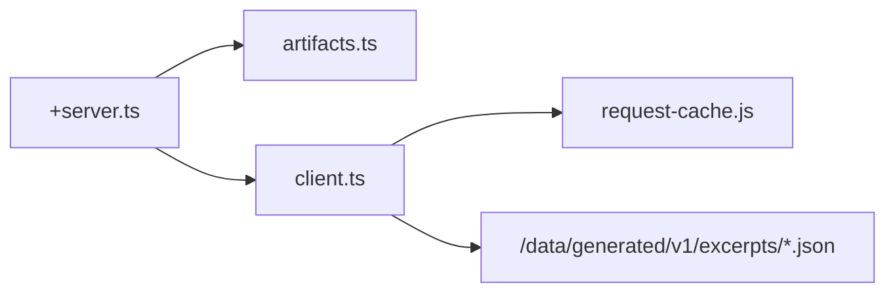

# Word Excerpts API

<cite>
**Referenced Files in This Document**
- [src/routes/api/word-excerpts/[lemma]/+server.ts](file://src/routes/api/word-excerpts/\[lemma\]/+server.ts)
- [src/lib/data/artifacts.ts](file://src/lib/data/artifacts.ts)
- [src/lib/data/client.ts](file://src/lib/data/client.ts)
- [src/lib/data/request-cache.js](file://src/lib/data/request-cache.js)
- [scripts/build-lemma-concordance.mjs](file://scripts/build-lemma-concordance.mjs)
</cite>

## Table of Contents
1. [Introduction](#introduction)
2. [Project Structure](#project-structure)
3. [Core Components](#core-components)
4. [Architecture Overview](#architecture-overview)
5. [Detailed Component Analysis](#detailed-component-analysis)
6. [Dependency Analysis](#dependency-analysis)
7. [Performance Considerations](#performance-considerations)
8. [Troubleshooting Guide](#troubleshooting-guide)
9. [Conclusion](#conclusion)

## Introduction
This document provides comprehensive API documentation for the Word Excerpts endpoint, which returns concordance information and contextual usage examples for a given lemma. The endpoint retrieves precomputed excerpts from static artifacts and returns a concise response suitable for lexical analysis tools and concordance displays.

## Project Structure
The Word Excerpts endpoint is implemented as a SvelteKit route handler that:
- Normalizes the lemma parameter into an ASCII key
- Locates the appropriate artifact bucket
- Loads the excerpts data via a cached fetch utility
- Returns a limited set of excerpts with metadata

**Diagram sources**
- [src/routes/api/word-excerpts/[lemma]/+server.ts](file://src/routes/api/word-excerpts/\[lemma\]/+server.ts)
- [src/lib/data/artifacts.ts](file://src/lib/data/artifacts.ts)
- [src/lib/data/client.ts](file://src/lib/data/client.ts)
- [src/lib/data/request-cache.js](file://src/lib/data/request-cache.js)

**Section sources**
- [src/routes/api/word-excerpts/[lemma]/+server.ts](file://src/routes/api/word-excerpts/\[lemma\]/+server.ts)
- [src/lib/data/artifacts.ts](file://src/lib/data/artifacts.ts)
- [src/lib/data/client.ts](file://src/lib/data/client.ts)
- [src/lib/data/request-cache.js](file://src/lib/data/request-cache.js)

## Core Components
- GET /api/word-excerpts/[lemma]: Returns excerpts for a normalized lemma.
- asciiKey and bucketFor: Normalize lemmas and compute artifact bucket filenames.
- fetchArtifact: Fetches JSON artifacts with request deduplication and caching.
- Request cache: In-process cache to avoid duplicate concurrent requests.

Key behaviors:
- Lemma normalization removes diacritics and leading root markers, lowercases, and sanitizes characters.
- Bucketing groups artifacts by first two characters of the normalized key.
- Response includes a fixed excerpt limit and total count.

**Section sources**
- [src/routes/api/word-excerpts/[lemma]/+server.ts](file://src/routes/api/word-excerpts/\[lemma\]/+server.ts)
- [src/lib/data/artifacts.ts](file://src/lib/data/artifacts.ts)
- [src/lib/data/client.ts](file://src/lib/data/client.ts)
- [src/lib/data/request-cache.js](file://src/lib/data/request-cache.js)

## Architecture Overview
The endpoint follows a simple pipeline:
- Parse and normalize the URL parameter
- Compute artifact path using bucketing
- Load artifact through a cached fetcher
- Slice results to a safe default size
- Return structured JSON

**Diagram sources**
- [src/routes/api/word-excerpts/[lemma]/+server.ts](file://src/routes/api/word-excerpts/\[lemma\]/+server.ts)
- [src/lib/data/artifacts.ts](file://src/lib/data/artifacts.ts)
- [src/lib/data/client.ts](file://src/lib/data/client.ts)
- [src/lib/data/request-cache.js](file://src/lib/data/request-cache.js)

## Detailed Component Analysis

### Endpoint Specification
- Method: GET
- Path: /api/word-excerpts/[lemma]
- Purpose: Retrieve concordance excerpts and contextual usage for a lemma.

URL Parameters:
- lemma: string
  - Accepts any Unicode lemma; internally normalized to ASCII key.
  - Leading root marker is stripped during normalization.

Query Parameters:
- Not supported by this endpoint. Limits and sorting are not exposed via query parameters.

Response Body:
- lemma: string — normalized lemma used for lookup
- excerpts: array of Excerpt objects
  - textSlug: string — identifier for the source text
  - title: string — human-readable title of the source text
  - reference: string — canonical reference within the text
  - snippet: string — surrounding context around the surface form
  - verseIndex: number — position index within the text
  - surface: string — exact surface form matched
- totalTexts: number — total number of excerpts available before slicing

Notes:
- The response always includes excerpts and totalTexts, even when no matches are found.
- The server slices excerpts to a maximum of 30 entries per request.

Error Behavior:
- On artifact retrieval failure or missing data, the endpoint returns an empty excerpts array and totalTexts of 0.

**Section sources**
- [src/routes/api/word-excerpts/[lemma]/+server.ts](file://src/routes/api/word-excerpts/\[lemma\]/+server.ts)

### Data Model: Excerpt
The Excerpt type defines the shape of each concordance entry returned by the endpoint.

Fields:
- textSlug: string
- title: string
- reference: string
- snippet: string
- verseIndex: number
- surface: string

Complexity:
- Each Excerpt is a small object; arrays are sliced to a fixed size at the server.

**Section sources**
- [src/routes/api/word-excerpts/[lemma]/+server.ts](file://src/routes/api/word-excerpts/\[lemma\]/+server.ts)

### Lemma Normalization and Bucketing
Normalization ensures consistent keys across different Unicode representations and root markers. Bucketing distributes artifacts across directories based on the first two characters of the normalized key.

Functions:
- asciiKey(value): Normalizes Unicode to ASCII, lowercases, strips root markers, and replaces non-alphanumeric segments.
- bucketFor(value): Computes a two-character prefix bucket name from the normalized key.

**Section sources**
- [src/lib/data/artifacts.ts](file://src/lib/data/artifacts.ts)

### Artifact Fetching and Caching
The fetchArtifact function constructs the full artifact URL and loads it through a request cache that deduplicates concurrent requests and caches successful responses in memory.

Behavior:
- Builds URL using artifactPath helper.
- Wraps fetch calls with createRequestCache().load to prevent duplicate network calls.
- Throws on non-OK HTTP responses.

**Section sources**
- [src/lib/data/client.ts](file://src/lib/data/client.ts)
- [src/lib/data/request-cache.js](file://src/lib/data/request-cache.js)

### Concordance Data Generation
Concordance samples and distribution statistics are generated offline by a build script that parses lemma markdown files and produces static artifacts consumed by the API.

Highlights:
- Parses properties, dictionary definitions, semantic classification, distribution, and concordance sections from lemma markdown.
- Produces top distribution rows and sample concordance entries.
- Outputs a consolidated JSON file used by other parts of the system.

Note:
- The Word Excerpts endpoint reads separate excerpt artifacts stored under /data/generated/v1/excerpts/*, while the build script generates a separate lemma-concordance dataset.

**Section sources**
- [scripts/build-lemma-concordance.mjs](file://scripts/build-lemma-concordance.mjs)

## Dependency Analysis
The endpoint depends on utilities for normalization, artifact path resolution, and request caching.

**Diagram sources**
- [src/routes/api/word-excerpts/[lemma]/+server.ts](file://src/routes/api/word-excerpts/\[lemma\]/+server.ts)
- [src/lib/data/artifacts.ts](file://src/lib/data/artifacts.ts)
- [src/lib/data/client.ts](file://src/lib/data/client.ts)
- [src/lib/data/request-cache.js](file://src/lib/data/request-cache.js)

**Section sources**
- [src/routes/api/word-excerpts/[lemma]/+server.ts](file://src/routes/api/word-excerpts/\[lemma\]/+server.ts)
- [src/lib/data/artifacts.ts](file://src/lib/data/artifacts.ts)
- [src/lib/data/client.ts](file://src/lib/data/client.ts)
- [src/lib/data/request-cache.js](file://src/lib/data/request-cache.js)

## Performance Considerations
- Fixed excerpt limit: The server caps excerpts to 30 entries per request to control payload size.
- In-memory request cache: Concurrent identical requests are deduplicated and served from cache within the process lifetime.
- Static artifacts: Data is served from prebuilt JSON files, avoiding runtime computation.
- No pagination or sorting parameters: Clients should handle client-side pagination if needed and rely on the provided totalTexts.

Recommendations:
- Cache responses at the client layer for frequently accessed lemmas.
- Use browser or CDN caching headers where applicable.
- Avoid repeated identical requests within the same process to leverage the built-in cache.

[No sources needed since this section provides general guidance]

## Troubleshooting Guide
Common issues and resolutions:
- Empty excerpts array:
  - Cause: Missing artifact or no matching key in the bucket.
  - Resolution: Verify lemma normalization and ensure the corresponding artifact exists.
- Non-OK HTTP response:
  - Cause: Artifact file not found or server error.
  - Resolution: Check artifact generation and deployment paths.
- Unexpected lemma format:
  - Cause: Unicode variations or root markers.
  - Resolution: Ensure the lemma is passed as-is; normalization handles diacritics and root markers.

**Section sources**
- [src/routes/api/word-excerpts/[lemma]/+server.ts](file://src/routes/api/word-excerpts/\[lemma\]/+server.ts)
- [src/lib/data/client.ts](file://src/lib/data/client.ts)

## Conclusion
The Word Excerpts endpoint provides a fast, predictable way to retrieve concordance excerpts for lemmas using normalized keys and static artifacts. It leverages in-memory request caching and fixed-size responses to maintain performance. For advanced filtering or larger datasets, clients can implement local caching and pagination strategies.

[No sources needed since this section summarizes without analyzing specific files]