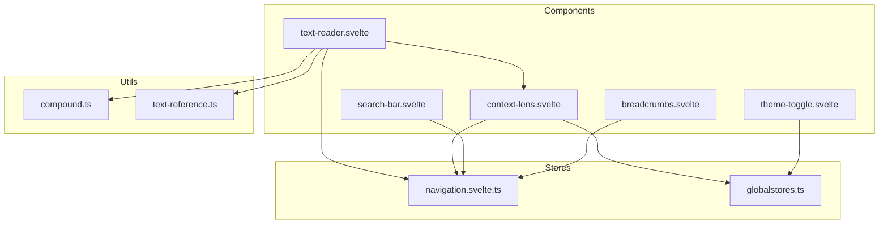
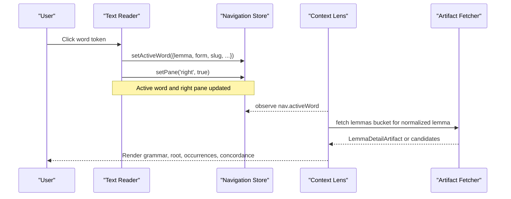
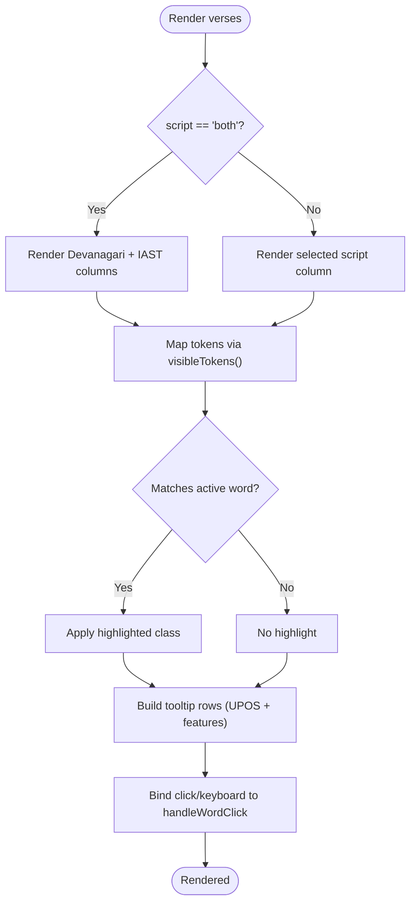
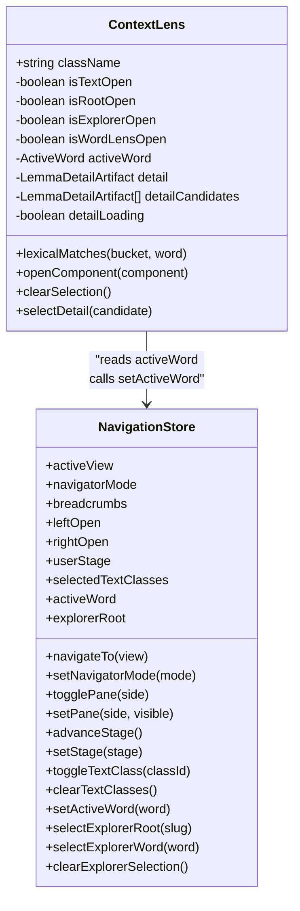
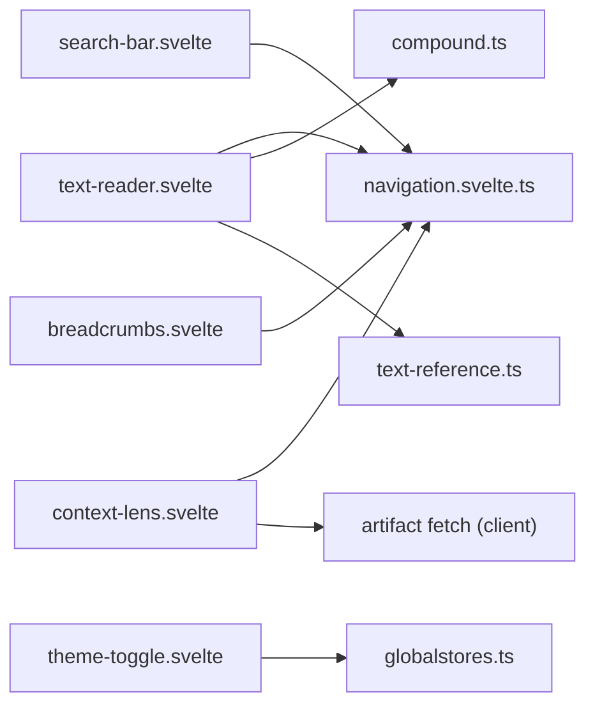

# Components Library

<cite>
**Referenced Files in This Document**
- [text-reader.svelte](file://src/lib/components/text-reader.svelte)
- [context-lens.svelte](file://src/lib/components/context-lens.svelte)
- [breadcrumbs.svelte](file://src/lib/components/breadcrumbs.svelte)
- [navigation.svelte.ts](file://src/lib/stores/navigation.svelte.ts)
- [globalstores.ts](file://src/lib/stores/globalstores.ts)
- [compound.ts](file://src/lib/utils/compound.ts)
- [text-reference.ts](file://src/lib/utils/text-reference.ts)
- [search-bar.svelte](file://src/lib/components/search-bar.svelte)
- [theme-toggle.svelte](file://src/lib/components/theme-toggle.svelte)
- [DEVELOPERS.md](file://docs/DEVELOPERS.md)
</cite>

## Table of Contents
1. [Introduction](#introduction)
2. [Project Structure](#project-structure)
3. [Core Components](#core-components)
4. [Architecture Overview](#architecture-overview)
5. [Detailed Component Analysis](#detailed-component-analysis)
6. [Dependency Analysis](#dependency-analysis)
7. [Performance Considerations](#performance-considerations)
8. [Troubleshooting Guide](#troubleshooting-guide)
9. [Conclusion](#conclusion)
10. [Appendices](#appendices)

## Introduction
This document provides comprehensive components library documentation for FractalDharma’s reusable UI components. It focuses on:
- Text Reader: script display modes, verse navigation, and word interaction handlers
- Context Lens: grammatical analysis, compound word breakdown, and cross-referencing
- Navigation: breadcrumb systems, route management, and state synchronization via the navigation store
- Utilities: icons, animations, layout helpers, search, and theme toggling
- Composition patterns, event handling, and reactive data binding using Svelte 5 runes
- Responsive design, accessibility compliance, and performance optimization techniques

The project uses SvelteKit 2 with Svelte 5 runes ($state, $derived, $effect, $props). Shared global state is managed through a navigation store and a lightweight theme store.

**Section sources**
- [DEVELOPERS.md:13-27](file://docs/DEVELOPERS.md#L13-L27)

## Project Structure
At a high level, the components live under src/lib/components, stores under src/lib/stores, utilities under src/lib/utils, and icons under src/lib/icons. The text reader renders verses and wires word interactions to the context lens. The context lens loads lemma details and displays grammar, roots, occurrences, and concordance. Breadcrumbs provide simple hierarchical navigation. Search and theme toggle are utility components.

**Diagram sources**
- [text-reader.svelte:1-175](file://src/lib/components/text-reader.svelte#L1-L175)
- [context-lens.svelte:1-234](file://src/lib/components/context-lens.svelte#L1-L234)
- [breadcrumbs.svelte:1-53](file://src/lib/components/breadcrumbs.svelte#L1-L53)
- [navigation.svelte.ts:1-160](file://src/lib/stores/navigation.svelte.ts#L1-L160)
- [globalstores.ts:1-14](file://src/lib/stores/globalstores.ts#L1-L14)
- [compound.ts:1-71](file://src/lib/utils/compound.ts#L1-L71)
- [text-reference.ts:1-12](file://src/lib/utils/text-reference.ts#L1-L12)
- [search-bar.svelte:1-88](file://src/lib/components/search-bar.svelte#L1-L88)
- [theme-toggle.svelte:1-66](file://src/lib/components/theme-toggle.svelte#L1-L66)

**Section sources**
- [DEVELOPERS.md:29-61](file://docs/DEVELOPERS.md#L29-L61)

## Core Components
- Text Reader: Pure display component that renders Devanagari and/or IAST scripts, highlights active words, and triggers word selection events. Supports both single-script and dual-column modes.
- Context Lens: Right-pane detail view showing grammatical analysis, root information, dictionary definitions, corpus profile, semantic classification, top texts by occurrence, and sample concordance. Handles compound word breakdown and lexical entry disambiguation.
- Breadcrumbs: Simple navigational trail with up to four segments.
- Search Bar: Debounced search with abortable requests and accessible result list.
- Theme Toggle: Accessible dark/light mode switch persisted in localStorage.

Key props and behaviors:
- Text Reader props: textSlug, script (devanagari | iast | both), verses array
- Context Lens props: class (optional CSS class)
- Breadcrumbs props: link1..link4 and labels, optional flags for link3/link4 visibility
- Search Bar: internal query state; no external props
- Theme Toggle: reads/writes global theme store

Accessibility highlights:
- Words are interactive with role="button", tabindex="0", and keyboard support
- Search results use role="listbox" and role="option"
- Theme toggle exposes aria-label and aria-pressed

**Section sources**
- [text-reader.svelte:15-23](file://src/lib/components/text-reader.svelte#L15-L23)
- [text-reader.svelte:65-74](file://src/lib/components/text-reader.svelte#L65-L74)
- [text-reader.svelte:136-162](file://src/lib/components/text-reader.svelte#L136-L162)
- [context-lens.svelte:21-27](file://src/lib/components/context-lens.svelte#L21-L27)
- [context-lens.svelte:117-131](file://src/lib/components/context-lens.svelte#L117-L131)
- [breadcrumbs.svelte:3-27](file://src/lib/components/breadcrumbs.svelte#L3-L27)
- [search-bar.svelte:55-87](file://src/lib/components/search-bar.svelte#L55-L87)
- [theme-toggle.svelte:7-19](file://src/lib/components/theme-toggle.svelte#L7-L19)

## Architecture Overview
The application follows a clear separation between presentation (components), shared state (stores), and utilities. Word interactions flow from Text Reader to the navigation store, which updates the active word and pane visibility. Context Lens reacts to the active word and fetches lemma artifacts as needed.

**Diagram sources**
- [text-reader.svelte:65-74](file://src/lib/components/text-reader.svelte#L65-L74)
- [context-lens.svelte:46-71](file://src/lib/components/context-lens.svelte#L46-L71)
- [navigation.svelte.ts:114-126](file://src/lib/stores/navigation.svelte.ts#L114-L126)

## Detailed Component Analysis

### Text Reader Component
Responsibilities:
- Renders verses in one or two scripts based on the script prop
- Highlights tokens matching the active word or its compound components
- Emits word click events to update the navigation store and open the right pane
- Provides tooltips with part-of-speech and feature annotations
- Manages mobile-only inline context lens per verse

Props:
- textSlug: string
- script: 'devanagari' | 'iast' | 'both'
- verses: Verse[]

Key behaviors:
- Compound detection and highlighting via visibleTokens and isUnresolvedToken
- Feature mapping for UPOS and morphological features
- Mobile responsiveness: shows ContextLens inline when viewport <= 1024px

Event handling:
- onClick/onkeydown on each word span triggers handleWordClick
- Updates selectedVerseIndex for mobile lens visibility

State integration:
- Reads nav.activeWord for highlighting
- Calls nav.setActiveWord and nav.setPane('right', true) on selection

Responsive behavior:
- Uses innerWidth binding to detect mobile viewport and conditionally render inline lens

**Diagram sources**
- [text-reader.svelte:131-162](file://src/lib/components/text-reader.svelte#L131-L162)
- [text-reader.svelte:88-112](file://src/lib/components/text-reader.svelte#L88-L112)
- [text-reader.svelte:65-74](file://src/lib/components/text-reader.svelte#L65-L74)

**Section sources**
- [text-reader.svelte:15-23](file://src/lib/components/text-reader.svelte#L15-L23)
- [text-reader.svelte:25-35](file://src/lib/components/text-reader.svelte#L25-L35)
- [text-reader.svelte:51-74](file://src/lib/components/text-reader.svelte#L51-L74)
- [text-reader.svelte:88-112](file://src/lib/components/text-reader.svelte#L88-L112)
- [text-reader.svelte:131-162](file://src/lib/components/text-reader.svelte#L131-L162)
- [text-reader.svelte:167-169](file://src/lib/components/text-reader.svelte#L167-L169)

### Context Lens Component
Responsibilities:
- Displays full lemma entry for the active word
- Shows grammatical features, root info, dictionary definitions, corpus profile, semantic classification, top texts, and concordance samples
- Handles compound words by listing components and allowing selection to drill down
- Disambiguates multiple lexical entries when normalization matches more than one record

Props:
- class: optional CSS class

Data flow:
- Observes nav.activeWord and normalizes lemma key
- Fetches lemma bucket via artifact client
- Resolves exact headword or normalized match; otherwise presents candidates

Compound handling:
- When activeWord.isCompound is true, shows component buttons to navigate into individual entries

Cross-references:
- Links to /root/{slug}, /text/{slug}, and /concept/{id}

**Diagram sources**
- [context-lens.svelte:1-234](file://src/lib/components/context-lens.svelte#L1-L234)
- [navigation.svelte.ts:1-160](file://src/lib/stores/navigation.svelte.ts#L1-L160)

**Section sources**
- [context-lens.svelte:21-27](file://src/lib/components/context-lens.svelte#L21-L27)
- [context-lens.svelte:46-71](file://src/lib/components/context-lens.svelte#L46-L71)
- [context-lens.svelte:117-131](file://src/lib/components/context-lens.svelte#L117-L131)
- [context-lens.svelte:165-173](file://src/lib/components/context-lens.svelte#L165-L173)
- [context-lens.svelte:194-228](file://src/lib/components/context-lens.svelte#L194-L228)

### Breadcrumbs Component
Purpose:
- Renders a simple hierarchical navigation trail with up to four segments
- Each segment can be a link or plain label

Props:
- link1, link1Label
- link2, link2Label
- isLink3, link3, link3Label
- isLink4, link4, link4Label

Usage pattern:
- Typically placed at the top of pages to indicate current location within site hierarchy

**Section sources**
- [breadcrumbs.svelte:3-27](file://src/lib/components/breadcrumbs.svelte#L3-L27)
- [breadcrumbs.svelte:31-43](file://src/lib/components/breadcrumbs.svelte#L31-L43)

### Search Bar Component
Purpose:
- Debounced search input with abortable network requests
- Accessible dropdown list of results

Behavior:
- Debounces input by 250ms
- Aborts previous request before issuing new one
- Displays spinner while loading
- Navigates to /lemma/{slug} upon selection

Accessibility:
- Uses role="listbox" and role="option"
- aria-selected attributes for options

**Section sources**
- [search-bar.svelte:9-41](file://src/lib/components/search-bar.svelte#L9-L41)
- [search-bar.svelte:55-87](file://src/lib/components/search-bar.svelte#L55-L87)

### Theme Toggle Component
Purpose:
- Accessible toggle for dark/light theme
- Persists user preference in localStorage

Behavior:
- Reads/writes globalTheme store
- Exposes aria-label and aria-pressed for screen readers

**Section sources**
- [theme-toggle.svelte:7-19](file://src/lib/components/theme-toggle.svelte#L7-L19)
- [globalstores.ts:4-14](file://src/lib/stores/globalstores.ts#L4-L14)

## Dependency Analysis
Inter-component dependencies and data flows:
- Text Reader depends on navigation store for active word and pane state, and on compound utilities for token visibility and highlighting
- Context Lens depends on navigation store for active word and on artifact fetching for lemma details
- Search Bar and Theme Toggle are self-contained but interact with stores for global state
- Breadcrumbs is presentational and may reflect navigation state indirectly

**Diagram sources**
- [text-reader.svelte:1-175](file://src/lib/components/text-reader.svelte#L1-L175)
- [context-lens.svelte:1-234](file://src/lib/components/context-lens.svelte#L1-L234)
- [search-bar.svelte:1-88](file://src/lib/components/search-bar.svelte#L1-L88)
- [theme-toggle.svelte:1-66](file://src/lib/components/theme-toggle.svelte#L1-L66)
- [breadcrumbs.svelte:1-53](file://src/lib/components/breadcrumbs.svelte#L1-L53)
- [navigation.svelte.ts:1-160](file://src/lib/stores/navigation.svelte.ts#L1-L160)
- [globalstores.ts:1-14](file://src/lib/stores/globalstores.ts#L1-L14)
- [compound.ts:1-71](file://src/lib/utils/compound.ts#L1-L71)
- [text-reference.ts:1-12](file://src/lib/utils/text-reference.ts#L1-L12)

**Section sources**
- [DEVELOPERS.md:204-213](file://docs/DEVELOPERS.md#L204-L213)

## Performance Considerations
- Artifact fetching is bounded and deduplicated by the client cache; avoid eager loading of large corpora
- Debounce search inputs and abort stale requests to prevent race conditions
- Use derived state and effects sparingly; prefer $derived for computed values like active word highlighting
- Keep rendering minimal by only updating necessary nodes; leverage Svelte’s reactivity model
- For mobile, conditionally render heavy components (e.g., inline Context Lens) based on viewport width

[No sources needed since this section provides general guidance]

## Troubleshooting Guide
Common issues and resolutions:
- No lemma data shown in Context Lens: ensure activeWord has a valid normalized lemma and not marked as compound; verify artifact bucket exists
- Multiple lexical entries: use candidate selection UI to choose the intended entry
- Search results not updating: confirm debounce timer cleared and previous AbortController canceled
- Theme not persisting: check localStorage availability and browser environment checks
- Word highlighting not working: verify activeWord.lemma_id matches token.lemma_id or compound resolution logic

**Section sources**
- [context-lens.svelte:46-71](file://src/lib/components/context-lens.svelte#L46-L71)
- [context-lens.svelte:146-158](file://src/lib/components/context-lens.svelte#L146-L158)
- [search-bar.svelte:9-34](file://src/lib/components/search-bar.svelte#L9-L34)
- [globalstores.ts:4-14](file://src/lib/stores/globalstores.ts#L4-L14)

## Conclusion
FractalDharma’s components library emphasizes clarity, reactivity, and accessibility. Text Reader and Context Lens collaborate seamlessly through the navigation store to deliver an interactive reading experience with rich linguistic insights. Utility components like Search Bar and Theme Toggle enhance usability while adhering to best practices for performance and accessibility.

[No sources needed since this section summarizes without analyzing specific files]

## Appendices

### Prop Specifications Summary
- Text Reader
  - textSlug: string
  - script: 'devanagari' | 'iast' | 'both'
  - verses: Verse[]
- Context Lens
  - class: string (optional)
- Breadcrumbs
  - link1, link1Label, link2, link2Label, isLink3, link3, link3Label, isLink4, link4, link4Label
- Search Bar
  - No external props; internal state manages query and results
- Theme Toggle
  - No external props; interacts with global theme store

**Section sources**
- [text-reader.svelte:15-23](file://src/lib/components/text-reader.svelte#L15-L23)
- [context-lens.svelte:21](file://src/lib/components/context-lens.svelte#L21)
- [breadcrumbs.svelte:3-27](file://src/lib/components/breadcrumbs.svelte#L3-L27)
- [search-bar.svelte:1-88](file://src/lib/components/search-bar.svelte#L1-L88)
- [theme-toggle.svelte:1-66](file://src/lib/components/theme-toggle.svelte#L1-L66)

### Accessibility Checklist
- Interactive elements have role, tabindex, and keyboard handlers where applicable
- ARIA attributes used for toggles and lists
- Focus styles defined for keyboard navigation
- Color contrast and readable typography maintained across themes

**Section sources**
- [text-reader.svelte:136-162](file://src/lib/components/text-reader.svelte#L136-L162)
- [search-bar.svelte:69-84](file://src/lib/components/search-bar.svelte#L69-L84)
- [theme-toggle.svelte:7-19](file://src/lib/components/theme-toggle.svelte#L7-L19)

### Reactive Data Binding Patterns
- $state for local component state
- $derived for computed values (e.g., active word highlighting, viewport-based flags)
- $effect for side effects (e.g., fetching lemma data when active word changes)
- $props for typed component props

**Section sources**
- [text-reader.svelte:25-35](file://src/lib/components/text-reader.svelte#L25-L35)
- [context-lens.svelte:46-71](file://src/lib/components/context-lens.svelte#L46-L71)
- [DEVELOPERS.md:27](file://docs/DEVELOPERS.md#L27)