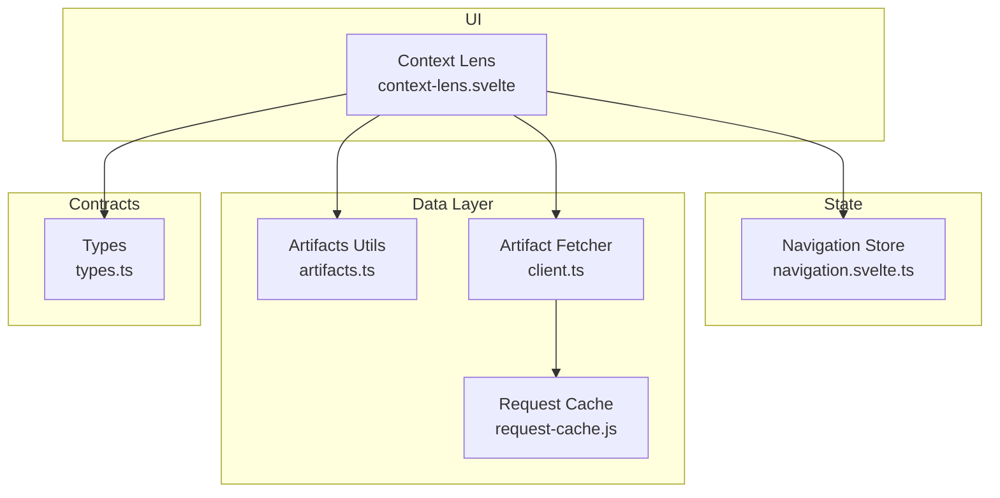
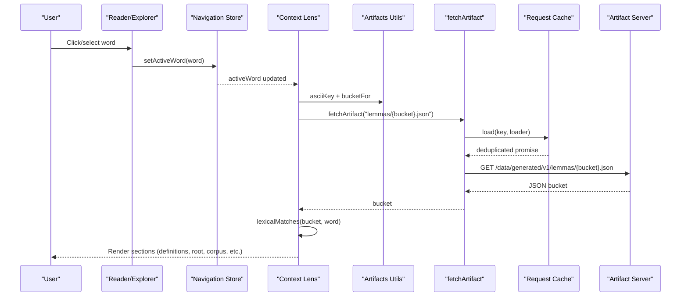
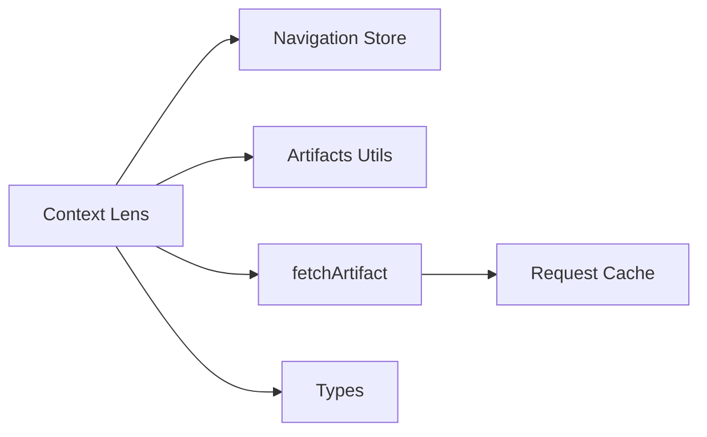

# Context Lens Component

<cite>
**Referenced Files in This Document**
- [context-lens.svelte](file://src/lib/components/context-lens.svelte)
- [navigation.svelte.ts](file://src/lib/stores/navigation.svelte.ts)
- [types.ts](file://src/lib/data/types.ts)
- [client.ts](file://src/lib/data/client.ts)
- [artifacts.ts](file://src/lib/data/artifacts.ts)
- [request-cache.js](file://src/lib/data/request-cache.js)
- [artifact-contracts.md](file://src/routes/docs/developer/artifact-contracts.md)
</cite>

## Table of Contents
1. [Introduction](#introduction)
2. [Project Structure](#project-structure)
3. [Core Components](#core-components)
4. [Architecture Overview](#architecture-overview)
5. [Detailed Component Analysis](#detailed-component-analysis)
6. [Dependency Analysis](#dependency-analysis)
7. [Performance Considerations](#performance-considerations)
8. [Troubleshooting Guide](#troubleshooting-guide)
9. [Conclusion](#conclusion)
10. [Appendices](#appendices)

## Introduction
The Context Lens is a right-side panel component that provides lexical analysis and grammatical information for words selected by the user while reading texts or exploring roots/concepts. It displays dictionary definitions, root (dhātu) information, corpus profile statistics, semantic classifications, top texts by occurrence, sample concordance lines, and links to occurrences across texts. It also supports compound word breakdowns and cross-referencing between lemmas, roots, concepts, and texts.

## Project Structure
The Context Lens lives as a Svelte component and integrates with:
- The navigation store for active word state management
- The artifact system for fetching lemma details and related data
- The request cache for deduplicating concurrent requests
- Type contracts defining lemma detail artifacts and dhātu records

**Diagram sources**
- [context-lens.svelte](file://src/lib/components/context-lens.svelte)
- [navigation.svelte.ts](file://src/lib/stores/navigation.svelte.ts)
- [artifacts.ts](file://src/lib/data/artifacts.ts)
- [client.ts](file://src/lib/data/client.ts)
- [request-cache.js](file://src/lib/data/request-cache.js)
- [types.ts](file://src/lib/data/types.ts)

**Section sources**
- [context-lens.svelte](file://src/lib/components/context-lens.svelte)
- [navigation.svelte.ts](file://src/lib/stores/navigation.svelte.ts)
- [types.ts](file://src/lib/data/types.ts)
- [client.ts](file://src/lib/data/client.ts)
- [artifacts.ts](file://src/lib/data/artifacts.ts)
- [request-cache.js](file://src/lib/data/request-cache.js)

## Core Components
- Context Lens component: Renders the right pane with sections for headword/form, POS and features, dictionary definitions, root info, occurrences, lexicon preview, corpus profile, semantic classification, top texts, and sample concordance. Supports compound word selection and candidate entry resolution.
- Navigation store: Holds the active word (lemma, form, UPOS, feats, root context, compound flag, components), and exposes setters used by readers and explorers to update selection.
- Artifact utilities and fetcher: Normalizes keys, computes buckets, resolves versioned paths, and performs cached HTTP requests for lemma detail artifacts.
- Types: Define LemmaRecord, DhatuRecord, LemmaDetailArtifact, and RootDetailArtifact contracts consumed by the UI.

Key responsibilities:
- Reactively load lemma detail when an active word changes
- Resolve multiple matching entries and allow user selection
- Display dhātu root metadata and links
- Show corpus-level statistics and sample concordance
- Provide navigational links to texts, roots, and concepts

**Section sources**
- [context-lens.svelte](file://src/lib/components/context-lens.svelte)
- [navigation.svelte.ts](file://src/lib/stores/navigation.svelte.ts)
- [types.ts](file://src/lib/data/types.ts)
- [client.ts](file://src/lib/data/client.ts)
- [artifacts.ts](file://src/lib/data/artifacts.ts)

## Architecture Overview
The Context Lens follows a reactive, artifact-driven architecture:
- Active word state is managed centrally in the navigation store
- On change, the component derives normalized lemma key and bucket path
- A single fetchArtifact call retrieves the lemma bucket JSON
- Lexical matching selects exact match or narrows candidates
- UI renders sections based on available fields in the artifact

**Diagram sources**
- [context-lens.svelte](file://src/lib/components/context-lens.svelte)
- [client.ts](file://src/lib/data/client.ts)
- [artifacts.ts](file://src/lib/data/artifacts.ts)
- [request-cache.js](file://src/lib/data/request-cache.js)
- [navigation.svelte.ts](file://src/lib/stores/navigation.svelte.ts)

## Detailed Component Analysis

### Props and Inputs
- className: Optional CSS class string applied to the root container for layout customization.

No other props are required; the component reads its primary input from the navigation store’s activeWord.

**Section sources**
- [context-lens.svelte](file://src/lib/components/context-lens.svelte)

### Data Models and Contracts
- ActiveWord: Contains lemma, form, slug, optional identifiers, UPOS, morphological features, root context, compound flag, and nested components for compound words.
- LemmaDetailArtifact: Includes lemma record, English definitions, root info, text occurrences, concordance object, and concept links.
- DhatuRecord: Captures root IAST/Devanāgarī forms, gaṇa/pada, meanings, upasargas, sutras, and related metadata.

These types define the shape of data rendered by the component and guide downstream consumers.

**Section sources**
- [navigation.svelte.ts](file://src/lib/stores/navigation.svelte.ts)
- [types.ts](file://src/lib/data/types.ts)

### Lexical Matching and Candidate Resolution
- Exact headword match prioritized
- Direct slug match against normalized lemma
- Fallback filtering by normalized lemma or ASCII-normalized headword
- When multiple matches exist, the UI presents selectable tags for disambiguation

This logic ensures robust lookup even with diacritics and alternate spellings.

**Section sources**
- [context-lens.svelte](file://src/lib/components/context-lens.svelte)
- [artifacts.ts](file://src/lib/data/artifacts.ts)

### Compound Word Handling
- If activeWord.isCompound is true, the lens shows the surface form and lists component lemmas
- Selecting a component updates the active word via the navigation store to display its full entry
- If no components are available, a message indicates unavailability in current corpus data

**Section sources**
- [context-lens.svelte](file://src/lib/components/context-lens.svelte)
- [navigation.svelte.ts](file://src/lib/stores/navigation.svelte.ts)

### Root (Dhātu) Information Display
- Displays root IAST and Devanāgarī forms
- Shows gaṇa, pada label mapping, and meaning(s)
- Provides a link to the root page for deeper exploration

**Section sources**
- [context-lens.svelte](file://src/lib/components/context-lens.svelte)
- [types.ts](file://src/lib/data/types.ts)

### Corpus Profile and Concordance
- Part of speech, total occurrences, number of texts
- Definition summary if present
- Top texts by occurrence with counts and percentages
- Sample concordance lines linking back to source texts

**Section sources**
- [context-lens.svelte](file://src/lib/components/context-lens.svelte)

### Cross-Referencing Capabilities
- Links to texts (/text/{slug})
- Links to roots (/root/{slug})
- Links to concepts (/concept/{conceptId})
- Occurrence list enables quick navigation to relevant texts

**Section sources**
- [context-lens.svelte](file://src/lib/components/context-lens.svelte)

### Layout System and Sections
The component organizes content into modular sections:
- Header: Headword/form, UPOS label, morphological features
- Dictionary Definitions: List of English definitions
- Root: Dhātu metadata and navigation link
- Occurrences: Text slugs linked to reader pages
- Lexicon Preview: Short descriptive snippet
- Corpus Profile: POS, counts, and definition summary
- Semantic Classification: Concept links
- Top Texts by Occurrence: Ranked list with metrics
- Concordance (Sample): Excerpts with source links and surface forms

Each section is conditionally rendered based on available artifact fields.

**Section sources**
- [context-lens.svelte](file://src/lib/components/context-lens.svelte)

### Dynamic Content Loading and Caching
- Uses fetchArtifact which resolves versioned artifact paths and deduplicates concurrent requests
- Request cache ensures only one network call per key even under concurrent triggers
- Error handling clears state and loading flags appropriately

**Section sources**
- [context-lens.svelte](file://src/lib/components/context-lens.svelte)
- [client.ts](file://src/lib/data/client.ts)
- [request-cache.js](file://src/lib/data/request-cache.js)
- [artifact-contracts.md](file://src/routes/docs/developer/artifact-contracts.md)

### User Interaction Patterns
- Close button clears active word selection
- Selecting a candidate lemma switches the displayed entry without re-fetching
- Selecting a compound component updates active word and loads its entry
- All external links use standard href navigation

**Section sources**
- [context-lens.svelte](file://src/lib/components/context-lens.svelte)

### Responsive Behavior and Accessibility
- Uses shared layout classes and spacing tokens for consistent responsive behavior
- Buttons and links are keyboard-accessible and focusable
- Color contrast and typography follow shared design tokens

[No sources needed since this section provides general guidance]

### Customization Options
- className prop allows wrapping the panel with custom styles or layout containers
- Section rendering is driven by artifact fields, enabling feature toggles at data level

**Section sources**
- [context-lens.svelte](file://src/lib/components/context-lens.svelte)

## Dependency Analysis
The Context Lens depends on:
- Navigation store for active word state
- Artifact utilities for normalization and path resolution
- Client fetcher for versioned artifact retrieval
- Request cache for concurrency control
- Type contracts for data validation and IDE support

**Diagram sources**
- [context-lens.svelte](file://src/lib/components/context-lens.svelte)
- [navigation.svelte.ts](file://src/lib/stores/navigation.svelte.ts)
- [artifacts.ts](file://src/lib/data/artifacts.ts)
- [client.ts](file://src/lib/data/client.ts)
- [request-cache.js](file://src/lib/data/request-cache.js)
- [types.ts](file://src/lib/data/types.ts)

**Section sources**
- [context-lens.svelte](file://src/lib/components/context-lens.svelte)
- [navigation.svelte.ts](file://src/lib/stores/navigation.svelte.ts)
- [artifacts.ts](file://src/lib/data/artifacts.ts)
- [client.ts](file://src/lib/data/client.ts)
- [request-cache.js](file://src/lib/data/request-cache.js)
- [types.ts](file://src/lib/data/types.ts)

## Performance Considerations
- Bucket-based lemma lookups keep payloads small and bounded
- Concurrency-safe caching prevents duplicate network calls
- Conditional rendering avoids unnecessary DOM updates
- Minimal client-side processing; heavy joins performed during artifact build

[No sources needed since this section provides general guidance]

## Troubleshooting Guide
Common issues and resolutions:
- No entry displayed: Ensure activeWord is set and not a compound; verify artifact exists for the computed bucket
- Multiple entries shown: Use candidate selection to resolve ambiguity
- Loading stuck: Check network response and error handling; verify artifact path versioning
- Missing sections: Confirm artifact fields are present (e.g., englishDefs, rootInfo, concordance)

**Section sources**
- [context-lens.svelte](file://src/lib/components/context-lens.svelte)
- [client.ts](file://src/lib/data/client.ts)
- [artifact-contracts.md](file://src/routes/docs/developer/artifact-contracts.md)

## Conclusion
The Context Lens delivers a comprehensive, reactive lexical view tied to the active word selection. It leverages a clean separation of concerns: state in the navigation store, data via versioned artifacts, and robust caching. Its modular sections make it easy to extend with new linguistic insights while maintaining performance and accessibility.

[No sources needed since this section summarizes without analyzing specific files]

## Appendices

### Data Structure Requirements
- ActiveWord fields: lemma, form, slug, optional id/lemma_id, upos, feats, rootContext, isCompound, components
- LemmaDetailArtifact fields: lemma, englishDefs, rootInfo, textOccurrences, concordance, concepts
- DhatuRecord fields: slug, root_iast, dev, gana, ganaName, pada, meaning, meaning_english/hindi, upasargas, sutras

**Section sources**
- [navigation.svelte.ts](file://src/lib/stores/navigation.svelte.ts)
- [types.ts](file://src/lib/data/types.ts)

### Example Interactions
- Selecting a word in the reader sets activeWord and opens the lens
- Choosing a compound component updates activeWord to that component
- Picking a candidate lemma filters to a single entry
- Clicking links navigates to text/root/concept pages

**Section sources**
- [context-lens.svelte](file://src/lib/components/context-lens.svelte)