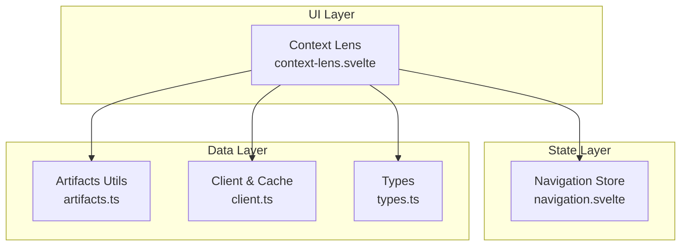
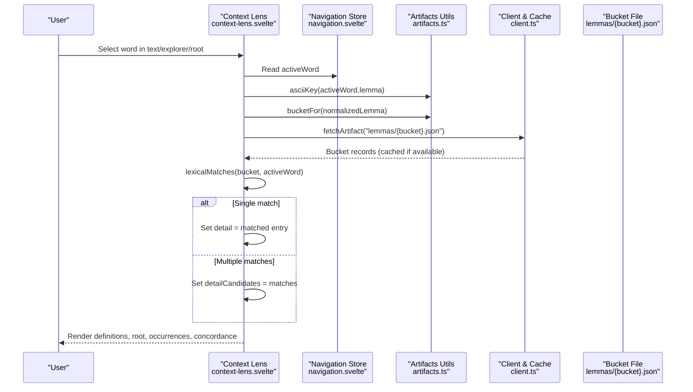
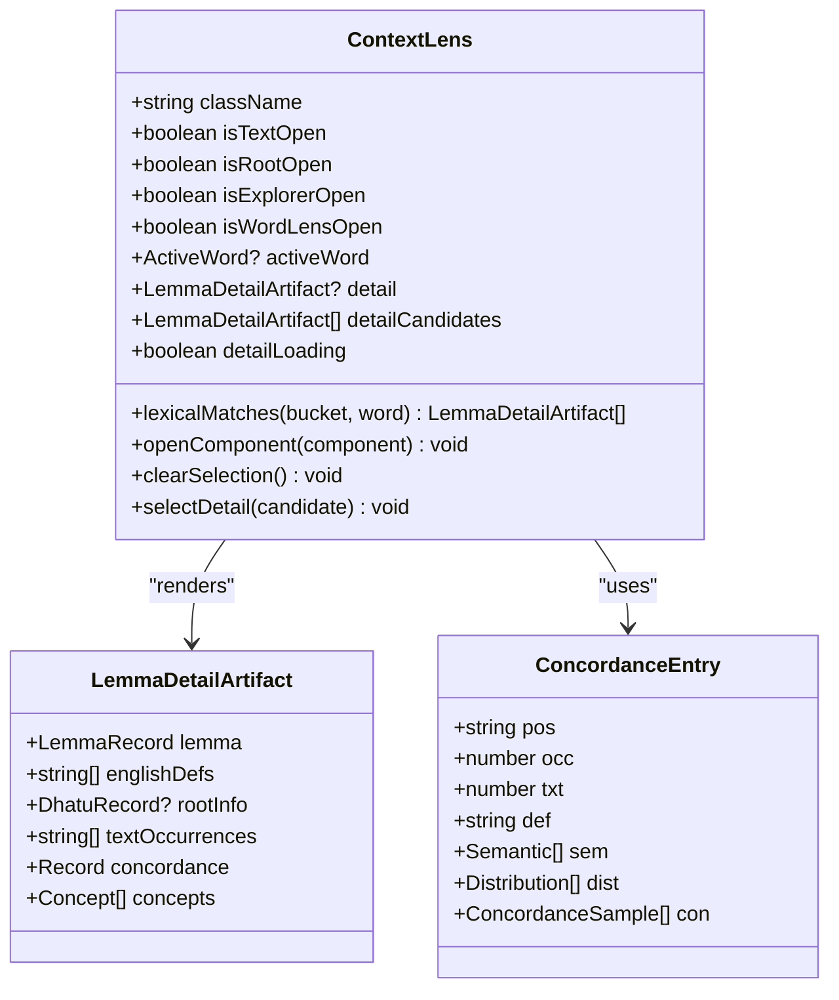
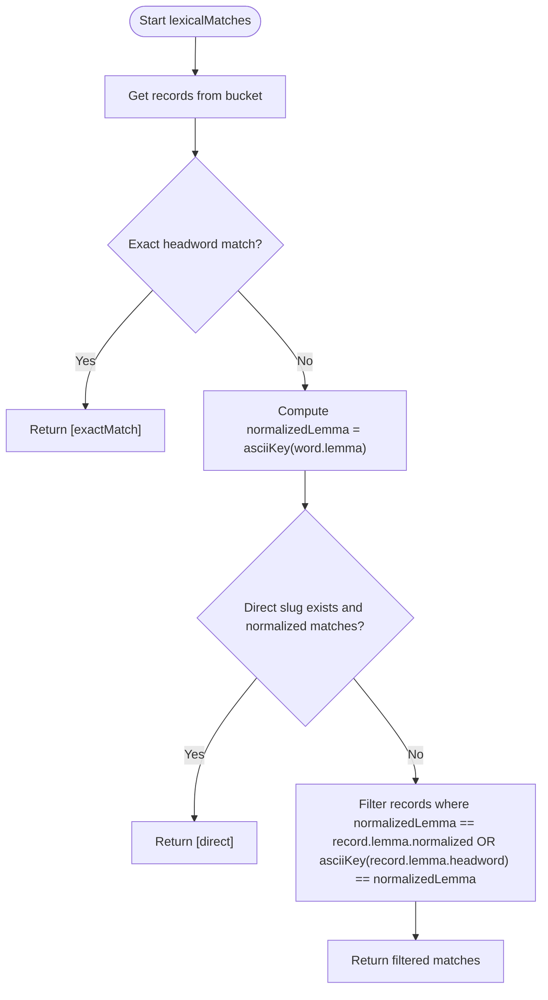
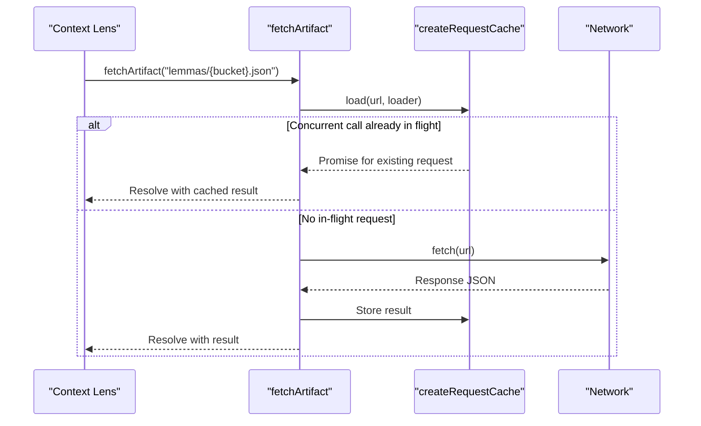
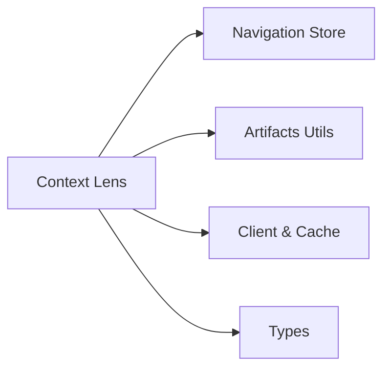

# Data Handling and State Management

<cite>
**Referenced Files in This Document**
- [context-lens.svelte](file://src/lib/components/context-lens.svelte)
- [artifacts.ts](file://src/lib/data/artifacts.ts)
- [client.ts](file://src/lib/data/client.ts)
- [types.ts](file://src/lib/data/types.ts)
- [navigation.svelte](file://src/lib/stores/navigation.svelte)
- [artifact-contracts.md](file://src/routes/docs/developer/artifact-contracts.md)
- [DEVELOPERS.md](file://docs/DEVELOPERS.md)
</cite>

## Table of Contents
1. [Introduction](#introduction)
2. [Project Structure](#project-structure)
3. [Core Components](#core-components)
4. [Architecture Overview](#architecture-overview)
5. [Detailed Component Analysis](#detailed-component-analysis)
6. [Dependency Analysis](#dependency-analysis)
7. [Performance Considerations](#performance-considerations)
8. [Troubleshooting Guide](#troubleshooting-guide)
9. [Conclusion](#conclusion)

## Introduction
This document explains the Context Lens component’s data handling and state management system. It focuses on how the component tracks the active word via a navigation store, loads lemma detail artifacts with caching, processes multiple data types (LemmaDetailArtifact, ActiveWord, concordance entries), implements a lexical matching algorithm to resolve normalized lemmas to dictionary entries, handles ambiguous matches through candidate selection, and updates reactive UI state using Svelte runes. It also covers error handling for missing or failed data and performance optimizations such as artifact caching and request deduplication.

## Project Structure
The Context Lens is implemented as a Svelte component that:
- Subscribes to the active word from a navigation store
- Normalizes lemmas and resolves bucketed lemma artifacts
- Fetches and caches lemma details
- Renders definitions, root info, occurrences, and corpus profile data

**Diagram sources**
- [context-lens.svelte](file://src/lib/components/context-lens.svelte)
- [navigation.svelte](file://src/lib/stores/navigation.svelte)
- [artifacts.ts](file://src/lib/data/artifacts.ts)
- [client.ts](file://src/lib/data/client.ts)
- [types.ts](file://src/lib/data/types.ts)

**Section sources**
- [context-lens.svelte](file://src/lib/components/context-lens.svelte)
- [artifacts.ts](file://src/lib/data/artifacts.ts)
- [client.ts](file://src/lib/data/client.ts)
- [types.ts](file://src/lib/data/types.ts)
- [navigation.svelte](file://src/lib/stores/navigation.svelte)

## Core Components
- Context Lens component: Manages reactive state for active word, loading, candidates, and resolved detail; renders UI sections based on available data.
- Navigation store: Provides the active word and methods to set/clear it.
- Artifacts utilities: Normalize lemmas to ASCII keys and compute two-character buckets for efficient artifact retrieval.
- Client and cache: Resolves versioned artifact paths, deduplicates concurrent requests, and caches completed responses.
- Types: Define shapes for LemmaDetailArtifact, ConcordanceEntry, and related structures.

Key responsibilities:
- Reactive subscription to active word changes
- Lexical matching across normalized lemmas and headwords
- Artifact fetching with caching and error handling
- Candidate selection when multiple dictionary entries match
- Rendering of definitions, root info, occurrences, and concordance

**Section sources**
- [context-lens.svelte](file://src/lib/components/context-lens.svelte)
- [artifacts.ts](file://src/lib/data/artifacts.ts)
- [client.ts](file://src/lib/data/client.ts)
- [types.ts](file://src/lib/data/types.ts)
- [navigation.svelte](file://src/lib/stores/navigation.svelte)

## Architecture Overview
The Context Lens orchestrates user interactions and data flows between the navigation store, artifact utilities, and the client cache.

**Diagram sources**
- [context-lens.svelte](file://src/lib/components/context-lens.svelte)
- [artifacts.ts](file://src/lib/data/artifacts.ts)
- [client.ts](file://src/lib/data/client.ts)

## Detailed Component Analysis

### Context Lens Component
Responsibilities:
- Tracks whether the lens should be visible based on current route
- Derives active word from the navigation store when appropriate
- Maintains local reactive state for detail, candidates, and loading
- Implements lexical matching and candidate selection
- Renders sections for definitions, root info, occurrences, and concordance

Reactive state and effects:
- Uses Svelte runes ($state, $derived, $effect) to reactively update UI
- Effect triggers on activeWord changes to load or reset detail
- Handles compound words by disabling automatic detail loading

Lexical matching algorithm:
- Exact headword match takes priority
- Direct slug lookup with normalized lemma verification
- Fallback to normalized lemma or ASCII-normalized headword equality

Candidate selection:
- When multiple matches exist, presents buttons for each candidate
- Selecting a candidate sets the detail and clears candidates

Error handling:
- Clears detail and loading state on fetch failure
- Guards against stale updates by comparing activeWord identity

Rendering:
- Displays form, part-of-speech label, features, definitions
- Shows root information with links
- Lists occurrences and provides links to texts
- Presents corpus profile including semantic classification and top texts

**Section sources**
- [context-lens.svelte](file://src/lib/components/context-lens.svelte)

#### Class Diagram

**Diagram sources**
- [context-lens.svelte](file://src/lib/components/context-lens.svelte)
- [types.ts](file://src/lib/data/types.ts)

### Lexical Matching Algorithm
Algorithm steps:
1. Collect all records from the fetched bucket
2. Try exact headword match against activeWord.lemma
3. Compute normalized lemma via asciiKey
4. Check direct slug mapping with normalized lemma verification
5. If still ambiguous, filter records where normalized lemma equals record.lemma.normalized or ASCII-normalized headword equals normalized lemma

Complexity:
- O(n) scan over bucket records for exact and fallback filtering
- Constant-time checks for exact headword and direct slug

Optimization opportunities:
- Precompute normalized fields in artifacts to avoid repeated normalization
- Maintain an index from normalized lemma to slugs for faster lookups

**Section sources**
- [context-lens.svelte](file://src/lib/components/context-lens.svelte)
- [artifacts.ts](file://src/lib/data/artifacts.ts)

#### Flowchart

**Diagram sources**
- [context-lens.svelte](file://src/lib/components/context-lens.svelte)
- [artifacts.ts](file://src/lib/data/artifacts.ts)

### Artifact Caching and Request Deduplication
Behavior:
- fetchArtifact resolves versioned paths via artifactPath
- Uses createRequestCache to deduplicate concurrent requests for the same URL
- Retains completed immutable JSON values in memory during module lifetime
- Removes failed requests from in-flight cache to allow retries

Benefits:
- Prevents duplicate network calls under concurrent access
- Improves responsiveness when multiple components request the same artifact
- Simplifies error recovery by allowing re-fetch after failures

**Section sources**
- [client.ts](file://src/lib/data/client.ts)
- [DEVELOPERS.md](file://docs/DEVELOPERS.md)
- [artifact-contracts.md](file://src/routes/docs/developer/artifact-contracts.md)

#### Sequence Diagram

**Diagram sources**
- [client.ts](file://src/lib/data/client.ts)

### Reactive State Updates Using Svelte Runes
- $state manages local mutable state for detail, candidates, and loading
- $derived computes read-only values like activeWord, lemma, englishDefs, rootInfo, textOccurrences, concordance
- $effect reacts to activeWord changes to trigger artifact loading and reset states

Advantages:
- Declarative reactivity ensures UI stays in sync with data
- Fine-grained updates minimize unnecessary re-renders
- Clear separation between derived and mutable state improves maintainability

**Section sources**
- [context-lens.svelte](file://src/lib/components/context-lens.svelte)

### Data Types and Contracts
- LemmaDetailArtifact encapsulates lemma metadata, English definitions, root info, text occurrences, concordance, and concepts
- ConcordanceEntry includes POS, occurrence counts, text references, definitions, semantic classifications, distributions, and samples
- Artifacts use versioned paths and bucketed files for lemmas, roots, search, excerpts, and more

Versioning and contracts:
- Version constant ensures clients do not mix incompatible schemas
- Bucketing strategy keeps file sizes manageable and lookups efficient

**Section sources**
- [types.ts](file://src/lib/data/types.ts)
- [artifact-contracts.md](file://src/routes/docs/developer/artifact-contracts.md)

## Dependency Analysis
Interactions:
- Context Lens depends on navigation store for active word
- Uses artifacts utilities for normalization and bucket computation
- Relies on client for artifact fetching and caching
- Consumes type definitions for static typing and documentation

Coupling and cohesion:
- Low coupling between UI and data layer via typed interfaces
- High cohesion within Context Lens for managing detail state and rendering
- Centralized artifact utilities and client improve reuse and consistency

Potential circular dependencies:
- None observed; imports are unidirectional from UI to data layer

External dependencies:
- SvelteKit runtime for routing and fetch
- Browser fetch API for artifact retrieval

**Diagram sources**
- [context-lens.svelte](file://src/lib/components/context-lens.svelte)
- [navigation.svelte](file://src/lib/stores/navigation.svelte)
- [artifacts.ts](file://src/lib/data/artifacts.ts)
- [client.ts](file://src/lib/data/client.ts)
- [types.ts](file://src/lib/data/types.ts)

**Section sources**
- [context-lens.svelte](file://src/lib/components/context-lens.svelte)
- [navigation.svelte](file://src/lib/stores/navigation.svelte)
- [artifacts.ts](file://src/lib/data/artifacts.ts)
- [client.ts](file://src/lib/data/client.ts)
- [types.ts](file://src/lib/data/types.ts)

## Performance Considerations
- Artifact caching reduces redundant network calls and parsing overhead
- Bucketed lemma files keep payloads small and targeted
- Normalization and matching are linear in bucket size; consider precomputed indexes for very large buckets
- Avoid unnecessary re-renders by leveraging $derived for computed values
- Use explicit guards in effects to prevent stale updates when activeWord changes rapidly

[No sources needed since this section provides general guidance]

## Troubleshooting Guide
Common issues:
- Missing lemma detail: Ensure the active word is not a compound and that the normalized lemma maps to a valid bucket
- Ambiguous matches: Present candidates and require explicit selection
- Network errors: Handle failures gracefully and allow retry via cache behavior
- Stale state: Compare activeWord identity inside effect callbacks to avoid applying outdated results

Recommendations:
- Validate artifact availability during development
- Log bucket resolution and match counts for debugging
- Provide user feedback for loading and error states

**Section sources**
- [context-lens.svelte](file://src/lib/components/context-lens.svelte)
- [client.ts](file://src/lib/data/client.ts)

## Conclusion
The Context Lens component integrates tightly with the navigation store and artifact system to deliver responsive, accurate lemma details. Its lexical matching algorithm balances precision and flexibility, while artifact caching ensures efficient data access. Reactive state updates via Svelte runes provide a clean and maintainable UI flow. Proper error handling and candidate selection enhance robustness and usability.

[No sources needed since this section summarizes without analyzing specific files]