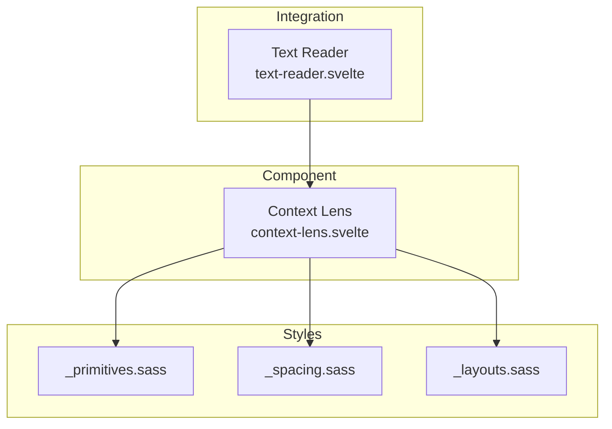
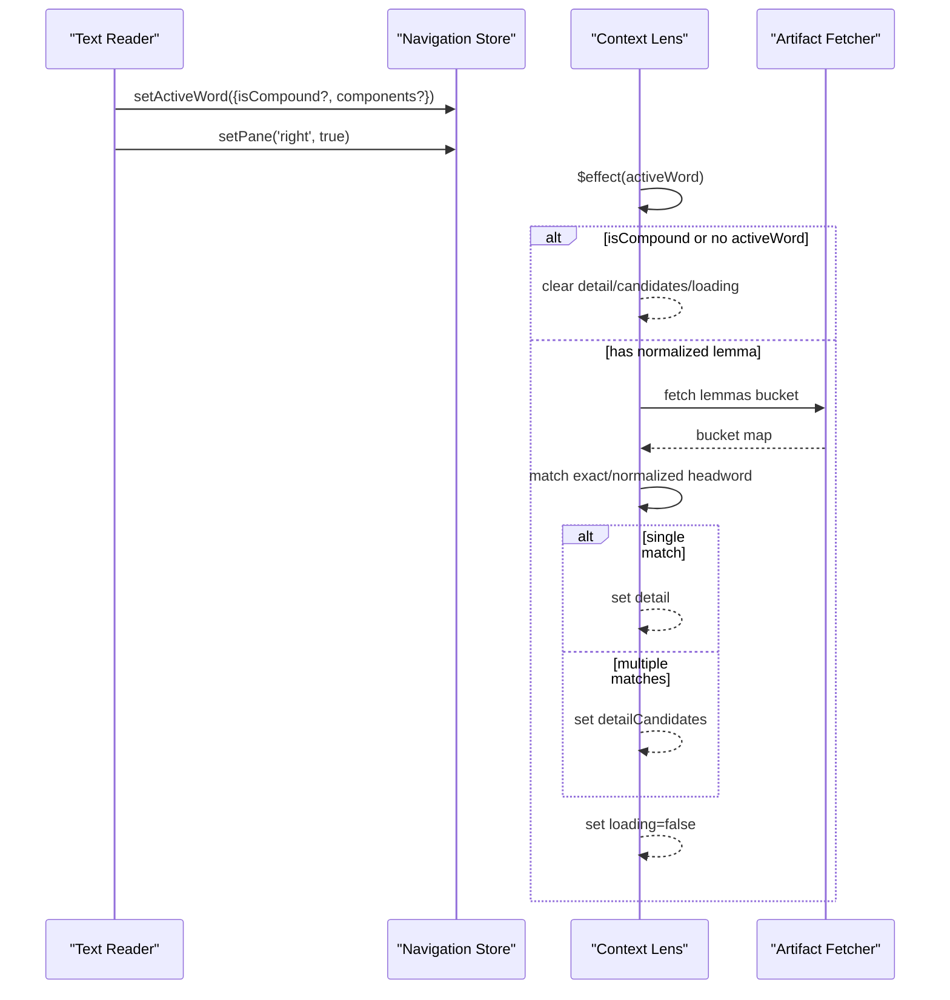
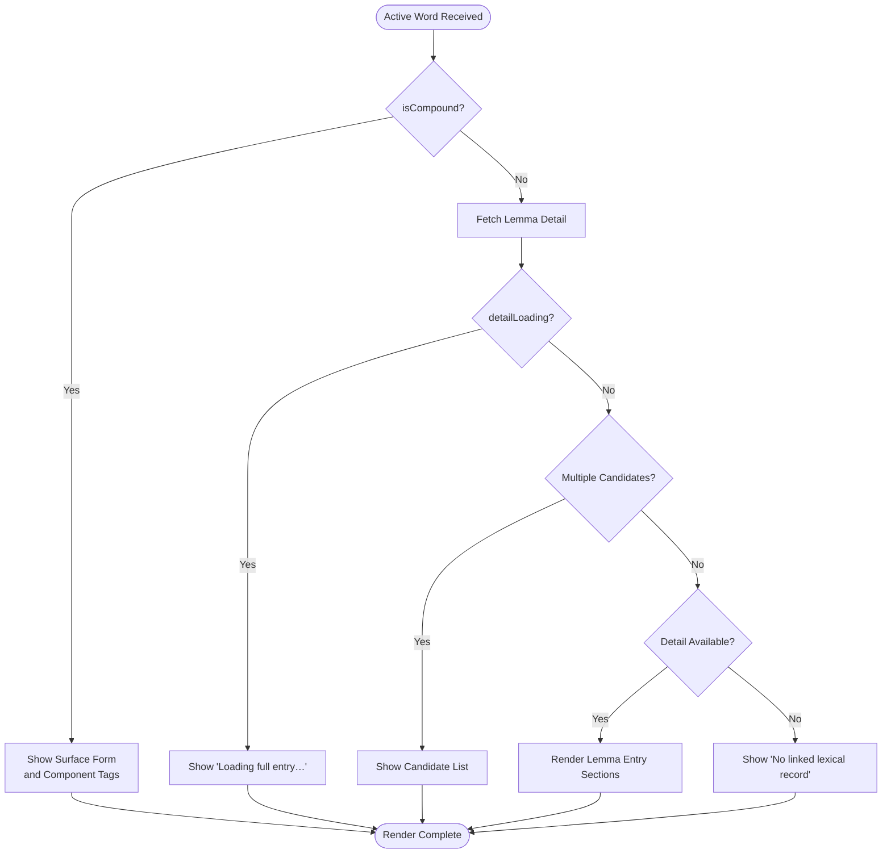
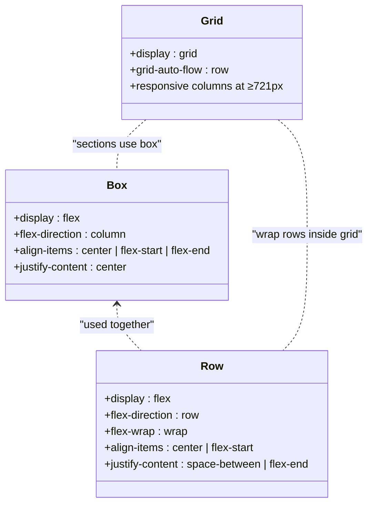
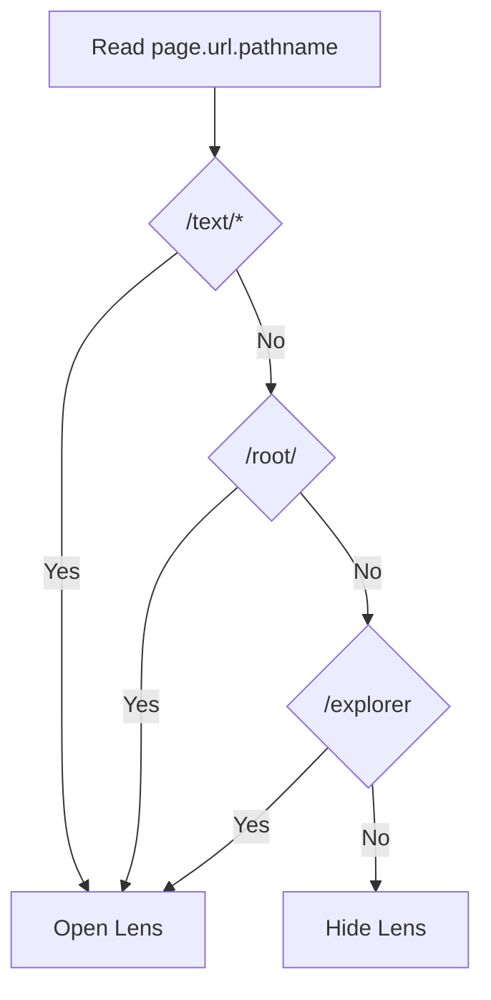
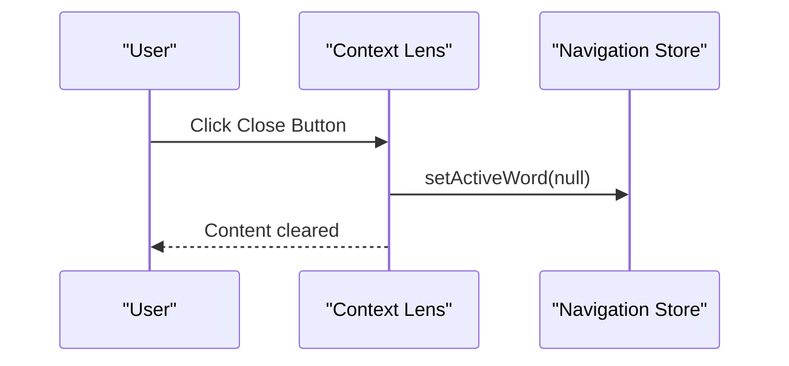
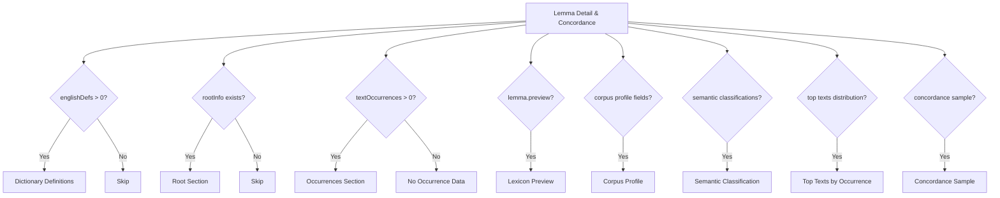

# Display Modes and Layout System

<cite>
**Referenced Files in This Document**
- [context-lens.svelte](file://src/lib/components/context-lens.svelte)
- [_primitives.sass](file://src/lib/styles/_primitives.sass)
- [_spacing.sass](file://src/lib/styles/_spacing.sass)
- [_layouts.sass](file://src/lib/styles/_layouts.sass)
- [text-reader.svelte](file://src/lib/components/text-reader.svelte)
</cite>

## Table of Contents
1. [Introduction](#introduction)
2. [Project Structure](#project-structure)
3. [Core Components](#core-components)
4. [Architecture Overview](#architecture-overview)
5. [Detailed Component Analysis](#detailed-component-analysis)
6. [Dependency Analysis](#dependency-analysis)
7. [Performance Considerations](#performance-considerations)
8. [Troubleshooting Guide](#troubleshooting-guide)
9. [Conclusion](#conclusion)
10. [Appendices](#appendices)

## Introduction
This document explains the Context Lens component’s display modes and layout system. It covers:
- Compound word breakdown view that resolves a surface form into components
- Standard lemma entry view with grammatical parsing results and dictionary data
- Empty state messaging when no word is selected
- Responsive layout using CSS classes like box, row, gap8, and grid for different screen sizes
- Conditional rendering based on URL context (text pages, root pages, explorer)
- Close button functionality to dismiss the lens
- Dynamic content sections: dictionary definitions, root information, occurrences, corpus profile, semantic classification, top texts by occurrence, and concordance samples
- Styling customization options and accessibility considerations

## Project Structure
The Context Lens is implemented as a Svelte component and styled via a modular Sass system. The relevant files are:
- Component logic and template: src/lib/components/context-lens.svelte
- Layout primitives and responsive utilities: src/lib/styles/_primitives.sass, _spacing.sass, _layouts.sass
- Reader integration that activates the lens: src/lib/components/text-reader.svelte



**Diagram sources**
- [context-lens.svelte:1-234](file://src/lib/components/context-lens.svelte#L1-L234)
- [_primitives.sass:1-45](file://src/lib/styles/_primitives.sass#L1-L45)
- [_spacing.sass:1-123](file://src/lib/styles/_spacing.sass#L1-L123)
- [_layouts.sass:1-147](file://src/lib/styles/_layouts.sass#L1-L147)
- [text-reader.svelte:65-74](file://src/lib/components/text-reader.svelte#L65-L74)

**Section sources**
- [context-lens.svelte:1-234](file://src/lib/components/context-lens.svelte#L1-L234)
- [_primitives.sass:1-45](file://src/lib/styles/_primitives.sass#L1-L45)
- [_spacing.sass:1-123](file://src/lib/styles/_spacing.sass#L1-L123)
- [_layouts.sass:1-147](file://src/lib/styles/_layouts.sass#L1-L147)
- [text-reader.svelte:65-74](file://src/lib/components/text-reader.svelte#L65-L74)

## Core Components
- Context Lens displays either:
  - A compound breakdown view when the active word is marked as a compound
  - A standard lemma entry view with parsed features, dictionary definitions, root info, occurrences, and corpus profile
  - An empty state message when no word is selected but the lens is open
- It reacts to URL context to determine whether it should be visible and what initial state to show
- It fetches lemma details asynchronously and handles multiple lexical matches

Key behaviors:
- Conditional visibility based on URL path segments for text, root, and explorer routes
- Active word selection from navigation store
- Asynchronous fetching of lemma artifacts and candidate resolution
- Clearing selection via close button

**Section sources**
- [context-lens.svelte:23-31](file://src/lib/components/context-lens.svelte#L23-L31)
- [context-lens.svelte:46-71](file://src/lib/components/context-lens.svelte#L46-L71)
- [context-lens.svelte:112-117](file://src/lib/components/context-lens.svelte#L112-L117)
- [context-lens.svelte:117-131](file://src/lib/components/context-lens.svelte#L117-L131)
- [context-lens.svelte:132-158](file://src/lib/components/context-lens.svelte#L132-L158)
- [context-lens.svelte:159-228](file://src/lib/components/context-lens.svelte#L159-L228)
- [context-lens.svelte:230-232](file://src/lib/components/context-lens.svelte#L230-L232)

## Architecture Overview
The Context Lens integrates with the reader and navigation stores to present contextual linguistic data. It uses a reactive effect to fetch lemma details and renders dynamic sections based on available data.



**Diagram sources**
- [text-reader.svelte:65-74](file://src/lib/components/text-reader.svelte#L65-L74)
- [context-lens.svelte:46-71](file://src/lib/components/context-lens.svelte#L46-L71)
- [context-lens.svelte:32-44](file://src/lib/components/context-lens.svelte#L32-L44)

## Detailed Component Analysis

### Display Modes
- Compound Word Breakdown View
  - Triggered when activeWord.isCompound is true
  - Shows the surface form and lists components as selectable tags
  - Selecting a component sets it as the active word to open its full entry
- Standard Lemma Entry View
  - Displays headword, form, UPOS label, and parsed features
  - Optionally shows dictionary definitions, root information, occurrences, lexicon preview, corpus profile, semantic classification, top texts by occurrence, and concordance sample
  - Handles loading states and multiple lexical candidates
- Empty State Messaging
  - When the lens is open but no word is selected, it instructs users to choose a word in the text



**Diagram sources**
- [context-lens.svelte:117-131](file://src/lib/components/context-lens.svelte#L117-L131)
- [context-lens.svelte:132-158](file://src/lib/components/context-lens.svelte#L132-L158)
- [context-lens.svelte:159-228](file://src/lib/components/context-lens.svelte#L159-L228)
- [context-lens.svelte:46-71](file://src/lib/components/context-lens.svelte#L46-L71)

**Section sources**
- [context-lens.svelte:117-131](file://src/lib/components/context-lens.svelte#L117-L131)
- [context-lens.svelte:132-158](file://src/lib/components/context-lens.svelte#L132-L158)
- [context-lens.svelte:159-228](file://src/lib/components/context-lens.svelte#L159-L228)
- [context-lens.svelte:46-71](file://src/lib/components/context-lens.svelte#L46-L71)

### Responsive Layout System
- Flex containers:
  - .box: column flex container; supports alignment modifiers like xleft, xcenter, ycenter
  - .row: row flex container; supports wrap, ycenter, xend, xbetween
- Spacing:
  - .gap4, .gap8, .gap16, etc., control gap between children
  - Padding utilities pad4–pad64 and directional variants
- Grid:
  - .grid with responsive columns grid-cols-2 through grid-cols-6 at min-width 721px
- Panels and mobile behavior:
  - .right-panel and .left-panel define sticky side panels
  - On screens ≤1024px, side panels hide and a mobile-friendly lens area appears



**Diagram sources**
- [_primitives.sass:1-45](file://src/lib/styles/_primitives.sass#L1-L45)
- [_spacing.sass:1-123](file://src/lib/styles/_spacing.sass#L1-L123)
- [_layouts.sass:98-126](file://src/lib/styles/_layouts.sass#L98-L126)

**Section sources**
- [_primitives.sass:1-45](file://src/lib/styles/_primitives.sass#L1-L45)
- [_spacing.sass:1-123](file://src/lib/styles/_spacing.sass#L1-L123)
- [_layouts.sass:32-50](file://src/lib/styles/_layouts.sass#L32-L50)
- [_layouts.sass:98-126](file://src/lib/styles/_layouts.sass#L98-L126)

### Conditional Rendering Based on URL Context
- Determines if the lens should be open based on current pathname:
  - /text/*
  - /root/<slug>
  - /explorer
- If any of these paths are active, the lens becomes visible and can accept an active word



**Diagram sources**
- [context-lens.svelte:23-27](file://src/lib/components/context-lens.svelte#L23-L27)

**Section sources**
- [context-lens.svelte:23-27](file://src/lib/components/context-lens.svelte#L23-L27)

### Close Button Functionality
- The close button clears the active word, effectively dismissing the lens content
- Uses a dedicated icon component for consistent UI



**Diagram sources**
- [context-lens.svelte:112-117](file://src/lib/components/context-lens.svelte#L112-L117)
- [context-lens.svelte:102-104](file://src/lib/components/context-lens.svelte#L102-L104)

**Section sources**
- [context-lens.svelte:112-117](file://src/lib/components/context-lens.svelte#L112-L117)
- [context-lens.svelte:102-104](file://src/lib/components/context-lens.svelte#L102-L104)

### Dynamic Content Sections
- Dictionary Definitions: displayed when available
- Root Information: shows root symbol, Devanagari, Gaṇa, Pada, meaning, and English meaning
- Occurrences: number of texts and links to each text slug
- Lexicon Preview: optional preview text
- Corpus Profile: part of speech, total occurrences, texts appeared in, definition
- Semantic Classification: concept links
- Top Texts by Occurrence: ordered list with counts and percentages
- Concordance Sample: sample contexts with surface forms and excerpts



**Diagram sources**
- [context-lens.svelte:159-228](file://src/lib/components/context-lens.svelte#L159-L228)

**Section sources**
- [context-lens.svelte:159-228](file://src/lib/components/context-lens.svelte#L159-L228)

### Styling Customization Options
- Use utility classes for spacing and layout without writing custom CSS
- Combine .box and .row with .gap8 for consistent spacing
- Apply .grid.grid-cols-2 for two-column layouts on larger screens
- Customize panel appearance via existing variables and tokens defined elsewhere in the styles
- Mobile behavior automatically hides side panels and shows a compact lens area

**Section sources**
- [_primitives.sass:1-45](file://src/lib/styles/_primitives.sass#L1-L45)
- [_spacing.sass:1-123](file://src/lib/styles/_spacing.sass#L1-L123)
- [_layouts.sass:98-126](file://src/lib/styles/_layouts.sass#L98-L126)

### Accessibility Features
- Interactive elements are native buttons and links, ensuring keyboard operability and screen reader support
- Descriptive labels and headings provide context for each section
- Color usage follows accessible contrast patterns via design tokens
- Focus management is handled by the browser defaults for interactive elements

[No sources needed since this section provides general guidance]

## Dependency Analysis
The Context Lens depends on:
- Navigation store for active word state
- Artifact fetcher for lemma data
- Icon component for close button
- Styles modules for layout and spacing

```mermaid
graph TB
CL["context-lens.svelte"]
NAV["$lib/stores/navigation.svelte"]
ART["$lib/data/artifacts"]
FETCH["$lib/data/client"]
ICON["$lib/icons/close.svelte"]
STYLES["_primitives.sass", "_spacing.sass", "_layouts.sass"]
CL --> NAV
CL --> ART
CL --> FETCH
CL --> ICON
CL --> STYLES
```

**Diagram sources**
- [context-lens.svelte:3-9](file://src/lib/components/context-lens.svelte#L3-L9)
- [context-lens.svelte:46-71](file://src/lib/components/context-lens.svelte#L46-L71)
- [_primitives.sass:1-45](file://src/lib/styles/_primitives.sass#L1-L45)
- [_spacing.sass:1-123](file://src/lib/styles/_spacing.sass#L1-L123)
- [_layouts.sass:1-147](file://src/lib/styles/_layouts.sass#L1-L147)

**Section sources**
- [context-lens.svelte:3-9](file://src/lib/components/context-lens.svelte#L3-L9)
- [context-lens.svelte:46-71](file://src/lib/components/context-lens.svelte#L46-L71)

## Performance Considerations
- Asynchronous artifact fetching avoids blocking the UI; loading states inform users
- Normalized lemma matching reduces unnecessary lookups and improves accuracy
- Reactive updates ensure only necessary re-renders occur when active word changes
- Grid and flex layouts minimize layout thrashing and improve responsiveness

[No sources needed since this section provides general guidance]

## Troubleshooting Guide
- Multiple lexical entries:
  - When more than one entry matches the normalized lemma, candidates are presented for selection
- No linked lexical record:
  - If no detail is found, a message indicates absence of linked data
- No occurrence data:
  - If occurrence data is missing, a placeholder informs users
- Loading state:
  - While fetching, a message indicates loading progress

**Section sources**
- [context-lens.svelte:146-158](file://src/lib/components/context-lens.svelte#L146-L158)
- [context-lens.svelte:156-158](file://src/lib/components/context-lens.svelte#L156-L158)
- [context-lens.svelte:182-187](file://src/lib/components/context-lens.svelte#L182-L187)
- [context-lens.svelte:143-145](file://src/lib/components/context-lens.svelte#L143-L145)

## Conclusion
The Context Lens provides a robust, responsive interface for exploring linguistic data tied to words in texts. It supports compound breakdowns, detailed lemma entries, and rich corpus insights while maintaining accessibility and performance. The modular styling system enables flexible customization across devices.

[No sources needed since this section summarizes without analyzing specific files]

## Appendices

### Integration with Text Reader
- The reader sets the active word and opens the right pane when a word is clicked
- For unresolved tokens, the reader marks them as compounds and supplies component tokens

**Section sources**
- [text-reader.svelte:65-74](file://src/lib/components/text-reader.svelte#L65-L74)