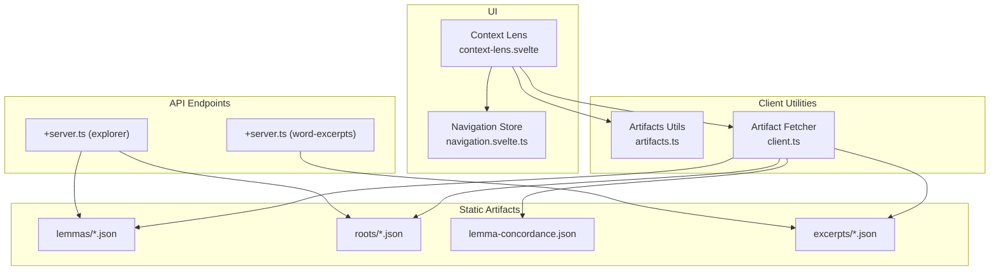
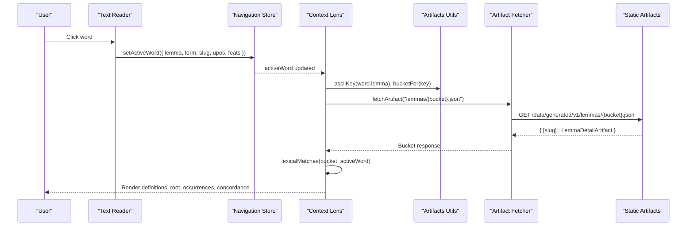
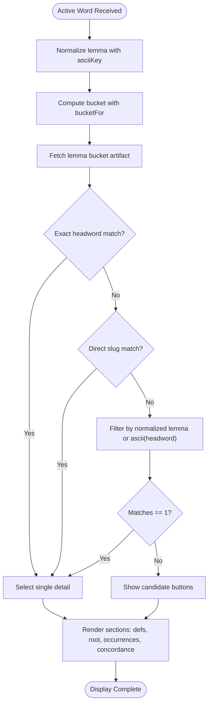
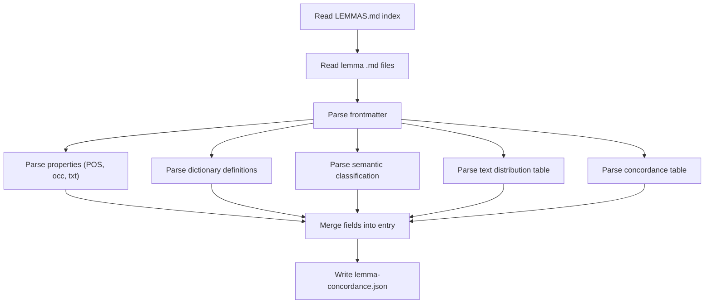
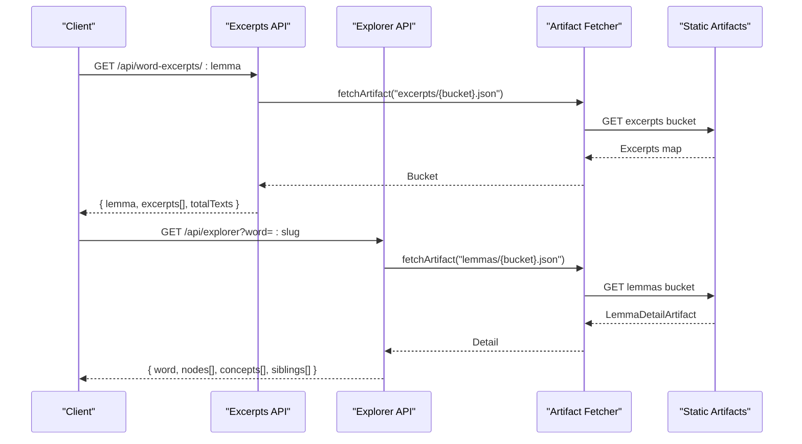
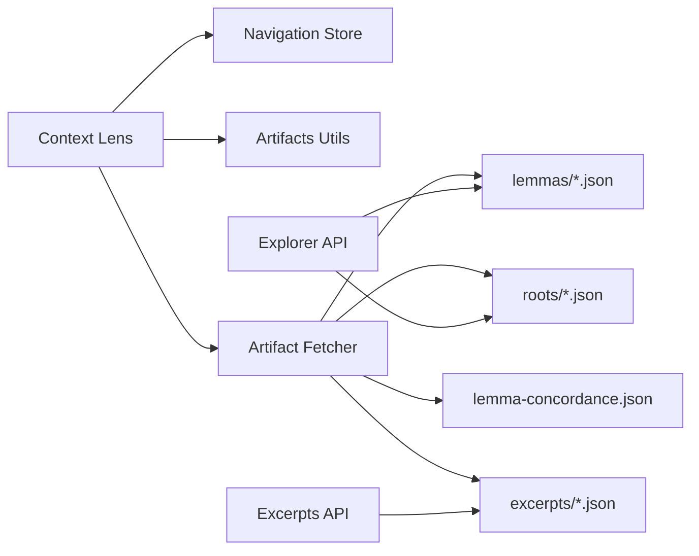

# Lexical Analysis and Dictionary Integration

<cite>
**Referenced Files in This Document**
- [context-lens.svelte](file://src/lib/components/context-lens.svelte)
- [types.ts](file://src/lib/data/types.ts)
- [client.ts](file://src/lib/data/client.ts)
- [artifacts.ts](file://src/lib/data/artifacts.ts)
- [build-query-artifacts.mjs](file://scripts/lib/build-query-artifacts.mjs)
- [build-lemma-concordance.mjs](file://scripts/build-lemma-concordance.mjs)
- [+server.ts (word-excerpts)](file://src/routes/api/word-excerpts/[lemma]/+server.ts)
- [+server.ts (explorer)](file://src/routes/api/explorer/+server.ts)
- [navigation.svelte.ts](file://src/lib/stores/navigation.svelte.ts)
</cite>

## Table of Contents
1. Introduction
2. Project Structure
3. Core Components
4. Architecture Overview
5. Detailed Component Analysis
6. Dependency Analysis
7. Performance Considerations
8. Troubleshooting Guide
9. Conclusion

## Introduction
This document explains how the Context Lens component performs lexical analysis and integrates with dictionary artifacts to display rich lemma details, concordance statistics, semantic classifications, distribution analysis, and sample contexts. It also covers UPOS label mapping, grammatical feature parsing, dhātu integration, and the relationship between surface forms and normalized lemmas.

## Project Structure
The Context Lens is a Svelte component that reacts to the active word selection from the navigation store, fetches lemma detail artifacts, and renders definitions, root information, occurrences, and corpus profile data. The artifact system uses versioned static JSON files organized into buckets for efficient client-side retrieval. Concordance data is built offline from lemma markdown sources and served as static JSON. API endpoints provide excerpts and explorer data derived from the same artifacts.



**Diagram sources**
- [context-lens.svelte](file://src/lib/components/context-lens.svelte)
- [navigation.svelte.ts](file://src/lib/stores/navigation.svelte.ts)
- [artifacts.ts](file://src/lib/data/artifacts.ts)
- [client.ts](file://src/lib/data/client.ts)
- [+server.ts (explorer)](file://src/routes/api/explorer/+server.ts)
- [+server.ts (word-excerpts)](file://src/routes/api/word-excerpts/[lemma]/+server.ts)

**Section sources**
- [context-lens.svelte](file://src/lib/components/context-lens.svelte)
- [artifacts.ts](file://src/lib/data/artifacts.ts)
- [client.ts](file://src/lib/data/client.ts)

## Core Components
- LemmaDetailArtifact: The primary data structure returned by lemma artifacts, including lemma metadata, English definitions, root info, text occurrences, concordance, and concept links.
- DhatuRecord: Root-level morphological and semantic information used to integrate dhātu context when available.
- Concordance entry: A lightweight object containing POS, occurrence counts, texts count, definition summary, semantic classification, top text distribution, and sample concordance lines.

Key responsibilities:
- Context Lens resolves the active word to a lemma detail via bucketed artifact paths and displays sections for definitions, root, occurrences, corpus profile, semantics, distribution, and samples.
- Build pipeline constructs lemma details by merging dictionary entries, occurrences, concordance, and concepts; it also selects the best dhātu link per word using prioritized linking rules.
- Concordance builder parses lemma markdown files to produce a static concordance JSON with POS, stats, definitions, semantics, distribution, and samples.
- API endpoints expose excerpts and explorer nodes derived from artifacts.

**Section sources**
- [types.ts](file://src/lib/data/types.ts)
- [build-query-artifacts.mjs](file://scripts/lib/build-query-artifacts.mjs)
- [build-lemma-concordance.mjs](file://scripts/build-lemma-concordance.mjs)

## Architecture Overview
The runtime flow connects UI state, artifact fetching, and static data generation.



**Diagram sources**
- [context-lens.svelte](file://src/lib/components/context-lens.svelte)
- [artifacts.ts](file://src/lib/data/artifacts.ts)
- [client.ts](file://src/lib/data/client.ts)

## Detailed Component Analysis

### Context Lens: Lexical Matching and Display
- Input: Active word from navigation store includes lemma, form, slug, optional upos and feats, and optional rootContext.
- Normalization: Uses asciiKey to normalize the lemma for bucketing and matching; handles diacritics and special characters consistently.
- Artifact path: Constructs bucketed path using bucketFor(normalizedLemma).
- Matching strategy:
  - Exact headword match first.
  - Direct slug match if normalized lemma matches.
  - Fallback to all records whose normalized lemma or ascii-keyed headword matches.
- Display sections:
  - Headword and form with UPOS label mapping.
  - Grammatical features parsed from pipe-separated key=value pairs.
  - English definitions aggregated from dictionary entries.
  - Root info (dhātu) when present, including gana, pada, meaning, and English meaning.
  - Occurrences list with links to texts.
  - Corpus profile: POS, total occurrences, texts count, definition summary.
  - Semantic classification: concept links.
  - Distribution: top texts by occurrence with counts and percentages.
  - Concordance samples: title, surface form, and context snippet.



**Diagram sources**
- [context-lens.svelte](file://src/lib/components/context-lens.svelte)
- [artifacts.ts](file://src/lib/data/artifacts.ts)

**Section sources**
- [context-lens.svelte](file://src/lib/components/context-lens.svelte)
- [navigation.svelte.ts](file://src/lib/stores/navigation.svelte.ts)

### Concordance System: Statistics, Semantics, Distribution, Samples
- Data source: Static JSON built from lemma markdown files under the wiki index.
- Fields:
  - pos: Part of speech.
  - occ: Total occurrences across corpus.
  - txt: Number of distinct texts.
  - def: Concatenated dictionary definitions from multiple sources.
  - sem: Semantic classification with concept id and name.
  - dist: Top N text distribution rows with title, slug, occurrences, percentage.
  - con: Top N concordance samples with title, slug, surface form, and context.
- Construction process:
  - Parse frontmatter and sections for properties, dictionary definitions, semantic classification, distribution, and concordance tables.
  - Map titles to slugs using texts.json.
  - Output one entry per normalized lemma.



**Diagram sources**
- [build-lemma-concordance.mjs](file://scripts/build-lemma-concordance.mjs)

**Section sources**
- [build-lemma-concordance.mjs](file://scripts/build-lemma-concordance.mjs)

### Lemma Detail Builder: Merging Dictionary, Occurrences, Concordance, Concepts, Dhātu
- Inputs: Lemmas, dictionary entries, dhatus, bridge links, enriched links, occurrences, concordance, concepts.
- Mapping:
  - Builds maps for dictionary by slug and headword.
  - Maps dhatus by slug.
  - Resolves root link per word using prioritized basis rules (headword begins with > dictionary text cites > bridge).
- Output:
  - For each lemma: lemma record, englishDefs array, rootInfo (dhatu or null), textOccurrences array, concordance object or null, concepts array.
  - Buckets results by first two characters of asciiKey(slug).

```mermaid
classDiagram
class LemmaDetailArtifact {
+lemma : LemmaRecord
+englishDefs : string[]
+rootInfo : DhatuRecord|null
+textOccurrences : string[]
+concordance : Record<string, unknown>|null
+concepts : Array<{conceptId : string; name : string}>
}
class LemmaRecord {
+slug : string
+headword : string
+normalized : string
+preview : string
+dhatuSlugs? : string[]
}
class DhatuRecord {
+slug : string
+root_iast : string
+dev : string
+gana : number
+ganaName? : string
+pada? : string
+meaning : string
+meaning_english? : string
+sutras? : any[]
}
LemmaDetailArtifact --> LemmaRecord : "contains"
LemmaDetailArtifact --> DhatuRecord : "optional rootInfo"
```

**Diagram sources**
- [types.ts](file://src/lib/data/types.ts)
- [build-query-artifacts.mjs](file://scripts/lib/build-query-artifacts.mjs)

**Section sources**
- [build-query-artifacts.mjs](file://scripts/lib/build-query-artifacts.mjs)
- [types.ts](file://src/lib/data/types.ts)

### API Endpoints: Excerpts and Explorer
- Word excerpts endpoint:
  - Accepts lemma parameter, normalizes to asciiKey without hyphens, fetches excerpts bucket, returns up to 30 excerpts and total text count.
  - Error handling returns empty excerpts and zero total on failure.
- Explorer endpoint:
  - Supports root or word queries.
  - For word: fetches lemma detail, builds text nodes from concordance distribution or fallback to textOccurrences, aggregates concepts, and optionally loads sibling words from root detail.
  - Error handling returns empty nodes arrays on failure.



**Diagram sources**
- [+server.ts (word-excerpts)](file://src/routes/api/word-excerpts/[lemma]/+server.ts)
- [+server.ts (explorer)](file://src/routes/api/explorer/+server.ts)
- [client.ts](file://src/lib/data/client.ts)

**Section sources**
- [+server.ts (word-excerpts)](file://src/routes/api/word-excerpts/[lemma]/+server.ts)
- [+server.ts (explorer)](file://src/routes/api/explorer/+server.ts)

### UPOS Label Mapping and Grammatical Features
- UPOS labels are mapped from Universal POS codes to human-readable names (verb, noun, adjective, adverb, pronoun, indeclinable, conjunction, preposition, particle, numeral).
- Grammatical features are parsed from a pipe-separated string of key=value pairs, displayed as tags.
- Pada labels map P/A/U to Parasmaipada/Ātmanepada/Ubhayapada for dhātu display.

**Section sources**
- [context-lens.svelte](file://src/lib/components/context-lens.svelte)

### Relationship Between Surface Forms and Normalized Lemmas
- Surface form (token.form) can be inflected; lemma artifacts are keyed by normalized lemma (asciiKey(token.lemma)).
- Slug resolution prefers token.slug if available; otherwise falls back to asciiKey(token.lemma).
- Matching prioritizes exact headword, then direct slug, then normalized lemma or ascii-keyed headword.

**Section sources**
- [context-lens.svelte](file://src/lib/components/context-lens.svelte)
- [navigation.svelte.ts](file://src/lib/stores/navigation.svelte.ts)

## Dependency Analysis
- Context Lens depends on:
  - Navigation store for active word state.
  - Artifacts utilities for normalization and bucketing.
  - Artifact fetcher for loading JSON artifacts with caching.
- Concordance builder depends on:
  - Wiki lemma markdown files and texts.json for slug mapping.
- API endpoints depend on:
  - Artifact fetcher and bucketed JSON files.



**Diagram sources**
- [context-lens.svelte](file://src/lib/components/context-lens.svelte)
- [artifacts.ts](file://src/lib/data/artifacts.ts)
- [client.ts](file://src/lib/data/client.ts)
- [+server.ts (explorer)](file://src/routes/api/explorer/+server.ts)
- [+server.ts (word-excerpts)](file://src/routes/api/word-excerpts/[lemma]/+server.ts)

**Section sources**
- [context-lens.svelte](file://src/lib/components/context-lens.svelte)
- [client.ts](file://src/lib/data/client.ts)
- [artifacts.ts](file://src/lib/data/artifacts.ts)

## Performance Considerations
- Bucketing reduces payload size and improves cache locality by grouping artifacts into two-character buckets based on asciiKey.
- Versioned artifact base ensures immutable URLs and effective CDN caching.
- Request caching avoids duplicate network calls within the session.
- Concordance builder limits top distribution and concordance samples to keep payloads small.
- Avoid unnecessary re-fetches by checking activeWord identity before updating state.

[No sources needed since this section provides general guidance]

## Troubleshooting Guide
- Missing dictionary entry:
  - If no lemma detail is found, the component shows “No linked lexical record is available.”
  - Ensure the lemma’s asciiKey and slug exist in the lemmas bucket.
- No concordance data:
  - Verify lemma-concordance.json contains an entry for the normalized lemma.
  - Check that the wiki lemma markdown has required sections (properties, dictionary definitions, semantic classification, distribution, concordance).
- API errors:
  - Excerpts endpoint returns empty excerpts and zero total on failure; verify the excerpts bucket exists and the lemma key is correct.
  - Explorer endpoint returns empty nodes on failure; confirm lemma detail and root detail artifacts are present.
- UPOS or features not displayed:
  - Confirm activeWord.upos and activeWord.feats are set by the text reader; ensure mappings cover the provided codes.

**Section sources**
- [context-lens.svelte](file://src/lib/components/context-lens.svelte)
- [+server.ts (word-excerpts)](file://src/routes/api/word-excerpts/[lemma]/+server.ts)
- [+server.ts (explorer)](file://src/routes/api/explorer/+server.ts)

## Conclusion
The Context Lens integrates tightly with the artifact system to deliver comprehensive lexical insights. By normalizing lemmas, bucketing artifacts, and leveraging concordance data, it presents definitions, root information, occurrences, corpus profiles, semantic classifications, distributions, and sample contexts. Robust error handling and clear mapping strategies ensure reliable behavior even when dictionary entries or concordance data are missing.