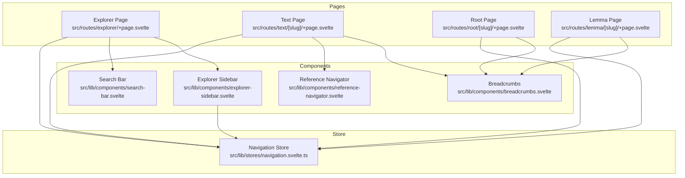
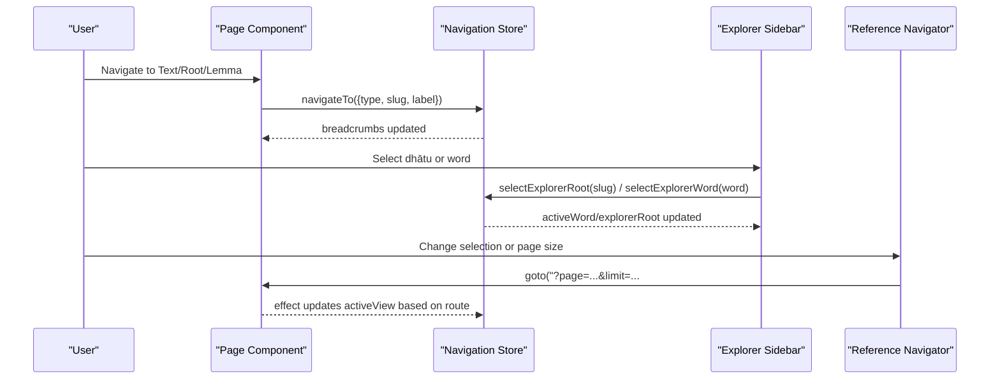
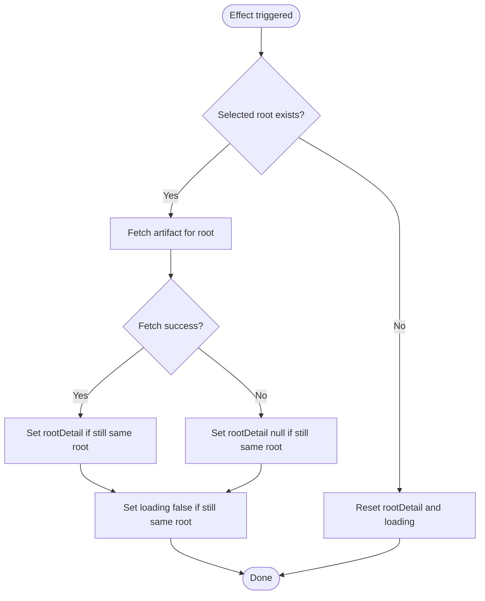
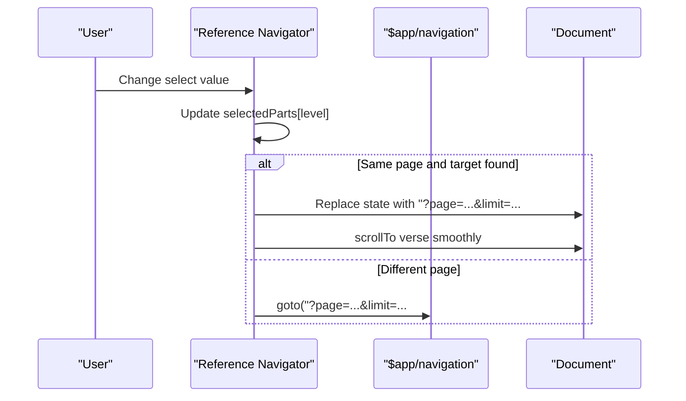
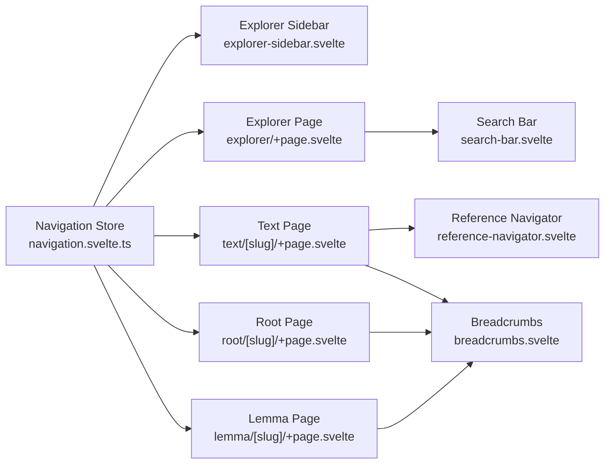

# Navigation Components

<cite>
**Referenced Files in This Document**
- [breadcrumbs.svelte](file://src/lib/components/breadcrumbs.svelte)
- [explorer-sidebar.svelte](file://src/lib/components/explorer-sidebar.svelte)
- [reference-navigator.svelte](file://src/lib/components/reference-navigator.svelte)
- [navigation.svelte.ts](file://src/lib/stores/navigation.svelte.ts)
- [search-bar.svelte](file://src/lib/components/search-bar.svelte)
- [+page.svelte (Explorer)](file://src/routes/explorer/+page.svelte)
- [+page.svelte (Text)](file://src/routes/text/[slug]/+page.svelte)
- [+page.svelte (Root)](file://src/routes/root/[slug]/+page.svelte)
- [+page.svelte (Lemma)](file://src/routes/lemma/[slug]/+page.svelte)
</cite>

## Table of Contents
1. Introduction
2. Project Structure
3. Core Components
4. Architecture Overview
5. Detailed Component Analysis
6. Dependency Analysis
7. Performance Considerations
8. Troubleshooting Guide
9. Conclusion

## Introduction
This document explains the navigation system used across the application, focusing on three key components:
- Breadcrumbs for hierarchical navigation with clickable segments and active state management
- Explorer Sidebar for search-driven exploration of dhātus and words, with filtering and result presentation
- Reference Navigator for cross-referencing between texts, roots, and concepts via structured passage navigation

It also documents the navigation store’s role in managing global state, synchronizing routes, and tracking the active view. The guide includes examples of component composition patterns, event propagation, and state synchronization across components, as well as keyboard navigation, accessibility features, and responsive design considerations.

## Project Structure
The navigation-related code is organized into reusable Svelte components under src/lib/components and a shared navigation store under src/lib/stores. Pages import these components to compose rich navigation experiences.

**Diagram sources**
- [breadcrumbs.svelte:1-53](file://src/lib/components/breadcrumbs.svelte#L1-L53)
- [explorer-sidebar.svelte:1-86](file://src/lib/components/explorer-sidebar.svelte#L1-L86)
- [reference-navigator.svelte:1-107](file://src/lib/components/reference-navigator.svelte#L1-L107)
- [navigation.svelte.ts:1-160](file://src/lib/stores/navigation.svelte.ts#L1-L160)
- [+page.svelte (Explorer):1-155](file://src/routes/explorer/+page.svelte#L1-L155)
- [+page.svelte (Text):1-160](file://src/routes/text/[slug]/+page.svelte#L1-L160)
- [+page.svelte (Root):1-132](file://src/routes/root/[slug]/+page.svelte#L1-L132)
- [+page.svelte (Lemma):1-123](file://src/routes/lemma/[slug]/+page.svelte#L1-L123)

**Section sources**
- [breadcrumbs.svelte:1-53](file://src/lib/components/breadcrumbs.svelte#L1-L53)
- [explorer-sidebar.svelte:1-86](file://src/lib/components/explorer-sidebar.svelte#L1-L86)
- [reference-navigator.svelte:1-107](file://src/lib/components/reference-navigator.svelte#L1-L107)
- [navigation.svelte.ts:1-160](file://src/lib/stores/navigation.svelte.ts#L1-L160)
- [+page.svelte (Explorer):1-155](file://src/routes/explorer/+page.svelte#L1-L155)
- [+page.svelte (Text):1-160](file://src/routes/text/[slug]/+page.svelte#L1-L160)
- [+page.svelte (Root):1-132](file://src/routes/root/[slug]/+page.svelte#L1-L132)
- [+page.svelte (Lemma):1-123](file://src/routes/lemma/[slug]/+page.svelte#L1-L123)

## Core Components
- Breadcrumbs: A lightweight, configurable breadcrumb trail that renders up to four segments with separators and hover styling. It is used across pages to indicate current location within the site hierarchy.
- Explorer Sidebar: Displays details for a selected dhātu (root), including meaning, grammatical info, and derived word groups. Users can select a word to open its lexical entry and see contextual information in a side panel.
- Reference Navigator: Provides hierarchical selection controls for navigating passages within a text. It supports multiple reference schemas (e.g., Ṛgveda, Atharvaveda Paippalada) and integrates with page URL parameters and hash-based scrolling.
- Search Bar: A client-side search input with debounced queries, result dropdown, and keyboard-friendly interactions. Used both globally and within the explorer page.

Key responsibilities:
- Breadcrumbs: Render static or dynamic links; rely on parent pages to set context.
- Explorer Sidebar: Fetch root detail artifacts, manage loading states, and propagate selections to the navigation store.
- Reference Navigator: Parse and display hierarchical references, update URL state, and scroll to target verses.
- Search Bar: Debounce input, abort previous requests, and present results with accessible roles.

**Section sources**
- [breadcrumbs.svelte:1-53](file://src/lib/components/breadcrumbs.svelte#L1-L53)
- [explorer-sidebar.svelte:1-86](file://src/lib/components/explorer-sidebar.svelte#L1-L86)
- [reference-navigator.svelte:1-107](file://src/lib/components/reference-navigator.svelte#L1-L107)
- [search-bar.svelte:1-88](file://src/lib/components/search-bar.svelte#L1-L88)

## Architecture Overview
The navigation system centers around a single navigation store that holds global state such as the active view, breadcrumbs, pane visibility, user stage, selected text classes, active word, and explorer root selection. Pages and components read from and write to this store to keep UI consistent.

**Diagram sources**
- [navigation.svelte.ts:41-159](file://src/lib/stores/navigation.svelte.ts#L41-L159)
- [explorer-sidebar.svelte:12-41](file://src/lib/components/explorer-sidebar.svelte#L12-L41)
- [reference-navigator.svelte:57-88](file://src/lib/components/reference-navigator.svelte#L57-L88)
- [+page.svelte (Text):56-59](file://src/routes/text/[slug]/+page.svelte#L56-L59)

## Detailed Component Analysis

### Breadcrumbs Component
- Purpose: Provide hierarchical navigation with clickable segments and hover styling. Supports up to four segments with conditional rendering.
- Props: link1/link1Label, link2/link2Label, optional link3/isLink3/link3Label, optional link4/isLink4/link4Label.
- Behavior: Renders anchor elements separated by “/”. Styling uses CSS variables for colors and hover effects.
- Usage: Integrated into multiple pages to reflect current context.

Accessibility and UX:
- Links are standard anchors with clear labels.
- Hover states improve discoverability.
- No explicit ARIA attributes are required beyond semantic nav usage.

Responsive considerations:
- Uses small font sizes and compact layout suitable for top-of-page placement.

Composition pattern:
- Parent pages pass props to tailor the trail per route.

Keyboard navigation:
- Standard anchor focus and activation via Enter/Space.

State synchronization:
- Does not hold state; relies on props passed by parent pages.

**Section sources**
- [breadcrumbs.svelte:1-53](file://src/lib/components/breadcrumbs.svelte#L1-L53)
- [+page.svelte (Text):63-63](file://src/routes/text/[slug]/+page.svelte#L63-L63)
- [+page.svelte (Root):36-36](file://src/routes/root/[slug]/+page.svelte#L36-L36)
- [+page.svelte (Lemma):35-35](file://src/routes/lemma/[slug]/+page.svelte#L35-L35)

### Explorer Sidebar Component
- Purpose: Show detailed information about a selected dhātu (root) and allow selecting derived words to inspect their lexical entries.
- Data flow: Reads selected root from navigation store, fetches artifact data, manages loading/error states, and updates active word selection.
- Interactions:
  - Clicking a word triggers selection via navigation store.
  - Close button clears selection.
  - Context lens displays when a word is active.

State synchronization:
- Subscribes to nav.explorerRoot and nav.activeWord.
- Updates local loading and rootDetail state accordingly.

Error handling:
- Catches fetch errors and resets state if selection changes during request.

Accessibility:
- Button with aria-label for closing details.
- Semantic header and section structure.

Responsive considerations:
- Layout adapts to available space; content sections wrap gracefully.

Composition pattern:
- Consumed by pages that control which root is selected; renders ContextLens when appropriate.

Keyboard navigation:
- Buttons are focusable and activatable via Enter/Space.

Event propagation:
- Click handlers call store methods directly; no bubbling needed.

**Diagram sources**
- [explorer-sidebar.svelte:12-31](file://src/lib/components/explorer-sidebar.svelte#L12-L31)

**Section sources**
- [explorer-sidebar.svelte:1-86](file://src/lib/components/explorer-sidebar.svelte#L1-L86)
- [navigation.svelte.ts:118-131](file://src/lib/stores/navigation.svelte.ts#L118-L131)

### Reference Navigator Component
- Purpose: Enable hierarchical navigation within a text using passage-level selectors (e.g., Maṇḍala → Sūkta → Ṛca).
- Inputs: textSlug, references array, currentPage, pageSize.
- Logic:
  - Derives path parts and labels based on text type.
  - Builds options per level from references filtered by prior selections.
  - On selection, navigates to the target page and scrolls to the verse via hash.
  - Supports changing page size and resetting navigation.

URL synchronization:
- Uses window.history.replaceState for same-page navigation and goto for cross-page navigation.
- Hash fragment points to specific verse index.

Accessibility:
- Each select has an aria-label describing the level.
- Grouped controls for screen readers.

Responsive considerations:
- Compact selects fit within a row; page size selector adjusts content density.

Keyboard navigation:
- Native select behavior allows arrow keys and Enter to choose options.

Event propagation:
- onchange handlers update local state and trigger navigation.

**Diagram sources**
- [reference-navigator.svelte:57-88](file://src/lib/components/reference-navigator.svelte#L57-L88)

**Section sources**
- [reference-navigator.svelte:1-107](file://src/lib/components/reference-navigator.svelte#L1-L107)

### Search Bar Component
- Purpose: Provide a fast, debounced search experience with a dropdown of results.
- Features:
  - Debounces input to reduce network calls.
  - Aborts previous requests to avoid race conditions.
  - Displays spinner while loading and toggles dropdown visibility.
  - Results are links to lemma pages with preload hints.

Accessibility:
- Uses role="listbox" and role="option" for results list.
- aria-selected attribute indicates selection state.

Keyboard navigation:
- Input handles focus/blur; results close after blur with delay to allow clicks.

Performance:
- AbortController prevents stale responses.
- Debounce reduces unnecessary API calls.

**Section sources**
- [search-bar.svelte:1-88](file://src/lib/components/search-bar.svelte#L1-L88)

### Navigation Store
- Purpose: Centralized state for navigation across the app, including active view, breadcrumbs, pane visibility, user stage, selected text classes, active word, and explorer root selection.
- Key state:
  - activeView: Current view type, slug, and label.
  - breadcrumbs: Array of segments for display.
  - panes: left/right visibility flags.
  - userStage: Progressive onboarding stage.
  - selectedTextClasses: Filtered text categories.
  - activeWord: Selected lexical entry with optional root context.
  - explorerRoot: Currently selected dhātu root.
- Methods:
  - navigateTo(view): Sets active view and builds breadcrumbs.
  - togglePane(side), setPane(side, visible): Controls pane visibility.
  - advanceStage(), setStage(stage): Manages user stage.
  - toggleTextClass(classId), clearTextClasses(): Filters text classes.
  - setActiveWord(word), selectExplorerRoot(slug), selectExplorerWord(word), clearExplorerSelection(): Coordinates word and root selection.

Synchronization:
- Pages call navigateTo on mount to update breadcrumbs and active view.
- Components like explorer sidebar and root pages update activeWord and explorerRoot to drive UI state.

**Section sources**
- [navigation.svelte.ts:1-160](file://src/lib/stores/navigation.svelte.ts#L1-L160)
- [+page.svelte (Text):56-59](file://src/routes/text/[slug]/+page.svelte#L56-L59)
- [+page.svelte (Root):17-25](file://src/routes/root/[slug]/+page.svelte#L17-L25)
- [explorer-sidebar.svelte:33-41](file://src/lib/components/explorer-sidebar.svelte#L33-L41)

## Dependency Analysis
The following diagram shows how components depend on the navigation store and each other:

**Diagram sources**
- [navigation.svelte.ts:1-160](file://src/lib/stores/navigation.svelte.ts#L1-L160)
- [explorer-sidebar.svelte:1-86](file://src/lib/components/explorer-sidebar.svelte#L1-L86)
- [+page.svelte (Explorer):1-155](file://src/routes/explorer/+page.svelte#L1-L155)
- [+page.svelte (Text):1-160](file://src/routes/text/[slug]/+page.svelte#L1-L160)
- [+page.svelte (Root):1-132](file://src/routes/root/[slug]/+page.svelte#L1-L132)
- [+page.svelte (Lemma):1-123](file://src/routes/lemma/[slug]/+page.svelte#L1-L123)
- [reference-navigator.svelte:1-107](file://src/lib/components/reference-navigator.svelte#L1-L107)
- [search-bar.svelte:1-88](file://src/lib/components/search-bar.svelte#L1-L88)
- [breadcrumbs.svelte:1-53](file://src/lib/components/breadcrumbs.svelte#L1-L53)

**Section sources**
- [navigation.svelte.ts:1-160](file://src/lib/stores/navigation.svelte.ts#L1-L160)
- [explorer-sidebar.svelte:1-86](file://src/lib/components/explorer-sidebar.svelte#L1-L86)
- [+page.svelte (Explorer):1-155](file://src/routes/explorer/+page.svelte#L1-L155)
- [+page.svelte (Text):1-160](file://src/routes/text/[slug]/+page.svelte#L1-L160)
- [+page.svelte (Root):1-132](file://src/routes/root/[slug]/+page.svelte#L1-L132)
- [+page.svelte (Lemma):1-123](file://src/routes/lemma/[slug]/+page.svelte#L1-L123)
- [reference-navigator.svelte:1-107](file://src/lib/components/reference-navigator.svelte#L1-L107)
- [search-bar.svelte:1-88](file://src/lib/components/search-bar.svelte#L1-L88)
- [breadcrumbs.svelte:1-53](file://src/lib/components/breadcrumbs.svelte#L1-L53)

## Performance Considerations
- Debounced search: Reduces network load and improves responsiveness.
- AbortController: Prevents race conditions and wasted work on rapid typing.
- Conditional fetching: Explorer sidebar only fetches when a root is selected.
- Efficient state updates: Navigation store updates are minimal and targeted.
- Scroll performance: Smooth scrolling uses native APIs and avoids heavy computations.

[No sources needed since this section provides general guidance]

## Troubleshooting Guide
Common issues and resolutions:
- Stale search results: Ensure debounce timer is cleared and AbortController cancels previous requests.
- Selection mismatch: Verify that selected root or word matches current state before updating UI.
- Navigation not updating: Confirm navigateTo is called on page mount and that URL parameters match expected format.
- Scrolling to verse fails: Check that the target element exists and content container is available before scrolling.

**Section sources**
- [search-bar.svelte:9-34](file://src/lib/components/search-bar.svelte#L9-L34)
- [explorer-sidebar.svelte:12-31](file://src/lib/components/explorer-sidebar.svelte#L12-L31)
- [reference-navigator.svelte:72-78](file://src/lib/components/reference-navigator.svelte#L72-L78)

## Conclusion
The navigation system combines lightweight, composable components with a centralized store to deliver a cohesive browsing experience. Breadcrumbs provide clear context, the explorer sidebar enables deep lexical exploration, and the reference navigator offers precise passage navigation. Together with accessible, keyboard-friendly interactions and responsive layouts, these components form a robust foundation for exploring Sanskrit texts and related resources.

[No sources needed since this section summarizes without analyzing specific files]