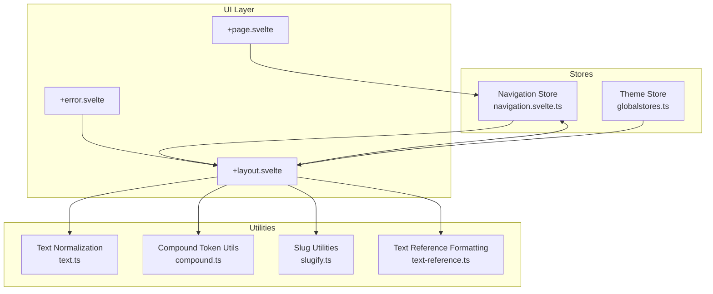
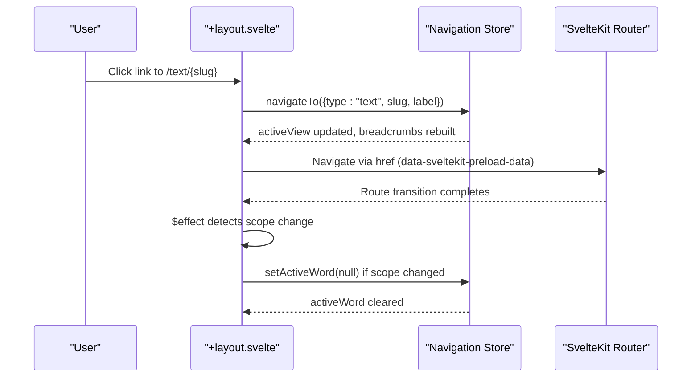
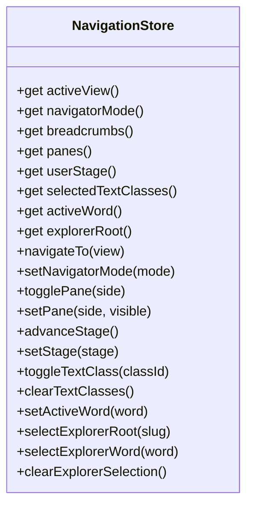
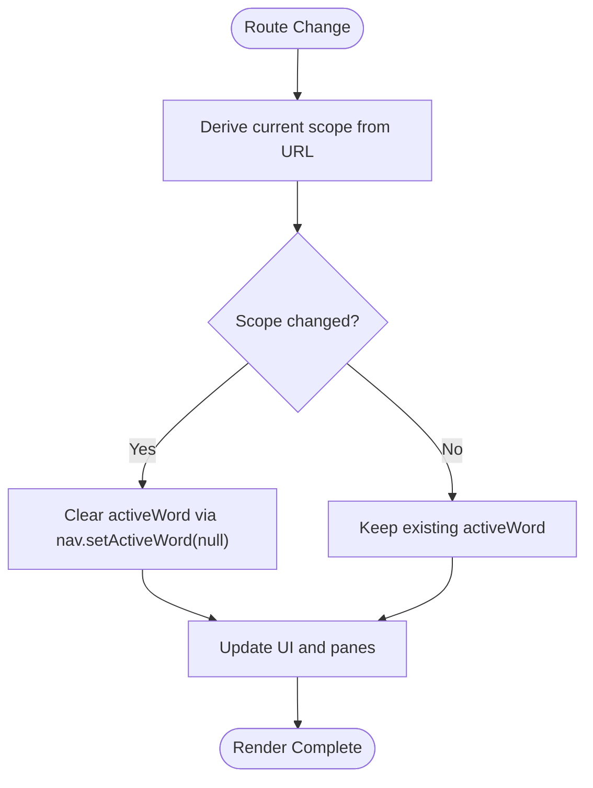
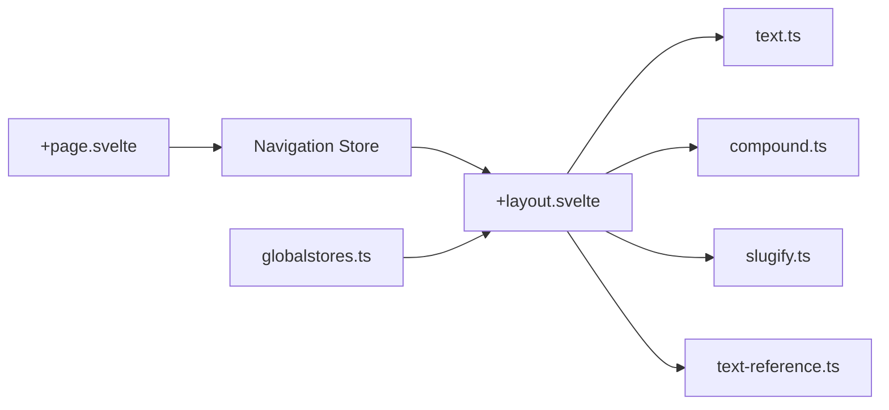

# State Management

<cite>
**Referenced Files in This Document**
- [navigation.svelte.ts](file://src/lib/stores/navigation.svelte.ts)
- [globalstores.ts](file://src/lib/stores/globalstores.ts)
- [compound.ts](file://src/lib/utils/compound.ts)
- [slugify.ts](file://src/lib/utils/slugify.ts)
- [text-reference.ts](file://src/lib/utils/text-reference.ts)
- [text.ts](file://src/lib/utils/text.ts)
- [+layout.svelte](file://src/routes/+layout.svelte)
- [+page.svelte](file://src/routes/+page.svelte)
- [+error.svelte](file://src/routes/+error.svelte)
- [hooks.server.ts](file://src/hooks.server.ts)
</cite>

## Table of Contents
1. [Introduction](#introduction)
2. [Project Structure](#project-structure)
3. [Core Components](#core-components)
4. [Architecture Overview](#architecture-overview)
5. [Detailed Component Analysis](#detailed-component-analysis)
6. [Dependency Analysis](#dependency-analysis)
7. [Performance Considerations](#performance-considerations)
8. [Troubleshooting Guide](#troubleshooting-guide)
9. [Conclusion](#conclusion)

## Introduction
This document explains FractalDharma’s state management system centered on the navigation store. It covers the reactive store architecture built with Svelte runes, state synchronization patterns across components, and cross-component communication via a shared store. It also documents the navigation state model (active views, breadcrumbs, word selection, pane visibility, text class filters, explorer selections), utility functions for URL manipulation and data transformation, integration with SvelteKit routing, parameter validation strategies, and error handling approaches. Finally, it provides guidance on performance considerations for reactive updates, memory management, and debugging techniques for state-related issues.

## Project Structure
The state management system is primarily implemented in:
- A Svelte 5 rune-based navigation store that holds global UI and navigation state.
- A small theme store using Svelte’s writable store for persistence.
- Utility modules for text normalization, slug generation, and compound token processing.
- The root layout component that wires the navigation store to the UI and reacts to route changes.
- Route-level pages that initialize or reset state as needed.
- Global error hooks and error page for server-side and client-side error handling.

**Diagram sources**
- [navigation.svelte.ts:1-160](file://src/lib/stores/navigation.svelte.ts#L1-L160)
- [globalstores.ts:1-14](file://src/lib/stores/globalstores.ts#L1-L14)
- [slugify.ts:1-41](file://src/lib/utils/slugify.ts#L1-L41)
- [text.ts:1-24](file://src/lib/utils/text.ts#L1-L24)
- [compound.ts:1-71](file://src/lib/utils/compound.ts#L1-L71)
- [text-reference.ts:1-12](file://src/lib/utils/text-reference.ts#L1-L12)
- [+layout.svelte:1-303](file://src/routes/+layout.svelte#L1-L303)
- [+page.svelte:1-43](file://src/routes/+page.svelte#L1-L43)
- [+error.svelte:1-16](file://src/routes/+error.svelte#L1-L16)

**Section sources**
- [navigation.svelte.ts:1-160](file://src/lib/stores/navigation.svelte.ts#L1-L160)
- [globalstores.ts:1-14](file://src/lib/stores/globalstores.ts#L1-L14)
- [slugify.ts:1-41](file://src/lib/utils/slugify.ts#L1-L41)
- [text.ts:1-24](file://src/lib/utils/text.ts#L1-L24)
- [compound.ts:1-71](file://src/lib/utils/compound.ts#L1-L71)
- [text-reference.ts:1-12](file://src/lib/utils/text-reference.ts#L1-L12)
- [+layout.svelte:1-303](file://src/routes/+layout.svelte#L1-L303)
- [+page.svelte:1-43](file://src/routes/+page.svelte#L1-L43)
- [+error.svelte:1-16](file://src/routes/+error.svelte#L1-L16)

## Core Components
- Navigation Store: A single source of truth for navigation state, panes, active view, breadcrumbs, user stage, selected text classes, active word, and explorer selections. Implemented with Svelte runes for fine-grained reactivity.
- Theme Store: A simple writable store persisted to localStorage for dark/light mode toggling.
- Text Utilities: Functions for diacritic stripping, search normalization, slug generation, unique slug creation, and reference formatting.
- Compound Token Utilities: Helpers to detect unresolved tokens, compute edit distance, extract compound components, and produce visible token sequences.
- Layout Integration: The root layout reads from the navigation store, derives current scope from the URL, and synchronizes the active word when scopes change.

Key responsibilities:
- Navigation Store manages application-wide UI state and actions to mutate it.
- Utilities provide deterministic transformations for URLs and text content.
- Layout coordinates route-driven state changes and UI panel visibility.

**Section sources**
- [navigation.svelte.ts:1-160](file://src/lib/stores/navigation.svelte.ts#L1-L160)
- [globalstores.ts:1-14](file://src/lib/stores/globalstores.ts#L1-L14)
- [text.ts:1-24](file://src/lib/utils/text.ts#L1-L24)
- [slugify.ts:1-41](file://src/lib/utils/slugify.ts#L1-L41)
- [compound.ts:1-71](file://src/lib/utils/compound.ts#L1-L71)
- [text-reference.ts:1-12](file://src/lib/utils/text-reference.ts#L1-L12)
- [+layout.svelte:1-303](file://src/routes/+layout.svelte#L1-L303)

## Architecture Overview
The navigation store exposes getters and action creators. Components subscribe to reactive state via Svelte runes and derived values. The layout computes current scope from the URL and resets or clears active word when scope changes. Actions like navigateTo update activeView and breadcrumbs; pane toggles control left/right panels; text class filtering drives sidebar lists; explorer selection toggles between root and word focus.

**Diagram sources**
- [+layout.svelte:1-303](file://src/routes/+layout.svelte#L1-L303)
- [navigation.svelte.ts:1-160](file://src/lib/stores/navigation.svelte.ts#L1-L160)

## Detailed Component Analysis

### Navigation Store
The navigation store encapsulates all global UI and navigation state using Svelte runes ($state). It exposes:
- Getters for activeView, navigatorMode, breadcrumbs, panes (left/right), userStage, selectedTextClasses, activeWord, explorerRoot.
- Action creators: navigateTo, setNavigatorMode, togglePane, setPane, advanceStage, setStage, toggleTextClass, clearTextClasses, setActiveWord, selectExplorerRoot, selectExplorerWord, clearExplorerSelection.

State model highlights:
- Active View: Tracks current view type (text/root/word) and metadata (slug, label).
- Breadcrumbs: Dynamically constructed based on activeView type.
- Panes: Independent visibility flags for left and right panels.
- User Stage: Progressive onboarding or flow steps.
- Selected Text Classes: Array used to filter available texts.
- Active Word: Represents currently selected word context, including optional root context and compound components.
- Explorer Selection: Either a root slug or an active word, mutually exclusive.

**Diagram sources**
- [navigation.svelte.ts:1-160](file://src/lib/stores/navigation.svelte.ts#L1-L160)

**Section sources**
- [navigation.svelte.ts:1-160](file://src/lib/stores/navigation.svelte.ts#L1-L160)

### Theme Store
A minimal writable store persists dark mode preference to localStorage. Provides a toggle function that updates the store and persists the new value.

Usage pattern:
- Subscribe to the store in components to apply theme classes.
- Call toggleTheme to switch modes.

**Section sources**
- [globalstores.ts:1-14](file://src/lib/stores/globalstores.ts#L1-L14)

### Text Utilities
- stripDiacritics: Removes combining marks and accents to produce plain ASCII forms.
- normalizeForSearch: Lowercases and strips diacritics for case- and diacritic-insensitive comparisons.
- displayTextReference: Formats references per text-specific conventions (e.g., Rigveda, Atharvaveda Paippalada).

These utilities ensure consistent normalization across client and server logic.

**Section sources**
- [text.ts:1-24](file://src/lib/utils/text.ts#L1-L24)
- [text-reference.ts:1-12](file://src/lib/utils/text-reference.ts#L1-L12)

### Slug Utilities
- slugify: Converts IAST strings to ASCII slugs by normalizing, stripping combining marks, lowercasing, replacing non-alphanumeric characters with dashes, and trimming.
- uniqueSlug: Ensures uniqueness by appending numeric suffixes when collisions occur.

These are essential for generating stable URLs and identifiers.

**Section sources**
- [slugify.ts:1-41](file://src/lib/utils/slugify.ts#L1-L41)

### Compound Token Utilities
- isUnresolvedToken: Detects placeholder tokens indicating unresolved compounds.
- getCompoundComponents: Extracts constituent tokens for a compound, using either explicit bounds or fuzzy matching via edit distance.
- visibleTokens: Produces a sequence of visible tokens, skipping over resolved compounds.

These helpers support rich text rendering and interactive word selection.

**Section sources**
- [compound.ts:1-71](file://src/lib/utils/compound.ts#L1-L71)

### Layout Integration and Route Synchronization
The root layout:
- Subscribes to nav state and uses derived values to compute current scope from the URL.
- Clears activeWord when scope changes to avoid stale context.
- Manages mobile menu state and desktop detection.
- Renders left/main/right panels conditionally and controls pane visibility.

**Diagram sources**
- [+layout.svelte:1-303](file://src/routes/+layout.svelte#L1-L303)
- [navigation.svelte.ts:1-160](file://src/lib/stores/navigation.svelte.ts#L1-L160)

**Section sources**
- [+layout.svelte:1-303](file://src/routes/+layout.svelte#L1-L303)
- [navigation.svelte.ts:1-160](file://src/lib/stores/navigation.svelte.ts#L1-L160)

### Home Page Initialization
On mount, the home page closes both panes to present a clean landing experience. This ensures consistent initial state regardless of prior navigation.

**Section sources**
- [+page.svelte:1-43](file://src/routes/+page.svelte#L1-L43)

### Error Handling
- Server-side error hook logs errors and returns a generic message.
- Client-side error page displays status codes and messages, with a link back to the home page.

These mechanisms centralize error presentation and logging.

**Section sources**
- [hooks.server.ts:1-12](file://src/hooks.server.ts#L1-L12)
- [+error.svelte:1-16](file://src/routes/+error.svelte#L1-L16)

## Dependency Analysis
The navigation store is consumed by the layout and home page. Utilities are used within the layout for search normalization and text processing. The theme store is integrated into the layout for applying theme classes.

**Diagram sources**
- [navigation.svelte.ts:1-160](file://src/lib/stores/navigation.svelte.ts#L1-L160)
- [globalstores.ts:1-14](file://src/lib/stores/globalstores.ts#L1-L14)
- [text.ts:1-24](file://src/lib/utils/text.ts#L1-L24)
- [compound.ts:1-71](file://src/lib/utils/compound.ts#L1-L71)
- [slugify.ts:1-41](file://src/lib/utils/slugify.ts#L1-L41)
- [text-reference.ts:1-12](file://src/lib/utils/text-reference.ts#L1-L12)
- [+layout.svelte:1-303](file://src/routes/+layout.svelte#L1-L303)
- [+page.svelte:1-43](file://src/routes/+page.svelte#L1-L43)

**Section sources**
- [navigation.svelte.ts:1-160](file://src/lib/stores/navigation.svelte.ts#L1-L160)
- [globalstores.ts:1-14](file://src/lib/stores/globalstores.ts#L1-L14)
- [text.ts:1-24](file://src/lib/utils/text.ts#L1-L24)
- [compound.ts:1-71](file://src/lib/utils/compound.ts#L1-L71)
- [slugify.ts:1-41](file://src/lib/utils/slugify.ts#L1-L41)
- [text-reference.ts:1-12](file://src/lib/utils/text-reference.ts#L1-L12)
- [+layout.svelte:1-303](file://src/routes/+layout.svelte#L1-L303)
- [+page.svelte:1-43](file://src/routes/+page.svelte#L1-L43)

## Performance Considerations
- Reactive Updates: Use Svelte runes for fine-grained reactivity. Avoid unnecessary recomputations by deriving values only where needed and keeping derived computations lightweight.
- Memory Management: Clear activeWord and explorer selections when scopes change to prevent stale references. Avoid retaining large arrays in long-lived stores unless necessary.
- Search Filtering: Normalize inputs once and reuse normalized values in derived computations to reduce repeated work.
- Pane Visibility: Toggle panes explicitly rather than auto-toggling during navigation to avoid unintended side effects and extra renders.
- Logging and Debugging: Centralize error logging in server hooks and use console outputs sparingly in development. Leverage browser devtools to inspect store state and derived values.

[No sources needed since this section provides general guidance]

## Troubleshooting Guide
Common issues and resolutions:
- Stale Active Word: If navigating between scopes, ensure activeWord is cleared to avoid displaying outdated context.
- Pane State Conflicts: Do not auto-toggle panes inside navigation actions; rely on explicit user interactions or layout initialization.
- Search Results Not Updating: Verify normalization functions are applied consistently and that derived computations depend on the correct store fields.
- Theme Persistence Failures: Confirm localStorage availability and JSON serialization correctness in the theme store.
- Errors Not Displayed: Check server-side error hook and client-side error page configuration to ensure proper propagation and rendering.

**Section sources**
- [hooks.server.ts:1-12](file://src/hooks.server.ts#L1-L12)
- [+error.svelte:1-16](file://src/routes/+error.svelte#L1-L16)
- [globalstores.ts:1-14](file://src/lib/stores/globalstores.ts#L1-L14)
- [+layout.svelte:1-303](file://src/routes/+layout.svelte#L1-L303)
- [navigation.svelte.ts:1-160](file://src/lib/stores/navigation.svelte.ts#L1-L160)

## Conclusion
FractalDharma’s state management leverages a centralized navigation store built with Svelte runes for precise reactivity, complemented by utility modules for robust text and URL handling. The layout orchestrates route-driven state synchronization and UI composition, while error handling is centralized for consistency. By following the documented patterns—explicit action creators, careful scope-based state clearing, and normalized data transformations—the system achieves clarity, maintainability, and performance.

[No sources needed since this section summarizes without analyzing specific files]