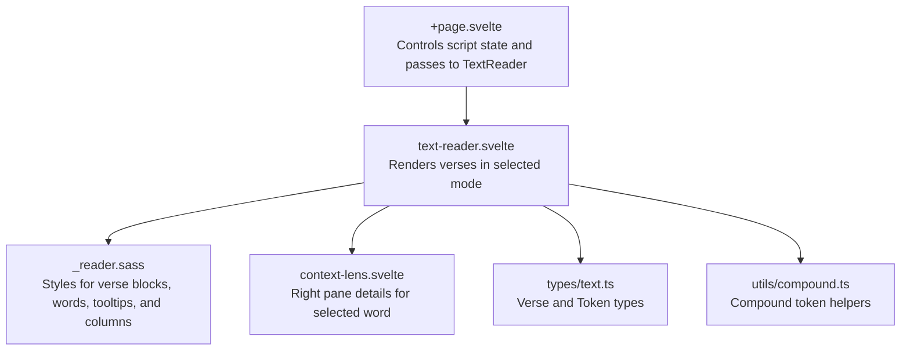
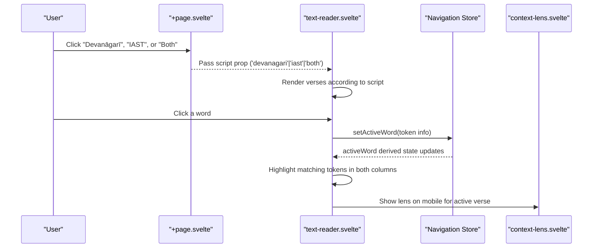
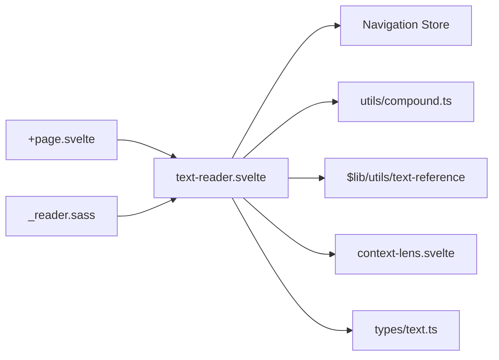

# Script Display Modes

<cite>
**Referenced Files in This Document**
- [text-reader.svelte](file://src/lib/components/text-reader.svelte)
- [+page.svelte](file://src/routes/text/[slug]/+page.svelte)
- [_reader.sass](file://src/lib/styles/_reader.sass)
- [context-lens.svelte](file://src/lib/components/context-lens.svelte)
- [text.ts](file://src/lib/types/text.ts)
- [compound.ts](file://src/lib/utils/compound.ts)
</cite>

## Table of Contents
1. [Introduction](#introduction)
2. [Project Structure](#project-structure)
3. [Core Components](#core-components)
4. [Architecture Overview](#architecture-overview)
5. [Detailed Component Analysis](#detailed-component-analysis)
6. [Dependency Analysis](#dependency-analysis)
7. [Performance Considerations](#performance-considerations)
8. [Troubleshooting Guide](#troubleshooting-guide)
9. [Conclusion](#conclusion)
10. [Appendices](#appendices)

## Introduction
This document explains the text reader’s script display modes functionality, focusing on how the component renders Devanāgarī and IAST transliteration based on a script prop. It covers:
- The three display modes: devanagari (Devanāgarī only), iast (IAST only), and both (dual-column comparison).
- How the component renders different scripts based on the script prop.
- Text alignment between columns and responsive layout for mobile devices.
- Configuration options, styling considerations per script type, and accessibility features for screen readers.
- Performance optimization strategies for large texts with multiple script displays and browser compatibility considerations.

## Project Structure
The script display modes are implemented primarily in the text reader component and controlled by the page that hosts it. Styling is centralized in a shared stylesheet. Supporting utilities provide token visibility and compound handling.

**Diagram sources**
- [+page.svelte:1-160](file://src/routes/text/[slug]/+page.svelte#L1-L160)
- [text-reader.svelte:1-175](file://src/lib/components/text-reader.svelte#L1-L175)
- [_reader.sass:1-259](file://src/lib/styles/_reader.sass#L1-L259)
- [context-lens.svelte:1-200](file://src/lib/components/context-lens.svelte#L1-L200)
- [text.ts:1-25](file://src/lib/types/text.ts#L1-L25)
- [compound.ts:1-20](file://src/lib/utils/compound.ts#L1-L20)

**Section sources**
- [+page.svelte:1-160](file://src/routes/text/[slug]/+page.svelte#L1-L160)
- [text-reader.svelte:1-175](file://src/lib/components/text-reader.svelte#L1-L175)
- [_reader.sass:1-259](file://src/lib/styles/_reader.sass#L1-L259)

## Core Components
- TextReader component: Pure display component that renders a slice of verses provided by the parent. It does not manage pagination; it focuses on rendering and interaction.
- Page controller: Owns script selection state and pagination, passing the current script mode to TextReader.
- Styles: Centralized SASS styles define typography, spacing, column behavior, and tooltip presentation.
- Context Lens: Displays detailed lexical information for the currently selected word.

Key responsibilities:
- Rendering Devanāgarī and/or IAST text based on the script prop.
- Highlighting active words across both columns when in dual-column mode.
- Managing mobile-specific behavior such as showing the context lens inline for the active verse.

**Section sources**
- [text-reader.svelte:1-175](file://src/lib/components/text-reader.svelte#L1-L175)
- [+page.svelte:1-160](file://src/routes/text/[slug]/+page.svelte#L1-L160)
- [_reader.sass:1-259](file://src/lib/styles/_reader.sass#L1-L259)
- [context-lens.svelte:1-200](file://src/lib/components/context-lens.svelte#L1-L200)

## Architecture Overview
The script display mode flows from the page-level state into the TextReader component, which conditionally renders one or two columns of text. Interactions update a global navigation store to highlight matching tokens across both columns.

**Diagram sources**
- [+page.svelte:1-160](file://src/routes/text/[slug]/+page.svelte#L1-L160)
- [text-reader.svelte:1-175](file://src/lib/components/text-reader.svelte#L1-L175)
- [context-lens.svelte:1-200](file://src/lib/components/context-lens.svelte#L1-L200)

## Detailed Component Analysis

### Script Display Modes
- devanagari: Renders only the Devanāgarī column.
- iast: Renders only the IAST column.
- both: Renders both columns side-by-side for comparison.

Implementation highlights:
- Conditional rendering based on script prop ensures only requested columns are present in the DOM.
- In both mode, each verse block contains two paragraphs (one per script), enabling direct visual comparison.
- Word highlighting uses lemma_id to match tokens across both columns, ensuring synchronized emphasis.

Accessibility:
- Each word element has role="button" and tabindex="0" to be keyboard-focusable.
- Keyboard handlers allow activation via Enter or Space.
- Tooltips use role="tooltip" to convey grammatical information to assistive technologies.
- The control group for script selection uses aria-label and aria-pressed to indicate current mode.

Responsive behavior:
- On mobile (viewport width ≤ 1024px), the component shows the ContextLens inline below the active verse to keep analysis close to the reading flow.
- Columns remain readable with flexible line-wrapping and appropriate font sizes per script.

Styling considerations:
- Verse text uses overflow-wrap and white-space rules to handle long lines gracefully.
- Devanāgarī column typically uses larger font size and line height for readability.
- Tooltip styling provides clear contrast and positioning above words without obstructing content.

**Section sources**
- [text-reader.svelte:1-175](file://src/lib/components/text-reader.svelte#L1-L175)
- [+page.svelte:1-160](file://src/routes/text/[slug]/+page.svelte#L1-L160)
- [_reader.sass:1-259](file://src/lib/styles/_reader.sass#L1-L259)

### Column Alignment and Text Layout
- Each verse block wraps its columns in a container that applies single-script or dual-column layout depending on the script prop.
- Paragraph elements for each script maintain consistent spacing and typography.
- Words are rendered sequentially with space separators, preserving natural reading order within each column.
- In both mode, alignment is achieved through consistent paragraph structure and CSS grid/flex layouts applied at the container level.

Mobile layout:
- The component detects viewport width and toggles mobile-specific UI, including inline lens display for the active verse.
- Font sizes and line heights adapt to ensure readability on smaller screens.

**Section sources**
- [text-reader.svelte:1-175](file://src/lib/components/text-reader.svelte#L1-L175)
- [_reader.sass:1-259](file://src/lib/styles/_reader.sass#L1-L259)

### Interaction Flow and Highlighting
When a user clicks a word:
- The component records the verse index and updates the active word in the navigation store.
- Highlighting logic compares lemma_id across all visible tokens in both columns.
- For compounds, unresolved tokens are highlighted by matching surface form.

Keyboard support:
- Focusable words respond to Enter and Space keys to activate interactions.
- Tooltips appear on hover and focus-visible states for enhanced accessibility.

**Section sources**
- [text-reader.svelte:1-175](file://src/lib/components/text-reader.svelte#L1-L175)
- [compound.ts:1-20](file://src/lib/utils/compound.ts#L1-L20)

### Data Types and Utilities
- Verse and Token types define the shape of data passed into the reader.
- Compound utilities help identify unresolved tokens and map components for analysis.
- Visible tokens utility filters tokens for rendering, improving performance by avoiding unnecessary DOM nodes.

**Section sources**
- [text.ts:1-25](file://src/lib/types/text.ts#L1-L25)
- [compound.ts:1-20](file://src/lib/utils/compound.ts#L1-L20)

## Dependency Analysis
The TextReader component depends on:
- Navigation store for active word state and pane management.
- Token visibility and compound utilities for rendering and highlighting.
- Text reference utilities for displaying verse references.
- Context Lens for detailed lexical information.

**Diagram sources**
- [text-reader.svelte:1-175](file://src/lib/components/text-reader.svelte#L1-L175)
- [+page.svelte:1-160](file://src/routes/text/[slug]/+page.svelte#L1-L160)
- [_reader.sass:1-259](file://src/lib/styles/_reader.sass#L1-L259)

**Section sources**
- [text-reader.svelte:1-175](file://src/lib/components/text-reader.svelte#L1-L175)
- [+page.svelte:1-160](file://src/routes/text/[slug]/+page.svelte#L1-L160)

## Performance Considerations
Optimization strategies for large texts with multiple script displays:
- Virtualization: Consider virtualizing verses to render only those within the viewport, reducing DOM size and reflow costs.
- Memoization: Use derived values and memoization for expensive computations like tooltip rows and feature parsing.
- Lazy loading: Defer loading of heavy lexical data until a word is selected.
- Efficient filtering: Ensure visibleTokens filters out non-visible tokens early to minimize rendering work.
- Batched updates: Group state updates to avoid excessive re-renders during rapid interactions.

Browser compatibility:
- Modern browsers support Svelte runes and reactive statements used in the component.
- Ensure fallbacks for older environments if needed, particularly for advanced CSS features like overflow-wrap and flexbox behaviors.

[No sources needed since this section provides general guidance]

## Troubleshooting Guide
Common issues and resolutions:
- Words not highlighting across columns: Verify lemma_id consistency and ensure both columns render the same token set.
- Tooltips not appearing: Check CSS classes and focus/hover states; ensure role="tooltip" is present.
- Mobile lens not showing: Confirm viewport width detection and active verse index matching.
- Script mode not updating: Ensure the page-level script state is correctly bound and passed to TextReader.

**Section sources**
- [text-reader.svelte:1-175](file://src/lib/components/text-reader.svelte#L1-L175)
- [+page.svelte:1-160](file://src/routes/text/[slug]/+page.svelte#L1-L160)
- [_reader.sass:1-259](file://src/lib/styles/_reader.sass#L1-L259)

## Conclusion
The text reader’s script display modes provide a flexible and accessible way to view Devanāgarī and IAST texts, either independently or side-by-side. The implementation emphasizes clean separation of concerns, responsive design, and strong accessibility support. With careful attention to performance and browser compatibility, the component can efficiently handle large texts while maintaining an optimal user experience.

[No sources needed since this section summarizes without analyzing specific files]

## Appendices

### Configuration Options
- script: 'devanagari' | 'iast' | 'both' — Controls which columns are rendered.
- verses: Array of Verse objects — Provides the text content to display.
- textSlug: string — Used for generating reference links.

### Accessibility Features
- Keyboard navigation for word selection.
- ARIA labels and roles for interactive elements and tooltips.
- Screen reader-friendly structure with semantic HTML elements.

### Styling Guidelines
- Use consistent typography for Devanāgarī and IAST columns.
- Ensure sufficient contrast for tooltips and highlighted words.
- Apply responsive breakpoints to optimize mobile reading experience.

[No sources needed since this section provides general guidance]