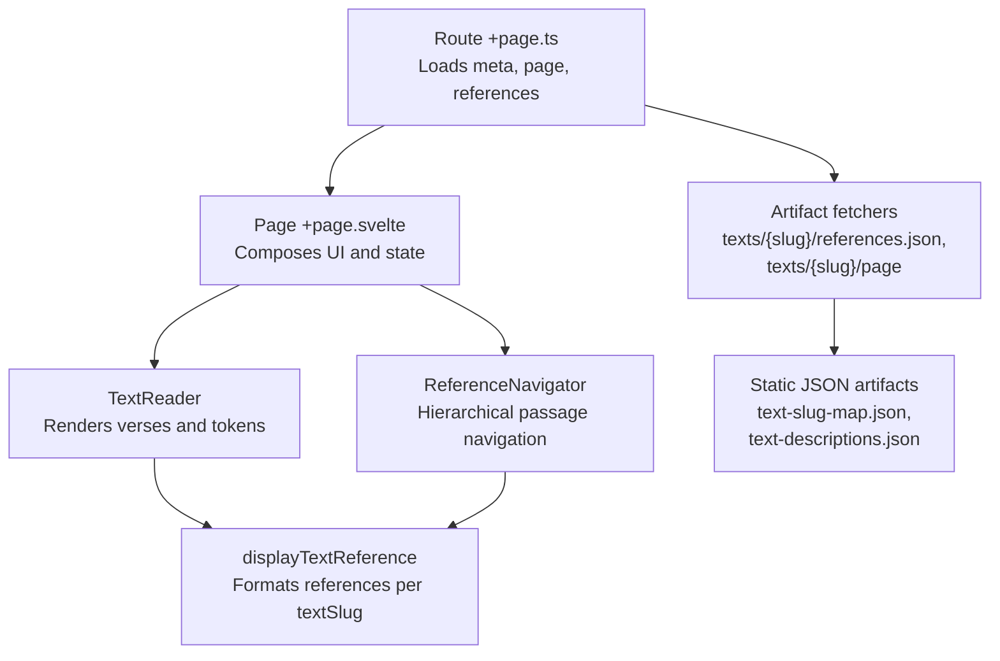
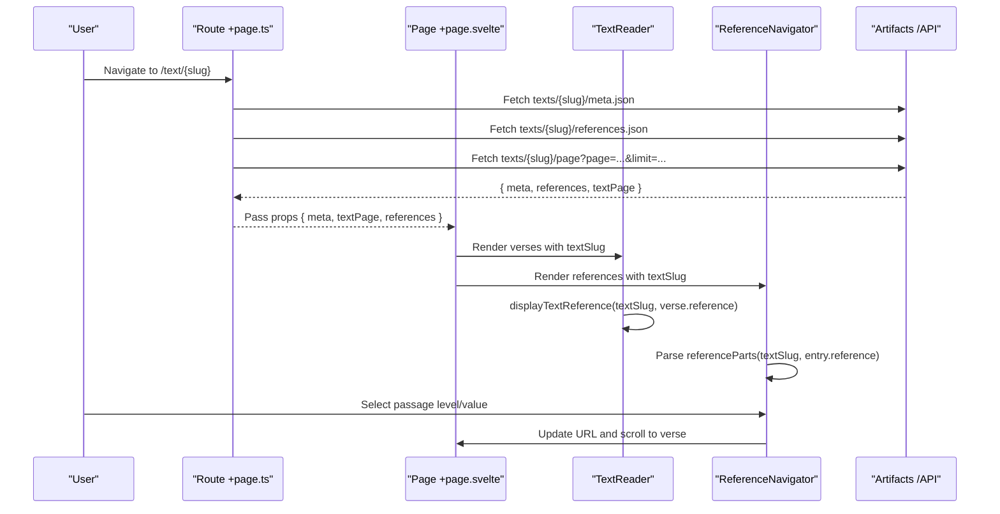
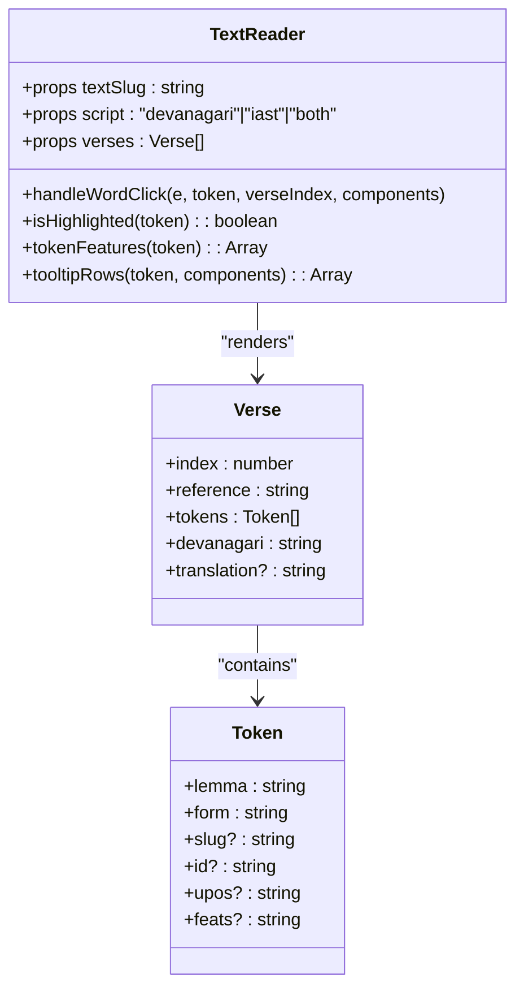
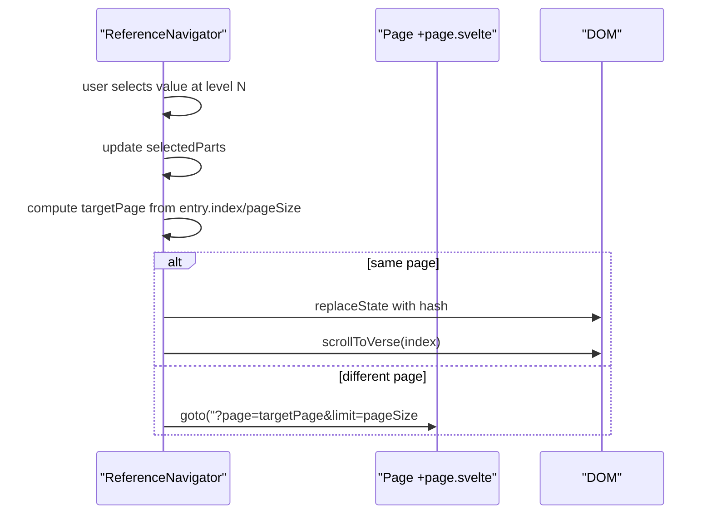
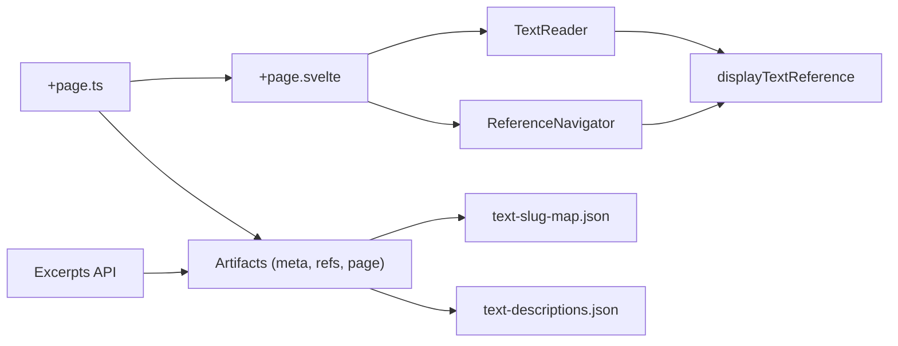

# Text Metadata and Reference Display

<cite>
**Referenced Files in This Document**
- [text-reader.svelte](file://src/lib/components/text-reader.svelte)
- [reference-navigator.svelte](file://src/lib/components/reference-navigator.svelte)
- [text-reference.ts](file://src/lib/utils/text-reference.ts)
- [types.ts](file://src/lib/data/types.ts)
- [+page.svelte](file://src/routes/text/[slug]/+page.svelte)
- [+page.ts](file://src/routes/text/[slug]/+page.ts)
- [build-query-artifacts.mjs](file://scripts/lib/build-query-artifacts.mjs)
- [text-slug-map.json](file://static/data/text-slug-map.json)
- [text-descriptions.json](file://static/data/text-descriptions.json)
- [+server.ts](file://src/routes/api/word-excerpts/[lemma]/+server.ts)
</cite>

## Table of Contents
1. [Introduction](#introduction)
2. [Project Structure](#project-structure)
3. [Core Components](#core-components)
4. [Architecture Overview](#architecture-overview)
5. [Detailed Component Analysis](#detailed-component-analysis)
6. [Dependency Analysis](#dependency-analysis)
7. [Performance Considerations](#performance-considerations)
8. [Troubleshooting Guide](#troubleshooting-guide)
9. [Conclusion](#conclusion)
10. [Appendices](#appendices)

## Introduction
This document explains how the text reader component handles text metadata and displays references. It focuses on:
- How textSlug drives readable reference formatting via displayTextReference
- How verse references are parsed, formatted, and navigated
- Integration with artifact systems for data retrieval (meta, pages, references)
- Metadata structure including identifiers, numbering schemes, and cross-references
- Customization points for reference formatting and localization
- Performance strategies for metadata lookups
- Accessibility considerations for screen readers when announcing references and navigation context

## Project Structure
The text reading experience is composed of a route that loads artifacts, a page that composes UI components, and reusable components for rendering verses and navigating references.

**Diagram sources**
- [+page.ts:1-50](file://src/routes/text/[slug]/+page.ts#L1-L50)
- [+page.svelte:1-31](file://src/routes/text/[slug]/+page.svelte#L1-L31)
- [text-reader.svelte:1-175](file://src/lib/components/text-reader.svelte#L1-L175)
- [reference-navigator.svelte:1-107](file://src/lib/components/reference-navigator.svelte#L1-L107)
- [text-reference.ts:1-12](file://src/lib/utils/text-reference.ts#L1-L12)
- [types.ts:1-92](file://src/lib/data/types.ts#L1-L92)
- [text-slug-map.json:1-257](file://static/data/text-slug-map.json#L1-L257)
- [text-descriptions.json:1-800](file://static/data/text-descriptions.json#L1-L800)

**Section sources**
- [+page.ts:1-50](file://src/routes/text/[slug]/+page.ts#L1-L50)
- [+page.svelte:1-31](file://src/routes/text/[slug]/+page.svelte#L1-L31)
- [text-reader.svelte:1-175](file://src/lib/components/text-reader.svelte#L1-L175)
- [reference-navigator.svelte:1-107](file://src/lib/components/reference-navigator.svelte#L1-L107)
- [text-reference.ts:1-12](file://src/lib/utils/text-reference.ts#L1-L12)
- [types.ts:1-92](file://src/lib/data/types.ts#L1-L92)
- [text-slug-map.json:1-257](file://static/data/text-slug-map.json#L1-L257)
- [text-descriptions.json:1-800](file://static/data/text-descriptions.json#L1-L800)

## Core Components
- TextReader: Pure presentation of a slice of verses; renders Devanagari and/or IAST scripts; highlights active words; wires clicks to the context lens; uses displayTextReference to format each verse’s reference.
- ReferenceNavigator: Hierarchical dropdowns to jump to specific passages based on parsed reference parts; adapts labels per text tradition; updates URL and scrolls to target verse.
- displayTextReference: Utility that normalizes raw references into readable strings tailored by textSlug.
- Types and Artifacts: Strongly typed contracts for meta, page, and references; build-time artifacts generate paginated views and index references.

Key responsibilities:
- Formatting: displayTextReference centralizes per-tradition normalization.
- Navigation: ReferenceNavigator parses numeric parts and maps them to options and URLs.
- Rendering: TextReader formats tokenized verses and exposes word interactions.
- Data: Route layer fetches artifacts and passes structured data down.

**Section sources**
- [text-reader.svelte:1-175](file://src/lib/components/text-reader.svelte#L1-L175)
- [reference-navigator.svelte:1-107](file://src/lib/components/reference-navigator.svelte#L1-L107)
- [text-reference.ts:1-12](file://src/lib/utils/text-reference.ts#L1-L12)
- [types.ts:1-92](file://src/lib/data/types.ts#L1-L92)

## Architecture Overview
The system follows a clear separation between data loading, presentation, and reference handling.

**Diagram sources**
- [+page.ts:1-50](file://src/routes/text/[slug]/+page.ts#L1-L50)
- [+page.svelte:1-31](file://src/routes/text/[slug]/+page.svelte#L1-L31)
- [text-reader.svelte:1-175](file://src/lib/components/text-reader.svelte#L1-L175)
- [reference-navigator.svelte:1-107](file://src/lib/components/reference-navigator.svelte#L1-L107)
- [text-reference.ts:1-12](file://src/lib/utils/text-reference.ts#L1-L12)

## Detailed Component Analysis

### TextReader Component
Responsibilities:
- Renders a given array of verses with optional Devanagari and IAST scripts.
- Highlights tokens matching the active word from the navigation store.
- Formats each verse’s reference using displayTextReference.
- Wires word clicks to set the active word and open the right pane.

Data model usage:
- Verse contains tokens, devanagari string, translation, and reference.
- Token includes lemma, form, slug, id, upos, feats.

Accessibility:
- Words are interactive with role="button", tabindex="0", and keyboard handlers.
- Tooltips use role="tooltip".
- The component does not announce references directly to screen readers beyond visible text; ensure surrounding elements provide context.

Customization points:
- Script mode selection ('devanagari', 'iast', 'both').
- Tooltip content derived from UPOS and features.

**Section sources**
- [text-reader.svelte:1-175](file://src/lib/components/text-reader.svelte#L1-L175)
- [text-reference.ts:1-12](file://src/lib/utils/text-reference.ts#L1-L12)

#### Class-like relationships in TextReader

**Diagram sources**
- [text-reader.svelte:1-175](file://src/lib/components/text-reader.svelte#L1-L175)
- [types.ts:1-92](file://src/lib/data/types.ts#L1-L92)

### ReferenceNavigator Component
Responsibilities:
- Builds hierarchical navigation from references array.
- Parses reference parts per textSlug to populate cascading selects.
- Updates URL and scrolls to the target verse without full reload when possible.

Reference parsing:
- For Ṛgveda: extracts Maṇḍala, Sūkta, Ṛca levels.
- For Atharvaveda Paippalada: extracts Section and Verse levels.
- Fallback: extracts numeric segments from displayTextReference output.

Localization:
- Labels are localized per tradition (e.g., “Maṇḍala”, “Sūkta”, “Ṛca”).

Accessibility:
- Each select has an aria-label describing its purpose.
- Keyboard navigation supported through native controls.

**Section sources**
- [reference-navigator.svelte:1-107](file://src/lib/components/reference-navigator.svelte#L1-L107)
- [text-reference.ts:1-12](file://src/lib/utils/text-reference.ts#L1-L12)

#### Sequence: Passage selection flow

**Diagram sources**
- [reference-navigator.svelte:1-107](file://src/lib/components/reference-navigator.svelte#L1-L107)
- [+page.svelte:1-31](file://src/routes/text/[slug]/+page.svelte#L1-L31)

### displayTextReference Utility
Behavior:
- Ṛgveda: strips prefix and joins numeric parts with dots.
- Atharvaveda Paippalada: returns the human-friendly portion after the section number.
- Default: removes leading non-numeric prefix and replaces commas with dots.

Extensibility:
- Add new branches for additional traditions or custom label styles.

**Section sources**
- [text-reference.ts:1-12](file://src/lib/utils/text-reference.ts#L1-L12)

### Route Layer and Artifact Integration
- +page.ts fetches:
  - Meta artifact for title, counts, description
  - References artifact for hierarchical navigation
  - Page artifact for the current slice of verses
- +page.svelte composes UI, derives pagination info, and passes data to TextReader and ReferenceNavigator.

Build-time artifacts:
- buildTextArtifacts generates paginated pages and enriches tokens with slugs.
- text-slug-map.json provides canonical slug mapping for titles.
- text-descriptions.json provides rich descriptions and related texts.

**Section sources**
- [+page.ts:1-50](file://src/routes/text/[slug]/+page.ts#L1-L50)
- [+page.svelte:1-31](file://src/routes/text/[slug]/+page.svelte#L1-L31)
- [build-query-artifacts.mjs:64-103](file://scripts/lib/build-query-artifacts.mjs#L64-L103)
- [text-slug-map.json:1-257](file://static/data/text-slug-map.json#L1-L257)
- [text-descriptions.json:1-800](file://static/data/text-descriptions.json#L1-L800)

### Word Excerpts API
- Endpoint serves excerpts keyed by normalized lemma slug, returning a small set of occurrences across texts.
- Uses asciiKey and bucketFor for efficient artifact lookup.

**Section sources**
- [+server.ts:1-25](file://src/routes/api/word-excerpts/[lemma]/+server.ts#L1-L25)

## Dependency Analysis

**Diagram sources**
- [text-reader.svelte:1-175](file://src/lib/components/text-reader.svelte#L1-L175)
- [reference-navigator.svelte:1-107](file://src/lib/components/reference-navigator.svelte#L1-L107)
- [text-reference.ts:1-12](file://src/lib/utils/text-reference.ts#L1-L12)
- [+page.svelte:1-31](file://src/routes/text/[slug]/+page.svelte#L1-L31)
- [+page.ts:1-50](file://src/routes/text/[slug]/+page.ts#L1-L50)
- [text-slug-map.json:1-257](file://static/data/text-slug-map.json#L1-L257)
- [text-descriptions.json:1-800](file://static/data/text-descriptions.json#L1-L800)
- [+server.ts:1-25](file://src/routes/api/word-excerpts/[lemma]/+server.ts#L1-L25)

**Section sources**
- [text-reader.svelte:1-175](file://src/lib/components/text-reader.svelte#L1-L175)
- [reference-navigator.svelte:1-107](file://src/lib/components/reference-navigator.svelte#L1-L107)
- [text-reference.ts:1-12](file://src/lib/utils/text-reference.ts#L1-L12)
- [+page.svelte:1-31](file://src/routes/text/[slug]/+page.svelte#L1-L31)
- [+page.ts:1-50](file://src/routes/text/[slug]/+page.ts#L1-L50)
- [text-slug-map.json:1-257](file://static/data/text-slug-map.json#L1-L257)
- [text-descriptions.json:1-800](file://static/data/text-descriptions.json#L1-L800)
- [+server.ts:1-25](file://src/routes/api/word-excerpts/[lemma]/+server.ts#L1-L25)

## Performance Considerations
- Pagination: Pages are built in fixed-size chunks during artifact generation to limit payload size and render cost.
- Token slug resolution: Build-time slug resolution avoids runtime guessing and ensures stable links.
- Reference parsing: Numeric extraction is lightweight and cached via derived state in Svelte components.
- Artifact fetching: Parallel requests for meta, references, and page reduce total load time.
- DOM scrolling: Smooth scroll only when necessary; avoid reflows by targeting known selectors.

Recommendations:
- Cache artifact responses where appropriate (HTTP caching headers).
- Defer heavy computations off the main thread if reference parsing grows complex.
- Use virtualization for very large verse lists if needed.

[No sources needed since this section provides general guidance]

## Troubleshooting Guide
Common issues and resolutions:
- Incorrect reference display: Verify textSlug matches the intended tradition; add or adjust rules in displayTextReference.
- Navigator options missing: Ensure references.json includes entries with parseable numeric parts; fallback shows raw reference.
- Navigation not scrolling: Confirm verse elements have data-verse-index attributes; check container selector used for scrolling.
- Slow initial load: Check artifact sizes; consider splitting references or lazy-loading descriptions.

**Section sources**
- [reference-navigator.svelte:1-107](file://src/lib/components/reference-navigator.svelte#L1-L107)
- [text-reader.svelte:1-175](file://src/lib/components/text-reader.svelte#L1-L175)
- [text-reference.ts:1-12](file://src/lib/utils/text-reference.ts#L1-L12)

## Conclusion
The text reader integrates robust metadata handling with tradition-aware reference formatting and navigation. By centralizing reference logic in displayTextReference and leveraging artifact-driven data flows, the system remains extensible for new traditions and customizable for localization. Accessibility is addressed through semantic roles and ARIA labels, while performance is optimized via pagination and efficient parsing.

[No sources needed since this section summarizes without analyzing specific files]

## Appendices

### Metadata Structure Summary
- TextMetaArtifact: slug, title, counts, description
- TextPageArtifact: pagination fields and verses
- TextReferenceArtifact: reference string, index, page
- Verse: tokens, devanagari, translation, reference
- Token: lemma, form, slug, id, upos, feats

**Section sources**
- [types.ts:1-92](file://src/lib/data/types.ts#L1-L92)

### Custom Reference Formatting Examples
- Ṛgveda: Normalize “ṚV, X, Y.Z” to “X.Y.Z”
- Atharvaveda Paippalada: Extract human-readable segment after section number
- Generic: Strip non-numeric prefixes and convert comma-separated numbers to dot-separated

**Section sources**
- [text-reference.ts:1-12](file://src/lib/utils/text-reference.ts#L1-L12)

### Localization Support Notes
- Labels for navigator levels are tradition-specific (e.g., Maṇḍala/Sūkta/Ṛca).
- To support additional traditions, extend referenceLabels and referenceParts accordingly.

**Section sources**
- [reference-navigator.svelte:1-107](file://src/lib/components/reference-navigator.svelte#L1-L107)

### Accessibility Checklist
- Interactive words: role="button", tabindex="0", keyboard handlers
- Tooltips: role="tooltip"
- Navigator selects: aria-label descriptive per level
- Announcing references: rely on visible text; consider adding aria-live regions if dynamic announcements are needed

**Section sources**
- [text-reader.svelte:1-175](file://src/lib/components/text-reader.svelte#L1-L175)
- [reference-navigator.svelte:1-107](file://src/lib/components/reference-navigator.svelte#L1-L107)