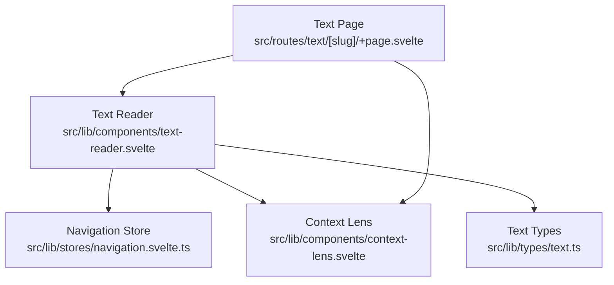
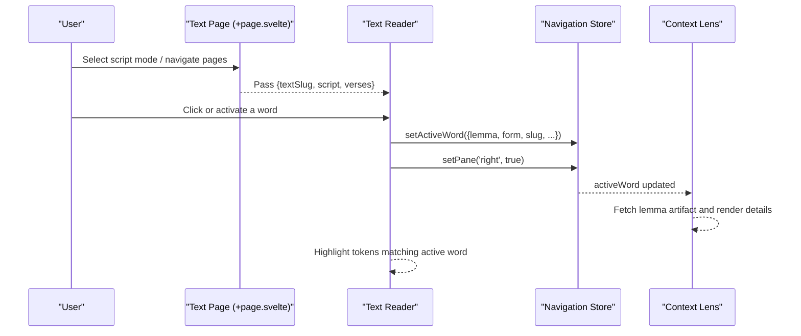
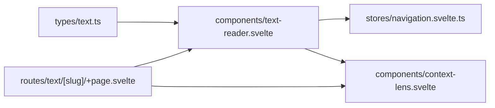

# Text Reader Component

<cite>
**Referenced Files in This Document**
- [text-reader.svelte](file://src/lib/components/text-reader.svelte)
- [navigation.svelte.ts](file://src/lib/stores/navigation.svelte.ts)
- [context-lens.svelte](file://src/lib/components/context-lens.svelte)
- [text.ts](file://src/lib/types/text.ts)
- [+page.svelte](file://src/routes/text/[slug]/+page.svelte)
</cite>

## Table of Contents
1. [Introduction](#introduction)
2. [Project Structure](#project-structure)
3. [Core Components](#core-components)
4. [Architecture Overview](#architecture-overview)
5. [Detailed Component Analysis](#detailed-component-analysis)
6. [Dependency Analysis](#dependency-analysis)
7. [Performance Considerations](#performance-considerations)
8. [Troubleshooting Guide](#troubleshooting-guide)
9. [Conclusion](#conclusion)
10. [Appendices](#appendices)

## Introduction
The Text Reader component is the core reading interface for Sanskrit texts. It renders verses with multi-script support (Devanāgarī and IAST), enables interactive word selection, highlights related words across the current page, and integrates with a navigation store to manage active word state and pane visibility. The component is intentionally pure-display: it does not own pagination or data loading; instead, it receives a slice of verses from its parent route and wires user interactions to global state for cross-component coordination.

## Project Structure
At runtime, the text reader lives within a SvelteKit route that owns pagination and script display mode toggles. The route passes props to the Text Reader, which renders each verse with tokens and optional translations. Word clicks update the navigation store, which drives the Context Lens (right pane) and breadcrumb updates.



**Diagram sources**
- [+page.svelte:1-160](file://src/routes/text/[slug]/+page.svelte#L1-L160)
- [text-reader.svelte:1-175](file://src/lib/components/text-reader.svelte#L1-L175)
- [navigation.svelte.ts:1-160](file://src/lib/stores/navigation.svelte.ts#L1-L160)
- [context-lens.svelte:1-234](file://src/lib/components/context-lens.svelte#L1-L234)
- [text.ts:1-25](file://src/lib/types/text.ts#L1-L25)

**Section sources**
- [+page.svelte:1-160](file://src/routes/text/[slug]/+page.svelte#L1-L160)
- [text-reader.svelte:1-175](file://src/lib/components/text-reader.svelte#L1-L175)

## Core Components
- Text Reader: Pure rendering of verses, multi-script display, word interaction, highlighting, and mobile lens visibility.
- Navigation Store: Global state for active word, panes, breadcrumbs, and view context.
- Context Lens: Right-side panel showing lemma details, root info, corpus profile, and occurrences based on the active word.
- Text Types: Shared TypeScript interfaces for Token and Verse used by reader and route.

Key responsibilities:
- Script modes: Devanāgarī, IAST, or both columns.
- Word interaction: Click/keyboard activation sets active word and opens right pane.
- Highlighting: Highlights tokens matching the active word or compound components.
- Mobile UX: Shows Context Lens inline when a verse is selected on small screens.

**Section sources**
- [text-reader.svelte:1-175](file://src/lib/components/text-reader.svelte#L1-L175)
- [navigation.svelte.ts:1-160](file://src/lib/stores/navigation.svelte.ts#L1-L160)
- [context-lens.svelte:1-234](file://src/lib/components/context-lens.svelte#L1-L234)
- [text.ts:1-25](file://src/lib/types/text.ts#L1-L25)

## Architecture Overview
The Text Reader is a presentational component that consumes typed verse data and emits events via the navigation store. The parent route manages pagination and UI controls, while the Context Lens reacts to the active word to fetch and display lexical data.



**Diagram sources**
- [+page.svelte:1-160](file://src/routes/text/[slug]/+page.svelte#L1-L160)
- [text-reader.svelte:1-175](file://src/lib/components/text-reader.svelte#L1-L175)
- [navigation.svelte.ts:1-160](file://src/lib/stores/navigation.svelte.ts#L1-L160)
- [context-lens.svelte:1-234](file://src/lib/components/context-lens.svelte#L1-L234)

## Detailed Component Analysis

### Text Reader Component
Responsibilities:
- Render verses with Devanāgarī and/or IAST text.
- Map tokens to interactive spans with tooltips.
- Handle click and keyboard activation to set active word.
- Highlight tokens based on active word or compound components.
- Show Context Lens inline on mobile when a verse is selected.

Props:
- textSlug: string — identifies the text.
- script: 'devanagari' | 'iast' | 'both' — controls script display.
- verses: Verse[] — paginated slice of verses to render.

State and derived values:
- activeWord: read from navigation store.
- viewportWidth/isMobile: computed from window width.
- selectedVerseIndex: tracks last clicked verse for mobile lens visibility.
- visiblePageKey: stabilizes selection reset when page content changes.

Interaction handlers:
- handleWordClick(e, token, verseIndex, components): normalizes token into ActiveWord, sets active word, opens right pane.
- isHighlighted(token): returns true if token matches active word or is part of an unresolved compound.

Rendering logic:
- For each verse, render Devanāgarī and/or IAST lines using visibleTokens utility.
- Each token span includes tooltip rows built from UPOS labels and feature mappings.
- Translation block rendered if available.
- On mobile, Context Lens appears only for the selected verse.

Accessibility:
- Words are interactive with role="button", tabindex="0", and keyboard activation for Enter/Space.
- Tooltips use role="tooltip".
- ARIA attributes provided at the page level for controls and groups.

Multi-script architecture:
- Conditional rendering based on script prop.
- Both scripts can be shown side-by-side; single-script mode removes extra container class.

Compound handling:
- Unresolved compounds are flagged via isUnresolvedToken; highlighting considers token.form equality for components.

Data integration:
- Uses Token and Verse types from shared types module.
- Uses asciiKey for slug normalization when needed.

Example usage pattern:
- Parent route passes textSlug, script, and verses to Text Reader.
- Pagination and script toggle live in the route; Text Reader remains pure.

**Section sources**
- [text-reader.svelte:1-175](file://src/lib/components/text-reader.svelte#L1-L175)
- [text.ts:1-25](file://src/lib/types/text.ts#L1-L25)

#### Class and Data Model Relationships
```mermaid
classDiagram
class Token {
+number id
+string form
+string lemma
+number lemma_id
+string upos
+string feats
+string slug
+number compoundEnd
}
class Verse {
+number index
+string reference
+string devanagari
+string iast
+string translation
+Token[] tokens
}
class ActiveWord {
+string lemma
+string form
+string slug
+number id
+number lemma_id
+string upos
+string feats
+boolean isCompound
+ActiveWord[] components
}
class TextReader {
+props : { textSlug : string, script : string, verses : Verse[] }
+handleWordClick()
+isHighlighted()
}
class NavigationStore {
+activeWord : ActiveWord
+setActiveWord(word)
+setPane(side, visible)
}
TextReader --> Verse : "renders"
TextReader --> Token : "interacts"
TextReader --> NavigationStore : "updates activeWord"
NavigationStore --> ActiveWord : "holds"
```

**Diagram sources**
- [text.ts:1-25](file://src/lib/types/text.ts#L1-L25)
- [text-reader.svelte:1-175](file://src/lib/components/text-reader.svelte#L1-L175)
- [navigation.svelte.ts:1-160](file://src/lib/stores/navigation.svelte.ts#L1-L160)

### Navigation Store Integration
The navigation store centralizes:
- activeWord: the currently selected word or compound.
- Pane visibility: left/right panels controlled by setPane/togglePane.
- Breadcrumbs: updated when navigating to different views.

How Text Reader uses it:
- On word click, Text Reader calls setActiveWord with normalized ActiveWord fields and setPane('right', true).
- Active word is consumed reactively to highlight tokens and drive Context Lens.

Breadcrumb updates:
- When the text page mounts, it navigates to a 'text' view, which builds a breadcrumb trail including the text title.

**Section sources**
- [navigation.svelte.ts:1-160](file://src/lib/stores/navigation.svelte.ts#L1-L160)
- [+page.svelte:1-160](file://src/routes/text/[slug]/+page.svelte#L1-L160)

### Context Lens Integration
The Context Lens displays full lemma entry details for the active word:
- Resolves lemma artifacts by bucket and normalized lemma.
- Handles multiple candidates and shows selection UI.
- Displays definitions, root info, occurrences, corpus profile, semantic classification, distribution, and sample concordance.

Relationship to Text Reader:
- Reacts to nav.activeWord changes.
- Supports drilling into compound components by setting them as active word.

**Section sources**
- [context-lens.svelte:1-234](file://src/lib/components/context-lens.svelte#L1-L234)
- [navigation.svelte.ts:1-160](file://src/lib/stores/navigation.svelte.ts#L1-L160)

### Route-Level Controls and Metadata
The text page provides:
- Pagination controls (previous/next, page selector).
- Script mode toggles (Devanāgarī, IAST, Both).
- Reference navigator integration.
- Meta information like title, description, tags, notable lemmas.
- Hash-based verse scrolling to target specific verses.

It passes these props to Text Reader and coordinates pane behavior through the navigation store.

**Section sources**
- [+page.svelte:1-160](file://src/routes/text/[slug]/+page.svelte#L1-L160)

## Dependency Analysis


**Diagram sources**
- [text.ts:1-25](file://src/lib/types/text.ts#L1-L25)
- [text-reader.svelte:1-175](file://src/lib/components/text-reader.svelte#L1-L175)
- [navigation.svelte.ts:1-160](file://src/lib/stores/navigation.svelte.ts#L1-L160)
- [context-lens.svelte:1-234](file://src/lib/components/context-lens.svelte#L1-L234)
- [+page.svelte:1-160](file://src/routes/text/[slug]/+page.svelte#L1-L160)

**Section sources**
- [text-reader.svelte:1-175](file://src/lib/components/text-reader.svelte#L1-L175)
- [navigation.svelte.ts:1-160](file://src/lib/stores/navigation.svelte.ts#L1-L160)
- [context-lens.svelte:1-234](file://src/lib/components/context-lens.svelte#L1-L234)
- [+page.svelte:1-160](file://src/routes/text/[slug]/+page.svelte#L1-L160)

## Performance Considerations
- Rendering large texts:
  - Keep verses slices small per page; rely on route-level pagination.
  - Avoid heavy computations inside render loops; precompute where possible.
  - Use visibleTokens utility to filter out non-visible tokens efficiently.
- Interaction performance:
  - Normalize token to ActiveWord once per click; avoid repeated conversions.
  - Debounce expensive operations in Context Lens if needed (e.g., artifact fetching).
- Memory management:
  - Reset selectedVerseIndex and clear active word when page key changes to prevent stale references.
- Accessibility and responsiveness:
  - Ensure keyboard navigation works without mouse.
  - On mobile, show Context Lens inline only for the selected verse to reduce layout shifts.

[No sources needed since this section provides general guidance]

## Troubleshooting Guide
Common issues and resolutions:
- No verses displayed:
  - Verify verses array is passed correctly from the route; ensure total > 0.
- Word click does nothing:
  - Check that handleWordClick is bound to each token span and that setActiveWord is called.
  - Confirm setPane('right', true) is invoked to open the Context Lens.
- Highlighting not working:
  - Ensure activeWord has lemma_id or isCompound flags set appropriately.
  - Validate isHighlighted logic against token properties.
- Compound components not highlighted:
  - Confirm isUnresolvedToken returns true and token.form matches activeWord.form for components.
- Mobile lens not appearing:
  - Verify isMobile is true and selectedVerseIndex matches the current verse index.
- Breadcrumbs not updating:
  - Ensure navigateTo is called on mount with correct view type and label.

**Section sources**
- [text-reader.svelte:1-175](file://src/lib/components/text-reader.svelte#L1-L175)
- [navigation.svelte.ts:1-160](file://src/lib/stores/navigation.svelte.ts#L1-L160)
- [+page.svelte:1-160](file://src/routes/text/[slug]/+page.svelte#L1-L160)

## Conclusion
The Text Reader component provides a clean, accessible, and responsive interface for reading Sanskrit texts with multi-script support and interactive word exploration. By delegating state to the navigation store and keeping rendering pure, it scales well with large corpora and integrates seamlessly with the Context Lens for deep lexical analysis. Proper pagination, keyboard accessibility, and mobile UX considerations ensure a robust reading experience.

[No sources needed since this section summarizes without analyzing specific files]

## Appendices

### Props and Data Structures
- Text Reader props:
  - textSlug: string
  - script: 'devanagari' | 'iast' | 'both'
  - verses: Verse[]
- Verse structure:
  - index: number
  - reference: string
  - devanagari: string
  - iast: string
  - translation?: string
  - tokens: Token[]
- Token structure:
  - id?: number
  - form: string
  - lemma: string
  - lemma_id: number
  - upos: string
  - feats?: string
  - slug?: string
  - compoundEnd?: number

**Section sources**
- [text-reader.svelte:1-175](file://src/lib/components/text-reader.svelte#L1-L175)
- [text.ts:1-25](file://src/lib/types/text.ts#L1-L25)

### Event Handling Patterns
- Word click handler:
  - Normalizes token to ActiveWord.
  - Sets active word in navigation store.
  - Opens right pane.
- Keyboard activation:
  - Enter or Space triggers same behavior as click.
- Tooltip generation:
  - Builds rows from UPOS labels and feature mappings.

**Section sources**
- [text-reader.svelte:1-175](file://src/lib/components/text-reader.svelte#L1-L175)

### Custom Styling Options
- Single-script mode applies a class to remove extra container styling.
- Highlighted words receive a highlighted class for visual emphasis.
- Mobile-specific lens container can be styled via className prop in Context Lens.

**Section sources**
- [text-reader.svelte:1-175](file://src/lib/components/text-reader.svelte#L1-L175)
- [context-lens.svelte:1-234](file://src/lib/components/context-lens.svelte#L1-L234)