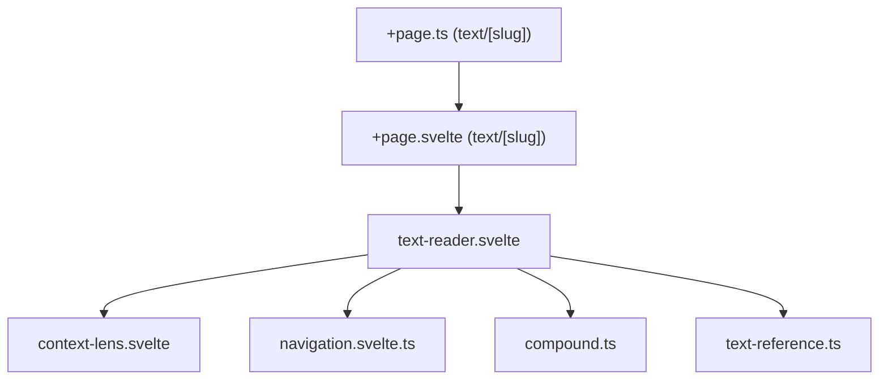
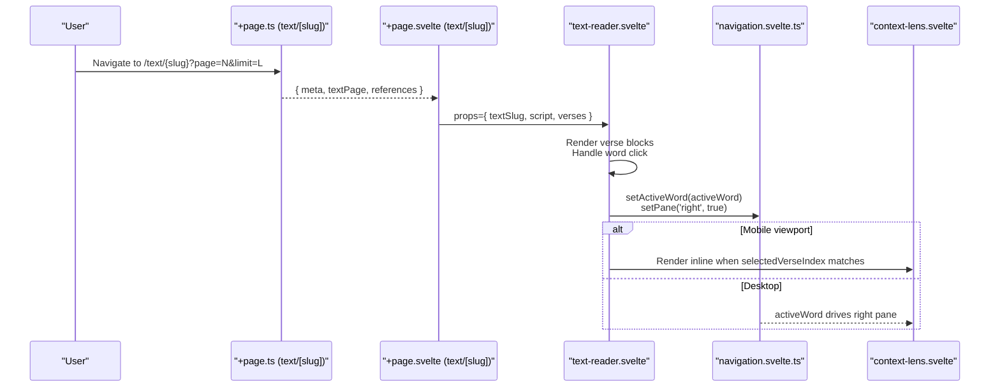
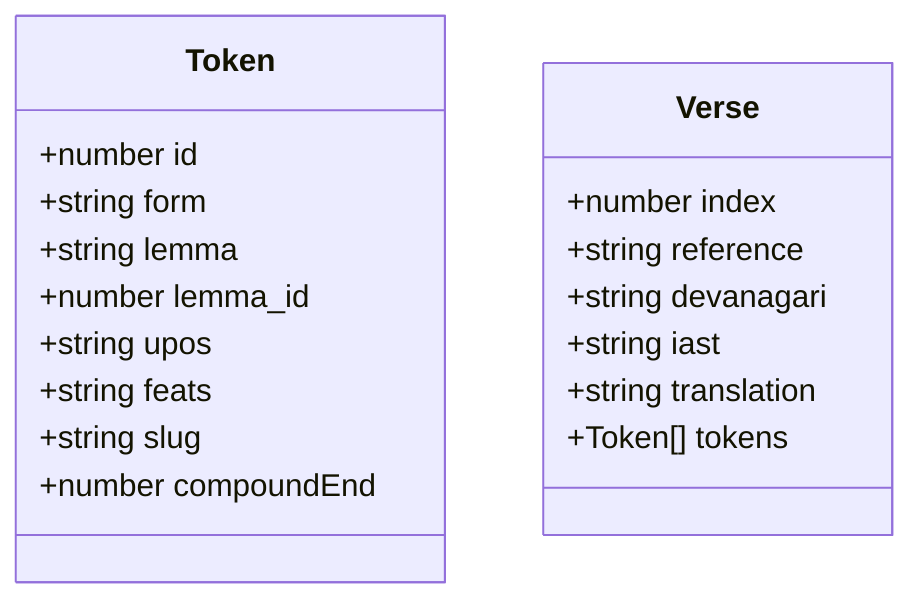
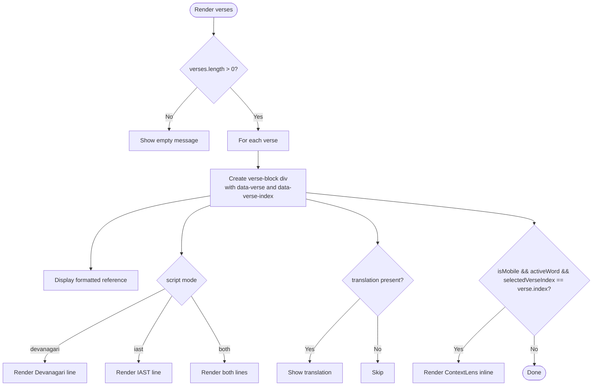
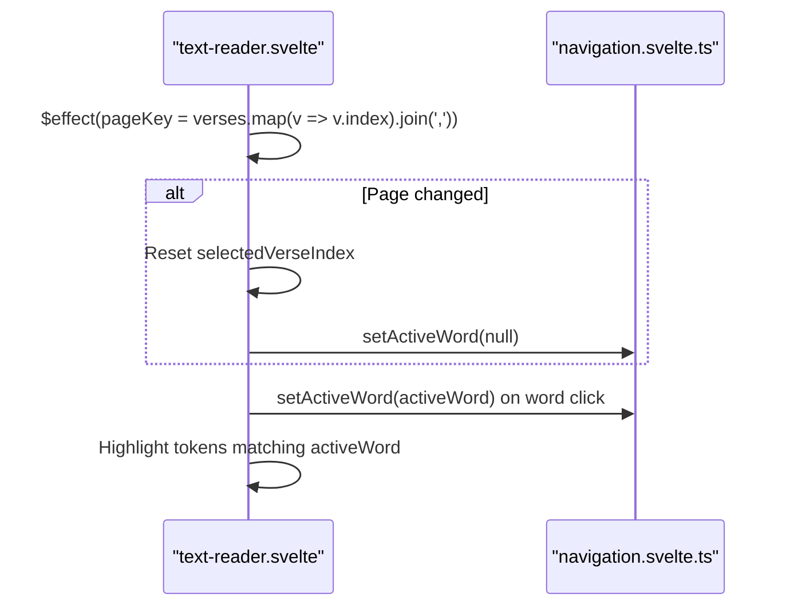
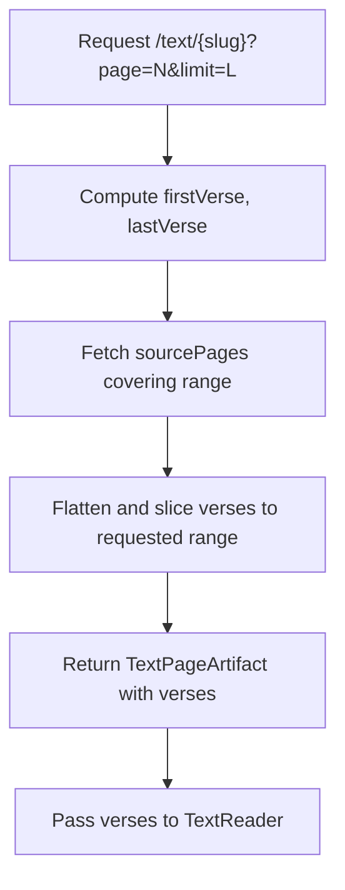
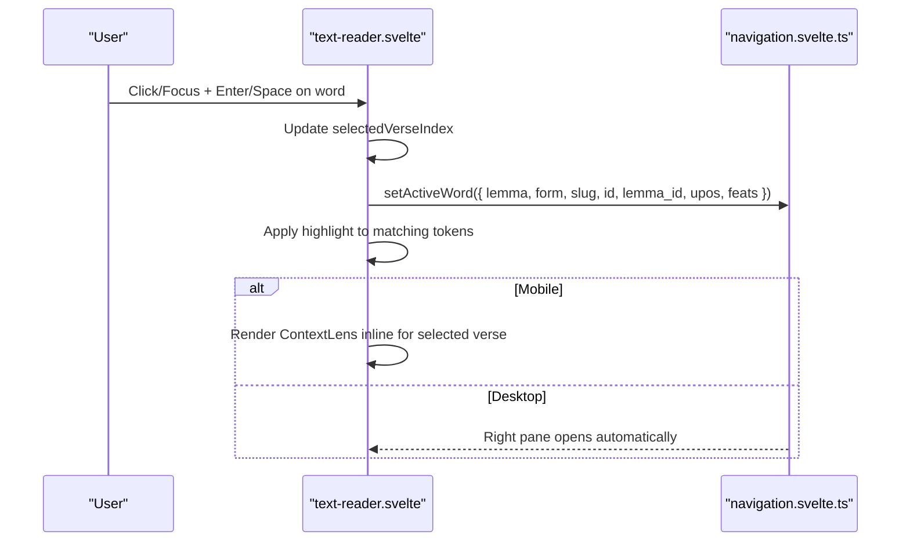
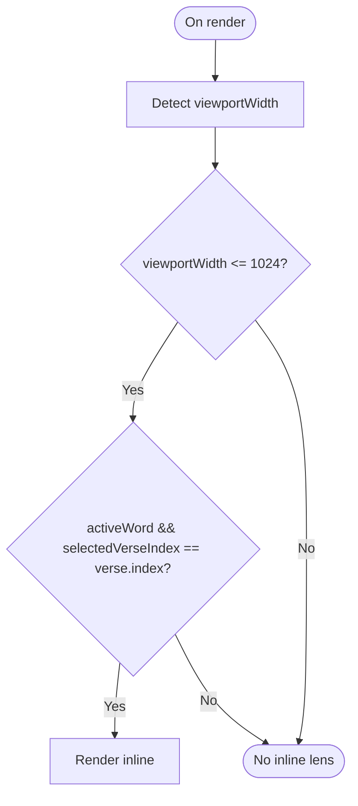
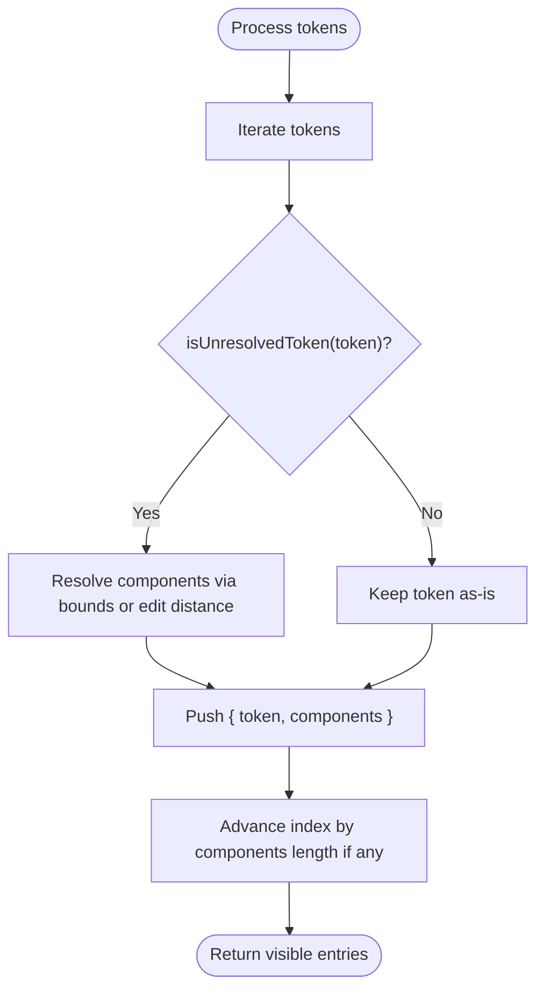
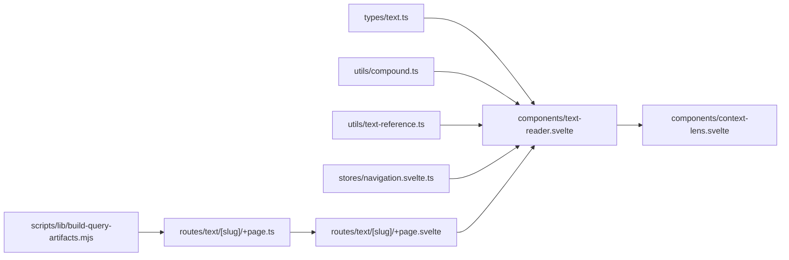

# Verse Navigation

<cite>
**Referenced Files in This Document**
- [text-reader.svelte](file://src/lib/components/text-reader.svelte)
- [text.ts](file://src/lib/types/text.ts)
- [compound.ts](file://src/lib/utils/compound.ts)
- [text-reference.ts](file://src/lib/utils/text-reference.ts)
- [navigation.svelte.ts](file://src/lib/stores/navigation.svelte.ts)
- [+page.svelte (text/[slug])](file://src/routes/text/[slug]/+page.svelte)
- [+page.ts (text/[slug])](file://src/routes/text/[slug]/+page.ts)
- [context-lens.svelte](file://src/lib/components/context-lens.svelte)
- [build-query-artifacts.mjs](file://scripts/lib/build-query-artifacts.mjs)
- [reading-texts.md](file://src/routes/docs/user/reading-texts.md)
</cite>

## Table of Contents
1. [Introduction](#introduction)
2. [Project Structure](#project-structure)
3. [Core Components](#core-components)
4. [Architecture Overview](#architecture-overview)
5. [Detailed Component Analysis](#detailed-component-analysis)
6. [Dependency Analysis](#dependency-analysis)
7. [Performance Considerations](#performance-considerations)
8. [Troubleshooting Guide](#troubleshooting-guide)
9. [Conclusion](#conclusion)

## Introduction
This document explains the verse navigation functionality within the text reader component. It covers how verses are rendered as individual blocks with reference labels, how verse indices are managed to track active content, and how pagination is handled via parent-provided verse slices. It also documents the verse data structure (reference metadata, token arrays, optional translation fields), provides examples of navigation patterns, keyboard accessibility for verse selection, responsive behavior where the context lens appears inline on mobile, and performance considerations for large verse collections and memory management strategies.

## Project Structure
The verse reading feature spans a few key files:
- The text page route loads paginated data and passes a slice of verses to the reader.
- The text reader renders each verse as a block, highlights tokens, and wires interactions to the navigation store and context lens.
- Utilities handle compound token visibility and reference formatting.
- The navigation store holds the active word and pane state.
- The context lens displays detailed lexical information for the selected word.

**Diagram sources**
- [+page.ts (text/[slug])](file://src/routes/text/[slug]/+page.ts#L1-L51)
- [+page.svelte (text/[slug])](file://src/routes/text/[slug]/+page.svelte#L1-L159)
- [text-reader.svelte:1-175](file://src/lib/components/text-reader.svelte#L1-L175)
- [context-lens.svelte:1-234](file://src/lib/components/context-lens.svelte#L1-L234)
- [navigation.svelte.ts:1-160](file://src/lib/stores/navigation.svelte.ts#L1-L160)
- [compound.ts:1-71](file://src/lib/utils/compound.ts#L1-L71)
- [text-reference.ts:1-12](file://src/lib/utils/text-reference.ts#L1-L12)

**Section sources**
- [+page.ts (text/[slug])](file://src/routes/text/[slug]/+page.ts#L1-L51)
- [+page.svelte (text/[slug])](file://src/routes/text/[slug]/+page.svelte#L1-L159)
- [text-reader.svelte:1-175](file://src/lib/components/text-reader.svelte#L1-L175)

## Core Components
- Text Reader: Renders a slice of verses provided by the parent. Each verse is a block with a reference label, Devanagari and/or IAST lines, optional translation, and interactive words. On mobile, it can render the context lens inline when a word is selected.
- Data Types: Defines Token and Verse structures used across the app.
- Compound Utilities: Computes visible tokens and resolves unresolved compounds into components.
- Reference Formatting: Normalizes display of references per text type.
- Navigation Store: Holds the active word and pane visibility; updated when a word is clicked.
- Context Lens: Displays full lexical details for the active word.

Key responsibilities:
- Parent routes manage pagination and pass only the current page’s verses to the reader.
- Reader manages local UI state such as selected verse index and mobile viewport detection.
- Interactions update the global navigation store and open the right pane or inline lens.

**Section sources**
- [text-reader.svelte:1-175](file://src/lib/components/text-reader.svelte#L1-L175)
- [text.ts:1-24](file://src/lib/types/text.ts#L1-L24)
- [compound.ts:1-71](file://src/lib/utils/compound.ts#L1-L71)
- [text-reference.ts:1-12](file://src/lib/utils/text-reference.ts#L1-L12)
- [navigation.svelte.ts:1-160](file://src/lib/stores/navigation.svelte.ts#L1-L160)
- [context-lens.svelte:1-234](file://src/lib/components/context-lens.svelte#L1-L234)

## Architecture Overview
The flow begins at the text route, which computes the requested page and limit, fetches source pages, slices them to the requested range, and returns a TextPageArtifact containing the verses for that page. The page component passes these verses to the TextReader. The reader renders each verse block, handles word clicks, updates the navigation store, and optionally shows the context lens inline on mobile.

**Diagram sources**
- [+page.ts (text/[slug])](file://src/routes/text/[slug]/+page.ts#L1-L51)
- [+page.svelte (text/[slug])](file://src/routes/text/[slug]/+page.svelte#L1-L159)
- [text-reader.svelte:1-175](file://src/lib/components/text-reader.svelte#L1-L175)
- [navigation.svelte.ts:1-160](file://src/lib/stores/navigation.svelte.ts#L1-L160)
- [context-lens.svelte:1-234](file://src/lib/components/context-lens.svelte#L1-L234)

## Detailed Component Analysis

### Verse Data Model
The verse model includes:
- index: numeric position used for stable rendering keys and tracking.
- reference: human-readable reference string.
- devanagari and iast: surface forms for display.
- translation: optional field for translated text.
- tokens: array of Token objects with lemma, form, upos, feats, and optional slug/id.

**Diagram sources**
- [text.ts:1-24](file://src/lib/types/text.ts#L1-L24)

**Section sources**
- [text.ts:1-24](file://src/lib/types/text.ts#L1-L24)

### Rendering Verses as Blocks with Reference Labels
- Each verse is rendered inside a container with attributes including data-verse and data-verse-index for identification.
- The reference label is formatted using a utility that adapts output based on the text slug.
- Two columns may be shown (Devanagari and IAST) depending on the script mode.
- Optional translation is displayed beneath the verse text.

**Diagram sources**
- [text-reader.svelte:126-174](file://src/lib/components/text-reader.svelte#L126-L174)
- [text-reference.ts:1-12](file://src/lib/utils/text-reference.ts#L1-L12)

**Section sources**
- [text-reader.svelte:126-174](file://src/lib/components/text-reader.svelte#L126-L174)
- [text-reference.ts:1-12](file://src/lib/utils/text-reference.ts#L1-L12)

### Managing Verse Indices and Active Content
- The reader tracks selectedVerseIndex to know which verse was last interacted with.
- When the page changes (detected via a pageKey derived from verse indices), the reader resets selection and clears the active word to avoid stale states.
- The navigation store maintains activeWord globally, enabling consistent highlighting and lens content across panes.

**Diagram sources**
- [text-reader.svelte:114-121](file://src/lib/components/text-reader.svelte#L114-L121)
- [navigation.svelte.ts:114-116](file://src/lib/stores/navigation.svelte.ts#L114-L116)

**Section sources**
- [text-reader.svelte:114-121](file://src/lib/components/text-reader.svelte#L114-L121)
- [navigation.svelte.ts:114-116](file://src/lib/stores/navigation.svelte.ts#L114-L116)

### Pagination Through Parent-Provided Verse Slices
- The text route calculates totalPages and selects a slice of verses based on page and limit.
- Source pages are fetched and flattened, then sliced to the requested range before being passed to the reader.
- The page component exposes prev/next links and a reference navigator allowing users to jump to specific passages or change pageSize.

**Diagram sources**
- [+page.ts (text/[slug])](file://src/routes/text/[slug]/+page.ts#L14-L41)

**Section sources**
- [+page.ts (text/[slug])](file://src/routes/text/[slug]/+page.ts#L14-L41)
- [+page.svelte (text/[slug])](file://src/routes/text/[slug]/+page.svelte#L126-L134)

### Word Interaction, Highlighting, and Keyboard Accessibility
- Clicking a word sets selectedVerseIndex and updates the navigation store with an ActiveWord derived from the token.
- Tokens are highlighted if they match the activeWord (including handling unresolved compounds).
- Each word has role="button", tabindex="0", and keyboard handlers for Enter/Space to trigger selection.

**Diagram sources**
- [text-reader.svelte:65-74](file://src/lib/components/text-reader.svelte#L65-L74)
- [text-reader.svelte:138-159](file://src/lib/components/text-reader.svelte#L138-L159)
- [navigation.svelte.ts:114-116](file://src/lib/stores/navigation.svelte.ts#L114-L116)

**Section sources**
- [text-reader.svelte:65-74](file://src/lib/components/text-reader.svelte#L65-L74)
- [text-reader.svelte:138-159](file://src/lib/components/text-reader.svelte#L138-L159)
- [reading-texts.md:34-39](file://src/routes/docs/user/reading-texts.md#L34-L39)

### Responsive Behavior: Inline Context Lens on Mobile
- The reader detects mobile viewport width and conditionally renders the ContextLens inline within the selected verse block.
- This ensures users on small screens can view lexical details without relying on the right pane.

**Diagram sources**
- [text-reader.svelte:26-28](file://src/lib/components/text-reader.svelte#L26-L28)
- [text-reader.svelte:167-169](file://src/lib/components/text-reader.svelte#L167-L169)

**Section sources**
- [text-reader.svelte:26-28](file://src/lib/components/text-reader.svelte#L26-L28)
- [text-reader.svelte:167-169](file://src/lib/components/text-reader.svelte#L167-L169)

### Compound Handling and Visible Tokens
- Unresolved tokens are identified and their components are inferred either via explicit markers or heuristic matching.
- The visibleTokens function produces entries pairing each token with its resolved components, skipping hidden parts of compounds.

**Diagram sources**
- [compound.ts:8-10](file://src/lib/utils/compound.ts#L8-L10)
- [compound.ts:38-59](file://src/lib/utils/compound.ts#L38-L59)
- [compound.ts:61-71](file://src/lib/utils/compound.ts#L61-L71)

**Section sources**
- [compound.ts:1-71](file://src/lib/utils/compound.ts#L1-L71)

### Reference Label Formatting
- References are normalized for display, with special handling for certain texts like Ṛgveda and Atharvaveda Paippalada.
- The formatter strips prefixes and standardizes separators.

**Section sources**
- [text-reference.ts:1-12](file://src/lib/utils/text-reference.ts#L1-L12)

## Dependency Analysis
The following diagram maps dependencies among core modules involved in verse navigation:

**Diagram sources**
- [text.ts:1-24](file://src/lib/types/text.ts#L1-L24)
- [compound.ts:1-71](file://src/lib/utils/compound.ts#L1-L71)
- [text-reference.ts:1-12](file://src/lib/utils/text-reference.ts#L1-L12)
- [navigation.svelte.ts:1-160](file://src/lib/stores/navigation.svelte.ts#L1-L160)
- [text-reader.svelte:1-175](file://src/lib/components/text-reader.svelte#L1-L175)
- [context-lens.svelte:1-234](file://src/lib/components/context-lens.svelte#L1-L234)
- [+page.ts (text/[slug])](file://src/routes/text/[slug]/+page.ts#L1-L51)
- [+page.svelte (text/[slug])](file://src/routes/text/[slug]/+page.svelte#L1-L159)
- [build-query-artifacts.mjs:64-122](file://scripts/lib/build-query-artifacts.mjs#L64-L122)

**Section sources**
- [text-reader.svelte:1-175](file://src/lib/components/text-reader.svelte#L1-L175)
- [+page.ts (text/[slug])](file://src/routes/text/[slug]/+page.ts#L1-L51)
- [build-query-artifacts.mjs:64-122](file://scripts/lib/build-query-artifacts.mjs#L64-L122)

## Performance Considerations
- Server-side pagination: The build pipeline splits verses into fixed-size pages, and the client fetches only the requested page. This avoids loading entire texts into memory.
- Client-side slicing: The route flattens multiple source pages and slices to the exact range needed, minimizing payload size.
- Efficient rendering: The reader uses stable keys (verse.index) and only renders the current slice, reducing DOM size.
- Memory management: When the page changes, the reader resets selection and clears the active word to prevent stale references.
- Large collections: For very large texts, keep pageSize reasonable (e.g., 20–100) to balance readability and performance. Avoid rendering all verses at once.

[No sources needed since this section provides general guidance]

## Troubleshooting Guide
- No verses on page: Ensure the route computed a valid page and limit, and that the source pages contain verses. Verify the slice calculation aligns with sourcePageSize.
- Stale active word after navigation: Confirm the pageKey effect resets selectedVerseIndex and clears nav.activeWord when the verse set changes.
- Incorrect reference labels: Check the formatter for the specific text slug and ensure reference strings match expected patterns.
- Keyboard not working: Verify words have role="button", tabindex="0", and correct keydown handlers for Enter/Space.
- Mobile lens not appearing: Ensure viewportWidth is detected and isMobile evaluates true; confirm selectedVerseIndex matches the current verse.

**Section sources**
- [+page.ts (text/[slug])](file://src/routes/text/[slug]/+page.ts#L14-L41)
- [text-reader.svelte:114-121](file://src/lib/components/text-reader.svelte#L114-L121)
- [text-reference.ts:1-12](file://src/lib/utils/text-reference.ts#L1-L12)
- [text-reader.svelte:138-159](file://src/lib/components/text-reader.svelte#L138-L159)

## Conclusion
The verse navigation system combines server-side pagination with a focused client-side reader to deliver efficient, accessible, and responsive text exploration. Verses are rendered as discrete blocks with clear reference labels, interactive tokens, and optional translations. The navigation store centralizes active content state, while utilities handle compound resolution and reference formatting. On mobile, the context lens integrates inline for seamless interaction. By limiting payloads to the current page and resetting state on navigation changes, the system remains performant even with large verse collections.