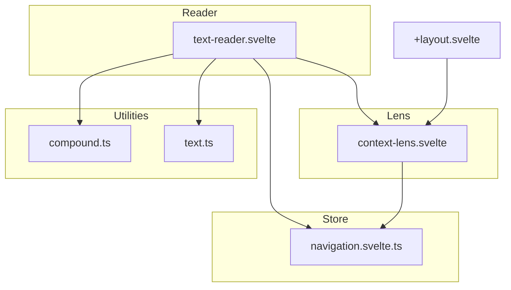
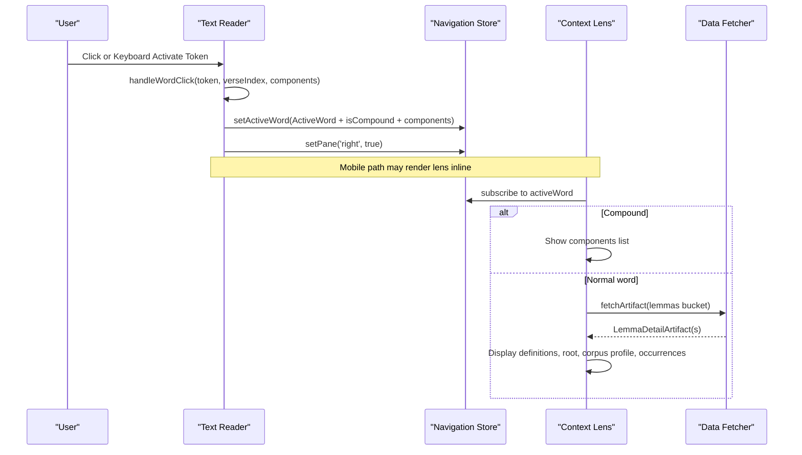
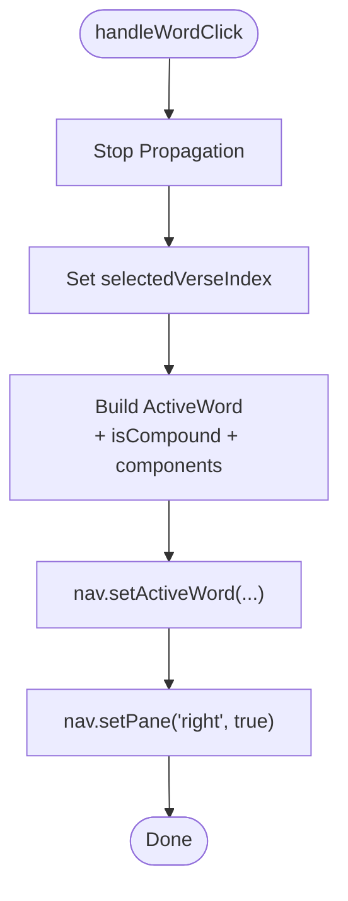
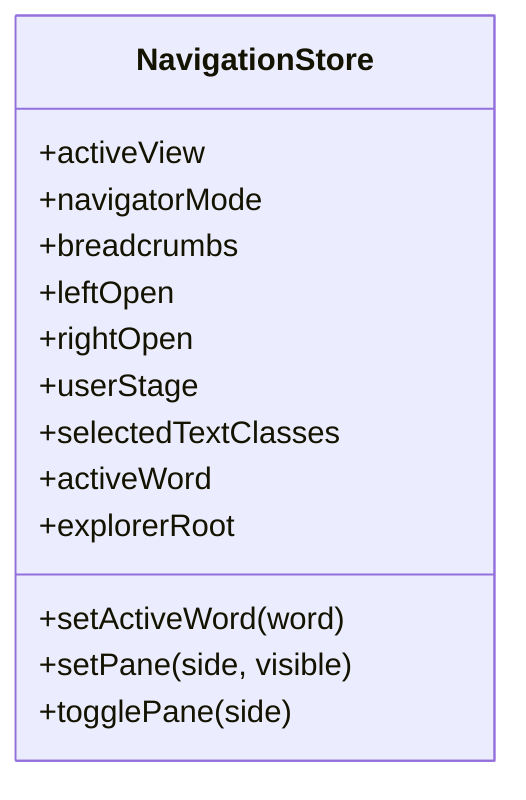
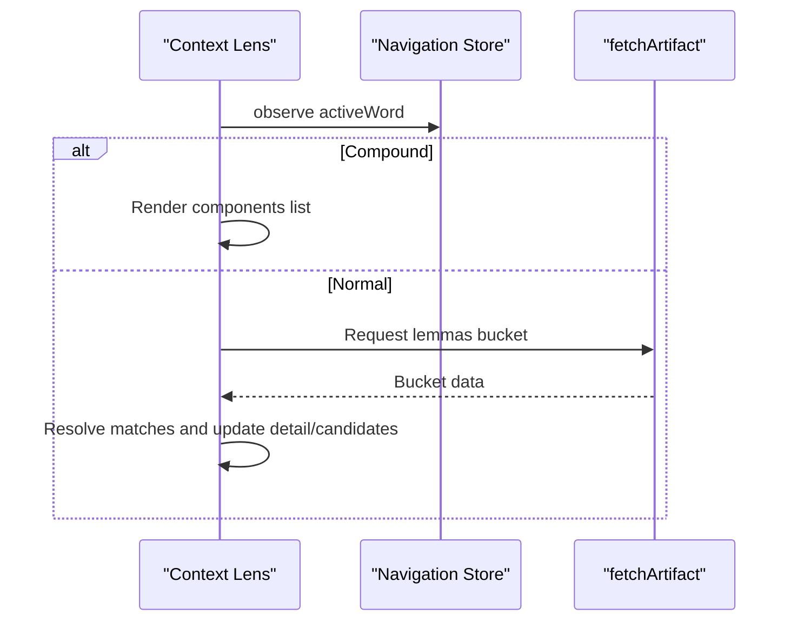
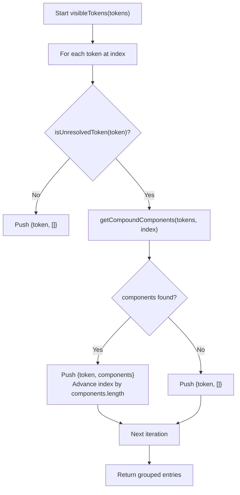
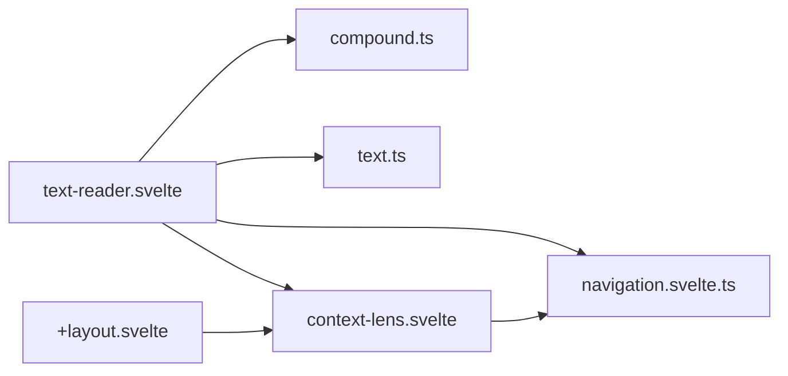

# Word Interaction System

<cite>
**Referenced Files in This Document**
- [text-reader.svelte](file://src/lib/components/text-reader.svelte)
- [navigation.svelte.ts](file://src/lib/stores/navigation.svelte.ts)
- [context-lens.svelte](file://src/lib/components/context-lens.svelte)
- [compound.ts](file://src/lib/utils/compound.ts)
- [text.ts](file://src/lib/types/text.ts)
- [+layout.svelte](file://src/routes/+layout.svelte)
- [reader-and-lens.md](file://src/routes/docs/developer/reader-and-lens.md)
- [reading-texts.md](file://src/routes/docs/user/reading-texts.md)
</cite>

## Table of Contents
1. [Introduction](#introduction)
2. [Project Structure](#project-structure)
3. [Core Components](#core-components)
4. [Architecture Overview](#architecture-overview)
5. [Detailed Component Analysis](#detailed-component-analysis)
6. [Dependency Analysis](#dependency-analysis)
7. [Performance Considerations](#performance-considerations)
8. [Troubleshooting Guide](#troubleshooting-guide)
9. [Conclusion](#conclusion)
10. [Appendices](#appendices)

## Introduction
This document explains the word interaction system used by the text reader. It covers how clicking or keyboard-activating a word triggers selection, updates the active word state in the navigation store, and manages compound words using unresolved token detection. It also documents grammatical analysis integration (part-of-speech labeling and feature extraction), the highlighting system, tooltip generation for quick insights, keyboard accessibility, custom event handling patterns, integration with the context lens component, and mobile-specific behaviors for touch interactions.

## Project Structure
The word interaction spans three primary layers:
- Reader UI: renders verses and tokens, wires click/keyboard events to selection logic, and computes highlights and tooltips.
- Navigation Store: holds the active word state and pane visibility; updated when a word is selected.
- Context Lens: displays detailed information about the active word, including dictionary entries, root info, corpus profile, and occurrences; handles compound components.

**Diagram sources**
- [text-reader.svelte:1-175](file://src/lib/components/text-reader.svelte#L1-L175)
- [navigation.svelte.ts:1-160](file://src/lib/stores/navigation.svelte.ts#L1-L160)
- [context-lens.svelte:1-234](file://src/lib/components/context-lens.svelte#L1-L234)
- [compound.ts:1-70](file://src/lib/utils/compound.ts#L1-L70)
- [text.ts:1-25](file://src/lib/types/text.ts#L1-L25)
- [+layout.svelte:1-303](file://src/routes/+layout.svelte#L1-L303)

**Section sources**
- [text-reader.svelte:1-175](file://src/lib/components/text-reader.svelte#L1-L175)
- [navigation.svelte.ts:1-160](file://src/lib/stores/navigation.svelte.ts#L1-L160)
- [context-lens.svelte:1-234](file://src/lib/components/context-lens.svelte#L1-L234)
- [compound.ts:1-70](file://src/lib/utils/compound.ts#L1-L70)
- [text.ts:1-25](file://src/lib/types/text.ts#L1-L25)
- [+layout.svelte:1-303](file://src/routes/+layout.svelte#L1-L303)

## Core Components
- Text Reader: Renders verses and tokens, binds click and keyboard events, computes highlight status, builds tooltips, and conditionally shows the lens on mobile.
- Navigation Store: Provides reactive state for the active word and pane visibility; exposes setters used by the reader and lens.
- Context Lens: Displays lemma details, root information, corpus profile, and occurrences; supports compound component selection and clears stale content during async fetches.
- Compound Utilities: Detect unresolved tokens and resolve compound components from surrounding tokens.
- Types: Define Token and Verse structures consumed across components.

Key responsibilities:
- handleWordClick: Updates active word and opens the right pane.
- isHighlighted: Determines which tokens should be visually highlighted based on active word and compound mode.
- tooltipRows: Builds tooltip rows from part-of-speech and features or compound components.
- isUnresolvedToken: Flags tokens that require compound resolution.
- visibleTokens: Groups tokens into visible entries with their resolved components.

**Section sources**
- [text-reader.svelte:65-122](file://src/lib/components/text-reader.svelte#L65-L122)
- [navigation.svelte.ts:24-35](file://src/lib/stores/navigation.svelte.ts#L24-L35)
- [context-lens.svelte:46-71](file://src/lib/components/context-lens.svelte#L46-L71)
- [compound.ts:8-70](file://src/lib/utils/compound.ts#L8-L70)
- [text.ts:6-24](file://src/lib/types/text.ts#L6-L24)

## Architecture Overview
The interaction flow begins in the reader when a user clicks or activates a token. The reader converts the token into an ActiveWord, marks whether it is a compound via unresolved token detection, and persists it in the navigation store. The context lens reacts to the active word, showing either compound components or fetching lexical data. On mobile, the lens can appear inline beneath the selected verse.

**Diagram sources**
- [text-reader.svelte:65-74](file://src/lib/components/text-reader.svelte#L65-L74)
- [navigation.svelte.ts:114-116](file://src/lib/stores/navigation.svelte.ts#L114-L116)
- [context-lens.svelte:46-71](file://src/lib/components/context-lens.svelte#L46-L71)

## Detailed Component Analysis

### Text Reader: Word Clicks, Highlighting, Tooltips, Accessibility, and Mobile Behavior
- Word click handler:
  - Stops propagation to avoid unintended parent actions.
  - Records the selected verse index for mobile lens placement.
  - Converts the token to an ActiveWord, sets isCompound via unresolved token detection, and includes mapped components.
  - Opens the right pane to show the context lens.
- Highlighting:
  - For compounds, highlights tokens matching the surface form and unresolved status.
  - For normal words, highlights all tokens sharing the same lemma_id.
- Tooltips:
  - If part-of-speech is available, shows POS label and parsed features.
  - For compounds, lists each component with its POS and features.
  - Falls back to a message when no grammatical data is present.
- Accessibility:
  - Each word span has role="button" and tabindex="0".
  - Keyboard activation uses Enter or Space to trigger the same handler as click.
- Mobile behavior:
  - When viewport width indicates mobile and the active word belongs to the current verse, the context lens is rendered inline below the verse.

**Diagram sources**
- [text-reader.svelte:65-74](file://src/lib/components/text-reader.svelte#L65-L74)

**Section sources**
- [text-reader.svelte:65-122](file://src/lib/components/text-reader.svelte#L65-L122)
- [text-reader.svelte:137-174](file://src/lib/components/text-reader.svelte#L137-L174)

### Navigation Store: Active Word State and Pane Control
- ActiveWord type includes lemma, form, slug, id, lemma_id, upos, feats, optional rootContext, isCompound flag, and components array.
- setActiveWord updates the reactive state consumed by both the reader and lens.
- setPane toggles visibility of left/right panes; the reader explicitly opens the right pane upon selection.

**Diagram sources**
- [navigation.svelte.ts:24-35](file://src/lib/stores/navigation.svelte.ts#L24-L35)
- [navigation.svelte.ts:114-116](file://src/lib/stores/navigation.svelte.ts#L114-L116)
- [navigation.svelte.ts:89-92](file://src/lib/stores/navigation.svelte.ts#L89-L92)

**Section sources**
- [navigation.svelte.ts:24-35](file://src/lib/stores/navigation.svelte.ts#L24-L35)
- [navigation.svelte.ts:114-116](file://src/lib/stores/navigation.svelte.ts#L114-L116)
- [navigation.svelte.ts:89-92](file://src/lib/stores/navigation.svelte.ts#L89-L92)

### Context Lens: Compound Handling, Lexical Data, and Stale Response Guard
- Reactive effect subscribes to activeWord and:
  - Clears previous detail and candidates when switching words or encountering compounds.
  - Fetches the appropriate lemmas bucket and resolves matches by normalized lemma or headword.
  - Ignores late responses if the active word changed during the fetch.
- Compound display:
  - Shows the surface form and a list of components; selecting a component replaces the active word.
- Normal word display:
  - Shows headword, form, POS label, features, English definitions, root info, occurrences, corpus profile, semantic classification, distribution, and sample concordance lines.

**Diagram sources**
- [context-lens.svelte:46-71](file://src/lib/components/context-lens.svelte#L46-L71)
- [context-lens.svelte:98-104](file://src/lib/components/context-lens.svelte#L98-L104)

**Section sources**
- [context-lens.svelte:46-71](file://src/lib/components/context-lens.svelte#L46-L71)
- [context-lens.svelte:117-130](file://src/lib/components/context-lens.svelte#L117-L130)
- [context-lens.svelte:132-228](file://src/lib/components/context-lens.svelte#L132-L228)

### Compound Detection and Visible Tokens
- Unresolved token detection flags tokens where lemma, lemma_id, or upos indicate missing analysis.
- getCompoundComponents attempts to resolve a compound by:
  - Using explicit compoundEnd markers when available.
  - Otherwise scanning subsequent tokens and comparing normalized forms with edit distance tolerance.
- visibleTokens groups tokens into entries, skipping resolved components to avoid duplication.

**Diagram sources**
- [compound.ts:8-10](file://src/lib/utils/compound.ts#L8-L10)
- [compound.ts:38-59](file://src/lib/utils/compound.ts#L38-L59)
- [compound.ts:61-70](file://src/lib/utils/compound.ts#L61-L70)

**Section sources**
- [compound.ts:8-10](file://src/lib/utils/compound.ts#L8-L10)
- [compound.ts:38-59](file://src/lib/utils/compound.ts#L38-L59)
- [compound.ts:61-70](file://src/lib/utils/compound.ts#L61-L70)

### Grammatical Analysis Integration: POS Labeling and Feature Extraction
- Part-of-speech labels are mapped from Universal POS codes to human-readable strings for tooltips and lens display.
- Features are parsed from a pipe-separated string into key-value pairs and mapped to readable labels/values.
- Tooltip rows combine POS and features for quick insight; for compounds, each component’s POS and features are shown.

**Section sources**
- [text-reader.svelte:30-49](file://src/lib/components/text-reader.svelte#L30-L49)
- [text-reader.svelte:88-112](file://src/lib/components/text-reader.svelte#L88-L112)
- [context-lens.svelte:79-96](file://src/lib/components/context-lens.svelte#L79-L96)

### Highlighting System
- Highlights depend on whether the active word is a compound:
  - Compounds: match unresolved tokens with identical surface form.
  - Normal words: match any token sharing the same lemma_id.
- CSS class binding applies visual emphasis to selected tokens.

**Section sources**
- [text-reader.svelte:76-81](file://src/lib/components/text-reader.svelte#L76-L81)
- [text-reader.svelte:140-159](file://src/lib/components/text-reader.svelte#L140-L159)

### Keyboard Accessibility
- Words are focusable and activatable via Enter or Space.
- Event handlers prevent default behavior and invoke the same selection logic as mouse clicks.

**Section sources**
- [text-reader.svelte:142-159](file://src/lib/components/text-reader.svelte#L142-L159)

### Custom Event Handlers and Integration Patterns
- The reader passes token metadata and components directly into handleWordClick, enabling consistent processing regardless of input source.
- The layout coordinates lens scope per route and clears active selections when scopes change, ensuring clean transitions between contexts.

**Section sources**
- [text-reader.svelte:65-74](file://src/lib/components/text-reader.svelte#L65-L74)
- [+layout.svelte:64-78](file://src/routes/+layout.svelte#L64-L78)

### Mobile-Specific Behaviors
- On mobile, the context lens appears inline under the selected verse when the active word belongs to that verse.
- The layout switches to a single-column mobile layout without persistent side panels.

**Section sources**
- [text-reader.svelte:167-169](file://src/lib/components/text-reader.svelte#L167-L169)
- [+layout.svelte:247-251](file://src/routes/+layout.svelte#L247-L251)

## Dependency Analysis
The following diagram maps runtime dependencies among core modules involved in word interaction.

**Diagram sources**
- [text-reader.svelte:1-175](file://src/lib/components/text-reader.svelte#L1-L175)
- [navigation.svelte.ts:1-160](file://src/lib/stores/navigation.svelte.ts#L1-L160)
- [context-lens.svelte:1-234](file://src/lib/components/context-lens.svelte#L1-L234)
- [compound.ts:1-70](file://src/lib/utils/compound.ts#L1-L70)
- [text.ts:1-25](file://src/lib/types/text.ts#L1-L25)
- [+layout.svelte:1-303](file://src/routes/+layout.svelte#L1-L303)

**Section sources**
- [text-reader.svelte:1-175](file://src/lib/components/text-reader.svelte#L1-L175)
- [navigation.svelte.ts:1-160](file://src/lib/stores/navigation.svelte.ts#L1-L160)
- [context-lens.svelte:1-234](file://src/lib/components/context-lens.svelte#L1-L234)
- [compound.ts:1-70](file://src/lib/utils/compound.ts#L1-L70)
- [text.ts:1-25](file://src/lib/types/text.ts#L1-L25)
- [+layout.svelte:1-303](file://src/routes/+layout.svelte#L1-L303)

## Performance Considerations
- Avoid unnecessary re-renders by keeping token-level computations minimal; rely on derived state for highlighting and tooltips.
- Debounce or throttle expensive operations like edit-distance-based compound resolution if token counts grow significantly.
- Ensure the lens ignores stale responses to prevent redundant work and UI flicker when users rapidly switch words.
- Use visibleTokens grouping to reduce DOM nodes and improve rendering performance for long verses.

[No sources needed since this section provides general guidance]

## Troubleshooting Guide
- No grammatical data in tooltips:
  - Verify that token.upos and token.feats are populated; otherwise fallback messages will appear.
- Compounds not resolving:
  - Check isUnresolvedToken conditions and ensure compoundEnd markers or neighboring tokens provide sufficient signal.
- Lens not updating:
  - Confirm that setActiveWord is called and that the lens effect observes the active word; ensure late-response guards do not discard valid updates.
- Highlighting not applied:
  - Validate that lemma_id is consistent for normal words and that surface forms match for compounds.
- Mobile lens not appearing:
  - Ensure viewport width falls within mobile thresholds and that selectedVerseIndex matches the current verse.

**Section sources**
- [text-reader.svelte:88-112](file://src/lib/components/text-reader.svelte#L88-L112)
- [compound.ts:8-10](file://src/lib/utils/compound.ts#L8-L10)
- [context-lens.svelte:46-71](file://src/lib/components/context-lens.svelte#L46-L71)
- [text-reader.svelte:76-81](file://src/lib/components/text-reader.svelte#L76-L81)
- [text-reader.svelte:167-169](file://src/lib/components/text-reader.svelte#L167-L169)

## Conclusion
The word interaction system integrates a responsive reader, a centralized navigation store, and a rich context lens to deliver a seamless experience for exploring textual content. It robustly handles compound words, provides immediate grammatical insights through tooltips, ensures accessibility via keyboard support, and adapts gracefully to mobile layouts. The design emphasizes clear separation of concerns, efficient state management, and resilient asynchronous data handling.

[No sources needed since this section summarizes without analyzing specific files]

## Appendices

### User Workflow Reference
- Selecting words: Click or use keyboard to activate a word; the lens opens and highlights persist until another selection is made.
- Compound handling: The lens first presents components; selecting one navigates to that component’s entry.

**Section sources**
- [reading-texts.md:34-39](file://src/routes/docs/user/reading-texts.md#L34-L39)

### Developer Notes on Active Word and Compound Flow
- The reader maps tokens to ActiveWord objects and delegates compound vs. normal flows to the lens.
- The lens must clear stale content during bucket changes and ignore late responses.

**Section sources**
- [reader-and-lens.md:32-44](file://src/routes/docs/developer/reader-and-lens.md#L32-L44)