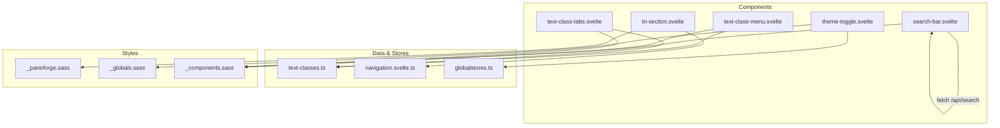
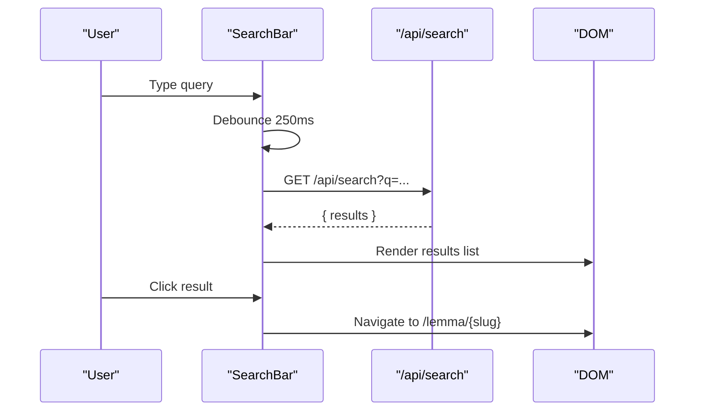
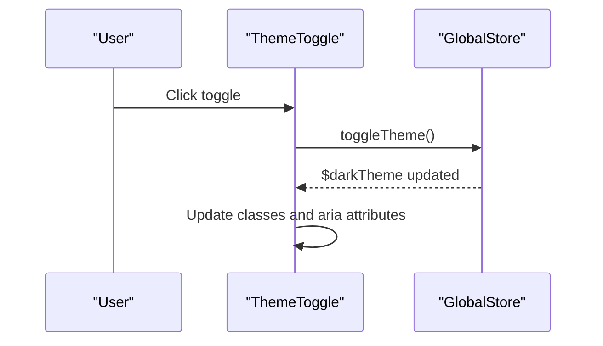
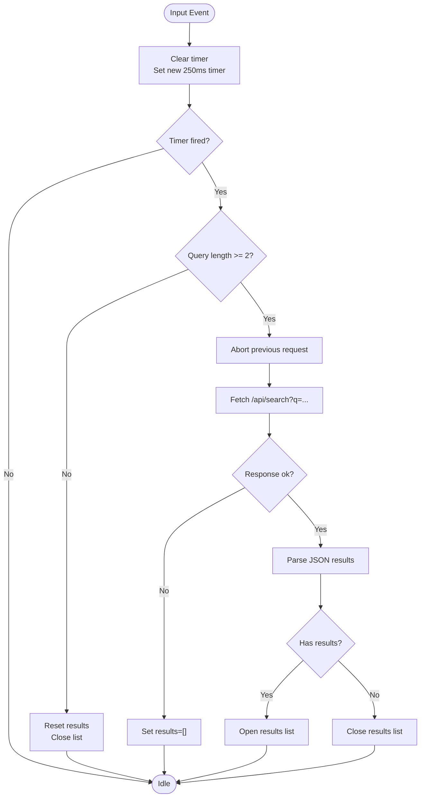
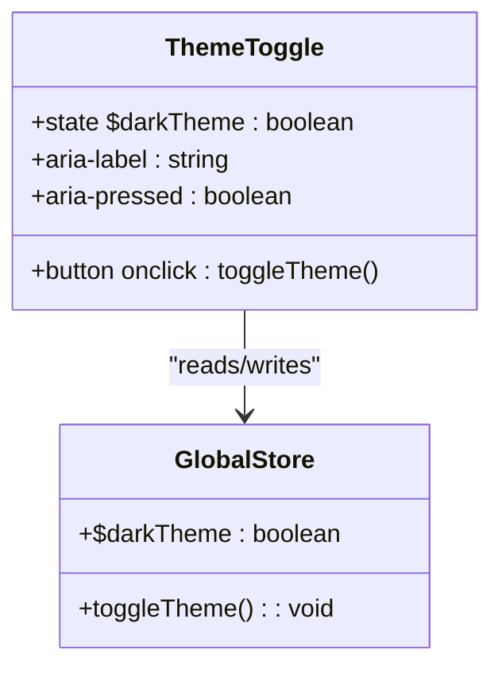
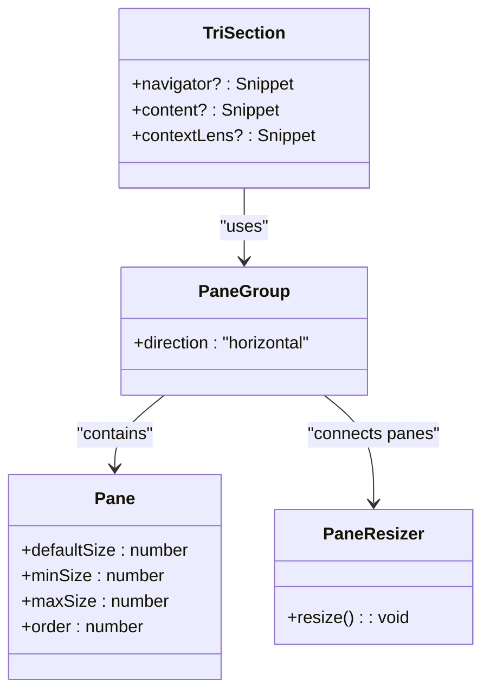
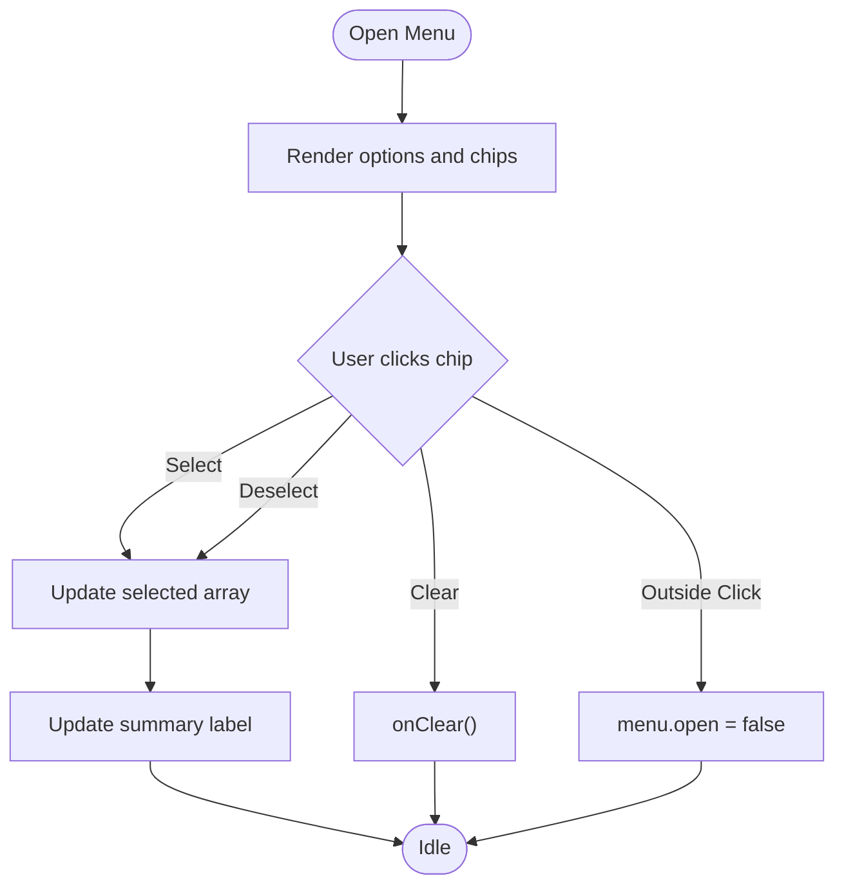
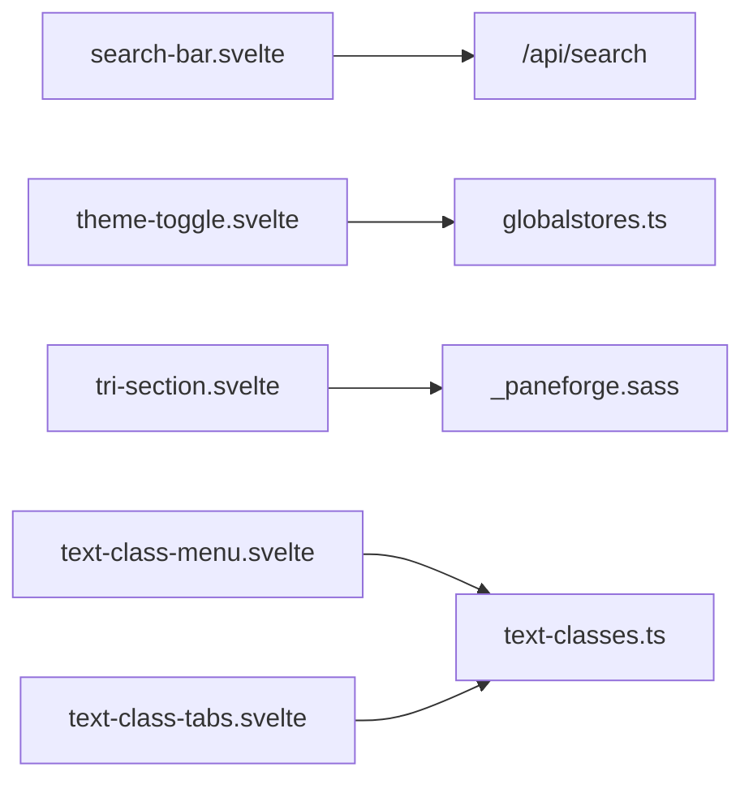

# Utility Components

<cite>
**Referenced Files in This Document**
- [search-bar.svelte](file://src/lib/components/search-bar.svelte)
- [theme-toggle.svelte](file://src/lib/components/theme-toggle.svelte)
- [tri-section.svelte](file://src/lib/components/tri-section.svelte)
- [text-class-menu.svelte](file://src/lib/components/text-class-menu.svelte)
- [text-class-tabs.svelte](file://src/lib/components/text-class-tabs.svelte)
- [text-classes.ts](file://src/lib/data/text-classes.ts)
- [navigation.svelte.ts](file://src/lib/stores/navigation.svelte.ts)
- [globalstores.ts](file://src/lib/stores/globalstores.ts)
- [_paneforge.sass](file://src/lib/styles/_paneforge.sass)
- [_globals.sass](file://src/lib/styles/_globals.sass)
- [_components.sass](file://src/lib/styles/_components.sass)
</cite>

## Table of Contents
1. [Introduction](#introduction)
2. [Project Structure](#project-structure)
3. [Core Components](#core-components)
4. [Architecture Overview](#architecture-overview)
5. [Detailed Component Analysis](#detailed-component-analysis)
6. [Dependency Analysis](#dependency-analysis)
7. [Performance Considerations](#performance-considerations)
8. [Troubleshooting Guide](#troubleshooting-guide)
9. [Conclusion](#conclusion)

## Introduction
This document provides comprehensive documentation for key utility components used across the application: a search bar with debounced, server-driven fuzzy matching; a theme toggle for light/dark mode switching; a tri-section layout component for resizable panes; and text class navigation elements (menu and tabs). It explains props, state management, event handling, accessibility features, keyboard navigation, responsive behavior, and integration points with stores and CSS variables.

## Project Structure
The utility components live under src/lib/components and rely on shared data definitions, stores, and styles:
- Search bar component uses an API endpoint for results and manages local input state and loading.
- Theme toggle reads/writes global theme state via a store and applies CSS classes to reflect current theme.
- Tri-section layout composes three resizable panes using a pane library and Svelte snippets for flexible composition.
- Text class menu and tabs provide multi-select filtering UIs backed by a centralized text class dataset.



**Diagram sources**
- [search-bar.svelte:1-88](file://src/lib/components/search-bar.svelte#L1-L88)
- [theme-toggle.svelte:1-66](file://src/lib/components/theme-toggle.svelte#L1-L66)
- [tri-section.svelte:1-43](file://src/lib/components/tri-section.svelte#L1-L43)
- [text-class-menu.svelte:1-117](file://src/lib/components/text-class-menu.svelte#L1-L117)
- [text-class-tabs.svelte:1-46](file://src/lib/components/text-class-tabs.svelte#L1-L46)
- [text-classes.ts:1-93](file://src/lib/data/text-classes.ts#L1-L93)
- [navigation.svelte.ts](file://src/lib/stores/navigation.svelte.ts)
- [globalstores.ts](file://src/lib/stores/globalstores.ts)
- [_paneforge.sass](file://src/lib/styles/_paneforge.sass)
- [_globals.sass](file://src/lib/styles/_globals.sass)
- [_components.sass](file://src/lib/styles/_components.sass)

**Section sources**
- [search-bar.svelte:1-88](file://src/lib/components/search-bar.svelte#L1-L88)
- [theme-toggle.svelte:1-66](file://src/lib/components/theme-toggle.svelte#L1-L66)
- [tri-section.svelte:1-43](file://src/lib/components/tri-section.svelte#L1-L43)
- [text-class-menu.svelte:1-117](file://src/lib/components/text-class-menu.svelte#L1-L117)
- [text-class-tabs.svelte:1-46](file://src/lib/components/text-class-tabs.svelte#L1-L46)
- [text-classes.ts:1-93](file://src/lib/data/text-classes.ts#L1-L93)
- [navigation.svelte.ts](file://src/lib/stores/navigation.svelte.ts)
- [globalstores.ts](file://src/lib/stores/globalstores.ts)
- [_paneforge.sass](file://src/lib/styles/_paneforge.sass)
- [_globals.sass](file://src/lib/styles/_globals.sass)
- [_components.sass](file://src/lib/styles/_components.sass)

## Core Components
- Search Bar: Debounced input, AbortController-based cancellation, server-side fuzzy search, accessible result list.
- Theme Toggle: Reads/writes global dark/light theme via store, toggles button state and aria attributes.
- Tri-Section Layout: Three-pane horizontal layout with resizers, configurable min/max/default sizes, snippet slots.
- Text Class Menu: Details/summary dropdown with chips for multi-select filtering and clear action.
- Text Class Tabs: Horizontal tab-like buttons for curated and individual text class filters.

**Section sources**
- [search-bar.svelte:1-88](file://src/lib/components/search-bar.svelte#L1-L88)
- [theme-toggle.svelte:1-66](file://src/lib/components/theme-toggle.svelte#L1-L66)
- [tri-section.svelte:1-43](file://src/lib/components/tri-section.svelte#L1-L43)
- [text-class-menu.svelte:1-117](file://src/lib/components/text-class-menu.svelte#L1-L117)
- [text-class-tabs.svelte:1-46](file://src/lib/components/text-class-tabs.svelte#L1-L46)

## Architecture Overview
The components integrate with stores and APIs to deliver interactive experiences:
- Search flow: Input triggers debounced fetch to /api/search; results are displayed in an accessible list; selection navigates to lemma pages.
- Theme flow: Button click calls toggleTheme from global store; component reflects current theme via class binding and aria attributes.
- Layout flow: PaneGroup organizes three sections; each section renders provided snippets; resizers adjust widths within constraints.
- Filtering flow: Menu/tabs update selected text classes; consumers react to changes to filter content accordingly.



**Diagram sources**
- [search-bar.svelte:1-88](file://src/lib/components/search-bar.svelte#L1-L88)



**Diagram sources**
- [theme-toggle.svelte:1-66](file://src/lib/components/theme-toggle.svelte#L1-L66)
- [globalstores.ts](file://src/lib/stores/globalstores.ts)

**Section sources**
- [search-bar.svelte:1-88](file://src/lib/components/search-bar.svelte#L1-L88)
- [theme-toggle.svelte:1-66](file://src/lib/components/theme-toggle.svelte#L1-L66)
- [globalstores.ts](file://src/lib/stores/globalstores.ts)

## Detailed Component Analysis

### Search Bar
Responsibilities:
- Manage local input state, loading, and open/close of results.
- Debounce user input to reduce network requests.
- Cancel in-flight requests when new queries arrive.
- Render accessible results list with keyboard-friendly links.

Props and State:
- Internal state: query, results, open, loading, debounceTimer, requestController.
- No external props; behavior is controlled internally.

Key Behaviors:
- Debounced search with 250ms delay.
- AbortController cancels previous requests.
- Minimum query length check before searching.
- Results list uses role="listbox" and role="option" for accessibility.

Accessibility:
- Semantic input element with placeholder.
- Listbox/listitem roles for results.
- ARIA-selected on options.

Keyboard Navigation:
- Standard browser behaviors for input and links.
- Focus management relies on native focus; blur delays allow clicks to register.

Error Handling:
- Catches non-ok responses and sets empty results.
- Ignores AbortError to avoid error states on rapid typing.

Integration Points:
- Fetches from /api/search with query parameter.
- Navigates to /lemma/{slug} upon selection.



**Diagram sources**
- [search-bar.svelte:1-88](file://src/lib/components/search-bar.svelte#L1-L88)

**Section sources**
- [search-bar.svelte:1-88](file://src/lib/components/search-bar.svelte#L1-L88)

### Theme Toggle
Responsibilities:
- Provide a button to switch between light and dark themes.
- Reflect current theme state visually and semantically.

Props and State:
- Uses global store for theme state ($darkTheme) and toggle function (toggleTheme).
- Binds class based on $darkTheme for styling.

Key Behaviors:
- On click, calls toggleTheme from global store.
- Updates aria-label and aria-pressed to reflect current state.
- Visual indicator moves based on theme via CSS transforms.

Accessibility:
- Button with descriptive aria-label and aria-pressed.
- Focus-visible outline for keyboard users.
- Icons are decorative with aria-hidden.

CSS Integration:
- Uses CSS variables for sizing, colors, borders, and transitions.
- Dark mode class drives indicator position and icon visibility.



**Diagram sources**
- [theme-toggle.svelte:1-66](file://src/lib/components/theme-toggle.svelte#L1-L66)
- [globalstores.ts](file://src/lib/stores/globalstores.ts)

**Section sources**
- [theme-toggle.svelte:1-66](file://src/lib/components/theme-toggle.svelte#L1-L66)
- [globalstores.ts](file://src/lib/stores/globalstores.ts)

### Tri-Section Layout
Responsibilities:
- Organize content into three resizable horizontal panes: navigator, content, context lens.
- Provide default, min, and max sizes for each pane.
- Render child content via Svelte snippets.

Props and State:
- Props: navigator, content, contextLens (all optional Snippets).
- Uses PaneGroup and Pane from paneforge for layout and resizing.

Key Behaviors:
- PaneGroup direction set to horizontal.
- Each Pane has defaultSize, minSize, maxSize constraints.
- Resizers allow user-driven width adjustments.

Responsive Behavior:
- Relies on paneforge’s internal responsive logic and CSS variables.
- Consumers can adapt content inside each pane for different screen sizes.

Accessibility:
- Semantic main and aside elements for content and context.
- Keyboard interaction handled by paneforge resizers.



**Diagram sources**
- [tri-section.svelte:1-43](file://src/lib/components/tri-section.svelte#L1-L43)
- [_paneforge.sass](file://src/lib/styles/_paneforge.sass)

**Section sources**
- [tri-section.svelte:1-43](file://src/lib/components/tri-section.svelte#L1-L43)
- [navigation.svelte.ts](file://src/lib/stores/navigation.svelte.ts)
- [_paneforge.sass](file://src/lib/styles/_paneforge.sass)

### Text Class Menu
Responsibilities:
- Provide a dropdown details/summary menu for selecting multiple text classes.
- Display selected labels in summary and chips for toggling selections.
- Offer a clear action to reset selection.

Props and State:
- Props: selected (readonly array), onToggle(classId), onClear().
- Internal state: menu reference for outside-click handling.

Key Behaviors:
- Outside click closes the menu.
- Chips toggle selection and show remove indicator when selected.
- Summary updates dynamically with selected labels.

Accessibility:
- details/summary semantics for disclosure.
- Buttons use aria-pressed and descriptive aria-labels.
- Scrollable options container with custom scrollbar styling.

Internationalization:
- Labels come from TEXT_CLASSES dataset; consumers can extend or localize if needed.



**Diagram sources**
- [text-class-menu.svelte:1-117](file://src/lib/components/text-class-menu.svelte#L1-L117)
- [text-classes.ts:1-93](file://src/lib/data/text-classes.ts#L1-L93)

**Section sources**
- [text-class-menu.svelte:1-117](file://src/lib/components/text-class-menu.svelte#L1-L117)
- [text-classes.ts:1-93](file://src/lib/data/text-classes.ts#L1-L93)

### Text Class Tabs
Responsibilities:
- Provide a horizontal row of buttons for curated and individual text class filters.
- Support multi-select with visual selected state and clear action.

Props and State:
- Props: selected (readonly array), onToggle(classId), onClear(), curatedSelected (boolean), onToggleCurated().

Key Behaviors:
- Curated button toggles curated selection.
- Individual class buttons toggle selection.
- Clear button resets all selections.

Accessibility:
- Buttons use aria-pressed to indicate selection state.
- Group labeled with aria-label for screen readers.

```mermaid
classDiagram
class TextClassTabs {
+selected : readonly TextClassId[]
+curatedSelected : boolean
+onToggle(classId) : void
+onClear() : void
+onToggleCurated() : void
}
class TextClasses {
+TEXT_CLASSES : Array<{id, label}>
}
TextClassTabs --> TextClasses : "uses"
```

**Diagram sources**
- [text-class-tabs.svelte:1-46](file://src/lib/components/text-class-tabs.svelte#L1-L46)
- [text-classes.ts:1-93](file://src/lib/data/text-classes.ts#L1-L93)

**Section sources**
- [text-class-tabs.svelte:1-46](file://src/lib/components/text-class-tabs.svelte#L1-L46)
- [text-classes.ts:1-93](file://src/lib/data/text-classes.ts#L1-L93)

## Dependency Analysis
Component relationships and dependencies:
- Search Bar depends on API endpoint and local state; no external stores.
- Theme Toggle depends on global store for theme state.
- Tri-Section depends on paneforge for layout and navigation store for potential integration.
- Text Class Menu/Tabs depend on text-classes dataset for labels and IDs.



**Diagram sources**
- [search-bar.svelte:1-88](file://src/lib/components/search-bar.svelte#L1-L88)
- [theme-toggle.svelte:1-66](file://src/lib/components/theme-toggle.svelte#L1-L66)
- [tri-section.svelte:1-43](file://src/lib/components/tri-section.svelte#L1-L43)
- [text-class-menu.svelte:1-117](file://src/lib/components/text-class-menu.svelte#L1-L117)
- [text-class-tabs.svelte:1-46](file://src/lib/components/text-class-tabs.svelte#L1-L46)
- [text-classes.ts:1-93](file://src/lib/data/text-classes.ts#L1-L93)
- [_paneforge.sass](file://src/lib/styles/_paneforge.sass)
- [globalstores.ts](file://src/lib/stores/globalstores.ts)

**Section sources**
- [search-bar.svelte:1-88](file://src/lib/components/search-bar.svelte#L1-L88)
- [theme-toggle.svelte:1-66](file://src/lib/components/theme-toggle.svelte#L1-L66)
- [tri-section.svelte:1-43](file://src/lib/components/tri-section.svelte#L1-L43)
- [text-class-menu.svelte:1-117](file://src/lib/components/text-class-menu.svelte#L1-L117)
- [text-class-tabs.svelte:1-46](file://src/lib/components/text-class-tabs.svelte#L1-L46)
- [text-classes.ts:1-93](file://src/lib/data/text-classes.ts#L1-L93)
- [_paneforge.sass](file://src/lib/styles/_paneforge.sass)
- [globalstores.ts](file://src/lib/stores/globalstores.ts)

## Performance Considerations
- Debounced search reduces unnecessary network requests during rapid typing.
- AbortController prevents race conditions and wasted work from stale requests.
- Minimal re-renders due to fine-grained state updates in Svelte runes.
- Pane resizing leverages efficient layout calculations from paneforge.
- Avoid heavy computations in render loops; keep derived values minimal.

[No sources needed since this section provides general guidance]

## Troubleshooting Guide
Common issues and resolutions:
- Search not returning results: Ensure minimum query length and valid API response; check network errors and AbortError handling.
- Theme toggle not updating: Verify global store exports and reactive bindings; confirm CSS classes applied correctly.
- Panes not resizing: Validate min/max/default sizes and ensure paneforge styles are loaded.
- Text class filters not working: Confirm selected arrays are passed correctly and onToggle/onClear handlers update state.

**Section sources**
- [search-bar.svelte:1-88](file://src/lib/components/search-bar.svelte#L1-L88)
- [theme-toggle.svelte:1-66](file://src/lib/components/theme-toggle.svelte#L1-L66)
- [tri-section.svelte:1-43](file://src/lib/components/tri-section.svelte#L1-L43)
- [text-class-menu.svelte:1-117](file://src/lib/components/text-class-menu.svelte#L1-L117)
- [text-class-tabs.svelte:1-46](file://src/lib/components/text-class-tabs.svelte#L1-L46)

## Conclusion
These utility components provide robust, accessible, and performant building blocks for search, theming, layout, and filtering. They integrate cleanly with stores and datasets, leverage CSS variables for theming, and follow best practices for accessibility and responsiveness. Consumers can compose these components to create rich, adaptive interfaces tailored to diverse user needs.

[No sources needed since this section summarizes without analyzing specific files]