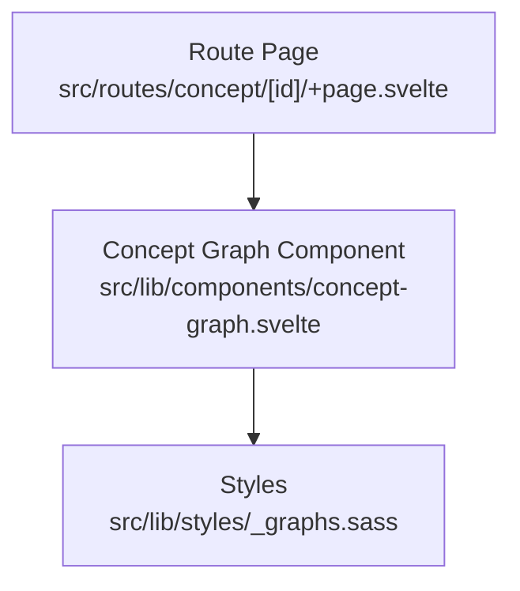
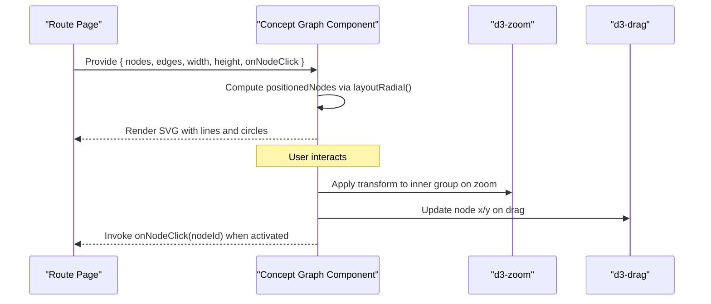
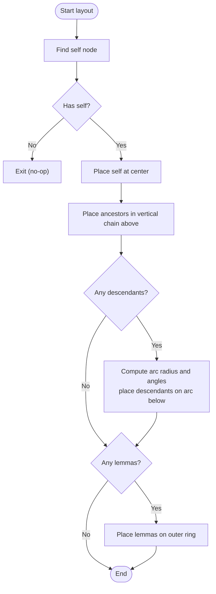
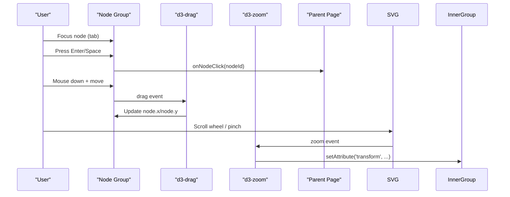
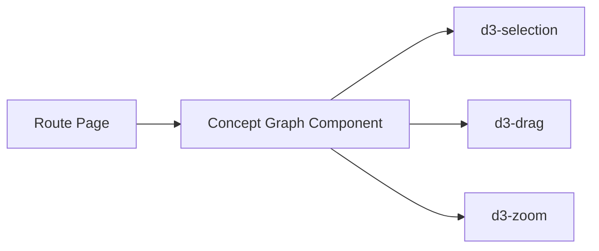

# Concept Graph Component

<cite>
**Referenced Files in This Document**
- [concept-graph.svelte](file://src/lib/components/concept-graph.svelte)
- [+page.svelte](file://src/routes/concept/[id]/+page.svelte)
- [_graphs.sass](file://src/lib/styles/_graphs.sass)
</cite>

## Table of Contents
1. [Introduction](#introduction)
2. [Project Structure](#project-structure)
3. [Core Components](#core-components)
4. [Architecture Overview](#architecture-overview)
5. [Detailed Component Analysis](#detailed-component-analysis)
6. [Dependency Analysis](#dependency-analysis)
7. [Performance Considerations](#performance-considerations)
8. [Troubleshooting Guide](#troubleshooting-guide)
9. [Conclusion](#conclusion)
10. [Appendices](#appendices)

## Introduction
This document explains the Concept Graph component that renders a radial neighborhood graph for a single semantic concept. The layout is deterministic and optimized for clarity: the self node sits at the center, ancestors form a vertical chain above, descendants are placed along an arc below, and lemmas are distributed on an outer ring. Users can pan and zoom the canvas and drag individual nodes to fine-tune positions. The component exposes props for nodes, edges, dimensions, and a click callback, and includes keyboard accessibility for interactive nodes.

## Project Structure
The Concept Graph is implemented as a Svelte component and consumed by a route page that builds the graph data from concept metadata (IS-A chain, children, and member lemmas). Styling is centralized in a shared stylesheet module.

**Diagram sources**
- [+page.svelte:1-65](file://src/routes/concept/[id]/+page.svelte#L1-L65)
- [concept-graph.svelte:1-202](file://src/lib/components/concept-graph.svelte#L1-L202)
- [_graphs.sass:1-80](file://src/lib/styles/_graphs.sass#L1-L80)

**Section sources**
- [+page.svelte:1-65](file://src/routes/concept/[id]/+page.svelte#L1-L65)
- [concept-graph.svelte:1-202](file://src/lib/components/concept-graph.svelte#L1-L202)
- [_graphs.sass:1-80](file://src/lib/styles/_graphs.sass#L1-L80)

## Core Components
- Concept Graph Component: Renders SVG-based radial graphs with deterministic placement, D3-powered drag and zoom, and accessible interactions.
- Route Page: Constructs the nodes and edges arrays based on concept data and passes them into the component.

Key responsibilities:
- Deterministic radial layout algorithm
- Edge rendering between positioned nodes
- Drag interaction per node using d3-drag
- Zoom/pan via d3-zoom applied to an inner group
- Accessibility attributes and keyboard activation for clickable nodes
- Legend and hints for user guidance

**Section sources**
- [concept-graph.svelte:18-50](file://src/lib/components/concept-graph.svelte#L18-L50)
- [concept-graph.svelte:54-104](file://src/lib/components/concept-graph.svelte#L54-L104)
- [concept-graph.svelte:141-150](file://src/lib/components/concept-graph.svelte#L141-L150)
- [concept-graph.svelte:168-190](file://src/lib/components/concept-graph.svelte#L168-L190)
- [+page.svelte:17-33](file://src/routes/concept/[id]/+page.svelte#L17-L33)

## Architecture Overview
At runtime, the route page computes a nodes array containing one self node, ancestor nodes, descendant nodes, and lemma nodes, plus an edges array linking them. These are passed to the Concept Graph component, which derives positioned coordinates deterministically and renders SVG elements. D3 zoom transforms an inner group, while D3 drag updates individual node coordinates.

**Diagram sources**
- [concept-graph.svelte:54-104](file://src/lib/components/concept-graph.svelte#L54-L104)
- [concept-graph.svelte:141-150](file://src/lib/components/concept-graph.svelte#L141-L150)
- [concept-graph.svelte:125-139](file://src/lib/components/concept-graph.svelte#L125-L139)
- [+page.svelte:17-37](file://src/routes/concept/[id]/+page.svelte#L17-L37)

## Detailed Component Analysis

### Props and Data Model
- nodes: Array of objects with id, label, type, and computed x/y after layout. Types include self, ancestor, descendant, lemma.
- edges: Array of source/target id pairs.
- width, height: Canvas dimensions.
- onNodeClick: Optional callback invoked when a node is clicked or activated via keyboard.

Data flow:
- The route page constructs nodes and edges from concept metadata.
- The component derives positioned nodes reactively whenever inputs change.

**Section sources**
- [concept-graph.svelte:24-49](file://src/lib/components/concept-graph.svelte#L24-L49)
- [+page.svelte:17-33](file://src/routes/concept/[id]/+page.svelte#L17-L33)

### Deterministic Radial Layout Algorithm
The layout function places nodes deterministically:
- Self node: Centered at (width/2, height/2).
- Ancestors: Vertical chain above the self node, spaced evenly; order follows input sequence (closest to self first).
- Descendants: Placed on an arc beneath the self node spanning up to 180 degrees; angles distributed proportionally across the arc.
- Lemmas: Distributed evenly around an outer circle centered at the canvas center.

Complexity:
- Time: O(n) where n is number of nodes (single pass per category).
- Space: O(n) for the copy of nodes with coordinates.

Edge cases:
- If no self node exists, layout returns early without changes.
- Single descendant uses midpoint angle to avoid degenerate arcs.

**Section sources**
- [concept-graph.svelte:54-104](file://src/lib/components/concept-graph.svelte#L54-L104)

#### Layout Flowchart

**Diagram sources**
- [concept-graph.svelte:61-104](file://src/lib/components/concept-graph.svelte#L61-L104)

### Interaction System
- Drag: Each node group is enhanced with d3-drag. On drag start, original coordinates are stored; during drag, node coordinates update to pointer position; on end, the new position persists.
- Zoom: d3-zoom is attached to the SVG element. On zoom events, the inner group’s transform attribute is updated to reflect scale and translation.
- Click and Keyboard: Nodes gain role="button" and tabindex based on whether onNodeClick is provided. Keyboard activation triggers on Enter or Space, invoking the callback.

Accessibility:
- aria-disabled reflects interactivity availability.
- Keyboard navigation supports activation via standard keys.

**Section sources**
- [concept-graph.svelte:125-139](file://src/lib/components/concept-graph.svelte#L125-L139)
- [concept-graph.svelte:141-150](file://src/lib/components/concept-graph.svelte#L141-L150)
- [concept-graph.svelte:168-190](file://src/lib/components/concept-graph.svelte#L168-L190)

#### Interaction Sequence Diagram

**Diagram sources**
- [concept-graph.svelte:125-139](file://src/lib/components/concept-graph.svelte#L125-L139)
- [concept-graph.svelte:141-150](file://src/lib/components/concept-graph.svelte#L141-L150)
- [concept-graph.svelte:168-190](file://src/lib/components/concept-graph.svelte#L168-L190)

### Rendering and Styling
- Edges: Lines drawn between source and target node coordinates resolved from positioned nodes.
- Nodes: Circles sized by node type; labels truncated to fit within a fixed character limit.
- Styles: Node categories use CSS classes for visual distinction; legend indicates meanings and interaction hints.

Styling hooks:
- Classes gnode-self, gnode-ancestor, gnode-descendant, gnode-lemma apply type-specific styles.
- Labels and dots are styled via dedicated selectors.

**Section sources**
- [concept-graph.svelte:156-190](file://src/lib/components/concept-graph.svelte#L156-L190)
- [_graphs.sass:1-80](file://src/lib/styles/_graphs.sass#L1-L80)

### Usage Example: Data Construction
The route page demonstrates how to build nodes and edges:
- Create a self node from the current concept.
- Add ancestors from the IS-A chain.
- Optionally add parent link for synsets.
- Add descendants (hyponyms) up to a cap.
- Add lemmas mapped to the concept up to a cap.
- Compute dynamic width/height based on total node count.

Navigation:
- onNodeClick routes to either a lemma page or a concept page depending on node id prefix.

**Section sources**
- [+page.svelte:17-37](file://src/routes/concept/[id]/+page.svelte#L17-L37)

## Dependency Analysis
External dependencies used by the component:
- d3-selection: DOM selection utilities.
- d3-drag: Drag behavior for nodes.
- d3-zoom: Zoom behavior for the canvas.

Internal relationships:
- The component depends on its props for data and callbacks.
- Positioning logic is encapsulated and reactive to prop changes.
- Event handlers integrate D3 behaviors with Svelte reactivity.

**Diagram sources**
- [concept-graph.svelte:18-23](file://src/lib/components/concept-graph.svelte#L18-L23)
- [+page.svelte:1-6](file://src/routes/concept/[id]/+page.svelte#L1-L6)

**Section sources**
- [concept-graph.svelte:18-23](file://src/lib/components/concept-graph.svelte#L18-L23)

## Performance Considerations
- Deterministic layout avoids force simulation overhead, ensuring stable O(n) positioning regardless of graph density.
- Reactive derived state recomputes positions only when nodes or dimensions change.
- For large hierarchies:
  - Cap the number of descendants and lemmas rendered to control DOM size.
  - Use pagination or virtualization if needed beyond caps.
  - Keep edge list minimal; avoid redundant edges.
- Zoom and drag operate on transformed groups and individual nodes, minimizing re-renders.

[No sources needed since this section provides general guidance]

## Troubleshooting Guide
Common issues and resolutions:
- No self node present: Layout exits early; ensure at least one node has type 'self'.
- Edges not visible: Verify that both source and target ids exist in positioned nodes; check id uniqueness and consistency.
- Drag does not persist: Confirm drag end handler does not revert coordinates; ensure node properties are mutable references.
- Zoom not applying: Ensure inner group reference is bound and transform attribute is updated on zoom events.
- Keyboard activation not working: Ensure onNodeClick is provided so tabindex is set to 0 and aria-disabled is false.

**Section sources**
- [concept-graph.svelte:61-67](file://src/lib/components/concept-graph.svelte#L61-L67)
- [concept-graph.svelte:107-112](file://src/lib/components/concept-graph.svelte#L107-L112)
- [concept-graph.svelte:125-139](file://src/lib/components/concept-graph.svelte#L125-L139)
- [concept-graph.svelte:141-150](file://src/lib/components/concept-graph.svelte#L141-L150)
- [concept-graph.svelte:168-190](file://src/lib/components/concept-graph.svelte#L168-L190)

## Conclusion
The Concept Graph component delivers a clear, deterministic radial visualization of semantic neighborhoods with robust interactions. Its design emphasizes performance and accessibility, making it suitable for exploring complex concept hierarchies. By following the documented data contracts and styling conventions, consumers can integrate and customize the component effectively.

[No sources needed since this section summarizes without analyzing specific files]

## Appendices

### Data Structure Requirements
- nodes: Array of objects with fields id (string), label (string), type ('self' | 'ancestor' | 'descendant' | 'lemma'), and x/y numbers after layout.
- edges: Array of objects with source (string id) and target (string id).
- width, height: Numbers defining the SVG viewBox.
- onNodeClick: Function receiving a string nodeId.

Example construction pattern:
- Build self node from current concept.
- Add ancestors from IS-A chain.
- Add descendants (hyponyms) up to a cap.
- Add lemmas mapped to the concept up to a cap.
- Compute width/height dynamically based on node count.

**Section sources**
- [concept-graph.svelte:24-49](file://src/lib/components/concept-graph.svelte#L24-L49)
- [+page.svelte:17-33](file://src/routes/concept/[id]/+page.svelte#L17-L33)

### Custom Styling Options
- Node types are styled via class names: gnode-self, gnode-ancestor, gnode-descendant, gnode-lemma.
- Labels and dots have dedicated selectors for customization.
- Legend text and hint messages can be adjusted through CSS variables or overrides.

**Section sources**
- [_graphs.sass:1-80](file://src/lib/styles/_graphs.sass#L1-L80)
- [concept-graph.svelte:168-190](file://src/lib/components/concept-graph.svelte#L168-L190)

### Accessibility Features
- Interactive nodes receive role="button" and appropriate tabindex when onNodeClick is provided.
- Keyboard activation supported via Enter and Space keys.
- aria-disabled reflects interactivity state.

**Section sources**
- [concept-graph.svelte:168-190](file://src/lib/components/concept-graph.svelte#L168-L190)