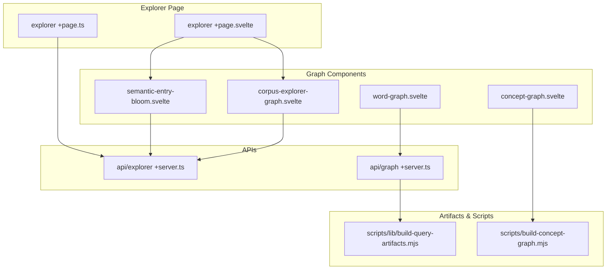
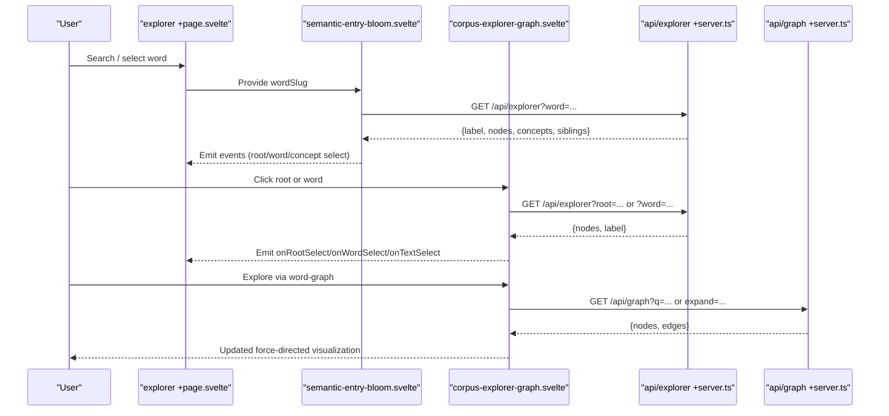
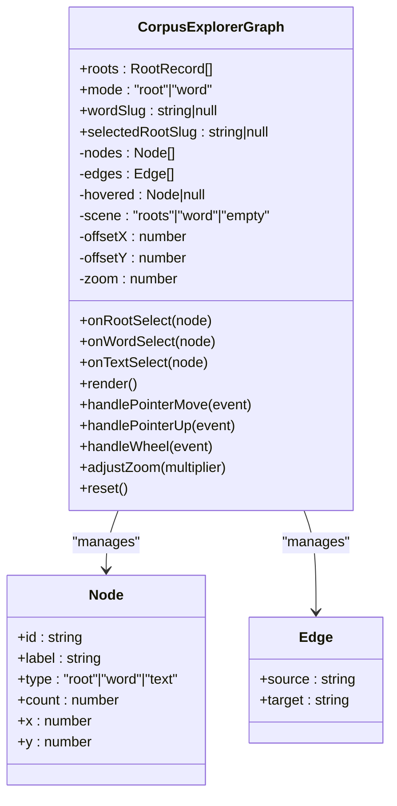
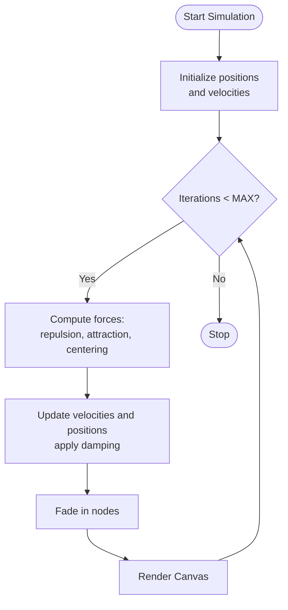
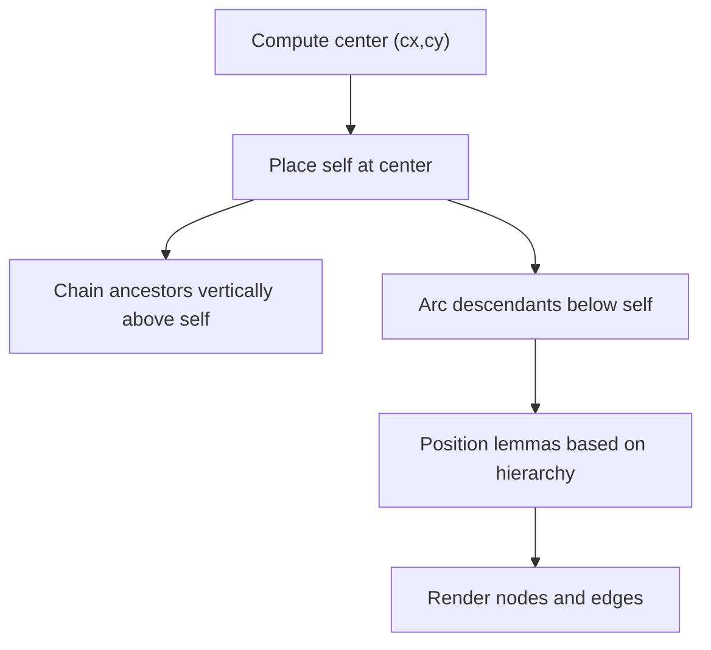
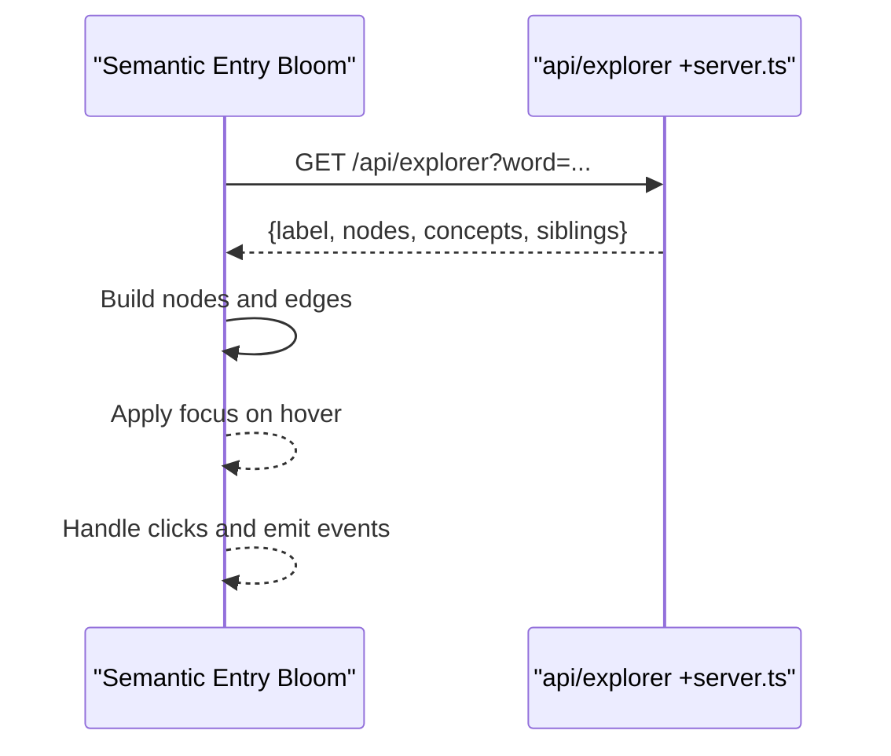
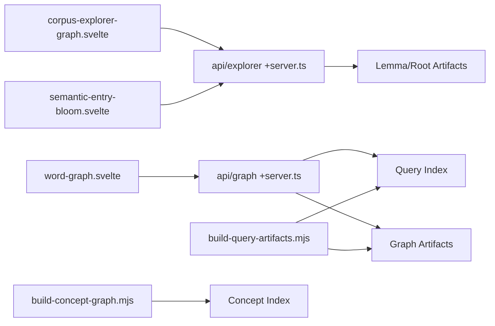

# Corpus Explorer Graph

<cite>
**Referenced Files in This Document**
- [corpus-explorer-graph.svelte](file://src/lib/components/corpus-explorer-graph.svelte)
- [word-graph.svelte](file://src/lib/components/word-graph.svelte)
- [concept-graph.svelte](file://src/lib/components/concept-graph.svelte)
- [semantic-entry-bloom.svelte](file://src/lib/components/semantic-entry-bloom.svelte)
- [explorer +page.svelte](file://src/routes/explorer/+page.svelte)
- [explorer +page.ts](file://src/routes/explorer/+page.ts)
- [api/explorer +server.ts](file://src/routes/api/explorer/+server.ts)
- [api/graph +server.ts](file://src/routes/api/graph/+server.ts)
- [build-concept-graph.mjs](file://scripts/build-concept-graph.mjs)
- [build-query-artifacts.mjs](file://scripts/lib/build-query-artifacts.mjs)
</cite>

## Table of Contents
1. Introduction
2. Project Structure
3. Core Components
4. Architecture Overview
5. Detailed Component Analysis
6. Dependency Analysis
7. Performance Considerations
8. Troubleshooting Guide
9. Conclusion

## Introduction
This document provides comprehensive documentation for the corpus explorer graph component that visualizes relationships between texts, concepts, and lexical items across the Sanskrit corpus. It explains the force-directed layout implementation, node types representing different entity categories, edge weight calculations based on co-occurrence frequency, and interactive filtering capabilities. It also documents props for data binding, configuration options for layout parameters, color schemes for different node types, and event handlers for user interactions. Examples include corpus data structures, custom node rendering, tooltip implementations, and optimization techniques for handling large-scale corpus visualizations.

## Project Structure
The corpus explorer is implemented as a set of Svelte components backed by server-side APIs and prebuilt artifacts:
- Canvas-based graphs for performance at scale
- A semantic entry bloom using a flow library for rich interactivity
- API endpoints to serve graph data and explorer payloads
- Scripts to build query indexes and concept artifacts

**Diagram sources**
- [explorer +page.svelte:1-155](file://src/routes/explorer/+page.svelte#L1-L155)
- [explorer +page.ts:1-8](file://src/routes/explorer/+page.ts#L1-L8)
- [corpus-explorer-graph.svelte:1-338](file://src/lib/components/corpus-explorer-graph.svelte#L1-L338)
- [word-graph.svelte:1-546](file://src/lib/components/word-graph.svelte#L1-L546)
- [concept-graph.svelte:51-92](file://src/lib/components/concept-graph.svelte#L51-L92)
- [semantic-entry-bloom.svelte:1-418](file://src/lib/components/semantic-entry-bloom.svelte#L1-L418)
- [api/explorer +server.ts:1-121](file://src/routes/api/explorer/+server.ts#L1-L121)
- [api/graph +server.ts:1-82](file://src/routes/api/graph/+server.ts#L1-L82)
- [build-query-artifacts.mjs:269-380](file://scripts/lib/build-query-artifacts.mjs#L269-L380)
- [build-concept-graph.mjs:157-187](file://scripts/build-concept-graph.mjs#L157-L187)

**Section sources**
- [explorer +page.svelte:1-155](file://src/routes/explorer/+page.svelte#L1-L155)
- [explorer +page.ts:1-8](file://src/routes/explorer/+page.ts#L1-L8)

## Core Components
- Corpus Explorer Graph (Canvas): Renders roots, words, and texts with pan/zoom and click-to-expand behavior. Uses deterministic layouts per scene and lightweight interaction handling.
- Word Graph (Canvas): Implements a full force-directed simulation with repulsion, attraction, centering, damping, and fade-in animation. Supports panning, dragging nodes, zooming, and expanding neighborhoods.
- Concept Graph: Provides a deterministic radial layout for hierarchical concept relationships (ancestors, descendants, lemmas).
- Semantic Entry Bloom: A flow-based visualization for word-centric exploration, including root, sibling words, and concept nodes with hover focus and animated edges.

Key responsibilities:
- Data fetching from APIs
- Layout computation (deterministic or force-directed)
- Rendering via Canvas or Flow
- Interaction handling (pan, zoom, hover, click)
- Event emission to parent components

**Section sources**
- [corpus-explorer-graph.svelte:1-338](file://src/lib/components/corpus-explorer-graph.svelte#L1-L338)
- [word-graph.svelte:1-546](file://src/lib/components/word-graph.svelte#L1-L546)
- [concept-graph.svelte:51-92](file://src/lib/components/concept-graph.svelte#L51-L92)
- [semantic-entry-bloom.svelte:1-418](file://src/lib/components/semantic-entry-bloom.svelte#L1-L418)

## Architecture Overview
The system composes multiple graph components with shared data contracts and APIs:
- The explorer page loads top roots and integrates search results into the graph components.
- The corpus-explorer-graph component fetches explorer payloads for roots and words.
- The word-graph component queries the graph API for broader corpus connections.
- The semantic-entry-bloom uses the explorer API to construct a focused view around a selected word.

**Diagram sources**
- [explorer +page.svelte:1-155](file://src/routes/explorer/+page.svelte#L1-L155)
- [semantic-entry-bloom.svelte:1-418](file://src/lib/components/semantic-entry-bloom.svelte#L1-L418)
- [corpus-explorer-graph.svelte:1-338](file://src/lib/components/corpus-explorer-graph.svelte#L1-L338)
- [api/explorer +server.ts:1-121](file://src/routes/api/explorer/+server.ts#L1-L121)
- [api/graph +server.ts:1-82](file://src/routes/api/graph/+server.ts#L1-L82)

## Detailed Component Analysis

### Corpus Explorer Graph (Canvas)
- Node types: root, word, text
- Scenes:
  - Roots: grid-like arrangement computed from canvas size; radius normalized by derived word counts
  - Word: central word node with surrounding text nodes arranged radially
- Interactions:
  - Pan via pointer drag
  - Zoom via wheel and buttons
  - Hover highlights nodes and updates cursor
  - Click expands root or selects word/text and emits events
- Rendering:
  - Canvas 2D drawing with translation and scaling
  - Edge lines drawn between connected nodes
  - Labels rendered conditionally based on node size and hover state
- Props:
  - roots: array of root records with slug, root_iast, wordCount
  - mode: 'root' | 'word'
  - wordSlug: optional initial word
  - selectedRootSlug: optional highlighted root
  - onRootSelect, onWordSelect, onTextSelect: event handlers
- Color scheme:
  - root: warm orange
  - word: teal
  - text: blue
- Data binding:
  - Fetches explorer payloads for roots and words
  - Builds nodes and edges deterministically

**Diagram sources**
- [corpus-explorer-graph.svelte:1-338](file://src/lib/components/corpus-explorer-graph.svelte#L1-L338)

**Section sources**
- [corpus-explorer-graph.svelte:1-338](file://src/lib/components/corpus-explorer-graph.svelte#L1-L338)

### Word Graph (Force-Directed Canvas)
- Force simulation:
  - Repulsion between all nodes proportional to sizes and inverse squared distance
  - Attraction along edges with constant coefficient
  - Centering force pulling nodes toward canvas center
  - Damping applied to velocities each tick
  - Fixed maximum iterations for convergence
- Interactions:
  - Mouse down/move/up for panning and dragging nodes
  - Wheel for zoom
  - Click to select and expand neighborhood
- Rendering:
  - Canvas 2D with transform for pan/zoom
  - Edges drawn with opacity influenced by node opacity
  - Nodes drawn as circles sized by node.size
  - Labels truncated to fit
- Props:
  - query: triggers graph fetch
- Data binding:
  - Fetches graph data from /api/graph
  - Expands nodes via /api/graph?expand=...&type=...

**Diagram sources**
- [word-graph.svelte:91-191](file://src/lib/components/word-graph.svelte#L91-L191)

**Section sources**
- [word-graph.svelte:1-546](file://src/lib/components/word-graph.svelte#L1-L546)

### Concept Graph (Radial Deterministic Layout)
- Layout strategy:
  - Self node at center
  - Ancestors placed in a vertical chain above self
  - Descendants placed in an arc below self spanning up to 180 degrees
  - Lemmas positioned according to hierarchy
- Use cases:
  - Visualizing IS-A relationships and lemma groupings
- Integration:
  - Used within concept pages to display hierarchical semantics

**Diagram sources**
- [concept-graph.svelte:51-92](file://src/lib/components/concept-graph.svelte#L51-L92)

**Section sources**
- [concept-graph.svelte:51-92](file://src/lib/components/concept-graph.svelte#L51-L92)

### Semantic Entry Bloom (Flow-Based Visualization)
- Node kinds:
  - word (center), root, word (siblings), concept
- Interactions:
  - Hover focuses connected nodes and dims others
  - Click navigates to root, word, or concept pages
- Rendering:
  - Uses @xyflow/svelte with custom mandala node component
  - Animated edges with tone-specific styling
- Data binding:
  - Loads payload from /api/explorer?word=...
  - Constructs nodes and edges deterministically

**Diagram sources**
- [semantic-entry-bloom.svelte:1-418](file://src/lib/components/semantic-entry-bloom.svelte#L1-L418)
- [api/explorer +server.ts:1-121](file://src/routes/api/explorer/+server.ts#L1-L121)

**Section sources**
- [semantic-entry-bloom.svelte:1-418](file://src/lib/components/semantic-entry-bloom.svelte#L1-L418)

## Dependency Analysis
- Components depend on APIs for dynamic data:
  - corpus-explorer-graph depends on /api/explorer
  - word-graph depends on /api/graph
  - semantic-entry-bloom depends on /api/explorer
- APIs depend on prebuilt artifacts:
  - /api/explorer reads lemma and root detail artifacts
  - /api/graph reads graph artifacts and query index
- Scripts generate artifacts:
  - build-query-artifacts constructs graph data for roots, lemmas, texts
  - build-concept-graph builds concept indices and mappings

**Diagram sources**
- [corpus-explorer-graph.svelte:1-338](file://src/lib/components/corpus-explorer-graph.svelte#L1-L338)
- [word-graph.svelte:1-546](file://src/lib/components/word-graph.svelte#L1-L546)
- [semantic-entry-bloom.svelte:1-418](file://src/lib/components/semantic-entry-bloom.svelte#L1-L418)
- [api/explorer +server.ts:1-121](file://src/routes/api/explorer/+server.ts#L1-L121)
- [api/graph +server.ts:1-82](file://src/routes/api/graph/+server.ts#L1-L82)
- [build-query-artifacts.mjs:269-380](file://scripts/lib/build-query-artifacts.mjs#L269-L380)
- [build-concept-graph.mjs:157-187](file://scripts/build-concept-graph.mjs#L157-L187)

**Section sources**
- [api/explorer +server.ts:1-121](file://src/routes/api/explorer/+server.ts#L1-L121)
- [api/graph +server.ts:1-82](file://src/routes/api/graph/+server.ts#L1-L82)
- [build-query-artifacts.mjs:269-380](file://scripts/lib/build-query-artifacts.mjs#L269-L380)
- [build-concept-graph.mjs:157-187](file://scripts/build-concept-graph.mjs#L157-L187)

## Performance Considerations
- Canvas rendering:
  - Both corpus-explorer-graph and word-graph use Canvas 2D for efficient drawing at scale
  - Avoid unnecessary re-renders by minimizing state changes and batching updates
- Force simulation:
  - Limit iterations to prevent long-running loops
  - Use adjacency sets for quick neighbor lookups
  - Apply damping to stabilize quickly
- Resize handling:
  - Use ResizeObserver to track container dimensions accurately
  - Debounce heavy computations if needed
- Data loading:
  - Fetch only necessary subsets (e.g., top roots, limited siblings)
  - Cache responses where appropriate
- Interaction throttling:
  - Separate pan detection from click to avoid accidental selections
  - Clamp zoom ranges to prevent extreme views

[No sources needed since this section provides general guidance]

## Troubleshooting Guide
Common issues and resolutions:
- Empty graph:
  - Ensure query matches available slugs in the query index
  - Verify artifact availability for requested entities
- Slow rendering:
  - Reduce node count or simplify layout calculations
  - Check for excessive re-renders due to frequent state updates
- Incorrect colors:
  - Confirm CSS custom properties are resolved after mount
  - Validate theme tokens for node types
- Interaction not working:
  - Verify pointer events are bound correctly
  - Ensure canvas has non-zero dimensions before measuring

**Section sources**
- [word-graph.svelte:430-478](file://src/lib/components/word-graph.svelte#L430-L478)
- [corpus-explorer-graph.svelte:259-278](file://src/lib/components/corpus-explorer-graph.svelte#L259-L278)

## Conclusion
The corpus explorer graph system combines high-performance Canvas rendering with rich interactive flows to visualize Sanskrit corpus relationships. Deterministic layouts provide clarity for exploratory scenes, while force-directed simulations reveal complex connectivity patterns. APIs deliver curated payloads from prebuilt artifacts, ensuring scalability and responsiveness. By following the documented props, configurations, and interaction patterns, developers can extend and customize the visualizations effectively.

[No sources needed since this section summarizes without analyzing specific files]