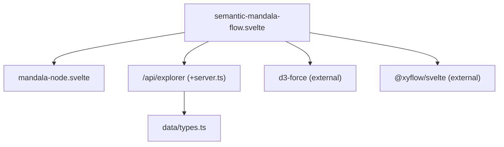
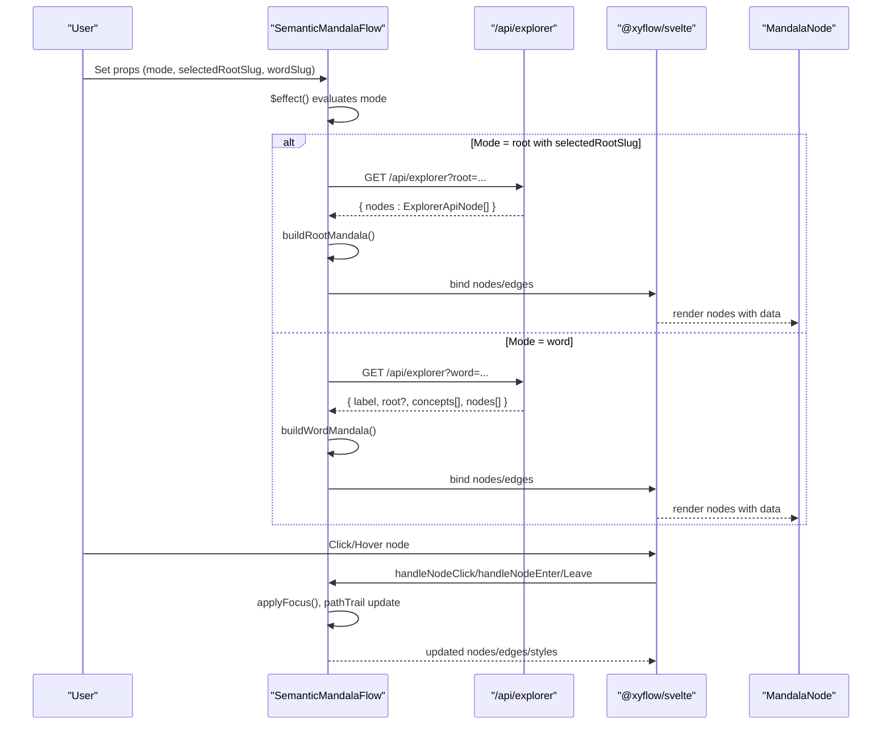
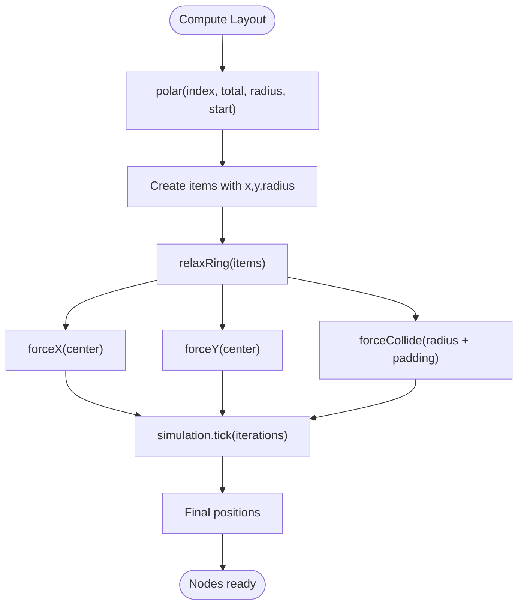
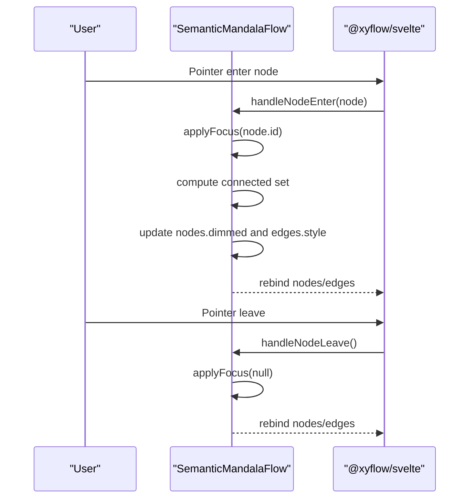
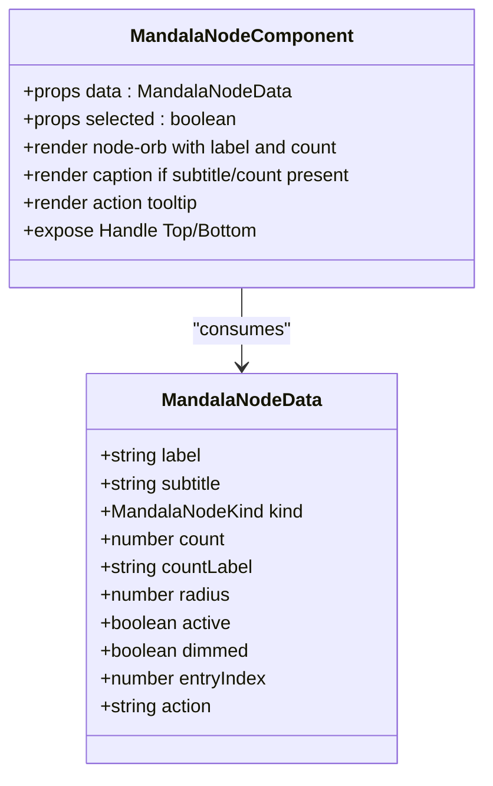
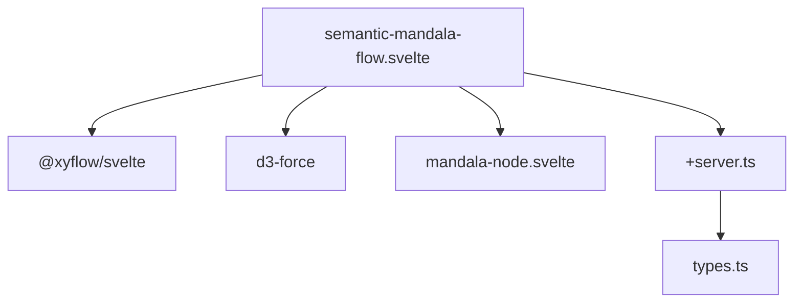

# Semantic Mandala Flow

<cite>
**Referenced Files in This Document**
- [semantic-mandala-flow.svelte](file://src/lib/components/semantic-mandala-flow.svelte)
- [mandala-node.svelte](file://src/lib/components/mandala-node.svelte)
- [+server.ts](file://src/routes/api/explorer/+server.ts)
- [types.ts](file://src/lib/data/types.ts)
</cite>

## Table of Contents
1. [Introduction](#introduction)
2. [Project Structure](#project-structure)
3. [Core Components](#core-components)
4. [Architecture Overview](#architecture-overview)
5. [Detailed Component Analysis](#detailed-component-analysis)
6. [Dependency Analysis](#dependency-analysis)
7. [Performance Considerations](#performance-considerations)
8. [Troubleshooting Guide](#troubleshooting-guide)
9. [Conclusion](#conclusion)
10. [Appendices](#appendices)

## Introduction
The Semantic Mandala Flow component renders a circular, mandala-style visualization of semantic relationships and conceptual flows across roots, words, texts, and concepts. It uses a radial layout with concentric rings to represent proximity and importance, animated edges to show relationships, and an interactive node subcomponent for individual concept representation. The component integrates with a server API to fetch data on demand and supports accessibility features such as focusable nodes and reduced motion preferences.

## Project Structure
The implementation is composed of:
- A flow container that manages state, layout algorithms, and interactions
- A node subcomponent that renders each mandala node with visual styling and interaction hints
- An API endpoint that returns structured data for root-to-word and word-to-text/concept views
- Shared TypeScript types describing artifacts consumed by the API



**Diagram sources**
- [semantic-mandala-flow.svelte:1-14](file://src/lib/components/semantic-mandala-flow.svelte#L1-L14)
- [mandala-node.svelte:1-5](file://src/lib/components/mandala-node.svelte#L1-L5)
- [+server.ts:1-6](file://src/routes/api/explorer/+server.ts#L1-L6)
- [types.ts:1-10](file://src/lib/data/types.ts#L1-L10)

**Section sources**
- [semantic-mandala-flow.svelte:1-72](file://src/lib/components/semantic-mandala-flow.svelte#L1-L72)
- [mandala-node.svelte:1-30](file://src/lib/components/mandala-node.svelte#L1-L30)
- [+server.ts:1-121](file://src/routes/api/explorer/+server.ts#L1-L121)
- [types.ts:1-92](file://src/lib/data/types.ts#L1-L92)

## Core Components
- Semantic Mandala Flow: Orchestrates scene transitions (roots field, root mandala, word mandala), computes polar coordinates and ring relaxation, builds nodes and edges, handles selection and hover focus, and adapts animation timing based on user preferences and device capability.
- Mandala Node: Renders a single node with label, optional count badge, subtitle, and action tooltip; applies category-based color via CSS variables; supports hover and active states; exposes connection handles for graph semantics.

Key responsibilities:
- Circular layout using polar math and d3-force collision relaxation
- Weighted radius computation for semantic prominence
- Animated edges per relationship type
- Accessibility attributes and reduced-motion handling
- Data binding through props and event callbacks

**Section sources**
- [semantic-mandala-flow.svelte:74-142](file://src/lib/components/semantic-mandala-flow.svelte#L74-L142)
- [mandala-node.svelte:19-52](file://src/lib/components/mandala-node.svelte#L19-L52)

## Architecture Overview
The component follows a unidirectional data flow:
- Props drive initial mode and selection
- Effects trigger data fetching or local layout generation
- Nodes and edges are bound to the SvelteFlow canvas
- Interactions update state and re-render visuals



**Diagram sources**
- [semantic-mandala-flow.svelte:345-363](file://src/lib/components/semantic-mandala-flow.svelte#L345-L363)
- [semantic-mandala-flow.svelte:215-256](file://src/lib/components/semantic-mandala-flow.svelte#L215-L256)
- [semantic-mandala-flow.svelte:258-322](file://src/lib/components/semantic-mandala-flow.svelte#L258-L322)
- [+server.ts:28-48](file://src/routes/api/explorer/+server.ts#L28-L48)
- [+server.ts:50-117](file://src/routes/api/explorer/+server.ts#L50-L117)

## Detailed Component Analysis

### Circular Layout Algorithms
- Polar coordinate mapping distributes nodes evenly around a circle with configurable start angle and arc.
- Concentric rings are used to separate categories (e.g., inner source, middle relation, outer corpus).
- d3-force simulation relaxes overlapping nodes using x/y centering forces and collision detection based on computed radii.



**Diagram sources**
- [semantic-mandala-flow.svelte:108-121](file://src/lib/components/semantic-mandala-flow.svelte#L108-L121)

**Section sources**
- [semantic-mandala-flow.svelte:108-121](file://src/lib/components/semantic-mandala-flow.svelte#L108-L121)

### Node Positioning Based on Semantic Proximity
- Root field: multiple rings sized by wordCount; larger counts yield larger radii.
- Root mandala: center root node with concentric rings of words sorted by count; radii scale with square-root weighting.
- Word mandala: center lemma with concept seeds arranged in an inner arc, followed by text nodes in outer rings weighted by occurrence counts.

```mermaid
classDiagram
class MandalaData {
+string label
+string subtitle
+ExplorerNodeKind kind
+number count
+number radius
+boolean active
+boolean dimmed
+number entryIndex
+string action
}
class MandalaFlowNode {
+string id
+string type
+{x : number,y : number} position
+MandalaData data
+boolean draggable
+boolean selectable
+boolean focusable
+string ariaRole
}
MandalaFlowNode --> MandalaData : "contains"
```

**Diagram sources**
- [semantic-mandala-flow.svelte:41-54](file://src/lib/components/semantic-mandala-flow.svelte#L41-L54)
- [semantic-mandala-flow.svelte:123-142](file://src/lib/components/semantic-mandala-flow.svelte#L123-L142)

**Section sources**
- [semantic-mandala-flow.svelte:96-106](file://src/lib/components/semantic-mandala-flow.svelte#L96-L106)
- [semantic-mandala-flow.svelte:215-256](file://src/lib/components/semantic-mandala-flow.svelte#L215-L256)
- [semantic-mandala-flow.svelte:258-322](file://src/lib/components/semantic-mandala-flow.svelte#L258-L322)

### Flow Animations Between Related Concepts
- Edges are styled per tone (root/word/text) with distinct colors and stroke widths.
- Animation toggles based on emphasis and tone; non-root edges animate when emphasized.
- Hover focus dims unrelated nodes and edges, highlighting connected paths.



**Diagram sources**
- [semantic-mandala-flow.svelte:161-184](file://src/lib/components/semantic-mandala-flow.svelte#L161-L184)
- [semantic-mandala-flow.svelte:337-343](file://src/lib/components/semantic-mandala-flow.svelte#L337-L343)

**Section sources**
- [semantic-mandala-flow.svelte:144-159](file://src/lib/components/semantic-mandala-flow.svelte#L144-L159)
- [semantic-mandala-flow.svelte:161-184](file://src/lib/components/semantic-mandala-flow.svelte#L161-L184)

### Mandala-Node Subcomponent
- Displays label, optional count badge, subtitle, and action tooltip.
- Uses CSS variables for category-specific colors and sizing.
- Supports hover scaling, active highlighting, and dimming for focus context.
- Exposes source/target handles for graph connectivity semantics.



**Diagram sources**
- [mandala-node.svelte:6-17](file://src/lib/components/mandala-node.svelte#L6-L17)
- [mandala-node.svelte:19-52](file://src/lib/components/mandala-node.svelte#L19-L52)

**Section sources**
- [mandala-node.svelte:1-52](file://src/lib/components/mandala-node.svelte#L1-L52)
- [mandala-node.svelte:54-194](file://src/lib/components/mandala-node.svelte#L54-L194)

### Props for Semantic Data Binding
- roots: array of root records with metadata and counts
- mode: 'root' or 'word' to select view
- wordSlug: optional lemma slug to open word mandala
- selectedRootSlug: optional root slug to preselect in root field
- onRootSelect, onWordSelect, onTextSelect: callbacks for navigation

These props control scene initialization and subsequent data loading.

**Section sources**
- [semantic-mandala-flow.svelte:56-72](file://src/lib/components/semantic-mandala-flow.svelte#L56-L72)

### Animation Configuration
- fitDuration adapts based on prefers-reduced-motion and hardwareConcurrency.
- Edge animations toggle per tone and emphasis.
- Node entry animations use staggered delays derived from entryIndex.

**Section sources**
- [semantic-mandala-flow.svelte:345-350](file://src/lib/components/semantic-mandala-flow.svelte#L345-L350)
- [semantic-mandala-flow.svelte:144-159](file://src/lib/components/semantic-mandala-flow.svelte#L144-L159)
- [mandala-node.svelte:32-52](file://src/lib/components/mandala-node.svelte#L32-L52)

### Color Schemes Based on Semantic Categories
- Node colors defined per kind (root, word, text, concept) via CSS variables.
- Edge colors vary by tone (root/word/text) with opacity and width adjustments.
- MiniMap nodeColor maps kinds to distinct colors for overview.

**Section sources**
- [mandala-node.svelte:152-162](file://src/lib/components/mandala-node.svelte#L152-L162)
- [semantic-mandala-flow.svelte:144-159](file://src/lib/components/semantic-mandala-flow.svelte#L144-L159)
- [semantic-mandala-flow.svelte:391-396](file://src/lib/components/semantic-mandala-flow.svelte#L391-L396)

### Interaction Handlers
- Click handlers route to appropriate builders based on node kind.
- Hover handlers apply focus context to highlight connections.
- Path trail tracks navigation history for orientation.

**Section sources**
- [semantic-mandala-flow.svelte:324-343](file://src/lib/components/semantic-mandala-flow.svelte#L324-L343)
- [semantic-mandala-flow.svelte:215-256](file://src/lib/components/semantic-mandala-flow.svelte#L215-L256)
- [semantic-mandala-flow.svelte:258-322](file://src/lib/components/semantic-mandala-flow.svelte#L258-L322)

### Examples of Semantic Flow Data Structures
- Root field: list of roots with slug, iast, ganaName, meaning, and wordCount.
- Root mandala payload: nodes array of ExplorerApiNode with id, label, type, weight, count.
- Word mandala payload: label, optional root info, concepts array, and nodes array of text occurrences.

**Section sources**
- [semantic-mandala-flow.svelte:15-23](file://src/lib/components/semantic-mandala-flow.svelte#L15-L23)
- [semantic-mandala-flow.svelte:28-39](file://src/lib/components/semantic-mandala-flow.svelte#L28-L39)
- [+server.ts:7-18](file://src/routes/api/explorer/+server.ts#L7-L18)
- [+server.ts:50-117](file://src/routes/api/explorer/+server.ts#L50-L117)
- [types.ts:63-92](file://src/lib/data/types.ts#L63-L92)

### Custom Mandala Layouts
- Adjust polar parameters (start angle, arc) to change distribution.
- Modify ring radii thresholds to emphasize different layers.
- Tune force strengths and iterations for collision resolution.

**Section sources**
- [semantic-mandala-flow.svelte:108-121](file://src/lib/components/semantic-mandala-flow.svelte#L108-L121)
- [semantic-mandala-flow.svelte:229-233](file://src/lib/components/semantic-mandala-flow.svelte#L229-L233)
- [semantic-mandala-flow.svelte:277-281](file://src/lib/components/semantic-mandala-flow.svelte#L277-L281)

### Accessibility Considerations
- Nodes are focusable and have ariaRole button for keyboard navigation.
- Reduced motion preference disables animations and simplifies transitions.
- Status panel provides contextual guidance for current scene.

**Section sources**
- [semantic-mandala-flow.svelte:123-142](file://src/lib/components/semantic-mandala-flow.svelte#L123-L142)
- [semantic-mandala-flow.svelte:345-350](file://src/lib/components/semantic-mandala-flow.svelte#L345-L350)
- [semantic-mandala-flow.svelte:411-415](file://src/lib/components/semantic-mandala-flow.svelte#L411-L415)

## Dependency Analysis
The component depends on external libraries for graph rendering and physics simulation, and on the internal API for data retrieval.



**Diagram sources**
- [semantic-mandala-flow.svelte:1-14](file://src/lib/components/semantic-mandala-flow.svelte#L1-L14)
- [+server.ts:1-6](file://src/routes/api/explorer/+server.ts#L1-L6)
- [types.ts:1-10](file://src/lib/data/types.ts#L1-L10)

**Section sources**
- [semantic-mandala-flow.svelte:1-14](file://src/lib/components/semantic-mandala-flow.svelte#L1-L14)
- [+server.ts:1-121](file://src/routes/api/explorer/+server.ts#L1-L121)
- [types.ts:1-92](file://src/lib/data/types.ts#L1-L92)

## Performance Considerations
- Use bounded limits for nodes per scene to avoid overloading the canvas.
- Prefer sqrt-weighted radii to balance visual prominence without excessive size variance.
- Reduce animation duration and disable complex transitions under reduced motion or low-end devices.
- Minimize reflows by updating nodes/edges arrays efficiently and leveraging reactive bindings.

[No sources needed since this section provides general guidance]

## Troubleshooting Guide
- If the mandala does not load, verify API responses for root and word endpoints.
- Check console errors for failed fetch calls and ensure correct query parameters.
- Confirm that node kinds and edge tones match expected values for styling.
- Validate that props are correctly passed to initialize the desired scene.

**Section sources**
- [+server.ts:28-48](file://src/routes/api/explorer/+server.ts#L28-L48)
- [+server.ts:50-117](file://src/routes/api/explorer/+server.ts#L50-L117)
- [semantic-mandala-flow.svelte:215-256](file://src/lib/components/semantic-mandala-flow.svelte#L215-L256)
- [semantic-mandala-flow.svelte:258-322](file://src/lib/components/semantic-mandala-flow.svelte#L258-L322)

## Conclusion
The Semantic Mandala Flow component delivers an intuitive, accessible, and performant visualization of semantic relationships through circular layouts, animated edges, and interactive nodes. Its modular design separates layout logic, rendering, and data fetching, enabling customization of layouts, animations, and color schemes while maintaining clarity and usability.

[No sources needed since this section summarizes without analyzing specific files]

## Appendices
- For extending the component, consider adding new node kinds and corresponding styles.
- To customize layout behavior, adjust polar functions and force parameters.
- For enhanced accessibility, ensure all interactive elements expose appropriate roles and labels.

[No sources needed since this section provides general guidance]