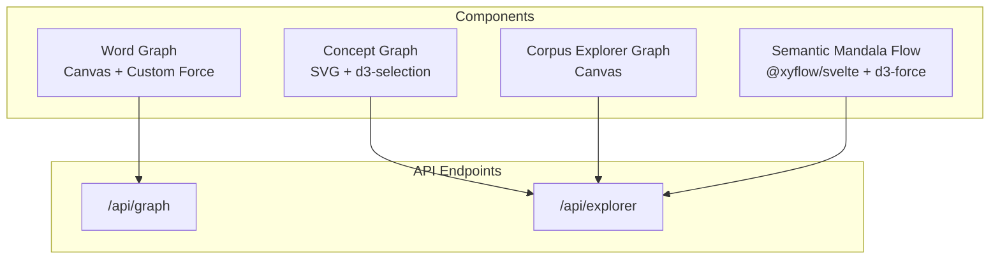
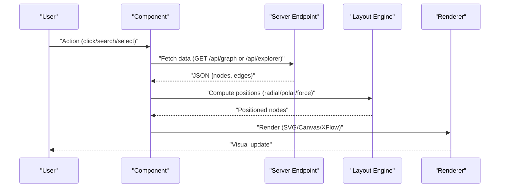
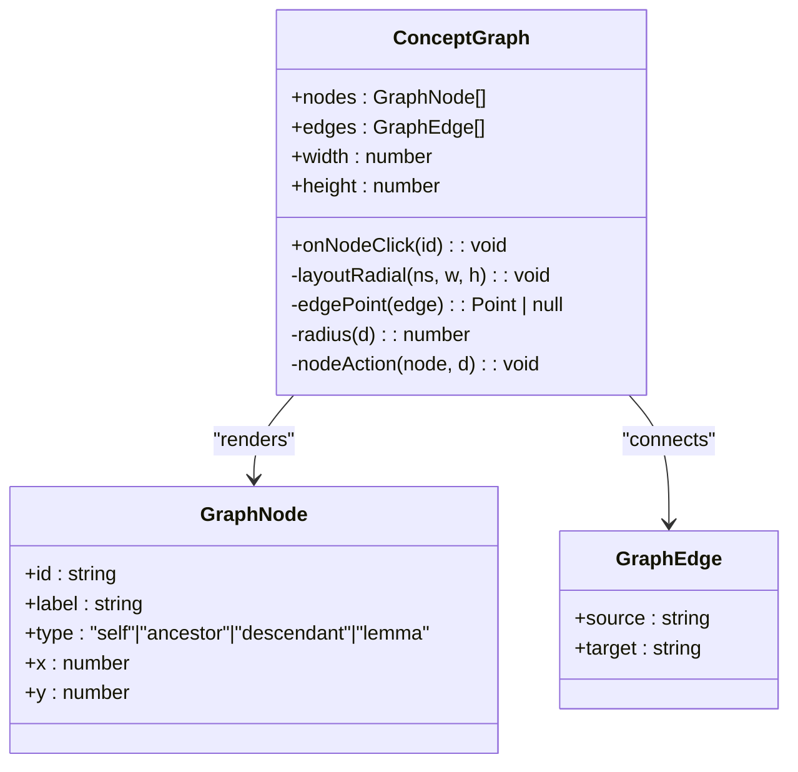
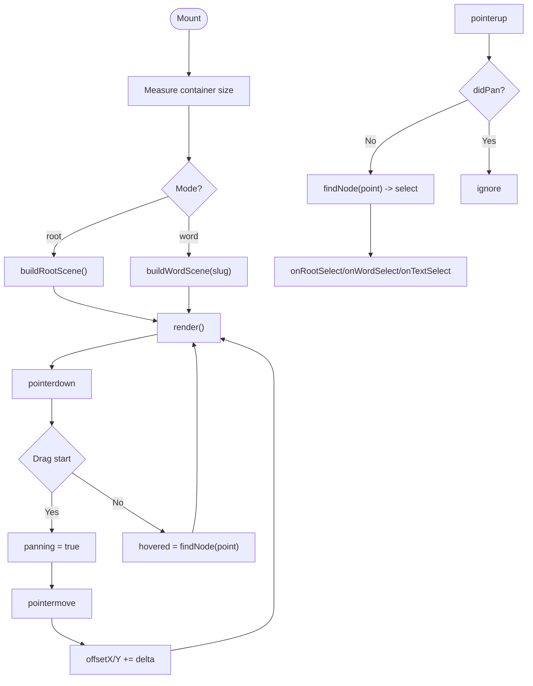
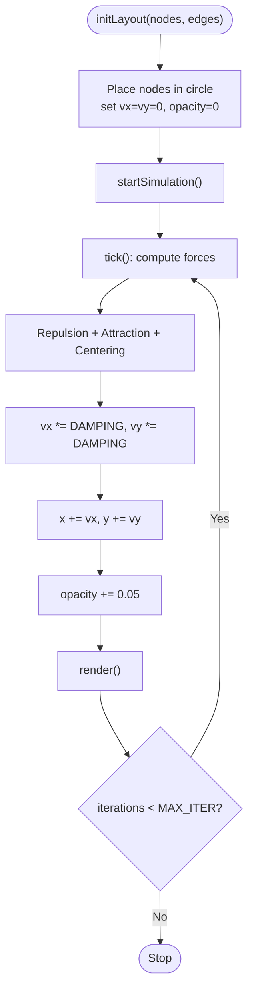
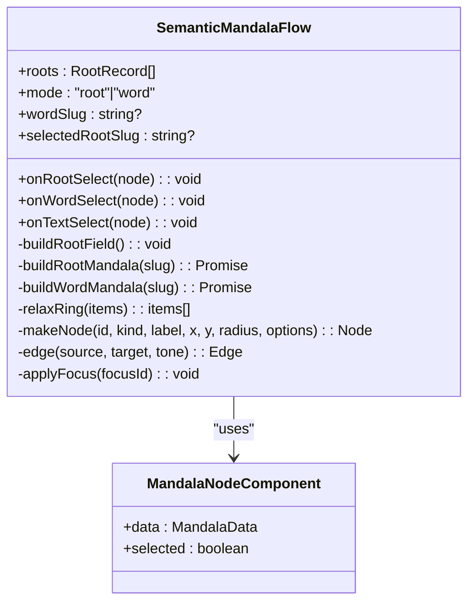
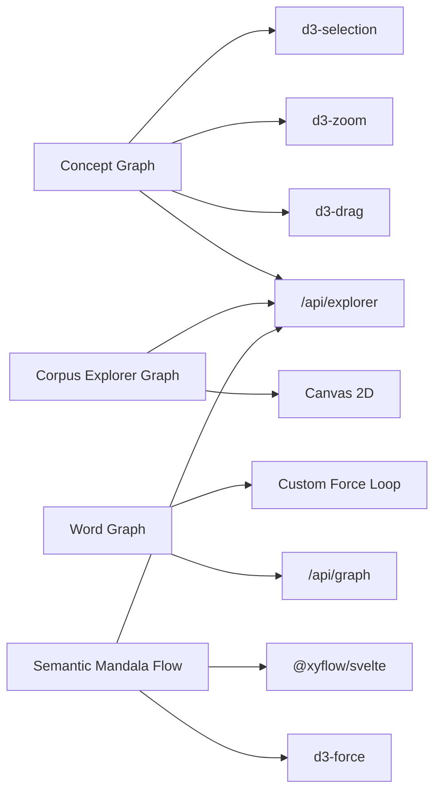

# Visualization Components

<cite>
**Referenced Files in This Document**
- [concept-graph.svelte](file://src/lib/components/concept-graph.svelte)
- [corpus-explorer-graph.svelte](file://src/lib/components/corpus-explorer-graph.svelte)
- [word-graph.svelte](file://src/lib/components/word-graph.svelte)
- [semantic-mandala-flow.svelte](file://src/lib/components/semantic-mandala-flow.svelte)
- [mandala-node.svelte](file://src/lib/components/mandala-node.svelte)
- [_graphs.sass](file://src/lib/styles/_graphs.sass)
- [+server.ts (graph)](file://src/routes/api/graph/+server.ts)
- [+server.ts (explorer)](file://src/routes/api/explorer/+server.ts)
</cite>

## Table of Contents
1. [Introduction](#introduction)
2. [Project Structure](#project-structure)
3. [Core Components](#core-components)
4. [Architecture Overview](#architecture-overview)
5. [Detailed Component Analysis](#detailed-component-analysis)
6. [Dependency Analysis](#dependency-analysis)
7. [Performance Considerations](#performance-considerations)
8. [Troubleshooting Guide](#troubleshooting-guide)
9. [Conclusion](#conclusion)
10. [Appendices](#appendices)

## Introduction
This document provides comprehensive documentation for the visualization components built with D3.js and related libraries: concept graphs, corpus explorer graphs, word graphs, and semantic mandala flows. It covers props for data binding, graph configuration options, interaction handlers, styling customization, force-directed layout algorithms, node and edge rendering, zoom and pan interactions, animation systems, accessibility considerations, and performance optimization techniques for large datasets.

## Project Structure
The visualization components are implemented as Svelte components under src/lib/components, with shared styles in src/lib/styles. Data is fetched from server endpoints under src/routes/api. The main components are:
- Concept Graph: radial neighborhood graph using SVG and d3-selection/d3-zoom/d3-drag
- Corpus Explorer Graph: Canvas-based graph with manual pan/zoom and click interactions
- Word Graph: Canvas-based force-directed graph with custom simulation and expand-on-click
- Semantic Mandala Flow: XFlow-based flow with custom nodes and d3-force relaxation

**Diagram sources**
- [concept-graph.svelte](file://src/lib/components/concept-graph.svelte)
- [corpus-explorer-graph.svelte](file://src/lib/components/corpus-explorer-graph.svelte)
- [word-graph.svelte](file://src/lib/components/word-graph.svelte)
- [semantic-mandala-flow.svelte](file://src/lib/components/semantic-mandala-flow.svelte)
- [+server.ts (graph)](file://src/routes/api/graph/+server.ts)
- [+server.ts (explorer)](file://src/routes/api/explorer/+server.ts)

**Section sources**
- [concept-graph.svelte](file://src/lib/components/concept-graph.svelte)
- [corpus-explorer-graph.svelte](file://src/lib/components/corpus-explorer-graph.svelte)
- [word-graph.svelte](file://src/lib/components/word-graph.svelte)
- [semantic-mandala-flow.svelte](file://src/lib/components/semantic-mandala-flow.svelte)
- [+server.ts (graph)](file://src/routes/api/graph/+server.ts)
- [+server.ts (explorer)](file://src/routes/api/explorer/+server.ts)

## Core Components
- Concept Graph: Deterministic radial layout with drag and zoom; renders edges and labeled circles; accessible via keyboard and ARIA attributes.
- Corpus Explorer Graph: Canvas-based root field and word scenes; supports pan, wheel zoom, hover highlighting, and selection callbacks.
- Word Graph: Canvas-based force-directed graph with repulsion, attraction, centering forces, damping, and fade-in animation; supports drag, pan, zoom, and expand on click.
- Semantic Mandala Flow: XFlow-based mandala with custom nodes, animated edges, minimap, background grid, and d3-force ring relaxation.

**Section sources**
- [concept-graph.svelte](file://src/lib/components/concept-graph.svelte)
- [corpus-explorer-graph.svelte](file://src/lib/components/corpus-explorer-graph.svelte)
- [word-graph.svelte](file://src/lib/components/word-graph.svelte)
- [semantic-mandala-flow.svelte](file://src/lib/components/semantic-mandala-flow.svelte)

## Architecture Overview
The visualizations follow a consistent pattern:
- Data fetching from API endpoints based on user actions or component props
- Layout computation (deterministic radial, polar rings, or force-directed)
- Rendering loop (SVG updates or Canvas draw calls)
- Interaction handling (drag, pan, zoom, click)
- Styling via CSS custom properties and shared graph styles

**Diagram sources**
- [word-graph.svelte](file://src/lib/components/word-graph.svelte)
- [corpus-explorer-graph.svelte](file://src/lib/components/corpus-explorer-graph.svelte)
- [semantic-mandala-flow.svelte](file://src/lib/components/semantic-mandala-flow.svelte)
- [+server.ts (graph)](file://src/routes/api/graph/+server.ts)
- [+server.ts (explorer)](file://src/routes/api/explorer/+server.ts)

## Detailed Component Analysis

### Concept Graph
- Props: nodes (id, label, type), edges (source, target), width, height, optional onNodeClick callback
- Layout: deterministic radial placement for self, ancestors, descendants, lemmas
- Interactions: drag nodes, zoom canvas, click to trigger onNodeClick
- Accessibility: role="button", tabindex, aria-disabled, keyboard activation
- Styling: uses CSS classes for node types and labels

**Diagram sources**
- [concept-graph.svelte](file://src/lib/components/concept-graph.svelte)

**Section sources**
- [concept-graph.svelte](file://src/lib/components/concept-graph.svelte)

### Corpus Explorer Graph
- Props: roots array, mode ('root' | 'word'), wordSlug, selectedRootSlug, callbacks for root/word/text selection
- Scenes: roots grid, expanded words around root, word-centered text occurrences
- Interactions: pointer events for pan and click, wheel zoom, hover highlight
- Rendering: Canvas 2D with transform (translate/scale), arc drawing, text labels
- Styling: theme-aware colors from CSS variables

**Diagram sources**
- [corpus-explorer-graph.svelte](file://src/lib/components/corpus-explorer-graph.svelte)

**Section sources**
- [corpus-explorer-graph.svelte](file://src/lib/components/corpus-explorer-graph.svelte)

### Word Graph
- Props: query string to fetch initial graph
- Data model: nodes with id, label, type, size, count, verseCount, x, y, vx, vy, pinned, opacity; edges with source, target, optional label
- Force-directed algorithm: repulsion between all nodes, attraction along edges, centering force, damping, fixed iteration limit
- Interactions: mouse drag to move nodes, pan by dragging background, wheel zoom, click to select and expand
- Animation: requestAnimationFrame loop with fade-in opacity per node
- Styling: colors read from CSS custom properties at mount

**Diagram sources**
- [word-graph.svelte](file://src/lib/components/word-graph.svelte)

**Section sources**
- [word-graph.svelte](file://src/lib/components/word-graph.svelte)

### Semantic Mandala Flow
- Props: roots array, mode ('root' | 'word'), wordSlug, selectedRootSlug, callbacks for root/word/text selection
- Nodes: custom MandalaNodeComponent with kind-specific styling, counts, subtitles, actions
- Edges: smoothstep curves with tone-based color and animation
- Layout: polar distribution with d3-force ring relaxation (collide, x/y forces)
- Interactions: node click triggers scene transitions, hover focuses connected nodes
- Controls: background dots, controls, minimap with node coloring

**Diagram sources**
- [semantic-mandala-flow.svelte](file://src/lib/components/semantic-mandala-flow.svelte)
- [mandala-node.svelte](file://src/lib/components/mandala-node.svelte)

**Section sources**
- [semantic-mandala-flow.svelte](file://src/lib/components/semantic-mandala-flow.svelte)
- [mandala-node.svelte](file://src/lib/components/mandala-node.svelte)

## Dependency Analysis
- Concept Graph depends on d3-selection, d3-zoom, d3-drag for SVG manipulation and interactions
- Corpus Explorer Graph uses Canvas 2D API directly without D3 dependencies
- Word Graph implements a custom force-directed simulation without d3-force
- Semantic Mandala Flow uses @xyflow/svelte for flow rendering and d3-force for ring relaxation
- All components consume data from /api/graph and /api/explorer endpoints

**Diagram sources**
- [concept-graph.svelte](file://src/lib/components/concept-graph.svelte)
- [corpus-explorer-graph.svelte](file://src/lib/components/corpus-explorer-graph.svelte)
- [word-graph.svelte](file://src/lib/components/word-graph.svelte)
- [semantic-mandala-flow.svelte](file://src/lib/components/semantic-mandala-flow.svelte)
- [+server.ts (graph)](file://src/routes/api/graph/+server.ts)
- [+server.ts (explorer)](file://src/routes/api/explorer/+server.ts)

**Section sources**
- [concept-graph.svelte](file://src/lib/components/concept-graph.svelte)
- [corpus-explorer-graph.svelte](file://src/lib/components/corpus-explorer-graph.svelte)
- [word-graph.svelte](file://src/lib/components/word-graph.svelte)
- [semantic-mandala-flow.svelte](file://src/lib/components/semantic-mandala-flow.svelte)
- [+server.ts (graph)](file://src/routes/api/graph/+server.ts)
- [+server.ts (explorer)](file://src/routes/api/explorer/+server.ts)

## Performance Considerations
- Canvas vs SVG: Canvas-based components (Corpus Explorer, Word Graph) scale better for large datasets due to direct pixel manipulation; SVG-based Concept Graph is suitable for moderate sizes with rich interactivity
- Force simulation limits: Word Graph caps iterations to prevent long-running loops; consider adaptive iteration counts based on dataset size
- ResizeObserver usage: Both Canvas components use ResizeObserver to avoid unnecessary re-renders during layout changes
- Memory management: Cancel animation frames on cleanup; disconnect observers and event listeners to prevent leaks
- Throttling interactions: Debounce rapid pointer events if needed for very large graphs
- Data slicing: APIs return limited results (e.g., top N nodes) to reduce payload size

[No sources needed since this section provides general guidance]

## Troubleshooting Guide
- Fetch errors: Ensure API endpoints return valid JSON; handle HTTP status codes and log errors
- Empty graphs: Verify query parameters and index mappings; fallback to popular roots when no query matches
- Layout issues: Check coordinate transformations for zoom/pan; ensure canvas dimensions match container size
- Interaction conflicts: Differentiate between pan and click by tracking movement distance
- Accessibility: Confirm keyboard navigation and ARIA attributes are present where applicable

**Section sources**
- [word-graph.svelte](file://src/lib/components/word-graph.svelte)
- [corpus-explorer-graph.svelte](file://src/lib/components/corpus-explorer-graph.svelte)
- [concept-graph.svelte](file://src/lib/components/concept-graph.svelte)

## Conclusion
The visualization components provide diverse approaches to graph exploration: SVG-based precision with Concept Graph, high-performance Canvas rendering for Corpus Explorer and Word Graph, and interactive flow-based visualization with Semantic Mandala Flow. Each component balances performance, interactivity, and accessibility while leveraging appropriate libraries and techniques for their specific use cases.

[No sources needed since this section summarizes without analyzing specific files]

## Appendices

### Data Structure Requirements
- Graph nodes: id, label, type, size/count fields depending on component
- Graph edges: source, target, optional label
- API responses: structured JSON with nodes and edges arrays

**Section sources**
- [+server.ts (graph)](file://src/routes/api/graph/+server.ts)
- [+server.ts (explorer)](file://src/routes/api/explorer/+server.ts)

### Styling Customization
- CSS custom properties for colors and spacing
- Shared graph styles for consistency across components
- Theme-aware color resolution at component mount

**Section sources**
- [_graphs.sass](file://src/lib/styles/_graphs.sass)
- [word-graph.svelte](file://src/lib/components/word-graph.svelte)

### Accessibility Considerations
- Keyboard navigation support with tabindex and keydown handlers
- ARIA attributes for roles and states
- Alternative text descriptions through labels and tooltips
- Reduced motion preferences respected in animations

**Section sources**
- [concept-graph.svelte](file://src/lib/components/concept-graph.svelte)
- [semantic-mandala-flow.svelte](file://src/lib/components/semantic-mandala-flow.svelte)