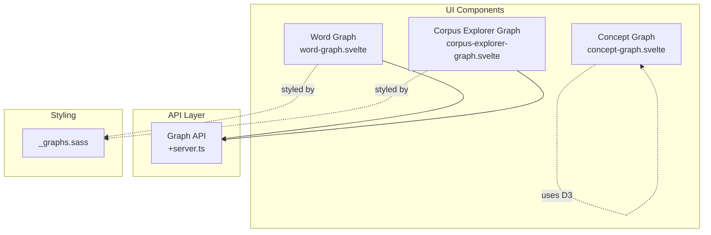
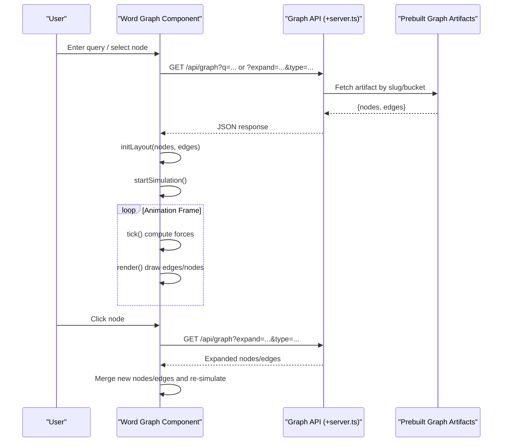
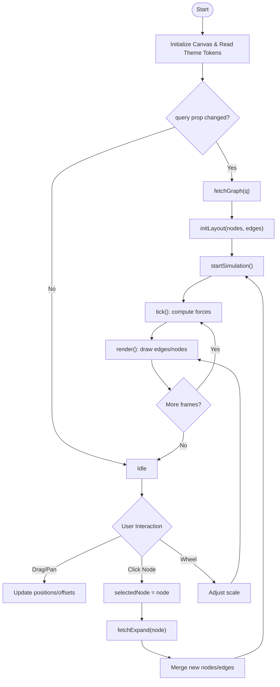
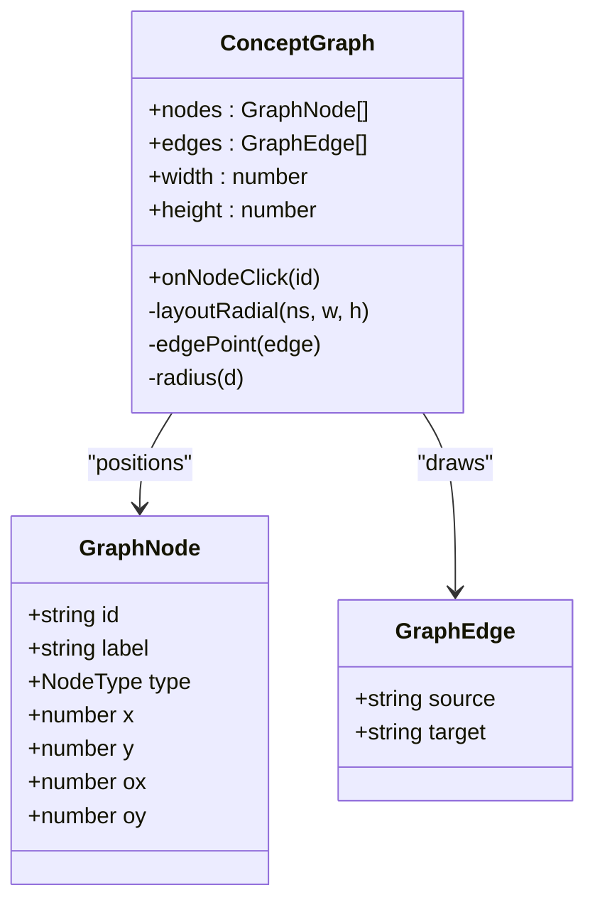
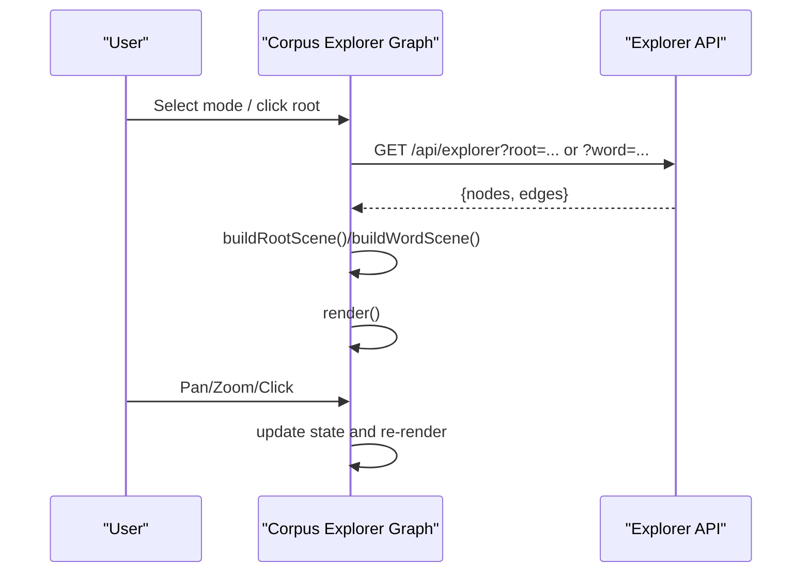
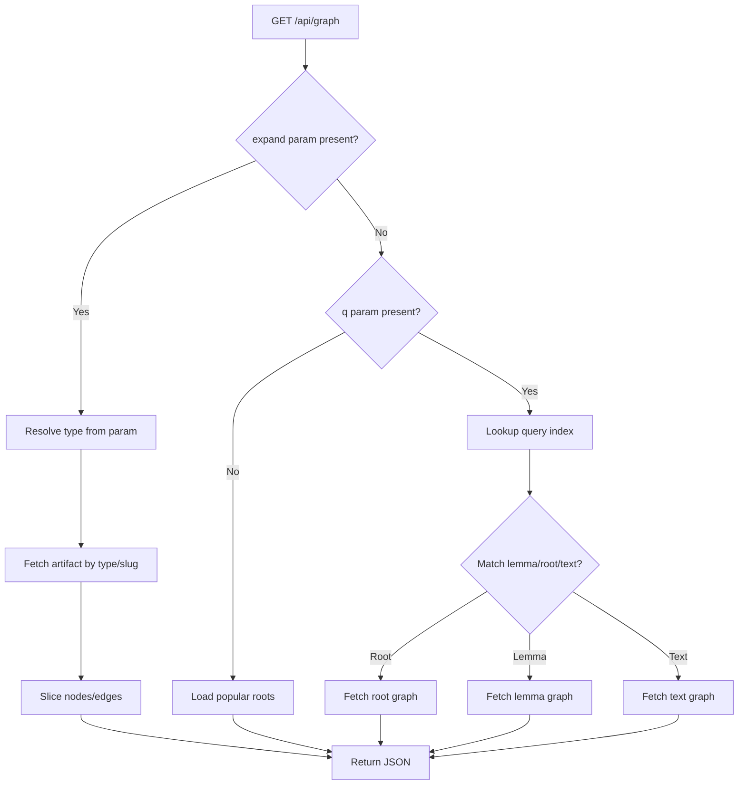

# Word Graph Component

<cite>
**Referenced Files in This Document**
- [word-graph.svelte](file://src/lib/components/word-graph.svelte)
- [+server.ts](file://src/routes/api/graph/+server.ts)
- [_graphs.sass](file://src/lib/styles/_graphs.sass)
- [concept-graph.svelte](file://src/lib/components/concept-graph.svelte)
- [corpus-explorer-graph.svelte](file://src/lib/components/corpus-explorer-graph.svelte)
- [types.ts](file://src/lib/data/types.ts)
</cite>

## Table of Contents
1. [Introduction](#introduction)
2. [Project Structure](#project-structure)
3. [Core Components](#core-components)
4. [Architecture Overview](#architecture-overview)
5. [Detailed Component Analysis](#detailed-component-analysis)
6. [Dependency Analysis](#dependency-analysis)
7. [Performance Considerations](#performance-considerations)
8. [Troubleshooting Guide](#troubleshooting-guide)
9. [Conclusion](#conclusion)
10. [Appendices](#appendices)

## Introduction
This document provides comprehensive documentation for the Word Graph component that visualizes morphological and syntactic relationships between words in Sanskrit texts. It explains the graph layout algorithms, node representation for grammatical categories, edge types showing dependency relationships, and interactive features such as node highlighting and relationship tracing. It also covers props for word data binding, graph configuration options, styling customization via CSS custom properties, event handling, example data structures, color coding systems, and performance optimization strategies for real-time text analysis visualizations.

## Project Structure
The Word Graph is implemented as a Svelte component that renders a Canvas-based force-directed graph. It communicates with a server endpoint to fetch graph data based on user queries or expansion requests. Styling is centralized under shared graph styles. Related components include a concept graph (SVG-based radial layout) and a corpus explorer graph (Canvas-based grid/radial layouts).

**Diagram sources**
- [word-graph.svelte:1-546](file://src/lib/components/word-graph.svelte#L1-L546)
- [+server.ts:1-82](file://src/routes/api/graph/+server.ts#L1-L82)
- [_graphs.sass:1-133](file://src/lib/styles/_graphs.sass#L1-L133)
- [concept-graph.svelte:1-202](file://src/lib/components/concept-graph.svelte#L1-L202)
- [corpus-explorer-graph.svelte:1-338](file://src/lib/components/corpus-explorer-graph.svelte#L1-L338)

**Section sources**
- [word-graph.svelte:1-546](file://src/lib/components/word-graph.svelte#L1-L546)
- [+server.ts:1-82](file://src/routes/api/graph/+server.ts#L1-L82)
- [_graphs.sass:1-133](file://src/lib/styles/_graphs.sass#L1-L133)

## Core Components
- Word Graph (Canvas): A force-directed graph with pan/zoom, drag-to-move nodes, click-to-select and expand, and fade-in animations. Colors are read from CSS custom properties to align with theme tokens.
- Concept Graph (SVG): A deterministic radial layout for hierarchical concepts with drag support and zoom via D3.
- Corpus Explorer Graph (Canvas): Grid and radial layouts for roots and word occurrences with pointer interactions and zoom controls.

Key responsibilities:
- Data fetching and caching via the Graph API
- Layout computation (force-directed vs. deterministic)
- Rendering loop and interaction handling
- Styling through design tokens

**Section sources**
- [word-graph.svelte:1-546](file://src/lib/components/word-graph.svelte#L1-L546)
- [concept-graph.svelte:1-202](file://src/lib/components/concept-graph.svelte#L1-L202)
- [corpus-explorer-graph.svelte:1-338](file://src/lib/components/corpus-explorer-graph.svelte#L1-L338)

## Architecture Overview
The Word Graph follows a client-server architecture where the UI component requests graph data from a server endpoint. The server resolves queries against prebuilt artifacts and returns nodes and edges. The component initializes a force-directed simulation, renders nodes and edges on a Canvas, and supports interactive exploration through selection and expansion.

**Diagram sources**
- [word-graph.svelte:74-112](file://src/lib/components/word-graph.svelte#L74-L112)
- [word-graph.svelte:114-191](file://src/lib/components/word-graph.svelte#L114-L191)
- [word-graph.svelte:365-401](file://src/lib/components/word-graph.svelte#L365-L401)
- [+server.ts:40-81](file://src/routes/api/graph/+server.ts#L40-L81)

## Detailed Component Analysis

### Word Graph Component
The Word Graph implements a Canvas-based force-directed layout with the following characteristics:
- Node representation: id, label, type ('word' | 'root' | 'text' | 'sutra'), size, optional count/verseCount, position and velocity fields, pinned state, opacity.
- Edge representation: source, target, optional label.
- Layout algorithm: Repulsion between all nodes, attraction along edges, centering force toward canvas center, damping, fixed iteration limit per frame, fade-in animation.
- Interactions: mouse down/move/up for dragging nodes and panning; click to select and expand; wheel to zoom; reset view and clear graph.
- Styling: colors resolved from CSS custom properties at mount; borders and labels use theme tokens.

Props and configuration:
- query: string used to fetch initial graph data.
- Internal configuration constants: REPULSION, ATTRACTION, CENTERING, DAMPING, MAX_ITER.
- Viewport: width, height, scale, offsetX, offsetY.

Event handling:
- handleMouseDown: initiates node drag or canvas pan.
- handleMouseMove: updates dragged node position or pans canvas; hover detection.
- handleMouseUp: releases drag and un-pins nodes.
- handleClick: selects node and triggers expansion request.
- handleWheel: adjusts zoom scale.

Data flow:
- fetchGraph: calls /api/graph?q=... and initializes layout.
- fetchExpand: calls /api/graph?expand=...&type=... and merges new nodes/edges into existing graph.

Rendering:
- Draws edges with muted color and opacity tied to node opacity.
- Draws nodes as circles sized by node.size; applies selected/hovered border effects; draws truncated labels below nodes.

Accessibility and UX:
- Loading indicator when building graph.
- Empty state with hint chips for popular queries.
- Legend showing type-color mapping and control buttons.
- Selected node panel with type label and navigation link.

**Diagram sources**
- [word-graph.svelte:114-191](file://src/lib/components/word-graph.svelte#L114-L191)
- [word-graph.svelte:194-277](file://src/lib/components/word-graph.svelte#L194-L277)
- [word-graph.svelte:280-363](file://src/lib/components/word-graph.svelte#L280-L363)
- [word-graph.svelte:365-401](file://src/lib/components/word-graph.svelte#L365-L401)

**Section sources**
- [word-graph.svelte:1-546](file://src/lib/components/word-graph.svelte#L1-L546)

### Concept Graph Component
A deterministic radial layout for hierarchical concepts:
- Types: self, ancestor, descendant, lemma.
- Layout: self at center; ancestors in a vertical chain above; descendants in an arc beneath; lemmas on an outer ring.
- Interactions: drag nodes; zoom via D3; click triggers callback.
- Styling: SVG-based with class-driven fills and strokes using design tokens.

**Diagram sources**
- [concept-graph.svelte:18-151](file://src/lib/components/concept-graph.svelte#L18-L151)

**Section sources**
- [concept-graph.svelte:1-202](file://src/lib/components/concept-graph.svelte#L1-L202)

### Corpus Explorer Graph Component
Canvas-based graph for exploring dhātus and their derived words:
- Modes: root grid and word-centered radial.
- Interactions: pointer events for pan/drag; wheel zoom; click to expand roots or navigate words/texts.
- Rendering: circle nodes sized by counts; edges drawn with muted color; status messages and controls.

**Diagram sources**
- [corpus-explorer-graph.svelte:83-129](file://src/lib/components/corpus-explorer-graph.svelte#L83-L129)
- [corpus-explorer-graph.svelte:145-183](file://src/lib/components/corpus-explorer-graph.svelte#L145-L183)

**Section sources**
- [corpus-explorer-graph.svelte:1-338](file://src/lib/components/corpus-explorer-graph.svelte#L1-L338)

### Graph API
The server endpoint resolves queries and expansions:
- Query resolution: maps input to lemma/root/text slugs using a query index; returns top popular graphs if no query provided.
- Expansion: returns additional nodes/edges for a selected node based on its type.
- Artifact retrieval: reads prebuilt JSON artifacts organized by buckets and slugs.

**Diagram sources**
- [+server.ts:40-81](file://src/routes/api/graph/+server.ts#L40-L81)

**Section sources**
- [+server.ts:1-82](file://src/routes/api/graph/+server.ts#L1-L82)

## Dependency Analysis
- Word Graph depends on:
  - Canvas rendering APIs for drawing nodes/edges.
  - CSS custom properties for theme tokens.
  - Server endpoint for data retrieval.
- Concept Graph depends on:
  - D3 libraries for selection, drag, and zoom.
  - SVG DOM for rendering.
- Corpus Explorer Graph depends on:
  - Canvas rendering APIs.
  - Server endpoint for explorer data.

Coupling and cohesion:
- Word Graph encapsulates layout, rendering, and interaction logic within a single component.
- Styling is centralized in shared SASS, promoting consistency across graph components.
- API layer abstracts artifact access, enabling reuse across components.

Potential circular dependencies:
- None observed; components call server endpoints without direct imports back to UI.

External dependencies:
- D3 for Concept Graph (selection, drag, zoom).
- Canvas/SVG for rendering.
- CSS custom properties for theming.

**Section sources**
- [word-graph.svelte:1-546](file://src/lib/components/word-graph.svelte#L1-L546)
- [concept-graph.svelte:1-202](file://src/lib/components/concept-graph.svelte#L1-L202)
- [corpus-explorer-graph.svelte:1-338](file://src/lib/components/corpus-explorer-graph.svelte#L1-L338)
- [+server.ts:1-82](file://src/routes/api/graph/+server.ts#L1-L82)
- [_graphs.sass:1-133](file://src/lib/styles/_graphs.sass#L1-L133)

## Performance Considerations
- Force-directed simulation:
  - Fixed iteration limit per frame reduces CPU load.
  - Adjacency sets improve neighbor lookup efficiency.
  - Damping stabilizes convergence quickly.
- Rendering optimizations:
  - Canvas redraw only when necessary; opacity fade-in avoids heavy recomputation.
  - Edge opacity tied to node opacity reduces overdraw.
- Interaction throttling:
  - Dragging pins nodes temporarily to avoid unnecessary re-simulation.
  - ResizeObserver ensures accurate sizing without excessive resize events.
- Data merging:
  - Existing ID set prevents duplicate nodes during expansion.
  - Edge deduplication avoids redundant connections.
- Theming:
  - Reading CSS custom properties once at mount minimizes repeated lookups.

[No sources needed since this section provides general guidance]

## Troubleshooting Guide
Common issues and resolutions:
- Graph not loading:
  - Verify network connectivity and API availability.
  - Check console errors for HTTP status codes.
- Nodes not visible:
  - Ensure canvas dimensions are non-zero after mount.
  - Confirm theme tokens resolve correctly.
- Slow performance:
  - Reduce MAX_ITER or adjust REPULSION/ATTRACTION constants.
  - Limit number of nodes returned by API.
- Incorrect expansion:
  - Validate expand parameters and node types.
  - Inspect merged nodes/edges for duplicates.

**Section sources**
- [word-graph.svelte:74-89](file://src/lib/components/word-graph.svelte#L74-L89)
- [word-graph.svelte:365-401](file://src/lib/components/word-graph.svelte#L365-L401)
- [+server.ts:40-81](file://src/routes/api/graph/+server.ts#L40-L81)

## Conclusion
The Word Graph component provides an interactive, performant visualization of Sanskrit morphological and syntactic relationships. Its force-directed layout, theme-aware styling, and robust interaction model enable effective exploration of lexical networks. Integration with prebuilt artifacts and a flexible API ensures scalability for real-time text analysis.

[No sources needed since this section summarizes without analyzing specific files]

## Appendices

### Props and Configuration
- Word Graph props:
  - query: string for initial search.
- Internal configuration:
  - REPULSION, ATTRACTION, CENTERING, DAMPING, MAX_ITER.
  - Viewport: width, height, scale, offsetX, offsetY.

**Section sources**
- [word-graph.svelte:26-49](file://src/lib/components/word-graph.svelte#L26-L49)
- [word-graph.svelte:114-127](file://src/lib/components/word-graph.svelte#L114-L127)

### Data Structures
- GraphNode: id, label, type, size, count, verseCount, x, y, vx, vy, pinned, opacity.
- GraphEdge: source, target, label.
- Concept Graph node types: self, ancestor, descendant, lemma.
- Corpus Explorer node types: root, word, text.

**Section sources**
- [word-graph.svelte:5-24](file://src/lib/components/word-graph.svelte#L5-L24)
- [concept-graph.svelte:24-35](file://src/lib/components/concept-graph.svelte#L24-L35)
- [corpus-explorer-graph.svelte:4-7](file://src/lib/components/corpus-explorer-graph.svelte#L4-L7)

### Styling Customization
- CSS custom properties:
  - --color-word, --color-root, --color-text-tag, --color-sutra, --text-muted.
  - --accent, --text-primary, --border-default, --surface-reader, etc.
- Shared styles:
  - Graph containers, legends, controls, tooltips defined in _graphs.sass.

**Section sources**
- [word-graph.svelte:437-446](file://src/lib/components/word-graph.svelte#L437-L446)
- [_graphs.sass:1-133](file://src/lib/styles/_graphs.sass#L1-L133)

### Event Handling
- Mouse events: mousedown, mousemove, mouseup, click, wheel.
- Pointer events: pointerdown, pointermove, pointerup, wheel.
- Keyboard accessibility: Enter/Space for clickable nodes in Concept Graph.

**Section sources**
- [word-graph.svelte:280-363](file://src/lib/components/word-graph.svelte#L280-L363)
- [concept-graph.svelte:178-183](file://src/lib/components/concept-graph.svelte#L178-L183)
- [corpus-explorer-graph.svelte:185-226](file://src/lib/components/corpus-explorer-graph.svelte#L185-L226)

### Example Data Structures
- Root graph construction includes nodes for roots, words, texts, and sutras with edges indicating derivational and governance relationships.
- Lemma and text graphs follow similar structures with appropriate node types and edge labels.

**Section sources**
- [types.ts:40-92](file://src/lib/data/types.ts#L40-L92)