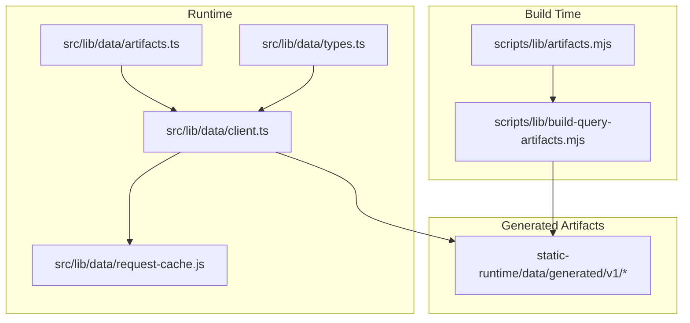
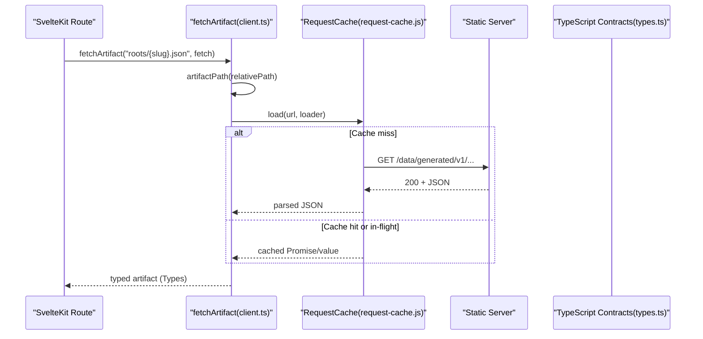
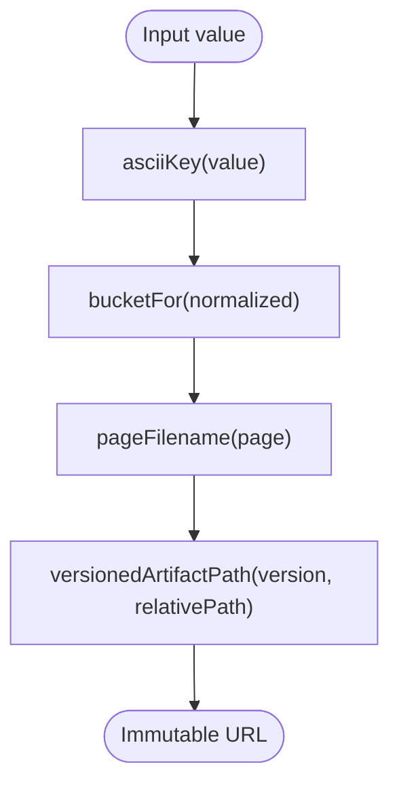
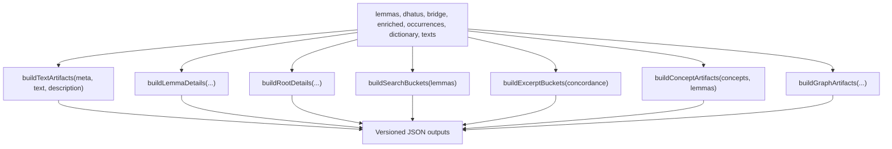
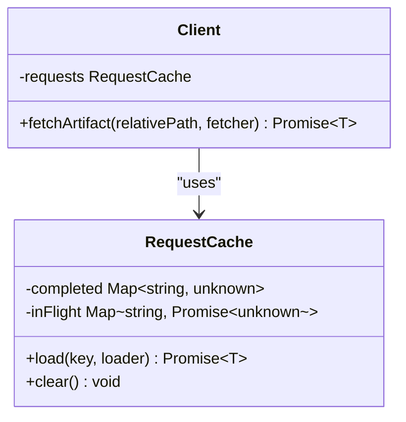
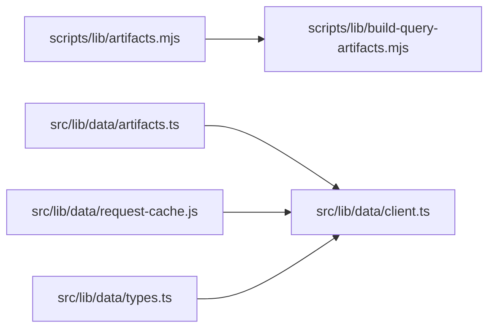

# Artifact Generation and Caching

<cite>
**Referenced Files in This Document**
- [artifacts.mjs](file://scripts/lib/artifacts.mjs)
- [build-query-artifacts.mjs](file://scripts/lib/build-query-artifacts.mjs)
- [artifact-contracts.md](file://src/routes/docs/developer/artifact-contracts.md)
- [artifacts.ts](file://src/lib/data/artifacts.ts)
- [client.ts](file://src/lib/data/client.ts)
- [request-cache.js](file://src/lib/data/request-cache.js)
- [types.ts](file://src/lib/data/types.ts)
- [artifact-cache.test.mjs](file://tests/artifact-cache.test.mjs)
- [artifacts.test.mjs](file://tests/artifacts.test.mjs)
</cite>

## Table of Contents
1. Introduction
2. Project Structure
3. Core Components
4. Architecture Overview
5. Detailed Component Analysis
6. Dependency Analysis
7. Performance Considerations
8. Troubleshooting Guide
9. Conclusion

## Introduction
This document explains FractalDharma’s versioned artifact system: how build-time scripts generate immutable, query-shaped JSON artifacts; how runtime code resolves versioned paths for cache-safe URLs; and how the client-side caching layer deduplicates requests, manages memory, and supports efficient loading patterns. It also covers the artifact contract types that ensure data integrity and type-safe access to generated files, along with performance strategies such as lazy loading, prefetching, and streaming-friendly designs. Finally, it provides troubleshooting guidance and best practices for extending the system with new data types.

## Project Structure
The artifact system spans two main areas:
- Build-time generation under scripts/lib, which produces versioned JSON artifacts into a static output directory.
- Runtime consumption under src/lib/data, which resolves versioned paths, fetches artifacts, and caches responses.



**Diagram sources**
- [artifacts.mjs:1-24](file://scripts/lib/artifacts.mjs#L1-L24)
- [build-query-artifacts.mjs:1-457](file://scripts/lib/build-query-artifacts.mjs#L1-L457)
- [artifacts.ts:1-27](file://src/lib/data/artifacts.ts#L1-L27)
- [client.ts:1-17](file://src/lib/data/client.ts#L1-L17)
- [request-cache.js:1-45](file://src/lib/data/request-cache.js#L1-L45)
- [types.ts:1-92](file://src/lib/data/types.ts#L1-L92)

**Section sources**
- [artifact-contracts.md:1-53](file://src/routes/docs/developer/artifact-contracts.md#L1-L53)

## Core Components
- Versioned path utilities:
  - Build-time: asciiKey, bucketFor, pageFilename, versionedArtifactPath.
  - Runtime: asciiKey, bucketFor, pageFilename, artifactPath (with ARTIFACT_VERSION and ARTIFACT_BASE).
- Artifact generation pipeline:
  - Text artifacts (meta, pages, references), lemma details, root details, search buckets, excerpt buckets, concept artifacts, graph artifacts.
- Client-side fetching and caching:
  - fetchArtifact resolves versioned paths and uses a request cache to deduplicate concurrent requests and avoid redundant network calls.
- Type contracts:
  - TypeScript interfaces define the shape of text metadata, pages, references, lemmas, roots, and related artifacts.

**Section sources**
- [artifacts.mjs:1-24](file://scripts/lib/artifacts.mjs#L1-L24)
- [artifacts.ts:1-27](file://src/lib/data/artifacts.ts#L1-L27)
- [build-query-artifacts.mjs:1-457](file://scripts/lib/build-query-artifacts.mjs#L1-L457)
- [client.ts:1-17](file://src/lib/data/client.ts#L1-L17)
- [request-cache.js:1-45](file://src/lib/data/request-cache.js#L1-L45)
- [types.ts:1-92](file://src/lib/data/types.ts#L1-L92)

## Architecture Overview
The artifact system follows a clear separation between build-time generation and runtime consumption:
- Build-time scripts normalize keys, bucket large datasets, paginate text content, sanitize HTML, and write versioned JSON artifacts.
- Runtime code constructs immutable URLs using the current artifact version, fetches artifacts via a shared fetcher, and caches results to prevent duplicate work.



**Diagram sources**
- [client.ts:1-17](file://src/lib/data/client.ts#L1-L17)
- [request-cache.js:1-45](file://src/lib/data/request-cache.js#L1-L45)
- [artifacts.ts:1-27](file://src/lib/data/artifacts.ts#L1-L27)
- [types.ts:1-92](file://src/lib/data/types.ts#L1-L92)

## Detailed Component Analysis

### Versioned Path Generation and Bucketing
- Build-time path helpers:
  - asciiKey normalizes Unicode diacritics and punctuation to ASCII-safe slugs.
  - bucketFor derives a two-character bucket key from normalized values.
  - pageFilename pads page numbers for lexical ordering.
  - versionedArtifactPath composes immutable URLs under a versioned base.
- Runtime path helpers mirror build-time behavior to ensure consistent URL resolution.



**Diagram sources**
- [artifacts.mjs:1-24](file://scripts/lib/artifacts.mjs#L1-L24)
- [artifacts.ts:1-27](file://src/lib/data/artifacts.ts#L1-L27)

**Section sources**
- [artifacts.mjs:1-24](file://scripts/lib/artifacts.mjs#L1-L24)
- [artifacts.ts:1-27](file://src/lib/data/artifacts.ts#L1-L27)
- [artifacts.test.mjs:1-33](file://tests/artifacts.test.mjs#L1-L33)

### Artifact Generation Pipeline
- Text artifacts:
  - buildTextArtifacts paginates verses into fixed-size pages, computes references mapping verse indices to pages, and sanitizes description HTML.
- Lemma and root details:
  - buildLemmaDetails merges dictionary entries, dhatu roots, occurrences, concordance, and concepts into bucketed detail objects.
  - buildRootDetails groups words by root categories, enriches definitions, and computes neighbor navigation.
- Search and excerpts:
  - buildSearchBuckets indexes lemmas across multiple normalized keys.
  - buildExcerptBuckets samples concordance excerpts per lemma and buckets them.
- Graph artifacts:
  - buildGraphArtifacts constructs nodes and edges for roots, lemmas, and texts, plus a query index for fast lookups.



**Diagram sources**
- [build-query-artifacts.mjs:1-457](file://scripts/lib/build-query-artifacts.mjs#L1-L457)

**Section sources**
- [build-query-artifacts.mjs:1-457](file://scripts/lib/build-query-artifacts.mjs#L1-L457)

### Client-Side Caching Layer
- Request cache:
  - Maintains completed and in-flight maps keyed by URL.
  - Deduplicates concurrent requests for the same URL.
  - Removes failed requests from in-flight so retries can succeed.
- fetchArtifact:
  - Resolves versioned paths via artifactPath.
  - Wraps network fetch with error handling and JSON parsing.
  - Returns typed artifacts based on generic T.



**Diagram sources**
- [request-cache.js:1-45](file://src/lib/data/request-cache.js#L1-L45)
- [client.ts:1-17](file://src/lib/data/client.ts#L1-L17)

**Section sources**
- [request-cache.js:1-45](file://src/lib/data/request-cache.js#L1-L45)
- [client.ts:1-17](file://src/lib/data/client.ts#L1-L17)
- [artifact-cache.test.mjs:1-37](file://tests/artifact-cache.test.mjs#L1-L37)

### Artifact Contract System
- Versioning policy:
  - ARTIFACT_VERSION is defined centrally and must be updated alongside any incompatible schema change to invalidate caches safely.
- Data shapes:
  - TextMetaArtifact, TextPageArtifact, TextReferenceArtifact define text-related artifacts.
  - LemmaRecord, DhatuRecord, LemmaDetailArtifact, RootDetailArtifact define lemma and root artifacts.
- Sanitization:
  - HTML descriptions are sanitized during build-time generation to ensure safe rendering.

```mermaid
classDiagram
class TextMetaArtifact {
+string slug
+string title
+number tokenCount
+number verseCount
+number pageCount
+number pageSize
+TextDescription description
}
class TextPageArtifact {
+string title
+string slug
+number page
+number limit
+number total
+number totalPages
+boolean hasMore
+Verse[] verses
}
class TextReferenceArtifact {
+string reference
+number index
+number page
}
class LemmaDetailArtifact {
+LemmaRecord lemma
+string[] englishDefs
+DhatuRecord|null rootInfo
+string[] textOccurrences
+Record~string, unknown|null concordance
+{conceptId : string,name : string}[] concepts
}
class RootDetailArtifact {
+DhatuRecord dhatu
+{prev : {slug : string,root_iast : string}|null,next : {slug : string,root_iast : string}|null} neighbors
+{title : string,words : {slug : string,headword : string,definitions : string[],dictionaries : string[],basis : string,textCount : number}[]} wordGroups
+DhatuRecord.sutras sutras
+number wordCount
}
```

**Diagram sources**
- [types.ts:1-92](file://src/lib/data/types.ts#L1-L92)
- [artifact-contracts.md:1-53](file://src/routes/docs/developer/artifact-contracts.md#L1-L53)

**Section sources**
- [types.ts:1-92](file://src/lib/data/types.ts#L1-L92)
- [artifact-contracts.md:1-53](file://src/routes/docs/developer/artifact-contracts.md#L1-L53)

## Dependency Analysis
- Build-time dependencies:
  - scripts/lib/artifacts.mjs provides asciiKey and bucketFor used by build-query-artifacts.mjs.
- Runtime dependencies:
  - src/lib/data/client.ts depends on src/lib/data/artifacts.ts for path resolution and on src/lib/data/request-cache.js for caching.
  - src/lib/data/types.ts defines contracts consumed by routes and components when consuming artifacts.



**Diagram sources**
- [artifacts.mjs:1-24](file://scripts/lib/artifacts.mjs#L1-L24)
- [build-query-artifacts.mjs:1-457](file://scripts/lib/build-query-artifacts.mjs#L1-L457)
- [artifacts.ts:1-27](file://src/lib/data/artifacts.ts#L1-L27)
- [client.ts:1-17](file://src/lib/data/client.ts#L1-L17)
- [request-cache.js:1-45](file://src/lib/data/request-cache.js#L1-L45)
- [types.ts:1-92](file://src/lib/data/types.ts#L1-L92)

**Section sources**
- [artifact-contracts.md:1-53](file://src/routes/docs/developer/artifact-contracts.md#L1-L53)

## Performance Considerations
- Lazy loading:
  - Use fetchArtifact only where needed (e.g., route loaders or component interactions) to avoid upfront cost.
- Prefetching strategies:
  - Preload likely artifacts at idle time or on user intent (e.g., hover or scroll proximity) to reduce perceived latency.
- Memory-efficient streaming:
  - For very large datasets, prefer chunked or paginated artifacts (as implemented for text pages) and process streams incrementally if possible.
- Cache effectiveness:
  - The request cache ensures concurrent requests share a single fetch and prevents redundant work.
- Versioned URLs:
  - Immutable versioned paths enable long-lived browser and CDN caching while allowing invalidation through version bumps.

[No sources needed since this section provides general guidance]

## Troubleshooting Guide
Common issues and resolutions:
- Cache not invalidated after updates:
  - Ensure ARTIFACT_VERSION is incremented whenever the JSON schema changes. Clients rely on versioned URLs to bust caches.
- Concurrent request spikes causing repeated fetches:
  - Verify usage of fetchArtifact and the shared request cache. The cache deduplicates in-flight requests and returns the same promise to all callers.
- Failed requests blocking retries:
  - The cache removes failed requests from in-flight storage, enabling subsequent retries to succeed. Confirm error handling in your loader.
- Incorrect artifact paths:
  - Double-check relativePath formatting and ensure it matches the generated structure under static-runtime/data/generated/v1.
- Type mismatches:
  - Align TypeScript interfaces in types.ts with the actual artifact shapes produced by build-query-artifacts.mjs.

**Section sources**
- [artifact-contracts.md:1-53](file://src/routes/docs/developer/artifact-contracts.md#L1-L53)
- [request-cache.js:1-45](file://src/lib/data/request-cache.js#L1-L45)
- [client.ts:1-17](file://src/lib/data/client.ts#L1-L17)
- [artifact-cache.test.mjs:1-37](file://tests/artifact-cache.test.mjs#L1-L37)

## Conclusion
FractalDharma’s artifact system combines deterministic build-time generation with robust runtime consumption. Versioned paths guarantee cache safety, while the client-side request cache eliminates redundant network activity and improves responsiveness. Strong TypeScript contracts enforce data integrity, and the design supports scalable, memory-efficient workflows through pagination and bucketing. By following the guidelines here—especially around versioning, lazy loading, and prefetching—you can extend the system confidently with new data types while maintaining performance and reliability.