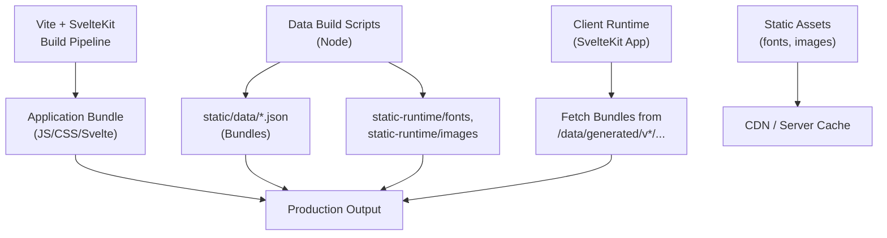
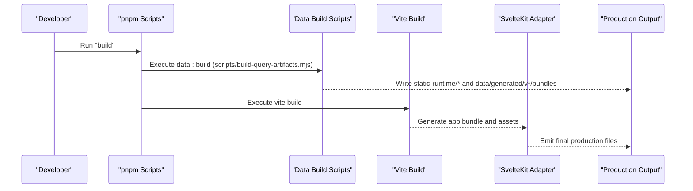
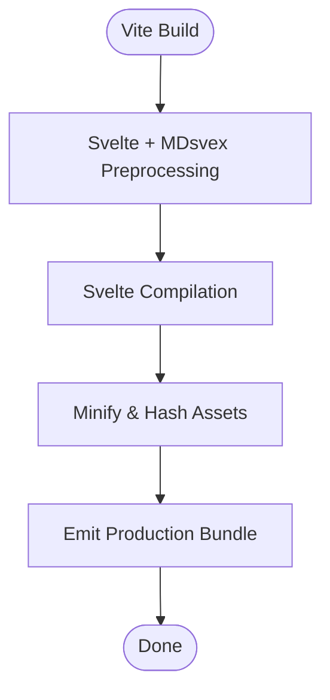
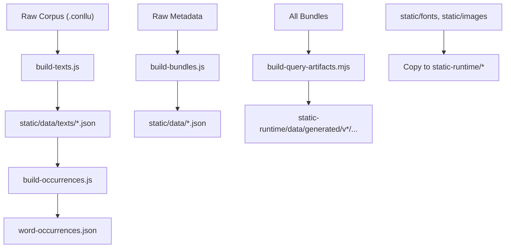
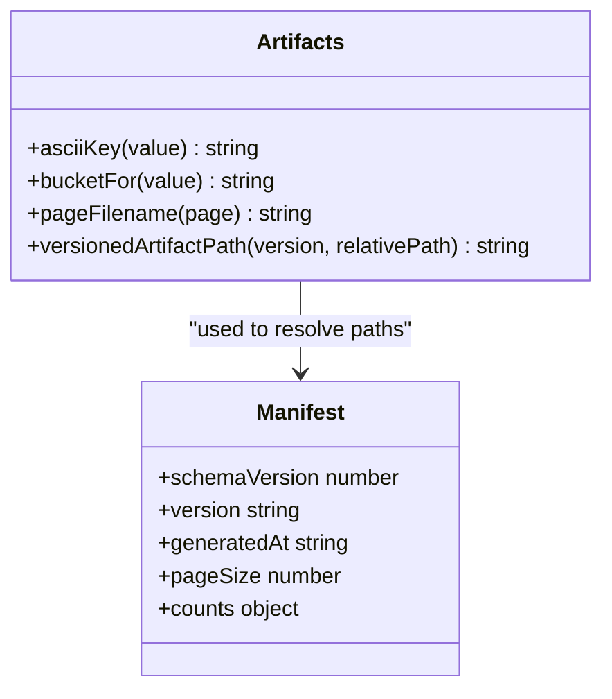
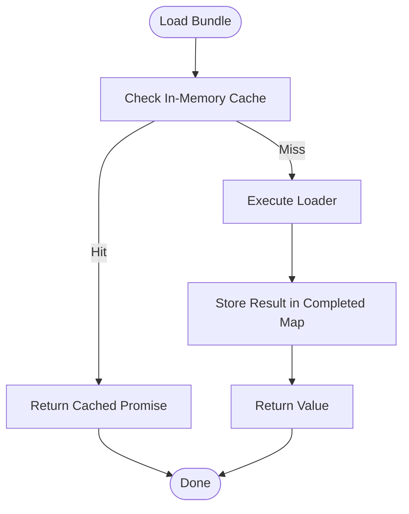
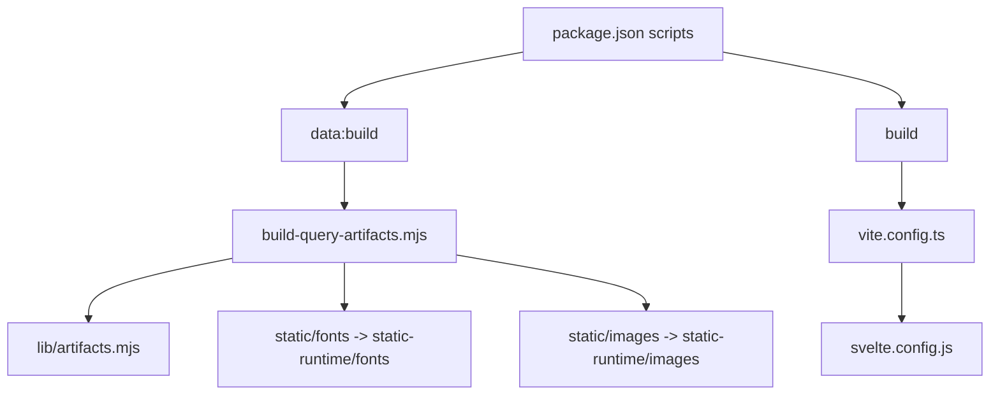

# Asset Bundling and Optimization

<cite>
**Referenced Files in This Document**
- [vite.config.ts](file://vite.config.ts)
- [svelte.config.js](file://svelte.config.js)
- [package.json](file://package.json)
- [scripts/build-bundles.js](file://scripts/build-bundles.js)
- [scripts/build-query-artifacts.mjs](file://scripts/build-query-artifacts.mjs)
- [scripts/lib/artifacts.mjs](file://scripts/lib/artifacts.mjs)
- [scripts/build-texts.js](file://scripts/build-texts.js)
- [scripts/build-occurrences.js](file://scripts/build-occurrences.js)
- [src/lib/data/request-cache.js](file://src/lib/data/request-cache.js)
</cite>

## Table of Contents
1. Introduction
2. Project Structure
3. Core Components
4. Architecture Overview
5. Detailed Component Analysis
6. Dependency Analysis
7. Performance Considerations
8. Troubleshooting Guide
9. Conclusion

## Introduction
This document explains the asset bundling and optimization pipeline for the project, covering how static assets (fonts, images), generated data bundles, and application code are processed, compressed, and organized for production deployment. It details the integration with Vite and SvelteKit, the build scripts that generate and version data artifacts, cache-busting strategies, and performance optimizations. Configuration options, custom processing hooks, and common troubleshooting steps are included to help developers understand and extend the pipeline.

## Project Structure
The project uses a hybrid approach:
- Application assets and code are built by Vite via SvelteKit.
- Static content (fonts, images) is copied into a runtime directory during the data build phase.
- Large datasets are transformed into optimized JSON bundles and placed under a versioned path for efficient client loading and caching.

Key directories:
- static: Source assets served directly by the app (fonts, images, initial data).
- static-runtime: Runtime output directory used by the adapter; fonts/images are mirrored here during build.
- scripts: Build scripts that transform raw data into optimized bundles consumed at runtime.
- src: SvelteKit application source, including stores and utilities for runtime data loading and caching.

**Diagram sources**
- [vite.config.ts:1-7](file://vite.config.ts#L1-L7)
- [svelte.config.js:1-29](file://svelte.config.js#L1-L29)
- [scripts/build-query-artifacts.mjs:80-96](file://scripts/build-query-artifacts.mjs#L80-L96)
- [scripts/build-query-artifacts.mjs:182-194](file://scripts/build-query-artifacts.mjs#L182-L194)

**Section sources**
- [vite.config.ts:1-7](file://vite.config.ts#L1-L7)
- [svelte.config.js:1-29](file://svelte.config.js#L1-L29)
- [package.json:8-18](file://package.json#L8-L18)

## Core Components
- Vite configuration: Minimal setup using SvelteKit plugin; default compression and hashing are provided by Vite’s build system.
- SvelteKit configuration: Defines preprocessing (Svelte, MDsvex), compiler options, and sets the assets directory to static-runtime for the adapter.
- Data build scripts: Transform raw corpora into optimized JSON bundles and organize them under a versioned path for cache busting.
- Client-side caching: In-memory request deduplication and IndexedDB-based bundle persistence with versioned database names to avoid stale caches.

**Section sources**
- [vite.config.ts:1-7](file://vite.config.ts#L1-L7)
- [svelte.config.js:1-29](file://svelte.config.js#L1-L29)
- [scripts/build-bundles.js:1-201](file://scripts/build-bundles.js#L1-L201)
- [scripts/build-query-artifacts.mjs:1-207](file://scripts/build-query-artifacts.mjs#L1-L207)
- [scripts/lib/artifacts.mjs:1-24](file://scripts/lib/artifacts.mjs#L1-L24)
- [src/lib/data/request-cache.js:1-44](file://src/lib/data/request-cache.js#L1-L44)

## Architecture Overview
The pipeline consists of two main phases:
1. Data generation phase: Node scripts process raw text and metadata into optimized JSON bundles and copy public assets into static-runtime.
2. Application build phase: Vite builds the SvelteKit app, compresses assets, and emits hashed filenames for cache busting.

**Diagram sources**
- [package.json:8-18](file://package.json#L8-L18)
- [scripts/build-query-artifacts.mjs:80-96](file://scripts/build-query-artifacts.mjs#L80-L96)
- [scripts/build-query-artifacts.mjs:182-194](file://scripts/build-query-artifacts.mjs#L182-L194)
- [vite.config.ts:1-7](file://vite.config.ts#L1-L7)
- [svelte.config.js:18-25](file://svelte.config.js#L18-L25)

## Detailed Component Analysis

### Vite and SvelteKit Integration
- Vite config uses the SvelteKit plugin; no custom plugins are added, relying on Vite defaults for minification, hashing, and asset handling.
- SvelteKit config sets preprocessors (vitePreprocess, mdsvex), enables runes for non-node_modules files, and defines the assets directory as static-runtime for the adapter.
- The adapter targets Node.js runtime, ensuring server-side rendering and static file serving align with the generated outputs.

**Diagram sources**
- [vite.config.ts:1-7](file://vite.config.ts#L1-L7)
- [svelte.config.js:7-17](file://svelte.config.js#L7-L17)
- [svelte.config.js:18-25](file://svelte.config.js#L18-L25)

**Section sources**
- [vite.config.ts:1-7](file://vite.config.ts#L1-L7)
- [svelte.config.js:1-29](file://svelte.config.js#L1-L29)

### Data Generation Pipeline
- build-texts.js: Scans raw corpus directories, parses .conllu files, converts IAST to Devanagari, and writes per-text JSON bundles plus a texts.json index.
- build-bundles.js: Enriches lemmas, dhatus, sutras, dictionary entries, and bridges into optimized JSON bundles written to static/data.
- build-occurrences.js: Builds a lemma-to-text mapping for fast lookups.
- build-query-artifacts.mjs: Orchestrates artifact creation, copies public assets (fonts, images) into static-runtime, and writes versioned bundles under static-runtime/data/generated/v*.

**Diagram sources**
- [scripts/build-texts.js:1-191](file://scripts/build-texts.js#L1-L191)
- [scripts/build-bundles.js:1-201](file://scripts/build-bundles.js#L1-L201)
- [scripts/build-occurrences.js:1-48](file://scripts/build-occurrences.js#L1-L48)
- [scripts/build-query-artifacts.mjs:80-96](file://scripts/build-query-artifacts.mjs#L80-L96)
- [scripts/build-query-artifacts.mjs:182-194](file://scripts/build-query-artifacts.mjs#L182-L194)

**Section sources**
- [scripts/build-texts.js:1-191](file://scripts/build-texts.js#L1-L191)
- [scripts/build-bundles.js:1-201](file://scripts/build-bundles.js#L1-L201)
- [scripts/build-occurrences.js:1-48](file://scripts/build-occurrences.js#L1-L48)
- [scripts/build-query-artifacts.mjs:1-207](file://scripts/build-query-artifacts.mjs#L1-L207)

### Versioning and Cache-Busting
- Versioned artifacts: build-query-artifacts.mjs writes bundles under a versioned directory (e.g., v1) and generates a manifest.json describing schemaVersion, version, and counts.
- Path utility: scripts/lib/artifacts.mjs provides versionedArtifactPath to construct URLs like /data/generated/{version}/{relativePath}.
- Client cache strategy: The bundles store persists to IndexedDB with a versioned database name; bumping the version forces clients to refresh cached data when schema changes.

**Diagram sources**
- [scripts/lib/artifacts.mjs:1-24](file://scripts/lib/artifacts.mjs#L1-L24)
- [scripts/build-query-artifacts.mjs:182-194](file://scripts/build-query-artifacts.mjs#L182-L194)

**Section sources**
- [scripts/lib/artifacts.mjs:1-24](file://scripts/lib/artifacts.mjs#L1-L24)
- [scripts/build-query-artifacts.mjs:182-194](file://scripts/build-query-artifacts.mjs#L182-L194)

### Client-Side Caching and Request Deduplication
- In-memory request cache: createRequestCache ensures concurrent requests for the same key are deduplicated and results are memoized until cleared.
- IndexedDB bundle cache: The bundles store uses a versioned database name; changing the version invalidates old caches and triggers refetch on next load.

**Diagram sources**
- [src/lib/data/request-cache.js:1-44](file://src/lib/data/request-cache.js#L1-L44)

**Section sources**
- [src/lib/data/request-cache.js:1-44](file://src/lib/data/request-cache.js#L1-L44)

## Dependency Analysis
- package.json scripts orchestrate the pipeline: data:build runs the query artifacts generator; build runs data:build then vite build.
- svelte.config.js integrates preprocessing and sets the assets directory for the adapter.
- vite.config.ts delegates most behavior to SvelteKit plugin; additional optimization can be configured here if needed.
- Data scripts depend on Node fs/path modules and external libraries (e.g., sanscript) for transliteration and normalization.

**Diagram sources**
- [package.json:8-18](file://package.json#L8-L18)
- [vite.config.ts:1-7](file://vite.config.ts#L1-L7)
- [svelte.config.js:18-25](file://svelte.config.js#L18-L25)
- [scripts/build-query-artifacts.mjs:80-96](file://scripts/build-query-artifacts.mjs#L80-L96)
- [scripts/lib/artifacts.mjs:1-24](file://scripts/lib/artifacts.mjs#L1-L24)

**Section sources**
- [package.json:8-18](file://package.json#L8-L18)
- [vite.config.ts:1-7](file://vite.config.ts#L1-L7)
- [svelte.config.js:18-25](file://svelte.config.js#L18-L25)
- [scripts/build-query-artifacts.mjs:80-96](file://scripts/build-query-artifacts.mjs#L80-L96)

## Performance Considerations
- Compression and hashing: Vite automatically minifies JS/CSS and hashes filenames for long-term caching. Ensure production builds use Vite’s default settings or add plugins for advanced optimization if needed.
- Data bundle size: Split large datasets into buckets and pages (as implemented in build-query-artifacts.mjs) to reduce payload sizes and improve load times.
- Asset copying: Public assets are copied once during data build; ensure only necessary fonts and images are included to minimize static-runtime size.
- Client caching: Use versioned IndexedDB names to invalidate stale caches when schemas change; leverage in-memory request deduplication to avoid redundant network calls.
- CDN and HTTP caching: Serve static-runtime assets through a CDN with appropriate cache headers to maximize reuse across deployments.

[No sources needed since this section provides general guidance]

## Troubleshooting Guide
- Stale IndexedDB cache causing incorrect slugs:
  - Symptom: Sidebar renders diacritic URLs even after fixes; API returns 404 for those URLs.
  - Cause: Bundles store persisted old slug values in IndexedDB with an outdated database name.
  - Fix: Bump the IndexedDB database name to force clients to fetch fresh data; verify new cache is created and old one remains orphaned.
- Missing inputs for data build:
  - Symptom: Build fails due to missing required input files.
  - Cause: Required JSON files not present in static/data.
  - Fix: Ensure all expected inputs exist before running data:build.
- Fonts/images not appearing:
  - Symptom: Assets missing at runtime.
  - Cause: Copy step did not run or destination path mismatch.
  - Fix: Verify static-runtime/fonts and static-runtime/images are populated by the data build script.

**Section sources**
- [scripts/build-query-artifacts.mjs:66-79](file://scripts/build-query-artifacts.mjs#L66-L79)
- [scripts/build-query-artifacts.mjs:80-96](file://scripts/build-query-artifacts.mjs#L80-L96)
- [docs/2026-06-15-code-fixing-auditing-v11.md:1-24](file://docs/2026-06-15-code-fixing-auditing-v11.md#L1-L24)

## Conclusion
The pipeline combines Vite’s robust build system with Node-based data transformation scripts to produce optimized, versioned assets and bundles. By organizing static resources under static-runtime and generating versioned data artifacts, the system achieves effective cache busting and performance. Developers can extend the pipeline by adding Vite plugins, refining data transformations, or enhancing client-side caching strategies. Proper configuration and adherence to the documented workflows ensure reliable production deployments.

[No sources needed since this section summarizes without analyzing specific files]