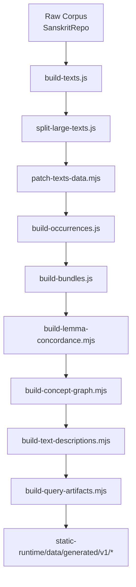
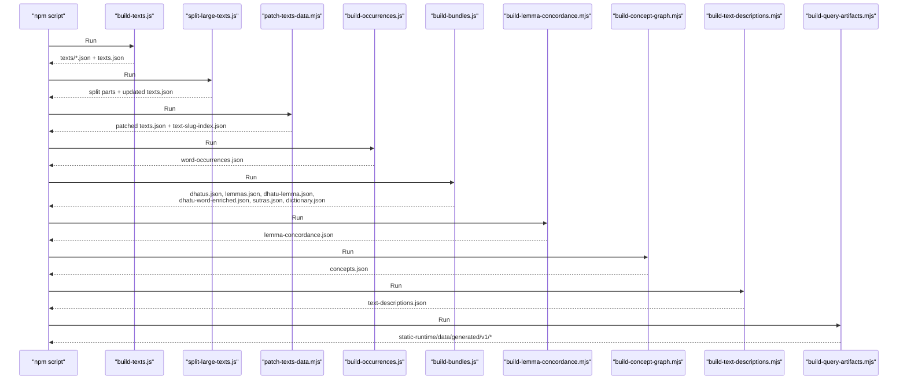
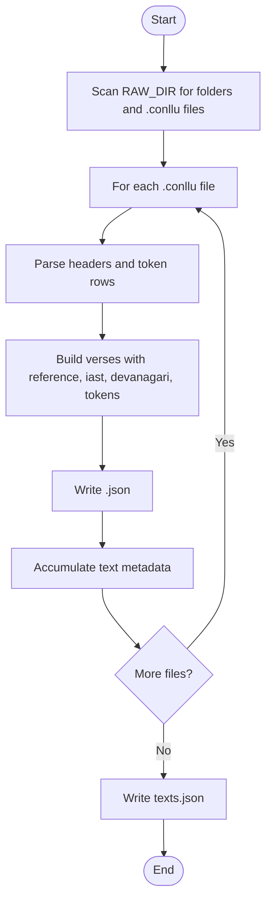
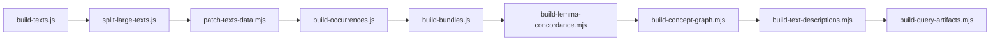

# Build Pipeline and Data Processing

<cite>
**Referenced Files in This Document**
- [package.json](file://package.json)
- [scripts/build-texts.js](file://scripts/build-texts.js)
- [scripts/split-large-texts.js](file://scripts/split-large-texts.js)
- [scripts/patch-texts-data.mjs](file://scripts/patch-texts-data.mjs)
- [scripts/build-occurrences.js](file://scripts/build-occurrences.js)
- [scripts/build-bundles.js](file://scripts/build-bundles.js)
- [scripts/build-lemma-concordance.mjs](file://scripts/build-lemma-concordance.mjs)
- [scripts/build-concept-graph.mjs](file://scripts/build-concept-graph.mjs)
- [scripts/build-text-descriptions.mjs](file://scripts/build-text-descriptions.mjs)
- [scripts/build-query-artifacts.mjs](file://scripts/build-query-artifacts.mjs)
- [scripts/lib/artifacts.mjs](file://scripts/lib/artifacts.mjs)
- [scripts/lib/build-query-artifacts.mjs](file://scripts/lib/build-query-artifacts.mjs)
- [scripts/lib/notable-lemmas.mjs](file://scripts/lib/notable-lemmas.mjs)
</cite>

## Table of Contents
1. [Introduction](#introduction)
2. [Project Structure](#project-structure)
3. [Core Components](#core-components)
4. [Architecture Overview](#architecture-overview)
5. [Detailed Component Analysis](#detailed-component-analysis)
6. [Dependency Analysis](#dependency-analysis)
7. [Performance Considerations](#performance-considerations)
8. [Troubleshooting Guide](#troubleshooting-guide)
9. [Conclusion](#conclusion)

## Introduction
This document describes FractalDharma’s build pipeline that transforms raw corpus data into optimized, runtime-ready artifacts for the reader, explorer, search, and graph features. The pipeline is orchestrated by npm scripts and consists of multiple Node.js build steps: parsing raw texts, generating occurrence indices, building lexical bundles, constructing semantic concept graphs, preparing text descriptions, and finally assembling versioned query artifacts consumed at runtime.

The end-to-end flow ensures:
- Deterministic artifact generation from external source repositories
- Stable slug normalization and pagination for large corpora
- Rich enrichment across lemmas, roots (dhatus), dictionaries, and concepts
- Efficient, bucketed indexes for fast client-side lookups and search

## Project Structure
At a high level, the build system lives under scripts/, with static outputs written to static/data/ and versioned runtime artifacts generated under static-runtime/data/generated/v1/. The package.json defines two key commands:
- data:build runs only the final assembly step
- data:rebuild executes the full pipeline from raw corpus ingestion through all intermediate transformations to final artifacts

**Diagram sources**
- [package.json:8-17](file://package.json#L8-L17)
- [scripts/build-texts.js:1-191](file://scripts/build-texts.js#L1-L191)
- [scripts/split-large-texts.js:1-56](file://scripts/split-large-texts.js#L1-L56)
- [scripts/patch-texts-data.mjs:1-106](file://scripts/patch-texts-data.mjs#L1-L106)
- [scripts/build-occurrences.js:1-48](file://scripts/build-occurrences.js#L1-L48)
- [scripts/build-bundles.js:1-201](file://scripts/build-bundles.js#L1-L201)
- [scripts/build-lemma-concordance.mjs:1-271](file://scripts/build-lemma-concordance.mjs#L1-L271)
- [scripts/build-concept-graph.mjs:1-188](file://scripts/build-concept-graph.mjs#L1-L188)
- [scripts/build-text-descriptions.mjs:1-281](file://scripts/build-text-descriptions.mjs#L1-L281)
- [scripts/build-query-artifacts.mjs:1-207](file://scripts/build-query-artifacts.mjs#L1-L207)

**Section sources**
- [package.json:8-17](file://package.json#L8-L17)

## Core Components
- Text ingestion and pagination: parse .conllu files, convert IAST to Devanagari, produce per-text JSON and metadata
- Occurrence indexing: map lemma → set of text slugs where it appears
- Lexical bundles: enrich dhatus, lemmas, sutras, dictionary entries, and bridges between words and roots
- Semantic graph: parse concept wiki to build supersenses, synsets, and reverse indices
- Text descriptions: extract frontmatter and tables, sanitize HTML, and index notable lemmas
- Query artifacts: assemble paginated pages, search buckets, lemma/root/concept details, excerpts, and graph indexes

**Section sources**
- [scripts/build-texts.js:1-191](file://scripts/build-texts.js#L1-L191)
- [scripts/build-occurrences.js:1-48](file://scripts/build-occurrences.js#L1-L48)
- [scripts/build-bundles.js:1-201](file://scripts/build-bundles.js#L1-L201)
- [scripts/build-concept-graph.mjs:1-188](file://scripts/build-concept-graph.mjs#L1-L188)
- [scripts/build-text-descriptions.mjs:1-281](file://scripts/build-text-descriptions.mjs#L1-L281)
- [scripts/build-query-artifacts.mjs:1-207](file://scripts/build-query-artifacts.mjs#L1-L207)

## Architecture Overview
The pipeline is linear with clear input/output contracts. Each stage reads from static/data/ or configured external directories and writes normalized artifacts consumed by subsequent stages and the runtime.

**Diagram sources**
- [package.json:8-17](file://package.json#L8-L17)
- [scripts/build-texts.js:1-191](file://scripts/build-texts.js#L1-L191)
- [scripts/split-large-texts.js:1-56](file://scripts/split-large-texts.js#L1-L56)
- [scripts/patch-texts-data.mjs:1-106](file://scripts/patch-texts-data.mjs#L1-L106)
- [scripts/build-occurrences.js:1-48](file://scripts/build-occurrences.js#L1-L48)
- [scripts/build-bundles.js:1-201](file://scripts/build-bundles.js#L1-L201)
- [scripts/build-lemma-concordance.mjs:1-271](file://scripts/build-lemma-concordance.mjs#L1-L271)
- [scripts/build-concept-graph.mjs:1-188](file://scripts/build-concept-graph.mjs#L1-L188)
- [scripts/build-text-descriptions.mjs:1-281](file://scripts/build-text-descriptions.mjs#L1-L281)
- [scripts/build-query-artifacts.mjs:1-207](file://scripts/build-query-artifacts.mjs#L1-L207)

## Detailed Component Analysis

### Text Parsing and Pagination (build-texts.js)
Purpose:
- Scan raw .conllu files from an external Sanskrit repository
- Parse sentences, tokens, and references; convert IAST to Devanagari
- Emit one JSON per text with verses and tokens, plus a global texts.json metadata file

Input:
- External directory via environment variable or fallback path
- .conllu files organized by corpus folders

Processing:
- Recursive discovery and sorting of .conllu files
- Line-by-line parsing of headers and token columns
- Reference computation combining chapter, counter, subcounter, and sequence
- Transliteration conversion using sanscript

Output:
- Per-text JSON under static/data/texts/<slug>.json
- Global static/data/texts.json with slug, title, token_count, verse_count

Error handling:
- Skips non-.conllu files and malformed lines
- Graceful transliteration fallback returns empty string on errors

Performance:
- Single-pass parsing per file
- In-memory aggregation before write

**Diagram sources**
- [scripts/build-texts.js:25-129](file://scripts/build-texts.js#L25-L129)
- [scripts/build-texts.js:141-188](file://scripts/build-texts.js#L141-L188)

**Section sources**
- [scripts/build-texts.js:1-191](file://scripts/build-texts.js#L1-L191)

### Large Text Splitting (split-large-texts.js)
Purpose:
- Split oversized texts (e.g., Mahābhārata) into multiple parts to keep files within size limits
- Update texts.json metadata to reflect part slugs and titles

Input:
- static/data/texts/<slug>.json
- static/data/texts.json

Processing:
- Slice verses into equal parts
- Generate part slugs and filenames
- Remove original file and update metadata

Output:
- Part JSON files (e.g., Mahabharata-part-1.json)
- Updated texts.json with part entries

**Section sources**
- [scripts/split-large-texts.js:1-56](file://scripts/split-large-texts.js#L1-L56)

### Text Metadata Patching (patch-texts-data.mjs)
Purpose:
- Normalize filenames and ensure texts.json contains a file field mapping slug to actual filename
- Create a separate text-slug-index.json for quick slug→filename lookup

Input:
- static/data/texts/*.json
- static/data/texts.json

Processing:
- Derive slugs from filenames and match against existing entries
- Handle case-sensitive filesystem differences
- Write slug index

Output:
- Patched texts.json with file fields
- static/data/text-slug-index.json

**Section sources**
- [scripts/patch-texts-data.mjs:1-106](file://scripts/patch-texts-data.mjs#L1-L106)

### Lemma Frequency Index (build-occurrences.js)
Purpose:
- Build a mapping from lemma to the set of text slugs where it occurs
- Used later for search, graph edges, and root detail statistics

Input:
- static/data/texts/*.json

Processing:
- Iterate verses and tokens
- Aggregate unique text slugs per lemma using Sets

Output:
- static/data/word-occurrences.json

Complexity:
- O(total tokens) time; memory proportional to unique lemmas × average occurrences

**Section sources**
- [scripts/build-occurrences.js:1-48](file://scripts/build-occurrences.js#L1-L48)

### Lexical Bundles (build-bundles.js)
Purpose:
- Enrich and bundle core lexical resources: dhatus, lemmas, sutras, dictionary entries, and bridges between words and roots

Inputs:
- Raw JSON datasets from external helpers directory (dhatus, dhatus-complete, db-ashtadhyayi, dhatu-word-links, word-index, dictionary-entries)

Processing:
- Normalize Devanagari keys and match enriched records
- Resolve sutra IDs to full records
- Count lemma-dhatu associations
- Produce multiple bundles: dhatus, lemmas, dhatu-lemma, dhatu-word-enriched, sutras, dictionary

Outputs:
- static/data/dhatus.json
- static/data/lemmas.json
- static/data/dhatu-lemma.json
- static/data/dhatu-word-enriched.json
- static/data/sutras.json
- static/data/dictionary.json

Error handling:
- Warns and skips missing inputs
- Truncates long strings to bound payload sizes

**Section sources**
- [scripts/build-bundles.js:1-201](file://scripts/build-bundles.js#L1-L201)

### Concept Graph (build-concept-graph.mjs)
Purpose:
- Parse WordNet-based concept wiki to construct supersenses, synsets, and reverse indices linking lemmas to concepts

Inputs:
- External wiki directory (00-concepts with INDEX.md, N.md, synsets/N.md)
- static/data/lemma-concordance.json

Processing:
- Minimal YAML frontmatter parser
- Extract IS-A chains, hyponyms, WordNet IDs
- Build reverse indices: conceptId → lemmas, lemma → concepts

Outputs:
- static/data/concepts.json with sup, syn, cl, co structures

**Section sources**
- [scripts/build-concept-graph.mjs:1-188](file://scripts/build-concept-graph.mjs#L1-L188)

### Text Descriptions (build-text-descriptions.mjs)
Purpose:
- Extract structured metadata and prose from text markdown files
- Sanitize HTML and surface related texts and notable lemmas

Inputs:
- External wiki directory (top-level .md files excluding 00-* and INDEX.md)
- static/data/text-slug-map.json

Processing:
- Parse frontmatter and markdown tables
- Convert body to safe HTML while stripping sensitive sections
- Filter function words from notable lemmas using a curated list

Outputs:
- static/data/text-descriptions.json keyed by new ASCII slug

**Section sources**
- [scripts/build-text-descriptions.mjs:1-281](file://scripts/build-text-descriptions.mjs#L1-L281)
- [scripts/lib/notable-lemmas.mjs:1-14](file://scripts/lib/notable-lemmas.mjs#L1-L14)

### Query Artifacts Assembly (build-query-artifacts.mjs)
Purpose:
- Assemble versioned, runtime-ready artifacts consumed by the application’s routes and APIs
- Generate paginated text pages, search buckets, lemma/root/concept details, excerpts, and graph indexes

Inputs:
- All intermediate artifacts in static/data/ (texts.json, text-descriptions.json, lemmas.json, dictionary.json, dhatus.json, dhatu-lemma.json, dhatu-word-enriched.json, word-occurrences.json, lemma-concordance.json, concepts.json, sutras.json, and texts directory)

Processing:
- Validate required inputs
- Sync public assets (fonts, images) to runtime directory
- Build text artifacts with pagination and references
- Bucket search terms and lemma details
- Build root details grouped by morphological categories
- Build concept artifacts with ISA chains and children
- Build excerpt buckets limited per lemma
- Build graph artifacts for roots, lemmas, and texts with query index

Outputs:
- Versioned artifacts under static-runtime/data/generated/v1/:
  - texts/{slug}/meta.json, references.json, pages/*.json
  - search/*.json
  - lemmas/*.json
  - roots/*.json and roots/index.json
  - concepts/index.json and concepts/{id}.json
  - sutras/*.json
  - excerpts/*.json
  - graph/roots/*.json, graph/lemmas/*.json, graph/texts/*.json, graph/query-index.json
  - manifest.json

Runtime contract:
- Page size fixed at 20
- Buckets keyed by first two ASCII characters of normalized keys
- Slug resolution handles diacritic variations safely

**Section sources**
- [scripts/build-query-artifacts.mjs:1-207](file://scripts/build-query-artifacts.mjs#L1-L207)
- [scripts/lib/build-query-artifacts.mjs:1-457](file://scripts/lib/build-query-artifacts.mjs#L1-L457)
- [scripts/lib/artifacts.mjs:1-24](file://scripts/lib/artifacts.mjs#L1-L24)

## Dependency Analysis
The pipeline has strict sequential dependencies enforced by the data:rebuild script. Intermediate artifacts must exist before downstream stages run.

**Diagram sources**
- [package.json:8-17](file://package.json#L8-L17)

Key coupling points:
- build-query-artifacts.mjs asserts presence of all intermediate artifacts and fails early if any are missing
- build-concept-graph.mjs depends on lemma-concordance.json
- build-text-descriptions.mjs uses text-slug-map.json for slug normalization

Potential circular dependencies:
- None detected; the pipeline is strictly layered

External dependencies:
- sanscript for transliteration
- Filesystem access for reading/writing JSON and Markdown

**Section sources**
- [package.json:8-17](file://package.json#L8-L17)
- [scripts/build-query-artifacts.mjs:66-79](file://scripts/build-query-artifacts.mjs#L66-L79)
- [scripts/build-concept-graph.mjs:29-31](file://scripts/build-concept-graph.mjs#L29-L31)
- [scripts/build-text-descriptions.mjs:22-24](file://scripts/build-text-descriptions.mjs#L22-L24)

## Performance Considerations
- Memory usage:
  - build-texts.js aggregates all verses per corpus folder before writing; consider streaming for very large corpora
  - build-occurrences.js uses Sets per lemma; memory scales with unique lemmas and their occurrence sets
- I/O patterns:
  - Sequential reads dominate; avoid unnecessary re-parsing by caching intermediate results when possible
- Payload sizing:
  - build-bundles.js truncates long strings to reduce artifact size
  - build-query-artifacts.mjs limits excerpts and graph nodes per entity
- Parallelization:
  - Current pipeline is sequential; independent stages could be parallelized with careful ordering (e.g., build-bundles.js and build-lemma-concordance.mjs do not depend on each other)
- Disk space:
  - Ensure sufficient space for static-runtime/data/generated/v1/ during rebuild

[No sources needed since this section provides general guidance]

## Troubleshooting Guide
Common issues and resolutions:
- Missing input artifacts:
  - build-query-artifacts.mjs throws an error if required inputs are absent; ensure earlier stages ran successfully
- Environment variables:
  - FRACTALDHARMA_RAW_DIR and FRACTALDHARMA_WIKI_DIR control source paths; verify they point to valid directories
- Case sensitivity:
  - patch-texts-data.mjs handles canonical filenames for cross-platform consistency; confirm casing matches expected values
- Large text splits:
  - If split files are missing, rerun split-large-texts.js after ensuring originals exist
- Transliteration failures:
  - build-texts.js falls back to empty strings on sanscript errors; check input IAST validity

**Section sources**
- [scripts/build-query-artifacts.mjs:56-64](file://scripts/build-query-artifacts.mjs#L56-L64)
- [scripts/build-texts.js:131-137](file://scripts/build-texts.js#L131-L137)
- [scripts/patch-texts-data.mjs:32-39](file://scripts/patch-texts-data.mjs#L32-L39)
- [scripts/split-large-texts.js:12-17](file://scripts/split-large-texts.js#L12-L17)

## Conclusion
FractalDharma’s build pipeline transforms raw corpus materials into highly optimized, versioned artifacts tailored for efficient client-side consumption. By enforcing strict input contracts, normalizing identifiers, and producing bucketed indexes, the system supports fast search, rich exploration, and scalable rendering of large textual corpora. Future enhancements can focus on parallelizing independent stages and streaming large inputs to further improve performance and resource utilization.