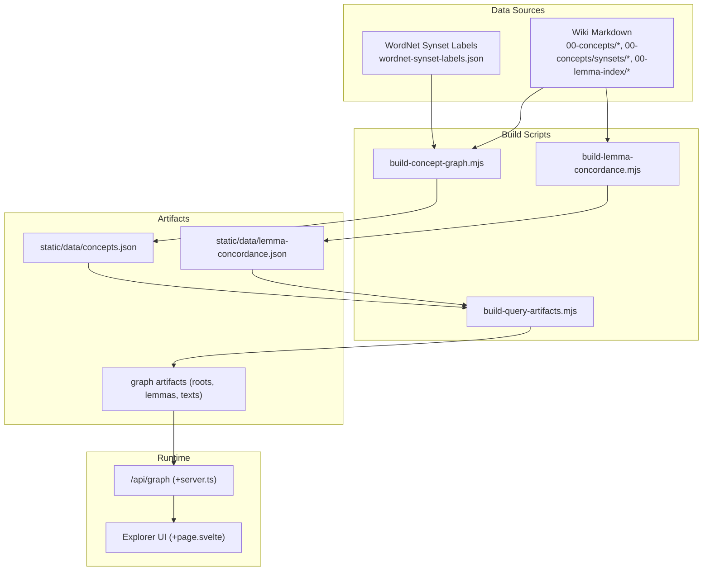
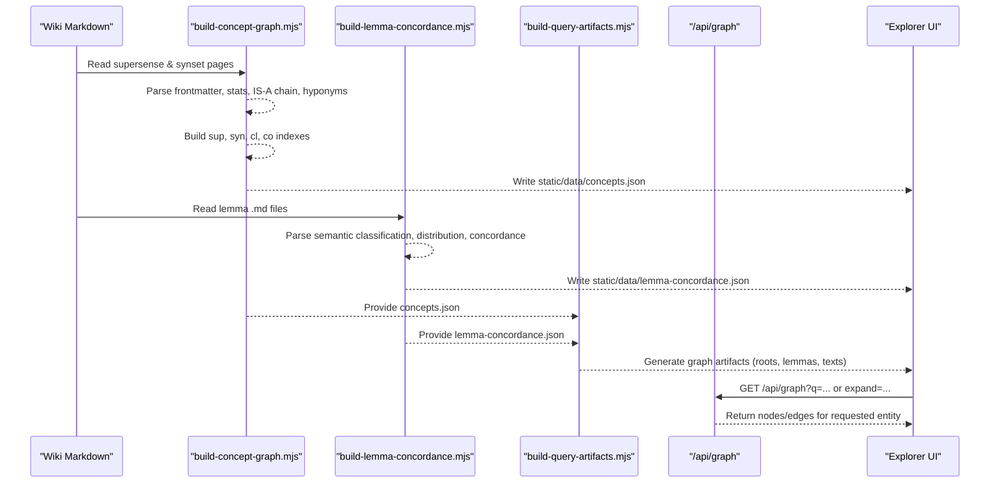
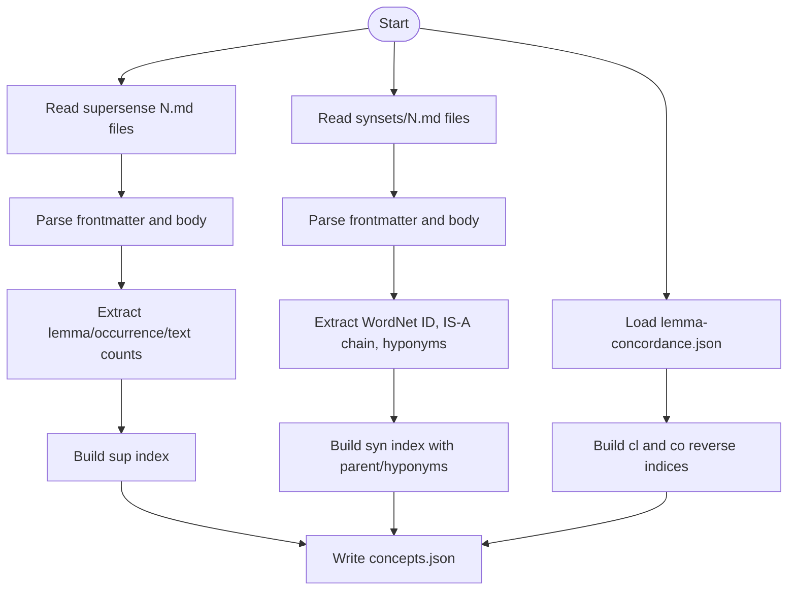
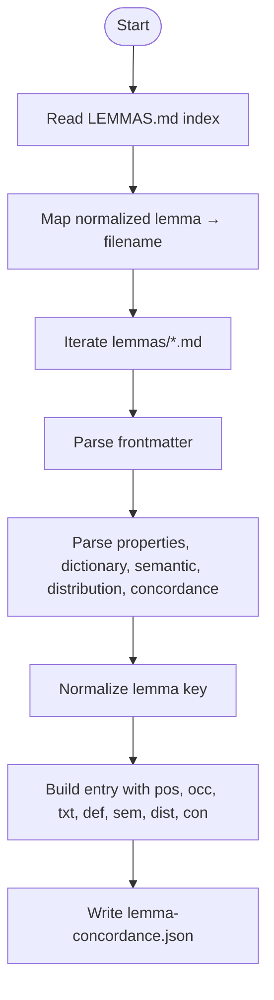
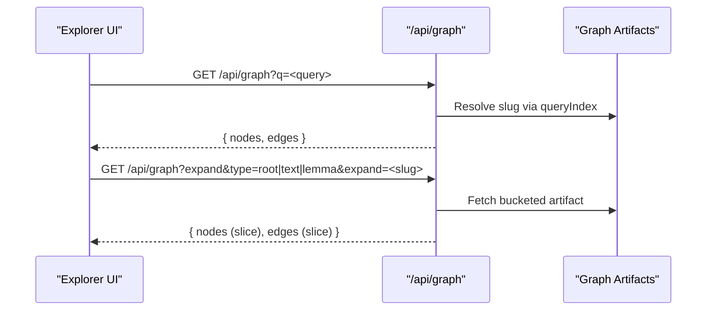
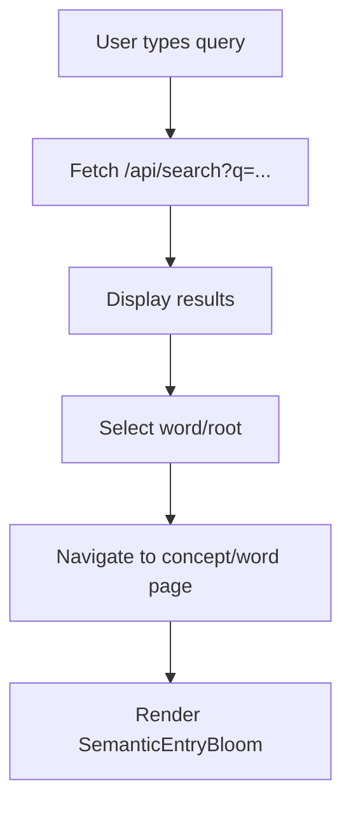
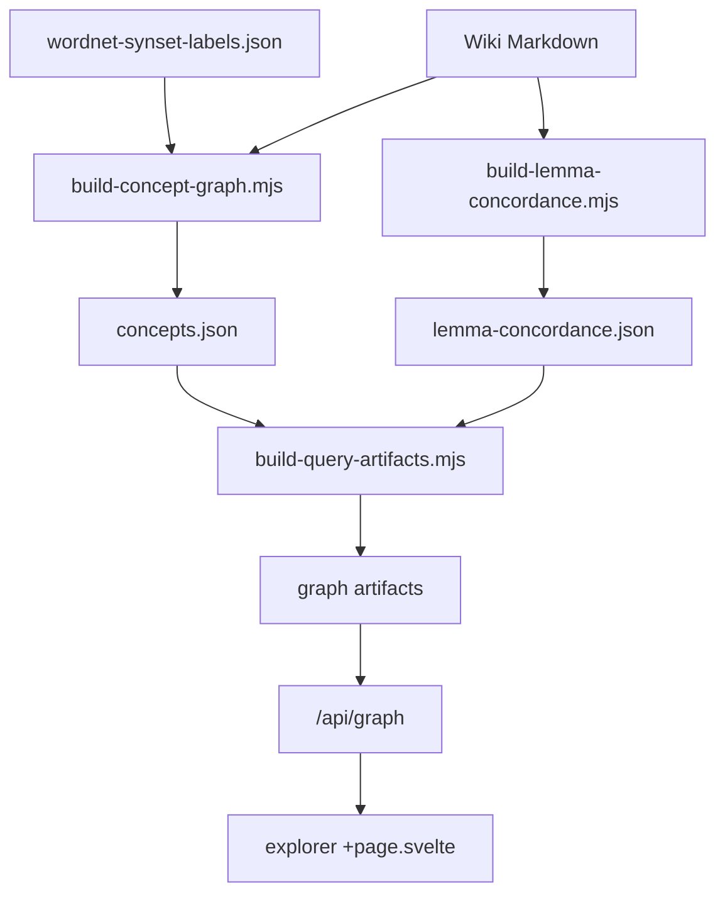

# Concept Graph Generation

<cite>
**Referenced Files in This Document**
- [build-concept-graph.mjs](file://scripts/build-concept-graph.mjs)
- [wordnet-synset-labels.json](file://scripts/data/wordnet-synset-labels.json)
- [build-lemma-concordance.mjs](file://scripts/build-lemma-concordance.mjs)
- [build-query-artifacts.mjs](file://scripts/lib/build-query-artifacts.mjs)
- [artifacts.mjs](file://scripts/lib/artifacts.mjs)
- [graph +server.ts](file://src/routes/api/graph/+server.ts)
- [explorer +page.svelte](file://src/routes/explorer/+page.svelte)
</cite>

## Table of Contents
1. [Introduction](#introduction)
2. [Project Structure](#project-structure)
3. [Core Components](#core-components)
4. [Architecture Overview](#architecture-overview)
5. [Detailed Component Analysis](#detailed-component-analysis)
6. [Dependency Analysis](#dependency-analysis)
7. [Performance Considerations](#performance-considerations)
8. [Troubleshooting Guide](#troubleshooting-guide)
9. [Conclusion](#conclusion)

## Introduction
This document explains the semantic concept graph builder that constructs WordNet-based supersense networks, maps lexical concepts to semantic categories, and generates relationship graphs for concept exploration. It covers how raw WordNet data is transformed into optimized graph artifacts suitable for D3.js rendering, including node generation for concepts and lemmas, edge creation for semantic relationships, and spatial layout considerations. The pipeline integrates WordNet synset labels, supersense classification from lemma metadata, and reverse indices to connect lemmas with supersenses and synsets.

## Project Structure
The concept graph system is implemented as a set of Node scripts and SvelteKit routes:
- Data ingestion and parsing scripts read Markdown sources from an external wiki directory and produce static JSON artifacts.
- A query artifact builder transforms these artifacts into graph-ready structures (nodes and edges).
- An API endpoint serves graph data to the frontend explorer.
- The explorer UI allows users to search and visualize concept graphs.



**Diagram sources**
- [build-concept-graph.mjs](file://scripts/build-concept-graph.mjs)
- [build-lemma-concordance.mjs](file://scripts/build-lemma-concordance.mjs)
- [build-query-artifacts.mjs](file://scripts/lib/build-query-artifacts.mjs)
- [wordnet-synset-labels.json](file://scripts/data/wordnet-synset-labels.json)
- [graph +server.ts](file://src/routes/api/graph/+server.ts)
- [explorer +page.svelte](file://src/routes/explorer/+page.svelte)

**Section sources**
- [build-concept-graph.mjs](file://scripts/build-concept-graph.mjs)
- [build-lemma-concordance.mjs](file://scripts/build-lemma-concordance.mjs)
- [build-query-artifacts.mjs](file://scripts/lib/build-query-artifacts.mjs)
- [wordnet-synset-labels.json](file://scripts/data/wordnet-synset-labels.json)
- [graph +server.ts](file://src/routes/api/graph/+server.ts)
- [explorer +page.svelte](file://src/routes/explorer/+page.svelte)

## Core Components
- Supersense and Synset Index Builder: Reads supersense pages and synset pages, extracts metadata, WordNet IDs, parent/hyponym links, and builds reverse indices connecting lemmas to concepts.
- Lemma Concordance Builder: Parses per-lemma Markdown files to extract semantic classifications (supersense names and concept IDs), distribution, and concordance samples.
- Query Artifact Builder: Converts concepts and lemmas into graph-ready artifacts, building IS-A chains, children lists, member lemmas, and generating nodes/edges for roots, lemmas, and texts.
- Graph API: Serves precomputed graph artifacts by slug, supports expansion endpoints, and provides a query index for fast lookups.
- Explorer UI: Provides search and visualization hooks to fetch and render concept graphs.

**Section sources**
- [build-concept-graph.mjs](file://scripts/build-concept-graph.mjs)
- [build-lemma-concordance.mjs](file://scripts/build-lemma-concordance.mjs)
- [build-query-artifacts.mjs](file://scripts/lib/build-query-artifacts.mjs)
- [graph +server.ts](file://src/routes/api/graph/+server.ts)
- [explorer +page.svelte](file://src/routes/explorer/+page.svelte)

## Architecture Overview
The pipeline transforms raw WordNet and wiki Markdown into optimized graph artifacts consumed by the frontend.



**Diagram sources**
- [build-concept-graph.mjs](file://scripts/build-concept-graph.mjs)
- [build-lemma-concordance.mjs](file://scripts/build-lemma-concordance.mjs)
- [build-query-artifacts.mjs](file://scripts/lib/build-query-artifacts.mjs)
- [graph +server.ts](file://src/routes/api/graph/+server.ts)
- [explorer +page.svelte](file://src/routes/explorer/+page.svelte)

## Detailed Component Analysis

### Supersense and Synset Index Builder
- Reads supersense pages (N.md) and synset pages (synsets/N.md) from the wiki directory.
- Parses frontmatter and body sections to extract titles, descriptions, statistics, WordNet synset IDs, IS-A chains, and hyponyms.
- Builds:
  - sup: supersense metadata with title, description, lemma count, occurrence count, text count.
  - syn: synset metadata with short name (from WordNet labels), title, description, WordNet ID, parent id, hyponyms list.
  - cl: reverse index mapping conceptId to lemmas.
  - co: reverse index mapping lemma to conceptId and name.
- Integrates WordNet synset labels to enrich synset entries with canonical names.



**Diagram sources**
- [build-concept-graph.mjs](file://scripts/build-concept-graph.mjs)
- [wordnet-synset-labels.json](file://scripts/data/wordnet-synset-labels.json)

**Section sources**
- [build-concept-graph.mjs](file://scripts/build-concept-graph.mjs)
- [wordnet-synset-labels.json](file://scripts/data/wordnet-synset-labels.json)

### Lemma Concordance Builder
- Parses per-lemma Markdown files to extract:
  - Properties: part of speech, total occurrences, texts appeared in.
  - Dictionary definitions concatenated from multiple sources.
  - Semantic classification: WordNet supersense names and concept IDs.
  - Text distribution: top occurrences across texts.
  - Concordance samples: surface forms and context snippets.
- Normalizes lemmas to ASCII keys for consistent indexing.
- Outputs lemma-concordance.json keyed by normalized lemma form.



**Diagram sources**
- [build-lemma-concordance.mjs](file://scripts/build-lemma-concordance.mjs)

**Section sources**
- [build-lemma-concordance.mjs](file://scripts/build-lemma-concordance.mjs)

### Query Artifact Builder
- Consumes concepts.json and lemma-concordance.json to build:
  - Concept details: kind (sup/syn), data, IS-A chain, children, member lemmas.
  - Graph artifacts:
    - Roots: nodes for dhatus, words deriving from them, related dhatus, sutras, and top texts.
    - Lemmas: nodes for word, definition, root, siblings, sutras, and appearances in texts.
    - Texts: nodes for text and top words appearing in it.
- Produces bucketed artifacts for efficient client retrieval and a query index for fast lookup.

```mermaid
classDiagram
class Concepts {
+sup : Record<string, Supersense>
+syn : Record<string, Synset>
+cl : Record<string, string[]>
+co : Record<string, Record<string, string>>
}
class LemmaConcordance {
+[normalizedLemma] : Entry
}
class QueryArtifacts {
+index : { sup, syn }
+details : Record<string, Detail>
+roots : Record<string, Graph>
+lemmas : Record<string, Graph>
+texts : Record<string, Graph>
+queryIndex : { lemmas, roots, texts }
}
Concepts --> QueryArtifacts : "used by"
LemmaConcordance --> QueryArtifacts : "used by"
```

**Diagram sources**
- [build-query-artifacts.mjs](file://scripts/lib/build-query-artifacts.mjs)

**Section sources**
- [build-query-artifacts.mjs](file://scripts/lib/build-query-artifacts.mjs)

### Graph API
- Exposes endpoints to retrieve graph artifacts:
  - By type and slug for root, lemma, or text.
  - Expand mode returns truncated nodes/edges for large graphs.
  - Query mode resolves user input via query index and returns relevant graph.
- Uses bucketing to locate artifacts efficiently.



**Diagram sources**
- [graph +server.ts](file://src/routes/api/graph/+server.ts)

**Section sources**
- [graph +server.ts](file://src/routes/api/graph/+server.ts)

### Explorer UI
- Provides search input and result selection.
- On selection, navigates to concept page or selects word/root for visualization.
- Integrates with SemanticEntryBloom component to display concept-related visualizations.



**Diagram sources**
- [explorer +page.svelte](file://src/routes/explorer/+page.svelte)

**Section sources**
- [explorer +page.svelte](file://src/routes/explorer/+page.svelte)

## Dependency Analysis
- build-concept-graph.mjs depends on:
  - WordNet synset labels for canonical names.
  - lemma-concordance.json for reverse indices.
- build-lemma-concordance.mjs depends on:
  - Wiki lemma Markdown files and texts.json for title-to-slug mapping.
- build-query-artifacts.mjs depends on:
  - concepts.json and lemma-concordance.json to construct graph artifacts.
- graph +server.ts depends on:
  - Prebuilt graph artifacts served under versioned paths.
- explorer +page.svelte depends on:
  - /api/search and /api/graph endpoints.



**Diagram sources**
- [build-concept-graph.mjs](file://scripts/build-concept-graph.mjs)
- [build-lemma-concordance.mjs](file://scripts/build-lemma-concordance.mjs)
- [build-query-artifacts.mjs](file://scripts/lib/build-query-artifacts.mjs)
- [graph +server.ts](file://src/routes/api/graph/+server.ts)
- [explorer +page.svelte](file://src/routes/explorer/+page.svelte)

**Section sources**
- [build-concept-graph.mjs](file://scripts/build-concept-graph.mjs)
- [build-lemma-concordance.mjs](file://scripts/build-lemma-concordance.mjs)
- [build-query-artifacts.mjs](file://scripts/lib/build-query-artifacts.mjs)
- [graph +server.ts](file://src/routes/api/graph/+server.ts)
- [explorer +page.svelte](file://src/routes/explorer/+page.svelte)

## Performance Considerations
- Bucketing strategy:
  - Keys are normalized to ASCII and grouped into two-character buckets to reduce payload sizes and improve client-side lookup performance.
- Pagination and slicing:
  - Large graphs are sliced when expanded to avoid overwhelming the browser; only a subset of nodes/edges is returned initially.
- Reverse indices:
  - cl and co maps enable O(1) lookups for lemma↔concept associations during artifact construction.
- IS-A chain traversal:
  - Parent pointers allow efficient reconstruction of hierarchical paths without repeated scans.
- File I/O:
  - Reading large Markdown directories is linear; consider streaming or batching if datasets grow significantly.

[No sources needed since this section provides general guidance]

## Troubleshooting Guide
- Missing WordNet labels:
  - Ensure wordnet-synset-labels.json contains entries for all referenced synset IDs; missing labels will leave n fields null.
- Inconsistent wiki structure:
  - Frontmatter parsing expects specific headings and tables; malformed sections may cause skipped entries.
- Lemma normalization mismatches:
  - ASCII normalization must match between lemma-concordance.json and concepts.json co/cl indices; discrepancies break reverse lookups.
- Graph not found errors:
  - Verify bucketed artifact paths exist and that the query index maps correctly to slugs.
- Expansion limits:
  - Expanded responses slice nodes/edges; adjust server-side slicing if more context is required.

**Section sources**
- [build-concept-graph.mjs](file://scripts/build-concept-graph.mjs)
- [build-lemma-concordance.mjs](file://scripts/build-lemma-concordance.mjs)
- [build-query-artifacts.mjs](file://scripts/lib/build-query-artifacts.mjs)
- [graph +server.ts](file://src/routes/api/graph/+server.ts)

## Conclusion
The semantic concept graph builder integrates WordNet synset labels and wiki-derived supersense classifications to create rich, navigable concept graphs. By constructing robust reverse indices and generating optimized graph artifacts, the system enables efficient client-side exploration through the SvelteKit API and interactive UI. The modular pipeline supports scalability and maintainability while providing clear pathways for extending semantic relationships and improving visualization performance.