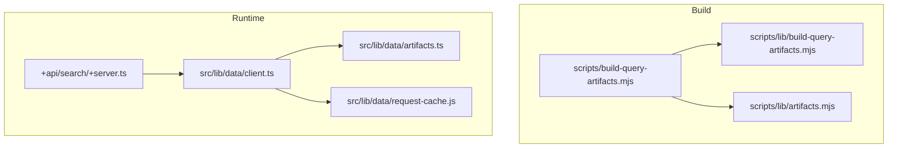
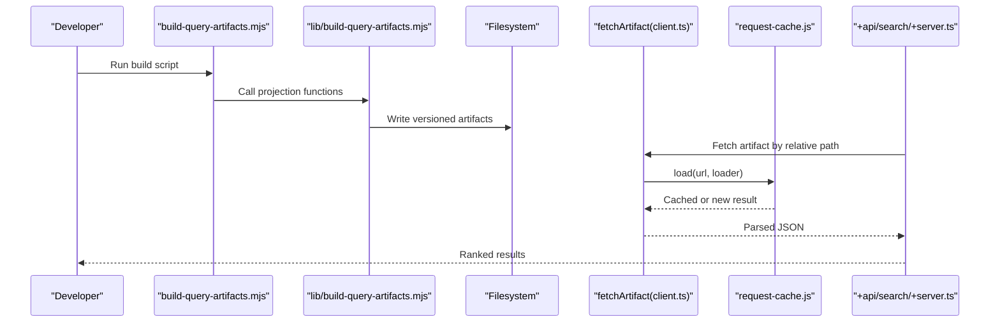
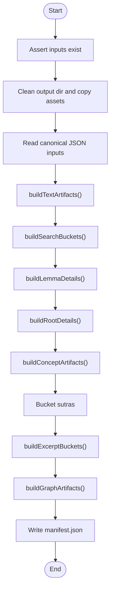
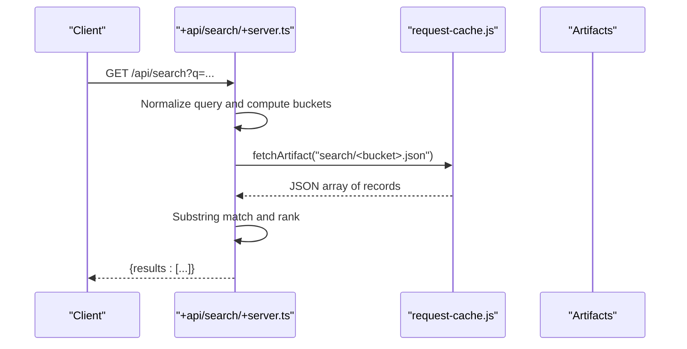
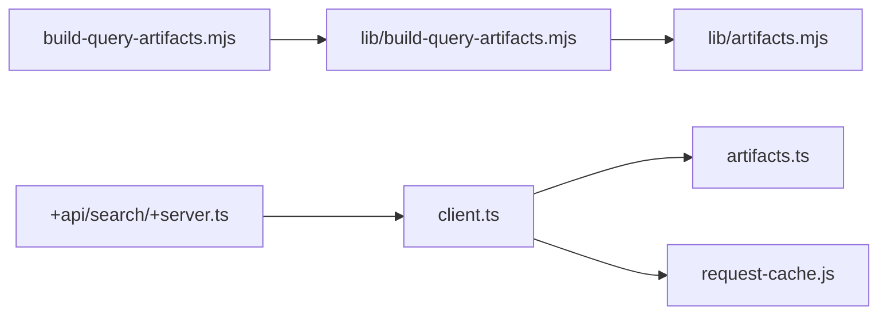

# Query Artifacts and Search Index

<cite>
**Referenced Files in This Document**
- [build-query-artifacts.mjs](file://scripts/build-query-artifacts.mjs)
- [build-query-artifacts.mjs](file://scripts/lib/build-query-artifacts.mjs)
- [artifacts.mjs](file://scripts/lib/artifacts.mjs)
- [+server.ts](file://src/routes/api/search/+server.ts)
- [client.ts](file://src/lib/data/client.ts)
- [artifacts.ts](file://src/lib/data/artifacts.ts)
- [request-cache.js](file://src/lib/data/request-cache.js)
- [DEVELOPERS.md](file://docs/DEVELOPERS.md)
- [build-query-artifacts.test.mjs](file://tests/build-query-artifacts.test.mjs)
- [artifacts.test.mjs](file://tests/artifacts.test.mjs)
</cite>

## Table of Contents
1. [Introduction](#introduction)
2. [Project Structure](#project-structure)
3. [Core Components](#core-components)
4. [Architecture Overview](#architecture-overview)
5. [Detailed Component Analysis](#detailed-component-analysis)
6. [Dependency Analysis](#dependency-analysis)
7. [Performance Considerations](#performance-considerations)
8. [Troubleshooting Guide](#troubleshooting-guide)
9. [Conclusion](#conclusion)
10. [Appendices](#appendices)

## Introduction
This document explains the query artifact generation system that builds optimized search indexes and response structures for texts, lemmas, dhātus (roots), concepts, and related graph data. The build pipeline reads multiple canonical JSON inputs, projects them into versioned artifacts, and writes a static runtime tree consumed by API endpoints and pages. It also documents indexing algorithms, fuzzy matching preparation, and response caching strategies used at runtime.

## Project Structure
The system is organized around:
- Build scripts that read canonical inputs and emit versioned artifacts under a runtime directory.
- Shared normalization and bucketing utilities used both during build and at runtime.
- API endpoints that consume precomputed artifacts to answer queries efficiently.
- A lightweight request cache that deduplicates concurrent fetches and caches completed responses in memory.

**Diagram sources**
- [build-query-artifacts.mjs:1-207](file://scripts/build-query-artifacts.mjs#L1-L207)
- [build-query-artifacts.mjs:1-457](file://scripts/lib/build-query-artifacts.mjs#L1-L457)
- [artifacts.mjs:1-24](file://scripts/lib/artifacts.mjs#L1-L24)
- [+server.ts:1-79](file://src/routes/api/search/+server.ts#L1-L79)
- [client.ts:1-16](file://src/lib/data/client.ts#L1-L16)
- [artifacts.ts:1-27](file://src/lib/data/artifacts.ts#L1-L27)
- [request-cache.js:1-45](file://src/lib/data/request-cache.js#L1-L45)

**Section sources**
- [build-query-artifacts.mjs:1-207](file://scripts/build-query-artifacts.mjs#L1-L207)
- [DEVELOPERS.md:120-295](file://docs/DEVELOPERS.md#L120-L295)

## Core Components
- Artifact builder orchestrator: validates inputs, reads corpora, constructs artifacts, and writes versioned outputs.
- Projection functions: transform raw corpora into compact, query-ready buckets and files.
- Normalization and bucketing: deterministic ASCII keys and two-character prefix buckets for efficient lookups.
- Runtime client: resolves artifact URLs, deduplicates concurrent requests, and caches results.
- Search endpoint: normalizes queries, fans out to relevant buckets, performs substring matching, ranks, and returns limited results.

Key responsibilities:
- Texts: page-based verse artifacts with metadata and references.
- Lemmas: enriched details including dictionary definitions, root info, occurrences, concordance, and concept links.
- Roots: grouped derived words with definitions and occurrence counts.
- Concepts: hierarchy index and detail projections with member lemmas.
- Graphs: bounded neighborhoods for roots, lemmas, and texts plus a compact query index.
- Excerpts: precomputed snippets per lemma.

**Section sources**
- [build-query-artifacts.mjs:66-194](file://scripts/build-query-artifacts.mjs#L66-L194)
- [build-query-artifacts.mjs:64-456](file://scripts/lib/build-query-artifacts.mjs#L64-L456)
- [artifacts.mjs:1-24](file://scripts/lib/artifacts.mjs#L1-L24)
- [client.ts:1-16](file://src/lib/data/client.ts#L1-L16)
- [request-cache.js:1-45](file://src/lib/data/request-cache.js#L1-L45)

## Architecture Overview
The build phase produces a versioned artifact tree. The runtime consumes it via thin endpoints that only perform minimal processing.

**Diagram sources**
- [build-query-artifacts.mjs:98-194](file://scripts/build-query-artifacts.mjs#L98-L194)
- [build-query-artifacts.mjs:124-456](file://scripts/lib/build-query-artifacts.mjs#L124-L456)
- [client.ts:1-16](file://src/lib/data/client.ts#L1-L16)
- [request-cache.js:1-45](file://src/lib/data/request-cache.js#L1-L45)
- [+server.ts:15-78](file://src/routes/api/search/+server.ts#L15-L78)

## Detailed Component Analysis

### Build Orchestrator
Responsibilities:
- Assert required inputs exist.
- Clean previous output and copy public assets.
- Read all canonical JSON inputs.
- Generate text artifacts (meta, references, paginated pages).
- Create search buckets, lemma details, root details, concept artifacts, sutra buckets, excerpt buckets, and graph artifacts.
- Write a manifest with schema version, timestamp, and counts.

**Diagram sources**
- [build-query-artifacts.mjs:66-194](file://scripts/build-query-artifacts.mjs#L66-L194)

**Section sources**
- [build-query-artifacts.mjs:66-194](file://scripts/build-query-artifacts.mjs#L66-L194)

### Normalization and Bucketing Utilities
- asciiKey: NFD normalization, diacritic removal, lowercasing, safe ASCII slugification.
- bucketFor: deterministic two-character prefix based on normalized key; handles empty/invalid cases.
- pageFilename: zero-padded filenames for stable ordering.
- versionedArtifactPath / artifactPath: immutable base URL construction for CDN-friendly paths.

These are used both in build-time projections and runtime resolution.

**Section sources**
- [artifacts.mjs:1-24](file://scripts/lib/artifacts.mjs#L1-L24)
- [artifacts.ts:1-27](file://src/lib/data/artifacts.ts#L1-L27)

### Text Artifacts
- Pages split verses into fixed-size chunks (PAGE_SIZE = 20).
- Each page includes title, slug, pagination fields, and a slice of verses.
- References map each verse to its page number.
- Description HTML is sanitized before storage.

Complexity: O(V) where V is the number of verses; constant-time slicing per page.

**Section sources**
- [build-query-artifacts.mjs:64-122](file://scripts/lib/build-query-artifacts.mjs#L64-L122)

### Search Buckets
- For each lemma, store a compact record with slug, headword, normalized form, plain ASCII form, and preview.
- Distribute records across buckets keyed by first two characters of normalized keys.
- Enables fan-out to only the necessary buckets for a given query.

Complexity: O(L) to build buckets where L is number of lemmas.

**Section sources**
- [build-query-artifacts.mjs:124-142](file://scripts/lib/build-query-artifacts.mjs#L124-L142)

### Lemma Details
- Joins lemmas with dictionary entries, root information, occurrences, concordance, and concept mappings.
- Resolves preferred root link using prioritized sources (enriched vs bridge).
- Outputs per-bucket details keyed by lemma slug.

Complexity: O(L + D + E + B + O + C) where D is dictionary size, E enriched links, B bridge links, O occurrences, C concepts.

**Section sources**
- [build-query-artifacts.mjs:144-184](file://scripts/lib/build-query-artifacts.mjs#L144-L184)

### Root Details
- Groups derived words into categories: root, guṇa, vṛddhi, other using vowel-grade transformations.
- Enriches with dictionary definitions, occurrence counts, neighbors, and sutras.
- Produces one file per root slug and an index summary.

Complexity: O(R + W) where R is number of roots and W is number of derived words.

**Section sources**
- [build-query-artifacts.mjs:186-267](file://scripts/lib/build-query-artifacts.mjs#L186-L267)

### Concept Artifacts
- Builds an index of supersense and synonym sets.
- Computes parent chains and children lists.
- Projects member lemmas from normalized keys to lemma slugs.

Complexity: O(C + M) where C is concept nodes and M is member mappings.

**Section sources**
- [build-query-artifacts.mjs:269-308](file://scripts/lib/build-query-artifacts.mjs#L269-L308)

### Graph Artifacts
- Precomputes bounded neighborhoods for roots, lemmas, and texts.
- Includes edges for derivations, same-gaṇa/pada relations, sutra governance, and text appearances.
- Provides a compact query index mapping ASCII-normalized keys to slugs for fast resolution.

Complexity: O(R + W + L + T) with bounded slices per entity.

**Section sources**
- [build-query-artifacts.mjs:331-456](file://scripts/lib/build-query-artifacts.mjs#L331-L456)

### Excerpt Buckets
- Takes precomputed concordance samples and limits to a fixed number per lemma.
- Stores snippets, references, and surface forms.

Complexity: O(E) where E is total excerpts considered.

**Section sources**
- [build-query-artifacts.mjs:310-329](file://scripts/lib/build-query-artifacts.mjs#L310-L329)

### Runtime Search Endpoint
Flow:
- Normalize input query to lowercase and ASCII key; optionally transliterate between Devanagari and IAST.
- Compute target buckets via bucketFor.
- Fetch only those buckets concurrently.
- Perform substring matches against headword, slug, normalized, and plain fields.
- Rank results by exact match, prefix match, and field priority.
- Return at most 50 results.

**Diagram sources**
- [+server.ts:15-78](file://src/routes/api/search/+server.ts#L15-L78)
- [client.ts:1-16](file://src/lib/data/client.ts#L1-L16)
- [request-cache.js:1-45](file://src/lib/data/request-cache.js#L1-L45)

**Section sources**
- [+server.ts:15-78](file://src/routes/api/search/+server.ts#L15-L78)

### Request Cache
- Deduplicates concurrent requests for the same URL.
- Caches successful responses in memory for process lifetime.
- Removes failed requests from in-flight set to allow retries.

Complexity: O(1) average for lookup and insertion.

**Section sources**
- [request-cache.js:1-45](file://src/lib/data/request-cache.js#L1-L45)
- [client.ts:1-16](file://src/lib/data/client.ts#L1-L16)

## Dependency Analysis

- Build-time dependencies: orchestrator depends on projection functions and shared utilities.
- Runtime dependencies: search endpoint depends on client and cache; client depends on artifact path utilities.

**Diagram sources**
- [build-query-artifacts.mjs:1-24](file://scripts/build-query-artifacts.mjs#L1-L24)
- [build-query-artifacts.mjs:1-2](file://scripts/lib/build-query-artifacts.mjs#L1-L2)
- [artifacts.mjs:1-24](file://scripts/lib/artifacts.mjs#L1-L24)
- [+server.ts:1-6](file://src/routes/api/search/+server.ts#L1-L6)
- [client.ts:1-4](file://src/lib/data/client.ts#L1-L4)
- [artifacts.ts:1-4](file://src/lib/data/artifacts.ts#L1-L4)
- [request-cache.js:1-4](file://src/lib/data/request-cache.js#L1-L4)

**Section sources**
- [build-query-artifacts.mjs:1-24](file://scripts/build-query-artifacts.mjs#L1-L24)
- [build-query-artifacts.mjs:1-2](file://scripts/lib/build-query-artifacts.mjs#L1-L2)
- [artifacts.mjs:1-24](file://scripts/lib/artifacts.mjs#L1-L24)
- [+server.ts:1-6](file://src/routes/api/search/+server.ts#L1-L6)
- [client.ts:1-4](file://src/lib/data/client.ts#L1-L4)
- [artifacts.ts:1-4](file://src/lib/data/artifacts.ts#L1-L4)
- [request-cache.js:1-4](file://src/lib/data/request-cache.js#L1-L4)

## Performance Considerations
- Bounded requests: Each endpoint loads only the necessary bucket or page, avoiding whole-corpus joins at runtime.
- Prefetching and caching: In-memory request cache prevents duplicate network calls and parsing within a process.
- Pagination: Text pages limit payload size to PAGE_SIZE verses.
- Bucketing: Two-character prefix reduces fan-out to small subsets of lemmas.
- Hard limits: Search returns at most 50 results; excerpts limited to 30 per lemma; graph neighborhoods bounded to prevent large payloads.
- Versioned artifacts: Immutable URLs enable long-lived CDN caching without cache-busting.

[No sources needed since this section provides general guidance]

## Troubleshooting Guide
Common issues and resolutions:
- Missing inputs: Build script asserts required JSON files; ensure all canonical inputs exist before running the build.
- Stale results: Clear in-memory cache if needed; verify artifact version constants match deployed artifacts.
- Slow searches: Ensure query normalization is correct; confirm buckets are computed and present; check that substring matching logic aligns with stored fields.
- Failed fetches: Retry behavior is supported; failures remove in-flight entries so subsequent attempts can succeed.

**Section sources**
- [build-query-artifacts.mjs:56-64](file://scripts/build-query-artifacts.mjs#L56-L64)
- [request-cache.js:22-36](file://src/lib/data/request-cache.js#L22-L36)
- [client.ts:11-15](file://src/lib/data/client.ts#L11-L15)

## Conclusion
The query artifact system transforms multiple corpora into a versioned, bucketed, and paginated artifact tree optimized for fast, bounded runtime queries. By moving heavy joins and projections into the build step and leveraging deterministic normalization and bucketing, the runtime remains thin and responsive. The request cache further improves performance by deduplicating and caching responses. Together, these components deliver scalable search and exploration capabilities over large datasets.

[No sources needed since this section summarizes without analyzing specific files]

## Appendices

### Artifact Schema Examples
- Text meta and pages:
  - Meta includes slug, title, token count, verse count, page count, page size, and description.
  - Pages include pagination fields and a slice of verses.
  - References map verses to page numbers.
- Search buckets:
  - Records contain slug, headword, normalized, plain, and preview.
- Lemma details:
  - Includes lemma, english definitions, root info, text occurrences, concordance, and concept links.
- Root details:
  - Includes dhatu, neighbors, word groups, sutras, and word count.
- Concept artifacts:
  - Index contains supersense and synonym maps; details include id, kind, data, isa chain, children, and member lemmas.
- Graph artifacts:
  - Roots, lemmas, and texts have nodes and edges; query index maps ASCII keys to slugs.
- Excerpts:
  - Per lemma, up to 30 excerpts with snippet, reference, and surface form.

**Section sources**
- [build-query-artifacts.mjs:64-122](file://scripts/lib/build-query-artifacts.mjs#L64-L122)
- [build-query-artifacts.mjs:124-142](file://scripts/lib/build-query-artifacts.mjs#L124-L142)
- [build-query-artifacts.mjs:144-184](file://scripts/lib/build-query-artifacts.mjs#L144-L184)
- [build-query-artifacts.mjs:186-267](file://scripts/lib/build-query-artifacts.mjs#L186-L267)
- [build-query-artifacts.mjs:269-308](file://scripts/lib/build-query-artifacts.mjs#L269-L308)
- [build-query-artifacts.mjs:331-456](file://scripts/lib/build-query-artifacts.mjs#L331-L456)
- [build-query-artifacts.mjs:310-329](file://scripts/lib/build-query-artifacts.mjs#L310-L329)

### Query Patterns and Response Formats
- Search query patterns:
  - Exact headword match, normalized/plain equality, slug equality, ASCII headword equality, prefix matches.
- Response format:
  - Array of objects with slug, headword, and preview fields, ranked by relevance.

**Section sources**
- [+server.ts:65-78](file://src/routes/api/search/+server.ts#L65-L78)

### Index Structures
- Search buckets:
  - Keyed by two-character prefix; values are arrays of compact lemma records.
- Graph query index:
  - Maps ASCII-normalized keys for lemmas, roots, and texts to their slugs.

**Section sources**
- [build-query-artifacts.mjs:124-142](file://scripts/lib/build-query-artifacts.mjs#L124-L142)
- [build-query-artifacts.mjs:439-455](file://scripts/lib/build-query-artifacts.mjs#L439-L455)

### Fuzzy Matching Preparation
- Normalization:
  - asciiKey removes diacritics and punctuation, lowercases, and ensures ASCII-only keys.
- Transliteration:
  - Optional conversion between Devanagari and IAST to broaden match coverage.
- Bucketing:
  - Deterministic prefixes reduce search space.

**Section sources**
- [artifacts.mjs:1-9](file://scripts/lib/artifacts.mjs#L1-L9)
- [artifacts.ts:4-12](file://src/lib/data/artifacts.ts#L4-L12)
- [+server.ts:19-34](file://src/routes/api/search/+server.ts#L19-L34)

### Response Caching Strategies
- In-process cache:
  - Concurrent requests share a single fetch; successful results cached in memory.
- Failure handling:
  - Failed requests removed from in-flight set to allow retry.
- CDN/browser caching:
  - Versioned artifact URLs enable long-lived caching without cache-busting.

**Section sources**
- [request-cache.js:18-36](file://src/lib/data/request-cache.js#L18-L36)
- [client.ts:11-15](file://src/lib/data/client.ts#L11-L15)
- [DEVELOPERS.md:130-148](file://docs/DEVELOPERS.md#L130-L148)