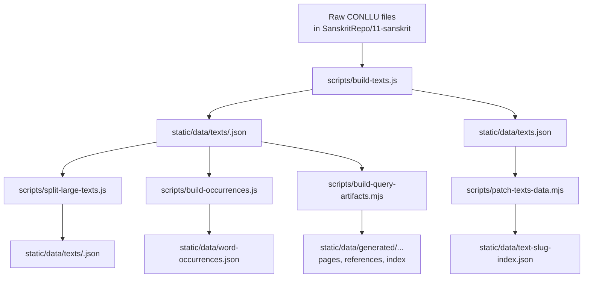
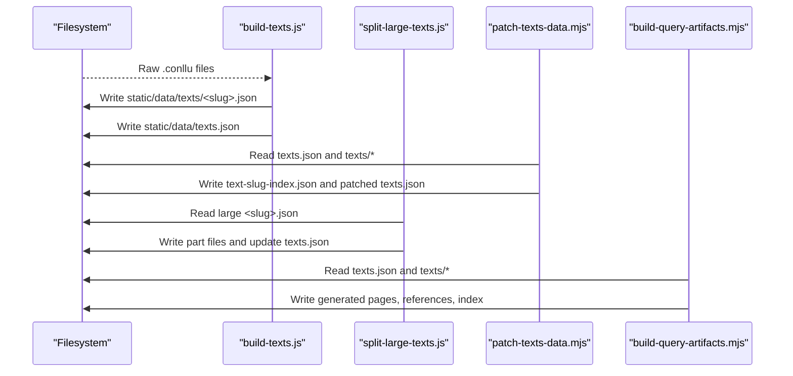
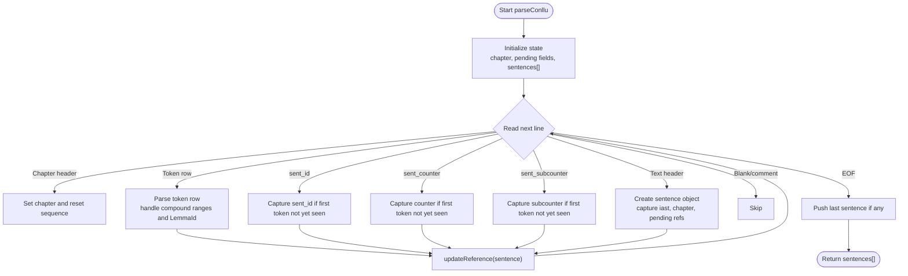
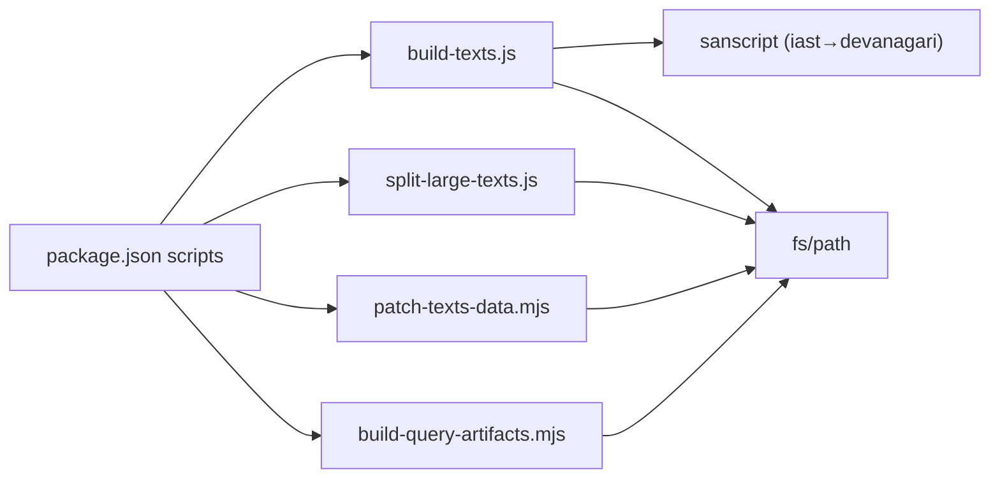

# Text Processing and Parsing

<cite>
**Referenced Files in This Document**
- [build-texts.js](file://scripts/build-texts.js)
- [split-large-texts.js](file://scripts/split-large-texts.js)
- [patch-texts-data.mjs](file://scripts/patch-texts-data.mjs)
- [build-query-artifacts.mjs](file://scripts/build-query-artifacts.mjs)
- [package.json](file://package.json)
- [+page.md](file://src/routes/docs/sources/+page.md)
</cite>

## Table of Contents
1. [Introduction](#introduction)
2. [Project Structure](#project-structure)
3. [Core Components](#core-components)
4. [Architecture Overview](#architecture-overview)
5. [Detailed Component Analysis](#detailed-component-analysis)
6. [Dependency Analysis](#dependency-analysis)
7. [Performance Considerations](#performance-considerations)
8. [Troubleshooting Guide](#troubleshooting-guide)
9. [Conclusion](#conclusion)
10. [Appendices](#appendices)

## Introduction
This document explains the text processing pipeline implemented by scripts/build-texts.js and its downstream artifacts. The pipeline ingests CoNLL-U (CONLLU) files from a Sanskrit corpus, parses metadata and token rows, converts IAST to Devanāgarī, builds references, and outputs paginated verse bundles consumed by the site’s runtime. It also documents how large texts are split into parts, how filenames and slugs are normalized, and how query-time artifacts are generated for efficient navigation and search.

## Project Structure
The pipeline is orchestrated via npm scripts that run multiple Node.js modules in sequence. The primary entry point for parsing raw CONLLU files is build-texts.js. Subsequent steps normalize file names and slugs, split oversized texts, and generate query-ready artifacts.

**Diagram sources**
- [build-texts.js:141-188](file://scripts/build-texts.js#L141-L188)
- [patch-texts-data.mjs:22-106](file://scripts/patch-texts-data.mjs#L22-L106)
- [split-large-texts.js:1-56](file://scripts/split-large-texts.js#L1-L56)
- [build-query-artifacts.mjs:98-124](file://scripts/build-query-artifacts.mjs#L98-L124)

**Section sources**
- [package.json:8-18](file://package.json#L8-L18)
- [build-texts.js:1-15](file://scripts/build-texts.js#L1-L15)

## Core Components
- File discovery: Recursively finds .conllu files under the configured raw directory, excluding numeric prefixes used for indexes.
- CONLLU parser: Extracts chapter, sent_id, sent_counter, sent_subcounter, and token rows; handles compound-range tokens and LemmaId fields.
- Transliteration: Converts IAST to Devanāgarī using sanscript.t with error handling.
- Reference generation: Builds stable reference strings prioritizing chapter + counter/subcounter, falling back to sent_id or sequence.
- Slug creation: ASCII-normalizes folder names to produce URL-safe slugs.
- Output artifacts: Writes per-text JSON bundles and a global texts.json index.

**Section sources**
- [build-texts.js:25-34](file://scripts/build-texts.js#L25-L34)
- [build-texts.js:36-129](file://scripts/build-texts.js#L36-L129)
- [build-texts.js:131-137](file://scripts/build-texts.js#L131-L137)
- [build-texts.js:163-173](file://scripts/build-texts.js#L163-L173)
- [build-texts.js:171-173](file://scripts/build-texts.js#L171-L173)

## Architecture Overview
The pipeline transforms raw corpus data into structured, consumable artifacts through a series of deterministic steps. Each step reads inputs produced by previous steps and writes outputs consumed by later steps or the frontend.

**Diagram sources**
- [build-texts.js:141-188](file://scripts/build-texts.js#L141-L188)
- [patch-texts-data.mjs:22-106](file://scripts/patch-texts-data.mjs#L22-L106)
- [split-large-texts.js:1-56](file://scripts/split-large-texts.js#L1-L56)
- [build-query-artifacts.mjs:98-124](file://scripts/build-query-artifacts.mjs#L98-L124)

## Detailed Component Analysis

### CONLLU Parser and Metadata Extraction
- Chapter tracking: Lines starting with “## chapter:” set the current chapter and reset the local sentence counter.
- Sentence boundaries: Lines starting with “# text =” mark the start of a new sentence/verse.
- Reference metadata:
  - “# sent_id =” provides an identifier.
  - “# sent_counter =” and “# sent_subcounter =” provide hierarchical numbering when present.
- Token rows:
  - Regular tokens: tab-separated columns including id, form, lemma, upos, feats, and optional LemmaId in column 9.
  - Compound-range tokens: id field contains a range like “start-end”; these capture morphological spans across multiple words.
- Reference computation: Combines chapter and counter/subcounter if available; otherwise falls back to sent_id or sequence number.

**Diagram sources**
- [build-texts.js:36-129](file://scripts/build-texts.js#L36-L129)

**Section sources**
- [build-texts.js:36-129](file://scripts/build-texts.js#L36-L129)

### IAST to Devanāgarī Conversion
- Uses sanscript.t with source script ‘iast’ and target script ‘devanagari’.
- Errors are caught and return an empty string to avoid failing the build on malformed input.

**Section sources**
- [build-texts.js:131-137](file://scripts/build-texts.js#L131-L137)

### Reference Generation System
- Priority order:
  1. chapter + counter (+ optional subcounter)
  2. sent_id
  3. sequence within chapter
- Ensures stable, human-readable references aligned with edition structure.

**Section sources**
- [build-texts.js:46-53](file://scripts/build-texts.js#L46-L53)

### Slug Creation
- Normalizes folder titles to ASCII lowercase, strips diacritics, replaces non-alphanumeric sequences with hyphens, and trims leading/trailing hyphens.
- Used to name output files and create URLs.

**Section sources**
- [build-texts.js:16-23](file://scripts/build-texts.js#L16-L23)

### Verse Bundle Construction and Output
- For each text folder:
  - Discover all .conllu files recursively.
  - Parse and concatenate sentences across files.
  - Map sentences to verses with devanagari, iast, tokens, and computed reference.
  - Write one JSON file per text under static/data/texts/.
  - Append metadata to texts.json (slug, title, counts).

**Section sources**
- [build-texts.js:141-188](file://scripts/build-texts.js#L141-L188)

### Large Text Splitting
- Detects large text bundles (e.g., Mahābhārata) and splits them into fixed parts.
- Produces part files with adjusted slugs and updates texts.json accordingly.
- Removes original large bundle to keep repository size manageable.

**Section sources**
- [split-large-texts.js:1-56](file://scripts/split-large-texts.js#L1-L56)

### Filename and Slug Normalization
- Adds a `file` field to each entry in texts.json mapping slug to actual filename.
- Generates a text-slug-index.json for fast slug-to-file lookup.
- Handles case-sensitive filesystem differences by maintaining canonical mappings for specific large texts.

**Section sources**
- [patch-texts-data.mjs:22-106](file://scripts/patch-texts-data.mjs#L22-L106)

### Query-Time Artifacts and Pagination
- Reads texts.json and per-text JSON files to generate:
  - Per-text meta and references.
  - Paginated page files under texts/<slug>/pages/.
  - An index listing all texts with counts and sizes.
- Uses a configurable page size and versioned artifact paths.

**Section sources**
- [build-query-artifacts.mjs:98-124](file://scripts/build-query-artifacts.mjs#L98-L124)

## Dependency Analysis
The pipeline depends on Node.js built-ins (fs, path), the sanscript library for transliteration, and environment variables for locating raw corpora. Scripts are chained via npm scripts.

**Diagram sources**
- [package.json:8-18](file://package.json#L8-L18)
- [build-texts.js:1-4](file://scripts/build-texts.js#L1-L4)

**Section sources**
- [package.json:8-18](file://package.json#L8-L18)

## Performance Considerations
- File discovery uses recursive directory traversal; sorting ensures deterministic ordering.
- Parsing is linear in the number of lines; token extraction is O(1) per row.
- IAST conversion is per-verse; errors are short-circuited to empty strings to avoid failures.
- Large text splitting reduces payload sizes for distribution and caching.
- Query artifacts precompute pagination and references to minimize runtime overhead.

[No sources needed since this section provides general guidance]

## Troubleshooting Guide
- Missing raw directory: Ensure FRACTALDHARMA_RAW_DIR points to the correct Sanskrit repository root.
- No .conllu files found: Verify folder naming excludes numeric prefixes and contains valid .conllu files.
- Empty Devanāgarī output: Check IAST validity; sanscript conversion may fail on malformed input.
- Mismatched slugs and filenames: Run patch-texts-data.mjs to reconcile slugs and filenames and regenerate text-slug-index.json.
- Large text not split: Confirm the text slug matches known large entries and that the original file exists before running the splitter.

**Section sources**
- [build-texts.js:141-150](file://scripts/build-texts.js#L141-L150)
- [build-texts.js:131-137](file://scripts/build-texts.js#L131-L137)
- [patch-texts-data.mjs:22-106](file://scripts/patch-texts-data.mjs#L22-L106)
- [split-large-texts.js:12-39](file://scripts/split-large-texts.js#L12-L39)

## Conclusion
The build-texts.js pipeline robustly transforms raw Sanskrit corpus files into structured, navigable, and efficiently served artifacts. By combining precise CONLLU parsing, reliable transliteration, stable referencing, and careful normalization, it produces consistent outputs for both human consumption and machine-driven features such as search, concordance, and graph exploration.

[No sources needed since this section summarizes without analyzing specific files]

## Appendices

### Input CONLLU Format Examples
- Metadata headers:
  - “## chapter: <chapter-name>”
  - “# text = <IAST sentence>”
  - “# sent_id = <id>”
  - “# sent_counter = <number>”
  - “# sent_subcounter = <number>”
- Token rows (tab-separated):
  - Regular: id, form, lemma, upos, feats, ..., LemmaId=<id>
  - Compound range: id=start-end, form, lemma, upos, feats, ...

[No sources needed since this section describes format concepts]

### Intermediate Processing Steps
- Sentences collected per file and concatenated across files.
- References computed per sentence based on priority rules.
- Verses constructed with devanagari, iast, tokens, and reference.

**Section sources**
- [build-texts.js:154-173](file://scripts/build-texts.js#L154-L173)

### Final JSON Structure for Runtime Consumption
Per-text JSON (static/data/texts/<slug>.json):
- slug: string
- title: string
- verses: array of objects
  - index: number
  - reference: string
  - devanagari: string
  - iast: string
  - tokens: array of objects
    - id: number
    - compoundEnd?: number
    - form: string
    - lemma: string
    - lemma_id: number
    - upos: string
    - feats: string
    - slug: string

Global index (static/data/texts.json):
- Array of objects:
  - slug: string
  - title: string
  - token_count: number
  - verse_count: number

**Section sources**
- [build-texts.js:163-188](file://scripts/build-texts.js#L163-L188)

### Additional Context
- Documentation describing parsed Sanskrit texts and reference behavior.

**Section sources**
- [+page.md:32-49](file://src/routes/docs/sources/+page.md#L32-L49)