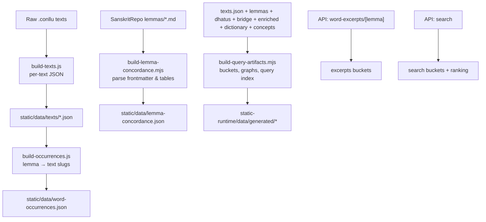
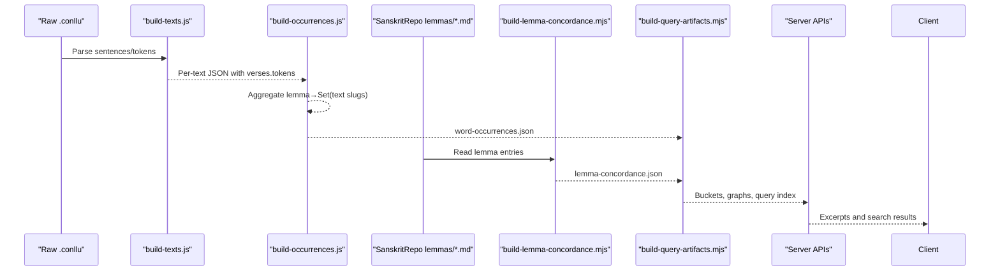
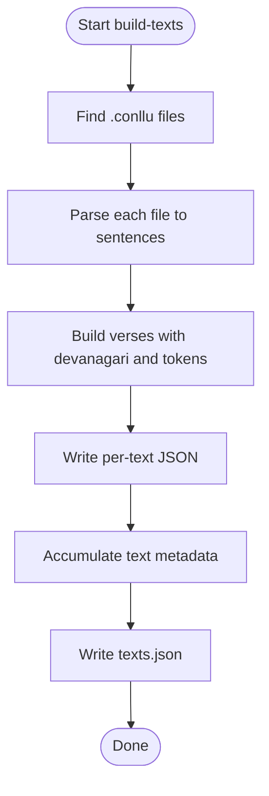
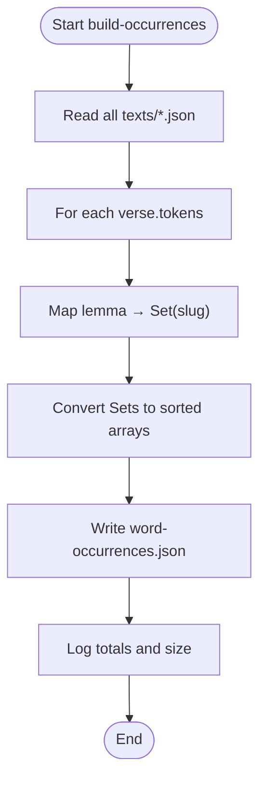
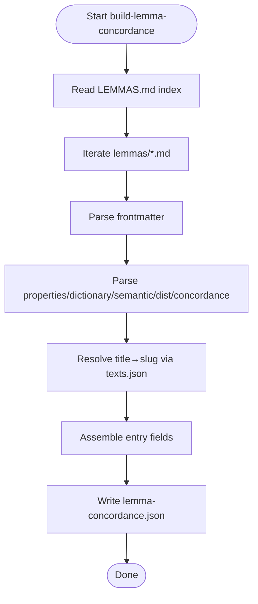
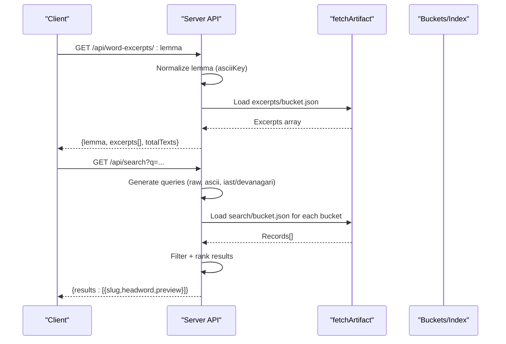
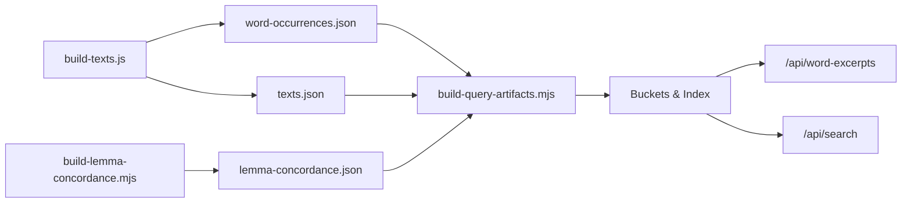

# Word Occurrence Analysis

<cite>
**Referenced Files in This Document**
- [build-occurrences.js](file://scripts/build-occurrences.js)
- [migrate-word-occurrences.mjs](file://scripts/migrate-word-occurrences.mjs)
- [build-lemma-concordance.mjs](file://scripts/build-lemma-concordance.mjs)
- [build-query-artifacts.mjs](file://scripts/lib/build-query-artifacts.mjs)
- [artifacts.mjs](file://scripts/lib/artifacts.mjs)
- [notable-lemmas.mjs](file://scripts/lib/notable-lemmas.mjs)
- [build-texts.js](file://scripts/build-texts.js)
- [texts.json](file://static/data/texts.json)
- [+server.ts (word-excerpts)](file://src/routes/api/word-excerpts/[lemma]/+server.ts)
- [+server.ts (search)](file://src/routes/api/search/+server.ts)
- [artifacts.ts](file://src/lib/data/artifacts.ts)
</cite>

## Table of Contents
1. Introduction
2. Project Structure
3. Core Components
4. Architecture Overview
5. Detailed Component Analysis
6. Dependency Analysis
7. Performance Considerations
8. Troubleshooting Guide
9. Conclusion

## Introduction
This document explains the word occurrence analysis system that transforms parsed Sanskrit text data into lemma frequency statistics and concordance information. It covers how token frequencies are aggregated across the corpus, how lemma-to-text mappings are built, and how search indices are created for exploration features. The output includes occurrence counts, distribution patterns, and relationship mappings used by the search and exploration interfaces.

## Project Structure
The system is composed of build scripts that generate static artifacts consumed by runtime APIs:
- Text parsing and per-text JSON generation
- Corpus-wide lemma occurrence mapping
- Concordance and dictionary enrichment from external wiki sources
- Query artifact generation with buckets and indexes
- Runtime API endpoints serving excerpts and search results



**Diagram sources**
- [build-texts.js](file://scripts/build-texts.js)
- [build-occurrences.js](file://scripts/build-occurrences.js)
- [build-lemma-concordance.mjs](file://scripts/build-lemma-concordance.mjs)
- [build-query-artifacts.mjs](file://scripts/lib/build-query-artifacts.mjs)
- [+server.ts (word-excerpts)](file://src/routes/api/word-excerpts/[lemma]/+server.ts)
- [+server.ts (search)](file://src/routes/api/search/+server.ts)

**Section sources**
- [build-texts.js](file://scripts/build-texts.js)
- [build-occurrences.js](file://scripts/build-occurrences.js)
- [build-lemma-concordance.mjs](file://scripts/build-lemma-concordance.mjs)
- [build-query-artifacts.mjs](file://scripts/lib/build-query-artifacts.mjs)

## Core Components
- Text builder: Parses .conllu files into verses and tokens, writes per-text JSON and a metadata index.
- Occurrence builder: Scans all text JSONs to map each lemma to the set of text slugs where it appears.
- Concordance builder: Reads lemma markdown entries to extract properties, definitions, semantic classification, top distribution rows, and sample concordance lines.
- Query artifact builder: Produces searchable buckets, graph artifacts, excerpt buckets, and a query index using normalized keys and bucketing.
- Migration utility: Converts legacy title-based values in occurrences to ASCII slugs for stable URL usage.
- Runtime APIs: Serve excerpts and search results using precomputed buckets and indexes.

**Section sources**
- [build-texts.js](file://scripts/build-texts.js)
- [build-occurrences.js](file://scripts/build-occurrences.js)
- [build-lemma-concordance.mjs](file://scripts/build-lemma-concordance.mjs)
- [build-query-artifacts.mjs](file://scripts/lib/build-query-artifacts.mjs)
- [migrate-word-occurrences.mjs](file://scripts/migrate-word-occurrences.mjs)
- [+server.ts (word-excerpts)](file://src/routes/api/word-excerpts/[lemma]/+server.ts)
- [+server.ts (search)](file://src/routes/api/search/+server.ts)

## Architecture Overview
The pipeline converts raw annotated text into multiple artifacts optimized for fast client-side lookup and visualization. Normalization and bucketing ensure consistent key resolution across diacritics and transliterations.



**Diagram sources**
- [build-texts.js](file://scripts/build-texts.js)
- [build-occurrences.js](file://scripts/build-occurrences.js)
- [build-lemma-concordance.mjs](file://scripts/build-lemma-concordance.mjs)
- [build-query-artifacts.mjs](file://scripts/lib/build-query-artifacts.mjs)
- [+server.ts (word-excerpts)](file://src/routes/api/word-excerpts/[lemma]/+server.ts)
- [+server.ts (search)](file://src/routes/api/search/+server.ts)

## Detailed Component Analysis

### Text Parsing and Tokenization
- Input: .conllu files organized by text folders.
- Processing: Extracts chapter, sentence IDs, counters, and tokens including form, lemma, upos, feats, and derived slug.
- Output: Per-text JSON with verses and tokens; global texts.json metadata with token and verse counts.



**Diagram sources**
- [build-texts.js](file://scripts/build-texts.js)

**Section sources**
- [build-texts.js](file://scripts/build-texts.js)
- [texts.json](file://static/data/texts.json)

### Lemma Occurrence Mapping
- Aggregation: Iterates all text JSONs, collects unique text slugs per lemma using sets.
- Output: A JSON object keyed by lemma with sorted arrays of text slugs.
- Migration: Converts legacy title-like values to ASCII slugs using exact and fuzzy matching against texts.json.



**Diagram sources**
- [build-occurrences.js](file://scripts/build-occurrences.js)
- [migrate-word-occurrences.mjs](file://scripts/migrate-word-occurrences.mjs)

**Section sources**
- [build-occurrences.js](file://scripts/build-occurrences.js)
- [migrate-word-occurrences.mjs](file://scripts/migrate-word-occurrences.mjs)

### Concordance and Dictionary Enrichment
- Sources: External wiki lemmas markdown files with frontmatter and sections for properties, dictionary definitions, semantic classification, text distribution, and concordance samples.
- Parsing: Minimal frontmatter parser, table parsers, and section extractors produce structured fields.
- Output: A JSON object keyed by normalized lemma containing part-of-speech, occurrence counts, text appearance count, concatenated definitions, semantic classification, top distribution rows, and sample concordance entries.



**Diagram sources**
- [build-lemma-concordance.mjs](file://scripts/build-lemma-concordance.mjs)

**Section sources**
- [build-lemma-concordance.mjs](file://scripts/build-lemma-concordance.mjs)

### Query Artifacts and Search Index
- Bucketing: Uses asciiKey and bucketFor to normalize keys and distribute entries into two-character buckets for efficient retrieval.
- Search buckets: Builds records with slug, headword, normalized, plain, and preview; indexed under multiple normalized keys.
- Excerpt buckets: Precomputes top concordance samples per lemma for quick loading.
- Graph artifacts: Generates root-to-word relationships, lemma-to-text edges, and a query index mapping normalized forms to slugs.
- Notable lemmas: Filters out high-frequency function words when generating notable lists.

```mermaid
classDiagram
class Artifacts {
+asciiKey(value) string
+bucketFor(value) string
+pageFilename(page) string
+versionedArtifactPath(version, relativePath) string
}
class BuildQueryArtifacts {
+createLemmaSlugResolver(lemmas)
+buildTextArtifacts(meta, text, description, resolveLemmaSlug)
+buildSearchBuckets(lemmas)
+buildLemmaDetails({lemmas,dictionary,dhatus,bridge,enriched,occurrences,concordance,concepts})
+buildRootDetails({dhatus,enriched,bridge,dictionary,occurrences})
+buildConceptArtifacts(concepts, lemmas)
+buildExcerptBuckets(concordance)
+buildGraphArtifacts({lemmas,dhatus,bridge,enriched,occurrences,dictionary,texts})
}
Artifacts <.. BuildQueryArtifacts : "uses"
```

**Diagram sources**
- [artifacts.mjs](file://scripts/lib/artifacts.mjs)
- [build-query-artifacts.mjs](file://scripts/lib/build-query-artifacts.mjs)

**Section sources**
- [build-query-artifacts.mjs](file://scripts/lib/build-query-artifacts.mjs)
- [artifacts.mjs](file://scripts/lib/artifacts.mjs)
- [notable-lemmas.mjs](file://scripts/lib/notable-lemmas.mjs)

### Runtime APIs
- Word excerpts endpoint: Accepts a lemma, normalizes it, resolves the bucket, and returns up to 30 excerpts with text slug, title, reference, snippet, verse index, and surface form.
- Search endpoint: Accepts a query, generates multiple normalized forms, fetches relevant buckets, filters by substring matches, ranks results, and returns limited previews.



**Diagram sources**
- [+server.ts (word-excerpts)](file://src/routes/api/word-excerpts/[lemma]/+server.ts)
- [+server.ts (search)](file://src/routes/api/search/+server.ts)
- [artifacts.ts](file://src/lib/data/artifacts.ts)

**Section sources**
- [+server.ts (word-excerpts)](file://src/routes/api/word-excerpts/[lemma]/+server.ts)
- [+server.ts (search)](file://src/routes/api/search/+server.ts)
- [artifacts.ts](file://src/lib/data/artifacts.ts)

## Dependency Analysis
- Data flow dependencies:
  - build-texts.js produces per-text JSONs and texts.json.
  - build-occurrences.js depends on per-text JSONs to create word-occurrences.json.
  - build-lemma-concordance.mjs depends on external wiki lemmas and texts.json to produce lemma-concordance.json.
  - build-query-artifacts.mjs consumes lemmas, dhatus, bridge, enriched, dictionary, concepts, occurrences, and concordance to generate buckets, graphs, and query index.
- Key normalization utilities:
  - asciiKey and bucketFor ensure consistent key resolution across diacritics and transliterations.
- Runtime consumption:
  - Server endpoints consume precomputed buckets and indexes to serve fast responses.



**Diagram sources**
- [build-texts.js](file://scripts/build-texts.js)
- [build-occurrences.js](file://scripts/build-occurrences.js)
- [build-lemma-concordance.mjs](file://scripts/build-lemma-concordance.mjs)
- [build-query-artifacts.mjs](file://scripts/lib/build-query-artifacts.mjs)
- [+server.ts (word-excerpts)](file://src/routes/api/word-excerpts/[lemma]/+server.ts)
- [+server.ts (search)](file://src/routes/api/search/+server.ts)

**Section sources**
- [build-texts.js](file://scripts/build-texts.js)
- [build-occurrences.js](file://scripts/build-occurrences.js)
- [build-lemma-concordance.mjs](file://scripts/build-lemma-concordance.mjs)
- [build-query-artifacts.mjs](file://scripts/lib/build-query-artifacts.mjs)

## Performance Considerations
- Use of sets for deduplication ensures O(1) average-time membership checks during occurrence aggregation.
- Sorting only occurs once per lemma’s text list to keep outputs deterministic and cache-friendly.
- Bucketing reduces lookup complexity by distributing keys into small, targeted files.
- Limiting concordance samples and excerpt sizes prevents large payloads.
- ASCII normalization avoids repeated heavy transformations at runtime.

[No sources needed since this section provides general guidance]

## Troubleshooting Guide
- Missing texts directory: The occurrence builder exits early if no texts directory exists; verify input paths and environment variables.
- Unmatched titles in migration: The migration utility logs unmatched values; check texts.json titles and ensure consistency with legacy values.
- Empty search results: Ensure query length and normalization; verify that search buckets exist and contain expected records.
- Concordance not found: Confirm that lemma-concordance.json contains the normalized lemma key and that excerpt buckets were generated.

**Section sources**
- [build-occurrences.js](file://scripts/build-occurrences.js)
- [migrate-word-occurrences.mjs](file://scripts/migrate-word-occurrences.mjs)
- [+server.ts (search)](file://src/routes/api/search/+server.ts)
- [+server.ts (word-excerpts)](file://src/routes/api/word-excerpts/[lemma]/+server.ts)

## Conclusion
The word occurrence analysis system integrates text parsing, corpus-wide frequency aggregation, concordance enrichment, and query artifact generation to power search and exploration features. By leveraging robust normalization and bucketing strategies, it delivers fast, reliable access to lemma frequencies, distributions, and textual contexts across the entire corpus.