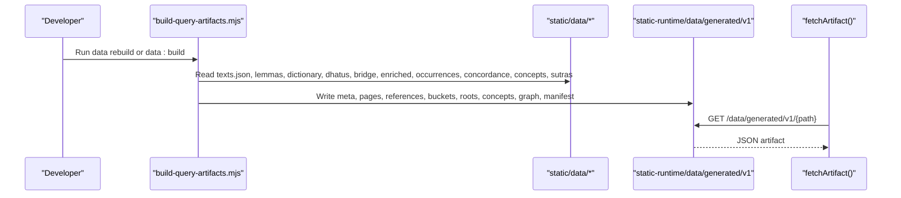
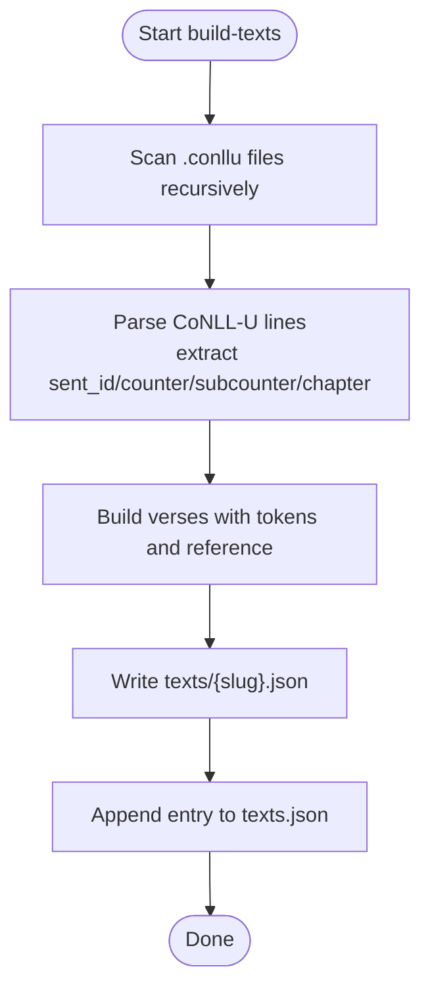
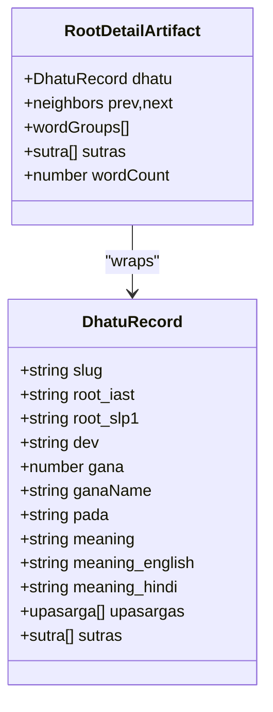
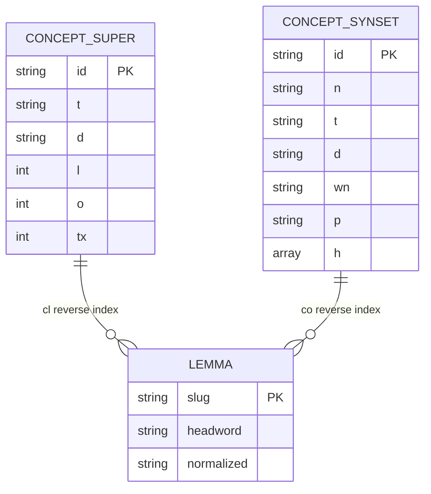
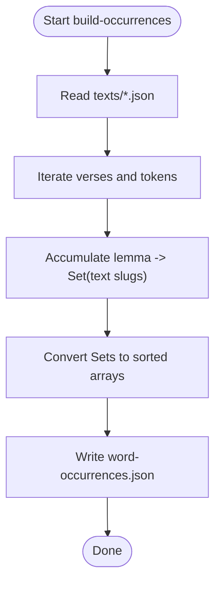
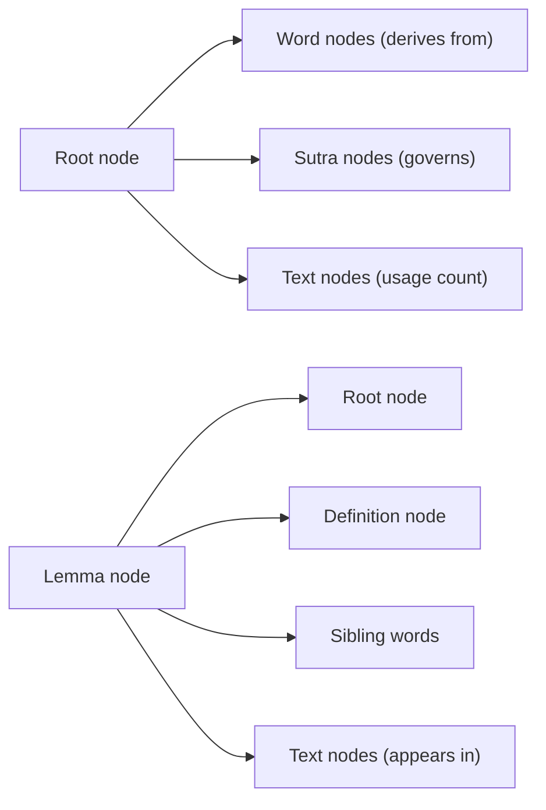
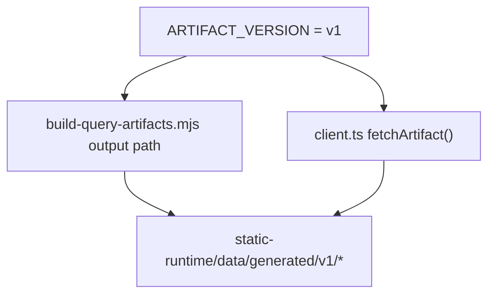
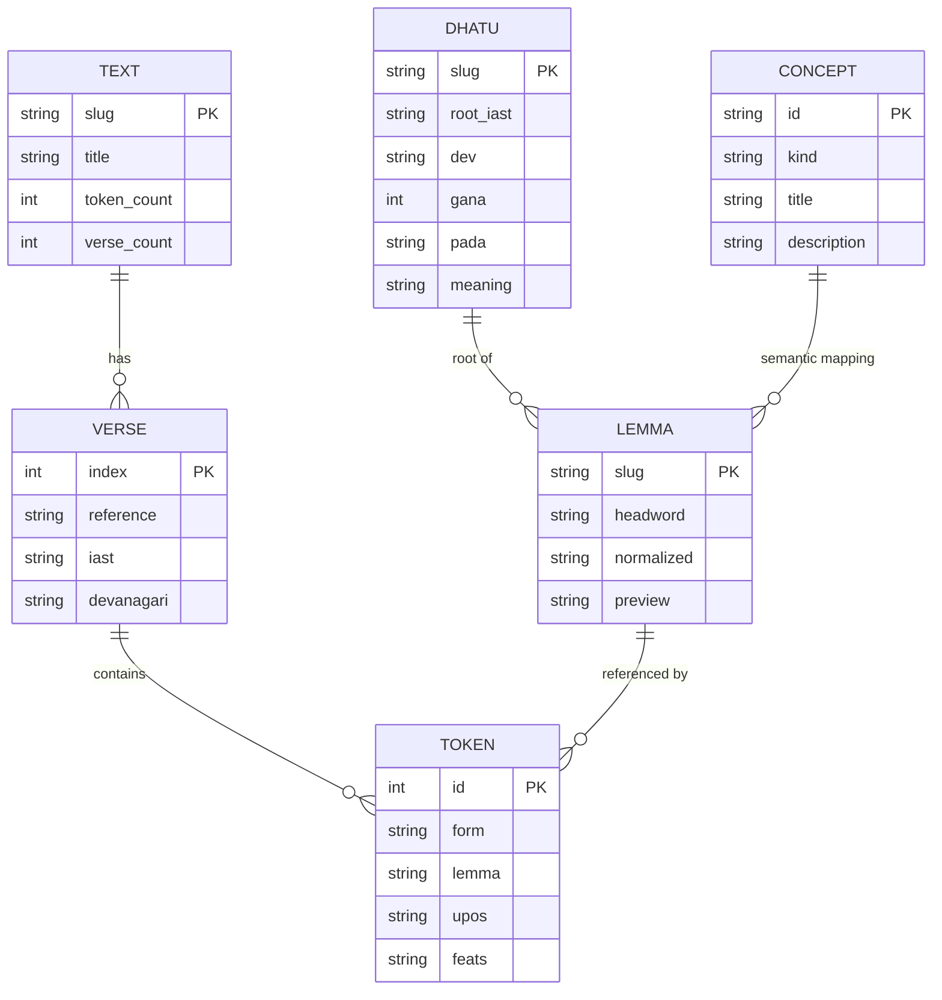

# Data Architecture

<cite>
**Referenced Files in This Document**
- [artifact-contracts.md](file://src/routes/docs/developer/artifact-contracts.md)
- [corpus-pipeline.md](file://src/routes/docs/developer/corpus-pipeline.md)
- [artifacts.mjs](file://scripts/lib/artifacts.mjs)
- [build-texts.js](file://scripts/build-texts.js)
- [build-query-artifacts.mjs](file://scripts/build-query-artifacts.mjs)
- [build-lemma-concordance.mjs](file://scripts/build-lemma-concordance.mjs)
- [build-concept-graph.mjs](file://scripts/build-concept-graph.mjs)
- [build-occurrences.js](file://scripts/build-occurrences.js)
- [types.ts](file://src/lib/data/types.ts)
- [client.ts](file://src/lib/data/client.ts)
- [artifacts.ts](file://src/lib/data/artifacts.ts)
- [request-cache.js](file://src/lib/data/request-cache.js)
- [texts.json](file://static/data/texts.json)
- [DEVELOPERS.md](file://docs/DEVELOPERS.md)
</cite>

## Table of Contents
1. Introduction
2. Project Structure
3. Core Components
4. Architecture Overview
5. Detailed Component Analysis
6. Dependency Analysis
7. Performance Considerations
8. Troubleshooting Guide
9. Conclusion
10. Appendices

## Introduction
This document describes FractalDharma’s data architecture for Sanskrit texts, lemmas, dhātus (roots), and concepts. It specifies entity relationships, field definitions, artifact contracts, build pipeline stages, validation rules, performance strategies, lifecycle management, and security considerations. The system separates large canonical corpus inputs from compact, versioned runtime artifacts optimized for fast, bounded requests.

## Project Structure
The repository organizes data processing under scripts/, canonical corpus data under static/data/, and generated runtime artifacts under static-runtime/data/generated/v1. TypeScript types define the public artifact contracts consumed by routes and components.

```mermaid
graph TB
subgraph "Scripts"
A["build-texts.js"]
B["build-occurrences.js"]
C["build-lemma-concordance.mjs"]
D["build-concept-graph.mjs"]
E["build-query-artifacts.mjs"]
F["lib/artifacts.mjs"]
end
subgraph "Canonical Inputs (static/data)"
I1["texts/*.json"]
I2["texts.json"]
I3["lemmas.json"]
I4["dictionary.json"]
I5["dhatus.json"]
I6["dhatu-lemma.json"]
I7["dhatu-word-enriched.json"]
I8["word-occurrences.json"]
I9["lemma-concordance.json"]
I10["concepts.json"]
I11["sutras.json"]
end
subgraph "Runtime Artifacts (static-runtime/data/generated/v1)"
O1["texts/{slug}/meta.json"]
O2["texts/{slug}/pages/*.json"]
O3["texts/{slug}/references.json"]
O4["lemmas/{bucket}.json"]
O5["roots/{slug}.json"]
O6["search/{bucket}.json"]
O7["excerpts/{bucket}.json"]
O8["concepts/index.json + details"]
O9["graph/*"]
O10["sutras/{bucket}.json"]
O11["manifest.json"]
end
A --> I1
A --> I2
B --> I1
C --> I3
D --> I9
E --> I2
E --> I3
E --> I4
E --> I5
E --> I6
E --> I7
E --> I8
E --> I9
E --> I10
E --> I11
E --> O1
E --> O2
E --> O3
E --> O4
E --> O5
E --> O6
E --> O7
E --> O8
E --> O9
E --> O10
E --> O11
```



**Diagram sources**
- [build-texts.js:1-191](file://scripts/build-texts.js#L1-L191)
- [build-occurrences.js:1-48](file://scripts/build-occurrences.js#L1-L48)
- [build-lemma-concordance.mjs:1-271](file://scripts/build-lemma-concordance.mjs#L1-L271)
- [build-concept-graph.mjs:1-188](file://scripts/build-concept-graph.mjs#L1-L188)
- [build-query-artifacts.mjs:1-207](file://scripts/build-query-artifacts.mjs#L1-L207)
- [artifacts.mjs:1-24](file://scripts/lib/artifacts.mjs#L1-L24)

**Section sources**
- [corpus-pipeline.md:1-52](file://src/routes/docs/developer/corpus-pipeline.md#L1-L52)
- [artifact-contracts.md:1-53](file://src/routes/docs/developer/artifact-contracts.md#L1-L53)

## Core Components
- Text entities: verses with tokens, references, and page slices.
- Lemma entities: normalized headwords, previews, and optional root links.
- Dhātu (root) entities: grammatical metadata, meanings, upasargas, sutras.
- Concept entities: supersenses and synsets with hierarchy and lemma membership.
- Occurrence mappings: lemma to text slugs.
- Concordance samples: top contextual examples per lemma.
- Graph artifacts: nodes and edges for roots, lemmas, and texts.

Key artifact contracts (TypeScript interfaces):
- TextMetaArtifact, TextPageArtifact, TextReferenceArtifact
- LemmaRecord, LemmaDetailArtifact
- DhatuRecord, RootDetailArtifact
- Concept index and details produced by concept builder

**Section sources**
- [types.ts:1-92](file://src/lib/data/types.ts#L1-L92)
- [artifact-contracts.md:1-53](file://src/routes/docs/developer/artifact-contracts.md#L1-L53)

## Architecture Overview
The pipeline transforms raw CoNLL-U and wiki-style sources into canonical JSON, then projects query-shaped artifacts. Runtime clients fetch only what they need using versioned paths and bucketed indexes.



**Diagram sources**
- [build-query-artifacts.mjs:1-207](file://scripts/build-query-artifacts.mjs#L1-L207)
- [client.ts:1-17](file://src/lib/data/client.ts#L1-L17)
- [artifacts.ts:1-27](file://src/lib/data/artifacts.ts#L1-L27)

**Section sources**
- [corpus-pipeline.md:1-52](file://src/routes/docs/developer/corpus-pipeline.md#L1-L52)
- [artifact-contracts.md:1-53](file://src/routes/docs/developer/artifact-contracts.md#L1-L53)

## Detailed Component Analysis

### Text Model and Page Slicing
- Input: CoNLL-U files parsed into sentences with tokens; converted to verses with iast/devanagari and token arrays.
- Output: Per-text JSON with slug, title, verses; plus a global texts.json index.
- Artifact generation: Pages sliced into fixed-size chunks (PAGE_SIZE=20). References map verse index to page number. Descriptions are sanitized HTML.



**Diagram sources**
- [build-texts.js:1-191](file://scripts/build-texts.js#L1-L191)

**Section sources**
- [build-texts.js:1-191](file://scripts/build-texts.js#L1-L191)
- [build-query-artifacts.mjs:64-122](file://scripts/build-query-artifacts.mjs#L64-L122)
- [artifact-contracts.md:16-31](file://src/routes/docs/developer/artifact-contracts.md#L16-L31)

### Lemma Records and Detail Projection
- LemmaRecord fields: slug, headword, normalized, preview, optional dhatuSlugs.
- LemmaDetailArtifact merges dictionary entries, root info, occurrences, concordance sample, and concept mapping.
- Buckets: Two-character ASCII-normalized keys for efficient lookup without monolithic indexes.

```mermaid
classDiagram
class LemmaRecord {
+string slug
+string headword
+string normalized
+string preview
+string[] dhatuSlugs
}
class LemmaDetailArtifact {
+LemmaRecord lemma
+string[] englishDefs
+DhatuRecord rootInfo
+string[] textOccurrences
+object concordance
+{conceptId,name}[] concepts
}
LemmaDetailArtifact --> LemmaRecord : "contains"
```

**Diagram sources**
- [types.ts:40-70](file://src/lib/data/types.ts#L40-L70)
- [build-query-artifacts.mjs:144-184](file://scripts/build-query-artifacts.mjs#L144-L184)

**Section sources**
- [types.ts:40-70](file://src/lib/data/types.ts#L40-L70)
- [build-query-artifacts.mjs:124-184](file://scripts/build-query-artifacts.mjs#L124-L184)
- [build-lemma-concordance.mjs:1-271](file://scripts/build-lemma-concordance.mjs#L1-L271)

### Dhātu (Root) Model and Root Details
- DhatuRecord includes identity, Devanagari, gaṇa/pada, meaning, upasargas, and sutras.
- RootDetailArtifact groups words by derivation type (root/guṇa/vṛddhi/other), includes neighbor navigation, sutras, and word count.



**Diagram sources**
- [types.ts:48-91](file://src/lib/data/types.ts#L48-L91)
- [build-query-artifacts.mjs:221-267](file://scripts/build-query-artifacts.mjs#L221-L267)

**Section sources**
- [types.ts:48-91](file://src/lib/data/types.ts#L48-L91)
- [build-query-artifacts.mjs:186-267](file://scripts/build-query-artifacts.mjs#L186-L267)

### Concepts: Supersenses and Synsets
- concepts.json contains supersense summaries, synset metadata, and reverse indices linking lemmas to concepts.
- Concept artifacts compute ISA chains, children, and member lemmas.



**Diagram sources**
- [build-concept-graph.mjs:1-188](file://scripts/build-concept-graph.mjs#L1-L188)
- [build-query-artifacts.mjs:269-308](file://scripts/build-query-artifacts.mjs#L269-L308)

**Section sources**
- [build-concept-graph.mjs:1-188](file://scripts/build-concept-graph.mjs#L1-L188)
- [build-query-artifacts.mjs:269-308](file://scripts/build-query-artifacts.mjs#L269-L308)

### Occurrences and Concordance Samples
- Occurrences: lemma → set of text slugs derived by scanning all text JSONs.
- Concordance: top samples per lemma extracted from lemma markdown sections.



**Diagram sources**
- [build-occurrences.js:1-48](file://scripts/build-occurrences.js#L1-L48)

**Section sources**
- [build-occurrences.js:1-48](file://scripts/build-occurrences.js#L1-L48)
- [build-lemma-concordance.mjs:160-190](file://scripts/build-lemma-concordance.mjs#L160-L190)

### Graph Artifacts
- Roots: nodes for root, related words, same-gaṇa/pada dhātus, sutras, and top texts by usage.
- Lemmas: nodes for lemma, definition snippet, root, sibling words, sutras, and text appearances.
- Texts: nodes for text and top lemmas appearing within.



**Diagram sources**
- [build-query-artifacts.mjs:331-456](file://scripts/build-query-artifacts.mjs#L331-L456)

**Section sources**
- [build-query-artifacts.mjs:331-456](file://scripts/build-query-artifacts.mjs#L331-L456)

## Dependency Analysis
- Canonical inputs are read once by the artifact builder and projected into multiple artifact groups.
- Versioning is enforced via constants on both build and client sides to prevent cache mismatches.
- Bucketing ensures bounded requests without large indexes.



**Diagram sources**
- [artifacts.ts:1-27](file://src/lib/data/artifacts.ts#L1-L27)
- [client.ts:1-17](file://src/lib/data/client.ts#L1-L17)
- [build-query-artifacts.mjs:26-38](file://scripts/build-query-artifacts.mjs#L26-L38)

**Section sources**
- [artifact-contracts.md:10-18](file://src/routes/docs/developer/artifact-contracts.md#L10-L18)
- [artifacts.ts:1-27](file://src/lib/data/artifacts.ts#L1-L27)

## Performance Considerations
- Request caching: In-flight deduplication and completed result caching avoid duplicate network calls.
- Bounded payloads: Page slicing and bucketing limit payload sizes per request.
- Sanitization at build time reduces runtime overhead and XSS risk.
- Avoid whole-corpus joins at runtime; rely on precomputed projections.

[No sources needed since this section provides general guidance]

## Troubleshooting Guide
Common issues and checks:
- Missing required inputs: The artifact builder asserts presence of canonical files before generating outputs.
- Incorrect source roots: Verify environment variables for raw and wiki directories.
- Stale caches: Clear browser cache or use new artifact versions; ensure ARTIFACT_VERSION matches between build and client.
- Large deployments: static-runtime can be large; consider publishing generated v1 tree to object storage/CDN and configuring base URL.

**Section sources**
- [build-query-artifacts.mjs:56-79](file://scripts/build-query-artifacts.mjs#L56-L79)
- [corpus-pipeline.md:14-22](file://src/routes/docs/developer/corpus-pipeline.md#L14-L22)
- [DEVELOPERS.md:278-295](file://docs/DEVELOPERS.md#L278-L295)

## Conclusion
FractalDharma’s data architecture cleanly separates canonical corpus data from optimized, versioned runtime artifacts. Entity models for texts, lemmas, dhātus, and concepts are well-defined and consistently projected into query-friendly JSON. The pipeline enforces safety, performance, and maintainability through sanitization, bucketing, caching, and strict versioning.

[No sources needed since this section summarizes without analyzing specific files]

## Appendices

### Data Validation Rules and Integrity Checks
- ASCII normalization and bucketing must remain consistent across build and client utilities.
- HTML sanitization allows only a conservative element and link allowlist.
- Reference mapping uses zero-based verse indices and computed page numbers based on PAGE_SIZE.
- Manifest includes schemaVersion, version, generatedAt, pageSize, and counts for cross-checks.

**Section sources**
- [build-query-artifacts.mjs:15-36](file://scripts/build-query-artifacts.mjs#L15-L36)
- [build-query-artifacts.mjs:182-194](file://scripts/build-query-artifacts.mjs#L182-L194)
- [artifact-contracts.md:46-53](file://src/routes/docs/developer/artifact-contracts.md#L46-L53)

### Database Schema Diagrams
Conceptual ER diagram for core entities and relationships:



[No sources needed since this diagram shows conceptual structure]

### Sample Data Structures
- Text index example: texts.json contains entries with slug, title, token_count, verse_count, file.
- Text page artifact: includes pagination fields and an array of verses.
- Root detail artifact: includes dhatu, neighbors, wordGroups, sutras, wordCount.

**Section sources**
- [texts.json:1-800](file://static/data/texts.json#L1-L800)
- [types.ts:13-38](file://src/lib/data/types.ts#L13-L38)
- [types.ts:72-91](file://src/lib/data/types.ts#L72-L91)

### Data Access Patterns
- Use fetchArtifact with request-scoped fetch to load versioned artifacts.
- Prefer bucketed lookups for lemmas, search, excerpts, and graph queries.
- Compose reader pages by fetching only necessary page slices.

**Section sources**
- [client.ts:1-17](file://src/lib/data/client.ts#L1-L17)
- [artifact-contracts.md:36-44](file://src/routes/docs/developer/artifact-contracts.md#L36-L44)

### Caching Strategies, Performance Optimizations, Memory Management
- In-memory request cache deduplicates concurrent requests and stores results.
- Avoid eager loading of entire corpus; fetch only needed artifacts.
- Keep payloads small via page slicing and bucketing.

**Section sources**
- [request-cache.js:1-44](file://src/lib/data/request-cache.js#L1-L44)
- [artifact-contracts.md:32-44](file://src/routes/docs/developer/artifact-contracts.md#L32-L44)

### Data Lifecycle Management, Versioning, and Migration
- Canonical data lives under static/data and is not deployed at runtime.
- Generated artifacts live under static-runtime/data/generated/v1 and are reproducible.
- Update ARTIFACT_VERSION in both build and client when changing incompatible schemas.
- Rebuild order is defined; use data:rebuild for full rebuild and data:build for artifact regeneration.

**Section sources**
- [corpus-pipeline.md:23-43](file://src/routes/docs/developer/corpus-pipeline.md#L23-L43)
- [artifact-contracts.md:10-18](file://src/routes/docs/developer/artifact-contracts.md#L10-L18)
- [DEVELOPERS.md:278-295](file://docs/DEVELOPERS.md#L278-L295)

### Security, Privacy, and Access Control
- HTML sanitization restricts allowed elements and href schemes during artifact generation.
- No user-authored content is rendered directly; all external HTML passes through sanitization.
- Access control is implicit via static asset serving; no sensitive data is included in artifacts.

**Section sources**
- [build-query-artifacts.mjs:15-36](file://scripts/build-query-artifacts.mjs#L15-L36)
- [artifact-contracts.md:50-53](file://src/routes/docs/developer/artifact-contracts.md#L50-L53)