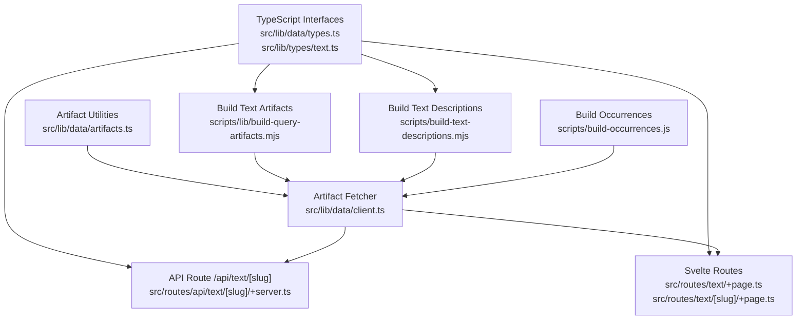
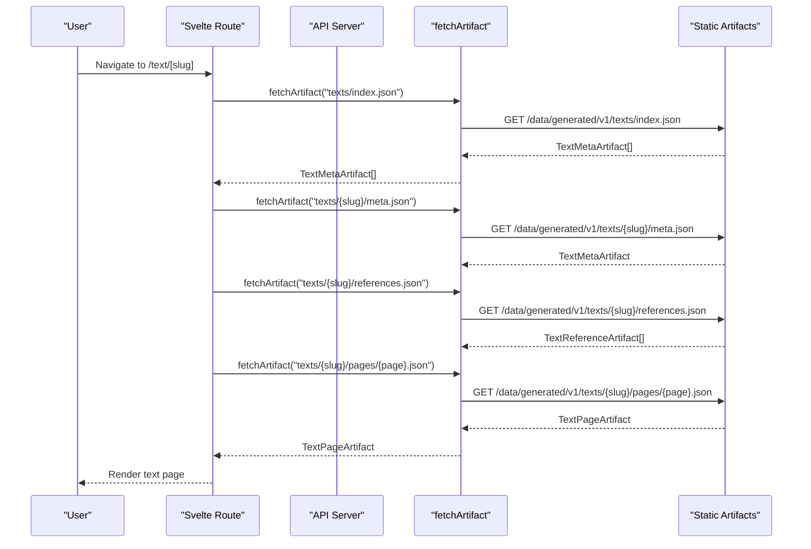
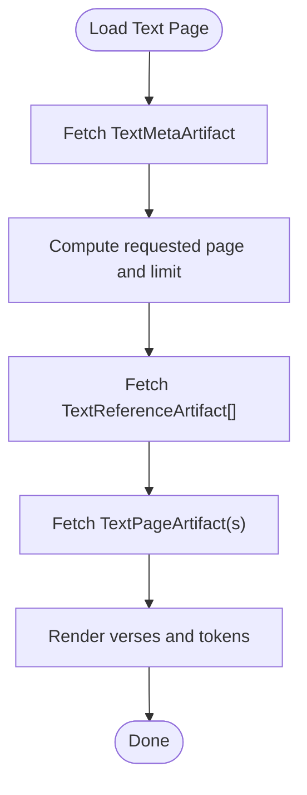
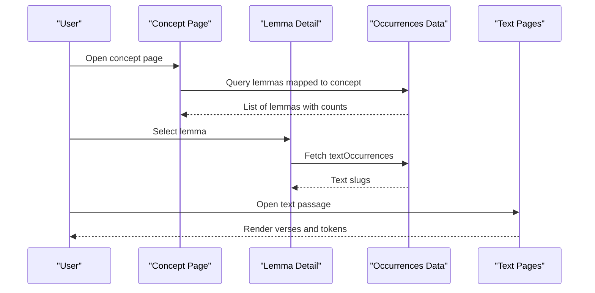
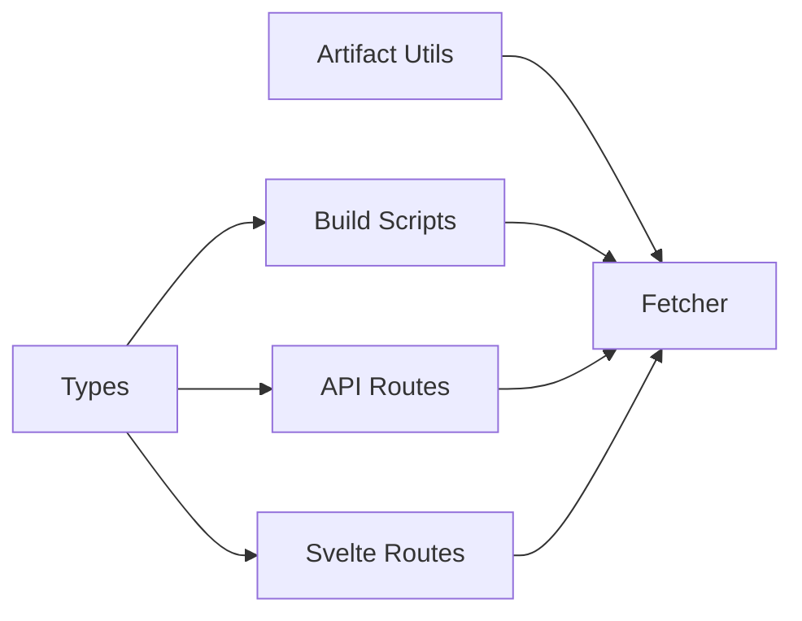
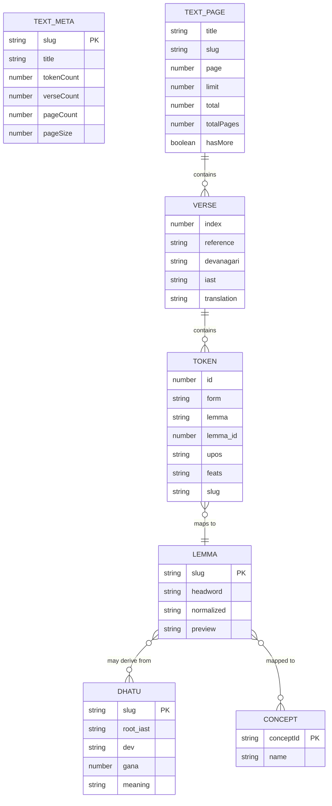

# Data Models and Schemas

<cite>
**Referenced Files in This Document**
- [types.ts](file://src/lib/data/types.ts)
- [text.ts](file://src/lib/types/text.ts)
- [artifacts.ts](file://src/lib/data/artifacts.ts)
- [client.ts](file://src/lib/data/client.ts)
- [build-query-artifacts.mjs](file://scripts/lib/build-query-artifacts.mjs)
- [build-text-descriptions.mjs](file://scripts/build-text-descriptions.mjs)
- [build-occurrences.js](file://scripts/build-occurrences.js)
- [artifact-contracts.md](file://src/routes/docs/developer/artifact-contracts.md)
- [dhatu-explorer.md](file://src/routes/docs/developer/dhatu-explorer.md)
- [exploring-concepts.md](file://src/routes/docs/user/exploring-concepts.md)
- [discovery-pathways.md](file://src/routes/docs/user/discovery-pathways.md)
- [+server.ts](file://src/routes/api/text/[slug]/+server.ts)
- [+page.ts (text list)](file://src/routes/text/+page.ts)
- [+page.ts (text detail)](file://src/routes/text/[slug]/+page.ts)
</cite>

## Table of Contents
1. Introduction
2. Project Structure
3. Core Components
4. Architecture Overview
5. Detailed Component Analysis
6. Dependency Analysis
7. Performance Considerations
8. Troubleshooting Guide
9. Conclusion
10. Appendices

## Introduction
This document defines the core data models and schemas used by FractalDharma for text navigation, lexical analysis, and semantic exploration. It specifies the interfaces TextMetaArtifact, TextPageArtifact, LemmaRecord, DhatuRecord, LemmaDetailArtifact, and RootDetailArtifact, including field definitions, types, validation rules, and relationships. It also explains how texts reference lemmas, lemmas connect to dhātus, and concepts map to word occurrences, with sample JSON structures and usage patterns across the application.

## Project Structure
The data models are declared as TypeScript interfaces and consumed by build scripts and runtime routes:
- Type declarations live under src/lib/data/types.ts and src/lib/types/text.ts.
- Artifact path utilities and versioning live under src/lib/data/artifacts.ts.
- Client-side artifact fetching is implemented in src/lib/data/client.ts.
- Build-time pipelines generate artifacts consumed by the UI:
  - Text pages and descriptions: scripts/lib/build-query-artifacts.mjs and scripts/build-text-descriptions.mjs.
  - Word occurrences: scripts/build-occurrences.js.
- API endpoints serve paginated text pages using these models.



**Diagram sources**
- [types.ts:1-91](file://src/lib/data/types.ts#L1-L91)
- [text.ts:1-25](file://src/lib/types/text.ts#L1-L25)
- [artifacts.ts:1-27](file://src/lib/data/artifacts.ts#L1-L27)
- [client.ts:1-17](file://src/lib/data/client.ts#L1-L17)
- [build-query-artifacts.mjs:64-103](file://scripts/lib/build-query-artifacts.mjs#L64-L103)
- [build-text-descriptions.mjs:1-281](file://scripts/build-text-descriptions.mjs#L1-L281)
- [build-occurrences.js:1-48](file://scripts/build-occurrences.js#L1-L48)
- [+server.ts:1-18](file://src/routes/api/text/[slug]/+server.ts#L1-L18)
- [+page.ts (text list):1-8](file://src/routes/text/+page.ts#L1-L8)
- [+page.ts (text detail):1-32](file://src/routes/text/[slug]/+page.ts#L1-L32)

**Section sources**
- [types.ts:1-91](file://src/lib/data/types.ts#L1-L91)
- [text.ts:1-25](file://src/lib/types/text.ts#L1-L25)
- [artifacts.ts:1-27](file://src/lib/data/artifacts.ts#L1-L27)
- [client.ts:1-17](file://src/lib/data/client.ts#L1-L17)
- [build-query-artifacts.mjs:64-103](file://scripts/lib/build-query-artifacts.mjs#L64-L103)
- [build-text-descriptions.mjs:1-281](file://scripts/build-text-descriptions.mjs#L1-L281)
- [build-occurrences.js:1-48](file://scripts/build-occurrences.js#L1-L48)
- [+server.ts:1-18](file://src/routes/api/text/[slug]/+server.ts#L1-L18)
- [+page.ts (text list):1-8](file://src/routes/text/+page.ts#L1-L8)
- [+page.ts (text detail):1-32](file://src/routes/text/[slug]/+page.ts#L1-L32)

## Core Components
This section documents the primary data models and their fields, constraints, and intended use.

### TextDescription
- title: string — Human-readable title for the text.
- description: string — Short summary or abstract.
- type: string — Classification label (e.g., genre or tradition).
- tags: string[] — Curated tags for filtering and discovery.
- related: Array<{ title: string; slug: string; similarity: number }> — Related texts ranked by similarity score.
- topLemmas: Array<{ lemma: string; count: number; sourcePageId: string | null }> — Notable lemmas with occurrence counts and optional source page identifiers.
- bodyHtml: string — Sanitized HTML prose derived from markdown; safe for rendering.

Validation and business logic:
- related entries must have a non-empty title and a valid slug; similarity should be numeric and typically between 0 and 1.
- topLemmas exclude high-frequency function words via a curated filter during build time.
- bodyHtml is sanitized at build time to allow only a conservative set of elements and links.

Sample JSON structure:
{
  "title": "Bhagavadgītā",
  "description": "A philosophical dialogue on duty and devotion.",
  "type": "itihasa-purana",
  "tags": ["philosophy", "devotion"],
  "related": [
    {"title": "Upaniṣads", "slug": "upanishads", "similarity": 0.82}
  ],
  "topLemmas": [
    {"lemma": "dharma", "count": 120, "sourcePageId": "12"},
    {"lemma": "karma", "count": 95, "sourcePageId": "13"}
  ],
  "bodyHtml": "<p>A concise introduction...</p>"
}

**Section sources**
- [types.ts:3-11](file://src/lib/data/types.ts#L3-L11)
- [build-text-descriptions.mjs:105-140](file://scripts/build-text-descriptions.mjs#L105-L140)
- [artifact-contracts.md:44-53](file://src/routes/docs/developer/artifact-contracts.md#L44-L53)

### TextMetaArtifact
- slug: string — Canonical identifier for the text.
- title: string — Display title.
- tokenCount: number — Total tokens across all verses.
- verseCount: number — Total verses.
- pageCount: number — Number of precomputed pages.
- pageSize: number — Base page size used during artifact generation.
- description: TextDescription | null — Optional rich description.

Constraints:
- verseCount and tokenCount must be consistent with the underlying verses and tokens.
- pageSize reflects the artifact generator’s PAGE_SIZE constant.

Sample JSON structure:
{
  "slug": "bhagavadgita",
  "title": "Bhagavadgītā",
  "tokenCount": 7200,
  "verseCount": 700,
  "pageCount": 35,
  "pageSize": 20,
  "description": { ... }
}

**Section sources**
- [types.ts:13-21](file://src/lib/data/types.ts#L13-L21)
- [build-query-artifacts.mjs:64-103](file://scripts/lib/build-query-artifacts.mjs#L64-L103)

### TextPageArtifact
- title: string — Page title (often the text title).
- slug: string — Text slug.
- page: number — Current page index (1-based).
- limit: number — Number of verses per page.
- total: number — Total verses in the text.
- totalPages: number — Computed total pages.
- hasMore: boolean — Whether additional pages exist.
- verses: Verse[] — Array of verse objects for this page.

Constraints:
- page must be within [1, totalPages].
- limit is validated against allowed values in route handling.

Sample JSON structure:
{
  "title": "Bhagavadgītā",
  "slug": "bhagavadgita",
  "page": 1,
  "limit": 20,
  "total": 700,
  "totalPages": 35,
  "hasMore": true,
  "verses": [
    {
      "index": 1,
      "reference": "BG 1.1",
      "devanagari": "...",
      "iast": "...",
      "translation": "...",
      "tokens": [
        {
          "id": 1,
          "form": "dharmo",
          "lemma": "dharma",
          "lemma_id": 101,
          "upos": "NOUN",
          "feats": "Case=Nom|Number=Sing",
          "slug": "dharma"
        }
      ]
    }
  ]
}

**Section sources**
- [types.ts:23-32](file://src/lib/data/types.ts#L23-L32)
- [text.ts:6-24](file://src/lib/types/text.ts#L6-L24)
- [+server.ts:1-18](file://src/routes/api/text/[slug]/+server.ts#L1-L18)
- [+page.ts (text detail):1-32](file://src/routes/text/[slug]/+page.ts#L1-L32)

### TextReferenceArtifact
- reference: string — Source reference string (e.g., chapter:verse).
- index: number — Zero-based verse index.
- page: number — Source page containing the reference.

Usage:
- Reader navigation derives target display pages from verse index and active page size using references.json mappings.

Sample JSON structure:
[
  {"reference": "BG 1.1", "index": 0, "page": 1},
  {"reference": "BG 1.2", "index": 1, "page": 1}
]

**Section sources**
- [types.ts:34-38](file://src/lib/data/types.ts#L34-L38)
- [artifact-contracts.md:44-53](file://src/routes/docs/developer/artifact-contracts.md#L44-L53)

### LemmaRecord
- slug: string — Canonical lemma identifier.
- headword: string — Surface form used as dictionary headword.
- normalized: string — Normalized form for matching and indexing.
- preview: string — Short preview snippet (truncated during build).
- dhatuSlugs?: string[] — Optional array of root slugs associated with the lemma.

Constraints:
- slug and headword must be non-empty.
- dhatuSlugs may be empty if no root association is known.

Sample JSON structure:
{
  "slug": "dharma",
  "headword": "dharma",
  "normalized": "dharma",
  "preview": "righteousness, duty...",
  "dhatuSlugs": ["√dhṛ"]
}

**Section sources**
- [types.ts:40-46](file://src/lib/data/types.ts#L40-L46)
- [build-bundles.js:125-132](file://scripts/build-bundles.js#L125-L132)

### DhatuRecord
- slug: string — Root identifier.
- root_iast: string — IAST representation of the root.
- root_slp1?: string — SLP1 transliteration (optional).
- dev: string — Devanāgarī form.
- gana: number — Gaṇa classification.
- ganaName?: string — Human-friendly gaṇa name.
- pada?: string — Pada classification (optional).
- meaning: string — Primary meaning.
- meaning_english?: string — English gloss (optional).
- meaning_hindi?: string — Hindi gloss (optional).
- upasargas?: Array<{ name: string; meaning_hindi?: string }> — Preverbs with meanings.
- sutras?: Array<{ id: string; text: string; transliteration: string; english?: string; explainer?: string }> — Governing sūtra records.

Constraints:
- slug, root_iast, dev, and meaning are required.
- upasargas and sutras are optional arrays.

Sample JSON structure:
{
  "slug": "kr",
  "root_iast": "√kṛ",
  "root_slp1": "kR",
  "dev": "कृ",
  "gana": 1,
  "ganaName": "भ्वादिः",
  "pada": "kr",
  "meaning": "to do, make",
  "meaning_english": "to do, make",
  "meaning_hindi": "करना",
  "upasargas": [{"name": "ni-", "meaning_hindi": "नीचे"}],
  "sutras": [{"id": "sutra-1", "text": "...", "transliteration": "...", "english": "...", "explainer": "..."}]
}

**Section sources**
- [types.ts:48-61](file://src/lib/data/types.ts#L48-L61)
- [dhatu-explorer.md:35-56](file://src/routes/docs/developer/dhatu-explorer.md#L35-L56)

### LemmaDetailArtifact
- lemma: LemmaRecord — The lemma entry.
- englishDefs: string[] — English definitions aggregated from dictionaries.
- rootInfo: DhatuRecord | null — Associated root information when available.
- textOccurrences: string[] — List of text slugs where the lemma appears.
- concordance: Record<string, unknown> | null — Concordance samples (excerpts) keyed by lemma.
- concepts: Array<{ conceptId: string; name: string }> — Semantic labels mapped to the lemma.

Constraints:
- textOccurrences must be derived from occurrences data.
- concordance may be null if not generated.

Sample JSON structure:
{
  "lemma": { "slug": "dharma", "headword": "dharma", "normalized": "dharma", "preview": "duty...", "dhatuSlugs": ["√dhṛ"] },
  "englishDefs": ["duty, righteousness", "law, order"],
  "rootInfo": { "slug": "dhṛ", "root_iast": "√dhṛ", "meaning": "to hold" },
  "textOccurrences": ["bhagavadgita", "manusmriti"],
  "concordance": { "dharma": [{ "textSlug": "bhagavadgita", "reference": "BG 4.7", "snippet": "...", "surface": "dharmam" }] },
  "concepts": [{"conceptId": "state", "name": "State"}]
}

**Section sources**
- [types.ts:63-70](file://src/lib/data/types.ts#L63-L70)
- [build-query-artifacts.mjs:144-231](file://scripts/lib/build-query-artifacts.mjs#L144-L231)

### RootDetailArtifact
- dhatu: DhatuRecord — The root record.
- neighbors: { prev: { slug; root_iast } | null; next: { slug; root_iast } | null } — Adjacent roots in source order.
- wordGroups: Array<{ title: string; words: Array<{ slug; headword; definitions; dictionaries; basis; textCount }> }> — Grouped linked words with metadata.
- sutras: DhatuRecord['sutras'] — Retained root-specific sūtra records.
- wordCount: number — Total number of linked words.

Constraints:
- wordGroups categorize words based on morphological classification.
- neighbor pointers must be consistent with the sorted roots list.

Sample JSON structure:
{
  "dhatu": { "slug": "kr", "root_iast": "√kṛ", "meaning": "to do, make" },
  "neighbors": {
    "prev": { "slug": "gam", "root_iast": "√gam" },
    "next": { "slug": "bhū", "root_iast": "√bhū" }
  },
  "wordGroups": [
    {
      "title": "Direct Derivatives",
      "words": [
        {
          "slug": "karman",
          "headword": "karman",
          "definitions": ["[Monier-Williams] action, deed"],
          "dictionaries": ["MW"],
          "basis": "Direct Derivatives",
          "textCount": 120
        }
      ]
    }
  ],
  "sutras": [],
  "wordCount": 1
}

**Section sources**
- [types.ts:72-91](file://src/lib/data/types.ts#L72-L91)
- [build-query-artifacts.mjs:231-266](file://scripts/lib/build-query-artifacts.mjs#L231-L266)

## Architecture Overview
The system builds static artifacts from raw corpora and serves them via versioned paths. Clients fetch artifacts through a cached HTTP client that resolves versioned URLs.



**Diagram sources**
- [client.ts:1-17](file://src/lib/data/client.ts#L1-L17)
- [artifacts.ts:1-27](file://src/lib/data/artifacts.ts#L1-L27)
- [+server.ts:1-18](file://src/routes/api/text/[slug]/+server.ts#L1-L18)
- [+page.ts (text detail):1-32](file://src/routes/text/[slug]/+page.ts#L1-L32)

## Detailed Component Analysis

### Text Navigation Flow
Text navigation uses meta, references, and paginated pages:
- Meta provides counts and base page size.
- References map source references to source pages.
- Pages contain verses with tokens for reading and interaction.



**Diagram sources**
- [+page.ts (text detail):1-32](file://src/routes/text/[slug]/+page.ts#L1-L32)
- [types.ts:13-38](file://src/lib/data/types.ts#L13-L38)

**Section sources**
- [+page.ts (text detail):1-32](file://src/routes/text/[slug]/+page.ts#L1-L32)
- [types.ts:13-38](file://src/lib/data/types.ts#L13-L38)

### Lexical Analysis and Root Connections
Lemma details aggregate dictionary definitions, root associations, occurrences, concordance, and concepts:
- Root associations are prioritized using enriched links over broad bridges.
- Concordance excerpts are sampled and bucketed for efficient retrieval.

```mermaid
classDiagram
class LemmaRecord {
+string slug
+string headword
+string normalized
+string preview
+string[] dhatuSlugs
}
class DhatuRecord {
+string slug
+string root_iast
+string root_slp1
+string dev
+number gana
+string ganaName
+string pada
+string meaning
+string meaning_english
+string meaning_hindi
+{name, meaning_hindi}[] upasargas
+{id, text, transliteration, english, explainer}[] sutras
}
class LemmaDetailArtifact {
+LemmaRecord lemma
+string[] englishDefs
+DhatuRecord rootInfo
+string[] textOccurrences
+Record concordance
+{conceptId, name}[] concepts
}
class RootDetailArtifact {
+DhatuRecord dhatu
+neighbors
+wordGroups[]
+sutras[]
+number wordCount
}
LemmaDetailArtifact --> LemmaRecord : "contains"
LemmaDetailArtifact --> DhatuRecord : "optional rootInfo"
RootDetailArtifact --> DhatuRecord : "contains"
```

**Diagram sources**
- [types.ts:40-91](file://src/lib/data/types.ts#L40-L91)
- [build-query-artifacts.mjs:144-266](file://scripts/lib/build-query-artifacts.mjs#L144-L266)

**Section sources**
- [types.ts:40-91](file://src/lib/data/types.ts#L40-L91)
- [build-query-artifacts.mjs:144-266](file://scripts/lib/build-query-artifacts.mjs#L144-L266)

### Concept Mapping and Semantic Exploration
Concepts are mapped to lemmas using broad semantic classes (WordNet supersenses):
- Concept pages show lemmas, occurrences, and texts.
- Users navigate from concepts to lemmas and then to passages.



**Diagram sources**
- [exploring-concepts.md:1-50](file://src/routes/docs/user/exploring-concepts.md#L1-L50)
- [build-occurrences.js:1-48](file://scripts/build-occurrences.js#L1-L48)

**Section sources**
- [exploring-concepts.md:1-50](file://src/routes/docs/user/exploring-concepts.md#L1-L50)
- [build-occurrences.js:1-48](file://scripts/build-occurrences.js#L1-L48)

## Dependency Analysis
Key dependencies among components:
- Types define contracts consumed by build scripts and routes.
- Artifacts utilities provide versioned paths and filename helpers.
- Client caches requests and resolves artifact URLs.
- Build scripts generate artifacts adhering to type contracts.
- API and routes consume artifacts for rendering.



**Diagram sources**
- [types.ts:1-91](file://src/lib/data/types.ts#L1-L91)
- [artifacts.ts:1-27](file://src/lib/data/artifacts.ts#L1-L27)
- [client.ts:1-17](file://src/lib/data/client.ts#L1-L17)
- [build-query-artifacts.mjs:64-103](file://scripts/lib/build-query-artifacts.mjs#L64-L103)
- [+server.ts:1-18](file://src/routes/api/text/[slug]/+server.ts#L1-L18)
- [+page.ts (text list):1-8](file://src/routes/text/+page.ts#L1-L8)
- [+page.ts (text detail):1-32](file://src/routes/text/[slug]/+page.ts#L1-L32)

**Section sources**
- [types.ts:1-91](file://src/lib/data/types.ts#L1-L91)
- [artifacts.ts:1-27](file://src/lib/data/artifacts.ts#L1-L27)
- [client.ts:1-17](file://src/lib/data/client.ts#L1-L17)
- [build-query-artifacts.mjs:64-103](file://scripts/lib/build-query-artifacts.mjs#L64-L103)
- [+server.ts:1-18](file://src/routes/api/text/[slug]/+server.ts#L1-L18)
- [+page.ts (text list):1-8](file://src/routes/text/+page.ts#L1-L8)
- [+page.ts (text detail):1-32](file://src/routes/text/[slug]/+page.ts#L1-L32)

## Performance Considerations
- Versioned artifact paths ensure immutable URLs and effective caching.
- Request caching reduces redundant network calls.
- Paginated text pages minimize payload sizes.
- Occurrence maps are built once and reused across features.
- Sanitized HTML avoids runtime sanitization overhead.

[No sources needed since this section provides general guidance]

## Troubleshooting Guide
Common issues and resolutions:
- Artifact request failures: Check URL resolution and status codes; verify artifact existence under versioned paths.
- Missing references.json: Ensure build pipeline generates references mapping for each text.
- Invalid page numbers: Validate requested page against totalPages computed from verseCount and limit.
- HTML rendering errors: Confirm bodyHtml is sanitized and contains only allowed elements.

**Section sources**
- [client.ts:1-17](file://src/lib/data/client.ts#L1-L17)
- [artifact-contracts.md:44-53](file://src/routes/docs/developer/artifact-contracts.md#L44-L53)

## Conclusion
FractalDharma’s data models provide a robust foundation for text navigation, lexical analysis, and semantic exploration. The interfaces enforce clear contracts between build-time artifact generation and runtime consumption, enabling efficient, cacheable, and predictable behavior across the application.

[No sources needed since this section summarizes without analyzing specific files]

## Appendices

### Entity Relationships
- Texts reference lemmas via tokens in verses.
- Lemmas optionally connect to dhātus through dhatuSlugs and enriched link resolution.
- Concepts map to lemmas via semantic labeling; occurrences connect lemmas to texts.



**Diagram sources**
- [types.ts:13-91](file://src/lib/data/types.ts#L13-L91)
- [text.ts:6-24](file://src/lib/types/text.ts#L6-L24)