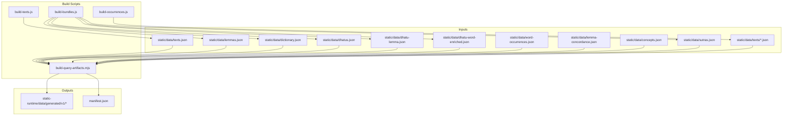
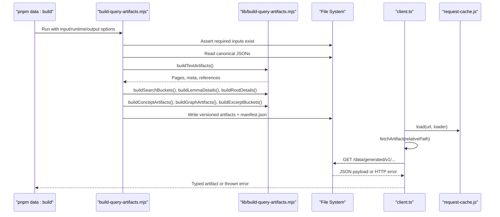
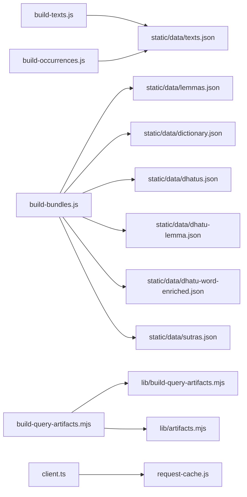

# Data Validation and Integrity

<cite>
**Referenced Files in This Document**
- [package.json](file://package.json)
- [scripts/build-query-artifacts.mjs](file://scripts/build-query-artifacts.mjs)
- [scripts/lib/build-query-artifacts.mjs](file://scripts/lib/build-query-artifacts.mjs)
- [scripts/lib/artifacts.mjs](file://scripts/lib/artifacts.mjs)
- [scripts/build-texts.js](file://scripts/build-texts.js)
- [scripts/build-bundles.js](file://scripts/build-bundles.js)
- [scripts/build-occurrences.js](file://scripts/build-occurrences.js)
- [src/lib/data/client.ts](file://src/lib/data/client.ts)
- [src/lib/data/request-cache.js](file://src/lib/data/request-cache.js)
- [tests/artifacts.test.mjs](file://tests/artifacts.test.mjs)
- [tests/build-query-artifacts.test.mjs](file://tests/build-query-artifacts.test.mjs)
- [tests/artifact-cache.test.mjs](file://tests/artifact-cache.test.mjs)
- [tests/architecture.test.mjs](file://tests/architecture.test.mjs)
- [src/routes/docs/developer/development-workflow.md](file://src/routes/docs/developer/development-workflow.md)
- [docs/DEVELOPERS.md](file://docs/DEVELOPERS.md)
</cite>

## Table of Contents
1. Introduction
2. Project Structure
3. Core Components
4. Architecture Overview
5. Detailed Component Analysis
6. Dependency Analysis
7. Performance Considerations
8. Troubleshooting Guide
9. Conclusion
10. Appendices

## Introduction
This document explains the data validation and integrity mechanisms across FractalDharma’s data processing pipeline. It covers:
- Build-time validation: schema checks, cross-reference integrity, and consistency verification during artifact generation.
- Runtime validation: type checking, required field validation, and relationship integrity enforced at request time.
- Error handling strategies for corrupted or malformed data, fallback mechanisms for missing artifacts, and monitoring approaches for data quality issues.
- Testing strategies for validating transformations, unit tests for validation logic, and integration tests for end-to-end pipeline verification.
- Common data integrity issues and their resolution procedures.

## Project Structure
The pipeline is composed of:
- Canonical inputs under static/data (e.g., texts.json, lemmas.json, dictionary.json, dhatus.json, dhatu-lemma.json, dhatu-word-enriched.json, word-occurrences.json, lemma-concordance.json, concepts.json, sutras.json, and per-text JSON files).
- Build scripts that transform canonical inputs into versioned, bucketed artifacts under static-runtime/data/generated/v1.
- A runtime client that fetches artifacts with caching and error handling.
- Tests that assert artifact contracts, transformation correctness, and architectural constraints.

**Diagram sources**
- [scripts/build-query-artifacts.mjs:66-79](file://scripts/build-query-artifacts.mjs#L66-L79)
- [scripts/build-texts.js:141-188](file://scripts/build-texts.js#L141-L188)
- [scripts/build-bundles.js:39-200](file://scripts/build-bundles.js#L39-L200)
- [scripts/build-occurrences.js:1-48](file://scripts/build-occurrences.js#L1-L48)

**Section sources**
- [package.json:8-18](file://package.json#L8-L18)
- [src/routes/docs/developer/development-workflow.md:10-21](file://src/routes/docs/developer/development-workflow.md#L10-L21)
- [docs/DEVELOPERS.md:278-295](file://docs/DEVELOPERS.md#L278-L295)

## Core Components
- Build orchestrator: validates required inputs, reads canonical JSON, constructs artifacts, writes versioned outputs, and emits a manifest.
- Text builder: parses raw corpus into normalized text bundles and metadata.
- Bundle builder: enriches lemmas, dhatus, dictionaries, and sutras into stable bundles.
- Occurrence builder: scans all text JSONs to produce a lemma-to-text mapping.
- Query artifact generator: builds search buckets, lemma details, root details, concept artifacts, graph neighborhoods, excerpts, and paginated text pages.
- Runtime client: fetches artifacts with URL construction, HTTP error handling, and in-process request deduplication.

Key responsibilities:
- Input presence and shape validation at build time.
- Cross-reference integrity between lemmas, dhatus, occurrences, concordance, and concepts.
- Safe HTML sanitization for descriptions.
- Deterministic pagination and bucketing for bounded requests.
- Versioned artifact paths and immutable URLs.

**Section sources**
- [scripts/build-query-artifacts.mjs:26-97](file://scripts/build-query-artifacts.mjs#L26-L97)
- [scripts/lib/build-query-artifacts.mjs:64-122](file://scripts/lib/build-query-artifacts.mjs#L64-L122)
- [scripts/build-texts.js:36-129](file://scripts/build-texts.js#L36-L129)
- [scripts/build-bundles.js:16-32](file://scripts/build-bundles.js#L16-L32)
- [scripts/build-occurrences.js:16-42](file://scripts/build-occurrences.js#L16-L42)
- [src/lib/data/client.ts:6-16](file://src/lib/data/client.ts#L6-L16)

## Architecture Overview
The pipeline enforces integrity through staged validation and projection:
- Stage 1: Raw corpus parsing and normalization (texts).
- Stage 2: Bundle enrichment (lemmas, dhatus, dictionaries, sutras).
- Stage 3: Cross-reference aggregation (occurrences, concordance, bridge).
- Stage 4: Query-ready artifacts (buckets, details, graphs, excerpts, paginated pages).
- Stage 5: Runtime consumption with caching and error handling.

**Diagram sources**
- [scripts/build-query-artifacts.mjs:66-194](file://scripts/build-query-artifacts.mjs#L66-L194)
- [scripts/lib/build-query-artifacts.mjs:64-200](file://scripts/lib/build-query-artifacts.mjs#L64-L200)
- [src/lib/data/client.ts:6-16](file://src/lib/data/client.ts#L6-L16)
- [src/lib/data/request-cache.js:6-44](file://src/lib/data/request-cache.js#L6-L44)

## Detailed Component Analysis

### Build-time Schema and Input Validation
- Required inputs are asserted before any processing begins; missing files cause immediate failure.
- Inputs include core datasets and a directory of per-text JSONs.
- The orchestrator clears previous outputs and copies public assets, ensuring deterministic rebuilds.

Validation rules:
- Presence checks for all required JSON files and directories.
- JSON parse errors will surface early due to synchronous read/parse.
- Output directory structure is created deterministically.

Error handling:
- Missing inputs throw descriptive errors.
- Rebuild cleans prior generated content except text-notes to preserve authoring.

**Section sources**
- [scripts/build-query-artifacts.mjs:56-64](file://scripts/build-query-artifacts.mjs#L56-L64)
- [scripts/build-query-artifacts.mjs:66-79](file://scripts/build-query-artifacts.mjs#L66-L79)
- [scripts/build-query-artifacts.mjs:88-96](file://scripts/build-query-artifacts.mjs#L88-L96)

### Cross-reference Integrity Checks
- Lemma slug resolver maps corpus lemmas to canonical lexical-record slugs using exact headword match first, then normalized ASCII-only match only when unambiguous.
- Search buckets index lemmas by multiple keys (slug, headword, normalized) for robust lookups.
- Root details precompute word groups and definitions, preferring headword-based root links over weaker signals.
- Graph artifacts compute bounded neighborhoods for roots, lemmas, and texts.

Integrity guarantees:
- Ambiguous normalized matches do not guess homographs; they return undefined to avoid incorrect joins.
- Bucketing ensures consistent partitioning for scalable queries.
- Precomputed structures reduce runtime join costs and enforce stable contracts.

**Section sources**
- [scripts/lib/build-query-artifacts.mjs:45-62](file://scripts/lib/build-query-artifacts.mjs#L45-L62)
- [scripts/lib/build-query-artifacts.mjs:124-142](file://scripts/lib/build-query-artifacts.mjs#L124-L142)
- [scripts/lib/build-query-artifacts.mjs:144-184](file://scripts/lib/build-query-artifacts.mjs#L144-L184)
- [scripts/lib/build-query-artifacts.mjs:167-181](file://scripts/lib/build-query-artifacts.mjs#L167-L181)

### Data Consistency Verification
- Text artifacts ensure page counts and verse counts are consistent with actual verses; empty-first-page behavior handles stale zero metadata gracefully.
- Occurrence builder aggregates unique text slugs per lemma from all text JSONs, producing deterministic arrays.
- Bundle builder normalizes and enriches records, handling missing optional fields safely and logging warnings for absent source files.

Consistency checks:
- Verse count derived from actual verses overrides stale metadata.
- Occurrence sets converted to sorted arrays for stability.
- Optional fields default to safe values; missing source bundles produce empty arrays.

**Section sources**
- [scripts/lib/build-query-artifacts.mjs:64-122](file://scripts/lib/build-query-artifacts.mjs#L64-L122)
- [scripts/build-occurrences.js:16-42](file://scripts/build-occurrences.js#L16-L42)
- [scripts/build-bundles.js:16-32](file://scripts/build-bundles.js#L16-L32)

### Runtime Validation Mechanisms
- Artifact fetching constructs versioned URLs and throws on non-OK responses.
- In-process request cache deduplicates concurrent requests for the same artifact and removes failed entries from in-flight state to allow retries.
- TypeScript types provide compile-time contract enforcement for artifact shapes consumed by routes.

Runtime guarantees:
- Single fetch per artifact per process lifetime unless failures occur.
- Clear error messages including status codes and URLs for diagnostics.
- Type safety via TS interfaces and route loaders.

**Section sources**
- [src/lib/data/client.ts:6-16](file://src/lib/data/client.ts#L6-L16)
- [src/lib/data/request-cache.js:6-44](file://src/lib/data/request-cache.js#L6-L44)
- [tests/artifact-cache.test.mjs:6-36](file://tests/artifact-cache.test.mjs#L6-L36)

### Error Handling Strategies
- Build-time: explicit assertions for required inputs; JSON parse errors propagate immediately.
- Runtime: HTTP error detection and throwing with context; cache cleanup on failures.
- Sanitization: HTML sanitization strips dangerous tags and attributes, allowing only a safe subset.

Strategies:
- Fail fast on missing inputs.
- Provide actionable error messages at runtime.
- Sanitize user-provided HTML to prevent XSS.

**Section sources**
- [scripts/build-query-artifacts.mjs:56-64](file://scripts/build-query-artifacts.mjs#L56-L64)
- [src/lib/data/client.ts:12-14](file://src/lib/data/client.ts#L12-L14)
- [scripts/lib/build-query-artifacts.mjs:15-36](file://scripts/lib/build-query-artifacts.mjs#L15-L36)

### Fallback Mechanisms for Missing Artifacts
- If certain source bundles are missing, bundle builder logs warnings and continues with empty results where appropriate.
- Runtime client throws on non-OK responses; consumers should handle errors upstream (e.g., UI fallbacks).
- Text artifacts emit an empty first page when no verses exist, preventing broken navigation.

Failsafes:
- Graceful degradation for optional data.
- Explicit error signaling for critical fetch failures.
- Stable page structure even for empty content.

**Section sources**
- [scripts/build-bundles.js:16-23](file://scripts/build-bundles.js#L16-L23)
- [src/lib/data/client.ts:12-14](file://src/lib/data/client.ts#L12-L14)
- [scripts/lib/build-query-artifacts.mjs:88-99](file://scripts/lib/build-query-artifacts.mjs#L88-L99)

### Monitoring Approaches for Data Quality Issues
- Build output includes a manifest with schemaVersion, version, timestamp, and counts for major entities.
- Console logs during builds report file counts and sizes for observability.
- Architecture tests assert absence of legacy patterns and whole-corpus client usage, guarding against regressions.

Monitoring hooks:
- Manifest provides deployment-time sanity checks.
- Build logs expose intermediate metrics.
- Automated tests enforce architectural constraints.

**Section sources**
- [scripts/build-query-artifacts.mjs:182-194](file://scripts/build-query-artifacts.mjs#L182-L194)
- [scripts/build-query-artifacts.mjs:204-206](file://scripts/build-query-artifacts.mjs#L204-L206)
- [tests/architecture.test.mjs:26-33](file://tests/architecture.test.mjs#L26-L33)

### Testing Strategies
- Unit tests validate utility functions (ASCII key normalization, bucketing, page filename padding, versioned paths).
- Transformation tests assert correctness of text artifacts, lemma details, root details, concept artifacts, graph neighborhoods, excerpt buckets, and HTML sanitization.
- Cache tests verify concurrency deduplication and failure recovery.
- Architecture tests enforce constraints on runtime source code.

Coverage highlights:
- Deterministic pagination and bucketing.
- Correct lemma slug resolution without guessing.
- Safe HTML sanitization.
- Concurrent request deduplication and retry semantics.

**Section sources**
- [tests/artifacts.test.mjs:11-32](file://tests/artifacts.test.mjs#L11-L32)
- [tests/build-query-artifacts.test.mjs:25-205](file://tests/build-query-artifacts.test.mjs#L25-L205)
- [tests/artifact-cache.test.mjs:6-36](file://tests/artifact-cache.test.mjs#L6-L36)
- [tests/architecture.test.mjs:21-33](file://tests/architecture.test.mjs#L21-L33)

### End-to-end Pipeline Verification
- The data rebuild script chains all stages to regenerate canonical intermediates and public artifacts.
- After rebuild, representative texts should be inspected, slugs verified, and test:data executed to confirm integrity.

Verification steps:
- Run full rebuild.
- Inspect representative outputs.
- Execute tests to catch regressions.

**Section sources**
- [package.json:15-17](file://package.json#L15-L17)
- [src/routes/docs/developer/corpus-pipeline.md:43-52](file://src/routes/docs/developer/corpus-pipeline.md#L43-L52)

## Dependency Analysis
The build pipeline has clear dependencies among scripts and libraries:
- build-query-artifacts.mjs depends on lib/build-query-artifacts.mjs and lib/artifacts.mjs.
- build-texts.js and build-bundles.js produce canonical inputs consumed by later stages.
- Runtime client depends on artifacts path utilities and request cache.

**Diagram sources**
- [scripts/build-texts.js:141-188](file://scripts/build-texts.js#L141-L188)
- [scripts/build-bundles.js:39-200](file://scripts/build-bundles.js#L39-L200)
- [scripts/build-occurrences.js:16-42](file://scripts/build-occurrences.js#L16-L42)
- [scripts/build-query-artifacts.mjs:14-24](file://scripts/build-query-artifacts.mjs#L14-L24)
- [src/lib/data/client.ts:1-4](file://src/lib/data/client.ts#L1-L4)

**Section sources**
- [scripts/build-query-artifacts.mjs:14-24](file://scripts/build-query-artifacts.mjs#L14-L24)
- [src/lib/data/client.ts:1-4](file://src/lib/data/client.ts#L1-L4)

## Performance Considerations
- Bucketing and pagination keep requests bounded to one entity, bucket, or text page.
- Precomputed artifacts eliminate runtime joins and reduce latency.
- Request cache avoids redundant network calls within a process lifetime.
- Generated runtime tree size is large but necessary for low-latency serving; consider CDN/object storage if deployment constraints require.

Recommendations:
- Keep runtime requests bounded and artifact contracts stable.
- Avoid eager loading or whole-corpus joins at runtime.
- Use versioned artifacts for cache-friendly deployments.

[No sources needed since this section provides general guidance]

## Troubleshooting Guide
Common issues and resolutions:
- Missing required inputs: Ensure canonical data exists under static/data; rebuild if necessary.
- Non-OK HTTP responses: Check artifact base URL configuration and deployment; inspect status codes and URLs in error messages.
- Corrupted HTML in descriptions: Verify sanitization; ensure only allowed tags and attributes are present.
- Incorrect lemma slug resolution: Confirm headword and normalized fields; ambiguous cases should remain unresolved intentionally.
- Stale text metadata: Trust actual verses over zero counts; rebuild if metadata diverges.

Diagnostic steps:
- Run pnpm test:data to validate artifacts and architecture.
- Inspect manifest.json for counts and versioning.
- Review build logs for warnings about missing source bundles.

**Section sources**
- [scripts/build-query-artifacts.mjs:56-64](file://scripts/build-query-artifacts.mjs#L56-L64)
- [src/lib/data/client.ts:12-14](file://src/lib/data/client.ts#L12-L14)
- [scripts/lib/build-query-artifacts.mjs:15-36](file://scripts/lib/build-query-artifacts.mjs#L15-L36)
- [scripts/build-query-artifacts.mjs:182-194](file://scripts/build-query-artifacts.mjs#L182-L194)

## Conclusion
FractalDharma’s pipeline enforces strong data integrity through staged validation, cross-reference checks, and deterministic projections. Build-time assertions and runtime safeguards ensure robustness, while comprehensive tests maintain contract fidelity. By keeping requests bounded and artifacts versioned, the system delivers responsive performance even with large corpora.

[No sources needed since this section summarizes without analyzing specific files]

## Appendices

### Build Commands and Workflow
- pnpm data:build generates public artifacts from canonical inputs.
- pnpm data:rebuild regenerates intermediates and artifacts.
- pnpm test:data runs artifact, cache, architecture, and fixture tests.

**Section sources**
- [package.json:8-18](file://package.json#L8-L18)
- [src/routes/docs/developer/development-workflow.md:10-21](file://src/routes/docs/developer/development-workflow.md#L10-L21)

### Change Rules for Data Architecture
- Keep canonical inputs separate from public runtime output.
- Update artifact version constants for incompatible schema changes.
- Do not restore eager corpus loading or runtime whole-corpus joins.

**Section sources**
- [docs/DEVELOPERS.md:278-295](file://docs/DEVELOPERS.md#L278-L295)