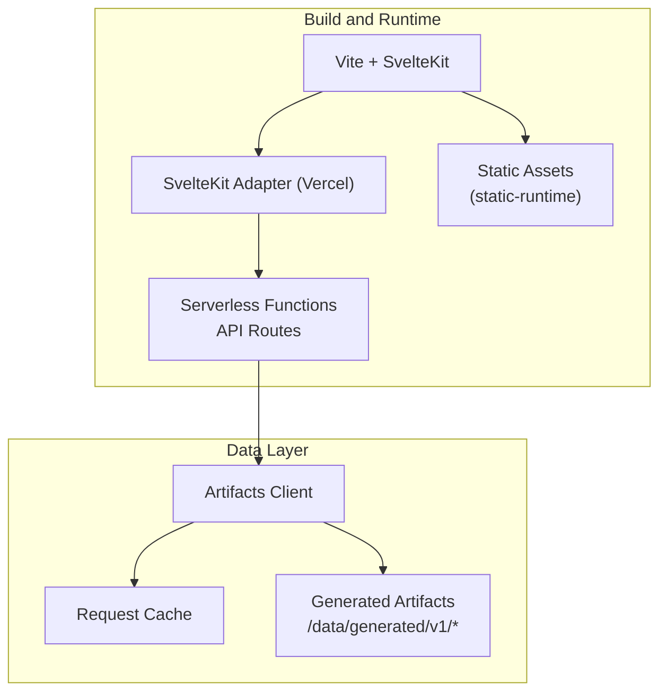
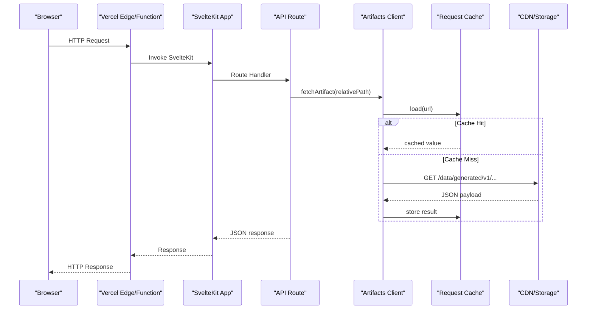
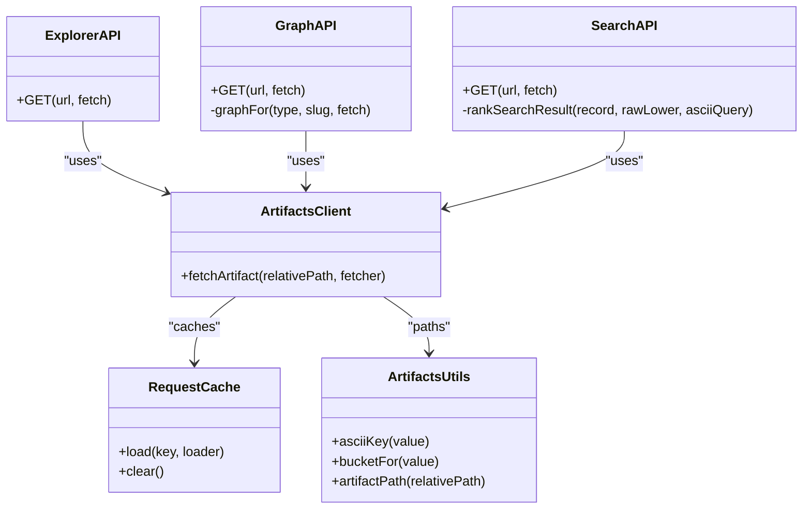
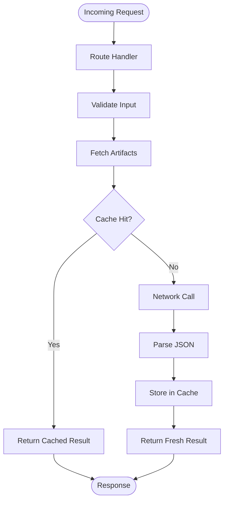

# Deployment and Operations

<cite>
**Referenced Files in This Document**
- [package.json](file://package.json)
- [svelte.config.js](file://svelte.config.js)
- [vite.config.ts](file://vite.config.ts)
- [src/hooks.server.ts](file://src/hooks.server.ts)
- [src/routes/api/explorer/+server.ts](file://src/routes/api/explorer/+server.ts)
- [src/routes/api/graph/+server.ts](file://src/routes/api/graph/+server.ts)
- [src/routes/api/search/+server.ts](file://src/routes/api/search/+server.ts)
- [src/lib/data/artifacts.ts](file://src/lib/data/artifacts.ts)
- [src/lib/data/client.ts](file://src/lib/data/client.ts)
- [src/lib/data/request-cache.js](file://src/lib/data/request-cache.js)
- [src/app.d.ts](file://src/app.d.ts)
</cite>

## Table of Contents
1. [Introduction](#introduction)
2. [Project Structure](#project-structure)
3. [Core Components](#core-components)
4. [Architecture Overview](#architecture-overview)
5. [Detailed Component Analysis](#detailed-component-analysis)
6. [Dependency Analysis](#dependency-analysis)
7. [Performance Considerations](#performance-considerations)
8. [Troubleshooting Guide](#troubleshooting-guide)
9. [Conclusion](#conclusion)
10. [Appendices](#appendices)

## Introduction
This document provides comprehensive deployment and operations guidance for FractalDharma, a SvelteKit application targeting Vercel with server-side rendering via the Vercel adapter. It covers environment configuration, build optimization, production deployment steps, API routing, error handling, logging, monitoring, performance metrics, health checks, scaling, caching, CDN usage, security policies, troubleshooting, rollback procedures, and operational runbooks.

## Project Structure
FractalDharma is a SvelteKit project using:
- Vercel adapter for serverless deployment on Node.js 24 runtime
- Vite as the build tool integrated through SvelteKit’s plugin
- Server routes under src/routes/api for data endpoints
- Static assets served from static-runtime (configured in SvelteKit)
- Data artifacts accessed via a client with an in-process request cache

**Diagram sources**
- [svelte.config.js:1-29](file://svelte.config.js#L1-L29)
- [vite.config.ts:1-7](file://vite.config.ts#L1-L7)
- [src/lib/data/client.ts:1-17](file://src/lib/data/client.ts#L1-L17)
- [src/lib/data/request-cache.js:1-45](file://src/lib/data/request-cache.js#L1-L45)
- [src/lib/data/artifacts.ts:1-27](file://src/lib/data/artifacts.ts#L1-L27)

**Section sources**
- [package.json:1-47](file://package.json#L1-L47)
- [svelte.config.js:1-29](file://svelte.config.js#L1-L29)
- [vite.config.ts:1-7](file://vite.config.ts#L1-L7)

## Core Components
- Build and packaging:
  - Scripts define development, build, preview, and data generation tasks. The build pipeline runs data artifact generation before building the app.
- SvelteKit configuration:
  - Uses mdsvex preprocessing and sets the assets directory to static-runtime.
  - Configures the Vercel adapter with Node.js 24 runtime.
- Vite configuration:
  - Minimal setup using the SvelteKit plugin; further optimizations are inherited from SvelteKit defaults.
- Hooks server:
  - Global request handler and error handler for logging and standardized error responses.
- API routes:
  - Explorer, Graph, Search, Text excerpts, and Word excerpts endpoints fetch prebuilt artifacts and return JSON.
- Data access layer:
  - Artifact path utilities, bucketing helpers, and a typed fetch wrapper with an in-memory request cache.

**Section sources**
- [package.json:8-18](file://package.json#L8-L18)
- [svelte.config.js:1-29](file://svelte.config.js#L1-L29)
- [vite.config.ts:1-7](file://vite.config.ts#L1-L7)
- [src/hooks.server.ts:1-13](file://src/hooks.server.ts#L1-L13)
- [src/routes/api/explorer/+server.ts:1-121](file://src/routes/api/explorer/+server.ts#L1-L121)
- [src/routes/api/graph/+server.ts:1-82](file://src/routes/api/graph/+server.ts#L1-L82)
- [src/routes/api/search/+server.ts:1-79](file://src/routes/api/search/+server.ts#L1-L79)
- [src/lib/data/artifacts.ts:1-27](file://src/lib/data/artifacts.ts#L1-L27)
- [src/lib/data/client.ts:1-17](file://src/lib/data/client.ts#L1-L17)
- [src/lib/data/request-cache.js:1-45](file://src/lib/data/request-cache.js#L1-L45)

## Architecture Overview
The application follows a serverless-first architecture:
- SvelteKit renders pages and serves API routes as serverless functions on Vercel.
- Data is delivered via prebuilt JSON artifacts stored under /data/generated/v1.
- An in-process request cache reduces redundant network calls within a single function invocation.
- Static assets are served from static-runtime and optimized by Vite/SvelteKit.

**Diagram sources**
- [src/routes/api/explorer/+server.ts:1-121](file://src/routes/api/explorer/+server.ts#L1-L121)
- [src/routes/api/graph/+server.ts:1-82](file://src/routes/api/graph/+server.ts#L1-L82)
- [src/routes/api/search/+server.ts:1-79](file://src/routes/api/search/+server.ts#L1-L79)
- [src/lib/data/client.ts:1-17](file://src/lib/data/client.ts#L1-L17)
- [src/lib/data/request-cache.js:1-45](file://src/lib/data/request-cache.js#L1-L45)
- [src/lib/data/artifacts.ts:1-27](file://src/lib/data/artifacts.ts#L1-L27)

## Detailed Component Analysis

### Vercel Deployment Configuration
- Adapter selection:
  - The Vercel adapter is configured with Node.js 24 runtime.
- Environment variables:
  - No explicit env variables are referenced in code; ensure any required variables are set in Vercel project settings or .env files during local development.
- Build outputs:
  - The build script triggers data artifact generation followed by the Vite build. Ensure data scripts complete successfully before deployment.

Operational notes:
- Use Vercel CLI or GitHub integration to deploy.
- Configure environment variables in the Vercel dashboard if needed.
- Verify runtime logs for errors and warnings.

**Section sources**
- [svelte.config.js:22-25](file://svelte.config.js#L22-L25)
- [package.json:8-18](file://package.json#L8-L18)

### SvelteKit Configuration for SSR and Static Generation
- Preprocessing:
  - mdsvex enables Markdown processing alongside Svelte components.
- Assets:
  - Static assets are sourced from static-runtime.
- Adapter:
  - Vercel adapter selected with Node.js 24 runtime.

SSR vs SSG:
- SvelteKit determines prerendering per route based on route conventions and exports. For this project, API routes are serverless functions, while page routes can be prerendered or SSR depending on their implementation.

**Section sources**
- [svelte.config.js:1-29](file://svelte.config.js#L1-L29)

### Vite Build Configuration
- Plugin:
  - Uses @sveltejs/kit/vite plugin for SvelteKit integration.
- Optimization:
  - Inherits SvelteKit/Vite defaults for code splitting, minification, and asset optimization.
- Bundle analysis:
  - Not explicitly configured; consider adding a bundle analyzer plugin if needed.

**Section sources**
- [vite.config.ts:1-7](file://vite.config.ts#L1-L7)

### Hooks Server Implementation
- Handle middleware:
  - A global handle hook that passes requests through without modification.
- Error handling:
  - A centralized handleError hook logs the pathname and error, returning a generic message.

Recommendations:
- Add structured logging (e.g., correlation IDs).
- Integrate external logging services.
- Implement rate limiting and input validation middleware.

**Section sources**
- [src/hooks.server.ts:1-13](file://src/hooks.server.ts#L1-L13)

### API Routes and Data Access
- Explorer API:
  - Returns nodes and metadata for roots and words, fetching artifacts and aggregating results.
- Graph API:
  - Provides graph data for lemmas, roots, and texts, including expansion endpoints.
- Search API:
  - Normalizes queries across Devanagari and IAST, searches buckets, ranks results, and returns top matches.
- Data client:
  - Constructs artifact paths and performs fetch with typed responses.
- Request cache:
  - In-memory deduplication and caching of concurrent requests within a single function invocation.

**Diagram sources**
- [src/routes/api/explorer/+server.ts:1-121](file://src/routes/api/explorer/+server.ts#L1-L121)
- [src/routes/api/graph/+server.ts:1-82](file://src/routes/api/graph/+server.ts#L1-L82)
- [src/routes/api/search/+server.ts:1-79](file://src/routes/api/search/+server.ts#L1-L79)
- [src/lib/data/client.ts:1-17](file://src/lib/data/client.ts#L1-L17)
- [src/lib/data/request-cache.js:1-45](file://src/lib/data/request-cache.js#L1-L45)
- [src/lib/data/artifacts.ts:1-27](file://src/lib/data/artifacts.ts#L1-L27)

**Section sources**
- [src/routes/api/explorer/+server.ts:1-121](file://src/routes/api/explorer/+server.ts#L1-L121)
- [src/routes/api/graph/+server.ts:1-82](file://src/routes/api/graph/+server.ts#L1-L82)
- [src/routes/api/search/+server.ts:1-79](file://src/routes/api/search/+server.ts#L1-L79)
- [src/lib/data/client.ts:1-17](file://src/lib/data/client.ts#L1-L17)
- [src/lib/data/request-cache.js:1-45](file://src/lib/data/request-cache.js#L1-L45)
- [src/lib/data/artifacts.ts:1-27](file://src/lib/data/artifacts.ts#L1-L27)

### Conceptual Overview
- The system leverages serverless functions for API endpoints and SSR where needed.
- Data is decoupled into versioned artifacts to simplify caching and distribution.
- In-process caching ensures efficient repeated reads within a single invocation.

[No sources needed since this diagram shows conceptual workflow, not actual code structure]

## Dependency Analysis
Key dependencies:
- SvelteKit and Vite for framework and build tooling
- Vercel adapter for serverless deployment
- mdsvex for Markdown processing
- sanscript for transliteration between Devanagari and IAST
- d3 libraries for visualization features

Runtime coupling:
- API routes depend on the artifacts client and utils for consistent path resolution and bucketing.
- The request cache is scoped per function instance, ensuring safe concurrency handling.

Potential circular dependencies:
- None detected among core modules.

External integrations:
- Vercel platform for hosting and serverless execution.
- CDN-backed storage for artifacts (via Vercel’s asset serving).

**Section sources**
- [package.json:19-46](file://package.json#L19-L46)
- [src/lib/data/client.ts:1-17](file://src/lib/data/client.ts#L1-L17)
- [src/lib/data/artifacts.ts:1-27](file://src/lib/data/artifacts.ts#L1-L27)

## Performance Considerations
- Build-time optimizations:
  - Code splitting and minification handled by Vite/SvelteKit defaults.
  - Asset optimization via Vite plugins and bundling strategies.
- Runtime optimizations:
  - In-memory request cache reduces duplicate network calls within a function.
  - Bucketing strategy for artifacts improves lookup locality and reduces large payloads.
- Caching strategies:
  - Leverage CDN caching for static assets and artifacts.
  - Consider HTTP caching headers for API responses if appropriate.
- Metrics and profiling:
  - Use Vercel analytics and browser performance tools to monitor TTFB, FCP, and LCP.
  - Add custom metrics for API latency and error rates.

[No sources needed since this section provides general guidance]

## Troubleshooting Guide
Common issues:
- Build failures:
  - Ensure data artifact generation completes successfully before the Vite build.
  - Check for missing dependencies or incorrect Node.js versions.
- API errors:
  - Inspect serverless function logs for stack traces and status codes.
  - Validate query parameters and artifact availability.
- CORS and headers:
  - Configure CORS policies in Vercel project settings if cross-origin requests are needed.
  - Set secure headers (HSTS, CSP, X-Frame-Options) via Vercel headers configuration.
- Rollback procedures:
  - Use Vercel deployments to roll back to previous commits or tags.
  - Pin artifact versions to avoid breaking changes during updates.
- Maintenance tasks:
  - Regenerate artifacts when data changes.
  - Monitor CDN cache invalidation and purge stale content.

Operational runbooks:
- Incident response:
  - Identify affected endpoints and check logs.
  - Temporarily disable problematic features if necessary.
  - Deploy a hotfix and verify health checks.
- System recovery:
  - Restore from backups if data corruption occurs.
  - Rebuild artifacts and redeploy.

**Section sources**
- [package.json:8-18](file://package.json#L8-L18)
- [src/hooks.server.ts:7-12](file://src/hooks.server.ts#L7-L12)

## Conclusion
FractalDharma is designed for efficient serverless deployment on Vercel with robust data delivery through versioned artifacts and in-process caching. By following the outlined deployment steps, optimizing builds, implementing proper error handling and logging, and adopting security best practices, you can maintain a reliable and performant production environment.

[No sources needed since this section summarizes without analyzing specific files]

## Appendices

### Health Check Endpoint Recommendation
- Implement a lightweight endpoint (e.g., /health) that returns service status and dependency checks.
- Integrate with Vercel health checks and external monitoring tools.

[No sources needed since this section provides general guidance]

### Security Checklist
- CORS policies:
  - Restrict origins to trusted domains.
- Input validation:
  - Validate and sanitize all user inputs in API routes.
- Secure headers:
  - Configure HSTS, CSP, X-Content-Type-Options, and Referrer-Policy.

[No sources needed since this section provides general guidance]