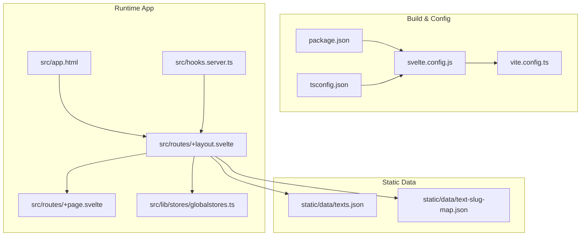
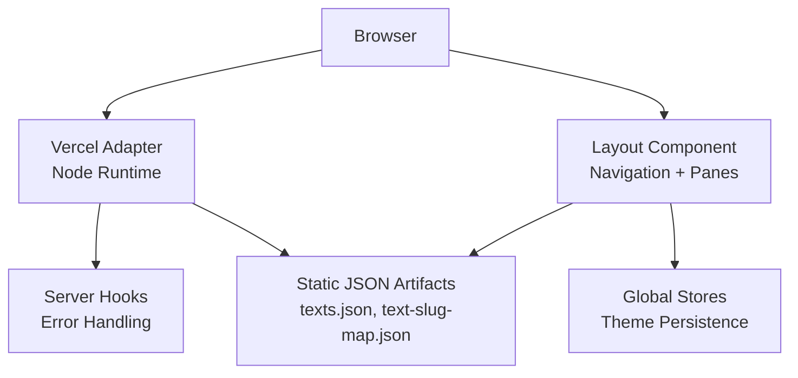
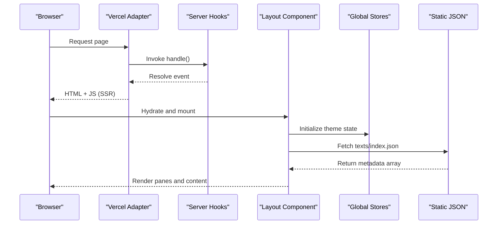
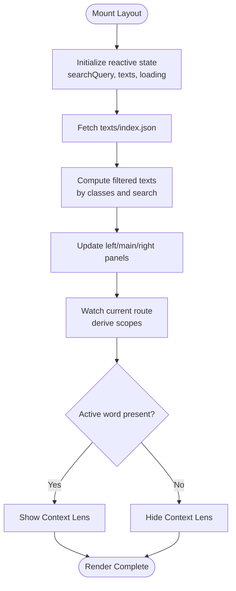
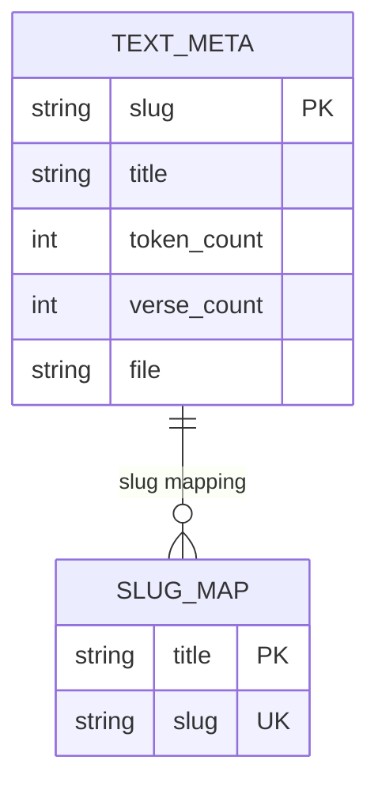
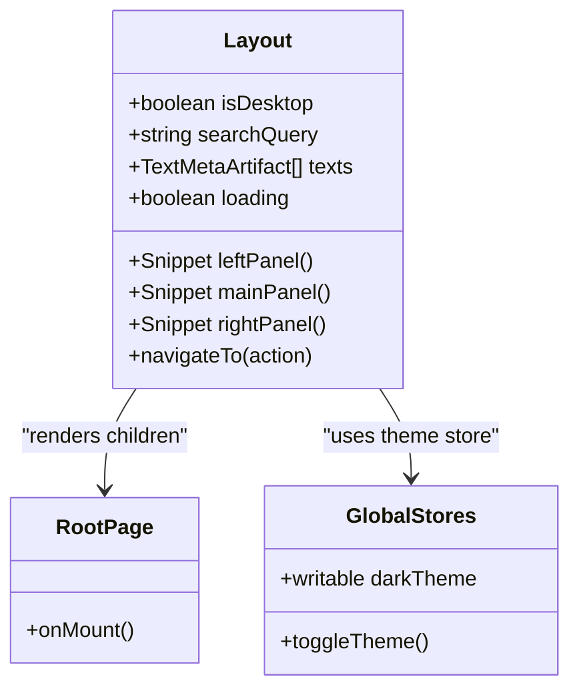
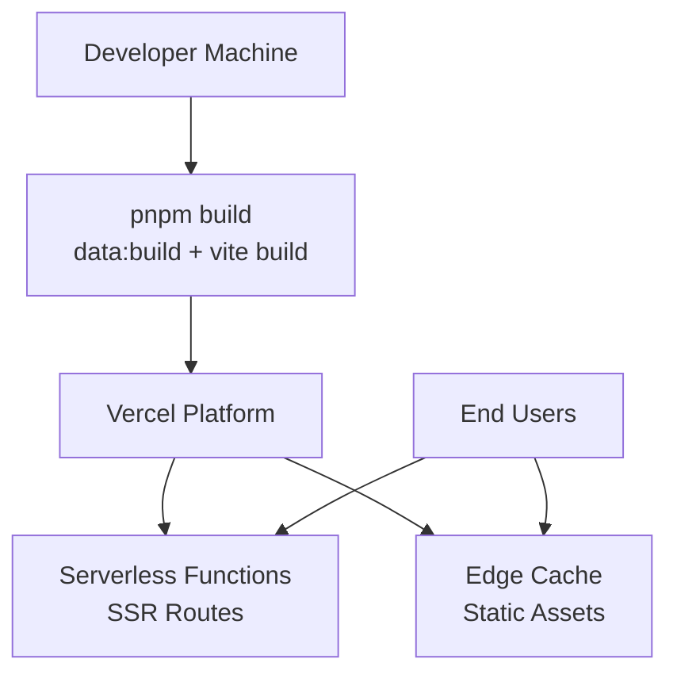
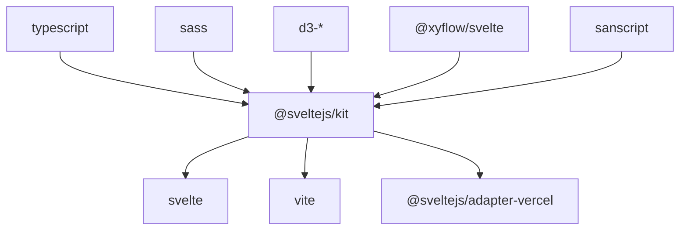

# Architecture Overview

<cite>
**Referenced Files in This Document**
- [package.json](file://package.json)
- [svelte.config.js](file://svelte.config.js)
- [vite.config.ts](file://vite.config.ts)
- [tsconfig.json](file://tsconfig.json)
- [src/app.html](file://src/app.html)
- [src/hooks.server.ts](file://src/hooks.server.ts)
- [src/routes/+layout.svelte](file://src/routes/+layout.svelte)
- [src/routes/+page.svelte](file://src/routes/+page.svelte)
- [src/lib/stores/globalstores.ts](file://src/lib/stores/globalstores.ts)
- [static/data/texts.json](file://static/data/texts.json)
- [static/data/text-slug-map.json](file://static/data/text-slug-map.json)
</cite>

## Table of Contents
1. [Introduction](#introduction)
2. [Project Structure](#project-structure)
3. [Core Components](#core-components)
4. [Architecture Overview](#architecture-overview)
5. [Detailed Component Analysis](#detailed-component-analysis)
6. [Dependency Analysis](#dependency-analysis)
7. [Performance Considerations](#performance-considerations)
8. [Troubleshooting Guide](#troubleshooting-guide)
9. [Conclusion](#conclusion)

## Introduction
This document provides a comprehensive architectural overview of FractalDharma’s SvelteKit-based system. It explains the runtime stack (Svelte 5 with runes mode, TypeScript strict mode, Dart Sass styling), rendering model (SSR/CSR behavior), static-data application design, and versioned JSON data architecture. It also documents shared navigation state management using reactive stores, component composition patterns, and the separation between build-time assets and runtime artifacts. System boundaries, technology decisions, and constraints are outlined alongside diagrams illustrating component interactions, data flow patterns, and deployment topology. Performance considerations, scalability factors, and rationale behind key choices are included to guide both developers and stakeholders.

## Project Structure
The project is organized as a SvelteKit application with:
- Configuration files for SvelteKit, Vite, and TypeScript
- A root HTML template and server hooks
- Route-based pages and layouts
- Shared libraries for components, data access, stores, styles, types, and utilities
- Static data directories for versioned JSON artifacts consumed at runtime
- Build scripts that generate queryable artifacts from source texts

**Diagram sources**
- [package.json](file://package.json)
- [svelte.config.js](file://svelte.config.js)
- [vite.config.ts](file://vite.config.ts)
- [tsconfig.json](file://tsconfig.json)
- [src/app.html](file://src/app.html)
- [src/hooks.server.ts](file://src/hooks.server.ts)
- [src/routes/+layout.svelte](file://src/routes/+layout.svelte)
- [src/routes/+page.svelte](file://src/routes/+page.svelte)
- [src/lib/stores/globalstores.ts](file://src/lib/stores/globalstores.ts)
- [static/data/texts.json](file://static/data/texts.json)
- [static/data/text-slug-map.json](file://static/data/text-slug-map.json)

**Section sources**
- [package.json](file://package.json)
- [svelte.config.js](file://svelte.config.js)
- [vite.config.ts](file://vite.config.ts)
- [tsconfig.json](file://tsconfig.json)
- [src/app.html](file://src/app.html)
- [src/hooks.server.ts](file://src/hooks.server.ts)
- [src/routes/+layout.svelte](file://src/routes/+layout.svelte)
- [src/routes/+page.svelte](file://src/routes/+page.svelte)
- [src/lib/stores/globalstores.ts](file://src/lib/stores/globalstores.ts)
- [static/data/texts.json](file://static/data/texts.json)
- [static/data/text-slug-map.json](file://static/data/text-slug-map.json)

## Core Components
Key runtime and configuration elements:
- SvelteKit adapter configured for Vercel Node runtime
- Svelte 5 compiler options enabling runes mode for client-side code
- TypeScript strict mode for type safety across the app
- Vite plugin integration for Svelte and preprocessing
- Root HTML shell and server hooks for error handling
- Layout component orchestrating navigation panes, search, and context lens
- Global theme store persisted via localStorage
- Static JSON datasets providing versioned text metadata and slug mappings

These components collectively define the application’s runtime environment, UI orchestration, and data consumption strategy.

**Section sources**
- [svelte.config.js](file://svelte.config.js)
- [tsconfig.json](file://tsconfig.json)
- [vite.config.ts](file://vite.config.ts)
- [src/app.html](file://src/app.html)
- [src/hooks.server.ts](file://src/hooks.server.ts)
- [src/routes/+layout.svelte](file://src/routes/+layout.svelte)
- [src/lib/stores/globalstores.ts](file://src/lib/stores/globalstores.ts)
- [static/data/texts.json](file://static/data/texts.json)
- [static/data/text-slug-map.json](file://static/data/text-slug-map.json)

## Architecture Overview
The system follows a static-data application model built on SvelteKit SSR/CSR:
- SSR renders initial HTML for fast first paint; CSR hydrates interactivity
- Static JSON artifacts are served directly and consumed by the client at runtime
- The layout composes left/main/right panes and manages shared navigation state
- Theme preferences persist across sessions via localStorage
- Vercel adapter deploys the app as serverless functions with Node runtime

**Diagram sources**
- [svelte.config.js](file://svelte.config.js)
- [src/hooks.server.ts](file://src/hooks.server.ts)
- [src/routes/+layout.svelte](file://src/routes/+layout.svelte)
- [src/lib/stores/globalstores.ts](file://src/lib/stores/globalstores.ts)
- [static/data/texts.json](file://static/data/texts.json)
- [static/data/text-slug-map.json](file://static/data/text-slug-map.json)

## Detailed Component Analysis

### Rendering Model and SSR/CSR Behavior
- SvelteKit performs SSR to produce initial HTML and then hydrates the app in the browser for interactivity
- The root HTML template defines the minimal shell; SvelteKit injects head/body content during build/runtime
- Server hooks provide centralized error logging and response shaping
- The layout component initializes reactive state and effects for navigation and pane visibility

**Diagram sources**
- [src/app.html](file://src/app.html)
- [src/hooks.server.ts](file://src/hooks.server.ts)
- [src/routes/+layout.svelte](file://src/routes/+layout.svelte)
- [src/lib/stores/globalstores.ts](file://src/lib/stores/globalstores.ts)
- [static/data/texts.json](file://static/data/texts.json)

**Section sources**
- [src/app.html](file://src/app.html)
- [src/hooks.server.ts](file://src/hooks.server.ts)
- [src/routes/+layout.svelte](file://src/routes/+layout.svelte)

### Shared Navigation State Management
- Reactive stores manage global state such as theme toggling and persistence
- The layout uses derived state and effects to coordinate panes, active routes, and word lens scope
- Search filtering and text class selection are driven by reactive computations
- Pane visibility is controlled programmatically based on route context

**Diagram sources**
- [src/routes/+layout.svelte](file://src/routes/+layout.svelte)
- [src/lib/stores/globalstores.ts](file://src/lib/stores/globalstores.ts)

**Section sources**
- [src/routes/+layout.svelte](file://src/routes/+layout.svelte)
- [src/lib/stores/globalstores.ts](file://src/lib/stores/globalstores.ts)

### Static Data and Versioned JSON Architecture
- Versioned JSON artifacts reside under static/data and are served directly at runtime
- texts.json contains metadata for each text including slug, title, token count, verse count, and file reference
- text-slug-map.json maps canonical titles to normalized slugs for routing consistency
- The layout fetches and filters this metadata to populate the left panel and drive navigation

**Diagram sources**
- [static/data/texts.json](file://static/data/texts.json)
- [static/data/text-slug-map.json](file://static/data/text-slug-map.json)

**Section sources**
- [static/data/texts.json](file://static/data/texts.json)
- [static/data/text-slug-map.json](file://static/data/text-slug-map.json)

### Component Composition Patterns
- The layout composes three primary panes (left, main, right) using snippets and conditional rendering
- Icons and animated icons are integrated for visual feedback and accessibility
- Mobile-first responsive behavior switches between pane groups and a collapsible menu
- The root page sets default pane states and provides entry pathways to major sections

**Diagram sources**
- [src/routes/+layout.svelte](file://src/routes/+layout.svelte)
- [src/routes/+page.svelte](file://src/routes/+page.svelte)
- [src/lib/stores/globalstores.ts](file://src/lib/stores/globalstores.ts)

**Section sources**
- [src/routes/+layout.svelte](file://src/routes/+layout.svelte)
- [src/routes/+page.svelte](file://src/routes/+page.svelte)
- [src/lib/stores/globalstores.ts](file://src/lib/stores/globalstores.ts)

### Deployment Topology
- The SvelteKit adapter targets Vercel with a Node.js runtime
- Build artifacts include SSR functions and static assets
- Static data is served directly from the CDN edge cache
- Error handling is centralized in server hooks for consistent logging and responses

**Diagram sources**
- [package.json](file://package.json)
- [svelte.config.js](file://svelte.config.js)

**Section sources**
- [package.json](file://package.json)
- [svelte.config.js](file://svelte.config.js)

## Dependency Analysis
Technology stack and dependencies:
- SvelteKit and Vite for framework and build tooling
- Svelte 5 with runes mode enabled for client-side reactivity
- TypeScript strict mode for type safety
- Dart Sass for styling preprocessing
- Vercel adapter for deployment targeting Node.js runtime
- D3 and XYFlow for graph visualization capabilities
- Sanscript for Sanskrit text processing

**Diagram sources**
- [package.json](file://package.json)

**Section sources**
- [package.json](file://package.json)

## Performance Considerations
- SSR ensures fast initial load times by delivering pre-rendered HTML
- Static JSON artifacts enable efficient client-side data fetching without backend latency
- Reactive stores minimize unnecessary re-renders through fine-grained updates
- Responsive layout reduces mobile payload and improves usability
- Edge caching of static assets accelerates delivery globally
- Graph libraries should be used judiciously to avoid heavy client-side computation

[No sources needed since this section provides general guidance]

## Troubleshooting Guide
Common issues and resolutions:
- Server errors are logged centrally via server hooks; inspect console output for request paths and error details
- Theme persistence relies on localStorage; ensure browser storage is available and not blocked
- Static data fetch failures may indicate missing or malformed JSON artifacts; verify build outputs
- Navigation state inconsistencies can arise from route changes; validate derived state logic in the layout

**Section sources**
- [src/hooks.server.ts](file://src/hooks.server.ts)
- [src/lib/stores/globalstores.ts](file://src/lib/stores/globalstores.ts)
- [src/routes/+layout.svelte](file://src/routes/+layout.svelte)

## Conclusion
FractalDharma’s architecture leverages SvelteKit’s SSR/CSR model with a static-data approach to deliver a performant, scalable, and maintainable application. The use of Svelte 5 runes, TypeScript strict mode, and Dart Sass ensures modern development practices. Shared navigation state and component composition patterns provide a cohesive user experience across devices. Deployment via Vercel with Node runtime enables efficient scaling and edge caching. The versioned JSON data architecture supports reliable content management and querying. These design choices balance performance, developer productivity, and user experience while maintaining clear system boundaries and constraints.

[No sources needed since this section summarizes without analyzing specific files]