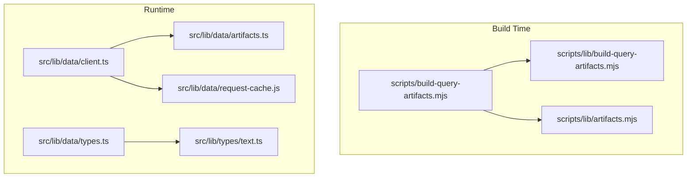
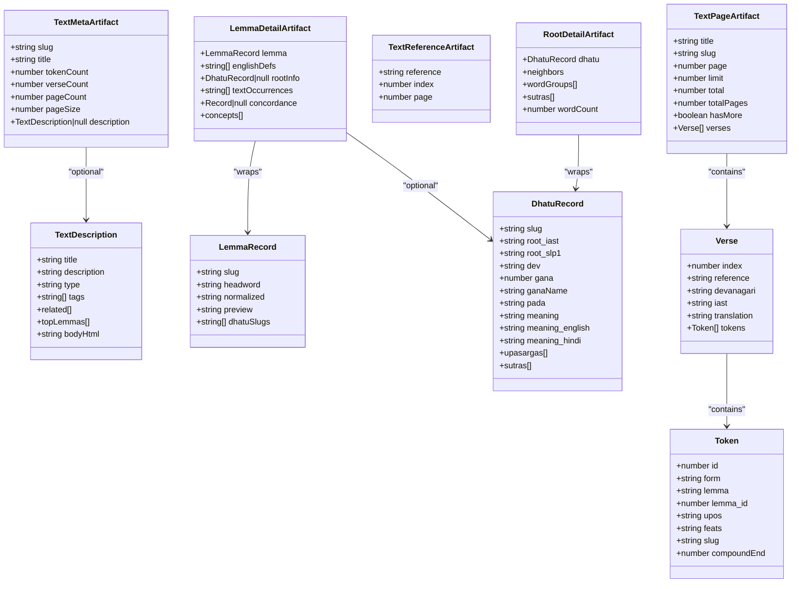
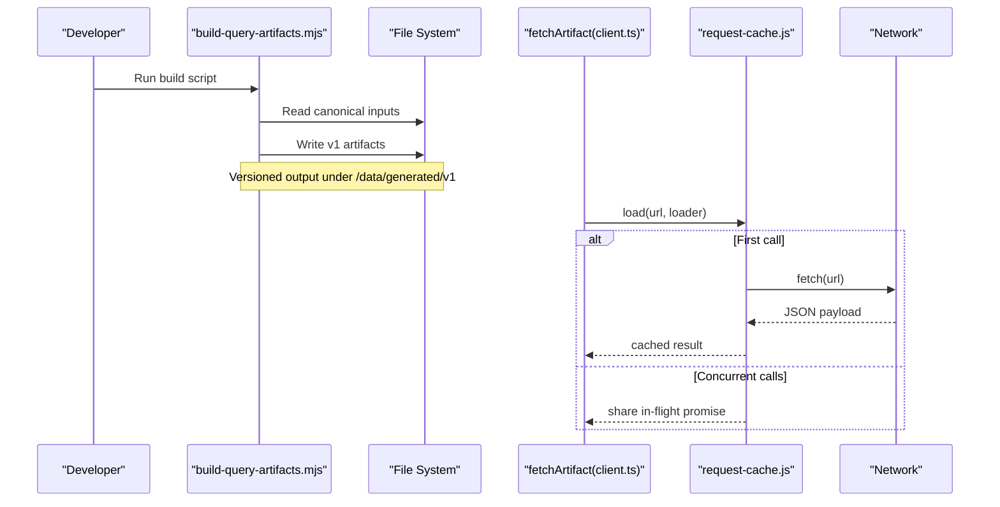
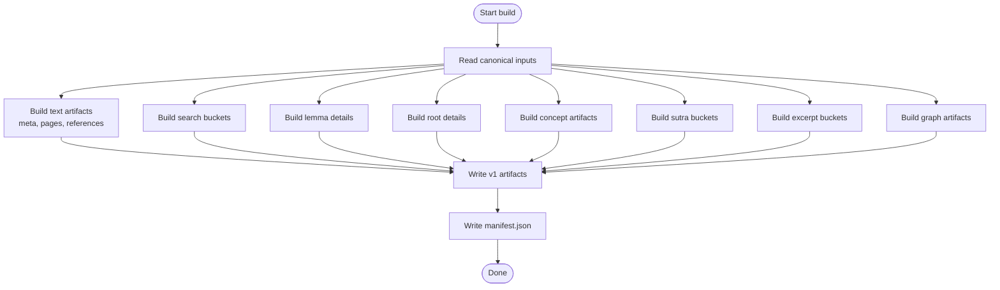
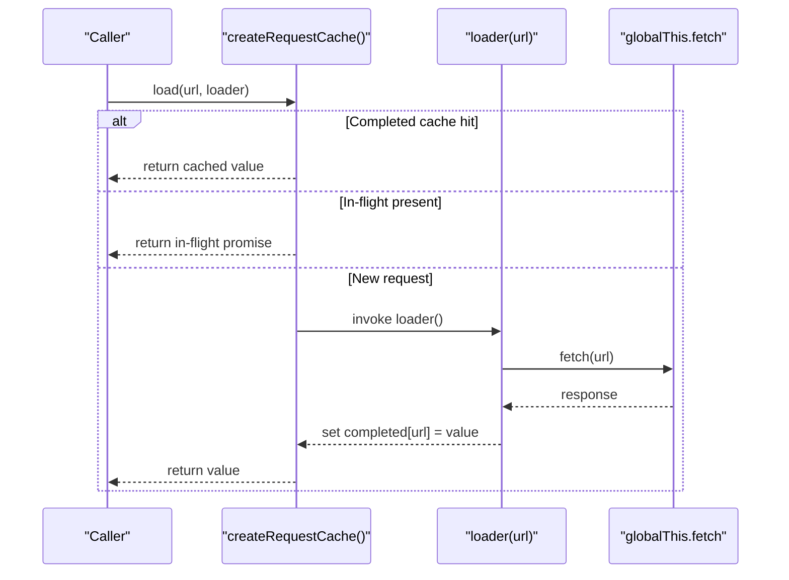
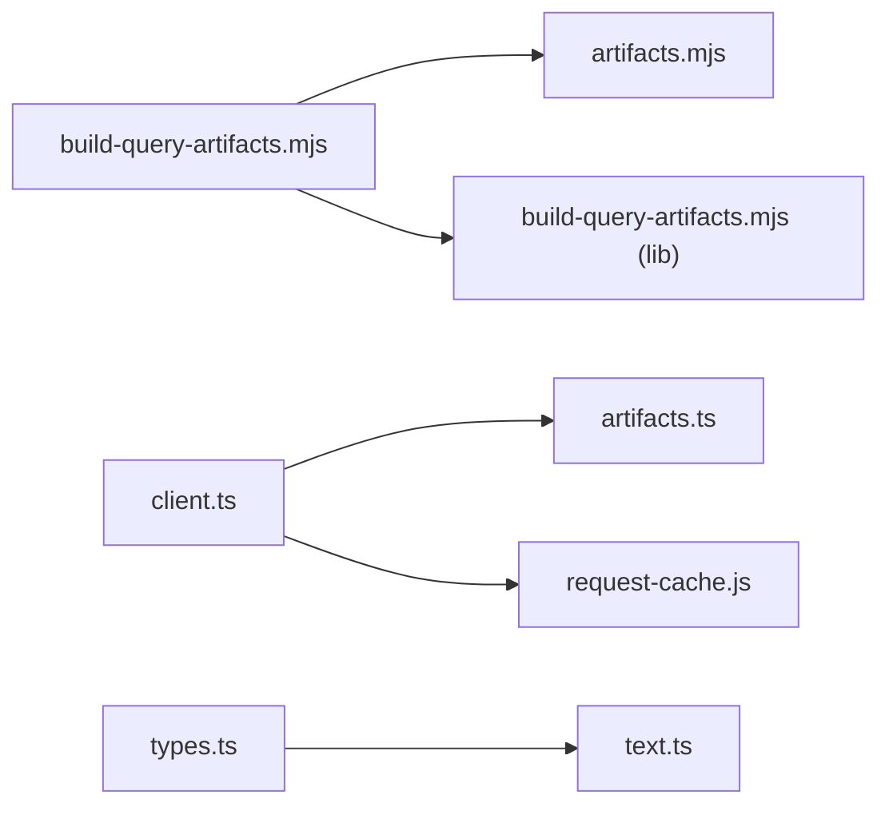

# Artifact Contracts

<cite>
**Referenced Files in This Document**
- [src/lib/data/types.ts](file://src/lib/data/types.ts)
- [src/lib/types/text.ts](file://src/lib/types/text.ts)
- [src/lib/data/artifacts.ts](file://src/lib/data/artifacts.ts)
- [scripts/lib/artifacts.mjs](file://scripts/lib/artifacts.mjs)
- [src/lib/data/client.ts](file://src/lib/data/client.ts)
- [src/lib/data/request-cache.js](file://src/lib/data/request-cache.js)
- [scripts/build-query-artifacts.mjs](file://scripts/build-query-artifacts.mjs)
- [scripts/lib/build-query-artifacts.mjs](file://scripts/lib/build-query-artifacts.mjs)
- [src/routes/api/word-excerpts/[lemma]/+server.ts](file://src/routes/api/word-excerpts/[lemma]/+server.ts)
- [src/routes/docs/developer/artifact-contracts.md](file://src/routes/docs/developer/artifact-contracts.md)
</cite>

## Table of Contents
1. [Introduction](#introduction)
2. [Project Structure](#project-structure)
3. [Core Components](#core-components)
4. [Architecture Overview](#architecture-overview)
5. [Detailed Component Analysis](#detailed-component-analysis)
6. [Dependency Analysis](#dependency-analysis)
7. [Performance Considerations](#performance-considerations)
8. [Troubleshooting Guide](#troubleshooting-guide)
9. [Conclusion](#conclusion)
10. [Appendices](#appendices)

## Introduction
This document describes FractalDharma’s artifact system and data contracts. It covers the type definitions for TextMetaArtifact, TextPageArtifact, LemmaRecord, RootDetailArtifact, and related structures; explains how artifacts are generated at build time; details versioning, caching, and client-side access patterns; and outlines contract evolution, backward compatibility, and migration procedures. It also addresses performance implications of data structures, serialization formats, and network transfer optimization, as well as the relationship between build-time artifacts and runtime consumption.

## Project Structure
The artifact system is split into two main layers:
- Build-time pipeline that transforms canonical corpus data into query-shaped JSON artifacts under a versioned directory.
- Runtime client layer that fetches these artifacts with request deduplication and error handling.

**Diagram sources**
- [scripts/build-query-artifacts.mjs:1-207](file://scripts/build-query-artifacts.mjs#L1-L207)
- [scripts/lib/build-query-artifacts.mjs:269-308](file://scripts/lib/build-query-artifacts.mjs#L269-L308)
- [scripts/lib/artifacts.mjs:1-24](file://scripts/lib/artifacts.mjs#L1-L24)
- [src/lib/data/artifacts.ts:1-27](file://src/lib/data/artifacts.ts#L1-L27)
- [src/lib/data/client.ts:1-17](file://src/lib/data/client.ts#L1-L17)
- [src/lib/data/request-cache.js:1-45](file://src/lib/data/request-cache.js#L1-L45)
- [src/lib/data/types.ts:1-92](file://src/lib/data/types.ts#L1-L92)
- [src/lib/types/text.ts:1-25](file://src/lib/types/text.ts#L1-L25)

**Section sources**
- [src/routes/docs/developer/artifact-contracts.md:1-53](file://src/routes/docs/developer/artifact-contracts.md#L1-L53)
- [scripts/build-query-artifacts.mjs:1-207](file://scripts/build-query-artifacts.mjs#L1-L207)
- [src/lib/data/artifacts.ts:1-27](file://src/lib/data/artifacts.ts#L1-L27)
- [src/lib/data/client.ts:1-17](file://src/lib/data/client.ts#L1-L17)

## Core Components
This section documents the core data types used by the artifact system and their relationships.

- TextDescription: Metadata describing a text, including title, description, type, tags, related texts, top lemmas, and sanitized HTML body.
- TextMetaArtifact: High-level metadata for a text, including slug, title, counts (tokens, verses, pages), page size, and optional description.
- TextPageArtifact: A chunk of verses for a text, including pagination fields and an array of Verse objects.
- TextReferenceArtifact: Maps a reference and verse index to a source page number.
- LemmaRecord: Canonical lemma entry with slug, headword, normalized form, preview, and optional dhatu slugs.
- DhatuRecord: Root entry with multiple scripts, grammatical info, meanings, upasargas, and sutras.
- LemmaDetailArtifact: Enriched lemma detail combining lemma record, English definitions, root info, occurrences, concordance, and concepts.
- RootDetailArtifact: Enriched root detail including neighbors, word groups, sutras, and word count.

**Diagram sources**
- [src/lib/data/types.ts:1-92](file://src/lib/data/types.ts#L1-L92)
- [src/lib/types/text.ts:1-25](file://src/lib/types/text.ts#L1-L25)

**Section sources**
- [src/lib/data/types.ts:1-92](file://src/lib/data/types.ts#L1-L92)
- [src/lib/types/text.ts:1-25](file://src/lib/types/text.ts#L1-L25)

## Architecture Overview
The artifact system follows a clear separation between build-time generation and runtime consumption:

- Build-time: The Node script reads canonical inputs from static/data, constructs query-optimized artifacts, and writes them under static-runtime/data/generated/v1. It produces versioned directories and a manifest.
- Runtime: SvelteKit routes and components use fetchArtifact to load artifacts via a shared request cache. Paths are resolved through a versioned base path to ensure cache isolation across schema changes.

**Diagram sources**
- [scripts/build-query-artifacts.mjs:1-207](file://scripts/build-query-artifacts.mjs#L1-L207)
- [src/lib/data/client.ts:1-17](file://src/lib/data/client.ts#L1-L17)
- [src/lib/data/request-cache.js:1-45](file://src/lib/data/request-cache.js#L1-L45)

**Section sources**
- [src/routes/docs/developer/artifact-contracts.md:1-53](file://src/routes/docs/developer/artifact-contracts.md#L1-L53)
- [scripts/build-query-artifacts.mjs:1-207](file://scripts/build-query-artifacts.mjs#L1-L207)
- [src/lib/data/artifacts.ts:1-27](file://src/lib/data/artifacts.ts#L1-L27)

## Detailed Component Analysis

### Artifact Types and Data Contracts
- TextMetaArtifact provides lightweight metadata for each text, enabling fast listing and navigation without loading full content.
- TextPageArtifact represents a bounded chunk of verses, supporting reader pagination and composition across different display sizes.
- TextReferenceArtifact enables precise navigation from references to source pages independent of display page size.
- LemmaRecord and DhatuRecord define canonical entries for lemmas and roots, with optional enrichment fields.
- LemmaDetailArtifact and RootDetailArtifact bundle enriched data for detailed views, minimizing runtime joins.

These types are consumed by routes and API endpoints to render UI and serve data efficiently.

**Section sources**
- [src/lib/data/types.ts:1-92](file://src/lib/data/types.ts#L1-L92)
- [src/lib/types/text.ts:1-25](file://src/lib/types/text.ts#L1-L25)

### Build-Time Artifact Generation
The build script orchestrates artifact creation:
- Reads canonical inputs such as texts.json, lemmas.json, dhatus.json, dictionary.json, and others.
- Generates text meta, pages, and references per text.
- Produces bucketed artifacts for lemmas, search, excerpts, sutras, and graph data.
- Writes a manifest with schemaVersion, version, generatedAt, pageSize, and counts.

Key functions include building concept artifacts, excerpt buckets, and other projections tailored for queries.

**Diagram sources**
- [scripts/build-query-artifacts.mjs:1-207](file://scripts/build-query-artifacts.mjs#L1-L207)
- [scripts/lib/build-query-artifacts.mjs:269-308](file://scripts/lib/build-query-artifacts.mjs#L269-L308)

**Section sources**
- [scripts/build-query-artifacts.mjs:1-207](file://scripts/build-query-artifacts.mjs#L1-L207)

### Versioning Strategy
- ARTIFACT_VERSION is defined in both the build script and runtime artifacts module to keep schemas consistent.
- All runtime paths resolve under /data/generated/{version}, ensuring cache isolation when schemas change.
- The manifest includes schemaVersion and version for diagnostics and validation.

Best practice: When changing incompatible shapes, update both version constants together so clients cannot mistake new schema for old cached assets.

**Section sources**
- [src/lib/data/artifacts.ts:1-27](file://src/lib/data/artifacts.ts#L1-L27)
- [scripts/build-query-artifacts.mjs:26-37](file://scripts/build-query-artifacts.mjs#L26-L37)
- [src/routes/docs/developer/artifact-contracts.md:10-13](file://src/routes/docs/developer/artifact-contracts.md#L10-L13)

### Request Caching and Deduplication
- fetchArtifact resolves versioned paths and delegates to a request cache.
- The cache maintains completed results and in-flight promises to deduplicate concurrent requests.
- Failed requests are removed from in-flight storage to allow retries.

**Diagram sources**
- [src/lib/data/client.ts:1-17](file://src/lib/data/client.ts#L1-L17)
- [src/lib/data/request-cache.js:1-45](file://src/lib/data/request-cache.js#L1-L45)

**Section sources**
- [src/lib/data/client.ts:1-17](file://src/lib/data/client.ts#L1-L17)
- [src/lib/data/request-cache.js:1-45](file://src/lib/data/request-cache.js#L1-L45)

### Client-Side Data Access Patterns
- Use fetchArtifact with SvelteKit’s request-scoped fetch in loaders to ensure proper context and caching.
- Resolve relative paths via artifactPath to ensure versioned URLs.
- Avoid fetching files under static/data at runtime; rely on generated artifacts only.

Example usage pattern:
- Load a root detail artifact using fetchArtifact with a typed generic.

**Section sources**
- [src/lib/data/client.ts:1-17](file://src/lib/data/client.ts#L1-L17)
- [src/lib/data/artifacts.ts:1-27](file://src/lib/data/artifacts.ts#L1-L27)
- [src/routes/docs/developer/artifact-contracts.md:36-44](file://src/routes/docs/developer/artifact-contracts.md#L36-L44)

### Error Handling
- fetchArtifact throws an error when the response is not ok, including status and URL for diagnostics.
- The request cache removes failed in-flight entries to enable retry behavior.
- API endpoints should handle errors gracefully and return safe defaults.

**Section sources**
- [src/lib/data/client.ts:10-16](file://src/lib/data/client.ts#L10-L16)
- [src/lib/data/request-cache.js:24-35](file://src/lib/data/request-cache.js#L24-L35)

### Contract Evolution and Migration
- Versioning ensures schema changes do not break existing caches.
- When evolving contracts:
  - Update ARTIFACT_VERSION consistently in build and runtime modules.
  - Keep backward-compatible fields where possible.
  - Provide migration steps if needed (e.g., deprecate fields gradually).
- Consumers should validate payloads against expected types and handle nullability.

**Section sources**
- [src/routes/docs/developer/artifact-contracts.md:10-13](file://src/routes/docs/developer/artifact-contracts.md#L10-L13)
- [src/lib/data/artifacts.ts:1-27](file://src/lib/data/artifacts.ts#L1-L27)

### Usage Examples and Patterns
- Text reading: Compose reader pages by fetching small source chunks based on references and page size.
- Lemma lookup: Bucketed lemma artifacts reduce memory footprint and improve lookup speed.
- Root detail: Precomputed neighbor and word group data avoids runtime joins.
- Excerpts: Bucketed excerpts provide quick snippet retrieval for lemmas.

**Section sources**
- [src/routes/docs/developer/artifact-contracts.md:30-48](file://src/routes/docs/developer/artifact-contracts.md#L30-L48)
- [src/routes/api/word-excerpts/[lemma]/+server.ts:1-25](file://src/routes/api/word-excerpts/[lemma]/+server.ts#L1-L25)

## Dependency Analysis
The artifact system exhibits low coupling between build and runtime layers, with clear boundaries:
- Build-time depends on canonical inputs and utility functions for normalization and bucketing.
- Runtime depends on versioned paths and a request cache for efficient fetching.

**Diagram sources**
- [scripts/build-query-artifacts.mjs:1-207](file://scripts/build-query-artifacts.mjs#L1-L207)
- [scripts/lib/artifacts.mjs:1-24](file://scripts/lib/artifacts.mjs#L1-L24)
- [scripts/lib/build-query-artifacts.mjs:269-308](file://scripts/lib/build-query-artifacts.mjs#L269-L308)
- [src/lib/data/client.ts:1-17](file://src/lib/data/client.ts#L1-L17)
- [src/lib/data/artifacts.ts:1-27](file://src/lib/data/artifacts.ts#L1-L27)
- [src/lib/data/request-cache.js:1-45](file://src/lib/data/request-cache.js#L1-L45)
- [src/lib/data/types.ts:1-92](file://src/lib/data/types.ts#L1-L92)
- [src/lib/types/text.ts:1-25](file://src/lib/types/text.ts#L1-L25)

**Section sources**
- [scripts/build-query-artifacts.mjs:1-207](file://scripts/build-query-artifacts.mjs#L1-L207)
- [src/lib/data/client.ts:1-17](file://src/lib/data/client.ts#L1-L17)

## Performance Considerations
- Bounded projections: Prefer precomputed artifacts over runtime joins to minimize CPU and memory usage.
- Bucketing: Two-character ASCII-normalized buckets keep lookups small and avoid large indexes.
- Page composition: Generate small source pages and compose larger reader pages at runtime to reduce duplication.
- Serialization: JSON is straightforward and efficient; avoid unnecessary nesting or redundant fields.
- Network optimization: Use versioned paths for cache isolation; avoid timestamp-based cache busting.
- Caching: Request deduplication prevents redundant fetches during concurrent loads.

[No sources needed since this section provides general guidance]

## Troubleshooting Guide
Common issues and resolutions:
- 404 errors for artifacts: Ensure the correct versioned path is used and the build has been run to generate artifacts.
- Stale data after schema changes: Verify ARTIFACT_VERSION is updated consistently in both build and runtime modules.
- Concurrent request spikes: Confirm request cache is active; check for unique keys per artifact URL.
- Sanitized HTML rendering: Ensure HTML content comes from generated artifacts and adheres to the conservative allowlist.

**Section sources**
- [src/lib/data/client.ts:10-16](file://src/lib/data/client.ts#L10-L16)
- [src/lib/data/request-cache.js:24-35](file://src/lib/data/request-cache.js#L24-L35)
- [src/routes/docs/developer/artifact-contracts.md:50-53](file://src/routes/docs/developer/artifact-contracts.md#L50-L53)

## Conclusion
FractalDharma’s artifact system separates build-time generation from runtime consumption, providing versioned, query-optimized JSON artifacts. Strong typing, bucketing, and request caching ensure efficient, reliable data access. Careful versioning and contract management maintain backward compatibility while allowing evolution. Following the documented patterns yields performant and maintainable features for navigating a large Sanskrit corpus.

[No sources needed since this section summarizes without analyzing specific files]

## Appendices

### Artifact Directory Layout
- texts/{slug}/meta.json
- texts/{slug}/pages/{page}.json
- texts/{slug}/references.json
- lemmas/{bucket}.json
- roots/{slug}.json
- search/{bucket}.json
- graph/*
- excerpts/{bucket}.json
- concepts/*
- sutras/{bucket}.json

**Section sources**
- [src/routes/docs/developer/artifact-contracts.md:14-28](file://src/routes/docs/developer/artifact-contracts.md#L14-L28)

### Key Utilities
- asciiKey: Normalizes strings for stable bucketing.
- bucketFor: Derives two-character bucket keys.
- pageFilename: Formats page numbers with zero-padding.
- artifactPath: Resolves versioned paths.

**Section sources**
- [src/lib/data/artifacts.ts:4-26](file://src/lib/data/artifacts.ts#L4-L26)
- [scripts/lib/artifacts.mjs:1-24](file://scripts/lib/artifacts.mjs#L1-L24)