# Corpus Pipeline

<cite>
**Referenced Files in This Document**
- [package.json](file://package.json)
- [corpus-pipeline.md](file://src/routes/docs/developer/corpus-pipeline.md)
- [DEVELOPERS.md](file://docs/DEVELOPERS.md)
- [artifact-contracts.md](file://src/routes/docs/developer/artifact-contracts.md)
- [build-texts.js](file://scripts/build-texts.js)
- [split-large-texts.js](file://scripts/split-large-texts.js)
- [patch-texts-data.mjs](file://scripts/patch-texts-data.mjs)
- [build-occurrences.js](file://scripts/build-occurrences.js)
- [build-bundles.js](file://scripts/build-bundles.js)
- [build-lemma-concordance.mjs](file://scripts/build-lemma-concordance.mjs)
- [build-concept-graph.mjs](file://scripts/build-concept-graph.mjs)
- [build-text-descriptions.mjs](file://scripts/build-text-descriptions.mjs)
- [build-query-artifacts.mjs](file://scripts/build-query-artifacts.mjs)
- [build-query-artifacts.mjs (lib)](file://scripts/lib/build-query-artifacts.mjs)
- [artifacts.mjs (lib)](file://scripts/lib/artifacts.mjs)
- [notable-lemmas.mjs](file://scripts/lib/notable-lemmas.mjs)
- [client.ts](file://src/lib/data/client.ts)
- [artifact-cache.test.mjs](file://tests/artifact-cache.test.mjs)
</cite>

## Table of Contents
1. Introduction
2. Project Structure
3. Core Components
4. Architecture Overview
5. Detailed Component Analysis
6. Dependency Analysis
7. Performance Considerations
8. Troubleshooting Guide
9. Conclusion
10. Appendices

## Introduction
This document explains FractalDharma’s corpus processing pipeline that transforms raw Sanskrit corpus data into optimized, versioned artifacts consumed at runtime. It covers build scripts for text parsing, lemma concordance building, concept graph generation, text description processing, and query artifact creation. It also documents data transformation workflows, input/output formats, error handling strategies, artifact versioning, caching mechanisms, performance optimizations, usage examples, configuration options, troubleshooting, validation, schema enforcement, migration procedures, and the relationship between build-time processing and runtime access patterns.

## Project Structure
The pipeline is implemented as a series of Node.js scripts under scripts/, with shared utilities in scripts/lib/. Canonical intermediate data is written to static/data/, while final runtime artifacts are published to static-runtime/data/generated/<version>/. The package.json defines two key commands:
- pnpm data:rebuild — full rebuild from raw sources
- pnpm data:build — regenerate public query artifacts from canonical data

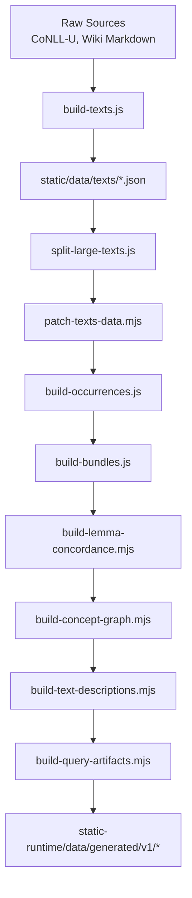

**Diagram sources**
- [package.json:8-17](file://package.json#L8-L17)
- [build-texts.js:1-191](file://scripts/build-texts.js#L1-L191)
- [split-large-texts.js:1-56](file://scripts/split-large-texts.js#L1-L56)
- [patch-texts-data.mjs:1-106](file://scripts/patch-texts-data.mjs#L1-L106)
- [build-occurrences.js:1-48](file://scripts/build-occurrences.js#L1-L48)
- [build-bundles.js:1-201](file://scripts/build-bundles.js#L1-L201)
- [build-lemma-concordance.mjs:1-271](file://scripts/build-lemma-concordance.mjs#L1-L271)
- [build-concept-graph.mjs:1-188](file://scripts/build-concept-graph.mjs#L1-L188)
- [build-text-descriptions.mjs:1-281](file://scripts/build-text-descriptions.mjs#L1-L281)
- [build-query-artifacts.mjs:1-207](file://scripts/build-query-artifacts.mjs#L1-L207)

**Section sources**
- [package.json:8-17](file://package.json#L8-L17)
- [corpus-pipeline.md:1-52](file://src/routes/docs/developer/corpus-pipeline.md#L1-L52)

## Core Components
- Text builder: Parses CoNLL-U files into verses and tokens, writes per-text JSON bundles and a texts.json index.
- Large text splitter: Splits oversized texts into multiple parts to meet repository size constraints.
- Text patcher: Normalizes filenames and patches texts.json with file fields; builds slug-to-file index.
- Occurrence builder: Scans all text bundles to produce word-occurrences mapping lemmas to text slugs.
- Bundle builder: Produces canonical bundles for dhātus, lemmas, dictionary entries, sutras, and dhatu-word bridges.
- Lemma concordance builder: Extracts properties, definitions, semantic classification, distribution, and sample concordance from wiki lemmas.
- Concept graph builder: Builds supersenses, synsets, and reverse indices linking lemmas to concepts.
- Text descriptions builder: Extracts frontmatter and tables, sanitizes HTML, and produces text-descriptions.json.
- Query artifact generator: Assembles versioned, bucketed artifacts for search, lemmas, roots, concepts, excerpts, graphs, and paginated text pages.

**Section sources**
- [build-texts.js:1-191](file://scripts/build-texts.js#L1-L191)
- [split-large-texts.js:1-56](file://scripts/split-large-texts.js#L1-L56)
- [patch-texts-data.mjs:1-106](file://scripts/patch-texts-data.mjs#L1-L106)
- [build-occurrences.js:1-48](file://scripts/build-occurrences.js#L1-L48)
- [build-bundles.js:1-201](file://scripts/build-bundles.js#L1-L201)
- [build-lemma-concordance.mjs:1-271](file://scripts/build-lemma-concordance.mjs#L1-L271)
- [build-concept-graph.mjs:1-188](file://scripts/build-concept-graph.mjs#L1-L188)
- [build-text-descriptions.mjs:1-281](file://scripts/build-text-descriptions.mjs#L1-L281)
- [build-query-artifacts.mjs:1-207](file://scripts/build-query-artifacts.mjs#L1-L207)

## Architecture Overview
The pipeline separates canonical inputs from public runtime outputs. Canonical data remains in static/data/ and is not served at runtime. Public artifacts are generated under static-runtime/data/generated/<version>/ and consumed via a client fetcher with request caching.

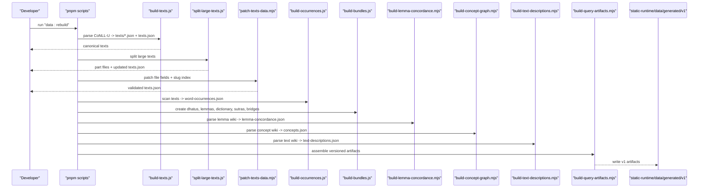

**Diagram sources**
- [package.json:8-17](file://package.json#L8-L17)
- [build-texts.js:1-191](file://scripts/build-texts.js#L1-L191)
- [split-large-texts.js:1-56](file://scripts/split-large-texts.js#L1-L56)
- [patch-texts-data.mjs:1-106](file://scripts/patch-texts-data.mjs#L1-L106)
- [build-occurrences.js:1-48](file://scripts/build-occurrences.js#L1-L48)
- [build-bundles.js:1-201](file://scripts/build-bundles.js#L1-L201)
- [build-lemma-concordance.mjs:1-271](file://scripts/build-lemma-concordance.mjs#L1-L271)
- [build-concept-graph.mjs:1-188](file://scripts/build-concept-graph.mjs#L1-L188)
- [build-text-descriptions.mjs:1-281](file://scripts/build-text-descriptions.mjs#L1-L281)
- [build-query-artifacts.mjs:1-207](file://scripts/build-query-artifacts.mjs#L1-L207)

## Detailed Component Analysis

### Text Builder (build-texts.js)
- Reads CoNLL-U files recursively from the configured raw directory.
- Parses sentences, chapters, counters, and token columns into structured verses with tokens.
- Converts IAST to Devanagari using sanscript.
- Writes per-text JSON bundles under static/data/texts/ and a texts.json metadata index.

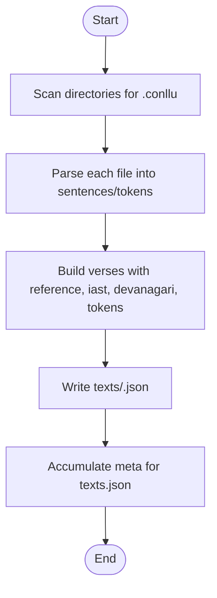

**Diagram sources**
- [build-texts.js:25-137](file://scripts/build-texts.js#L25-L137)
- [build-texts.js:139-191](file://scripts/build-texts.js#L139-L191)

**Section sources**
- [build-texts.js:1-191](file://scripts/build-texts.js#L1-L191)

### Large Text Splitter (split-large-texts.js)
- Splits defined large texts into multiple parts to satisfy repository size limits.
- Updates texts.json metadata to reflect new part slugs and titles.

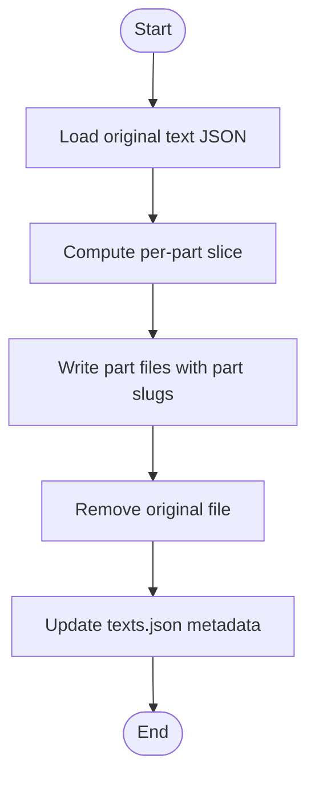

**Diagram sources**
- [split-large-texts.js:8-56](file://scripts/split-large-texts.js#L8-L56)

**Section sources**
- [split-large-texts.js:1-56](file://scripts/split-large-texts.js#L1-L56)

### Text Patching (patch-texts-data.mjs)
- Adds a file field to each entry in texts.json pointing to the actual on-disk filename.
- Resolves case-sensitive filenames across platforms.
- Generates a slug-to-file index for callers without full context.

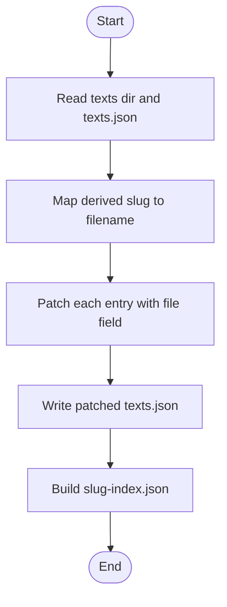

**Diagram sources**
- [patch-texts-data.mjs:32-106](file://scripts/patch-texts-data.mjs#L32-L106)

**Section sources**
- [patch-texts-data.mjs:1-106](file://scripts/patch-texts-data.mjs#L1-L106)

### Occurrence Builder (build-occurrences.js)
- Scans all text bundles to map each lemma to the set of text slugs where it appears.
- Outputs word-occurrences.json used by downstream components.

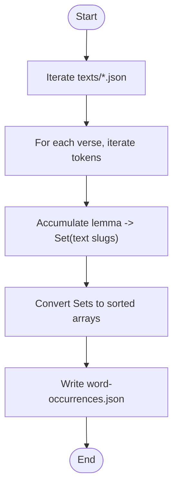

**Diagram sources**
- [build-occurrences.js:1-48](file://scripts/build-occurrences.js#L1-L48)

**Section sources**
- [build-occurrences.js:1-48](file://scripts/build-occurrences.js#L1-L48)

### Bundle Builder (build-bundles.js)
- Produces canonical bundles: dhatus, lemmas, dictionary entries, sutras, and dhatu-word bridges.
- Enriches dhatus with sutra references and related data.
- Normalizes keys and trims content for consistent consumption.

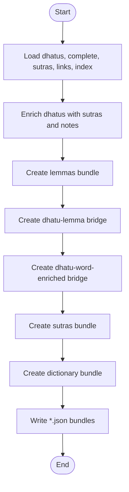

**Diagram sources**
- [build-bundles.js:34-201](file://scripts/build-bundles.js#L34-L201)

**Section sources**
- [build-bundles.js:1-201](file://scripts/build-bundles.js#L1-L201)

### Lemma Concordance Builder (build-lemma-concordance.mjs)
- Parses LEMMAS.md and per-lemma markdown files to extract:
  - Properties (POS, occurrences, texts appeared in)
  - Dictionary definitions (concatenated)
  - Semantic classification (WordNet supersense and concept id)
  - Text distribution (top entries)
  - Concordance samples (top entries)
- Outputs lemma-concordance.json keyed by ASCII-normalized lemma forms.

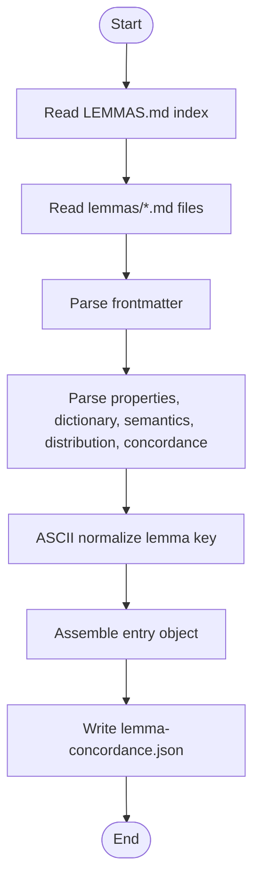

**Diagram sources**
- [build-lemma-concordance.mjs:33-271](file://scripts/build-lemma-concordance.mjs#L33-L271)

**Section sources**
- [build-lemma-concordance.mjs:1-271](file://scripts/build-lemma-concordance.mjs#L1-L271)

### Concept Graph Builder (build-concept-graph.mjs)
- Parses supersense and synset markdown files to construct:
  - sup: supersense metadata and stats
  - syn: synset metadata including WordNet ID, parent, hyponyms
  - cl: reverse index conceptId → lemmas
  - co: lemma → {conceptId: name}
- Uses lemma-concordance.json to build reverse indices.

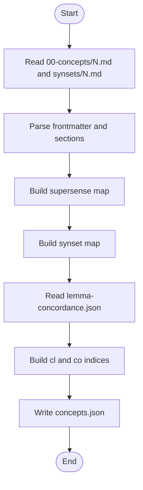

**Diagram sources**
- [build-concept-graph.mjs:24-188](file://scripts/build-concept-graph.mjs#L24-L188)

**Section sources**
- [build-concept-graph.mjs:1-188](file://scripts/build-concept-graph.mjs#L1-L188)

### Text Descriptions Builder (build-text-descriptions.mjs)
- Iterates top-level markdown files (excluding 00-*), extracts YAML frontmatter and specific tables.
- Produces text-descriptions.json keyed by new ASCII slug, including sanitized bodyHtml.
- Filters notable lemmas using a curated list to avoid function words.

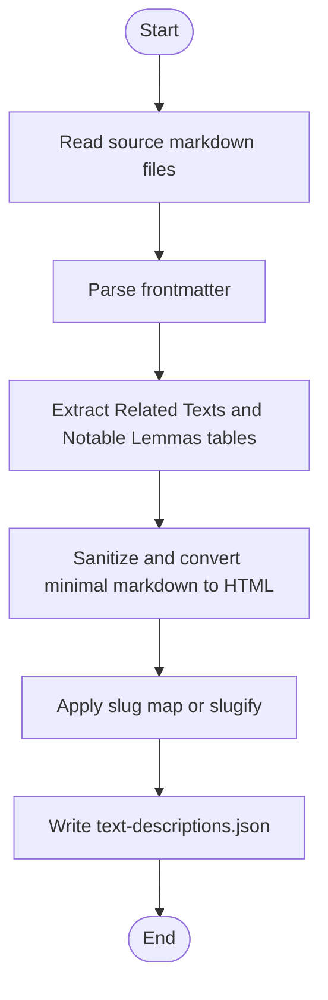

**Diagram sources**
- [build-text-descriptions.mjs:18-281](file://scripts/build-text-descriptions.mjs#L18-L281)
- [notable-lemmas.mjs:1-14](file://scripts/lib/notable-lemmas.mjs#L1-L14)

**Section sources**
- [build-text-descriptions.mjs:1-281](file://scripts/build-text-descriptions.mjs#L1-L281)
- [notable-lemmas.mjs:1-14](file://scripts/lib/notable-lemmas.mjs#L1-L14)

### Query Artifact Generator (build-query-artifacts.mjs and lib)
- Orchestrates reading canonical inputs and generating versioned artifacts under static-runtime/data/generated/<version>/.
- Produces:
  - texts/index.json and per-text meta/references/pages
  - search buckets for lemmas
  - lemma details with dictionary, root info, occurrences, concordance, concepts
  - root details grouped by root relationships
  - concept artifacts with ISA chains and member lemmas
  - excerpt buckets from concordance
  - graph artifacts for roots, lemmas, texts, and a query index
- Uses utility functions for ASCII normalization, bucketing, page naming, and path versioning.

```mermaid
classDiagram
class ArtifactsLib {
+asciiKey(value) string
+bucketFor(value) string
+pageFilename(page) string
+versionedArtifactPath(version, relativePath) string
}
class BuildQueryArtifacts {
+createLemmaSlugResolver(lemmas) function
+buildTextArtifacts(meta, text, description, resolveLemmaSlug) object
+buildSearchBuckets(lemmas) object
+buildLemmaDetails({lemmas,dictionary,dhatus,bridge,enriched,occurrences,concordance,concepts}) object
+buildRootDetails({dhatus,enriched,bridge,dictionary,occurrences}) object
+buildConceptArtifacts(concepts, lemmas) object
+buildExcerptBuckets(concordance) object
+buildGraphArtifacts({lemmas,dhatus,bridge,enriched,occurrences,dictionary,texts}) object
}
ArtifactsLib <.. BuildQueryArtifacts : "used by"
```

**Diagram sources**
- [artifacts.mjs:1-24](file://scripts/lib/artifacts.mjs#L1-L24)
- [build-query-artifacts.mjs (lib):1-457](file://scripts/lib/build-query-artifacts.mjs#L1-L457)

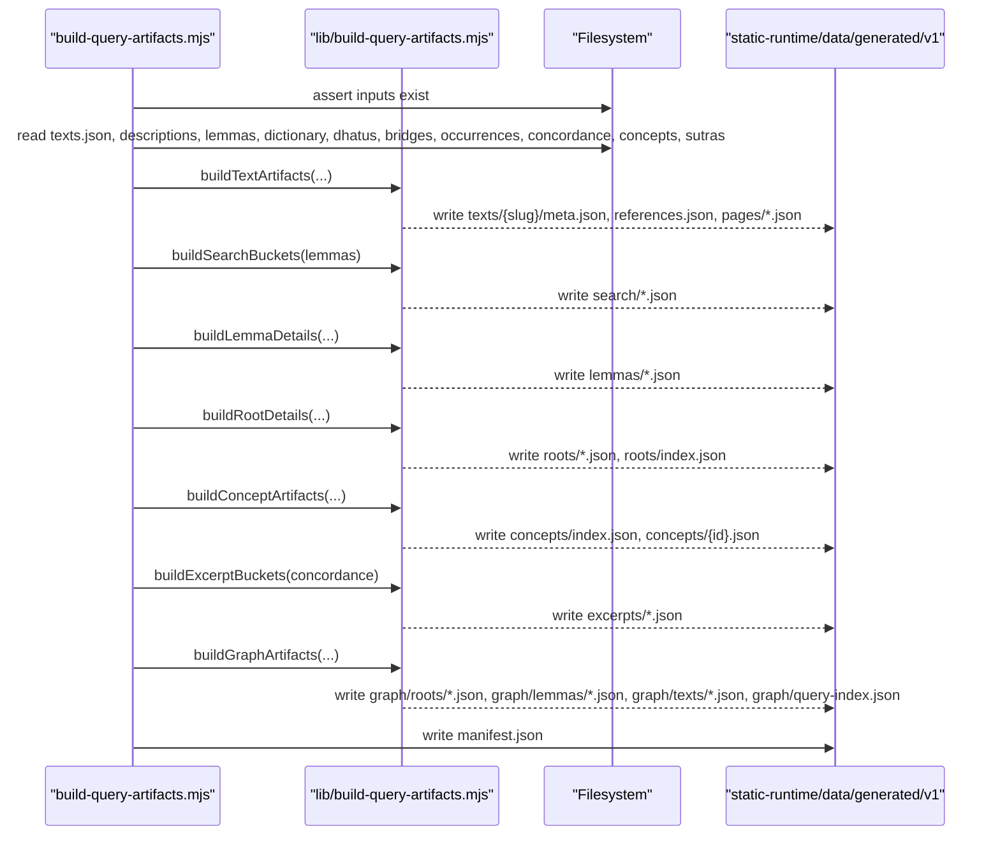

**Diagram sources**
- [build-query-artifacts.mjs:1-207](file://scripts/build-query-artifacts.mjs#L1-L207)
- [build-query-artifacts.mjs (lib):1-457](file://scripts/lib/build-query-artifacts.mjs#L1-L457)

**Section sources**
- [build-query-artifacts.mjs:1-207](file://scripts/build-query-artifacts.mjs#L1-L207)
- [build-query-artifacts.mjs (lib):1-457](file://scripts/lib/build-query-artifacts.mjs#L1-L457)
- [artifacts.mjs (lib):1-24](file://scripts/lib/artifacts.mjs#L1-L24)

## Dependency Analysis
The pipeline has a strict dependency order enforced by the rebuild script sequence. Inputs and outputs are clearly separated:
- Canonical data: static/data/* (texts.json, texts/*.json, word-occurrences.json, bundles, lemma-concordance.json, concepts.json, text-descriptions.json)
- Runtime artifacts: static-runtime/data/generated/v1/* (versioned, bucketed, and paginated projections)

```mermaid
graph LR
Raw["Raw CoNLL-U / Wiki"] --> Texts["build-texts.js"]
Texts --> Split["split-large-texts.js"]
Split --> Patch["patch-texts-data.mjs"]
Patch --> Occ["build-occurrences.js"]
Occ --> Bundles["build-bundles.js"]
Bundles --> Conc["build-lemma-concordance.mjs"]
Conc --> Graph["build-concept-graph.mjs"]
Graph --> Desc["build-text-descriptions.mjs"]
Desc --> QA["build-query-artifacts.mjs"]
QA --> Runtime["static-runtime/data/generated/v1"]
```

**Diagram sources**
- [package.json:8-17](file://package.json#L8-L17)
- [corpus-pipeline.md:29-43](file://src/routes/docs/developer/corpus-pipeline.md#L29-L43)

**Section sources**
- [package.json:8-17](file://package.json#L8-L17)
- [corpus-pipeline.md:29-43](file://src/routes/docs/developer/corpus-pipeline.md#L29-L43)

## Performance Considerations
- Bucketing: All query artifacts are partitioned into buckets based on normalized keys to bound request sizes and improve lookup locality.
- Pagination: Text pages are split into fixed-size pages (PAGE_SIZE = 20) to limit payload size per request.
- Sanitization: HTML is sanitized during artifact generation to avoid expensive runtime checks and ensure safe rendering.
- Request caching: Client-side request cache deduplicates concurrent requests for the same artifact within a process.
- Versioning: Artifacts are versioned to enable atomic updates and clear cache invalidation boundaries.
- File splitting: Large texts are split to keep individual payloads manageable and reduce memory pressure.

[No sources needed since this section provides general guidance]

## Troubleshooting Guide
Common issues and resolutions:
- Missing inputs: build-query-artifacts.mjs asserts required inputs; ensure static/data contains all expected files before running.
- Incorrect source paths: Use environment variables FRACTALDHARMA_RAW_DIR and FRACTALDHARMA_WIKI_DIR to point to correct locations.
- Case sensitivity: On Linux deployments, ensure canonical filenames match exactly; patch-texts-data.mjs handles known cases like Mahabharata parts.
- Incomplete concordance or concept data: Verify wiki directories and markdown structure; parsers expect specific headings and tables.
- Runtime fetch failures: Client fetcher throws on non-OK responses; verify artifact paths and server availability.
- Cache behavior: Concurrent requests share a single fetch; failed requests are removed from in-flight cache and retried.

**Section sources**
- [build-query-artifacts.mjs:56-79](file://scripts/build-query-artifacts.mjs#L56-L79)
- [corpus-pipeline.md:14-21](file://src/routes/docs/developer/corpus-pipeline.md#L14-L21)
- [patch-texts-data.mjs:32-56](file://scripts/patch-texts-data.mjs#L32-L56)
- [client.ts:6-16](file://src/lib/data/client.ts#L6-L16)
- [artifact-cache.test.mjs:1-36](file://tests/artifact-cache.test.mjs#L1-L36)

## Conclusion
FractalDharma’s corpus pipeline cleanly separates canonical data construction from runtime artifact generation. Each stage focuses on a specific transformation, producing well-defined, versioned, and bucketed outputs optimized for low-latency, bounded requests. The design emphasizes deterministic builds, explicit dependencies, and robust error handling, enabling reliable updates and migrations while maintaining fast, predictable runtime performance.

[No sources needed since this section summarizes without analyzing specific files]

## Appendices

### Usage Examples
- Full rebuild from raw sources:
  - pnpm data:rebuild
- Regenerate public artifacts from canonical data:
  - pnpm data:build

**Section sources**
- [package.json:8-17](file://package.json#L8-L17)

### Configuration Options
- Environment variables:
  - FRACTALDHARMA_RAW_DIR: Path to raw CoNLL-U sources
  - FRACTALDHARMA_WIKI_DIR: Path to wiki markdown sources (concepts, lemmas, texts)

**Section sources**
- [corpus-pipeline.md:14-21](file://src/routes/docs/developer/corpus-pipeline.md#L14-L21)

### Data Validation and Schema Enforcement
- Input assertions: build-query-artifacts.mjs validates presence of required inputs.
- HTML sanitization: sanitizeHtml enforces an allowlist of elements and link schemes.
- Slug normalization: asciiKey ensures stable, ASCII-only keys for bucketing and indexing.
- Contract rules: Keep canonical inputs separate from public runtime output; do not serve static/data at runtime.

**Section sources**
- [build-query-artifacts.mjs:56-79](file://scripts/build-query-artifacts.mjs#L56-L79)
- [build-query-artifacts.mjs (lib):15-36](file://scripts/lib/build-query-artifacts.mjs#L15-L36)
- [artifacts.mjs (lib):1-24](file://scripts/lib/artifacts.mjs#L1-L24)
- [artifact-contracts.md:44-53](file://src/routes/docs/developer/artifact-contracts.md#L44-L53)

### Migration Procedures
- When changing artifact schemas:
  - Update both artifact version constants and contracts.
  - Add or update fixture tests before changing projection behavior.
  - Ensure backward compatibility where possible; otherwise publish a new versioned directory.

**Section sources**
- [DEVELOPERS.md:278-295](file://docs/DEVELOPERS.md#L278-L295)

### Relationship Between Build-Time Processing and Runtime Access Patterns
- Build-time: Canonical data is transformed into versioned, bucketed, and paginated artifacts.
- Runtime: Clients fetch one entity per request (text page, lemma detail, concept detail, graph node), leveraging cached requests and stable artifact paths.
- Contracts: References map source positions to display pages; sanitized HTML is pre-rendered; no whole-corpus joins at runtime.

**Section sources**
- [build-query-artifacts.mjs (lib):64-122](file://scripts/lib/build-query-artifacts.mjs#L64-L122)
- [artifact-contracts.md:44-53](file://src/routes/docs/developer/artifact-contracts.md#L44-L53)
- [client.ts:6-16](file://src/lib/data/client.ts#L6-L16)