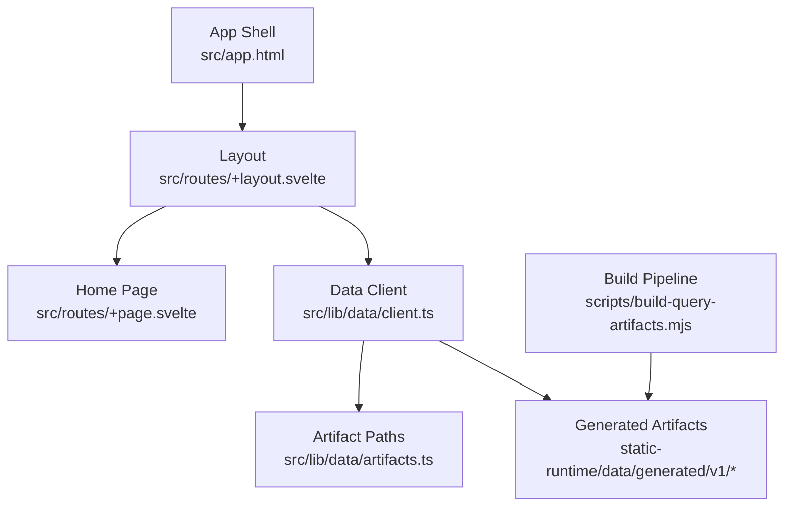
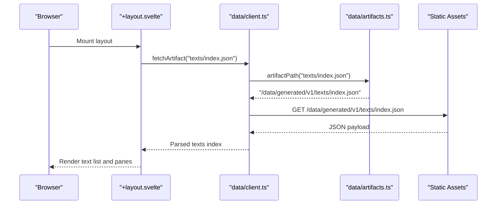
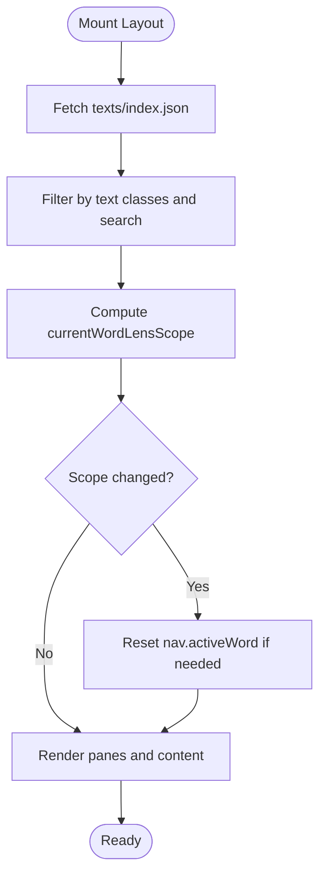
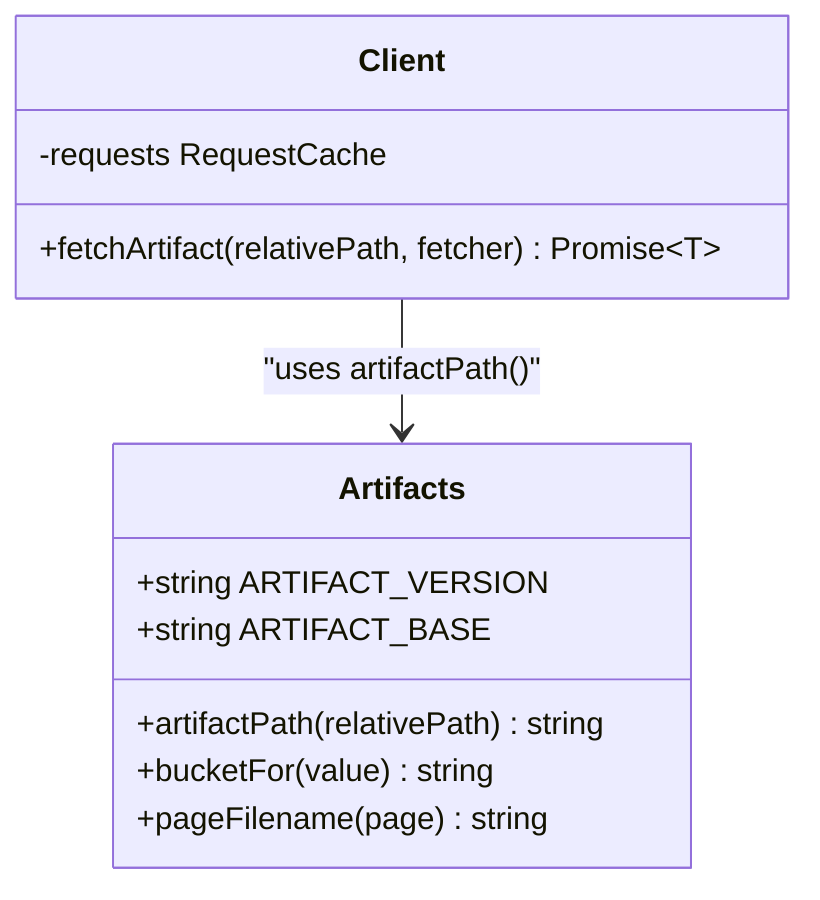
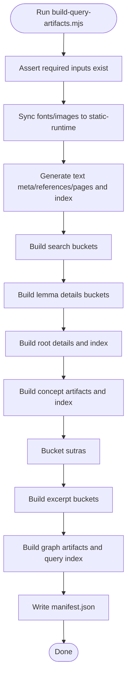
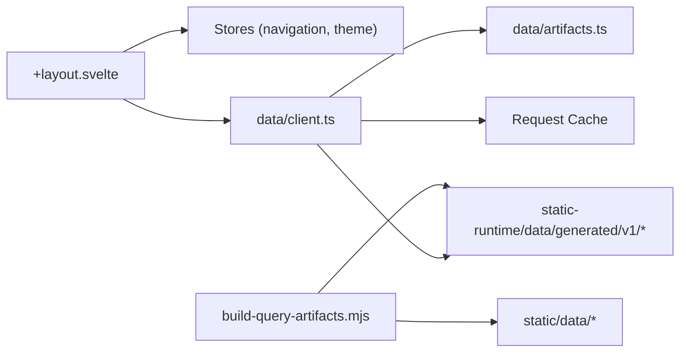

# Developer Guide

<cite>
**Referenced Files in This Document**
- [package.json](file://package.json)
- [svelte.config.js](file://svelte.config.js)
- [vite.config.ts](file://vite.config.ts)
- [src/app.html](file://src/app.html)
- [src/routes/+layout.svelte](file://src/routes/+layout.svelte)
- [src/routes/+page.svelte](file://src/routes/+page.svelte)
- [src/lib/data/artifacts.ts](file://src/lib/data/artifacts.ts)
- [src/lib/data/client.ts](file://src/lib/data/client.ts)
- [src/lib/data/types.ts](file://src/lib/data/types.ts)
- [scripts/build-query-artifacts.mjs](file://scripts/build-query-artifacts.mjs)
</cite>

## Table of Contents
1. [Introduction](#introduction)
2. [Project Structure](#project-structure)
3. [Core Components](#core-components)
4. [Architecture Overview](#architecture-overview)
5. [Detailed Component Analysis](#detailed-component-analysis)
6. [Dependency Analysis](#dependency-analysis)
7. [Performance Considerations](#performance-considerations)
8. [Troubleshooting Guide](#troubleshooting-guide)
9. [Conclusion](#conclusion)
10. [Appendices](#appendices)

## Introduction
This developer guide explains FractalDharma’s SvelteKit-based architecture, component hierarchy, reactive state management with stores, and the artifact-based caching system that powers performance. It also documents the build pipeline for corpus processing, the reader and lens implementation (including active word management and context synchronization), and the data pipeline from raw corpus inputs to generated artifacts. Finally, it provides development workflow guidance, testing procedures, deployment processes, best practices, and debugging strategies.

## Project Structure
FractalDharma is a SvelteKit application configured for Vite and mdsvex, targeting Node runtime via an adapter. The app shell and layout orchestrate navigation, panes, and the Context Lens. Data is loaded through a client that fetches prebuilt artifacts from a versioned path. Build scripts transform raw corpus data into optimized artifacts consumed by the client at runtime.

**Diagram sources**
- [src/app.html:1-13](file://src/app.html#L1-L13)
- [src/routes/+layout.svelte:1-303](file://src/routes/+layout.svelte#L1-L303)
- [src/routes/+page.svelte:1-43](file://src/routes/+page.svelte#L1-L43)
- [src/lib/data/client.ts:1-17](file://src/lib/data/client.ts#L1-L17)
- [src/lib/data/artifacts.ts:1-27](file://src/lib/data/artifacts.ts#L1-L27)
- [scripts/build-query-artifacts.mjs:1-207](file://scripts/build-query-artifacts.mjs#L1-L207)

**Section sources**
- [package.json:1-47](file://package.json#L1-L47)
- [svelte.config.js:1-29](file://svelte.config.js#L1-L29)
- [vite.config.ts:1-7](file://vite.config.ts#L1-L7)
- [src/app.html:1-13](file://src/app.html#L1-L13)
- [src/routes/+layout.svelte:1-303](file://src/routes/+layout.svelte#L1-L303)
- [src/routes/+page.svelte:1-43](file://src/routes/+page.svelte#L1-L43)
- [src/lib/data/artifacts.ts:1-27](file://src/lib/data/artifacts.ts#L1-L27)
- [src/lib/data/client.ts:1-17](file://src/lib/data/client.ts#L1-L17)
- [scripts/build-query-artifacts.mjs:1-207](file://scripts/build-query-artifacts.mjs#L1-L207)

## Core Components
- App shell and layout: Provides global navigation, pane layout, theme toggling, and Context Lens integration. It manages mobile/desktop layouts and synchronizes the active word scope across routes.
- Data client and artifacts: Centralized artifact fetching with request caching and normalized artifact paths. Types define contracts for text metadata, pages, lemmas, roots, and concepts.
- Build pipeline: Orchestrates reading raw corpus JSON files, generating page artifacts, search buckets, lemma/root details, concept artifacts, sutra buckets, excerpts, graph artifacts, and a manifest.

Key responsibilities:
- Layout orchestrates UI state and navigation interactions.
- Client ensures consistent artifact retrieval and caching.
- Build script produces deterministic, versioned artifacts for fast client-side access.

**Section sources**
- [src/routes/+layout.svelte:1-303](file://src/routes/+layout.svelte#L1-L303)
- [src/lib/data/client.ts:1-17](file://src/lib/data/client.ts#L1-L17)
- [src/lib/data/artifacts.ts:1-27](file://src/lib/data/artifacts.ts#L1-L27)
- [src/lib/data/types.ts:1-92](file://src/lib/data/types.ts#L1-L92)
- [scripts/build-query-artifacts.mjs:1-207](file://scripts/build-query-artifacts.mjs#L1-L207)

## Architecture Overview
The application follows a clear separation between build-time data transformation and runtime consumption:
- Build-time: Raw corpus data is transformed into versioned artifacts under static-runtime/data/generated/v1.
- Runtime: Svelte components fetch artifacts via a cached client using stable artifact paths.

**Diagram sources**
- [src/routes/+layout.svelte:1-303](file://src/routes/+layout.svelte#L1-L303)
- [src/lib/data/client.ts:1-17](file://src/lib/data/client.ts#L1-L17)
- [src/lib/data/artifacts.ts:1-27](file://src/lib/data/artifacts.ts#L1-L27)

## Detailed Component Analysis

### Layout and Navigation
The layout composes left, main, and right panels using a resizable pane group on desktop and a single-column layout on mobile. It:
- Loads the texts index on mount and filters by selected text classes and search query.
- Derives current route context to scope the Word Lens (explorer vs text vs root).
- Manages active word lifecycle per scope and resets when scope changes.
- Integrates theme toggle and icons for navigation.

**Diagram sources**
- [src/routes/+layout.svelte:1-303](file://src/routes/+layout.svelte#L1-L303)

**Section sources**
- [src/routes/+layout.svelte:1-303](file://src/routes/+layout.svelte#L1-L303)

### Data Client and Artifact System
The client centralizes artifact fetching with request caching and error handling. Artifact paths are derived from a versioned base path, ensuring cache stability and easy invalidation by changing the version.

**Diagram sources**
- [src/lib/data/artifacts.ts:1-27](file://src/lib/data/artifacts.ts#L1-L27)
- [src/lib/data/client.ts:1-17](file://src/lib/data/client.ts#L1-L17)

**Section sources**
- [src/lib/data/artifacts.ts:1-27](file://src/lib/data/artifacts.ts#L1-L27)
- [src/lib/data/client.ts:1-17](file://src/lib/data/client.ts#L1-L17)

### Types and Contracts
Types define the shape of artifacts consumed by the UI:
- TextMetaArtifact and TextPageArtifact describe text metadata and paginated page content.
- LemmaRecord and RootDetailArtifact model dictionary and dhātu entries.
- Concept-related structures support semantic exploration.

These types ensure consistency between build outputs and runtime usage.

**Section sources**
- [src/lib/data/types.ts:1-92](file://src/lib/data/types.ts#L1-L92)

### Build Pipeline for Corpus Processing
The build script orchestrates artifact generation:
- Validates required input files under static/data.
- Syncs public assets (fonts, images) to static-runtime.
- Generates text artifacts (meta, references, pages), search buckets, lemma details, root details, concept artifacts, sutra buckets, excerpt buckets, and graph artifacts.
- Writes a manifest summarizing counts and schema version.

**Diagram sources**
- [scripts/build-query-artifacts.mjs:1-207](file://scripts/build-query-artifacts.mjs#L1-L207)

**Section sources**
- [scripts/build-query-artifacts.mjs:1-207](file://scripts/build-query-artifacts.mjs#L1-L207)

### Reader and Lens Implementation
- Active word management: The layout computes a scope based on the current route and clears or resets the active word when the scope changes. This keeps the Word Lens synchronized with the user’s context.
- Compound word handling: While specific compound logic resides in utility modules, the layout integrates normalization and matching helpers to filter and display relevant content consistently.
- Context synchronization: Effects ensure that navigating away from a scope resets the active word, preventing stale lens state.

Best practices:
- Always derive scope from the URL to avoid drift between UI and state.
- Use normalized forms for search and matching to handle diacritics and variants.

**Section sources**
- [src/routes/+layout.svelte:1-303](file://src/routes/+layout.svelte#L1-L303)

### Home Page Behavior
The home page initializes pane visibility and presents primary exploration pathways. It sets up the initial state for panes and links to major sections.

**Section sources**
- [src/routes/+page.svelte:1-43](file://src/routes/+page.svelte#L1-L43)

## Dependency Analysis
High-level dependencies:
- Layout depends on stores for navigation and theme, and on the data client for artifacts.
- Client depends on artifacts utilities for path resolution and uses a request cache.
- Build script depends on multiple corpus inputs and generates versioned artifacts consumed by the client.

**Diagram sources**
- [src/routes/+layout.svelte:1-303](file://src/routes/+layout.svelte#L1-L303)
- [src/lib/data/client.ts:1-17](file://src/lib/data/client.ts#L1-L17)
- [src/lib/data/artifacts.ts:1-27](file://src/lib/data/artifacts.ts#L1-L27)
- [scripts/build-query-artifacts.mjs:1-207](file://scripts/build-query-artifacts.mjs#L1-L207)

**Section sources**
- [src/routes/+layout.svelte:1-303](file://src/routes/+layout.svelte#L1-L303)
- [src/lib/data/client.ts:1-17](file://src/lib/data/client.ts#L1-L17)
- [src/lib/data/artifacts.ts:1-27](file://src/lib/data/artifacts.ts#L1-L27)
- [scripts/build-query-artifacts.mjs:1-207](file://scripts/build-query-artifacts.mjs#L1-L207)

## Performance Considerations
- Artifact versioning: Changing ARTIFACT_VERSION invalidates caches and ensures clients load fresh artifacts without stale data.
- Bucketing: Search, lemma, and graph data are split into buckets to reduce payload sizes and improve lookup performance.
- Request caching: The client caches requests to avoid redundant network calls during navigation.
- Preloading: Links use data-sveltekit-preload-data to prefetch route data where applicable.
- Asset syncing: Fonts and images are synced to static-runtime to minimize runtime overhead.

[No sources needed since this section provides general guidance]

## Troubleshooting Guide
Common issues and resolutions:
- Missing inputs: The build script asserts required inputs; ensure all JSON files exist under static/data before running the build.
- Artifact fetch failures: The client throws errors when responses are not ok; verify artifact paths and server availability.
- Stale state: If the Word Lens shows outdated content, check scope computation and effect-driven resets in the layout.
- Type mismatches: Ensure build outputs match TypeScript interfaces defined in types.ts.

Debugging tips:
- Inspect network requests to confirm artifact URLs and payloads.
- Log scope transitions and active word changes in the layout effects.
- Validate bucket keys and page filenames against expected formats.

**Section sources**
- [scripts/build-query-artifacts.mjs:1-207](file://scripts/build-query-artifacts.mjs#L1-L207)
- [src/lib/data/client.ts:1-17](file://src/lib/data/client.ts#L1-L17)
- [src/routes/+layout.svelte:1-303](file://src/routes/+layout.svelte#L1-L303)

## Conclusion
FractalDharma combines a clean SvelteKit architecture with a robust artifact-based caching system and a comprehensive build pipeline. The layout coordinates UI state and context synchronization, while the client abstracts artifact retrieval. The build process transforms raw corpus data into optimized, versioned artifacts that power fast, reliable runtime experiences. Following the guidelines here will help you extend functionality, maintain performance, and contribute effectively.

[No sources needed since this section summarizes without analyzing specific files]

## Appendices

### Development Workflow
- Local setup:
  - Install dependencies with pnpm.
  - Run the data build to generate artifacts.
  - Start the dev server.
- Testing:
  - Execute data tests to validate build outputs and artifact integrity.
- Deployment:
  - Build the app; the adapter targets Node runtime.
  - Ensure static-runtime contains generated artifacts.

Relevant commands:
- dev: start development server
- build: run data build then production build
- preview: preview production build locally
- data:build: regenerate query artifacts
- data:rebuild: full corpus rebuild pipeline
- test:data: run data tests

**Section sources**
- [package.json:1-47](file://package.json#L1-L47)
- [svelte.config.js:1-29](file://svelte.config.js#L1-L29)
- [vite.config.ts:1-7](file://vite.config.ts#L1-L7)

### Extending Functionality
- Adding new artifacts:
  - Extend the build script to read new inputs and write versioned artifacts.
  - Update types.ts to reflect new shapes.
  - Add client methods or reuse fetchArtifact with new relative paths.
- Enhancing the reader/lens:
  - Integrate additional normalization or matching utilities.
  - Ensure scope effects reset active state appropriately.
- Styling and themes:
  - Modify Sass variables and theme toggles in the layout.

[No sources needed since this section provides general guidance]