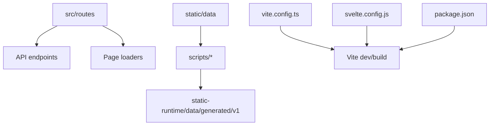
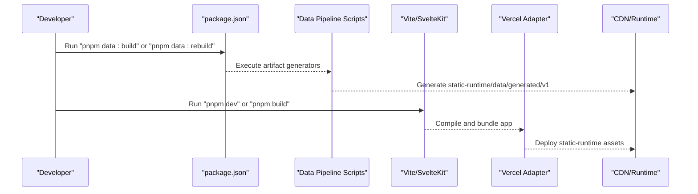
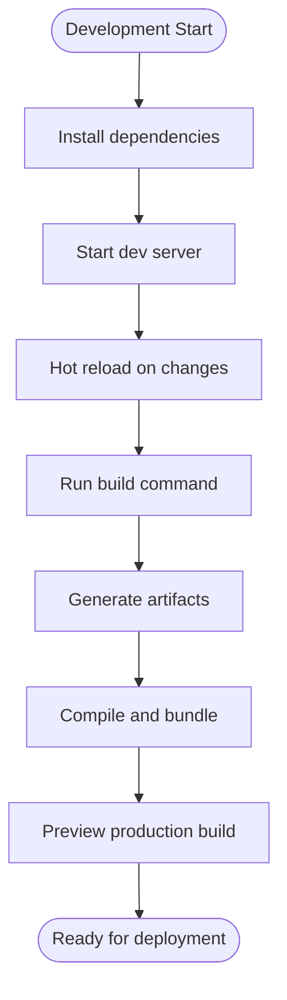
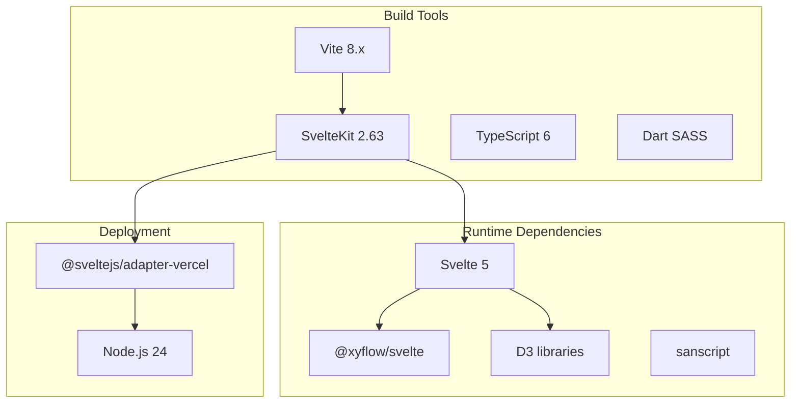

# Development Workflow

<cite>
**Referenced Files in This Document**
- [package.json](file://package.json)
- [svelte.config.js](file://svelte.config.js)
- [vite.config.ts](file://vite.config.ts)
- [tsconfig.json](file://tsconfig.json)
- [DEVELOPERS.md](file://docs/DEVELOPERS.md)
- [development-workflow.md](file://src/routes/docs/developer/development-workflow.md)
- [AGENTS.md](file://AGENTS.md)
- [hooks.server.ts](file://src/hooks.server.ts)
- [+error.svelte](file://src/routes/+error.svelte)
- [artifacts.test.mjs](file://tests/artifacts.test.mjs)
- [architecture.test.mjs](file://tests/architecture.test.mjs)
</cite>

## Table of Contents
1. [Introduction](#introduction)
2. [Project Structure](#project-structure)
3. [Core Components](#core-components)
4. [Architecture Overview](#architecture-overview)
5. [Detailed Component Analysis](#detailed-component-analysis)
6. [Dependency Analysis](#dependency-analysis)
7. [Performance Considerations](#performance-considerations)
8. [Troubleshooting Guide](#troubleshooting-guide)
9. [Conclusion](#conclusion)
10. [Appendices](#appendices)

## Introduction
This document provides a comprehensive development workflow for FractalDharma, covering local setup, build and hot reloading, testing, code organization, contribution guidelines, debugging, performance profiling, deployment, environment variables, monitoring, release management, rollback strategies, and extending functionality while maintaining quality standards. It is designed to be accessible to both new and experienced contributors.

## Project Structure
FractalDharma is a Svelte 5 + SvelteKit 2 application with a deterministic data pipeline that converts canonical corpus inputs into versioned, query-shaped JSON artifacts served from static-runtime. The project uses TypeScript strict mode, Dart SASS (indented syntax), and Vercel Node runtime.

Key directories:
- src: Application routes, components, stores, types, styles, and utilities
- scripts: Data pipeline and artifact generation tools
- static: Canonical build-time inputs (not deployed)
- static-runtime: Generated public artifacts and fonts (deployed)
- tests: Node-based tests using the built-in test runner

**Diagram sources**
- [vite.config.ts:1-7](file://vite.config.ts#L1-L7)
- [svelte.config.js:1-29](file://svelte.config.js#L1-L29)
- [package.json:1-47](file://package.json#L1-L47)
- [DEVELOPERS.md:65-116](file://docs/DEVELOPERS.md#L65-L116)

**Section sources**
- [DEVELOPERS.md:1-64](file://docs/DEVELOPERS.md#L1-L64)
- [development-workflow.md:1-51](file://src/routes/docs/developer/development-workflow.md#L1-L51)

## Core Components
- Build system: Vite with SvelteKit plugin; TypeScript and SASS preprocessing via svelte.config.js
- Runtime adapter: @sveltejs/adapter-vercel targeting Node.js 24
- Data pipeline: Deterministic scripts generating versioned artifacts under static-runtime/data/generated/v1
- Testing: Node built-in test runner with architecture and artifact tests
- Error handling: Global server hook and error page

Key configuration files:
- package.json: Scripts for dev, build, data:build, data:rebuild, check, and test:data
- svelte.config.js: Preprocessors, extensions, compiler options, assets path, and adapter config
- vite.config.ts: SvelteKit plugin registration
- tsconfig.json: Strict TypeScript settings and module resolution

**Section sources**
- [package.json:1-47](file://package.json#L1-L47)
- [svelte.config.js:1-29](file://svelte.config.js#L1-L29)
- [vite.config.ts:1-7](file://vite.config.ts#L1-L7)
- [tsconfig.json:1-18](file://tsconfig.json#L1-L18)
- [DEVELOPERS.md:13-28](file://docs/DEVELOPERS.md#L13-L28)

## Architecture Overview
The application follows a clear separation between canonical inputs and generated runtime artifacts. Routes and API endpoints read only from versioned artifacts, ensuring bounded requests and predictable performance.

**Diagram sources**
- [package.json:8-18](file://package.json#L8-L18)
- [DEVELOPERS.md:215-238](file://docs/DEVELOPERS.md#L215-L238)
- [svelte.config.js:18-25](file://svelte.config.js#L18-L25)

## Detailed Component Analysis

### Local Development Setup
- Node.js requirements: Use Node.js compatible with Vite 8.x (Node ^20.19.0 || >=22.12.0)
- Package manager: pnpm@10.28.2
- Installation: `pnpm install`
- Environment variables: Set FRACTALDHARMA_RAW_DIR and FRACTALDHARMA_WIKI_DIR for script inputs if needed
- Development server: `pnpm dev` starts Vite with hot reloading
- Type checking: `pnpm check` generates SvelteKit types and runs diagnostics

**Section sources**
- [package.json:19-35](file://package.json#L19-L35)
- [package.json:6](file://package.json#L6)
- [DEVELOPERS.md:239-250](file://docs/DEVELOPERS.md#L239-L250)
- [development-workflow.md:10-21](file://src/routes/docs/developer/development-workflow.md#L10-L21)

### Build Process and Hot Reloading
- Production build: `pnpm build` runs data:build then Vite production build
- Data rebuild: `pnpm data:rebuild` executes full pipeline in dependency order
- Hot reloading: `pnpm dev` enables live reload during development
- Asset serving: static-runtime is configured as the assets directory

**Diagram sources**
- [package.json:8-18](file://package.json#L8-L18)
- [svelte.config.js:18-25](file://svelte.config.js#L18-L25)

**Section sources**
- [package.json:8-18](file://package.json#L8-L18)
- [DEVELOPERS.md:215-238](file://docs/DEVELOPERS.md#L215-L238)

### Testing Framework and Conventions
- Test runner: Node built-in test runner (`node --test`)
- Test structure: Individual test files for artifacts, cache behavior, and architecture validation
- Writing conventions: Import node:test and assert/strict, use descriptive test names
- Running tests: `pnpm test:data` executes all Node fixture and architecture tests

Test categories:
- Artifact tests: Validate normalization, bucketing, pagination, and versioned paths
- Cache tests: Verify concurrent request deduplication and retry behavior
- Architecture tests: Ensure SSR defaults, no legacy stores, and no machine-specific paths

**Section sources**
- [package.json:17](file://package.json#L17)
- [artifacts.test.mjs:1-33](file://tests/artifacts.test.mjs#L1-L33)
- [architecture.test.mjs:1-55](file://tests/architecture.test.mjs#L1-L55)
- [DEVELOPERS.md:252-276](file://docs/DEVELOPERS.md#L252-L276)

### Continuous Integration Practices
- Automated checks: Use `pnpm check` for type validation and `pnpm test:data` for automated testing
- Build verification: Run `pnpm build` to ensure production builds succeed
- Deployment gates: Repository policy requires user to run browser/deployment testing manually
- Agent guidelines: Agents should run Node tests and static assertions only

**Section sources**
- [DEVELOPERS.md:276-277](file://docs/DEVELOPERS.md#L276-L277)

### Code Organization Principles
- Directory structure: Feature-based organization with routes, components, stores, and utilities
- Naming conventions: PascalCase for components, camelCase for utilities, kebab-case for file names
- Svelte conventions: Runes-only mode, modern event attributes, proper prop typing
- SASS conventions: Classic indented syntax with tabs, shared primitives, token-based styling

**Section sources**
- [development-workflow.md:31-40](file://src/routes/docs/developer/development-workflow.md#L31-L40)
- [DEVELOPERS.md:29-64](file://docs/DEVELOPERS.md#L29-L64)

### Contribution Guidelines
- Safe editing rules: Use apply_patch for source edits, avoid destructive Git operations
- Environment variables: Never add absolute machine paths; use environment variables with repository-relative defaults
- Generated output: Treat static-runtime as generated; regenerate rather than hand-edit
- Architecture changes: Update artifact tests when changing JSON shapes or contracts
- Documentation updates: Maintain this document in the same commit as architectural changes

**Section sources**
- [development-workflow.md:23-30](file://src/routes/docs/developer/development-workflow.md#L23-L30)
- [DEVELOPERS.md:278-289](file://docs/DEVELOPERS.md#L278-L289)

### Debugging Strategies
- Server hooks: Global error handling in hooks.server.ts logs errors with context
- Error pages: Custom +error.svelte provides user-friendly error messages
- Console logging: Use console.error for server-side debugging
- Network inspection: Monitor API endpoints and artifact loading in browser devtools

**Section sources**
- [hooks.server.ts:1-12](file://src/hooks.server.ts#L1-L12)
- [+error.svelte:1-16](file://src/routes/+error.svelte#L1-L16)

### Performance Profiling
- Request caching: Built-in completed-value and in-flight promise cache prevents duplicate requests
- Artifact design: Versioned, bounded JSON files optimize network and parsing performance
- Memory management: No whole-corpus loading; lazy loading of specific artifacts
- Bundle optimization: Vite handles tree-shaking and code splitting automatically

**Section sources**
- [DEVELOPERS.md:130-148](file://docs/DEVELOPERS.md#L130-L148)

## Dependency Analysis
The project has clear dependency boundaries between build tools, runtime dependencies, and development dependencies.

**Diagram sources**
- [package.json:19-45](file://package.json#L19-L45)
- [svelte.config.js:1-25](file://svelte.config.js#L1-L25)

**Section sources**
- [package.json:19-45](file://package.json#L19-L45)

## Performance Considerations
- Artifact size: Generated runtime tree can be large (~1.1 GB with 40k+ files) but ensures bounded requests
- CDN optimization: Static deployment assets receive normal CDN/browser caching
- Memory efficiency: No eager corpus loading; lazy loading of specific artifacts
- Network optimization: Debounced search requests prevent stale responses
- Storage considerations: If Vercel deployment cannot accept generated tree, consider object storage/CDN alternative

**Section sources**
- [DEVELOPERS.md:290-295](file://docs/DEVELOPERS.md#L290-L295)

## Troubleshooting Guide
Common issues and solutions:

- Build failures: Run `pnpm data:rebuild` to regenerate artifacts before building
- Type errors: Execute `pnpm check` to generate SvelteKit types and diagnose issues
- Missing dependencies: Ensure Node.js version compatibility with Vite requirements
- Environment variables: Verify FRACTALDHARMA_RAW_DIR and FRACTALDHARMA_WIKI_DIR are set correctly
- Large deployments: Consider object storage/CDN solution for generated artifacts

Error handling patterns:
- Server-side errors logged with URL context
- User-friendly error pages with appropriate status codes
- Graceful fallbacks for failed artifact requests

**Section sources**
- [hooks.server.ts:7-12](file://src/hooks.server.ts#L7-L12)
- [+error.svelte:4-9](file://src/routes/+error.svelte#L4-L9)
- [DEVELOPERS.md:239-250](file://docs/DEVELOPERS.md#L239-L250)

## Conclusion
FractalDharma provides a robust development workflow with clear separation between build-time and runtime concerns. The deterministic data pipeline ensures predictable performance while the modular architecture supports easy extension and maintenance. Following the established conventions and guidelines will help maintain code quality and enable efficient collaboration.

## Appendices

### Environment Variables Reference
| Variable | Purpose | Default | Required |
|----------|---------|---------|----------|
| FRACTALDHARMA_RAW_DIR | Path to raw text data | Repository-relative | Yes |
| FRACTALDHARMA_WIKI_DIR | Path to wiki data | Repository-relative | Yes |

### Common Development Tasks
- Start development: `pnpm dev`
- Build production: `pnpm build`
- Run tests: `pnpm test:data`
- Check types: `pnpm check`
- Rebuild data: `pnpm data:rebuild`

### Release Process
- Version management: Semantic versioning in package.json
- Release steps: Update version, run full build, execute tests, deploy to staging
- Rollback strategy: Re-deploy previous version from CI/CD artifacts
- Monitoring: Track error rates and performance metrics post-deployment

**Section sources**
- [package.json:4](file://package.json#L4)
- [DEVELOPERS.md:276-277](file://docs/DEVELOPERS.md#L276-L277)