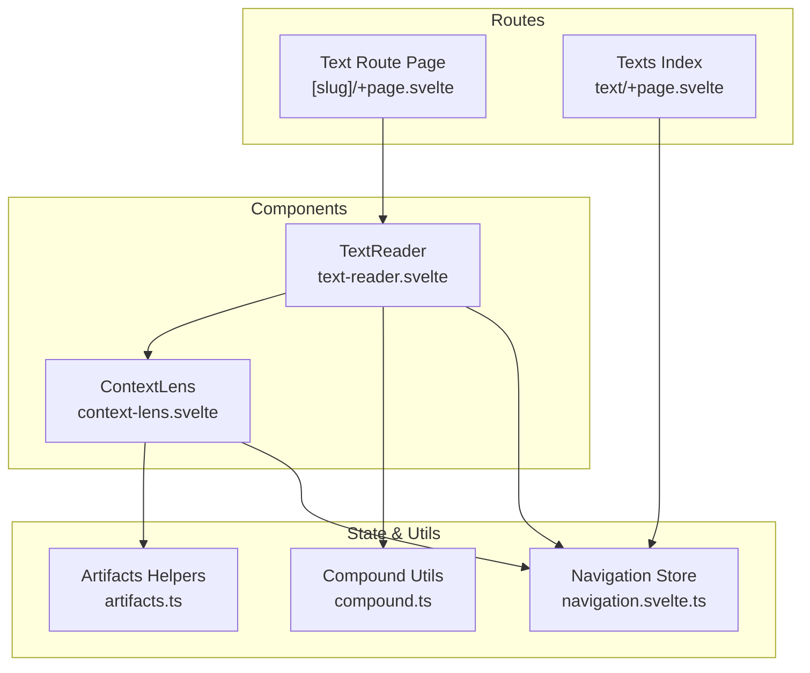
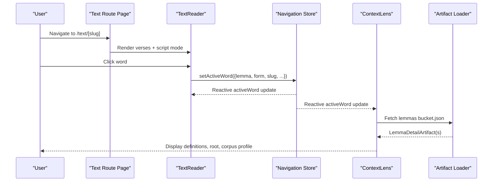
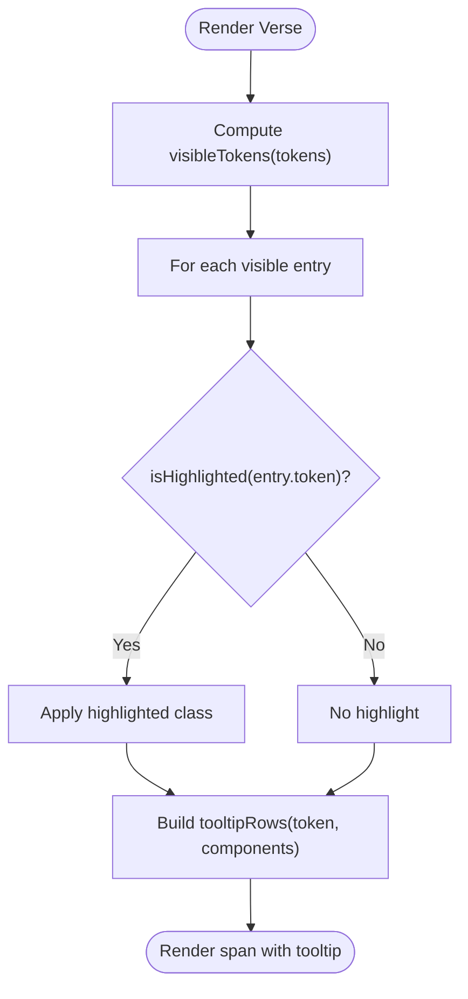
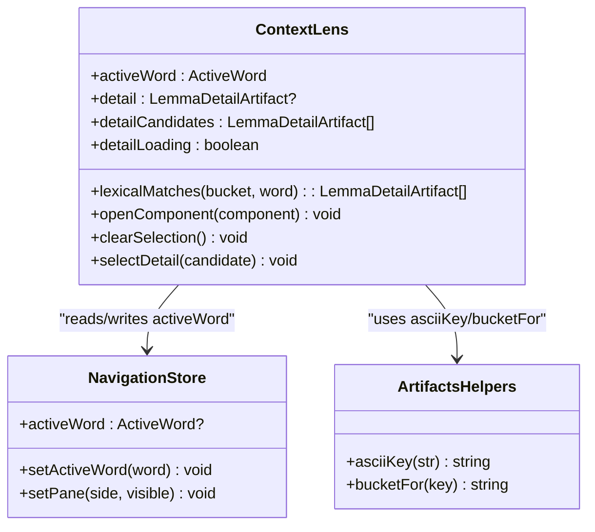
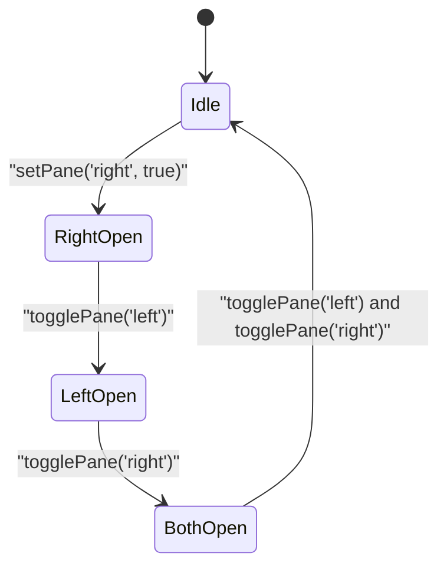
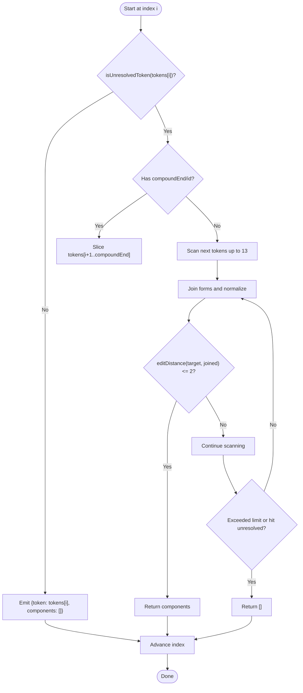
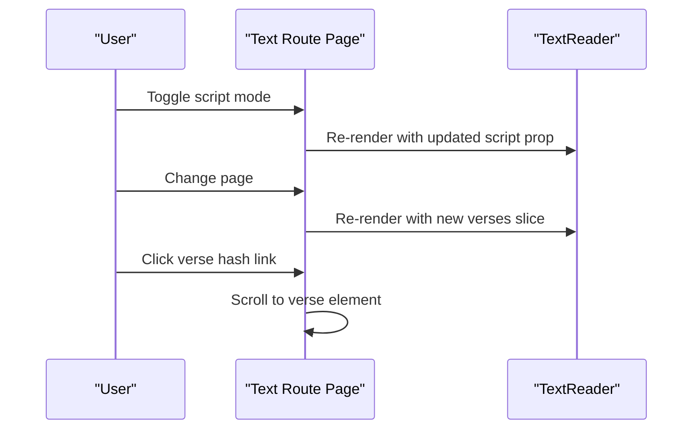
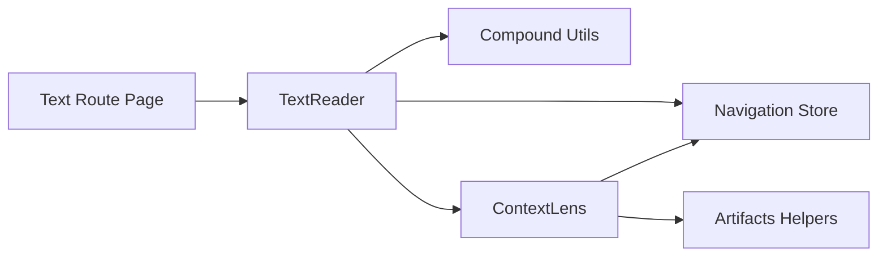

# Reader and Lens Implementation

<cite>
**Referenced Files in This Document**
- [text-reader.svelte](file://src/lib/components/text-reader.svelte)
- [context-lens.svelte](file://src/lib/components/context-lens.svelte)
- [navigation.svelte.ts](file://src/lib/stores/navigation.svelte.ts)
- [compound.ts](file://src/lib/utils/compound.ts)
- [+page.svelte (text route)](file://src/routes/text/[slug]/+page.svelte)
- [+page.svelte (texts index)](file://src/routes/text/+page.svelte)
- [text.ts](file://src/lib/types/text.ts)
- [artifacts.ts](file://src/lib/data/artifacts.ts)
</cite>

## Table of Contents
1. [Introduction](#introduction)
2. [Project Structure](#project-structure)
3. [Core Components](#core-components)
4. [Architecture Overview](#architecture-overview)
5. [Detailed Component Analysis](#detailed-component-analysis)
6. [Dependency Analysis](#dependency-analysis)
7. [Performance Considerations](#performance-considerations)
8. [Troubleshooting Guide](#troubleshooting-guide)
9. [Conclusion](#conclusion)

## Introduction
This document provides a comprehensive implementation guide for the text reader and context lens components. It explains how the reader renders verses with multi-script display, navigates verse-by-verse, highlights words interactively, and coordinates state with the navigation store. The context lens displays grammatical analysis, handles compound word resolution, and updates lexical information in real time as users select words. It also covers tokenization strategies, event handling, synchronization between reader and lens, and performance optimizations for large texts.

## Project Structure
The reader and lens are implemented as Svelte components that consume shared stores and utilities:
- TextReader renders paginated verses and wires word interactions to the navigation store.
- ContextLens shows lemma details, corpus profile, and root information based on the active word.
- Navigation store centralizes UI state such as panes and the active word.
- Compound utilities handle token visibility and compound word resolution.
- The text route page controls pagination, script selection, and passes data to the reader.

**Diagram sources**
- [+page.svelte (text route):1-160](file://src/routes/text/[slug]/+page.svelte#L1-L160)
- [+page.svelte (texts index):1-89](file://src/routes/text/+page.svelte#L1-L89)
- [text-reader.svelte:1-175](file://src/lib/components/text-reader.svelte#L1-L175)
- [context-lens.svelte:1-234](file://src/lib/components/context-lens.svelte#L1-L234)
- [navigation.svelte.ts:1-160](file://src/lib/stores/navigation.svelte.ts#L1-L160)
- [compound.ts:1-71](file://src/lib/utils/compound.ts#L1-L71)
- [artifacts.ts:1-200](file://src/lib/data/artifacts.ts#L1-L200)

**Section sources**
- [+page.svelte (text route):1-160](file://src/routes/text/[slug]/+page.svelte#L1-L160)
- [+page.svelte (texts index):1-89](file://src/routes/text/+page.svelte#L1-L89)
- [text-reader.svelte:1-175](file://src/lib/components/text-reader.svelte#L1-L175)
- [context-lens.svelte:1-234](file://src/lib/components/context-lens.svelte#L1-L234)
- [navigation.svelte.ts:1-160](file://src/lib/stores/navigation.svelte.ts#L1-L160)
- [compound.ts:1-71](file://src/lib/utils/compound.ts#L1-L71)
- [artifacts.ts:1-200](file://src/lib/data/artifacts.ts#L1-L200)

## Core Components
- TextReader
  - Pure presentation component receiving textSlug, script mode, and verses.
  - Renders Devanāgarī and IAST columns based on script mode.
  - Highlights tokens matching the active word or unresolved compounds.
  - Emits word click events to set the active word and open the right pane.
- ContextLens
  - Displays full lemma entry, definitions, root info, occurrences, and corpus profile.
  - Handles compound words by showing component buttons for drill-down.
  - Loads lemma artifacts asynchronously and manages candidates when multiple matches exist.
- Navigation Store
  - Centralized reactive state for activeWord, pane visibility, breadcrumbs, and selections.
  - Provides methods setActiveWord, setPane, navigateTo, and more.
- Compound Utilities
  - Determines visible tokens and resolves compound components from token streams.
  - Uses edit distance heuristics to match surface forms to concatenated components.

**Section sources**
- [text-reader.svelte:1-175](file://src/lib/components/text-reader.svelte#L1-L175)
- [context-lens.svelte:1-234](file://src/lib/components/context-lens.svelte#L1-L234)
- [navigation.svelte.ts:1-160](file://src/lib/stores/navigation.svelte.ts#L1-L160)
- [compound.ts:1-71](file://src/lib/utils/compound.ts#L1-L71)

## Architecture Overview
The system follows a unidirectional data flow:
- User interaction in TextReader triggers setActiveWord via the navigation store.
- ContextLens reacts to nav.activeWord changes and fetches lemma artifacts.
- Compound resolution is computed locally in TextReader using visibleTokens and passed to the lens.
- Pagination and script selection are managed at the route level and passed down to TextReader.

**Diagram sources**
- [+page.svelte (text route):1-160](file://src/routes/text/[slug]/+page.svelte#L1-L160)
- [text-reader.svelte:1-175](file://src/lib/components/text-reader.svelte#L1-L175)
- [context-lens.svelte:1-234](file://src/lib/components/context-lens.svelte#L1-L234)
- [navigation.svelte.ts:1-160](file://src/lib/stores/navigation.svelte.ts#L1-L160)
- [artifacts.ts:1-200](file://src/lib/data/artifacts.ts#L1-L200)

## Detailed Component Analysis

### TextReader: Verse-by-Verse Navigation, Multi-Script Display, and Word Highlighting
- Props
  - textSlug: string identifying the text.
  - script: 'devanagari' | 'iast' | 'both'.
  - verses: array of Verse objects with tokens, devanagari, reference, translation.
- Rendering
  - Iterates over verses and uses visibleTokens to group unresolved compounds into single interactive units.
  - For each script mode, renders tokens with highlighted spans when they match the active word or compound.
  - Shows translations if present.
- Interaction
  - handleWordClick sets selectedVerseIndex and calls nav.setActiveWord with an ActiveWord object including isCompound and components.
  - Opens the right pane via nav.setPane('right', true).
- Highlighting Logic
  - If activeWord.isCompound, highlight tokens where isUnresolvedToken(token) and token.form equals activeWord.form.
  - Otherwise, highlight tokens whose lemma_id matches activeWord.lemma_id.
- Tooltips
  - Builds tooltip rows from UPOS labels and feature key-value pairs; for compounds, lists each component’s part-of-speech and features.

**Diagram sources**
- [text-reader.svelte:1-175](file://src/lib/components/text-reader.svelte#L1-L175)
- [compound.ts:1-71](file://src/lib/utils/compound.ts#L1-L71)

**Section sources**
- [text-reader.svelte:1-175](file://src/lib/components/text-reader.svelte#L1-L175)
- [compound.ts:1-71](file://src/lib/utils/compound.ts#L1-L71)

### ContextLens: Grammatical Analysis, Compound Handling, and Real-Time Updates
- Active Word Reactivity
  - Reads nav.activeWord; clears detail state when no active word or when it is a compound.
- Lexical Matching
  - Attempts exact headword match, then normalized lemma match, then fallback filtering across bucket records.
  - Supports multiple candidate entries; user can select one to resolve ambiguity.
- Artifact Loading
  - Computes bucket path using asciiKey and bucketFor, then fetches lemmas/{bucket}.json.
  - Sets loading state and handles errors gracefully.
- Display Sections
  - Headword, form, UPOS label, features, English definitions, root info, occurrences, lexicon preview, corpus profile (POS, total occurrences, texts appeared), semantic classification, top texts distribution, and sample concordance lines.
- Compound Mode
  - When activeWord.isCompound, shows component buttons; selecting a component sets it as the new active word.

**Diagram sources**
- [context-lens.svelte:1-234](file://src/lib/components/context-lens.svelte#L1-L234)
- [navigation.svelte.ts:1-160](file://src/lib/stores/navigation.svelte.ts#L1-L160)
- [artifacts.ts:1-200](file://src/lib/data/artifacts.ts#L1-L200)

**Section sources**
- [context-lens.svelte:1-234](file://src/lib/components/context-lens.svelte#L1-L234)
- [navigation.svelte.ts:1-160](file://src/lib/stores/navigation.svelte.ts#L1-L160)
- [artifacts.ts:1-200](file://src/lib/data/artifacts.ts#L1-L200)

### Navigation Store: State Coordination and Pane Management
- State Fields
  - activeView, navigatorMode, breadcrumbs, leftOpen, rightOpen, userStage, selectedTextClasses, activeWord, explorerRoot.
- Methods
  - navigateTo(view): updates active view and builds breadcrumbs without auto-toggling panes.
  - togglePane(side), setPane(side, visible): controls left/right pane visibility.
  - setActiveWord(word): updates the active word used by both reader and lens.
  - selectExplorerRoot(slug), selectExplorerWord(word), clearExplorerSelection(): manage explorer-specific selections.
- Integration Points
  - TextReader calls setPane('right', true) upon word selection.
  - ContextLens reads activeWord reactively to load and display lemma data.

**Diagram sources**
- [navigation.svelte.ts:1-160](file://src/lib/stores/navigation.svelte.ts#L1-L160)

**Section sources**
- [navigation.svelte.ts:1-160](file://src/lib/stores/navigation.svelte.ts#L1-L160)

### Tokenization and Compound Resolution
- visibleTokens
  - Groups unresolved tokens with their following components into a single interactive unit.
  - Uses getCompoundComponents to determine component boundaries.
- getCompoundComponents
  - If compoundEnd/id exists, slices tokens up to compoundEnd.
  - Otherwise, scans forward up to 13 tokens, concatenating forms and comparing via edit distance to target form.
- isUnresolvedToken
  - Identifies unresolved tokens by checking lemma, lemma_id, and upos fields.

**Diagram sources**
- [compound.ts:1-71](file://src/lib/utils/compound.ts#L1-L71)

**Section sources**
- [compound.ts:1-71](file://src/lib/utils/compound.ts#L1-L71)

### Route-Level Controls: Pagination and Script Selection
- Text Route Page
  - Manages pagination via URL query parameters (?page=...&limit=...).
  - Provides prev/next navigation and a page selector dropdown.
  - Offers script mode toggles: Devanāgarī, IAST, Both.
  - Passes textSlug, script, and verses to TextReader.
  - Scrolls to a specific verse when hash matches #verse-<index>.
- Texts Index
  - Filters curated vs all texts based on selected classes and toggles curated view.

**Diagram sources**
- [+page.svelte (text route):1-160](file://src/routes/text/[slug]/+page.svelte#L1-L160)
- [text-reader.svelte:1-175](file://src/lib/components/text-reader.svelte#L1-L175)

**Section sources**
- [+page.svelte (text route):1-160](file://src/routes/text/[slug]/+page.svelte#L1-L160)
- [+page.svelte (texts index):1-89](file://src/routes/text/+page.svelte#L1-L89)

## Dependency Analysis
- TextReader depends on:
  - Navigation store for activeWord and pane control.
  - Compound utils for visibleTokens and isUnresolvedToken.
  - Artifacts helpers for asciiKey mapping.
- ContextLens depends on:
  - Navigation store for activeWord.
  - Artifacts helpers for asciiKey and bucketFor.
  - Data client for fetching lemma buckets.
- Route pages depend on:
  - Navigation store for panes and text class filters.
  - TextReader and ReferenceNavigator for rendering and navigation aids.

**Diagram sources**
- [+page.svelte (text route):1-160](file://src/routes/text/[slug]/+page.svelte#L1-L160)
- [text-reader.svelte:1-175](file://src/lib/components/text-reader.svelte#L1-L175)
- [context-lens.svelte:1-234](file://src/lib/components/context-lens.svelte#L1-L234)
- [navigation.svelte.ts:1-160](file://src/lib/stores/navigation.svelte.ts#L1-L160)
- [compound.ts:1-71](file://src/lib/utils/compound.ts#L1-L71)
- [artifacts.ts:1-200](file://src/lib/data/artifacts.ts#L1-L200)

**Section sources**
- [text-reader.svelte:1-175](file://src/lib/components/text-reader.svelte#L1-L175)
- [context-lens.svelte:1-234](file://src/lib/components/context-lens.svelte#L1-L234)
- [navigation.svelte.ts:1-160](file://src/lib/stores/navigation.svelte.ts#L1-L160)
- [compound.ts:1-71](file://src/lib/utils/compound.ts#L1-L71)
- [artifacts.ts:1-200](file://src/lib/data/artifacts.ts#L1-L200)

## Performance Considerations
- Large Text Rendering
  - Use pagination to limit DOM nodes per render; ensure only current page’s verses are mounted.
  - Defer heavy computations (e.g., compound resolution) until needed; cache results per verse if necessary.
- Memory Management
  - Avoid retaining large arrays outside of component scope; rely on reactive state to release references when pages change.
  - Clear temporary variables like selectedVerseIndex when page keys change to prevent stale references.
- Network Efficiency
  - Debounce or cancel artifact fetches if activeWord changes rapidly to avoid race conditions.
  - Cache fetched lemma buckets in memory to reduce repeated network requests.
- Responsiveness
  - Keep event handlers lightweight; offload expensive operations to background tasks or memoized derived values.
  - Use keyboard accessibility to improve interaction speed for power users.

[No sources needed since this section provides general guidance]

## Troubleshooting Guide
- No Grammatical Data Available
  - Tooltips may show “No grammatical data available” when tokens lack UPOS or features; verify upstream tokenization pipeline.
- Multiple Lexical Entries
  - ContextLens may present multiple candidates; instruct users to select the intended entry to disambiguate.
- Compound Resolution Failures
  - If components are not detected, check token IDs and compoundEnd markers; fallback relies on edit distance heuristics which may miss edge cases.
- Panes Not Opening
  - Ensure nav.setPane('right', true) is called on word click; verify that the right pane is not being closed elsewhere.
- Hash Navigation Issues
  - Verify that verse elements have correct data-verse-index attributes and that scrolling logic targets the content container.

**Section sources**
- [text-reader.svelte:1-175](file://src/lib/components/text-reader.svelte#L1-L175)
- [context-lens.svelte:1-234](file://src/lib/components/context-lens.svelte#L1-L234)
- [compound.ts:1-71](file://src/lib/utils/compound.ts#L1-L71)
- [+page.svelte (text route):1-160](file://src/routes/text/[slug]/+page.svelte#L1-L160)

## Conclusion
The text reader and context lens provide a robust, interactive reading experience for multilingual Sanskrit texts. By leveraging reactive state in the navigation store, efficient tokenization and compound resolution, and asynchronous artifact loading, the system delivers responsive and informative lexical insights. Proper pagination, memory management, and error handling ensure scalability and usability for large corpora.

[No sources needed since this section summarizes without analyzing specific files]