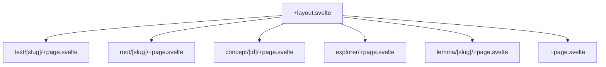
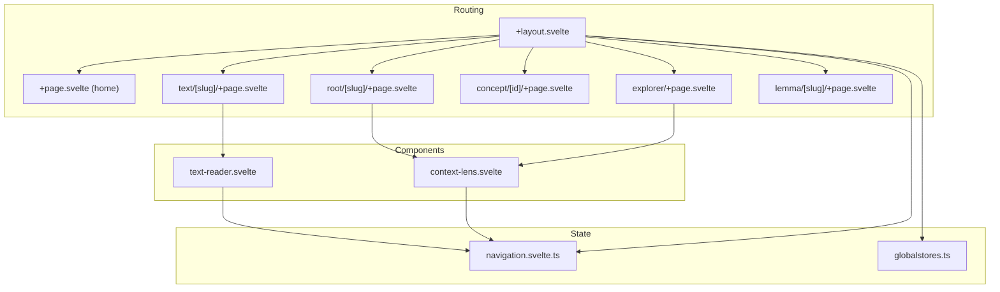
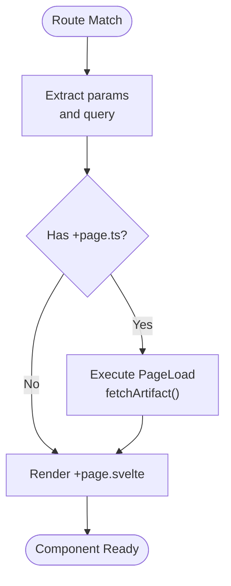
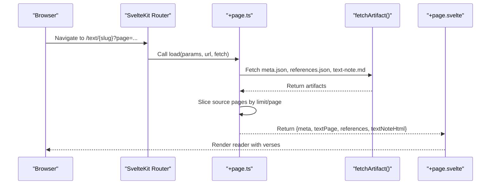
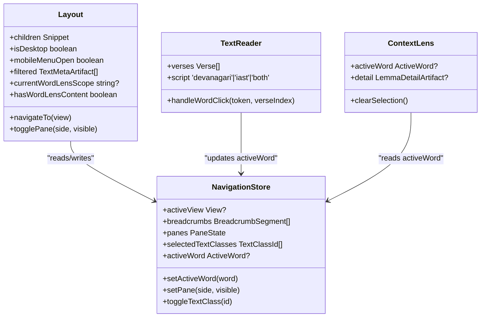
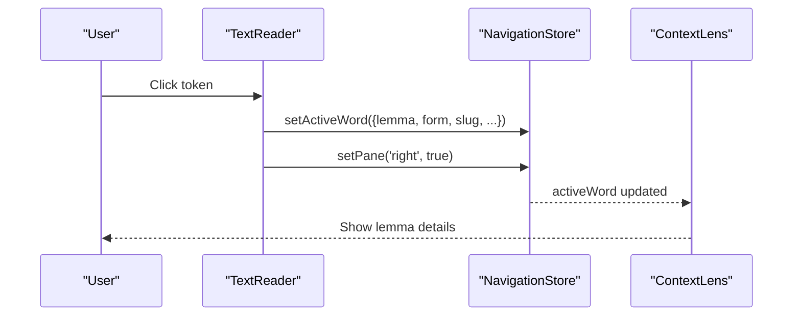
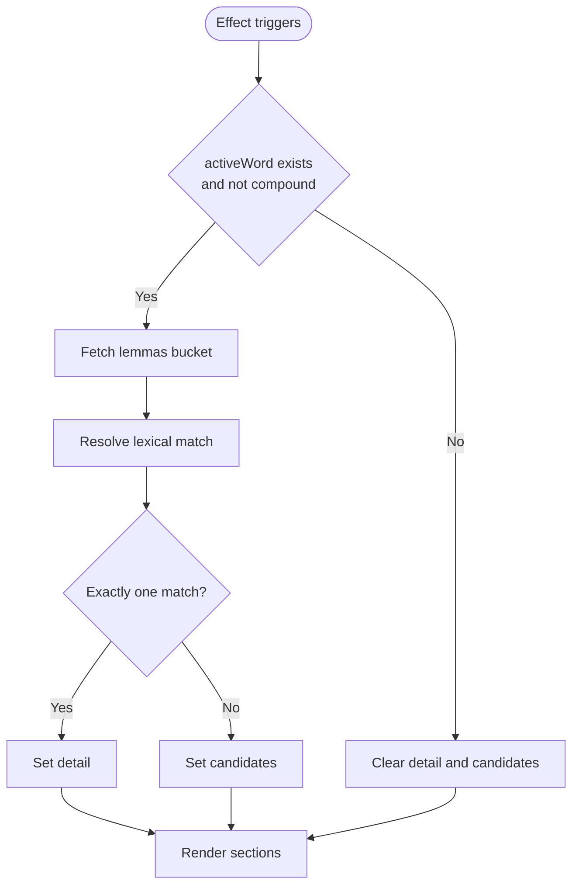
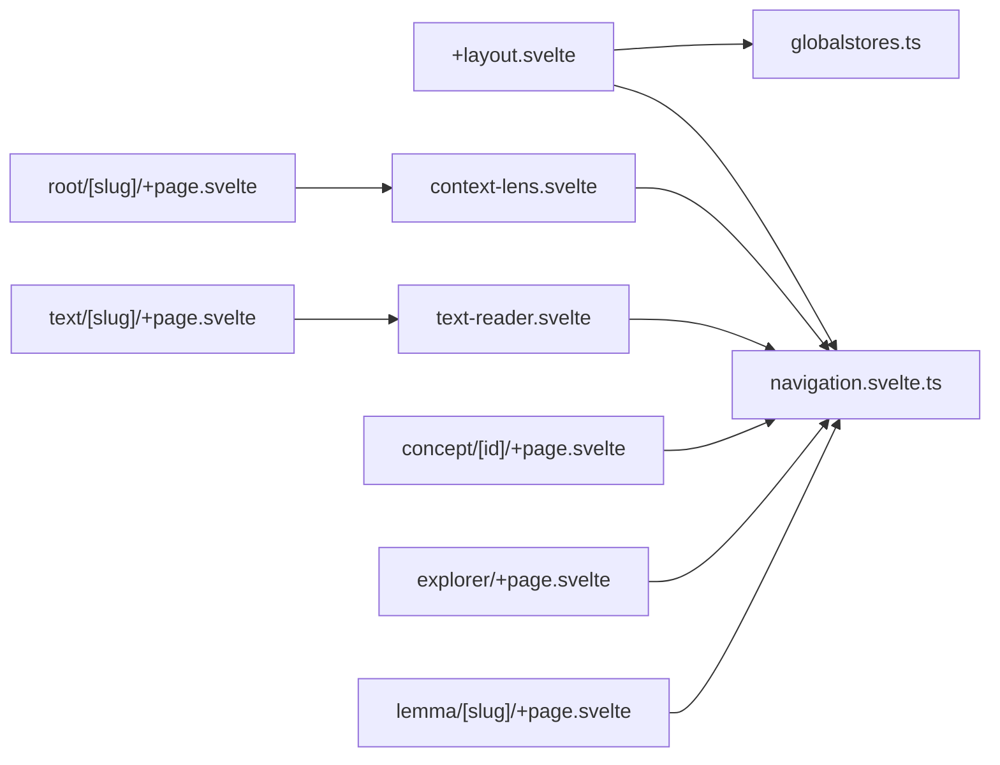

# Routes and Components

<cite>
**Referenced Files in This Document**
- [src/routes/+layout.svelte](file://src/routes/+layout.svelte)
- [src/routes/+page.svelte](file://src/routes/+page.svelte)
- [src/routes/text/[slug]/+page.svelte](file://src/routes/text/[slug]/+page.svelte)
- [src/routes/text/[slug]/+page.ts](file://src/routes/text/[slug]/+page.ts)
- [src/routes/root/[slug]/+page.svelte](file://src/routes/root/[slug]/+page.svelte)
- [src/routes/concept/[id]/+page.svelte](file://src/routes/concept/[id]/+page.svelte)
- [src/routes/explorer/+page.svelte](file://src/routes/explorer/+page.svelte)
- [src/routes/lemma/[slug]/+page.svelte](file://src/routes/lemma/[slug]/+page.svelte)
- [src/lib/stores/navigation.svelte.ts](file://src/lib/stores/navigation.svelte.ts)
- [src/lib/components/context-lens.svelte](file://src/lib/components/context-lens.svelte)
- [src/lib/components/text-reader.svelte](file://src/lib/components/text-reader.svelte)
- [src/lib/stores/globalstores.ts](file://src/lib/stores/globalstores.ts)
- [src/hooks.server.ts](file://src/hooks.server.ts)
</cite>

## Table of Contents
1. [Introduction](#introduction)
2. [Project Structure](#project-structure)
3. [Core Components](#core-components)
4. [Architecture Overview](#architecture-overview)
5. [Detailed Component Analysis](#detailed-component-analysis)
6. [Dependency Analysis](#dependency-analysis)
7. [Performance Considerations](#performance-considerations)
8. [Troubleshooting Guide](#troubleshooting-guide)
9. [Conclusion](#conclusion)

## Introduction
This document explains FractalDharma’s routing system and component architecture with a focus on SvelteKit file-based routing, route parameters, page loaders, and the component hierarchy from layout to specialized UI elements like text readers and context lenses. It covers navigation store integration, active word management, cross-component communication, responsive design patterns, accessibility considerations, and performance optimization techniques for rendering.

## Project Structure
FractalDharma uses SvelteKit’s file-based routing:
- Layouts define global chrome (header, panes, footer) and render child routes via snippets and slots.
- Route pages are defined under src/routes with optional +page.ts loaders for data fetching.
- Parameterized routes use directory names like [slug] or [id].
- The root layout composes left/main/right panels using paneforge and conditionally renders mobile layouts.

**Diagram sources**
- [src/routes/+layout.svelte](file://src/routes/+layout.svelte)
- [src/routes/text/[slug]/+page.svelte](file://src/routes/text/[slug]/+page.svelte)
- [src/routes/root/[slug]/+page.svelte](file://src/routes/root/[slug]/+page.svelte)
- [src/routes/concept/[id]/+page.svelte](file://src/routes/concept/[id]/+page.svelte)
- [src/routes/explorer/+page.svelte](file://src/routes/explorer/+page.svelte)
- [src/routes/lemma/[slug]/+page.svelte](file://src/routes/lemma/[slug]/+page.svelte)
- [src/routes/+page.svelte](file://src/routes/+page.svelte)

**Section sources**
- [src/routes/+layout.svelte](file://src/routes/+layout.svelte)
- [src/routes/+page.svelte](file://src/routes/+page.svelte)

## Core Components
- Navigation Store: Central state for active view, breadcrumbs, pane visibility, selected text classes, active word, and explorer selection. Provides methods to navigate, toggle panes, and manage active words.
- Context Lens: Right-pane detail panel that displays lemma details, corpus profile, occurrences, and semantic links based on the active word.
- Text Reader: Displays verses with token-level interactions; updates active word and opens the right pane.
- Global Theme Store: Manages dark/light theme persistence across sessions.

Key responsibilities:
- Cross-component communication via nav.store reactive state.
- Data fetching via SvelteKit loaders and client artifact fetchers.
- Responsive behavior through derived viewport checks and conditional rendering.

**Section sources**
- [src/lib/stores/navigation.svelte.ts](file://src/lib/stores/navigation.svelte.ts)
- [src/lib/components/context-lens.svelte](file://src/lib/components/context-lens.svelte)
- [src/lib/components/text-reader.svelte](file://src/lib/components/text-reader.svelte)
- [src/lib/stores/globalstores.ts](file://src/lib/stores/globalstores.ts)

## Architecture Overview
The application follows a layered architecture:
- Routing Layer: SvelteKit files map URLs to components and loaders.
- State Layer: Reactive stores coordinate shared UI state and user actions.
- Presentation Layer: Reusable components render content and handle interactions.
- Data Layer: Client-side artifact fetchers retrieve JSON artifacts and markdown notes.

**Diagram sources**
- [src/routes/+layout.svelte](file://src/routes/+layout.svelte)
- [src/routes/+page.svelte](file://src/routes/+page.svelte)
- [src/routes/text/[slug]/+page.svelte](file://src/routes/text/[slug]/+page.svelte)
- [src/routes/root/[slug]/+page.svelte](file://src/routes/root/[slug]/+page.svelte)
- [src/routes/concept/[id]/+page.svelte](file://src/routes/concept/[id]/+page.svelte)
- [src/routes/explorer/+page.svelte](file://src/routes/explorer/+page.svelte)
- [src/routes/lemma/[slug]/+page.svelte](file://src/routes/lemma/[slug]/+page.svelte)
- [src/lib/stores/navigation.svelte.ts](file://src/lib/stores/navigation.svelte.ts)
- [src/lib/stores/globalstores.ts](file://src/lib/stores/globalstores.ts)
- [src/lib/components/text-reader.svelte](file://src/lib/components/text-reader.svelte)
- [src/lib/components/context-lens.svelte](file://src/lib/components/context-lens.svelte)

## Detailed Component Analysis

### File-Based Routing and Parameters
- Parameterized routes:
  - /text/[slug]: Loads text metadata, references, and paginated verses.
  - /root/[slug]: Shows dhātu details and linked words.
  - /concept/[id]: Renders concept graph and related lemmas.
  - /lemma/[slug]: Displays dictionary entry and concordance.
- Query parameters:
  - /text/[slug]?page=&limit= controls pagination and page size.
- Active path detection:
  - Layout computes isActive(path) to highlight current navigation items.

**Diagram sources**
- [src/routes/text/[slug]/+page.ts](file://src/routes/text/[slug]/+page.ts)
- [src/routes/text/[slug]/+page.svelte](file://src/routes/text/[slug]/+page.svelte)

**Section sources**
- [src/routes/text/[slug]/+page.ts](file://src/routes/text/[slug]/+page.ts)
- [src/routes/text/[slug]/+page.svelte](file://src/routes/text/[slug]/+page.svelte)
- [src/routes/root/[slug]/+page.svelte](file://src/routes/root/[slug]/+page.svelte)
- [src/routes/concept/[id]/+page.svelte](file://src/routes/concept/[id]/+page.svelte)
- [src/routes/lemma/[slug]/+page.svelte](file://src/routes/lemma/[slug]/+page.svelte)

### Page Loaders and Data Fetching
- Text page loader aggregates:
  - Meta artifact for verse count and title.
  - References artifact for cross-references.
  - Optional markdown note rendered to HTML.
  - Source pages sliced into requested limit/page window.
- Error handling:
  - Returns 404 when page exceeds total or slug not found.

**Diagram sources**
- [src/routes/text/[slug]/+page.ts](file://src/routes/text/[slug]/+page.ts)
- [src/routes/text/[slug]/+page.svelte](file://src/routes/text/[slug]/+page.svelte)

**Section sources**
- [src/routes/text/[slug]/+page.ts](file://src/routes/text/[slug]/+page.ts)

### Layout Composition and Panes
- Layout defines three panes:
  - Left: Searchable text list filtered by selected text classes.
  - Main: Content area rendering child routes.
  - Right: Context lens showing active word details.
- Pane visibility is controlled by the navigation store and per-page logic.
- Mobile layout collapses panes behind a menu and shows inline context where needed.

**Diagram sources**
- [src/routes/+layout.svelte](file://src/routes/+layout.svelte)
- [src/lib/stores/navigation.svelte.ts](file://src/lib/stores/navigation.svelte.ts)
- [src/lib/components/context-lens.svelte](file://src/lib/components/context-lens.svelte)
- [src/lib/components/text-reader.svelte](file://src/lib/components/text-reader.svelte)

**Section sources**
- [src/routes/+layout.svelte](file://src/routes/+layout.svelte)

### Text Reader Component
- Props:
  - textSlug: string
  - script: 'devanagari' | 'iast' | 'both'
  - verses: array of verse objects
- Behavior:
  - Highlights tokens matching the active word.
  - On click, sets active word and opens right pane.
  - Supports keyboard interaction for accessibility.
  - Conditionally renders mobile context lens per verse.

**Diagram sources**
- [src/lib/components/text-reader.svelte](file://src/lib/components/text-reader.svelte)
- [src/lib/stores/navigation.svelte.ts](file://src/lib/stores/navigation.svelte.ts)
- [src/lib/components/context-lens.svelte](file://src/lib/components/context-lens.svelte)

**Section sources**
- [src/lib/components/text-reader.svelte](file://src/lib/components/text-reader.svelte)

### Context Lens Component
- Reads active word from navigation store when in relevant routes.
- Fetches lemma detail artifact bucket and resolves exact or normalized matches.
- Displays definitions, root info, occurrences, corpus profile, semantic classification, and concordance samples.
- Supports compound words by listing components and allowing selection.

**Diagram sources**
- [src/lib/components/context-lens.svelte](file://src/lib/components/context-lens.svelte)

**Section sources**
- [src/lib/components/context-lens.svelte](file://src/lib/components/context-lens.svelte)

### Root Dhātu Page
- Displays dhātu information, upasargas, and grouped words.
- On word click, sets active word and opens right pane.
- Shows mobile context lens inline when a word is selected.

**Section sources**
- [src/routes/root/[slug]/+page.svelte](file://src/routes/root/[slug]/+page.svelte)

### Concept Page
- Builds a local neighborhood graph from IS-A chain, children, and member lemmas.
- Allows navigation to concepts or lemmas via node clicks.

**Section sources**
- [src/routes/concept/[id]/+page.svelte](file://src/routes/concept/[id]/+page.svelte)

### Explorer Page
- Full-screen search interface with debounced API calls.
- Selects either a root or word and updates navigation store.
- Integrates with SemanticEntryBloom for interactive exploration.

**Section sources**
- [src/routes/explorer/+page.svelte](file://src/routes/explorer/+page.svelte)

### Dictionary (Lemma) Page
- Presents English definitions, root info, corpus profile, occurrences, and concordance samples.
- Updates navigation breadcrumb on mount.

**Section sources**
- [src/routes/lemma/[slug]/+page.svelte](file://src/routes/lemma/[slug]/+page.svelte)

### Home Page
- Disables panes on mount to present a clean landing experience.
- Provides quick pathway cards to primary exploration routes.

**Section sources**
- [src/routes/+page.svelte](file://src/routes/+page.svelte)

## Dependency Analysis
- Layout depends on:
  - Navigation store for pane visibility and active word scope.
  - Global theme store for light/dark mode.
  - Artifact fetcher for texts index and filtering.
- Text Reader depends on:
  - Navigation store for active word and pane toggling.
  - Utilities for token visibility and reference formatting.
- Context Lens depends on:
  - Navigation store for active word.
  - Artifact fetcher for lemma buckets.
- Pages depend on:
  - SvelteKit page props from loaders.
  - Navigation store for breadcrumbs and active views.

**Diagram sources**
- [src/routes/+layout.svelte](file://src/routes/+layout.svelte)
- [src/lib/stores/navigation.svelte.ts](file://src/lib/stores/navigation.svelte.ts)
- [src/lib/stores/globalstores.ts](file://src/lib/stores/globalstores.ts)
- [src/lib/components/text-reader.svelte](file://src/lib/components/text-reader.svelte)
- [src/lib/components/context-lens.svelte](file://src/lib/components/context-lens.svelte)
- [src/routes/text/[slug]/+page.svelte](file://src/routes/text/[slug]/+page.svelte)
- [src/routes/root/[slug]/+page.svelte](file://src/routes/root/[slug]/+page.svelte)
- [src/routes/concept/[id]/+page.svelte](file://src/routes/concept/[id]/+page.svelte)
- [src/routes/explorer/+page.svelte](file://src/routes/explorer/+page.svelte)
- [src/routes/lemma/[slug]/+page.svelte](file://src/routes/lemma/[slug]/+page.svelte)

**Section sources**
- [src/routes/+layout.svelte](file://src/routes/+layout.svelte)
- [src/lib/stores/navigation.svelte.ts](file://src/lib/stores/navigation.svelte.ts)
- [src/lib/stores/globalstores.ts](file://src/lib/stores/globalstores.ts)
- [src/lib/components/text-reader.svelte](file://src/lib/components/text-reader.svelte)
- [src/lib/components/context-lens.svelte](file://src/lib/components/context-lens.svelte)

## Performance Considerations
- Pagination and slicing:
  - Text page loader slices source pages to requested limit, reducing payload size.
- Debounced search:
  - Explorer page delays API calls to avoid excessive requests.
- Conditional rendering:
  - Mobile-only context lens avoids unnecessary DOM nodes on desktop.
- Derived state:
  - Use $derived and $effect to minimize recomputation and ensure efficient updates.
- Artifact caching:
  - Leverage SvelteKit preloading hints (data-sveltekit-preload-data) for faster navigation.
- Error boundaries:
  - Server hooks log errors and return safe messages to prevent leaking internals.

[No sources needed since this section provides general guidance]

## Troubleshooting Guide
- Common issues:
  - 404 on text pages: Ensure slug exists and requested page does not exceed totalPages.
  - Empty context lens: Verify active word is set and not a compound without components.
  - Stale selections: Reset active word when navigating away from word-lens-enabled routes.
- Debugging tips:
  - Inspect navigation store state for activeView, panes, and activeWord.
  - Check artifact paths and bucket resolution for lemmas.
  - Validate query parameters for pagination and limits.

**Section sources**
- [src/routes/text/[slug]/+page.ts](file://src/routes/text/[slug]/+page.ts)
- [src/lib/components/context-lens.svelte](file://src/lib/components/context-lens.svelte)
- [src/lib/stores/navigation.svelte.ts](file://src/lib/stores/navigation.svelte.ts)
- [src/hooks.server.ts](file://src/hooks.server.ts)

## Conclusion
FractalDharma’s routing and component architecture leverages SvelteKit’s file-based conventions, reactive stores, and reusable components to deliver an interactive, accessible, and performant reading and exploration experience. The navigation store centralizes state, while layout and specialized components compose a flexible UI that adapts to different contexts and devices. Proper error handling, pagination, and debouncing ensure robustness and efficiency.