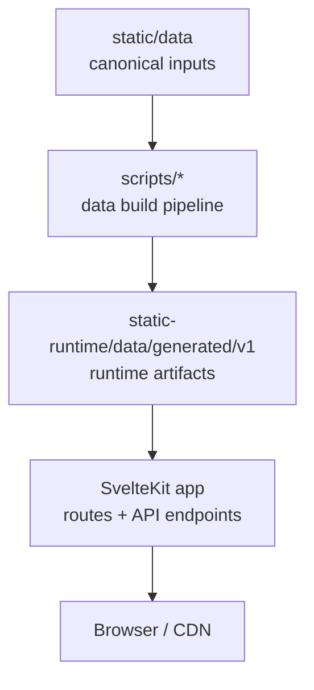
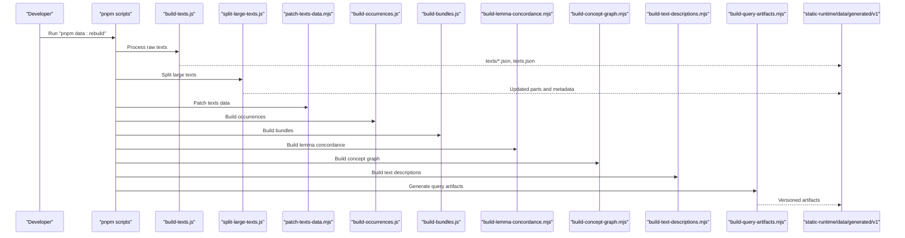
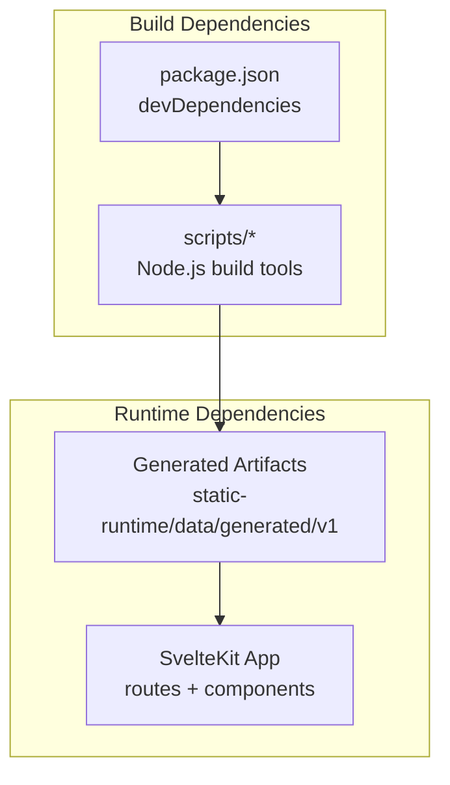

# Getting Started

<cite>
**Referenced Files in This Document**
- [package.json](file://package.json)
- [svelte.config.js](file://svelte.config.js)
- [vite.config.ts](file://vite.config.ts)
- [DEVELOPERS.md](file://docs/DEVELOPERS.md)
- [build-texts.js](file://scripts/build-texts.js)
- [split-large-texts.js](file://scripts/split-large-texts.js)
- [getting-started.md](file://src/routes/docs/user/getting-started.md)
- [reading-texts.md](file://src/routes/docs/user/reading-texts.md)
- [exploring-dhatus.md](file://src/routes/docs/user/exploring-dhatus.md)
- [exploring-concepts.md](file://src/routes/docs/user/exploring-concepts.md)
- [word-lens.md](file://src/routes/docs/user/word-lens.md)
</cite>

## Table of Contents
1. Introduction
2. Project Structure
3. Core Components
4. Architecture Overview
5. Detailed Component Analysis
6. Dependency Analysis
7. Performance Considerations
8. Troubleshooting Guide
9. Conclusion

## Introduction
This guide helps you get up and running with FractalDharma, a Sanskrit text exploration platform built with SvelteKit 2 and Svelte 5. You will:
- Install dependencies using pnpm
- Set up the development environment with Node.js
- Build the data pipeline and preview the site
- Understand the corpus processing workflow behind the data build command
- Navigate the three main exploration pathways: texts, dhātus (verbal roots), and concepts
- Use quick start examples to explore specific texts, use the word lens, and explore verbal roots

## Project Structure
FractalDharma separates canonical input data from generated runtime artifacts:
- Canonical inputs live under static/data and are used only during builds
- Generated artifacts are written to static-runtime/data/generated/v1 and served at runtime
- The application is a SvelteKit project configured for Vercel deployment

**Diagram sources**
- [DEVELOPERS.md:65-116](file://docs/DEVELOPERS.md#L65-L116)
- [svelte.config.js:18-25](file://svelte.config.js#L18-L25)

**Section sources**
- [DEVELOPERS.md:1-63](file://docs/DEVELOPERS.md#L1-L63)
- [svelte.config.js:1-29](file://svelte.config.js#L1-L29)

## Core Components
- Package manager and scripts: pnpm@10.x, Node.js-based scripts for data builds
- Framework stack: SvelteKit 2, Svelte 5, TypeScript, Vite
- Data pipeline: deterministic build steps that convert canonical corpus into versioned JSON artifacts
- Runtime access: client-side artifact reader with request caching and deduplication

Key commands:
- pnpm install
- pnpm dev
- pnpm build
- pnpm data:rebuild

**Section sources**
- [package.json:1-47](file://package.json#L1-L47)
- [DEVELOPERS.md:215-251](file://docs/DEVELOPERS.md#L215-L251)

## Architecture Overview
The data build pipeline transforms raw corpus inputs into query-efficient artifacts consumed by the application.

**Diagram sources**
- [DEVELOPERS.md:227-238](file://docs/DEVELOPERS.md#L227-L238)
- [build-texts.js:1-191](file://scripts/build-texts.js#L1-L191)
- [split-large-texts.js:1-56](file://scripts/split-large-texts.js#L1-L56)

**Section sources**
- [DEVELOPERS.md:65-129](file://docs/DEVELOPERS.md#L65-L129)

## Detailed Component Analysis

### Installation and Development Setup
- Prerequisites:
  - Node.js compatible with the project’s runtime target (Vercel adapter targets nodejs24.x)
  - pnpm package manager
- Steps:
  - Clone the repository
  - Install dependencies with pnpm
  - Start the development server
  - Build the data pipeline if needed

Quick commands:
- pnpm install
- pnpm dev
- pnpm build

Notes:
- The project enforces Svelte runes mode and uses TypeScript strict mode
- Assets are served from static-runtime during builds and deployments

**Section sources**
- [package.json:1-47](file://package.json#L1-L47)
- [svelte.config.js:14-25](file://svelte.config.js#L14-L25)
- [vite.config.ts:1-7](file://vite.config.ts#L1-L7)

### Data Build Pipeline: pnpm data:rebuild
The rebuild command executes a fixed sequence of scripts to transform canonical inputs into runtime artifacts:
1. build-texts.js: Parse raw conllu files into structured text bundles
2. split-large-texts.js: Split oversized texts into manageable parts
3. patch-texts-data.mjs: Apply patches to texts data
4. build-occurrences.js: Compute occurrence indices
5. build-bundles.js: Create bundled artifacts
6. build-lemma-concordance.mjs: Build lemma concordance
7. build-concept-graph.mjs: Generate concept graphs
8. build-text-descriptions.mjs: Sanitize and prepare text descriptions
9. build-query-artifacts.mjs: Produce versioned query artifacts

Environment variables:
- FRACTALDHARMA_RAW_DIR: Path to raw corpus directory
- FRACTALDHARMA_WIKI_DIR: Path to wiki resources used by some scripts

Output:
- Versioned artifacts under static-runtime/data/generated/v1

**Section sources**
- [DEVELOPERS.md:227-251](file://docs/DEVELOPERS.md#L227-L251)
- [build-texts.js:1-191](file://scripts/build-texts.js#L1-L191)
- [split-large-texts.js:1-56](file://scripts/split-large-texts.js#L1-L56)

### Text Browsing Workflow
Navigate to the texts catalogue and open a specific text:
- Go to /text to browse available texts
- Select a text to open its reader
- Choose display mode: Devanāgarī, IAST, or Both
- Use reference menus to navigate chapters, sections, or verses
- Adjust page size for reading comfort

**Section sources**
- [getting-started.md:10-18](file://src/routes/docs/user/getting-started.md#L10-L18)
- [reading-texts.md:10-28](file://src/routes/docs/user/reading-texts.md#L10-L28)

### Word Lens Feature
Use the word lens to explore lexical information:
- Click any word in the reader to open the lens
- View form vs lemma distinction
- Access dictionary definitions, grammatical features, root information
- Explore occurrences and semantic classifications
- Handle compounds by selecting components when available

**Section sources**
- [word-lens.md:10-33](file://src/routes/docs/user/word-lens.md#L10-L33)

### Dhātu Exploration
Explore verbal roots and their word families:
- Visit /root to access the dhātu index
- Search by IAST or Devanāgarī forms
- Browse root records with traditional and English meanings
- Follow linked words organized by morphological patterns
- Open word entries from root pages for deeper analysis

**Section sources**
- [exploring-dhatus.md:10-50](file://src/routes/docs/user/exploring-dhatus.md#L10-L50)

### Concept Discovery
Discover semantic relationships through concept categories:
- Visit /concept to explore broad semantic classes
- Use supersenses as entry points for vocabulary discovery
- Navigate IS-A hierarchies and local graphs
- Compare lemmas across different texts and contexts
- Validate semantic groupings against actual usage

**Section sources**
- [exploring-concepts.md:10-50](file://src/routes/docs/user/exploring-concepts.md#L10-L50)

## Dependency Analysis
The project has clear separation between build-time and runtime dependencies:

**Diagram sources**
- [package.json:19-45](file://package.json#L19-L45)
- [DEVELOPERS.md:85-116](file://docs/DEVELOPERS.md#L85-L116)

**Section sources**
- [package.json:19-45](file://package.json#L19-L45)
- [DEVELOPERS.md:130-149](file://docs/DEVELOPERS.md#L130-L149)

## Performance Considerations
- The data pipeline generates bounded, query-efficient artifacts to prevent loading entire corpora at runtime
- Each request retrieves only necessary data (one text page, one lemma bucket, etc.)
- Client-side caching prevents duplicate requests within the same session
- Large texts are split into manageable parts to avoid memory issues
- Generated artifacts are optimized for CDN delivery and browser caching

## Troubleshooting Guide

### Common Setup Issues
- **Node.js version mismatch**: Ensure compatibility with the project's runtime target (nodejs24.x for Vercel deployment)
- **pnpm installation errors**: Verify pnpm is installed and accessible in your PATH
- **Missing environment variables**: Set FRACTALDHARMA_RAW_DIR and FRACTALDHARMA_WIKI_DIR if required by build scripts
- **Permission errors**: Ensure write permissions for static-runtime directory

### Development Environment Problems
- **TypeScript/Svelte check failures**: Run pnpm check to identify and fix type errors
- **Build script failures**: Check console output for missing input files or invalid paths
- **Asset loading issues**: Verify static-runtime contains generated artifacts
- **Memory issues with large texts**: The split-large-texts script handles this automatically

### Data Build Issues
- **Raw corpus path**: Verify FRACTALDHARMA_RAW_DIR points to correct location
- **Wiki resources**: Ensure FRACTALDHARMA_WIKI_DIR contains required wiki files
- **Incomplete builds**: Run individual scripts to isolate failing steps
- **Corrupted artifacts**: Delete static-runtime and rebuild from scratch

**Section sources**
- [DEVELOPERS.md:239-251](file://docs/DEVELOPERS.md#L239-L251)

## Conclusion
You now have everything needed to set up and explore FractalDharma. The platform provides three powerful ways to engage with Sanskrit texts: direct reading, linguistic exploration through dhātus, and semantic discovery via concepts. The robust data pipeline ensures efficient access to the corpus while maintaining scholarly accuracy and usability.

For developers, the modular architecture allows easy extension and customization. For users, the intuitive navigation makes complex Sanskrit scholarship accessible to researchers and students alike.