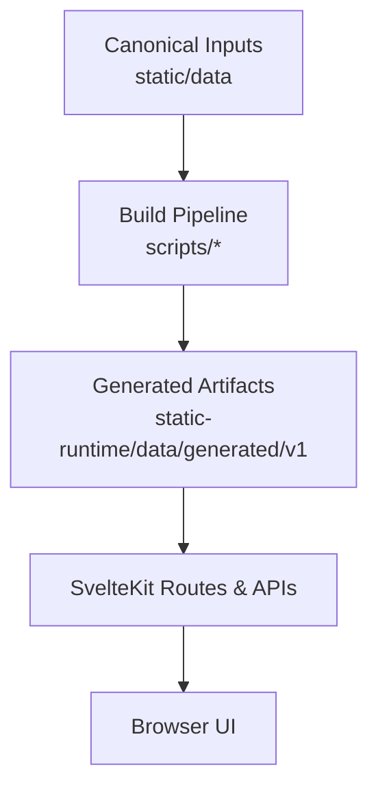
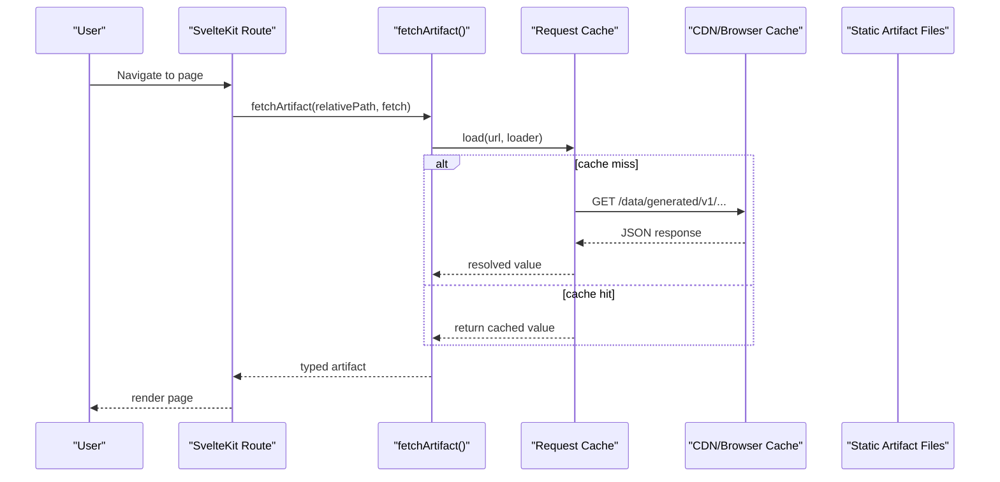
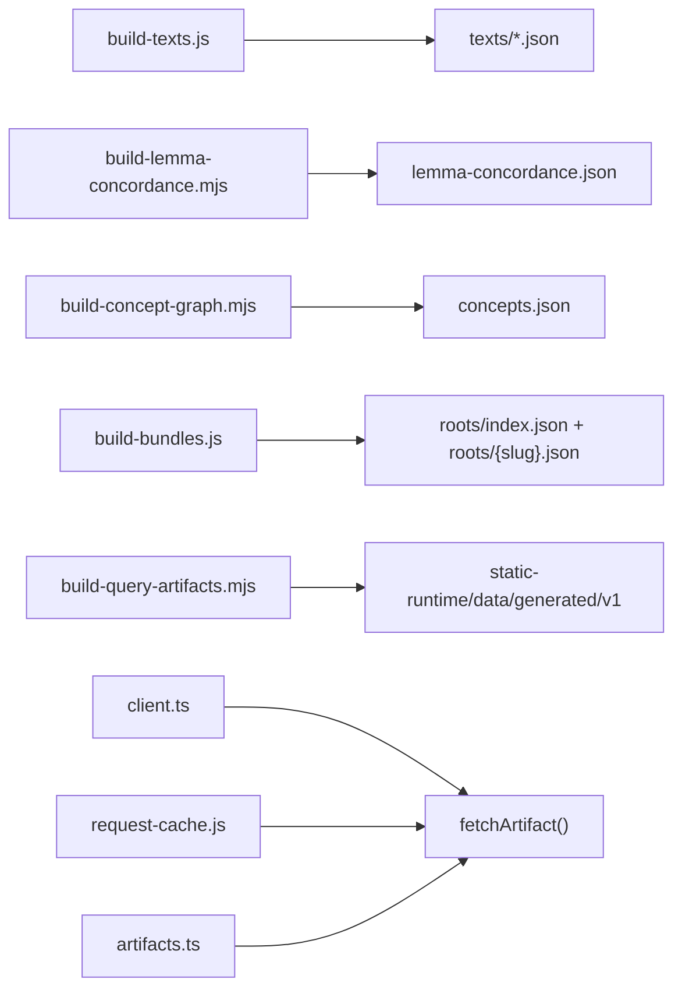
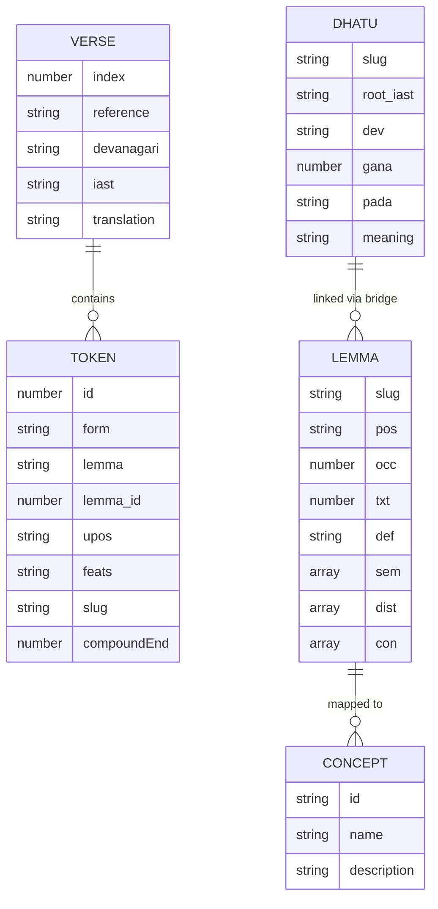
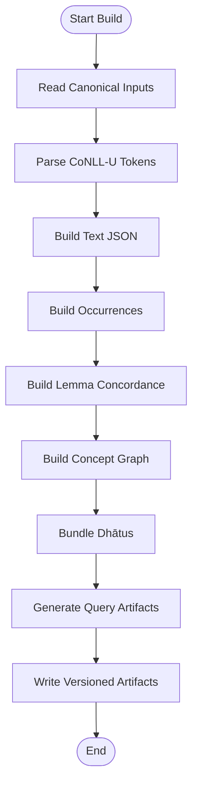

# Glossary and References

<cite>
**Referenced Files in This Document**
- [glossary.md](file://src/routes/docs/user/glossary.md)
- [exploring-dhatus.md](file://src/routes/docs/user/exploring-dhatus.md)
- [exploring-concepts.md](file://src/routes/docs/user/exploring-concepts.md)
- [sources-page.md](file://src/routes/docs/sources/+page.md)
- [DEVELOPERS.md](file://docs/DEVELOPERS.md)
- [artifact-contracts.md](file://src/routes/docs/developer/artifact-contracts.md)
- [development-workflow.md](file://src/routes/docs/developer/development-workflow.md)
- [package.json](file://package.json)
- [artifacts.ts](file://src/lib/data/artifacts.ts)
- [client.ts](file://src/lib/data/client.ts)
- [request-cache.js](file://src/lib/data/request-cache.js)
- [build-query-artifacts.mjs](file://scripts/build-query-artifacts.mjs)
- [build-lemma-concordance.mjs](file://scripts/build-lemma-concordance.mjs)
- [build-concept-graph.mjs](file://scripts/build-concept-graph.mjs)
- [build-texts.js](file://scripts/build-texts.js)
- [text-types.ts](file://src/lib/types/text.ts)
- [compound-utils.ts](file://src/lib/utils/compound.ts)
</cite>

## Table of Contents
1. [Introduction](#introduction)
2. [Project Structure](#project-structure)
3. [Core Components](#core-components)
4. [Architecture Overview](#architecture-overview)
5. [Detailed Component Analysis](#detailed-component-analysis)
6. [Dependency Analysis](#dependency-analysis)
7. [Performance Considerations](#performance-considerations)
8. [Troubleshooting Guide](#troubleshooting-guide)
9. [Conclusion](#conclusion)
10. [Appendices](#appendices)

## Introduction
This document provides a comprehensive glossary and reference guide for FractalDharma, covering Sanskrit linguistic terminology (dhātus, lemmas, compounds, morphological features, grammatical classifications), digital humanities concepts (corpus analysis, concordance generation, semantic mapping), and technical terms related to the SvelteKit framework, artifact-based caching, and data processing pipelines. It also includes etymological context for key Sanskrit terms as used by the platform, external resource pointers, cross-references between terms, pronunciation and transliteration conventions, and links to relevant sections within the documentation.

## Project Structure
FractalDharma is a Svelte 5 and SvelteKit 2 application that transforms canonical corpus inputs into versioned, query-shaped JSON artifacts for efficient runtime delivery. The build pipeline produces public artifacts under a versioned directory consumed by routes and API endpoints. Canonical inputs remain separate from deployed assets.

**Diagram sources**
- [DEVELOPERS.md:1-295](file://docs/DEVELOPERS.md#L1-L295)
- [artifact-contracts.md:1-53](file://src/routes/docs/developer/artifact-contracts.md#L1-L53)

**Section sources**
- [DEVELOPERS.md:1-295](file://docs/DEVELOPERS.md#L1-L295)
- [artifact-contracts.md:1-53](file://src/routes/docs/developer/artifact-contracts.md#L1-L53)

## Core Components
- Corpus: The collection of texts and annotations available on the site; statistics describe this collection only.
- Devanāgarī: The script used for display; IAST transliteration is also supported.
- IAST: International Alphabet of Sanskrit Transliteration using diacritics.
- Token: Word-level unit in parsed passages; can be surface form, inflected word, or analyzed compound.
- Form: Exact written or transliterated token selected in a passage.
- Lemma: Normalized lexical form grouping related inflected forms.
- Dhātu/root: Verbal root organizing derivational and verbal relationships.
- Gaṇa: Traditional verbal class associated with roots.
- Pada: Root’s inflectional designation (Parasmaipada, Ātmanepada, Ubhayapada).
- Guṇa and vṛddhi: Traditional vowel grades used for browsing linked words.
- Upasarga: Verbal prefix listed when available.
- Compound: Multi-member expression combined into one unit; breakdown shown when available.
- Concordance: Collection of contexts where a lemma or form occurs; sample provided.
- Occurrence: One attested instance in the indexed corpus; “Texts appeared in” counts works, “total occurrences” counts instances.
- Concept: Semantic grouping connecting mapped lemmas; uses WordNet-derived classification.
- Supersense: Broad semantic classes (Act, Person, State, Time) for corpus mappings.
- Synset: More specific node in imported WordNet hierarchy; best read as reference.
- Reference: Location of a passage in the text’s own system (chapter/verse, maṇḍala/sūkta/ṛc).
- CoNLL-U: Plain-text format for syntactic and morphological annotation used in the pipeline.

**Section sources**
- [glossary.md:1-83](file://src/routes/docs/user/glossary.md#L1-L83)

## Architecture Overview
The system separates canonical inputs from generated runtime artifacts. Build scripts transform CoNLL-U texts, lemma records, dhātu data, and concept files into versioned JSON artifacts. Runtime components fetch these artifacts via a client with request deduplication and caching.

**Diagram sources**
- [client.ts:1-16](file://src/lib/data/client.ts#L1-L16)
- [request-cache.js:1-45](file://src/lib/data/request-cache.js#L1-L45)
- [artifact-contracts.md:1-53](file://src/routes/docs/developer/artifact-contracts.md#L1-L53)

**Section sources**
- [DEVELOPERS.md:1-295](file://docs/DEVELOPERS.md#L1-L295)
- [artifact-contracts.md:1-53](file://src/routes/docs/developer/artifact-contracts.md#L1-L53)

## Detailed Component Analysis

### Sanskrit Linguistic Terms
- Dhātu/root: Verbal root used to organize derivational and verbal relationships; displayed with gaṇa, pada, and upasargas when available.
- Lemma: Normalized lexical form grouping inflected forms; basis for dictionary definitions, occurrence counts, and semantic mapping.
- Compound: Multi-word expression; breakdown shown when analysis supplies it.
- Morphological features: Universal POS and feature fields derived from CoNLL-U tokens; used for exploration and comparison.
- Grammatical classifications: Gaṇa (verbal class), Pada (voice designation), and traditional vowel grades (guṇa, vṛddhi) used for browsing.

Cross-references:
- See “Concordance” for sampling contexts of lemmas/forms.
- See “Concept/Supersense/Synset” for semantic mapping of lemmas.
- See “Reference” for passage location systems.

**Section sources**
- [exploring-dhatus.md:1-50](file://src/routes/docs/user/exploring-dhatus.md#L1-L50)
- [glossary.md:1-83](file://src/routes/docs/user/glossary.md#L1-L83)
- [sources-page.md:1-166](file://src/routes/docs/sources/+page.md#L1-L166)

### Digital Humanities Concepts
- Corpus analysis: Statistics and distributions derived from parsed texts; counts are corpus-specific and not claims about Sanskrit literature generally.
- Concordance generation: Sampled contexts per lemma/form; aids comparison but not exhaustive editions.
- Semantic mapping: Lemmas mapped to WordNet supersenses and synsets; useful for discovery and comparison, not definitive translations.

Cross-references:
- See “Occurrence” for counts and distribution.
- See “Concept/Supersense/Synset” for semantic categories.

**Section sources**
- [sources-page.md:1-166](file://src/routes/docs/sources/+page.md#L1-L166)
- [exploring-concepts.md:1-26](file://src/routes/docs/user/exploring-concepts.md#L1-L26)

### Technical Terminology (SvelteKit, Artifacts, Pipelines)
- SvelteKit: Framework powering routes, loaders, and SSR/CSR rendering.
- Artifact-based caching: Versioned JSON artifacts served from a static runtime tree; client-side deduplication and in-memory caching prevent duplicate parsing and network calls.
- Data processing pipelines: Node scripts transforming CoNLL-U, lemma Markdown, dhātu bundles, and concept files into query-shaped artifacts.

Cross-references:
- See “Artifact contracts” for versioning and bucketing rules.
- See “Development workflow” for commands and safe editing practices.

**Section sources**
- [DEVELOPERS.md:1-295](file://docs/DEVELOPERS.md#L1-L295)
- [artifact-contracts.md:1-53](file://src/routes/docs/developer/artifact-contracts.md#L1-L53)
- [development-workflow.md:1-35](file://src/routes/docs/developer/development-workflow.md#L1-L35)

### Etymology and Relevance
- Dhātu (root): From Sanskrit धातु (dhātu), meaning “source, origin”; central to organizing lexical families and derivational patterns.
- Lemma: Latin lemma (“quotation”), adopted in linguistics for normalized headword forms; used here to group inflected variants.
- Compound: Reflects Sanskrit samāsa tradition; the site shows breakdowns when available.
- Gaṇa: Traditional verb class grouping; informs conjugation patterns and voice usage.
- Pada: Voice designation (active/middle/both); indicates how verbs are inflected.
- Guṇa and vṛddhi: Vowel gradation patterns historically significant in derivation; used here for browsing linked words.
- Upasarga: Prefixes modifying root meanings; enrich root records when supplied.

Relevance to platform: These terms structure navigation, search, and semantic exploration across lemmas, roots, and concepts.

[No sources needed since this section summarizes etymology without analyzing specific files]

### External Resources and Provenance
- Parsed texts: CoNLL-U files from Sanskrit repository; transformed into canonical JSON.
- Lemma index: Markdown records providing POS, occurrences, definitions, semantics, distribution, and concordance samples.
- Dhātu data: Bundled from helper records including sūtras and upasargas.
- Concepts: Supersenses and synsets from structured Markdown; reverse indices built for lemmas.

Cross-references:
- See “Sources and data provenance” for full chain and interpretation guidance.

**Section sources**
- [sources-page.md:1-166](file://src/routes/docs/sources/+page.md#L1-L166)

### Pronunciation and Transliteration Conventions
- IAST: Scholarly Latin-script convention with diacritics (ā, ṛ, ṣ, ṇ); used throughout the platform for consistent representation.
- Devanāgarī: Display script generated from IAST during builds; not a collated edition.

Cross-references:
- See “Glossary” for IAST and Devanāgarī definitions.

**Section sources**
- [glossary.md:1-83](file://src/routes/docs/user/glossary.md#L1-L83)

## Dependency Analysis
The build pipeline depends on canonical inputs and outputs versioned artifacts consumed by routes and APIs. Client utilities resolve paths and cache requests.

**Diagram sources**
- [build-texts.js:36-129](file://scripts/build-texts.js#L36-L129)
- [build-lemma-concordance.mjs:1-271](file://scripts/build-lemma-concordance.mjs#L1-L271)
- [build-concept-graph.mjs:100-187](file://scripts/build-concept-graph.mjs#L100-L187)
- [build-bundles.js:67-86](file://scripts/build-bundles.js#L67-L86)
- [build-query-artifacts.mjs:1-207](file://scripts/build-query-artifacts.mjs#L1-L207)
- [client.ts:1-16](file://src/lib/data/client.ts#L1-L16)
- [request-cache.js:1-45](file://src/lib/data/request-cache.js#L1-L45)
- [artifacts.ts:1-27](file://src/lib/data/artifacts.ts#L1-L27)

**Section sources**
- [DEVELOPERS.md:1-295](file://docs/DEVELOPERS.md#L1-L295)
- [artifact-contracts.md:1-53](file://src/routes/docs/developer/artifact-contracts.md#L1-L53)

## Performance Considerations
- Artifact bucketing: Two-character ASCII-normalized buckets keep requests bounded without large indexes.
- Page chunking: Text pages stored as 20-verse chunks; readers compose larger views on demand.
- Request deduplication: In-memory cache prevents concurrent duplicate fetches and retries after failures.
- CDN/browser caching: Static deployment assets benefit from standard caching; no timestamp cache-busting.
- Storage size: Generated runtime tree is large; consider object storage/CDN if deployment constraints apply.

[No sources needed since this section provides general guidance]

## Troubleshooting Guide
- Missing required inputs: Build scripts assert presence of canonical files; missing inputs cause failure rather than silent incomplete output.
- Artifact schema changes: Update both Node build constants and client constants together to avoid mismatched versions.
- Stale search results: Search component aborts previous requests before issuing new debounced requests.
- Failed artifact requests: Cache removes failed entries so they can be retried; verify network and artifact availability.

**Section sources**
- [build-query-artifacts.mjs:1-207](file://scripts/build-query-artifacts.mjs#L1-L207)
- [artifact-contracts.md:1-53](file://src/routes/docs/developer/artifact-contracts.md#L1-L53)
- [request-cache.test.mjs:1-36](file://tests/artifact-cache.test.mjs#L1-L36)

## Conclusion
FractalDharma integrates Sanskrit linguistic resources with modern web technologies to provide an efficient, exploratory interface for texts, lemmas, roots, and concepts. The glossary clarifies terminology, while the references and architecture diagrams explain how canonical data becomes queryable artifacts. Users should interpret computational statistics and mappings as discovery tools grounded in source materials, not as final scholarly judgments.

[No sources needed since this section summarizes without analyzing specific files]

## Appendices

### Cross-References Between Terms
- Lemma ↔ Concordance: Use concordance samples to validate semantic labels against actual contexts.
- Dhātu ↔ Upasarga/Gaṇa/Pada: Root metadata enriches exploration of derivational families.
- Concept/Supersense/Synset ↔ Occurrence/Distribution: Semantic groups connect to corpus statistics for evidence-based exploration.
- Token/Form ↔ Reference: Surface forms map to passage locations for precise navigation.

[No sources needed since this section aggregates cross-references]

### Data Models Diagram

**Diagram sources**
- [text-types.ts:1-25](file://src/lib/types/text.ts#L1-L25)
- [build-lemma-concordance.mjs:1-271](file://scripts/build-lemma-concordance.mjs#L1-L271)
- [build-concept-graph.mjs:100-187](file://scripts/build-concept-graph.mjs#L100-L187)

### Processing Logic Flowchart

**Diagram sources**
- [build-texts.js:36-129](file://scripts/build-texts.js#L36-L129)
- [build-lemma-concordance.mjs:1-271](file://scripts/build-lemma-concordance.mjs#L1-L271)
- [build-concept-graph.mjs:100-187](file://scripts/build-concept-graph.mjs#L100-L187)
- [build-query-artifacts.mjs:1-207](file://scripts/build-query-artifacts.mjs#L1-L207)