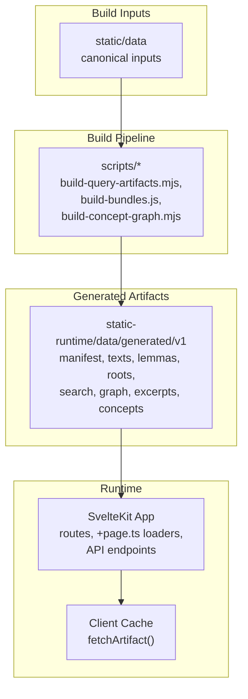
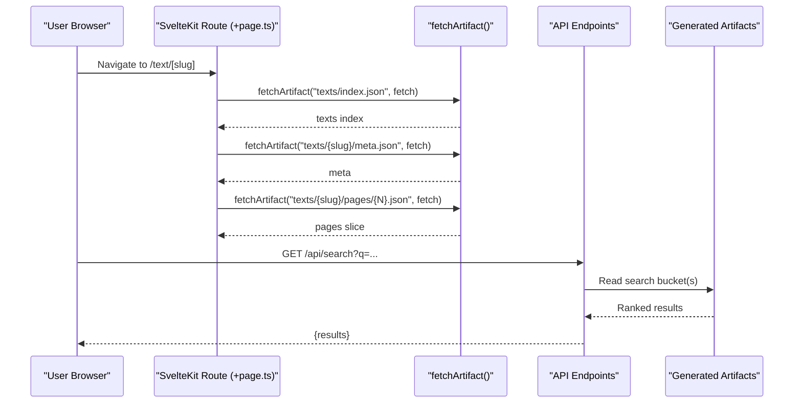
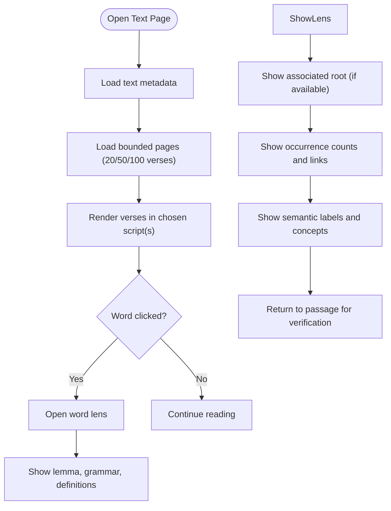
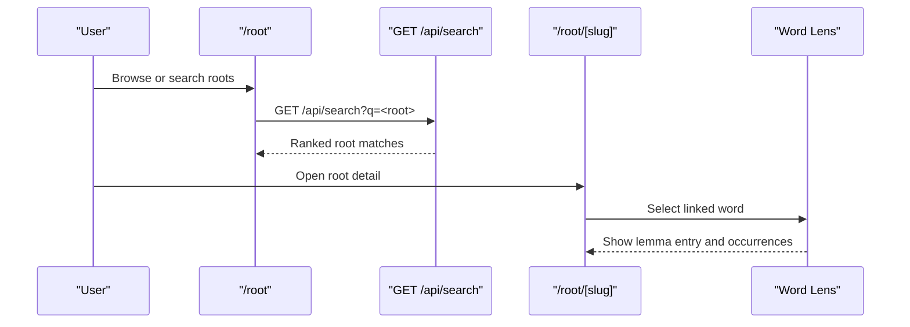
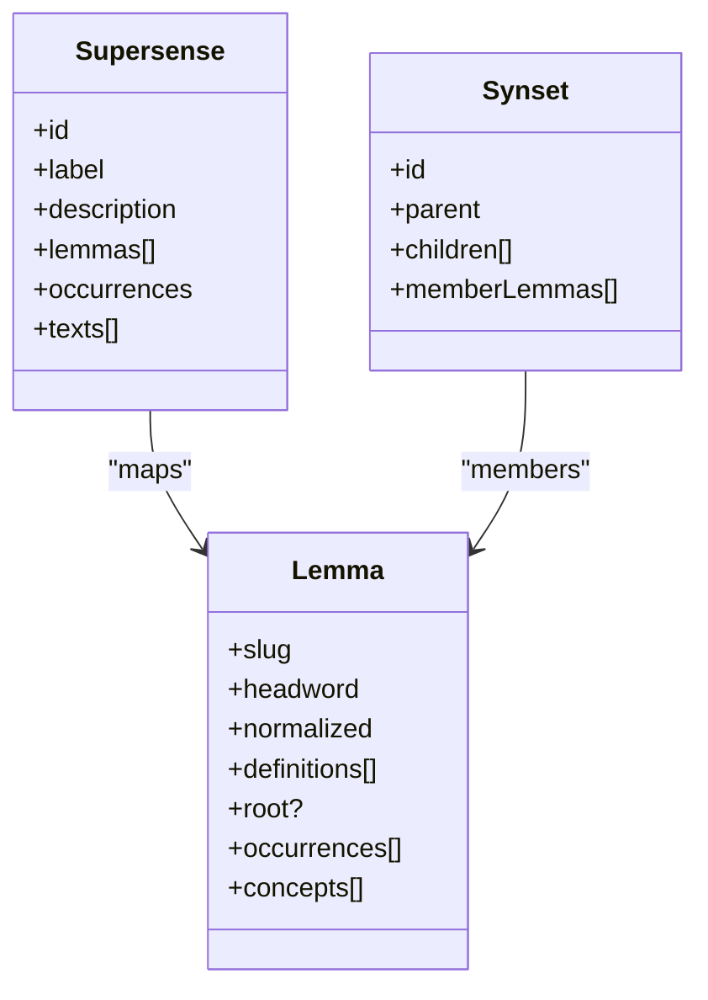
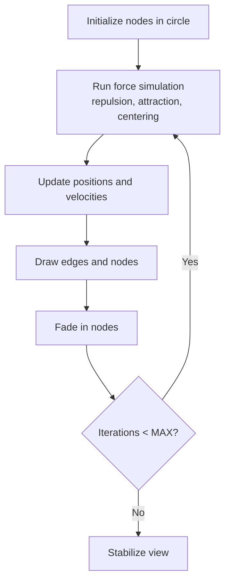
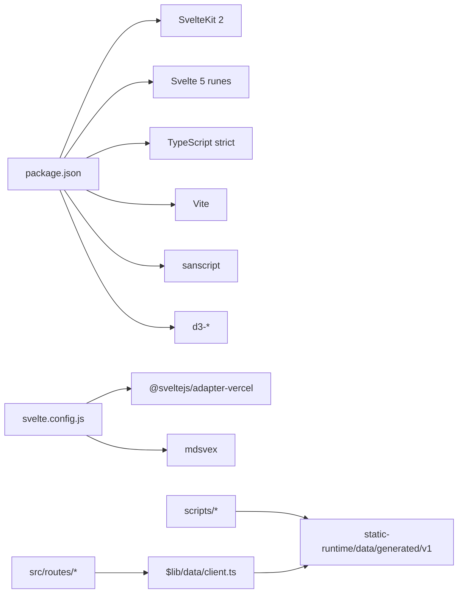

# Project Overview

<cite>
**Referenced Files in This Document**
- [package.json](file://package.json)
- [svelte.config.js](file://svelte.config.js)
- [src/app.html](file://src/app.html)
- [vite.config.ts](file://vite.config.ts)
- [src/routes/+page.svelte](file://src/routes/+page.svelte)
- [src/hooks.server.ts](file://src/hooks.server.ts)
- [src/lib/data/client.ts](file://src/lib/data/client.ts)
- [src/lib/data/artifacts.ts](file://src/lib/data/artifacts.ts)
- [src/routes/api/search/+server.ts](file://src/routes/api/search/+server.ts)
- [src/routes/api/graph/+server.ts](file://src/routes/api/graph/+server.ts)
- [src/lib/components/text-reader.svelte](file://src/lib/components/text-reader.svelte)
- [src/lib/components/word-graph.svelte](file://src/lib/components/word-graph.svelte)
- [scripts/build-bundles.js](file://scripts/build-bundles.js)
- [scripts/build-concept-graph.mjs](file://scripts/build-concept-graph.mjs)
- [scripts/lib/build-query-artifacts.mjs](file://scripts/lib/build-query-artifacts.mjs)
- [docs/DEVELOPERS.md](file://docs/DEVELOPERS.md)
- [src/routes/docs/user/getting-started.md](file://src/routes/docs/user/getting-started.md)
- [src/routes/docs/user/discovery-pathways.md](file://src/routes/docs/user/discovery-pathways.md)
- [src/routes/docs/user/reading-texts.md](file://src/routes/docs/user/reading-texts.md)
- [src/routes/docs/user/word-lens.md](file://src/routes/docs/user/word-lens.md)
- [src/routes/docs/user/exploring-dhatus.md](file://src/routes/docs/user/exploring-dhatus.md)
- [src/routes/docs/user/exploring-concepts.md](file://src/routes/docs/user/exploring-concepts.md)
</cite>

## Table of Contents
1. [Introduction](#introduction)
2. [Project Structure](#project-structure)
3. [Core Components](#core-components)
4. [Architecture Overview](#architecture-overview)
5. [Detailed Component Analysis](#detailed-component-analysis)
6. [Dependency Analysis](#dependency-analysis)
7. [Performance Considerations](#performance-considerations)
8. [Troubleshooting Guide](#troubleshooting-guide)
9. [Conclusion](#conclusion)

## Introduction
FractalDharma is a Sanskrit text exploration platform that builds an interconnected web of Dharmic texts through linguistic analysis. It connects three primary pathways:
- Textual reading: browse and read texts with multi-script display (Devanāgarī, IAST, or both).
- Verbal root (dhātu) analysis: explore roots, their meanings, derived words, and grammatical references.
- Semantic concept mapping: navigate lemmas grouped by WordNet supersenses and synsets for cross-text exploration.

The platform targets researchers, students, and enthusiasts of Sanskrit literature who want to move fluidly between close reading and corpus-wide discovery. Key features include the interactive word lens (a right-side panel that opens from any selected word), graph visualization of lexical and conceptual relationships, and multi-script display for comparative reading. The site bridges traditional Sanskrit scholarship with modern web technologies by turning static corpora into queryable, versioned artifacts served efficiently over the web.

**Section sources**
- [src/routes/+page.svelte:1-43](file://src/routes/+page.svelte#L1-L43)
- [src/routes/docs/user/getting-started.md:1-27](file://src/routes/docs/user/getting-started.md#L1-L27)
- [src/routes/docs/user/discovery-pathways.md:1-33](file://src/routes/docs/user/discovery-pathways.md#L1-L33)

## Project Structure
At a high level, FractalDharma uses SvelteKit 2 with Svelte 5 runes mode, TypeScript strictness, and Vite for development and build. Canonical corpus data lives under static/data but is never served directly at runtime. A deterministic build pipeline generates versioned, query-shaped JSON artifacts under static-runtime/data/generated/v1, which are then deployed as public assets. Routes and API endpoints consume these artifacts via a shared client that deduplicates requests and caches completed values.

**Diagram sources**
- [docs/DEVELOPERS.md:65-128](file://docs/DEVELOPERS.md#L65-L128)
- [svelte.config.js:1-29](file://svelte.config.js#L1-L29)
- [package.json:1-47](file://package.json#L1-L47)

**Section sources**
- [docs/DEVELOPERS.md:1-128](file://docs/DEVELOPERS.md#L1-L128)
- [svelte.config.js:1-29](file://svelte.config.js#L1-L29)
- [package.json:1-47](file://package.json#L1-L47)

## Core Components
- Text reader: Renders verses in Devanāgarī, IAST, or both; supports reference navigation and page size selection; integrates the word lens on word selection.
- Word lens: Displays lemma, grammar, dictionary definitions, root association, occurrences, and semantic labels; enables movement from form to lemma and back to passages.
- Root explorer: Indexes dhātus with metadata (gaṇa, pada, upasargas) and linked word families; allows drilling into lemmas and their contexts.
- Concept explorer: Presents WordNet supersenses and synsets; shows IS-A chains, local graphs, and member lemmas; guides passage-first verification.
- Graph visualization: Precomputed bounded neighborhoods for lemmas, roots, and texts; interactive force-directed rendering with zoom and pan.
- Search: Debounced queries across search buckets; returns ranked results limited to a safe count.

These components work together to support research workflows that begin with a question and move iteratively between passages, lemmas, roots, and concepts.

**Section sources**
- [src/lib/components/text-reader.svelte:1-35](file://src/lib/components/text-reader.svelte#L1-L35)
- [src/routes/docs/user/word-lens.md:1-33](file://src/routes/docs/user/word-lens.md#L1-L33)
- [src/routes/docs/user/exploring-dhatus.md:1-50](file://src/routes/docs/user/exploring-dhatus.md#L1-L50)
- [src/routes/docs/user/exploring-concepts.md:1-50](file://src/routes/docs/user/exploring-concepts.md#L1-L50)
- [src/lib/components/word-graph.svelte:97-202](file://src/lib/components/word-graph.svelte#L97-L202)
- [src/routes/api/search/+server.ts:1-79](file://src/routes/api/search/+server.ts#L1-L79)

## Architecture Overview
The runtime architecture separates canonical inputs from generated artifacts. SvelteKit routes load data via universal loaders using fetch, while API endpoints provide thin artifact readers. A shared client ensures request deduplication and in-memory caching. Build scripts transform raw corpora into compact, query-friendly projections.

**Diagram sources**
- [docs/DEVELOPERS.md:130-148](file://docs/DEVELOPERS.md#L130-L148)
- [src/routes/api/search/+server.ts:1-79](file://src/routes/api/search/+server.ts#L1-L79)
- [src/lib/data/client.ts:130-148](file://src/lib/data/client.ts#L130-L148)

**Section sources**
- [docs/DEVELOPERS.md:130-148](file://docs/DEVELOPERS.md#L130-L148)
- [src/routes/api/search/+server.ts:1-79](file://src/routes/api/search/+server.ts#L1-L79)

## Detailed Component Analysis

### Text Reader and Word Lens
The text reader renders a bounded slice of verses and wires word clicks to the context lens. The word lens surfaces lemma information, grammar, dictionary entries, root associations, occurrences, and semantic labels. It helps users distinguish surface forms from normalized lemmas and encourages returning to passages for interpretation.

**Diagram sources**
- [src/lib/components/text-reader.svelte:1-35](file://src/lib/components/text-reader.svelte#L1-L35)
- [src/routes/docs/user/word-lens.md:1-33](file://src/routes/docs/user/word-lens.md#L1-L33)
- [src/routes/docs/user/reading-texts.md:1-32](file://src/routes/docs/user/reading-texts.md#L1-L32)

**Section sources**
- [src/lib/components/text-reader.svelte:1-35](file://src/lib/components/text-reader.svelte#L1-L35)
- [src/routes/docs/user/word-lens.md:1-33](file://src/routes/docs/user/word-lens.md#L1-L33)
- [src/routes/docs/user/reading-texts.md:1-32](file://src/routes/docs/user/reading-texts.md#L1-L32)

### Dhātu Explorer
The dhātu index provides searchable access to verbal roots with metadata and linked word families. Users can follow roots to lemmas, compare derivations, and return to passages where those lemmas appear.

**Diagram sources**
- [src/routes/docs/user/exploring-dhatus.md:1-50](file://src/routes/docs/user/exploring-dhatus.md#L1-L50)
- [src/routes/api/search/+server.ts:1-79](file://src/routes/api/search/+server.ts#L1-L79)

**Section sources**
- [src/routes/docs/user/exploring-dhatus.md:1-50](file://src/routes/docs/user/exploring-dhatus.md#L1-L50)

### Concept Explorer
Concepts use broad WordNet supersenses and synsets to group lemmas semantically. The interface shows hierarchy chains, local graphs, and member lemmas, encouraging passage-first validation.

**Diagram sources**
- [src/routes/docs/user/exploring-concepts.md:1-50](file://src/routes/docs/user/exploring-concepts.md#L1-L50)
- [scripts/lib/build-query-artifacts.mjs:269-308](file://scripts/lib/build-query-artifacts.mjs#L269-L308)

**Section sources**
- [src/routes/docs/user/exploring-concepts.md:1-50](file://src/routes/docs/user/exploring-concepts.md#L1-L50)
- [scripts/lib/build-query-artifacts.mjs:269-308](file://scripts/lib/build-query-artifacts.mjs#L269-L308)

### Graph Visualization
Graphs are precomputed bounded neighborhoods for lemmas, roots, and texts. The client component renders nodes and edges with a simple force simulation, supporting zoom and pan.

**Diagram sources**
- [src/lib/components/word-graph.svelte:97-202](file://src/lib/components/word-graph.svelte#L97-L202)

**Section sources**
- [src/lib/components/word-graph.svelte:97-202](file://src/lib/components/word-graph.svelte#L97-L202)

## Dependency Analysis
The application depends on SvelteKit routing, Vite build tooling, and Node-based build scripts. Runtime data flows through a shared client that reads versioned artifacts. API endpoints are thin readers over precomputed projections.

**Diagram sources**
- [package.json:1-47](file://package.json#L1-L47)
- [svelte.config.js:1-29](file://svelte.config.js#L1-L29)
- [docs/DEVELOPERS.md:15-28](file://docs/DEVELOPERS.md#L15-L28)

**Section sources**
- [package.json:1-47](file://package.json#L1-L47)
- [svelte.config.js:1-29](file://svelte.config.js#L1-L29)
- [docs/DEVELOPERS.md:15-28](file://docs/DEVELOPERS.md#L15-L28)

## Performance Considerations
- Bounded requests: Each route loads only necessary entities or pages (e.g., 20-verse slices).
- Artifact caching: Completed-value and in-flight promise cache prevent duplicate parsing within the process.
- Precomputed graphs: Neighborhoods are computed during build to avoid runtime joins.
- Search limits: Results are capped to reduce payload and ranking cost.
- Deployment footprint: Generated artifacts are large; consider object storage/CDN if deployment constraints apply.

[No sources needed since this section provides general guidance]

## Troubleshooting Guide
- Internal errors: Server hook logs errors and returns a generic message.
- Missing artifacts: Ensure build pipeline runs and static-runtime is deployed.
- Search anomalies: Verify sanscript normalization and bucket resolution.
- Graph not found: Confirm query index and bucket paths match artifact schema.

**Section sources**
- [src/hooks.server.ts:1-12](file://src/hooks.server.ts#L1-L12)
- [docs/DEVELOPERS.md:252-276](file://docs/DEVELOPERS.md#L252-L276)

## Conclusion
FractalDharma unifies textual reading, dhātu analysis, and semantic concept mapping into a cohesive exploration platform. By transforming canonical Sanskrit corpora into efficient, versioned artifacts and exposing them through SvelteKit routes and APIs, it enables both scholarly rigor and interactive discovery. Researchers and students can move seamlessly from passages to lemmas, roots, and concepts, always anchored by the option to return to original texts for verification.

[No sources needed since this section summarizes without analyzing specific files]