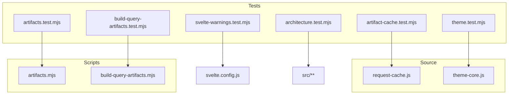
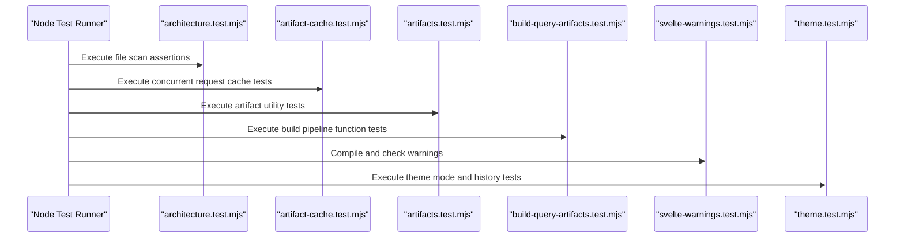
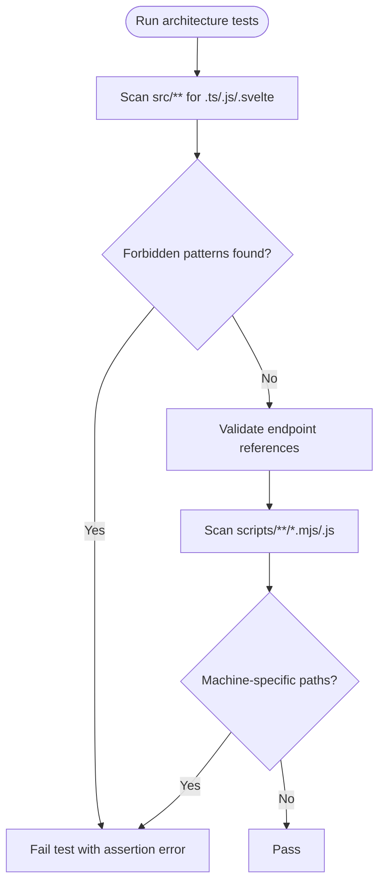
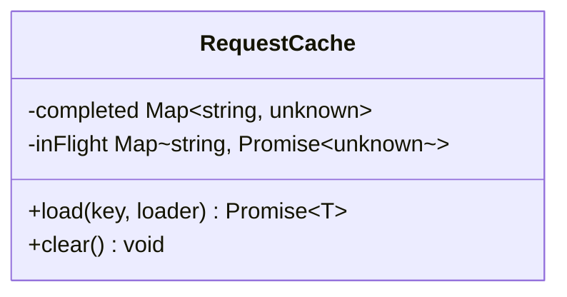
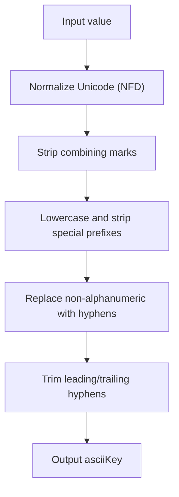
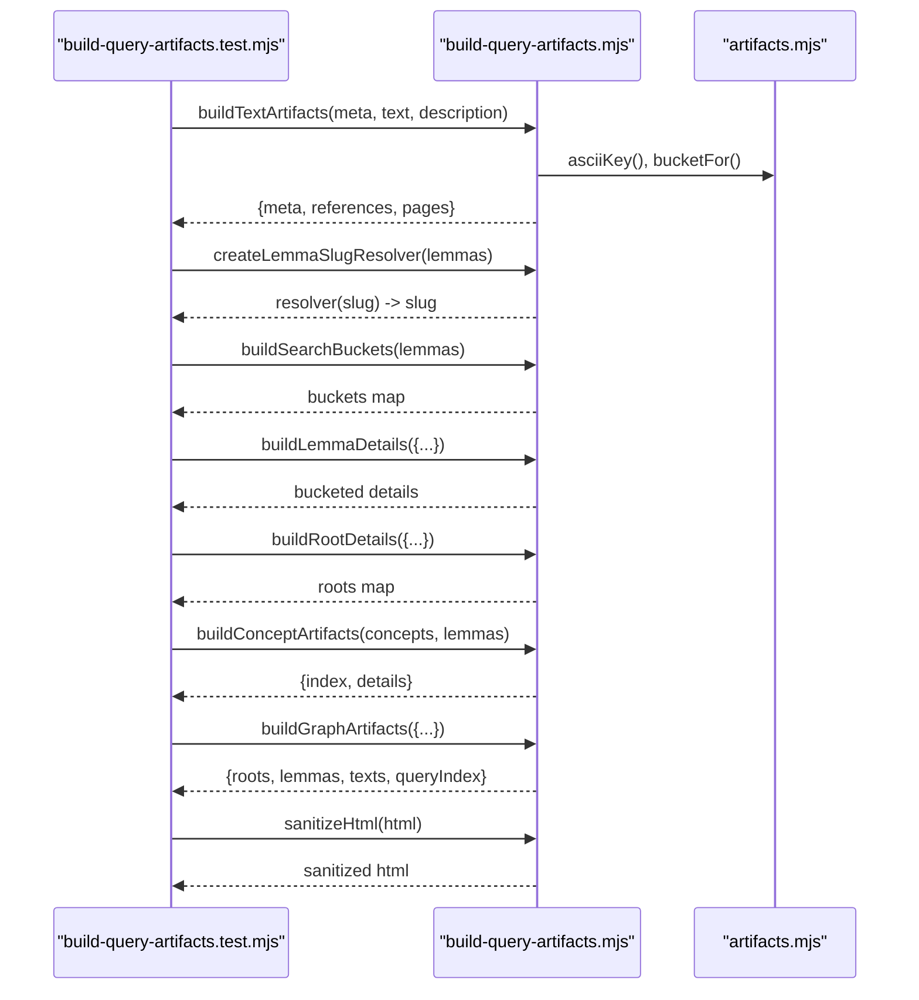
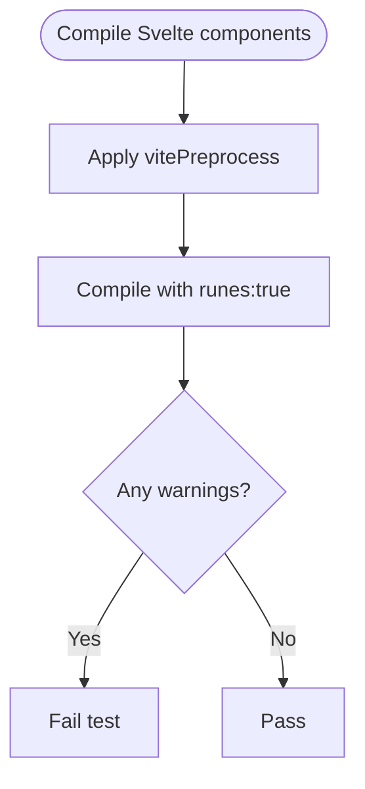
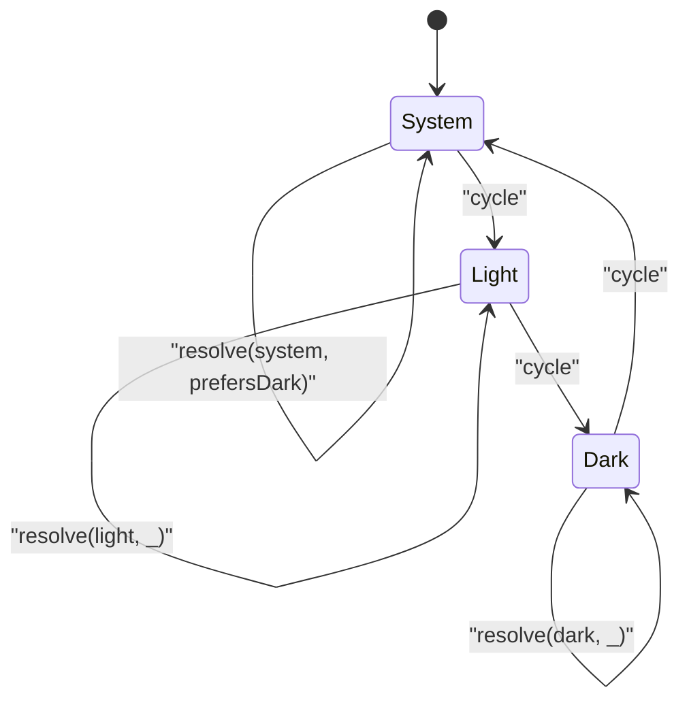
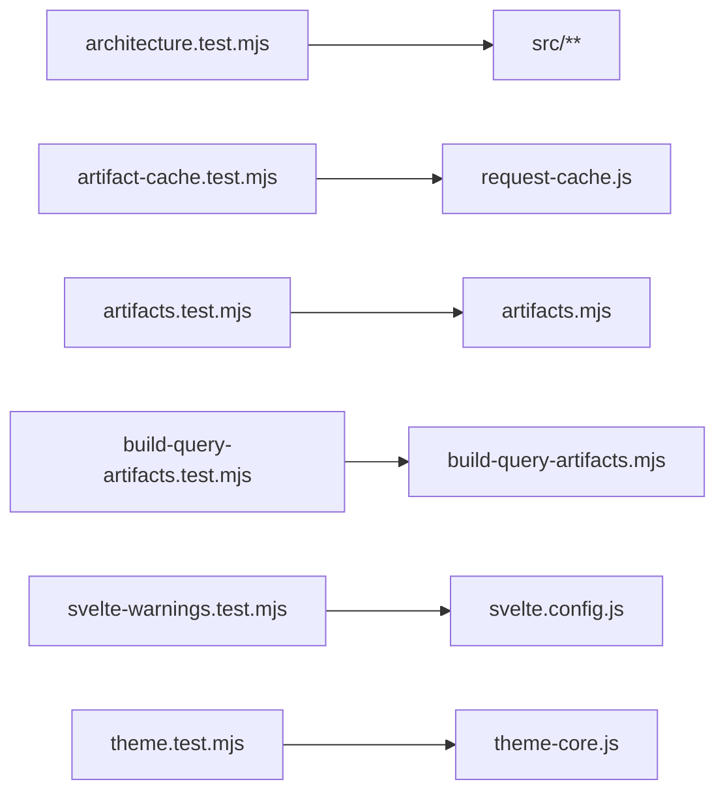

# Testing and Quality Assurance

<cite>
**Referenced Files in This Document**
- [package.json](file://package.json)
- [svelte.config.js](file://svelte.config.js)
- [vite.config.ts](file://vite.config.ts)
- [tests/architecture.test.mjs](file://tests/architecture.test.mjs)
- [tests/artifact-cache.test.mjs](file://tests/artifact-cache.test.mjs)
- [tests/artifacts.test.mjs](file://tests/artifacts.test.mjs)
- [tests/build-query-artifacts.test.mjs](file://tests/build-query-artifacts.test.mjs)
- [tests/svelte-warnings.test.mjs](file://tests/svelte-warnings.test.mjs)
- [tests/theme.test.mjs](file://tests/theme.test.mjs)
- [src/lib/data/request-cache.js](file://src/lib/data/request-cache.js)
- [scripts/lib/artifacts.mjs](file://scripts/lib/artifacts.mjs)
- [scripts/lib/build-query-artifacts.mjs](file://scripts/lib/build-query-artifacts.mjs)
- [src/lib/stores/theme-core.js](file://src/lib/stores/theme-core.js)
</cite>

## Table of Contents
1. [Introduction](#introduction)
2. [Project Structure](#project-structure)
3. [Core Components](#core-components)
4. [Architecture Overview](#architecture-overview)
5. [Detailed Component Analysis](#detailed-component-analysis)
6. [Dependency Analysis](#dependency-analysis)
7. [Performance Considerations](#performance-considerations)
8. [Troubleshooting Guide](#troubleshooting-guide)
9. [Conclusion](#conclusion)
10. [Appendices](#appendices)

## Introduction
This document provides comprehensive testing and quality assurance guidance for FractalDharma. It covers the test suite structure, unit tests for core functionality, artifact cache behavior, build pipeline data transformation scripts, Svelte component warning detection, theme consistency, architecture tests, continuous integration setup, performance monitoring, memory leak detection, profiling techniques, debugging strategies, and best practices for writing effective tests and maintaining coverage.

## Project Structure
FractalDharma uses Node’s built-in test runner with MJS modules and a small set of focused test files under tests/. The project is a SvelteKit application configured to use Vite and the Vercel adapter. Build and data generation are orchestrated via npm scripts that invoke custom scripts under scripts/.

Key elements:
- Test runner: node:test (via package.json scripts)
- Svelte configuration: svelte.config.js enables preprocessing and runes mode
- Vite configuration: vite.config.ts integrates SvelteKit
- Data build pipeline: multiple scripts under scripts/ generate artifacts consumed by the app

**Diagram sources**
- [tests/architecture.test.mjs:1-55](file://tests/architecture.test.mjs#L1-L55)
- [tests/artifact-cache.test.mjs:1-37](file://tests/artifact-cache.test.mjs#L1-L37)
- [tests/artifacts.test.mjs:1-33](file://tests/artifacts.test.mjs#L1-L33)
- [tests/build-query-artifacts.test.mjs:1-206](file://tests/build-query-artifacts.test.mjs#L1-L206)
- [tests/svelte-warnings.test.mjs:1-39](file://tests/svelte-warnings.test.mjs#L1-L39)
- [tests/theme.test.mjs:1-33](file://tests/theme.test.mjs#L1-L33)
- [src/lib/data/request-cache.js:1-45](file://src/lib/data/request-cache.js#L1-L45)
- [src/lib/stores/theme-core.js:1-29](file://src/lib/stores/theme-core.js#L1-L29)
- [scripts/lib/artifacts.mjs:1-24](file://scripts/lib/artifacts.mjs#L1-L24)
- [scripts/lib/build-query-artifacts.mjs:1-457](file://scripts/lib/build-query-artifacts.mjs#L1-L457)
- [svelte.config.js:1-29](file://svelte.config.js#L1-L29)

**Section sources**
- [package.json:1-47](file://package.json#L1-L47)
- [svelte.config.js:1-29](file://svelte.config.js#L1-L29)
- [vite.config.ts:1-7](file://vite.config.ts#L1-L7)

## Core Components
The test suite focuses on:
- Architecture constraints: ensuring SSR defaults, no SPA rewrites, runtime source hygiene, and safe build scripts
- Artifact utilities: ASCII key normalization, bucketing, pagination filenames, versioned paths
- Request caching: deduplication of concurrent requests and failure cleanup
- Build query artifacts: text pagination, lemma resolution, search buckets, root details, concept artifacts, excerpt buckets, graph artifacts, HTML sanitization
- Svelte warnings: compile-time checks for specific components
- Theme logic: system preference resolution, cycling modes, undo history

These components are validated through targeted unit tests that assert deterministic outputs and behaviors.

**Section sources**
- [tests/architecture.test.mjs:1-55](file://tests/architecture.test.mjs#L1-L55)
- [tests/artifacts.test.mjs:1-33](file://tests/artifacts.test.mjs#L1-L33)
- [tests/artifact-cache.test.mjs:1-37](file://tests/artifact-cache.test.mjs#L1-L37)
- [tests/build-query-artifacts.test.mjs:1-206](file://tests/build-query-artifacts.test.mjs#L1-L206)
- [tests/svelte-warnings.test.mjs:1-39](file://tests/svelte-warnings.test.mjs#L1-L39)
- [tests/theme.test.mjs:1-33](file://tests/theme.test.mjs#L1-L33)

## Architecture Overview
The testing architecture leverages Node’s test runner to validate both runtime behavior and build-time transformations. Tests import production code directly from src/ and scripts/, ensuring they exercise real implementations rather than mocks where possible.

**Diagram sources**
- [tests/architecture.test.mjs:1-55](file://tests/architecture.test.mjs#L1-L55)
- [tests/artifact-cache.test.mjs:1-37](file://tests/artifact-cache.test.mjs#L1-L37)
- [tests/artifacts.test.mjs:1-33](file://tests/artifacts.test.mjs#L1-L33)
- [tests/build-query-artifacts.test.mjs:1-206](file://tests/build-query-artifacts.test.mjs#L1-L206)
- [tests/svelte-warnings.test.mjs:1-39](file://tests/svelte-warnings.test.mjs#L1-L39)
- [tests/theme.test.mjs:1-33](file://tests/theme.test.mjs#L1-L33)

## Detailed Component Analysis

### Architecture Tests
Purpose:
- Ensure public routes use default SSR and avoid SPA rewrite configurations
- Prevent legacy stores or whole-corpus bundle imports at runtime
- Validate text pagination reads generated page artifacts instead of complete texts
- Disallow machine-specific home paths in build scripts

Key behaviors verified:
- Presence checks for layout and Vercel config
- Regex-based scans across source files to detect forbidden patterns
- Endpoint content validation for generated artifact usage
- Script content scanning to avoid platform-specific paths

**Diagram sources**
- [tests/architecture.test.mjs:1-55](file://tests/architecture.test.mjs#L1-L55)

**Section sources**
- [tests/architecture.test.mjs:1-55](file://tests/architecture.test.mjs#L1-L55)

### Artifact Cache Tests
Purpose:
- Verify concurrent requests for the same artifact share a single fetch
- Ensure failed requests are removed from the in-flight cache so retries succeed

Implementation highlights:
- In-memory maps track completed results and in-flight promises
- Deduplication prevents redundant network calls
- Error handling cleans up in-flight entries to allow subsequent retries

**Diagram sources**
- [src/lib/data/request-cache.js:1-45](file://src/lib/data/request-cache.js#L1-L45)

**Section sources**
- [tests/artifact-cache.test.mjs:1-37](file://tests/artifact-cache.test.mjs#L1-L37)
- [src/lib/data/request-cache.js:1-45](file://src/lib/data/request-cache.js#L1-L45)

### Artifacts Utility Tests
Purpose:
- Validate ASCII key normalization for Sanskrit diacritics and punctuation
- Confirm bucketing logic based on first two alphanumeric characters
- Ensure page filename padding for lexical ordering
- Verify versioned artifact path construction

Key functions tested:
- asciiKey: normalizes Unicode and strips diacritics
- bucketFor: derives stable bucket keys
- pageFilename: zero-pads page numbers
- versionedArtifactPath: builds immutable URLs

**Diagram sources**
- [scripts/lib/artifacts.mjs:1-24](file://scripts/lib/artifacts.mjs#L1-L24)

**Section sources**
- [tests/artifacts.test.mjs:1-33](file://tests/artifacts.test.mjs#L1-L33)
- [scripts/lib/artifacts.mjs:1-24](file://scripts/lib/artifacts.mjs#L1-L24)

### Build Query Artifacts Tests
Purpose:
- Validate text artifact pagination and metadata
- Ensure lemma slug resolution avoids guessing homographs
- Build search buckets with compact records
- Generate lemma details joining dictionary, dhatu, bridge, occurrences, concordance, concepts
- Precompute root details with word groups
- Classify root words into categories
- Create concept artifacts with index and bounded details
- Build graph artifacts for roots, lemmas, and texts
- Sanitize HTML safely

Key functions tested:
- buildTextArtifacts: pages, meta, references
- createLemmaSlugResolver: exact and normalized matching
- buildSearchBuckets: prefix-based indexing
- buildLemmaDetails: joins minimal required data
- buildRootDetails: precomputes groups and neighbors
- classifyRootWord: categorizes forms
- buildConceptArtifacts: index and details
- buildGraphArtifacts: bounded neighborhoods
- sanitizeHtml: removes executable markup and attributes

**Diagram sources**
- [tests/build-query-artifacts.test.mjs:1-206](file://tests/build-query-artifacts.test.mjs#L1-L206)
- [scripts/lib/build-query-artifacts.mjs:1-457](file://scripts/lib/build-query-artifacts.mjs#L1-L457)
- [scripts/lib/artifacts.mjs:1-24](file://scripts/lib/artifacts.mjs#L1-L24)

**Section sources**
- [tests/build-query-artifacts.test.mjs:1-206](file://tests/build-query-artifacts.test.mjs#L1-L206)
- [scripts/lib/build-query-artifacts.mjs:1-457](file://scripts/lib/build-query-artifacts.mjs#L1-L457)

### Svelte Warnings Tests
Purpose:
- Ensure specific migrated components compile without warnings using the current compiler settings

Approach:
- Preprocess selected .svelte files with vitePreprocess
- Compile with runes enabled
- Assert no warnings are emitted

**Diagram sources**
- [tests/svelte-warnings.test.mjs:1-39](file://tests/svelte-warnings.test.mjs#L1-L39)
- [svelte.config.js:1-29](file://svelte.config.js#L1-L29)

**Section sources**
- [tests/svelte-warnings.test.mjs:1-39](file://tests/svelte-warnings.test.mjs#L1-L39)
- [svelte.config.js:1-29](file://svelte.config.js#L1-L29)

### Theme Tests
Purpose:
- Validate theme mode resolution from system preferences
- Ensure cycling between system, light, and dark modes
- Confirm theme history supports undo operations

Key functions tested:
- resolveThemeMode(mode, prefersDark)
- cycleThemeMode(mode)
- createThemeHistory(initialMode)

**Diagram sources**
- [tests/theme.test.mjs:1-33](file://tests/theme.test.mjs#L1-L33)
- [src/lib/stores/theme-core.js:1-29](file://src/lib/stores/theme-core.js#L1-L29)

**Section sources**
- [tests/theme.test.mjs:1-33](file://tests/theme.test.mjs#L1-L33)
- [src/lib/stores/theme-core.js:1-29](file://src/lib/stores/theme-core.js#L1-L29)

## Dependency Analysis
The test suite depends on:
- Node’s built-in test runner and assert module
- Svelte compiler and vitePreprocess for component compilation checks
- Production source modules for request caching, theme logic, and artifact utilities
- Scripts for data transformation functions

**Diagram sources**
- [tests/architecture.test.mjs:1-55](file://tests/architecture.test.mjs#L1-L55)
- [tests/artifact-cache.test.mjs:1-37](file://tests/artifact-cache.test.mjs#L1-L37)
- [tests/artifacts.test.mjs:1-33](file://tests/artifacts.test.mjs#L1-L33)
- [tests/build-query-artifacts.test.mjs:1-206](file://tests/build-query-artifacts.test.mjs#L1-L206)
- [tests/svelte-warnings.test.mjs:1-39](file://tests/svelte-warnings.test.mjs#L1-L39)
- [tests/theme.test.mjs:1-33](file://tests/theme.test.mjs#L1-L33)
- [src/lib/data/request-cache.js:1-45](file://src/lib/data/request-cache.js#L1-L45)
- [scripts/lib/artifacts.mjs:1-24](file://scripts/lib/artifacts.mjs#L1-L24)
- [scripts/lib/build-query-artifacts.mjs:1-457](file://scripts/lib/build-query-artifacts.mjs#L1-L457)
- [src/lib/stores/theme-core.js:1-29](file://src/lib/stores/theme-core.js#L1-L29)
- [svelte.config.js:1-29](file://svelte.config.js#L1-L29)

**Section sources**
- [package.json:1-47](file://package.json#L1-L47)

## Performance Considerations
- Request cache: Uses in-memory Maps to deduplicate concurrent requests; ensure clear() is called when appropriate to prevent unbounded growth
- Artifact generation: Functions slice and limit datasets to produce bounded graphs and excerpts; verify limits remain reasonable for large corpora
- HTML sanitization: Regex-based approach is fast but should be audited for edge cases; consider DOMParser-based sanitization if complexity grows
- Memory leaks: Avoid retaining large objects in caches beyond their lifecycle; implement TTL or size limits if needed
- Profiling: Use Node’s built-in profiler (--prof) during data pipeline runs to identify hotspots in artifact generation

[No sources needed since this section provides general guidance]

## Troubleshooting Guide
Common issues and resolutions:
- Architecture test failures due to SPA rewrites: Remove or adjust vercel.json and ensure no layout.ts exists for public routes
- Runtime source violations: Refactor imports to avoid $app/stores and large corpus JSON bundles; use generated artifacts
- Text pagination errors: Ensure endpoints reference generated page artifacts under texts/{slug}/pages
- Machine-specific paths in scripts: Replace absolute paths with relative paths or environment variables
- Svelte warnings: Update component syntax to match current compiler expectations; enable runes consistently
- Theme mode mismatches: Verify system color-scheme preference mapping and cycling logic

**Section sources**
- [tests/architecture.test.mjs:1-55](file://tests/architecture.test.mjs#L1-L55)
- [tests/svelte-warnings.test.mjs:1-39](file://tests/svelte-warnings.test.mjs#L1-L39)

## Conclusion
FractalDharma’s test suite provides robust validation across architecture constraints, artifact utilities, request caching, build pipeline transformations, Svelte component compilation, and theme behavior. By adhering to the documented best practices, maintaining coverage, and integrating these tests into CI, teams can ensure reliability, performance, and visual consistency across the application.

[No sources needed since this section summarizes without analyzing specific files]

## Appendices

### Testing Best Practices
- Prefer direct imports of production code over mocks to validate real behavior
- Keep tests deterministic and isolated; avoid shared mutable state
- Use descriptive assertions with meaningful messages
- Cover edge cases and error paths explicitly
- Maintain consistent naming conventions for test files and functions

### Mock Strategies for External Dependencies
- For network calls, wrap loaders behind interfaces and inject mock implementations in tests
- For filesystem access, use temporary directories and fixtures
- For third-party libraries, stub only the boundaries you control

### Continuous Integration Setup
- Run tests via node --test in CI pipelines
- Cache dependencies and generated artifacts to speed up runs
- Fail builds on test failures and warnings
- Report coverage metrics if adding coverage tools later

### Performance Monitoring and Profiling
- Profile data pipeline scripts with Node profiler flags
- Monitor memory usage during artifact generation
- Set alerts for long-running tasks in CI

### Debugging Complex Interactions
- Add structured logging around critical paths in build scripts
- Use incremental test inputs to isolate failures
- Visualize graph artifacts to confirm expected relationships

### Writing Effective Tests and Maintaining Coverage
- Focus on behavior-critical paths and user-facing outcomes
- Regularly review and prune obsolete tests
- Introduce regression tests for newly discovered bugs

[No sources needed since this section provides general guidance]