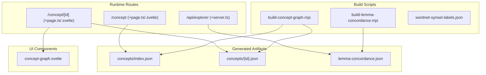
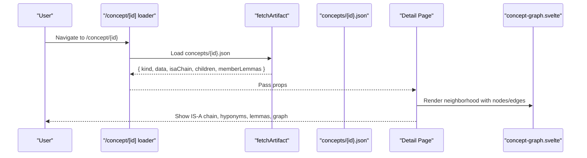
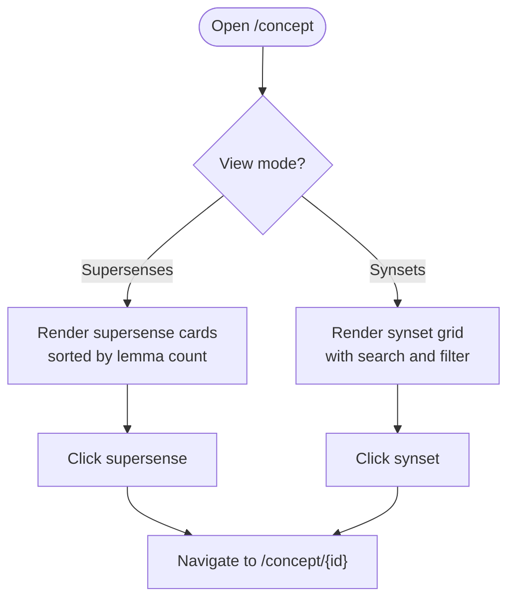
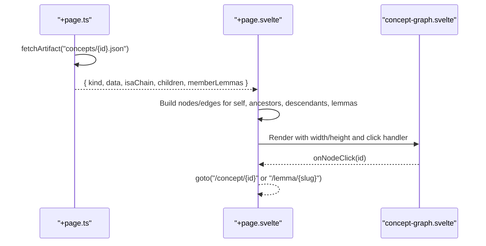
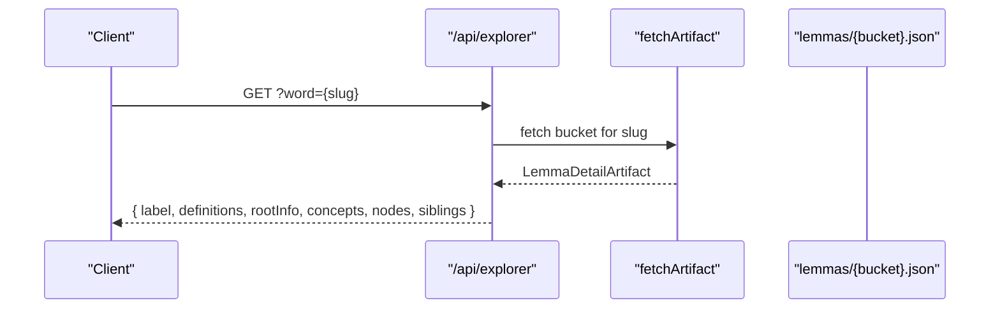
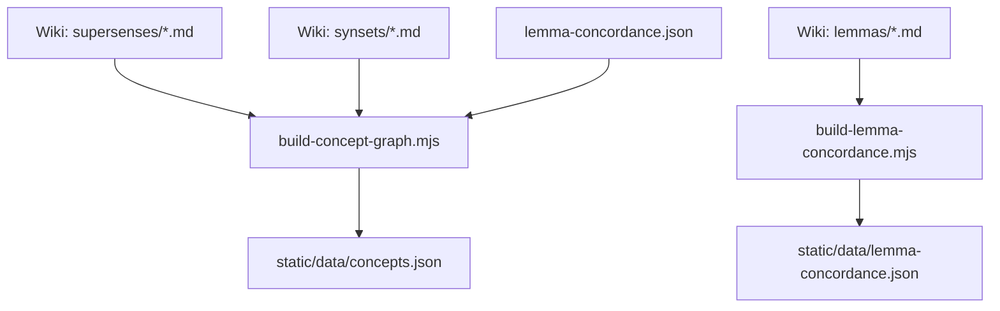
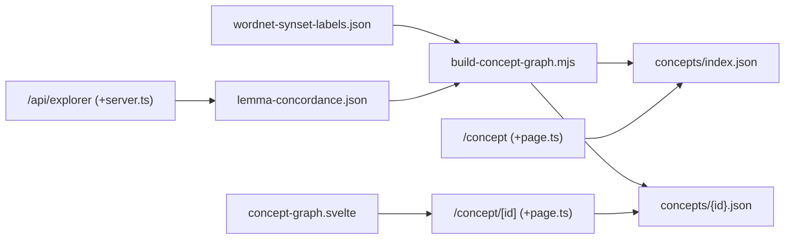

# Concept Exploration

<cite>
**Referenced Files in This Document**
- [build-concept-graph.mjs](file://scripts/build-concept-graph.mjs)
- [wordnet-synset-labels.json](file://scripts/data/wordnet-synset-labels.json)
- [build-lemma-concordance.mjs](file://scripts/build-lemma-concordance.mjs)
- [concept +page.svelte](file://src/routes/concept/+page.svelte)
- [concept +page.ts](file://src/routes/concept/+page.ts)
- [concept/[id] +page.svelte](file://src/routes/concept/[id]/+page.svelte)
- [concept/[id] +page.ts](file://src/routes/concept/[id]/+page.ts)
- [concept-graph.svelte](file://src/lib/components/concept-graph.svelte)
- [explorer API +server.ts](file://src/routes/api/explorer/+server.ts)
- [artifacts.ts](file://src/lib/data/artifacts.ts)
- [exploring-concepts.md](file://src/routes/docs/user/exploring-concepts.md)
- [glossary.md](file://src/routes/docs/user/glossary.md)
- [DEVELOPERS.md](file://docs/DEVELOPERS.md)
</cite>

## Table of Contents
1. [Introduction](#introduction)
2. [Project Structure](#project-structure)
3. [Core Components](#core-components)
4. [Architecture Overview](#architecture-overview)
5. [Detailed Component Analysis](#detailed-component-analysis)
6. [Dependency Analysis](#dependency-analysis)
7. [Performance Considerations](#performance-considerations)
8. [Troubleshooting Guide](#troubleshooting-guide)
9. [Conclusion](#conclusion)
10. [Appendices](#appendices)

## Introduction
This document explains the concept exploration system that organizes Sanskrit lemmas into broad semantic classes using WordNet supersenses. It shows how users navigate from general supersenses to specific synsets and their associated lemmas, visualize semantic relationships through a local neighborhood graph, and explore textual occurrences across the corpus. The system supports thematic research and comparative studies by enabling cross-text navigation anchored in meaning rather than raw word forms. It also clarifies how this semantic framework aids understanding of Sanskrit vocabulary organization and philosophical categorization while remaining grounded in passage-first verification.

## Project Structure
The concept exploration feature spans build-time scripts that generate static artifacts and runtime routes that present them:
- Build-time:
  - Scripts parse source wiki data (supersenses, synsets, lemma concordance) and produce versioned JSON artifacts for concepts and lemmas.
- Runtime:
  - SvelteKit routes load concept indexes and detail files.
  - A radial neighborhood graph component visualizes IS-A chains, hyponyms, and member lemmas.
  - An explorer API endpoint returns concept mappings per lemma and related text distribution.



**Diagram sources**
- [build-concept-graph.mjs](file://scripts/build-concept-graph.mjs)
- [build-lemma-concordance.mjs](file://scripts/build-lemma-concordance.mjs)
- [wordnet-synset-labels.json](file://scripts/data/wordnet-synset-labels.json)
- [concept +page.ts](file://src/routes/concept/+page.ts)
- [concept +page.svelte](file://src/routes/concept/+page.svelte)
- [concept/[id] +page.ts](file://src/routes/concept/[id]/+page.ts)
- [concept/[id] +page.svelte](file://src/routes/concept/[id]/+page.svelte)
- [concept-graph.svelte](file://src/lib/components/concept-graph.svelte)
- [explorer API +server.ts](file://src/routes/api/explorer/+server.ts)

**Section sources**
- [DEVELOPERS.md](file://docs/DEVELOPERS.md)

## Core Components
- Concept index and detail artifacts:
  - Supersense nodes include title, description, counts for lemmas, occurrences, and texts.
  - Synset nodes include short name, full title, description, WordNet ID, parent id, and hyponym list.
  - Reverse indices map concept ids to lemmas and lemmas to concepts.
- Concept browsing UI:
  - Lists supersenses sorted by lemma count; filters synsets by search and top-level supersense.
  - Navigates to concept detail pages.
- Concept detail page:
  - Displays IS-A chain, hyponyms, mapped lemmas, and a radial neighborhood graph.
  - Clicking nodes navigates to other concepts or lemmas.
- Explorer API:
  - Returns concept labels attached to a lemma and its text distribution.
  - Supports sibling discovery around roots.

**Section sources**
- [build-concept-graph.mjs](file://scripts/build-concept-graph.mjs)
- [concept +page.svelte](file://src/routes/concept/+page.svelte)
- [concept +page.ts](file://src/routes/concept/+page.ts)
- [concept/[id] +page.svelte](file://src/routes/concept/[id]/+page.svelte)
- [concept/[id] +page.ts](file://src/routes/concept/[id]/+page.ts)
- [explorer API +server.ts](file://src/routes/api/explorer/+server.ts)

## Architecture Overview
The system follows a clear separation between build-time artifact generation and runtime consumption:
- Build pipeline parses structured wiki markdown and produces compact, query-shaped JSON artifacts.
- Runtime routes fetch only what is needed for the current view.
- The graph component renders deterministic layouts without force simulation, ensuring stable visuals.



**Diagram sources**
- [concept/[id] +page.ts](file://src/routes/concept/[id]/+page.ts)
- [concept/[id] +page.svelte](file://src/routes/concept/[id]/+page.svelte)
- [concept-graph.svelte](file://src/lib/components/concept-graph.svelte)

## Detailed Component Analysis

### Concept Index and Detail Data Model
- Supersense node fields:
  - t: title
  - d: description
  - l: number of mapped lemmas
  - o: total occurrences
  - tx: number of texts
- Synset node fields:
  - n: short label (from WordNet labels)
  - t: full title
  - d: description
  - wn: WordNet synset id
  - p: parent id
  - h: hyponym list [{ id, label }]
- Reverse indices:
  - cl: conceptId → [lemma, ...]
  - co: lemma → { conceptId: name }

```mermaid
classDiagram
class Supersense {
+string t
+string d
+number l
+number o
+number tx
}
class Synset {
+string n
+string t
+string d
+string wn
+string p
+{id,label}[] h
}
class ReverseIndex {
+Map~conceptId, lemmas~ cl
+Map~lemma, conceptName~ co
}
Supersense <.. ReverseIndex : "mapped lemmas"
Synset <.. ReverseIndex : "mapped lemmas"
```

**Diagram sources**
- [build-concept-graph.mjs](file://scripts/build-concept-graph.mjs)
- [wordnet-synset-labels.json](file://scripts/data/wordnet-synset-labels.json)

**Section sources**
- [build-concept-graph.mjs](file://scripts/build-concept-graph.mjs)
- [wordnet-synset-labels.json](file://scripts/data/wordnet-synset-labels.json)

### Concept Browsing UI
- Presents two views:
  - Supersenses: cards with counts for lemmas, occurrences, and texts.
  - Synsets: searchable grid filtered by top-level supersense.
- Navigation:
  - Clicking a card opens the corresponding concept detail page.



**Diagram sources**
- [concept +page.svelte](file://src/routes/concept/+page.svelte)
- [concept +page.ts](file://src/routes/concept/+page.ts)

**Section sources**
- [concept +page.svelte](file://src/routes/concept/+page.svelte)
- [concept +page.ts](file://src/routes/concept/+page.ts)

### Concept Detail Page and Neighborhood Graph
- Loads concept detail including IS-A chain, children (hyponyms), and member lemmas.
- Builds a bounded neighborhood:
  - Self node at center
  - Ancestors in a vertical chain above
  - Descendants on an arc below
  - Lemmas on an outer ring
- Clicking nodes navigates to either another concept or a lemma page.



**Diagram sources**
- [concept/[id] +page.ts](file://src/routes/concept/[id]/+page.ts)
- [concept/[id] +page.svelte](file://src/routes/concept/[id]/+page.svelte)
- [concept-graph.svelte](file://src/lib/components/concept-graph.svelte)

**Section sources**
- [concept/[id] +page.ts](file://src/routes/concept/[id]/+page.ts)
- [concept/[id] +page.svelte](file://src/routes/concept/[id]/+page.svelte)
- [concept-graph.svelte](file://src/lib/components/concept-graph.svelte)

### Explorer API for Lemma Concepts and Distribution
- When called with a lemma slug, returns:
  - Label and preview
  - Definitions
  - Root info if available
  - Concept labels mapped to the lemma
  - Text distribution nodes
  - Sibling words grouped by root
- When called with a root slug, returns top words under that root.



**Diagram sources**
- [explorer API +server.ts](file://src/routes/api/explorer/+server.ts)
- [artifacts.ts](file://src/lib/data/artifacts.ts)

**Section sources**
- [explorer API +server.ts](file://src/routes/api/explorer/+server.ts)
- [artifacts.ts](file://src/lib/data/artifacts.ts)

### Build Pipeline: From Wiki to Artifacts
- Concept graph builder:
  - Reads supersense and synset markdown files
  - Parses frontmatter and sections (IS-A chain, hyponyms, WordNet id)
  - Builds reverse indices from lemma-concordance
  - Outputs concepts.json with sup, syn, cl, co
- Lemma concordance builder:
  - Parses lemma markdown files
  - Extracts properties, dictionary definitions, semantic classification, distribution, and concordance samples
  - Outputs lemma-concordance.json keyed by ASCII-normalized lemmas



**Diagram sources**
- [build-concept-graph.mjs](file://scripts/build-concept-graph.mjs)
- [build-lemma-concordance.mjs](file://scripts/build-lemma-concordance.mjs)

**Section sources**
- [build-concept-graph.mjs](file://scripts/build-concept-graph.mjs)
- [build-lemma-concordance.mjs](file://scripts/build-lemma-concordance.mjs)

## Dependency Analysis
- Build-time dependencies:
  - WordNet labels provide human-readable names for synset ids.
  - Lemma concordance provides semantic mapping from lemmas to concepts.
- Runtime dependencies:
  - Routes depend on generated artifacts served under a versioned base path.
  - The graph component depends on deterministic layout logic and D3 utilities for interaction.



**Diagram sources**
- [wordnet-synset-labels.json](file://scripts/data/wordnet-synset-labels.json)
- [build-concept-graph.mjs](file://scripts/build-concept-graph.mjs)
- [concept +page.ts](file://src/routes/concept/+page.ts)
- [concept/[id] +page.ts](file://src/routes/concept/[id]/+page.ts)
- [concept-graph.svelte](file://src/lib/components/concept-graph.svelte)
- [explorer API +server.ts](file://src/routes/api/explorer/+server.ts)

**Section sources**
- [DEVELOPERS.md](file://docs/DEVELOPERS.md)

## Performance Considerations
- Deterministic radial layout avoids expensive force simulations, keeping rendering fast even with many lemma leaves.
- Bounded neighborhoods limit graph size to maintain interactivity.
- Versioned artifacts and client-side caching reduce redundant network requests.
- Precomputed projections ensure route loaders remain thin and responsive.

[No sources needed since this section provides general guidance]

## Troubleshooting Guide
- If a concept page shows “Concept not found,” verify the id exists in the generated concepts artifacts and that the loader successfully fetched it.
- If the neighborhood graph appears empty, check that the concept detail includes isaChain, children, and memberLemmas.
- If lemma concept mapping is missing, confirm that lemma-concordance entries contain semantic classifications and that the concept graph builder processed them.
- For explorer API responses, ensure the lemma slug matches the normalized key used in buckets.

**Section sources**
- [concept/[id] +page.ts](file://src/routes/concept/[id]/+page.ts)
- [explorer API +server.ts](file://src/routes/api/explorer/+server.ts)

## Conclusion
The concept exploration system leverages WordNet supersenses to group Sanskrit lemmas into meaningful semantic categories, enabling thematic exploration across the corpus. Users can navigate from broad supersenses to specific synsets and lemmas, visualize hierarchical relationships, and examine textual occurrences. This approach supports rigorous comparative studies while emphasizing passage-first verification and contextual understanding of Sanskrit vocabulary and philosophical categories.

[No sources needed since this section summarizes without analyzing specific files]

## Appendices

### How to Use Concept Mapping for Thematic Research
- Start with a supersense relevant to your theme (e.g., State, Communication).
- Select several lemmas within that supersense and compare their concordance samples across texts.
- Follow the IS-A chain to understand broader categories and hyponyms to explore narrower distinctions.
- Validate findings by returning to actual passages via occurrences and concordance.

**Section sources**
- [exploring-concepts.md](file://src/routes/docs/user/exploring-concepts.md)
- [glossary.md](file://src/routes/docs/user/glossary.md)