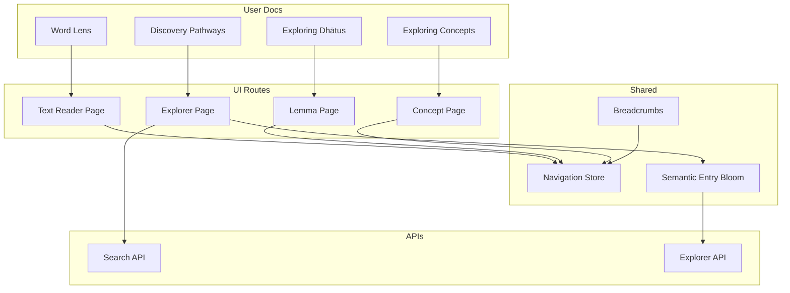
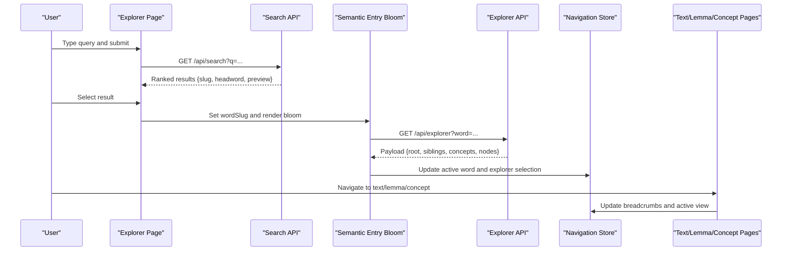
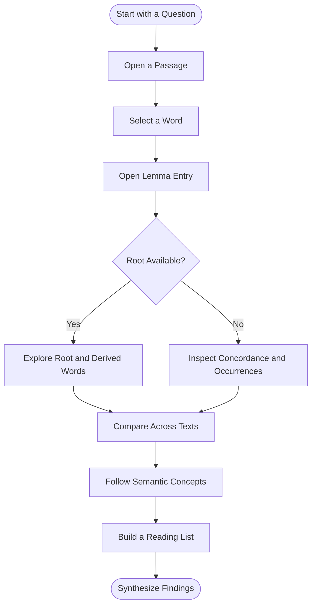
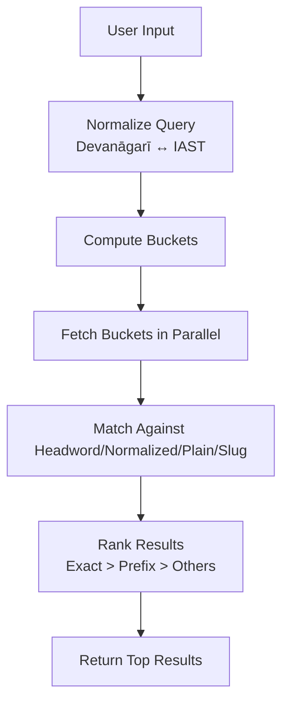
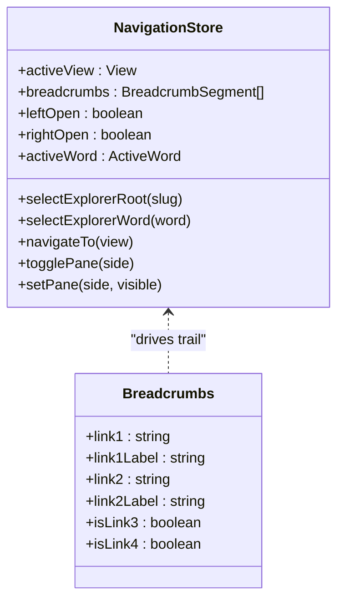
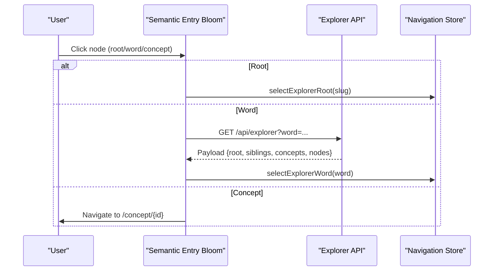
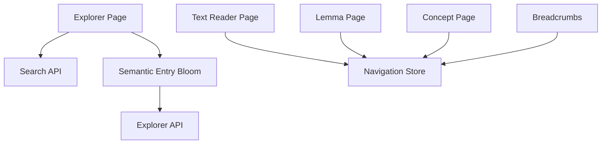

# Discovery Pathways

<cite>
**Referenced Files in This Document**
- [discovery-pathways.md](file://src/routes/docs/user/discovery-pathways.md)
- [explorer-page.svelte](file://src/routes/explorer/+page.svelte)
- [explorer-page.ts](file://src/routes/explorer/+page.ts)
- [explorer-server.ts](file://src/routes/api/explorer/+server.ts)
- [search-server.ts](file://src/routes/api/search/+server.ts)
- [navigation-store.ts](file://src/lib/stores/navigation.svelte.ts)
- [breadcrumbs.svelte](file://src/lib/components/breadcrumbs.svelte)
- [text-reader-page.svelte](file://src/routes/text/[slug]/+page.svelte)
- [lemma-page.svelte](file://src/routes/lemma/[slug]/+page.svelte)
- [concept-page.svelte](file://src/routes/concept/[id]/+page.svelte)
- [semantic-entry-bloom.svelte](file://src/lib/components/semantic-entry-bloom.svelte)
- [word-lens.md](file://src/routes/docs/user/word-lens.md)
- [exploring-concepts.md](file://src/routes/docs/user/exploring-concepts.md)
- [exploring-dhatus.md](file://src/routes/docs/user/exploring-dhatus.md)
</cite>

## Table of Contents
1. Introduction
2. Project Structure
3. Core Components
4. Architecture Overview
5. Detailed Component Analysis
6. Dependency Analysis
7. Performance Considerations
8. Troubleshooting Guide
9. Conclusion
10. Appendices

## Introduction
This document explains integrated discovery pathways in FractalDharma that combine text reading, word analysis, dhātu exploration, and concept mapping into seamless research workflows. It shows how to start from a passage and expand outward through linguistic and semantic connections, supports both linear reading and non-linear exploration, and provides practical scenarios for tracing concepts across texts, analyzing morphological patterns, and conducting comparative studies. It also covers advanced search strategies with contextual filtering, breadcrumb navigation, and history tracking to maintain research context.

## Project Structure
The discovery system spans user-facing routes, API endpoints, shared stores, and reusable components:
- User documentation outlines productive pathways and best practices.
- The Explorer page provides a central entry point for searching words and navigating the semantic bloom.
- API endpoints serve explorer data (roots, words, siblings, concepts, texts) and search results.
- A global navigation store maintains breadcrumbs, active views, panes, and selection state.
- Breadcrumb component renders consistent navigation trails.
- Text reader, lemma, and concept pages expose rich contextual information and links to other pathways.
- Semantic Entry Bloom visualizes relationships between roots, words, concepts, and texts.

**Diagram sources**
- [discovery-pathways.md:1-33](file://src/routes/docs/user/discovery-pathways.md#L1-L33)
- [explorer-page.svelte:1-155](file://src/routes/explorer/+page.svelte#L1-L155)
- [explorer-server.ts:1-121](file://src/routes/api/explorer/+server.ts#L1-L121)
- [search-server.ts:1-79](file://src/routes/api/search/+server.ts#L1-L79)
- [navigation-store.ts:1-160](file://src/lib/stores/navigation.svelte.ts#L1-L160)
- [breadcrumbs.svelte:1-53](file://src/lib/components/breadcrumbs.svelte#L1-L53)
- [text-reader-page.svelte:1-160](file://src/routes/text/[slug]/+page.svelte#L1-L160)
- [lemma-page.svelte:1-123](file://src/routes/lemma/[slug]/+page.svelte#L1-L123)
- [concept-page.svelte:1-65](file://src/routes/concept/[id]/+page.svelte#L1-L65)
- [semantic-entry-bloom.svelte:1-418](file://src/lib/components/semantic-entry-bloom.svelte#L1-L418)

**Section sources**
- [discovery-pathways.md:1-33](file://src/routes/docs/user/discovery-pathways.md#L1-L33)
- [explorer-page.svelte:1-155](file://src/routes/explorer/+page.svelte#L1-L155)
- [explorer-server.ts:1-121](file://src/routes/api/explorer/+server.ts#L1-L121)
- [search-server.ts:1-79](file://src/routes/api/search/+server.ts#L1-L79)
- [navigation-store.ts:1-160](file://src/lib/stores/navigation.svelte.ts#L1-L160)
- [breadcrumbs.svelte:1-53](file://src/lib/components/breadcrumbs.svelte#L1-L53)
- [text-reader-page.svelte:1-160](file://src/routes/text/[slug]/+page.svelte#L1-L160)
- [lemma-page.svelte:1-123](file://src/routes/lemma/[slug]/+page.svelte#L1-L123)
- [concept-page.svelte:1-65](file://src/routes/concept/[id]/+page.svelte#L1-L65)
- [semantic-entry-bloom.svelte:1-418](file://src/lib/components/semantic-entry-bloom.svelte#L1-L418)

## Core Components
- Explorer page: Provides a centered search bar, debounced queries, result list, and direct selection to navigate to a word or root. It integrates with the Semantic Entry Bloom to visualize semantic fields around a selected word.
- Search API: Normalizes queries across Devanāgarī and IAST, searches multiple buckets, ranks results by exactness and prefix matches, and returns concise previews.
- Explorer API: Serves structured payloads for roots and words, including sibling lemmas, concepts, text distributions, and root metadata.
- Navigation store: Maintains active view, breadcrumbs, pane visibility, active word selection, and explorer selections; used across pages to keep context consistent.
- Breadcrumbs: Renders a simple trail with configurable links and labels.
- Text reader page: Updates navigation context when opening a text and exposes controls for script display and pagination.
- Lemma page: Displays dictionary definitions, root info, corpus profile, occurrences, and concordance samples; updates navigation context on mount.
- Concept page: Presents IS-A chains, local neighborhood graph, hyponyms, and member lemmas; navigates to related lemmas and concepts.
- Semantic Entry Bloom: Visualizes a word’s semantic field with nodes for root, siblings, concepts, and edges indicating relationships; supports focus and hover interactions.

**Section sources**
- [explorer-page.svelte:1-155](file://src/routes/explorer/+page.svelte#L1-L155)
- [search-server.ts:1-79](file://src/routes/api/search/+server.ts#L1-L79)
- [explorer-server.ts:1-121](file://src/routes/api/explorer/+server.ts#L1-L121)
- [navigation-store.ts:1-160](file://src/lib/stores/navigation.svelte.ts#L1-L160)
- [breadcrumbs.svelte:1-53](file://src/lib/components/breadcrumbs.svelte#L1-L53)
- [text-reader-page.svelte:1-160](file://src/routes/text/[slug]/+page.svelte#L1-L160)
- [lemma-page.svelte:1-123](file://src/routes/lemma/[slug]/+page.svelte#L1-L123)
- [concept-page.svelte:1-65](file://src/routes/concept/[id]/+page.svelte#L1-L65)
- [semantic-entry-bloom.svelte:1-418](file://src/lib/components/semantic-entry-bloom.svelte#L1-L418)

## Architecture Overview
The discovery architecture combines UI routes, APIs, and shared state to support multi-modal exploration:
- Users begin at the Explorer page or within a text reader.
- Queries are sent to the Search API, which normalizes input and returns ranked results.
- Selecting a word triggers the Semantic Entry Bloom, which loads an Explorer payload via the Explorer API.
- The Explorer API aggregates data from artifacts (lemmas, roots, concepts) and returns nodes for visualization.
- Navigation store updates breadcrumbs and active view as users move between text, lemma, and concept pages.
- Breadcrumbs provide consistent back-navigation and context.

**Diagram sources**
- [explorer-page.svelte:1-155](file://src/routes/explorer/+page.svelte#L1-L155)
- [search-server.ts:1-79](file://src/routes/api/search/+server.ts#L1-L79)
- [semantic-entry-bloom.svelte:1-418](file://src/lib/components/semantic-entry-bloom.svelte#L1-L418)
- [explorer-server.ts:1-121](file://src/routes/api/explorer/+server.ts#L1-L121)
- [navigation-store.ts:1-160](file://src/lib/stores/navigation.svelte.ts#L1-L160)
- [text-reader-page.svelte:1-160](file://src/routes/text/[slug]/+page.svelte#L1-L160)
- [lemma-page.svelte:1-123](file://src/routes/lemma/[slug]/+page.svelte#L1-L123)
- [concept-page.svelte:1-65](file://src/routes/concept/[id]/+page.svelte#L1-L65)

## Detailed Component Analysis

### Integrated Research Workflows
- From a passage to a lexical family: Open a text, select a meaningful word, inspect its lemma, open its root if available, compare derived words, and return to passages across texts.
- From a lemma to its contexts: Use the dictionary or word entry to find a lemma, inspect occurrence and concordance information, and open examples in different texts and genres.
- From a text class to a comparison set: Choose a class in the text catalogue, select texts with varied dates/genres/traditions, and use the same lemma or root as a thread.
- From a concept to a reading list: Use concept entries to connect lexical material through semantic data; follow member lemmas into actual text contexts and collect passages for comparison.
- Notable lemmas: Curated signals of semantically distinctive vocabulary; good starting points for reading.
- Keep a question visible: Concrete exploratory questions make wandering cumulative.

**Section sources**
- [discovery-pathways.md:1-33](file://src/routes/docs/user/discovery-pathways.md#L1-L33)

### Advanced Search Strategies
- Normalize queries across scripts: The Search API converts between Devanāgarī and IAST to broaden matching.
- Multi-bucket search: Queries are mapped to artifact buckets and fetched in parallel for speed.
- Ranking logic: Exact headword matches rank highest, followed by normalized/plain matches, slug matches, ASCII variants, and prefix matches.
- Debounced input: The Explorer page delays requests to avoid excessive network calls while typing.
- Contextual filtering: After selecting a word, the Semantic Entry Bloom focuses on related siblings, concepts, and root lineage; users can filter by hovering to highlight connected nodes.

**Section sources**
- [search-server.ts:1-79](file://src/routes/api/search/+server.ts#L1-L79)
- [explorer-page.svelte:1-155](file://src/routes/explorer/+page.svelte#L1-L155)

### Breadcrumb Navigation and History Tracking
- Active view management: The navigation store tracks the current view type (text, root, word), label, and slug.
- Breadcrumb construction: On navigation, a trail is built with base “Texts” link and subsequent segments based on view type.
- Pane state: Left/right pane visibility is controlled independently to preserve context during exploration.
- Active word selection: When a word is selected in the reader or explorer, it becomes the active word for the right-side lens.
- Consistent updates: Text, lemma, and concept pages update the navigation store on mount to reflect the current context.

**Diagram sources**
- [navigation-store.ts:1-160](file://src/lib/stores/navigation.svelte.ts#L1-L160)
- [breadcrumbs.svelte:1-53](file://src/lib/components/breadcrumbs.svelte#L1-L53)

**Section sources**
- [navigation-store.ts:1-160](file://src/lib/stores/navigation.svelte.ts#L1-L160)
- [breadcrumbs.svelte:1-53](file://src/lib/components/breadcrumbs.svelte#L1-L53)
- [text-reader-page.svelte:1-160](file://src/routes/text/[slug]/+page.svelte#L1-L160)
- [lemma-page.svelte:1-123](file://src/routes/lemma/[slug]/+page.svelte#L1-L123)
- [concept-page.svelte:1-65](file://src/routes/concept/[id]/+page.svelte#L1-L65)

### Semantic Entry Bloom and Explorer API
- Data model: The Explorer API returns structured payloads for roots and words, including sibling lemmas, concepts, text distributions, and root metadata.
- Visualization: The Semantic Entry Bloom constructs nodes for the current word, root, siblings, and concepts; edges indicate relationships and tone types.
- Interaction: Hover highlights connected nodes; clicking navigates to roots, lemmas, or concepts and updates the explorer selection.
- Performance: Reduced motion and low-end device detection adjust animation durations; fit view options optimize initial layout.

**Diagram sources**
- [semantic-entry-bloom.svelte:1-418](file://src/lib/components/semantic-entry-bloom.svelte#L1-L418)
- [explorer-server.ts:1-121](file://src/routes/api/explorer/+server.ts#L1-L121)
- [navigation-store.ts:1-160](file://src/lib/stores/navigation.svelte.ts#L1-L160)

**Section sources**
- [explorer-server.ts:1-121](file://src/routes/api/explorer/+server.ts#L1-L121)
- [semantic-entry-bloom.svelte:1-418](file://src/lib/components/semantic-entry-bloom.svelte#L1-L418)

### Practical Research Scenarios
- Tracing a concept’s evolution across texts:
  - Start with a lemma in the reader, open its concept(s), browse hyponyms and member lemmas, then follow occurrences back to passages to track usage over time and genre.
- Analyzing morphological patterns:
  - From a lemma, explore its root and linked words grouped by stem patterns; compare guṇa/vṛddhi forms and other derivations; inspect concordance samples for grammatical features.
- Conducting comparative studies:
  - Choose a text class, select representative texts, pick a shared lemma/root, and compare distribution and concordance across them; build a small reading list of key passages.

**Section sources**
- [exploring-concepts.md:1-50](file://src/routes/docs/user/exploring-concepts.md#L1-L50)
- [exploring-dhatus.md:1-50](file://src/routes/docs/user/exploring-dhatus.md#L1-L50)
- [word-lens.md:1-33](file://src/routes/docs/user/word-lens.md#L1-L33)

### Linear vs Non-linear Exploration
- Linear reading: Text reader pages present paginated content with controls for script display and reference navigation; breadcrumbs maintain context.
- Non-linear exploration: Explorer page and Semantic Entry Bloom enable branching paths across roots, lemmas, concepts, and texts; navigation store preserves active selections and panes.

**Section sources**
- [text-reader-page.svelte:1-160](file://src/routes/text/[slug]/+page.svelte#L1-L160)
- [explorer-page.svelte:1-155](file://src/routes/explorer/+page.svelte#L1-L155)
- [semantic-entry-bloom.svelte:1-418](file://src/lib/components/semantic-entry-bloom.svelte#L1-L418)

## Dependency Analysis
- UI-to-API dependencies:
  - Explorer page depends on Search API for results and Semantic Entry Bloom for visualization.
  - Semantic Entry Bloom depends on Explorer API for detailed payloads.
- Shared state dependencies:
  - All pages depend on the navigation store to maintain breadcrumbs, active views, and selections.
- Data flow:
  - Search API normalizes and ranks queries; Explorer API aggregates artifacts and returns structured nodes; UI components render and handle interactions.

**Diagram sources**
- [explorer-page.svelte:1-155](file://src/routes/explorer/+page.svelte#L1-L155)
- [search-server.ts:1-79](file://src/routes/api/search/+server.ts#L1-L79)
- [semantic-entry-bloom.svelte:1-418](file://src/lib/components/semantic-entry-bloom.svelte#L1-L418)
- [explorer-server.ts:1-121](file://src/routes/api/explorer/+server.ts#L1-L121)
- [navigation-store.ts:1-160](file://src/lib/stores/navigation.svelte.ts#L1-L160)
- [breadcrumbs.svelte:1-53](file://src/lib/components/breadcrumbs.svelte#L1-L53)
- [text-reader-page.svelte:1-160](file://src/routes/text/[slug]/+page.svelte#L1-L160)
- [lemma-page.svelte:1-123](file://src/routes/lemma/[slug]/+page.svelte#L1-L123)
- [concept-page.svelte:1-65](file://src/routes/concept/[id]/+page.svelte#L1-L65)

**Section sources**
- [explorer-page.svelte:1-155](file://src/routes/explorer/+page.svelte#L1-L155)
- [search-server.ts:1-79](file://src/routes/api/search/+server.ts#L1-L79)
- [semantic-entry-bloom.svelte:1-418](file://src/lib/components/semantic-entry-bloom.svelte#L1-L418)
- [explorer-server.ts:1-121](file://src/routes/api/explorer/+server.ts#L1-L121)
- [navigation-store.ts:1-160](file://src/lib/stores/navigation.svelte.ts#L1-L160)
- [breadcrumbs.svelte:1-53](file://src/lib/components/breadcrumbs.svelte#L1-L53)
- [text-reader-page.svelte:1-160](file://src/routes/text/[slug]/+page.svelte#L1-L160)
- [lemma-page.svelte:1-123](file://src/routes/lemma/[slug]/+page.svelte#L1-L123)
- [concept-page.svelte:1-65](file://src/routes/concept/[id]/+page.svelte#L1-L65)

## Performance Considerations
- Debounced search reduces network load during typing.
- Parallel fetching of search buckets improves response time.
- Reduced motion and hardware concurrency checks adjust animation durations for smoother performance on low-end devices.
- Fit view and zoom limits prevent excessive re-layout costs in the bloom visualization.

[No sources needed since this section provides general guidance]

## Troubleshooting Guide
- Empty search results: Ensure the query has at least two characters; verify normalization between Devanāgarī and IAST; check bucket availability.
- Missing root info: Some lemmas may not have associated root data; treat absence as a prompt to inspect dictionary entries and source context.
- No occurrence data: If a lemma lacks occurrence data, rely on concordance samples and concept mappings; always return to passages for interpretation.
- Navigation context loss: Verify that pages call navigation store functions on mount; ensure breadcrumbs are updated consistently.

**Section sources**
- [search-server.ts:1-79](file://src/routes/api/search/+server.ts#L1-L79)
- [explorer-server.ts:1-121](file://src/routes/api/explorer/+server.ts#L1-L121)
- [word-lens.md:1-33](file://src/routes/docs/user/word-lens.md#L1-L33)
- [navigation-store.ts:1-160](file://src/lib/stores/navigation.svelte.ts#L1-L160)

## Conclusion
FractalDharma’s discovery pathways integrate text reading, word analysis, dhātu exploration, and concept mapping into flexible, question-driven workflows. The Explorer page and Semantic Entry Bloom provide powerful visual and interactive tools for expanding from a single word to broader semantic fields. The Search and Explorer APIs deliver efficient, normalized, and ranked results. The navigation store and breadcrumbs maintain context across linear and non-linear exploration. By combining these components, researchers can trace conceptual evolution, analyze morphology, and conduct comparative studies with confidence and clarity.

[No sources needed since this section summarizes without analyzing specific files]

## Appendices
- Best practices:
  - Keep a concrete question visible throughout exploration.
  - Use notable lemmas as starting points, not definitive themes.
  - Validate semantic categories against actual passages.
  - Combine keyword queries with contextual filters for precise investigations.

[No sources needed since this section provides general guidance]