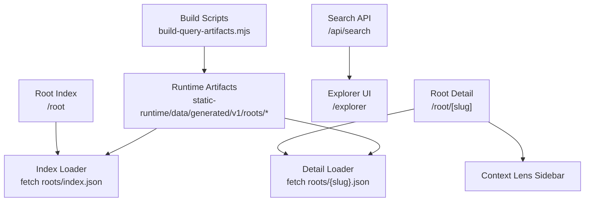
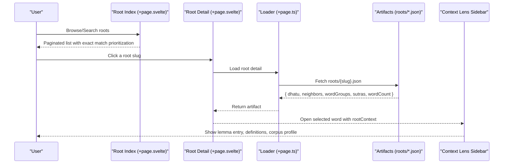
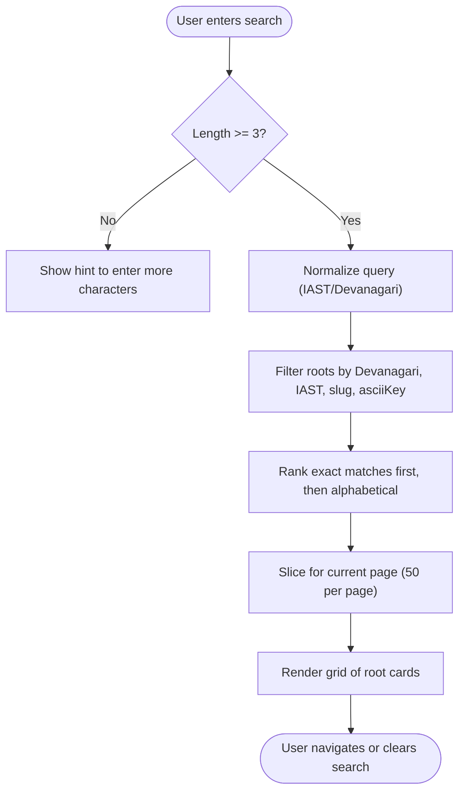
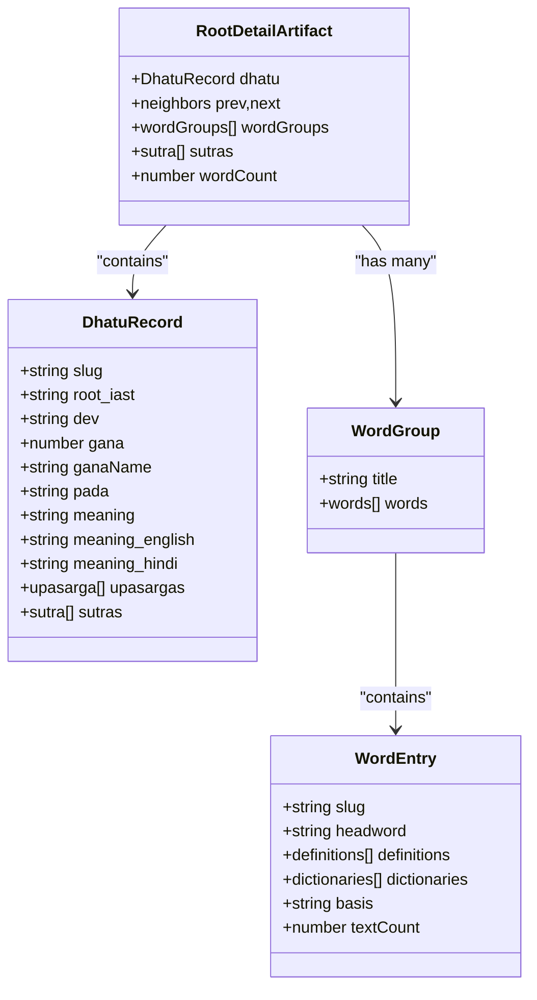
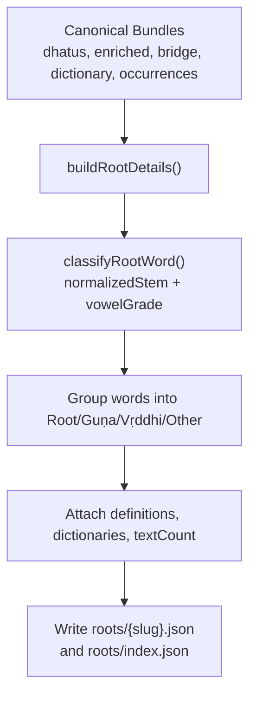
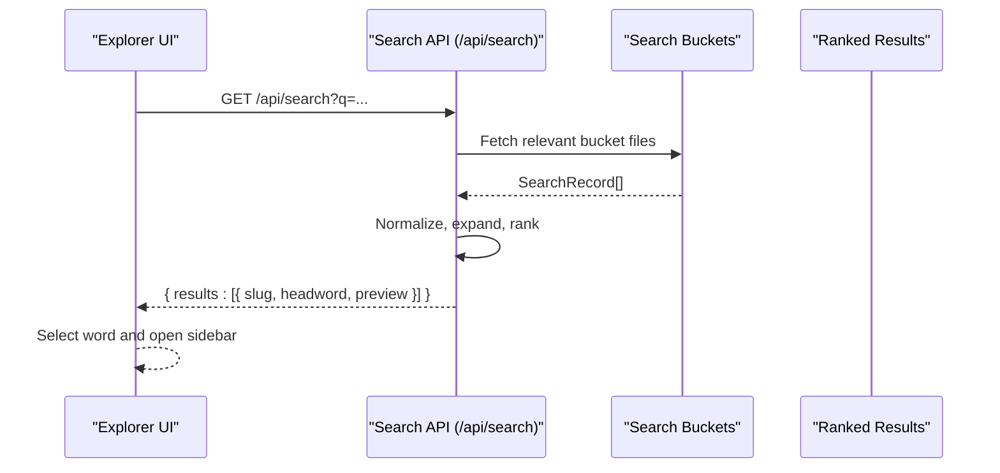
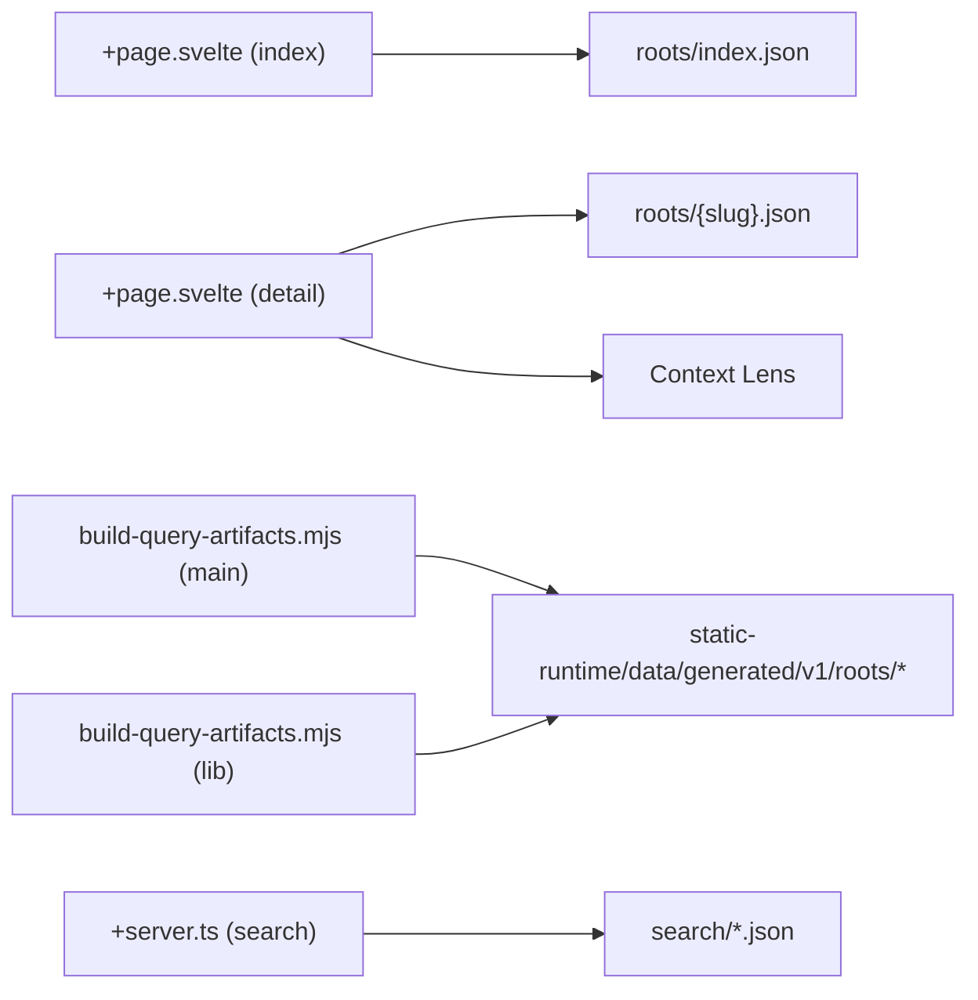

# Exploring Dhātus

<cite>
**Referenced Files in This Document**
- [exploring-dhatus.md](file://src/routes/docs/user/exploring-dhatus.md)
- [dhatu-explorer.md](file://src/routes/docs/developer/dhatu-explorer.md)
- [+page.svelte (root index)](file://src/routes/root/+page.svelte)
- [+page.svelte (root detail)](file://src/routes/root/[slug]/+page.svelte)
- [+page.ts (root detail loader)](file://src/routes/root/[slug]/+page.ts)
- [types.ts](file://src/lib/data/types.ts)
- [build-query-artifacts.mjs (main)](file://scripts/build-query-artifacts.mjs)
- [build-query-artifacts.mjs (lib)](file://scripts/lib/build-query-artifacts.mjs)
- [+server.ts (search API)](file://src/routes/api/search/+server.ts)
- [explorer page](file://src/routes/explorer/+page.svelte)
</cite>

## Table of Contents
1. [Introduction](#introduction)
2. [Project Structure](#project-structure)
3. [Core Components](#core-components)
4. [Architecture Overview](#architecture-overview)
5. [Detailed Component Analysis](#detailed-component-analysis)
6. [Dependency Analysis](#dependency-analysis)
7. [Performance Considerations](#performance-considerations)
8. [Troubleshooting Guide](#troubleshooting-guide)
9. [Conclusion](#conclusion)
10. [Appendices](#appendices)

## Introduction
This document explains the dhātu (verbal root) exploration system in FractalDharma. It covers how users search and browse verbal roots in both IAST and Devanāgarī, how root records display grammatical classification (gaṇa, pada), conjugation patterns, and semantic meanings, and how word families are visualized with derivatives, compounds, and related forms. It also documents integration with dictionary entries and textual occurrences, and provides practical examples for tracing derivations and understanding Sanskrit morphological patterns. Finally, it connects dhātu information to broader linguistic concepts and supports etymological research workflows.

## Project Structure
The dhātu explorer is implemented as a SvelteKit application with:
- A browsable index at /root that lists roots with pagination and search.
- A detail view at /root/[slug] showing metadata and grouped linked words.
- Prebuilt artifacts generated by build scripts for fast client loading.
- An API endpoint for lemmal search used across explorers.

**Diagram sources**
- [build-query-artifacts.mjs (main):141-152](file://scripts/build-query-artifacts.mjs#L141-L152)
- [+page.svelte (root index):1-151](file://src/routes/root/+page.svelte#L1-L151)
- [+page.svelte (root detail):1-132](file://src/routes/root/[slug]/+page.svelte#L1-L132)
- [+page.ts (root detail loader):1-13](file://src/routes/root/[slug]/+page.ts#L1-L13)
- [+server.ts (search API):1-79](file://src/routes/api/search/+server.ts#L1-L79)

**Section sources**
- [exploring-dhatus.md:1-50](file://src/routes/docs/user/exploring-dhatus.md#L1-L50)
- [dhatu-explorer.md:1-85](file://src/routes/docs/developer/dhatu-explorer.md#L1-L85)

## Core Components
- Root Index Page: Presents a paginated list of roots with search in IAST and Devanāgarī. Exact matches rank first; otherwise alphabetical order applies. Users can navigate via previous/next buttons or a page selector.
- Root Detail Page: Displays the root’s IAST and Devanāgarī forms, meanings, gaṇa, pada, and upasargas when available. Linked words are grouped into Root, Guṇa, Vṛddhi, and Other based on initial stem patterns. Selecting a word opens its lemma entry in the right sidebar.
- Data Types: Strongly typed interfaces define DhatuRecord and RootDetailArtifact structures used by pages and loaders.
- Build Pipeline: Generates compact runtime artifacts for roots/index.json and per-root details, including neighbors, word groups, definitions, and counts.

**Section sources**
- [+page.svelte (root index):1-151](file://src/routes/root/+page.svelte#L1-L151)
- [+page.svelte (root detail):1-132](file://src/routes/root/[slug]/+page.svelte#L1-L132)
- [types.ts:48-92](file://src/lib/data/types.ts#L48-L92)
- [dhatu-explorer.md:25-45](file://src/routes/docs/developer/dhatu-explorer.md#L25-L45)

## Architecture Overview
The system separates data preparation from runtime rendering:
- Canonical bundles are built from raw inputs into static data.
- Query-time artifacts are generated for efficient client fetching.
- Pages fetch only what they need: an index projection or a single root detail artifact.
- The search API supports cross-feature discovery and integrates with the explorer UI.

**Diagram sources**
- [+page.svelte (root index):1-151](file://src/routes/root/+page.svelte#L1-L151)
- [+page.svelte (root detail):1-132](file://src/routes/root/[slug]/+page.svelte#L1-L132)
- [+page.ts (root detail loader):1-13](file://src/routes/root/[slug]/+page.ts#L1-L13)
- [build-query-artifacts.mjs (main):141-152](file://scripts/build-query-artifacts.mjs#L141-L152)

## Detailed Component Analysis

### Root Index: Search and Pagination
- Search behavior: Accepts IAST and Devanāgarī input; requires at least three characters to filter. Exact matches are prioritized; remaining results sort alphabetically. Escape or clicking outside clears the query.
- Pagination: Groups of 50 roots per page with previous/next navigation and a page selector.
- Rendering: Shows root IAST and Devanāgarī forms along with meaning summaries.

**Diagram sources**
- [+page.svelte (root index):1-151](file://src/routes/root/+page.svelte#L1-L151)

**Section sources**
- [exploring-dhatus.md:10-24](file://src/routes/docs/user/exploring-dhatus.md#L10-L24)
- [+page.svelte (root index):1-151](file://src/routes/root/+page.svelte#L1-L151)

### Root Detail: Metadata and Word Families
- Metadata: Displays root IAST and Devanāgarī, meanings, gaṇa, pada, and upasargas where present.
- Word families: Grouped by initial stem pattern into Root, Guṇa, Vṛddhi, and Other. Each word shows headword, definitions, dictionaries, basis, and text count.
- Navigation: Previous/next neighbors in source order; “All Dhātus” link returns to index.
- Sidebar integration: Selecting a word sets activeWord with rootContext so the shared sidebar displays the full lemma entry while preserving root context.

**Diagram sources**
- [types.ts:48-92](file://src/lib/data/types.ts#L48-L92)
- [+page.svelte (root detail):1-132](file://src/routes/root/[slug]/+page.svelte#L1-L132)

**Section sources**
- [dhatu-explorer.md:25-45](file://src/routes/docs/developer/dhatu-explorer.md#L25-L45)
- [+page.svelte (root detail):1-132](file://src/routes/root/[slug]/+page.svelte#L1-L132)

### Build Pipeline: Artifact Generation and Classification
- Inputs: Canonical bundles include dhatus, enriched links, bridge links, dictionary, and occurrences.
- Output: Per-root artifacts under static-runtime/data/generated/v1/roots/{slug}.json plus roots/index.json.
- Classification: classifyRootWord uses normalized stems and vowel grade transformations to group words into Root, Guṇa, Vṛddhi, or Other.
- Conflict resolution: Enriched links preferred over broad bridge links; ranking prevents dictionary citations from overriding intended associations.

**Diagram sources**
- [build-query-artifacts.mjs (lib):201-267](file://scripts/lib/build-query-artifacts.mjs#L201-L267)
- [build-query-artifacts.mjs (main):141-152](file://scripts/build-query-artifacts.mjs#L141-L152)

**Section sources**
- [dhatu-explorer.md:47-66](file://src/routes/docs/developer/dhatu-explorer.md#L47-L66)
- [build-query-artifacts.mjs (lib):201-267](file://scripts/lib/build-query-artifacts.mjs#L201-L267)

### Search Integration: Cross-Feature Discovery
- The search API accepts queries in IAST or Devanāgarī, normalizes and expands queries, and searches precomputed buckets.
- Ranking prioritizes exact matches, normalized/plain forms, slugs, and ASCII keys.
- The explorer UI uses this API to quickly select words and open their lemma entries.

**Diagram sources**
- [+server.ts (search API):1-79](file://src/routes/api/search/+server.ts#L1-L79)
- [explorer page:1-155](file://src/routes/explorer/+page.svelte#L1-L155)

**Section sources**
- [+server.ts (search API):1-79](file://src/routes/api/search/+server.ts#L1-L79)
- [explorer page:1-155](file://src/routes/explorer/+page.svelte#L1-L155)

## Dependency Analysis
- Pages depend on prebuilt artifacts rather than scanning large corpora at runtime.
- Root detail depends on types for strong typing and consistent projections.
- Build pipeline depends on canonical bundles and produces bounded artifacts for performance.
- Search API depends on search buckets derived from lemmas.

**Diagram sources**
- [build-query-artifacts.mjs (main):141-152](file://scripts/build-query-artifacts.mjs#L141-L152)
- [build-query-artifacts.mjs (lib):201-267](file://scripts/lib/build-query-artifacts.mjs#L201-L267)
- [+page.svelte (root index):1-151](file://src/routes/root/+page.svelte#L1-L151)
- [+page.svelte (root detail):1-132](file://src/routes/root/[slug]/+page.svelte#L1-L132)
- [+server.ts (search API):1-79](file://src/routes/api/search/+server.ts#L1-L79)

**Section sources**
- [dhatu-explorer.md:25-45](file://src/routes/docs/developer/dhatu-explorer.md#L25-L45)
- [types.ts:48-92](file://src/lib/data/types.ts#L48-L92)

## Performance Considerations
- Bounded artifacts: Each root page loads a single JSON file with all needed fields, avoiding heavy client-side joins.
- Efficient indexing: roots/index.json provides a lightweight catalogue for browsing and search.
- Heuristic grouping: classifyRootWord is deterministic and cheap, computed during build time.
- Search optimization: Precomputed buckets reduce runtime lookups; ranking minimizes unnecessary comparisons.

[No sources needed since this section provides general guidance]

## Troubleshooting Guide
- Missing root detail: If a root slug does not exist, the loader throws a 404 error message indicating the root was not found.
- Empty word groups: Some roots may have no linked words; the UI will show “No linked words.”
- Ambiguous associations: When multiple candidate root links exist, the build ranks enriched links above dictionary-cited ones; inspect the link basis if unexpected associations appear.
- Rebuild workflow: After changing raw data or link logic, rebuild bundles and artifacts, then verify routes load expected artifacts.

**Section sources**
- [+page.ts (root detail loader):1-13](file://src/routes/root/[slug]/+page.ts#L1-L13)
- [dhatu-explorer.md:74-85](file://src/routes/docs/developer/dhatu-explorer.md#L74-L85)

## Conclusion
The dhātu explorer provides a streamlined interface to explore Sanskrit verbal roots, their grammatical classifications, and associated word families. By leveraging prebuilt artifacts and heuristic classification, it balances performance with rich lexical exploration. Integration with dictionary entries and textual occurrences supports both learning and research workflows, enabling users to trace derivations and understand morphological patterns effectively.

[No sources needed since this section summarizes without analyzing specific files]

## Appendices

### Practical Examples: Tracing Derivations
- Start with a known root (e.g., √bhū). Use the index search to locate it quickly.
- Review gaṇa and pada metadata to understand conjugation tendencies.
- Explore grouped words: Root, Guṇa, Vṛddhi, and Other to see derivative patterns.
- Select a word to view definitions and corpus distribution; follow occurrences back into texts.
- Treat associations as prompts for further inspection rather than definitive etymologies.

**Section sources**
- [exploring-dhatus.md:16-49](file://src/routes/docs/user/exploring-dhatus.md#L16-L49)

### Glossary of Key Terms
- Dhātu/root: Verbal root organizing derivational relationships.
- Gaṇa: Traditional verbal class displayed as metadata.
- Pada: Inflectional designation (Parasmaipada, Ātmanepada, Ubhayapada).
- Guṇa and vṛddhi: Vowel grades used for browsing organization.
- Upasarga: Verbal prefix listed when available.

**Section sources**
- [glossary.md:32-50](file://src/routes/docs/user/glossary.md#L32-L50)