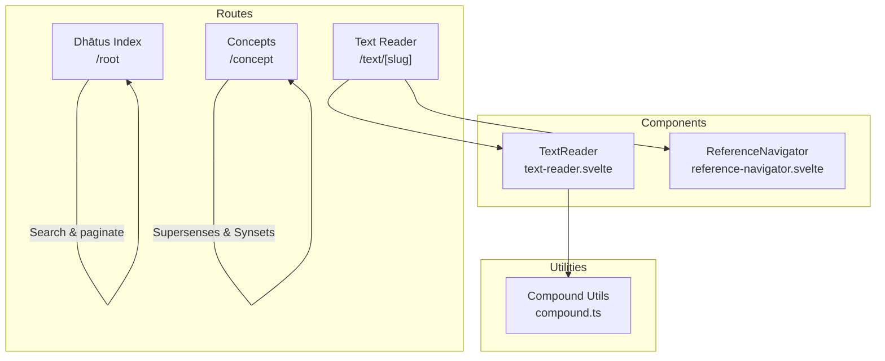
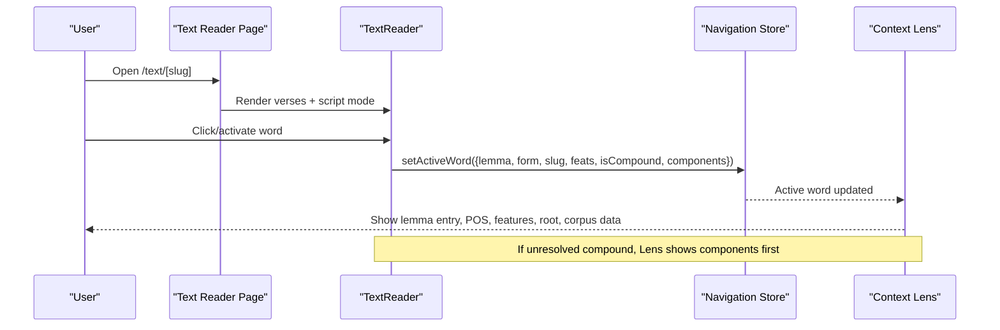
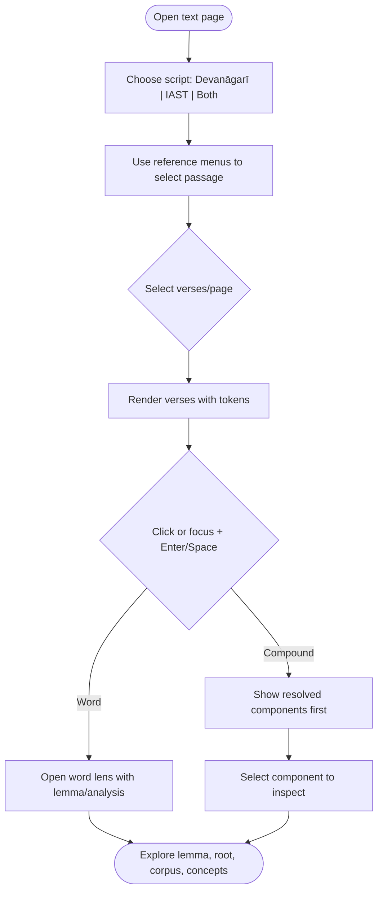
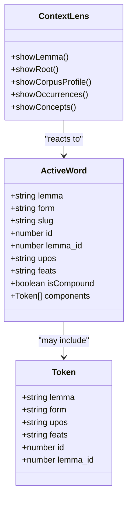
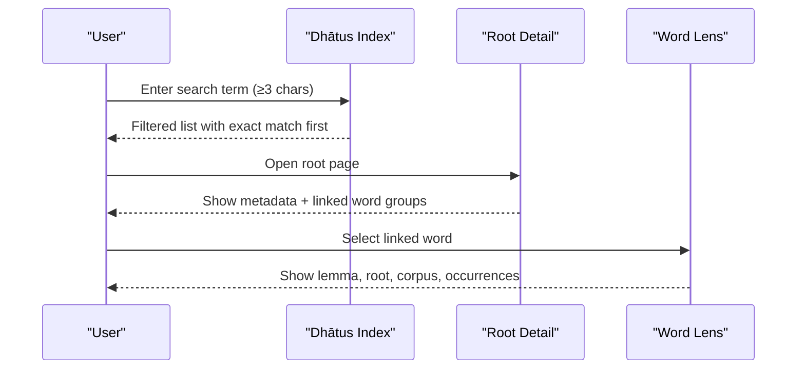
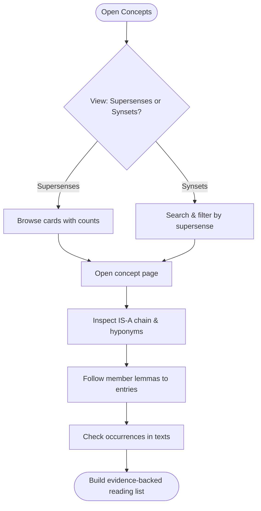
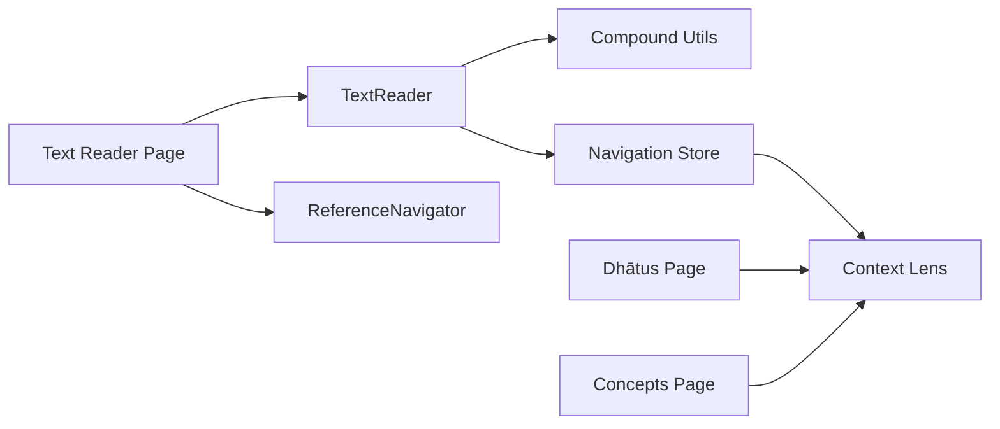

# User Guide

<cite>
**Referenced Files in This Document**
- [reading-texts.md](file://src/routes/docs/user/reading-texts.md)
- [word-lens.md](file://src/routes/docs/user/word-lens.md)
- [exploring-dhatus.md](file://src/routes/docs/user/exploring-dhatus.md)
- [exploring-concepts.md](file://src/routes/docs/user/exploring-concepts.md)
- [discovery-pathways.md](file://src/routes/docs/user/discovery-pathways.md)
- [getting-started.md](file://src/routes/docs/user/getting-started.md)
- [+page.svelte (text reader)](file://src/routes/text/[slug]/+page.svelte)
- [text-reader.svelte](file://src/lib/components/text-reader.svelte)
- [reference-navigator.svelte](file://src/lib/components/reference-navigator.svelte)
- [+page.svelte (dhātus index)](file://src/routes/root/+page.svelte)
- [+page.svelte (concepts)](file://src/routes/concept/+page.svelte)
- [compound.ts](file://src/lib/utils/compound.ts)
</cite>

## Table of Contents
1. Introduction
2. Project Structure
3. Core Components
4. Architecture Overview
5. Detailed Component Analysis
6. Dependency Analysis
7. Performance Considerations
8. Troubleshooting Guide
9. Conclusion
10. Appendices

## Introduction
This user guide explains FractalDharma’s core reading and exploration features for Sanskrit texts: the text reader with verse-by-verse navigation, multi-script display (Devanāgarī/IAST), interactive word highlighting; the word lens for grammatical analysis, compound handling, and cross-referencing; the dhātu explorer for verbal roots and word families; the concept explorer using WordNet supersenses; and discovery pathways that integrate these tools into research workflows. It also covers accessibility and responsive design considerations for mobile devices.

## Project Structure
FractalDharma is a SvelteKit application organized around routes for each major feature and reusable components for shared interactions:
- Text reader route and controls
- Dhātu index route
- Concept explorer route
- Shared components for rendering verses and navigating references
- Utilities for compound token handling

**Diagram sources**
- [+page.svelte (text reader):1-160](file://src/routes/text/[slug]/+page.svelte#L1-L160)
- [text-reader.svelte:1-175](file://src/lib/components/text-reader.svelte#L1-L175)
- [reference-navigator.svelte:1-107](file://src/lib/components/reference-navigator.svelte#L1-L107)
- [+page.svelte (dhātus index):1-151](file://src/routes/root/+page.svelte#L1-L151)
- [+page.svelte (concepts):1-102](file://src/routes/concept/+page.svelte#L1-L102)
- [compound.ts:1-46](file://src/lib/utils/compound.ts#L1-L46)

**Section sources**
- [reading-texts.md:1-39](file://src/routes/docs/user/reading-texts.md#L1-L39)
- [getting-started.md:1-36](file://src/routes/docs/user/getting-started.md#L1-L36)

## Core Components
- Text reader: Displays verses in Devanāgarī, IAST, or both; supports page navigation and reference-based jumping; highlights selected words and opens the word lens.
- Reference navigator: Hierarchical menus per text structure (e.g., maṇḍala/sūkta/ṛc); adjusts page size and scrolls to target verses.
- Word lens: Right sidebar showing lemma, form, POS, grammatical features, related root, corpus profile, occurrences, and semantic labels; handles unresolved compounds by showing components first.
- Dhātu explorer: Searchable, paginated index of verbal roots with linked word families grouped by stem, guṇa, vṛddhi, and other forms.
- Concept explorer: Semantic taxonomy based on WordNet supersenses and synsets; shows lemmas, occurrences, and texts; navigates IS-A hierarchy locally.

**Section sources**
- [reading-texts.md:1-39](file://src/routes/docs/user/reading-texts.md#L1-L39)
- [word-lens.md:1-33](file://src/routes/docs/user/word-lens.md#L1-L33)
- [exploring-dhatus.md:1-50](file://src/routes/docs/user/exploring-dhatus.md#L1-L50)
- [exploring-concepts.md:1-50](file://src/routes/docs/user/exploring-concepts.md#L1-L50)

## Architecture Overview
The reader coordinates UI state and data flow between the page, the reader component, and the navigation store. The word lens reacts to the active word and can show compound components when needed.

**Diagram sources**
- [text-reader.svelte:1-175](file://src/lib/components/text-reader.svelte#L1-L175)
- [reading-texts.md:1-39](file://src/routes/docs/user/reading-texts.md#L1-L39)
- [word-lens.md:1-33](file://src/routes/docs/user/word-lens.md#L1-L33)

## Detailed Component Analysis

### Text Reading Interface
- Script display: Choose Devanāgarī, IAST, or Both via buttons; changes presentation only.
- References and navigation: Hierarchical menus follow each work’s native structure; selecting the final level navigates to the containing page and scrolls to the passage.
- Page size: Choose 20, 50, or 100 verses per page; current size persists in the URL.
- Verse references: Use source text references rather than artificial running numbers.
- Selecting words: Click or keyboard focus + Enter/Space to open the word lens; selection remains highlighted.

**Diagram sources**
- [reading-texts.md:1-39](file://src/routes/docs/user/reading-texts.md#L1-L39)
- [text-reader.svelte:1-175](file://src/lib/components/text-reader.svelte#L1-L175)
- [reference-navigator.svelte:1-107](file://src/lib/components/reference-navigator.svelte#L1-L107)

**Section sources**
- [reading-texts.md:1-39](file://src/routes/docs/user/reading-texts.md#L1-L39)
- [+page.svelte (text reader):1-160](file://src/routes/text/[slug]/+page.svelte#L1-L160)
- [text-reader.svelte:1-175](file://src/lib/components/text-reader.svelte#L1-L175)
- [reference-navigator.svelte:1-107](file://src/lib/components/reference-navigator.svelte#L1-L107)

### Word Lens: Grammatical Analysis, Compounds, Cross-Referencing
- What you may see: Headword/lemma, surface form, POS, grammatical features, dictionary definitions, related root (with Devanāgarī, gaṇa, meaning), corpus profile, occurrences, semantic classifications, and concordance samples.
- Form vs. lemma: Distinguishes what appears in the passage from the normalized dictionary form.
- Compounds: If the parser has a breakdown, the lens displays components first; selecting one opens its independent lemma entry.
- Occurrence caution: Frequency reflects the current corpus; always return to passages before interpreting.

**Diagram sources**
- [text-reader.svelte:1-175](file://src/lib/components/text-reader.svelte#L1-L175)
- [word-lens.md:1-33](file://src/routes/docs/user/word-lens.md#L1-L33)

**Section sources**
- [word-lens.md:1-33](file://src/routes/docs/user/word-lens.md#L1-L33)
- [text-reader.svelte:1-175](file://src/lib/components/text-reader.svelte#L1-L175)

### Dhātu Explorer: Verbal Root Search and Word Families
- Find a root: Browse ordered list or search with at least three characters in IAST or Devanāgarī; exact matches are prioritized.
- Read a root record: Shows IAST and Devanāgarī, meanings, gaṇa, pada (voice), and upasargas where available.
- Explore linked words: Organized by beginning-of-word patterns (root, guṇa, vṛddhi, other); select any to open its full lemma entry in the right sidebar.
- Productive path: Search root → compare linked words → inspect lemma → follow occurrences back into texts.

**Diagram sources**
- [+page.svelte (dhātus index):1-151](file://src/routes/root/+page.svelte#L1-L151)
- [exploring-dhatus.md:1-50](file://src/routes/docs/user/exploring-dhatus.md#L1-L50)

**Section sources**
- [exploring-dhatus.md:1-50](file://src/routes/docs/user/exploring-dhatus.md#L1-L50)
- [+page.svelte (dhātus index):1-151](file://src/routes/root/+page.svelte#L1-L151)

### Concept Explorer: Semantic Mapping with WordNet Supersenses
- Supersenses view: Cards show label, description, and corpus measures (lemmas, occurrences, texts).
- Local neighborhood: IS-A chain and hyponyms help orient around a concept; navigate via nodes/pills.
- Synsets view: Finer-grained WordNet hierarchy; useful for understanding distinctions but mapping is primarily at supersense level.
- Research paths: Start from a word’s semantic label, compare mapped lemmas across genres, or generate reading lists grounded in actual passages.

**Diagram sources**
- [+page.svelte (concepts):1-102](file://src/routes/concept/+page.svelte#L1-L102)
- [exploring-concepts.md:1-50](file://src/routes/docs/user/exploring-concepts.md#L1-L50)

**Section sources**
- [exploring-concepts.md:1-50](file://src/routes/docs/user/exploring-concepts.md#L1-L50)
- [+page.svelte (concepts):1-102](file://src/routes/concept/+page.svelte#L1-L102)

### Discovery Pathways: Integrating Exploration Methods
- From a passage to a lexical family: Select a meaningful word → inspect lemma → open root → compare derived words → return to passages across texts.
- From a lemma to contexts: Open dictionary/word entry → inspect occurrences and concordance → compare morphology, neighbors, genre, doctrinal setting.
- From a text class to comparison set: Choose a class → pick few texts with different dates/genres → use same lemma/root as thread.
- From a concept to a reading list: Use concept entries as prompts → follow lemmas into passages → collect small set for comparison.
- Notable lemmas: Curated signals of distinctive vocabulary; exclude routine particles/pronouns; start points for reading.

**Section sources**
- [discovery-pathways.md:1-33](file://src/routes/docs/user/discovery-pathways.md#L1-L33)
- [getting-started.md:1-36](file://src/routes/docs/user/getting-started.md#L1-L36)

## Dependency Analysis
Key relationships among components and utilities:
- Text reader page composes TextReader and ReferenceNavigator.
- TextReader uses compound utilities to detect unresolved tokens and render components.
- Navigation store carries active word state consumed by the word lens.
- Dhātu and Concept pages provide alternative entry points into lemmas and roots.

**Diagram sources**
- [+page.svelte (text reader):1-160](file://src/routes/text/[slug]/+page.svelte#L1-L160)
- [text-reader.svelte:1-175](file://src/lib/components/text-reader.svelte#L1-L175)
- [reference-navigator.svelte:1-107](file://src/lib/components/reference-navigator.svelte#L1-L107)
- [compound.ts:1-46](file://src/lib/utils/compound.ts#L1-L46)

**Section sources**
- [text-reader.svelte:1-175](file://src/lib/components/text-reader.svelte#L1-L175)
- [reference-navigator.svelte:1-107](file://src/lib/components/reference-navigator.svelte#L1-L107)
- [compound.ts:1-46](file://src/lib/utils/compound.ts#L1-L46)

## Performance Considerations
- Pagination: Verses are split into pages (20/50/100) to keep rendering lightweight; larger pages suit continuous reading, smaller pages aid close work.
- On-demand lens content: The lens fetches lemma details on demand; ensure stale responses are ignored if the active word changes.
- Compound detection: Unresolved compounds are identified quickly; component extraction uses token IDs and ranges.
- Mobile rendering: Mobile-specific lens visibility reduces layout overhead on small screens.

[No sources needed since this section provides general guidance]

## Troubleshooting Guide
- No grammatical data: Some tokens lack analysis; tooltips indicate “No grammatical data available.”
- Missing fields in root records: Blank fields mean not supplied in the source record, not absence of class/voice historically.
- Partial semantic mapping: Not every lemma has a semantic label; mappings are broad and may be ambiguous.
- Occurrence interpretation: Frequencies reflect the current corpus; rare lemmas may be significant or underrepresented. Always verify in context.

**Section sources**
- [text-reader.svelte:1-175](file://src/lib/components/text-reader.svelte#L1-L175)
- [exploring-dhatus.md:1-50](file://src/routes/docs/user/exploring-dhatus.md#L1-L50)
- [exploring-concepts.md:1-50](file://src/routes/docs/user/exploring-concepts.md#L1-L50)
- [word-lens.md:1-33](file://src/routes/docs/user/word-lens.md#L1-L33)

## Conclusion
FractalDharma integrates reading, lexical analysis, and semantic exploration into a cohesive workflow. Use the text reader for close study, the word lens for deep dives into grammar and corpus data, the dhātu explorer for verbal families, and the concept explorer for semantic comparisons. Combine these pathways around concrete research questions to build robust, passage-grounded interpretations.

[No sources needed since this section summarizes without analyzing specific files]

## Appendices

### Accessibility and Keyboard Navigation
- Word activation: Click or focus + Enter/Space to open the word lens.
- ARIA roles: Words have role="button" and tabindex="0"; menus and controls expose aria-labels and aria-pressed states.
- Screen reader-friendly labels: Reference menus and pagination convey purpose and state.

**Section sources**
- [text-reader.svelte:1-175](file://src/lib/components/text-reader.svelte#L1-L175)
- [reference-navigator.svelte:1-107](file://src/lib/components/reference-navigator.svelte#L1-L107)
- [reading-texts.md:1-39](file://src/routes/docs/user/reading-texts.md#L1-L39)

### Responsive Design for Mobile
- Mobile lens: On narrow screens, the word lens appears inline below the selected verse for easier access.
- Viewport detection: The reader adapts behavior based on viewport width.

**Section sources**
- [text-reader.svelte:1-175](file://src/lib/components/text-reader.svelte#L1-L175)

### Practical Examples and Research Workflows
- Example pathway: Start in a text → select a key term → open its lemma → check the root → explore linked words → compare occurrences across texts → return to passages to validate hypotheses.
- Concept-driven pathway: Begin with a supersense like State or Communication → choose several lemmas → compare concordance contexts across genres → compile a curated reading list.

**Section sources**
- [discovery-pathways.md:1-33](file://src/routes/docs/user/discovery-pathways.md#L1-L33)
- [exploring-concepts.md:1-50](file://src/routes/docs/user/exploring-concepts.md#L1-L50)
- [getting-started.md:1-36](file://src/routes/docs/user/getting-started.md#L1-L36)