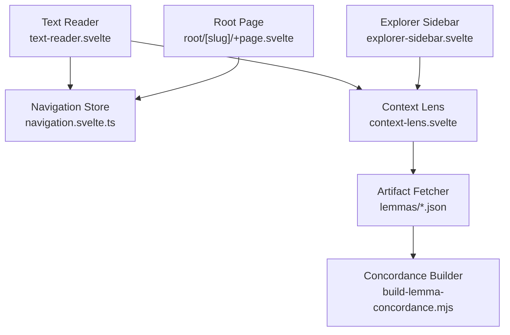
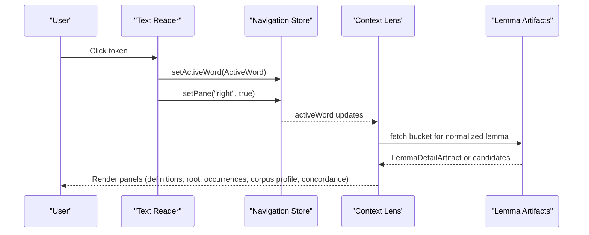
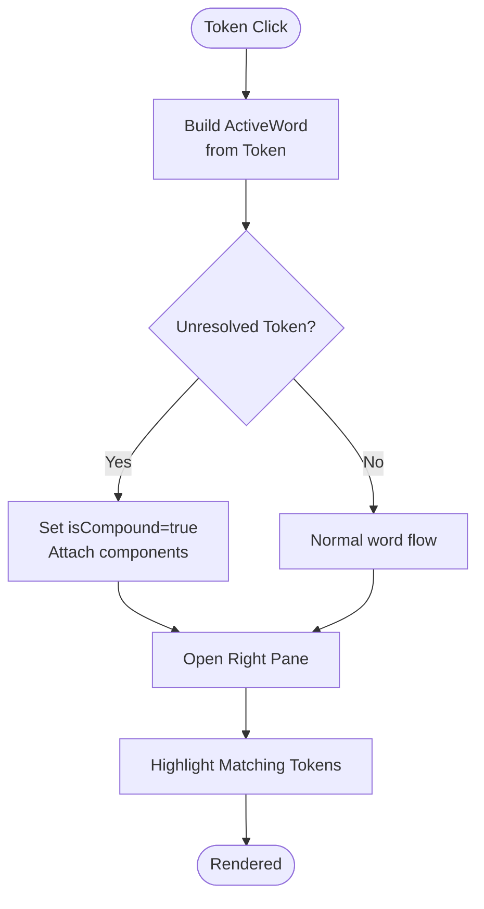
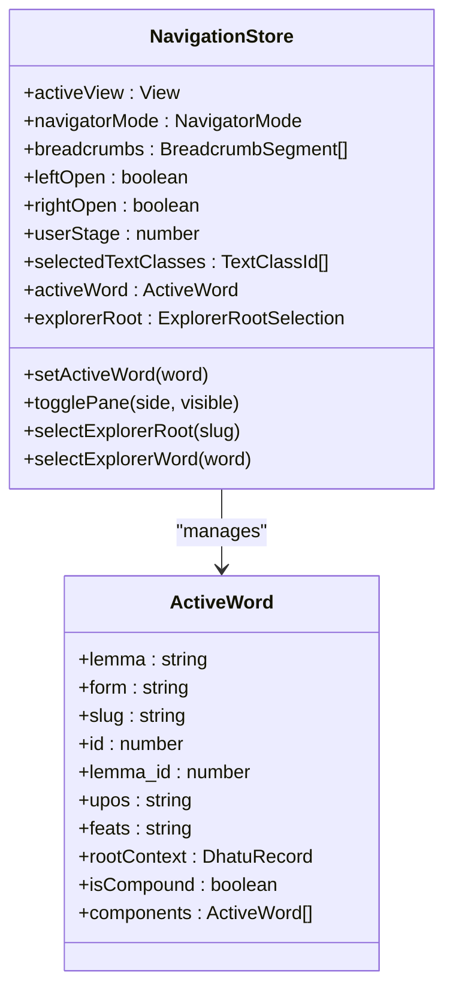
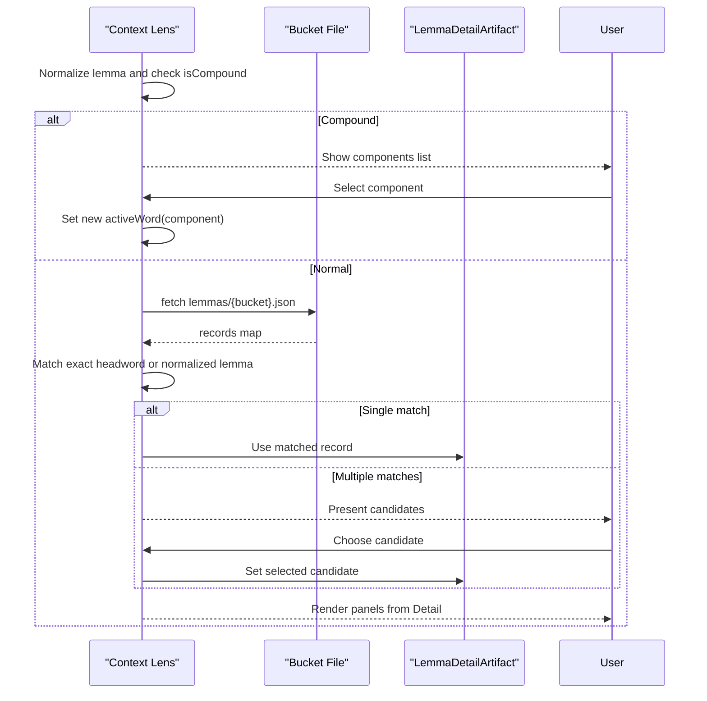
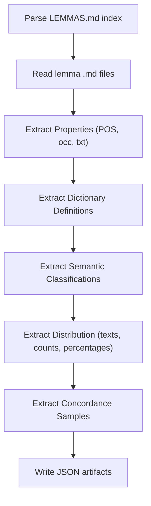
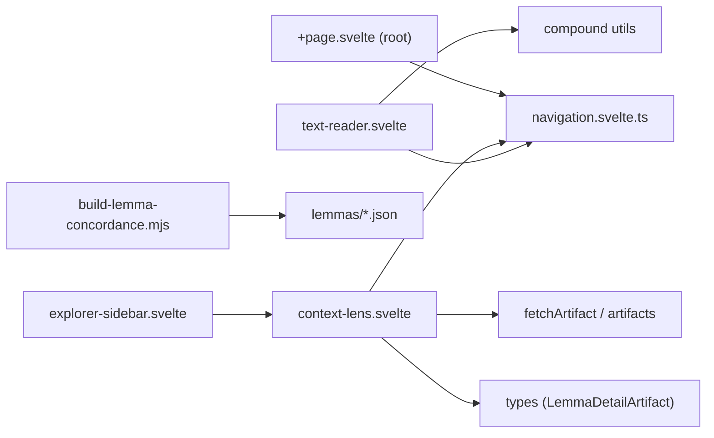

# Word Lens Interface

<cite>
**Referenced Files in This Document**
- [context-lens.svelte](file://src/lib/components/context-lens.svelte)
- [text-reader.svelte](file://src/lib/components/text-reader.svelte)
- [navigation.svelte.ts](file://src/lib/stores/navigation.svelte.ts)
- [reader-and-lens.md](file://src/routes/docs/developer/reader-and-lens.md)
- [word-lens.md](file://src/routes/docs/user/word-lens.md)
- [build-lemma-concordance.mjs](file://scripts/build-lemma-concordance.mjs)
- [explorer-sidebar.svelte](file://src/lib/components/explorer-sidebar.svelte)
- [+page.svelte (root dhātu)](file://src/routes/root/[slug]/+page.svelte)
</cite>

## Table of Contents
1. Introduction
2. Project Structure
3. Core Components
4. Architecture Overview
5. Detailed Component Analysis
6. Dependency Analysis
7. Performance Considerations
8. Troubleshooting Guide
9. Conclusion
10. Appendices

## Introduction
The Word Lens is the right-side analytical panel that appears when you select a word in the text reader. It transforms any token into an entry point for lexical, grammatical, and corpus-wide exploration. Depending on available data, it can show:
- Headword (lemma) and surface form
- Part of speech and grammatical features
- Dictionary definitions and short lexicon preview
- Root (dhātu) information with gaṇa and pada
- Occurrences across texts and links to those texts
- Corpus profile: frequency, part of speech, distribution
- Semantic classifications and sample concordance contexts

It also supports compound words by showing constituent parts and allowing you to drill into each component’s independent lemma entry.

## Project Structure
The Word Lens is implemented as a Svelte component integrated with the text reader and navigation store. The key files are:
- Text Reader: renders verses and emits selected tokens as ActiveWord objects
- Navigation Store: holds the active word and pane state
- Context Lens: displays the full analysis based on the active word
- Concordance Builder: builds corpus artifacts consumed by the lens

**Diagram sources**
- [text-reader.svelte:1-175](file://src/lib/components/text-reader.svelte#L1-L175)
- [navigation.svelte.ts:1-160](file://src/lib/stores/navigation.svelte.ts#L1-L160)
- [context-lens.svelte:1-234](file://src/lib/components/context-lens.svelte#L1-L234)
- [build-lemma-concordance.mjs:197-270](file://scripts/build-lemma-concordance.mjs#L197-L270)
- [explorer-sidebar.svelte:43-68](file://src/lib/components/explorer-sidebar.svelte#L43-L68)
- [+page.svelte (root dhātu):35-64](file://src/routes/root/[slug]/+page.svelte#L35-L64)

**Section sources**
- [text-reader.svelte:1-175](file://src/lib/components/text-reader.svelte#L1-L175)
- [navigation.svelte.ts:1-160](file://src/lib/stores/navigation.svelte.ts#L1-L160)
- [context-lens.svelte:1-234](file://src/lib/components/context-lens.svelte#L1-L234)
- [build-lemma-concordance.mjs:197-270](file://scripts/build-lemma-concordance.mjs#L197-L270)

## Core Components
- Text Reader: Converts tokens to ActiveWord objects, handles compound detection, highlights matches, and opens the right pane.
- Navigation Store: Centralizes active word selection, pane visibility, and cross-page context.
- Context Lens: Renders sections for dictionary, root, occurrences, corpus profile, semantic classification, distribution, and concordance samples.
- Concordance Builder: Generates JSON artifacts from lemma entries used by the lens.

Key responsibilities:
- Reader emits ActiveWord with lemma, form, UPOS, feats, and optional components for compounds.
- Lens fetches lemma detail artifacts by bucketed JSON and resolves multiple candidates if needed.
- Lens displays grammar, etymology, and corpus statistics; provides links to lemmas, roots, concepts, and texts.

**Section sources**
- [text-reader.svelte:51-74](file://src/lib/components/text-reader.svelte#L51-L74)
- [navigation.svelte.ts:24-35](file://src/lib/stores/navigation.svelte.ts#L24-L35)
- [context-lens.svelte:32-71](file://src/lib/components/context-lens.svelte#L32-L71)
- [build-lemma-concordance.mjs:237-256](file://scripts/build-lemma-concordance.mjs#L237-L256)

## Architecture Overview
The Word Lens follows a reactive pipeline:
1. User selects a token in the reader.
2. Reader sets the active word and opens the right pane.
3. Lens reacts to the active word and loads lemma details from artifact buckets.
4. Lens composes panels from available data and exposes cross-links.

**Diagram sources**
- [text-reader.svelte:65-74](file://src/lib/components/text-reader.svelte#L65-L74)
- [navigation.svelte.ts:114-126](file://src/lib/stores/navigation.svelte.ts#L114-L126)
- [context-lens.svelte:46-71](file://src/lib/components/context-lens.svelte#L46-L71)
- [build-lemma-concordance.mjs:237-256](file://scripts/build-lemma-concordance.mjs#L237-L256)

## Detailed Component Analysis

### Text Reader: Word Selection and Compound Handling
- Converts tokens to ActiveWord including lemma, form, slug, UPOS, feats, and optional components.
- Detects unresolved tokens as compounds and attaches component tokens.
- Highlights matching tokens and manages mobile display of the lens inline.

**Diagram sources**
- [text-reader.svelte:51-74](file://src/lib/components/text-reader.svelte#L51-L74)
- [text-reader.svelte:76-81](file://src/lib/components/text-reader.svelte#L76-L81)

**Section sources**
- [text-reader.svelte:51-74](file://src/lib/components/text-reader.svelte#L51-L74)
- [reader-and-lens.md:32-39](file://src/routes/docs/developer/reader-and-lens.md#L32-L39)

### Navigation Store: State and Cross-Page Context
- Holds activeView, panes, breadcrumbs, and activeWord.
- Provides methods to set active word, toggle panes, and manage explorer selections.
- Ensures consistent behavior across text, root, and explorer views.

**Diagram sources**
- [navigation.svelte.ts:24-35](file://src/lib/stores/navigation.svelte.ts#L24-L35)
- [navigation.svelte.ts:114-126](file://src/lib/stores/navigation.svelte.ts#L114-L126)

**Section sources**
- [navigation.svelte.ts:1-160](file://src/lib/stores/navigation.svelte.ts#L1-L160)

### Context Lens: Panels, Data Flow, and Cross-References
- Reacts to activeWord and normalizes lemma for artifact lookup.
- Handles compound breakdown first; otherwise loads lemma detail.
- Displays:
  - Dictionary Definitions
  - Root (dhātu) info with gaṇa and pada labels
  - Occurrences across texts
  - Lexicon Preview
  - Corpus Profile (POS, total occurrences, texts appeared in)
  - Semantic Classification (links to concept pages)
  - Top Texts by Occurrence (distribution)
  - Concordance Sample (surface form and context)
- Supports candidate resolution when multiple lemmas match.

**Diagram sources**
- [context-lens.svelte:32-71](file://src/lib/components/context-lens.svelte#L32-L71)
- [context-lens.svelte:146-158](file://src/lib/components/context-lens.svelte#L146-L158)

**Section sources**
- [context-lens.svelte:1-234](file://src/lib/components/context-lens.svelte#L1-L234)
- [word-lens.md:1-33](file://src/routes/docs/user/word-lens.md#L1-L33)

### Concordance Builder: Artifact Generation
- Parses lemma markdown files to extract properties, definitions, semantics, distribution, and concordance.
- Produces JSON artifacts keyed by normalized lemma names.
- Supplies fields consumed by the lens: POS, occurrences, texts, definitions, semantics, distribution, and concordance samples.

**Diagram sources**
- [build-lemma-concordance.mjs:197-270](file://scripts/build-lemma-concordance.mjs#L197-L270)

**Section sources**
- [build-lemma-concordance.mjs:197-270](file://scripts/build-lemma-concordance.mjs#L197-L270)

### Explorer Integration and Root Pages
- Explorer sidebar shows the Context Lens when a word is selected.
- Root page displays dhātu metadata and related words; selecting a word activates the lens.

**Section sources**
- [explorer-sidebar.svelte:43-68](file://src/lib/components/explorer-sidebar.svelte#L43-L68)
- [+page.svelte (root dhātu):35-64](file://src/routes/root/[slug]/+page.svelte#L35-L64)

## Dependency Analysis
- Text Reader depends on navigation store and utility functions for compound handling.
- Context Lens depends on navigation store, artifact fetching utilities, and types for lemma details.
- Concordance Builder produces static artifacts consumed at runtime by the lens.
- Explorer and root pages integrate with navigation store to coordinate active selections.

**Diagram sources**
- [text-reader.svelte:1-175](file://src/lib/components/text-reader.svelte#L1-L175)
- [context-lens.svelte:1-234](file://src/lib/components/context-lens.svelte#L1-L234)
- [navigation.svelte.ts:1-160](file://src/lib/stores/navigation.svelte.ts#L1-L160)
- [build-lemma-concordance.mjs:197-270](file://scripts/build-lemma-concordance.mjs#L197-L270)
- [explorer-sidebar.svelte:43-68](file://src/lib/components/explorer-sidebar.svelte#L43-L68)
- [+page.svelte (root dhātu):35-64](file://src/routes/root/[slug]/+page.svelte#L35-L64)

**Section sources**
- [text-reader.svelte:1-175](file://src/lib/components/text-reader.svelte#L1-L175)
- [context-lens.svelte:1-234](file://src/lib/components/context-lens.svelte#L1-L234)
- [navigation.svelte.ts:1-160](file://src/lib/stores/navigation.svelte.ts#L1-L160)
- [build-lemma-concordance.mjs:197-270](file://scripts/build-lemma-concordance.mjs#L197-L270)

## Performance Considerations
- Lazy loading: Lemma details are fetched on demand per active word; stale responses are ignored if the active word changes.
- Bucketing: Lemmas are split into JSON buckets to reduce payload size and improve load times.
- Candidate resolution: When multiple lemmas match, users choose one to avoid unnecessary processing.
- Mobile rendering: Inline lens only shown for the selected verse on small screens to limit DOM overhead.

[No sources needed since this section provides general guidance]

## Troubleshooting Guide
- No linked lexical record: If no lemma detail is found, the lens indicates absence rather than guessing. Check normalization and bucket availability.
- Multiple candidates: When more than one dictionary entry matches, present candidates and let the user select the intended one.
- Stale responses: Ensure late artifact responses are discarded if the active word has changed.
- Compound analysis unavailable: If component analysis is missing, inform the user instead of inferring.

**Section sources**
- [context-lens.svelte:146-158](file://src/lib/components/context-lens.svelte#L146-L158)
- [context-lens.svelte:156-158](file://src/lib/components/context-lens.svelte#L156-L158)
- [reader-and-lens.md:32-39](file://src/routes/docs/developer/reader-and-lens.md#L32-L39)

## Conclusion
The Word Lens integrates tightly with the text reader and navigation store to provide a responsive, data-driven interface for Sanskrit word analysis. It balances rich linguistic information with pragmatic UX patterns like lazy loading, candidate resolution, and clear messaging when data is missing. By following the documented flows and conventions, developers can extend panels, add new cross-references, and adapt the lens to additional word types and contexts.

[No sources needed since this section summarizes without analyzing specific files]

## Appendices

### Interpreting Sanskrit Grammatical Terminology in the Lens
- Form vs Lemma: The surface form is what appears in the passage; the lemma is the normalized dictionary form used to group inflected variants.
- UPOS Labels: Universal POS tags are mapped to readable labels (e.g., VERB → verb).
- Feature Strings: CoNLL-U style feature strings are parsed into key-value pairs (e.g., Case=Nom, Gender=Masc, Number=Sg).
- Pada Labels: Verbal action classes are labeled as Parasmaipada, Ātmanepada, or Ubhayapada.
- Root Metadata: Gaṇa and pada indicate traditional verbal class and inflectional designation; meanings may be provided in multiple languages.

**Section sources**
- [word-lens.md:22-28](file://src/routes/docs/user/word-lens.md#L22-L28)
- [context-lens.svelte:79-96](file://src/lib/components/context-lens.svelte#L79-L96)
- [glossary.md:20-50](file://src/routes/docs/user/glossary.md#L20-L50)

### Customization Options and Adaptation
- Panel visibility: Sections render conditionally based on available data (definitions, root, occurrences, corpus profile, semantics, distribution, concordance).
- Styling primitives: Shared classes (.box, .row, .grid, tag-pill) ensure consistency; add component-specific styles only when necessary.
- Cross-references: Links to lemmas, roots, concepts, and texts are generated from artifact data; maintain stable slugs and identifiers.

**Section sources**
- [reader-and-lens.md:41-44](file://src/routes/docs/developer/reader-and-lens.md#L41-L44)
- [context-lens.svelte:159-228](file://src/lib/components/context-lens.svelte#L159-L228)