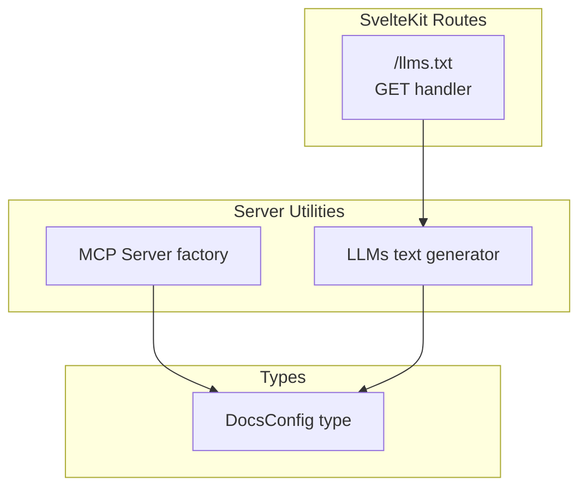
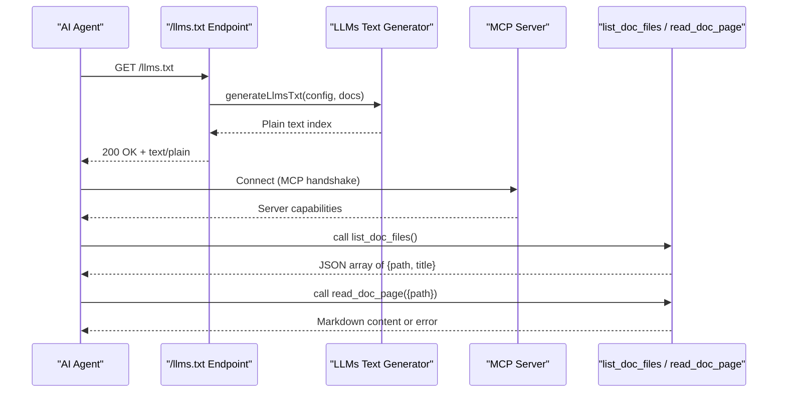
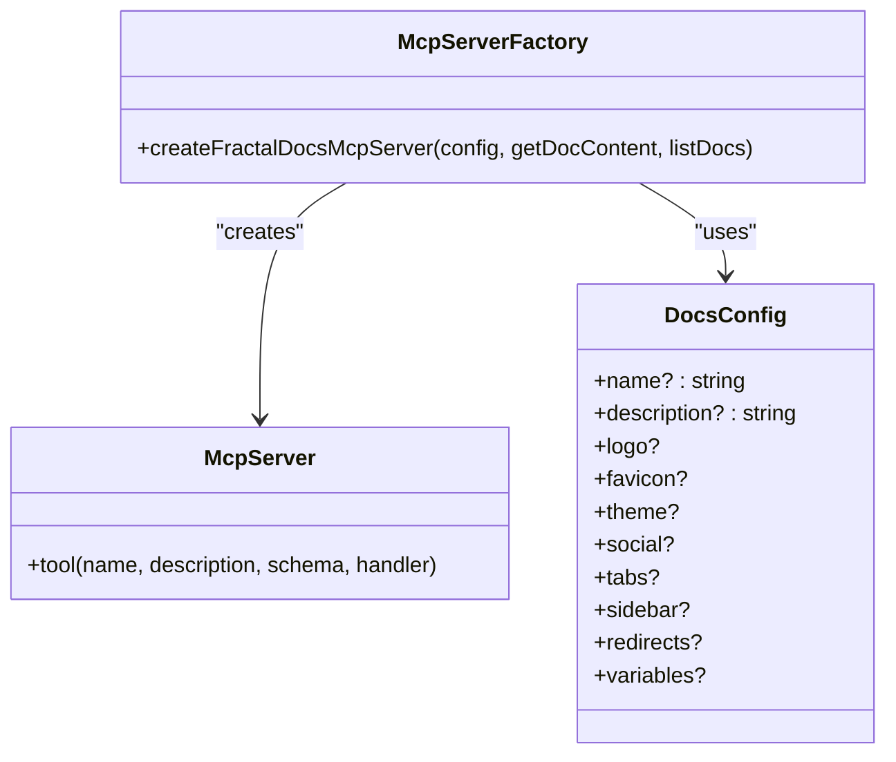
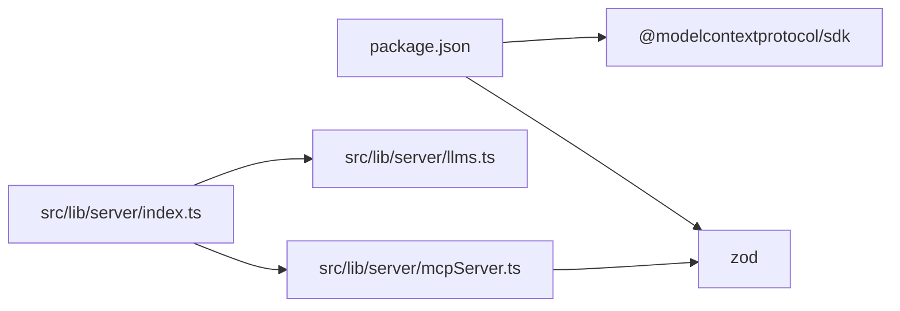
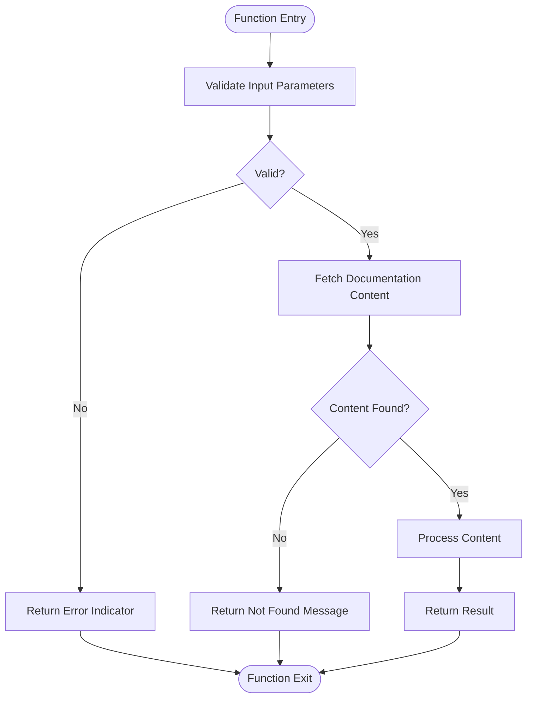

# AI Agent Integration

<cite>
**Referenced Files in This Document**
- [package.json](file://package.json)
- [src/routes/llms.txt/+server.ts](file://src/routes/llms.txt/+server.ts)
- [src/lib/server/llms.ts](file://src/lib/server/llms.ts)
- [src/lib/server/mcpServer.ts](file://src/lib/server/mcpServer.ts)
- [src/lib/types/docs.ts](file://src/lib/types/docs.ts)
- [src/lib/server/index.ts](file://src/lib/server/index.ts)
- [src/routes/[owner]/[repo]/[...path]/+page.server.ts](file://src/routes/[owner]/[repo]/[...path]/+page.server.ts)
- [src/lib/components/AskAiModal.svelte](file://src/lib/components/AskAiModal.svelte)
</cite>

## Table of Contents
1. [Introduction](#introduction)
2. [Project Structure](#project-structure)
3. [Core Components](#core-components)
4. [Architecture Overview](#architecture-overview)
5. [Detailed Component Analysis](#detailed-component-analysis)
6. [Dependency Analysis](#dependency-analysis)
7. [Performance Considerations](#performance-considerations)
8. [Troubleshooting Guide](#troubleshooting-guide)
9. [Conclusion](#conclusion)
10. [Appendices](#appendices)

## Introduction
This document explains how FractalDocs exposes machine-readable documentation endpoints for AI agents, focusing on the /llms.txt endpoint and the Model Context Protocol (MCP) server implementation. It details the structured data formats designed for AI consumption, how agents can discover and parse content, and provides practical guidance for integrating with popular AI frameworks. Security considerations, rate limiting strategies, and monitoring approaches are also covered to ensure robust, production-ready integrations.

## Project Structure
FractalDocs is a SvelteKit application that includes:
- A dedicated /llms.txt route that returns a plain-text index of available documentation pages.
- An MCP server module that exposes tools for listing documents and reading page content via the Model Context Protocol.
- Shared types for configuration and rendering results.
- Example usage within the UI to fetch /llms.txt context for an in-app AI assistant modal.

**Diagram sources**
- [src/routes/llms.txt/+server.ts:1-18](file://src/routes/llms.txt/+server.ts#L1-L18)
- [src/lib/server/llms.ts:1-27](file://src/lib/server/llms.ts#L1-L27)
- [src/lib/server/mcpServer.ts:1-53](file://src/lib/server/mcpServer.ts#L1-L53)
- [src/lib/types/docs.ts:53-74](file://src/lib/types/docs.ts#L53-L74)

**Section sources**
- [src/routes/llms.txt/+server.ts:1-18](file://src/routes/llms.txt/+server.ts#L1-L18)
- [src/lib/server/llms.ts:1-27](file://src/lib/server/llms.ts#L1-L27)
- [src/lib/server/mcpServer.ts:1-53](file://src/lib/server/mcpServer.ts#L1-L53)
- [src/lib/types/docs.ts:53-74](file://src/lib/types/docs.ts#L53-L74)

## Core Components
- /llms.txt endpoint: Returns a plain-text index of documentation pages with titles and optional summaries.
- LLMS text generator: Builds the structured plain-text output from configuration and a list of docs.
- MCP server factory: Creates an MCP server exposing two tools:
  - list_doc_files: Lists all available documentation pages.
  - read_doc_page: Reads markdown content by path.
- DocsConfig type: Defines metadata used across components, including name and description.

Key responsibilities:
- Provide a lightweight, machine-readable index for discovery (/llms.txt).
- Offer programmatic access via MCP for richer interactions (listing and reading content).
- Keep configuration consistent across endpoints and UI features.

**Section sources**
- [src/routes/llms.txt/+server.ts:1-18](file://src/routes/llms.txt/+server.ts#L1-L18)
- [src/lib/server/llms.ts:1-27](file://src/lib/server/llms.ts#L1-L27)
- [src/lib/server/mcpServer.ts:1-53](file://src/lib/server/mcpServer.ts#L1-L53)
- [src/lib/types/docs.ts:53-74](file://src/lib/types/docs.ts#L53-L74)

## Architecture Overview
The system exposes two primary integration points for AI agents:
- HTTP endpoint /llms.txt for simple discovery and indexing.
- MCP server for tool-based access to list and read documentation content.

**Diagram sources**
- [src/routes/llms.txt/+server.ts:1-18](file://src/routes/llms.txt/+server.ts#L1-L18)
- [src/lib/server/llms.ts:1-27](file://src/lib/server/llms.ts#L1-L27)
- [src/lib/server/mcpServer.ts:1-53](file://src/lib/server/mcpServer.ts#L1-L53)

## Detailed Component Analysis

### /llms.txt Endpoint
Purpose:
- Provides a stable, machine-readable index of documentation pages.
- Uses a simple, predictable format suitable for parsers and AI agents.

Implementation highlights:
- The GET handler constructs the response using the LLMS text generator.
- Response headers specify text/plain; charset=utf-8 for broad compatibility.

Usage pattern:
- Agents can fetch this endpoint to build indexes, cache manifests, or drive navigation flows.

**Section sources**
- [src/routes/llms.txt/+server.ts:1-18](file://src/routes/llms.txt/+server.ts#L1-L18)

#### Data Format Specification
- Output is plain text with a header section containing project name and description.
- Followed by a bulleted list of links with titles and optional summaries.
- Designed for easy parsing by regex or line-based processors.

Example structure (described):
- Title line with project name.
- Description line prefixed with “>”.
- Section heading for available pages.
- One bullet per page: “[Title](Path)” optionally followed by “: Summary”.

**Section sources**
- [src/lib/server/llms.ts:1-27](file://src/lib/server/llms.ts#L1-L27)

### LLMS Text Generator
Responsibilities:
- Build the /llms.txt index from configuration and a list of docs.
- Support both index-only and full corpus generation functions.

Key behaviors:
- Defaults for name and description when not provided.
- Iterates over docs to append entries with optional summaries.
- Full corpus variant concatenates complete markdown content separated by delimiters.

Complexity:
- Time complexity O(n) where n is number of docs.
- Space proportional to total output size.

Optimization opportunities:
- Stream large outputs if needed.
- Cache generated responses based on config and doc list hash.

**Section sources**
- [src/lib/server/llms.ts:1-27](file://src/lib/server/llms.ts#L1-L27)

### MCP Server Implementation
Purpose:
- Exposes tools for AI agents to list and read documentation programmatically via the Model Context Protocol.

Tools exposed:
- list_doc_files: Returns a JSON array of objects with path and title.
- read_doc_page: Accepts a path parameter and returns markdown content or an error indicator.

Validation:
- Uses Zod schema to validate input parameters for read_doc_page.

Error handling:
- Returns isError flag and descriptive message when a page is not found.

Integration:
- Factory function accepts a DocsConfig and callbacks for fetching content and listing docs.

**Diagram sources**
- [src/lib/server/mcpServer.ts:1-53](file://src/lib/server/mcpServer.ts#L1-L53)
- [src/lib/types/docs.ts:53-74](file://src/lib/types/docs.ts#L53-L74)

**Section sources**
- [src/lib/server/mcpServer.ts:1-53](file://src/lib/server/mcpServer.ts#L1-L53)
- [src/lib/types/docs.ts:53-74](file://src/lib/types/docs.ts#L53-L74)

### Configuration Types
DocsConfig defines metadata used across endpoints and UI:
- name and description are critical for generating human- and machine-friendly headers.
- Additional fields support branding, navigation, and variables.

Usage:
- Passed into LLMS generator and MCP server factory to ensure consistent identity and behavior.

**Section sources**
- [src/lib/types/docs.ts:53-74](file://src/lib/types/docs.ts#L53-L74)

### In-App AI Assistant Usage
The AskAiModal component demonstrates how the frontend consumes /llms.txt:
- Fetches the endpoint to obtain documentation context.
- Uses the fetched context to synthesize answers (simulated here).

Operational notes:
- Handles loading states and errors gracefully.
- Demonstrates a simple client-side flow for agent-like interactions.

**Section sources**
- [src/lib/components/AskAiModal.svelte:1-52](file://src/lib/components/AskAiModal.svelte#L1-L52)

## Dependency Analysis
External dependencies relevant to AI agent integration:
- @modelcontextprotocol/sdk: Provides the MCP server implementation and client protocol.
- zod: Used for input validation in MCP tools.

Internal modules:
- src/lib/server/index.ts re-exports llms and mcpServer utilities for convenient imports.

**Diagram sources**
- [package.json:12-30](file://package.json#L12-L30)
- [src/lib/server/index.ts:1-3](file://src/lib/server/index.ts#L1-L3)
- [src/lib/server/mcpServer.ts:1-53](file://src/lib/server/mcpServer.ts#L1-L53)

**Section sources**
- [package.json:12-30](file://package.json#L12-L30)
- [src/lib/server/index.ts:1-3](file://src/lib/server/index.ts#L1-L3)

## Performance Considerations
- Caching: Cache /llms.txt responses and MCP tool results based on content hashes to reduce repeated computation.
- Streaming: For full corpus generation, stream responses to avoid memory spikes.
- Concurrency: Use connection pooling and request deduplication for high-throughput scenarios.
- Compression: Enable gzip/br compression at the edge or reverse proxy layer.
- Pagination: Consider paginating large lists or chunking full corpus outputs.

[No sources needed since this section provides general guidance]

## Troubleshooting Guide
Common issues and resolutions:
- /llms.txt returns empty or incorrect content:
  - Ensure the docs list passed to the generator is accurate and up-to-date.
  - Verify Content-Type header is set to text/plain; charset=utf-8.
- MCP tool errors:
  - Validate path inputs using the provided schema.
  - Check getDocContent callback returns null for missing pages and handles errors consistently.
- Network failures in UI:
  - Handle fetch errors and display fallback messages.
  - Implement retries with exponential backoff for transient failures.

**Section sources**
- [src/routes/llms.txt/+server.ts:1-18](file://src/routes/llms.txt/+server.ts#L1-L18)
- [src/lib/server/mcpServer.ts:1-53](file://src/lib/server/mcpServer.ts#L1-L53)
- [src/lib/components/AskAiModal.svelte:1-52](file://src/lib/components/AskAiModal.svelte#L1-L52)

## Conclusion
FractalDocs provides robust, machine-readable endpoints tailored for AI agents:
- /llms.txt offers a simple, reliable index for discovery and caching.
- The MCP server enables rich, tool-based interactions for listing and reading documentation content.
- Structured formats and clear schemas facilitate parsing and integration with diverse AI frameworks.
Adopting the recommended security, rate limiting, and monitoring practices ensures scalable and secure AI-driven documentation access.

[No sources needed since this section summarizes without analyzing specific files]

## Appendices

### Integrating with AI Agents
- Discovery:
  - Fetch /llms.txt to build an index of available pages.
  - Parse lines to extract titles, paths, and summaries.
- Programmatic Access:
  - Connect to the MCP server and call list_doc_files to enumerate pages.
  - Use read_doc_page with validated paths to retrieve markdown content.
- Parsing:
  - Use regex or line-based parsers for /llms.txt.
  - Parse JSON responses from MCP tools for structured data.

[No sources needed since this section provides general guidance]

### Configuring MCP Servers
- Instantiate the MCP server factory with:
  - DocsConfig for identity and metadata.
  - getDocContent callback to resolve markdown by path.
  - listDocs callback to return available pages.
- Expose tools:
  - list_doc_files for enumeration.
  - read_doc_page for content retrieval.
- Validate inputs using Zod schemas to prevent malformed requests.

**Section sources**
- [src/lib/server/mcpServer.ts:1-53](file://src/lib/server/mcpServer.ts#L1-L53)

### Optimizing Content for AI Consumption
- Keep titles concise and descriptive.
- Include meaningful summaries in /llms.txt entries.
- Organize content with clear headings and sections.
- Avoid heavy HTML or scripts in markdown to simplify parsing.
- Provide consistent path conventions for reliable addressing.

[No sources needed since this section provides general guidance]

### Security Considerations
- Input Validation:
  - Enforce strict schemas for MCP tool parameters.
  - Sanitize user-provided paths to prevent traversal attacks.
- Authentication and Authorization:
  - Gate sensitive endpoints behind authentication if required.
  - Apply role-based access controls for private documentation.
- Rate Limiting:
  - Implement per-client rate limits at the edge or API gateway.
  - Use token bucket or sliding window algorithms.
- Monitoring:
  - Log endpoint usage, errors, and latency metrics.
  - Alert on abnormal traffic patterns or error spikes.

[No sources needed since this section provides general guidance]

### Compatibility with Popular AI Frameworks
- MCP-compatible clients:
  - Use official MCP SDKs to connect and call tools.
- HTTP-based agents:
  - Fetch /llms.txt and parse responses directly.
- Custom pipelines:
  - Integrate parsed content into RAG pipelines or vector stores.

[No sources needed since this section provides general guidance]

### Practical Examples
- Building an index:
  - Fetch /llms.txt, parse bullets, store in a local index.
- Reading content:
  - Call read_doc_page with a validated path and process markdown.
- Caching strategy:
  - Cache /llms.txt and MCP tool results with TTLs based on content changes.

[No sources needed since this section provides general guidance]

### Error Handling Flow

**Diagram sources**
- [src/lib/server/mcpServer.ts:1-53](file://src/lib/server/mcpServer.ts#L1-L53)

### Configuration Loading
Documentation configuration is loaded dynamically from remote repositories:
- Attempts to fetch docs.json from main/master branches.
- Falls back to default configuration if unavailable.

**Section sources**
- [src/routes/[owner]/[repo]/[...path]/+page.server.ts:1-34](file://src/routes/[owner]/[repo]/[...path]/+page.server.ts#L1-L34)