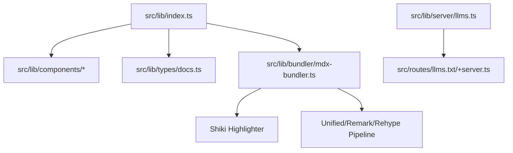
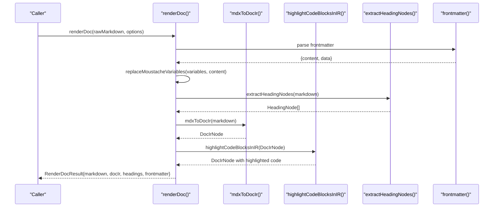
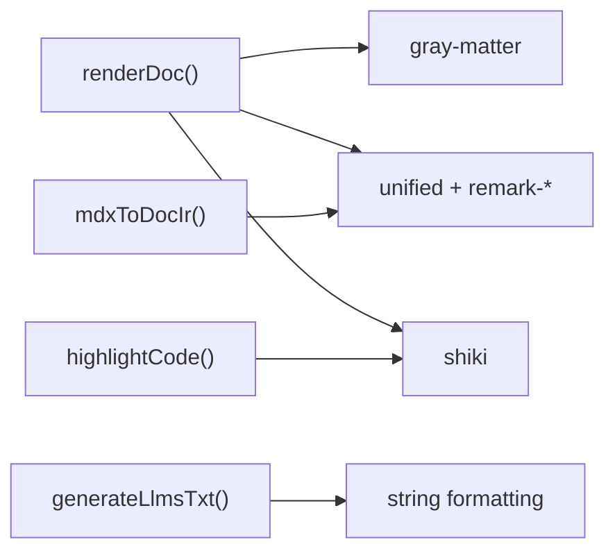

# API Reference

<cite>
**Referenced Files in This Document**
- [src/lib/index.ts](file://src/lib/index.ts)
- [src/lib/bundler/mdx-bundler.ts](file://src/lib/bundler/mdx-bundler.ts)
- [src/lib/types/docs.ts](file://src/lib/types/docs.ts)
- [src/lib/server/llms.ts](file://src/lib/server/llms.ts)
- [src/routes/llms.txt/+server.ts](file://src/routes/llms.txt/+server.ts)
</cite>

## Table of Contents
1. [Introduction](#introduction)
2. [Project Structure](#project-structure)
3. [Core Components](#core-components)
4. [Architecture Overview](#architecture-overview)
5. [Detailed Component Analysis](#detailed-component-analysis)
6. [Dependency Analysis](#dependency-analysis)
7. [Performance Considerations](#performance-considerations)
8. [Troubleshooting Guide](#troubleshooting-guide)
9. [Conclusion](#conclusion)
10. [Appendices](#appendices)

## Introduction
This document provides a comprehensive API reference for FractalDocs focused on public interfaces and programmatic access points. It covers the following core functions:
- renderDoc(): Renders Markdown/MDX into an intermediate representation (DocIr), extracts headings, and returns frontmatter.
- mdxToDocIr(): Converts MDX source to DocIr without syntax highlighting.
- highlightCode(): Syntax highlights code blocks using Shiki with support for language aliases and metadata.
- generateLlmsTxt(): Generates AI agent-friendly documentation index text from configuration and page listings.

Each function includes parameter specifications, return types, error handling behavior, usage examples, and integration patterns. TypeScript type definitions are included for precise typing and validation guidance.

## Project Structure
FractalDocs exposes its public API through a central module that re-exports components, types, and bundler utilities. The key entry point is src/lib/index.ts, which exports Svelte components, types, and the bundler functions used by the rendering pipeline.

**Diagram sources**
- [src/lib/index.ts:1-12](file://src/lib/index.ts#L1-L12)
- [src/lib/bundler/mdx-bundler.ts:1-18](file://src/lib/bundler/mdx-bundler.ts#L1-L18)
- [src/lib/server/llms.ts:1-27](file://src/lib/server/llms.ts#L1-L27)
- [src/routes/llms.txt/+server.ts:1-17](file://src/routes/llms.txt/+server.ts#L1-L17)

**Section sources**
- [src/lib/index.ts:1-12](file://src/lib/index.ts#L1-L12)

## Core Components
The public API surface includes:
- renderDoc(rawMarkdown, options): Full rendering pipeline returning markdown, DocIr, headings, and frontmatter.
- mdxToDocIr(source): MDX parsing to DocIr.
- highlightCode(code, lang?, meta?): Syntax highlighting via Shiki.
- generateLlmsTxt(config, docs): Generate AI agent index text.

These functions are exported from src/lib/bundler/mdx-bundler.ts and re-exported via src/lib/index.ts. Types are defined in src/lib/types/docs.ts.

**Section sources**
- [src/lib/index.ts:10-12](file://src/lib/index.ts#L10-L12)
- [src/lib/bundler/mdx-bundler.ts:67-81](file://src/lib/bundler/mdx-bundler.ts#L67-L81)
- [src/lib/bundler/mdx-bundler.ts:192-207](file://src/lib/bundler/mdx-bundler.ts#L192-L207)
- [src/lib/bundler/mdx-bundler.ts:280-295](file://src/lib/bundler/mdx-bundler.ts#L280-L295)
- [src/lib/server/llms.ts:3-14](file://src/lib/server/llms.ts#L3-L14)
- [src/lib/types/docs.ts:1-82](file://src/lib/types/docs.ts#L1-L82)

## Architecture Overview
The rendering pipeline integrates multiple stages:
- Frontmatter extraction and variable substitution
- MDX parsing to DocIr
- Code block highlighting
- Heading extraction
- Optional HTML conversion for markdown segments

**Diagram sources**
- [src/lib/bundler/mdx-bundler.ts:280-295](file://src/lib/bundler/mdx-bundler.ts#L280-L295)
- [src/lib/bundler/mdx-bundler.ts:192-207](file://src/lib/bundler/mdx-bundler.ts#L192-L207)
- [src/lib/bundler/mdx-bundler.ts:83-104](file://src/lib/bundler/mdx-bundler.ts#L83-L104)
- [src/lib/bundler/mdx-bundler.ts:168-185](file://src/lib/bundler/mdx-bundler.ts#L168-L185)

## Detailed Component Analysis

### renderDoc()
Purpose:
- Parses frontmatter, substitutes variables, extracts headings, converts MDX to DocIr, and highlights code blocks.

Parameters:
- rawMarkdown: string — Raw Markdown/MDX content including optional frontmatter.
- options: object — Optional configuration:
  - variables?: Record<string, unknown> — Key-value pairs for template substitution using double-brace placeholders like {{key}} or {{nested.key}}.

Return value:
- Promise<RenderDocResult>:
  - markdown: string — Processed markdown after variable substitution.
  - docIr: DocIrNode — Intermediate representation tree.
  - headings: HeadingNode[] — Extracted heading nodes with id, title, depth.
  - frontmatter: Record<string, unknown> — Parsed frontmatter data.

Error handling:
- Parsing errors during MDX parsing fall back to a non-MDX parser path; exceptions are caught internally.
- Variable substitution safely leaves unmatched placeholders unchanged.
- No explicit thrown errors; failures are handled gracefully within the pipeline.

Usage example:
- Call renderDoc with raw Markdown containing frontmatter and MDX components.
- Use returned docIr to render via DocIrRenderer component.
- Use headings for navigation generation.
- Access frontmatter for metadata.

Integration pattern:
- Typically invoked server-side during route loading to produce data for SvelteKit pages.
- Combine with DocsLayout and DocIrRenderer for full-page rendering.

Type definitions:
- See RenderDocResult, DocIrNode, HeadingNode in types.

**Section sources**
- [src/lib/bundler/mdx-bundler.ts:280-295](file://src/lib/bundler/mdx-bundler.ts#L280-L295)
- [src/lib/types/docs.ts:76-82](file://src/lib/types/docs.ts#L76-L82)
- [src/lib/types/docs.ts:29-33](file://src/lib/types/docs.ts#L29-L33)

### mdxToDocIr()
Purpose:
- Converts MDX source into DocIr without performing syntax highlighting.

Parameters:
- source: string — MDX content to parse.

Return value:
- Promise<DocIrNode> — Root node with children representing parsed elements:
  - root: contains children array
  - component: name, props, children
  - markdown: source string segment
  - html: source string segment
  - code: lang, meta, value, highlighted (optional), title (optional)
  - thematicBreak: separator

Error handling:
- If MDX parsing fails, it falls back to plain Markdown parsing.
- Prop values are normalized to safe primitives or strings.

Processing logic:
- Preprocesses source by removing HTML comments and escaping unsafe tags.
- Uses unified pipeline with remark-parse, remark-gfm, remark-mdx.
- Transforms AST children into DocIr nodes recursively.

Usage example:
- Use mdxToDocIr when you need only the IR structure without highlighting.
- Combine with highlightCodeBlocksInIR if you want to add syntax highlighting later.

**Section sources**
- [src/lib/bundler/mdx-bundler.ts:192-207](file://src/lib/bundler/mdx-bundler.ts#L192-L207)
- [src/lib/bundler/mdx-bundler.ts:187-190](file://src/lib/bundler/mdx-bundler.ts#L187-L190)
- [src/lib/bundler/mdx-bundler.ts:224-278](file://src/lib/bundler/mdx-bundler.ts#L224-L278)

### highlightCode()
Purpose:
- Syntax highlights code using Shiki with CSS variables theme and transformers for diff/focus/highlight annotations.

Parameters:
- code: string — Source code to highlight.
- lang?: string — Language identifier; supports aliases and special cases like nohighlight/no-highlight mapping to text.
- meta?: string — Metadata string for code fences; supports title extraction.

Return value:
- Promise<{ html: string; lang: string }> — HTML string with highlighted code and resolved language.

Error handling:
- On failure, returns a fallback pre/code block with plain text.

Special behaviors:
- Language alias mapping includes gradle→groovy and nohighlight/no-highlight→text.
- Title can be extracted from meta using a simple regex pattern.

Usage example:
- Call highlightCode directly for custom highlighting needs.
- Used internally by highlightCodeBlocksInIR to annotate code nodes.

**Section sources**
- [src/lib/bundler/mdx-bundler.ts:67-81](file://src/lib/bundler/mdx-bundler.ts#L67-L81)
- [src/lib/bundler/mdx-bundler.ts:26-38](file://src/lib/bundler/mdx-bundler.ts#L26-L38)

### generateLlmsTxt()
Purpose:
- Generates a plain-text index suitable for AI agents, listing available documentation pages with titles and optional summaries.

Parameters:
- config: DocsConfig — Configuration object with name and description fields.
- docs: Array<{ path: string; title: string; summary?: string }> — List of documentation entries.

Return value:
- string — Formatted text with header, description, and bullet list of pages.

Usage example:
- Exposed via /llms.txt endpoint to serve AI context.
- Can be consumed by AI tools to discover documentation structure.

Additional function:
- generateLlmsFullTxt(config, docs): Produces a full corpus with complete content per page.

**Section sources**
- [src/lib/server/llms.ts:3-14](file://src/lib/server/llms.ts#L3-L14)
- [src/lib/server/llms.ts:16-27](file://src/lib/server/llms.ts#L16-L27)
- [src/routes/llms.txt/+server.ts:1-17](file://src/routes/llms.txt/+server.ts#L1-L17)

## Dependency Analysis
The API relies on several external libraries:
- gray-matter for frontmatter parsing
- unified ecosystem (remark-parse, remark-gfm, remark-mdx, rehype-raw, rehype-stringify) for parsing and transformation
- shiki for syntax highlighting with transformers
- zod for schema validation in MCP server tooling

**Diagram sources**
- [src/lib/bundler/mdx-bundler.ts:1-18](file://src/lib/bundler/mdx-bundler.ts#L1-L18)
- [package.json:12-30](file://package.json#L12-L30)

**Section sources**
- [package.json:12-30](file://package.json#L12-L30)

## Performance Considerations
- Syntax highlighting uses a singleton Shiki instance to avoid repeated initialization overhead.
- MDX parsing falls back to a simpler parser if MDX parsing fails, reducing error paths.
- Code highlighting is skipped for mermaid blocks to preserve diagram rendering.
- Variable substitution uses efficient regex replacement and nested key traversal.

Optimization tips:
- Cache rendered results for static content where possible.
- Avoid passing large variable maps unnecessarily.
- Use mdxToDocIr when highlighting is not required to reduce processing time.

[No sources needed since this section provides general guidance]

## Troubleshooting Guide
Common issues and resolutions:
- MDX parsing errors: The pipeline automatically falls back to Markdown parsing; check input for invalid JSX or unsupported syntax.
- Missing languages: Ensure language aliases are supported; use 'text' for unsupported languages.
- Variable substitution not working: Verify placeholder format matches {{key}} or {{nested.key}} and that keys exist in variables map.
- Code highlighting failures: Falls back to plain text; inspect meta and lang parameters.

Validation rules:
- Props are cleaned to safe primitives; unexpected types are coerced to strings.
- Heading extraction targets h2-h4 levels; adjust regex if different levels are needed.

**Section sources**
- [src/lib/bundler/mdx-bundler.ts:197-201](file://src/lib/bundler/mdx-bundler.ts#L197-L201)
- [src/lib/bundler/mdx-bundler.ts:209-222](file://src/lib/bundler/mdx-bundler.ts#L209-L222)
- [src/lib/bundler/mdx-bundler.ts:168-185](file://src/lib/bundler/mdx-bundler.ts#L168-L185)

## Conclusion
FractalDocs provides a robust set of APIs for document rendering, MDX conversion, syntax highlighting, and AI agent content generation. The modular design allows flexible integration into various environments, from server-side rendering to client-side components. By leveraging TypeScript types and clear error handling, developers can build reliable documentation systems with consistent output and extensibility.

[No sources needed since this section summarizes without analyzing specific files]

## Appendices

### Type Definitions Summary
Key types exposed for programmatic use:

- DocIrPropValue: Recursive type supporting primitives, objects, and arrays.
- DocIrNode: Union type representing different node kinds: root, component, markdown, html, code, thematicBreak.
- HeadingNode: Represents heading metadata with id, title, and depth.
- DocsConfig: Configuration object for documentation site settings.
- RenderDocResult: Output of renderDoc containing processed markdown, DocIr, headings, and frontmatter.

**Section sources**
- [src/lib/types/docs.ts:1-82](file://src/lib/types/docs.ts#L1-L82)

### Integration Patterns
- Server-side rendering: Use renderDoc in SvelteKit load functions to prepare data for components.
- Client-side usage: Import DocIrRenderer and DocsLayout components to render DocIr trees.
- AI agent integration: Serve /llms.txt endpoint using generateLlmsTxt for discovery and context.

**Section sources**
- [src/lib/index.ts:1-12](file://src/lib/index.ts#L1-L12)
- [src/routes/llms.txt/+server.ts:1-17](file://src/routes/llms.txt/+server.ts#L1-L17)